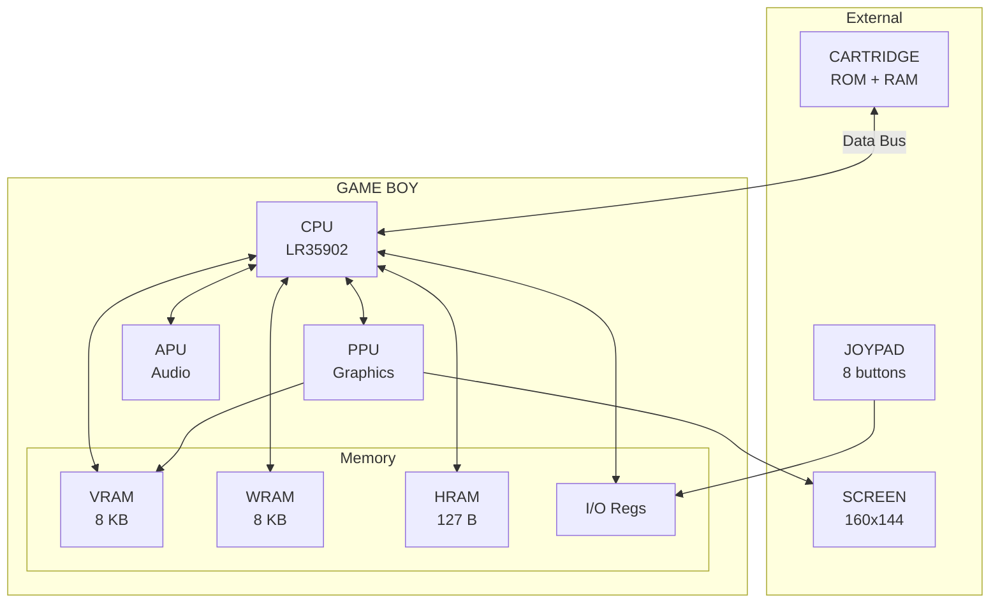

# System Architecture Reference

## The Complete Game Boy Hardware Map

---

This document provides a comprehensive reference for the Game Boy's hardware architecture. Keep it handy as you work through the tutorial as you'll refer to it constantly.

---

## Table of Contents

- [Hardware Overview](#hardware-overview)
- [The CPU](#the-cpu)
- [Memory Map](#memory-map)
- [I/O Registers](#io-registers)
- [Graphics System](#graphics-system)
- [Timing](#timing)
- [Emulator File Structure](#emulator-file-structure)

---

## Hardware Overview



### Component Summary

| Component | Description | Capacity |
|-----------|-------------|----------|
| CPU | Sharp LR35902 (Z80 derivative) | 4.19 MHz |
| PPU | Picture Processing Unit | Renders 160×144 @ 60 Hz |
| APU | Audio Processing Unit | 4 channels |
| WRAM | Work RAM | 8 KB |
| VRAM | Video RAM | 8 KB |
| HRAM | High RAM | 127 bytes |
| OAM | Object Attribute Memory | 160 bytes (40 sprites × 4) |
| Cartridge | External ROM/RAM | Varies (32 KB to 8 MB ROM) |

---

## The CPU

### Registers

The LR35902 has eight 8-bit registers that can be paired into four 16-bit registers:

```
┌─────────────────────────────────────────────────────────────────────────────┐
│                           CPU REGISTERS                                      │
├─────────────────────────────────────────────────────────────────────────────┤
│                                                                             │
│   8-bit registers:           16-bit pairs:                                  │
│   ┌─────┐ ┌─────┐           ┌─────────────┐                                │
│   │  A  │ │  F  │    ═══    │     AF      │  (Accumulator + Flags)         │
│   └─────┘ └─────┘           └─────────────┘                                │
│   ┌─────┐ ┌─────┐           ┌─────────────┐                                │
│   │  B  │ │  C  │    ═══    │     BC      │  (General purpose)             │
│   └─────┘ └─────┘           └─────────────┘                                │
│   ┌─────┐ ┌─────┐           ┌─────────────┐                                │
│   │  D  │ │  E  │    ═══    │     DE      │  (General purpose)             │
│   └─────┘ └─────┘           └─────────────┘                                │
│   ┌─────┐ ┌─────┐           ┌─────────────┐                                │
│   │  H  │ │  L  │    ═══    │     HL      │  (Memory pointer)              │
│   └─────┘ └─────┘           └─────────────┘                                │
│                                                                             │
│   Special registers:                                                        │
│   ┌─────────────────┐                                                      │
│   │       SP        │  Stack Pointer (16-bit)                              │
│   └─────────────────┘                                                      │
│   ┌─────────────────┐                                                      │
│   │       PC        │  Program Counter (16-bit)                            │
│   └─────────────────┘                                                      │
│                                                                             │
└─────────────────────────────────────────────────────────────────────────────┘
```

### The Flags Register (F)

```
Bit:  7   6   5   4   3   2   1   0
    ┌───┬───┬───┬───┬───┬───┬───┬───┐
    │ Z │ N │ H │ C │ 0 │ 0 │ 0 │ 0 │
    └───┴───┴───┴───┴───┴───┴───┴───┘
      │   │   │   │
      │   │   │   └── Carry flag
      │   │   └────── Half-carry flag (BCD)
      │   └────────── Subtract flag (BCD)
      └────────────── Zero flag
```

| Flag | Bit | Set When |
|------|-----|----------|
| Z (Zero) | 7 | Result is zero |
| N (Subtract) | 6 | Subtraction was performed |
| H (Half-carry) | 5 | Carry from bit 3 to 4 (BCD) |
| C (Carry) | 4 | Result overflowed 8 bits |

**Lower 4 bits are always 0.**

---

## Memory Map

The Game Boy has a 16-bit address bus, allowing access to 64 KB of memory. Different address ranges are mapped to different hardware:

```
┌─────────────────────────────────────────────────────────────────────────────┐
│                         MEMORY MAP (0x0000 - 0xFFFF)                        │
├─────────────────────────────────────────────────────────────────────────────┤
│                                                                             │
│   0xFFFF  ┌─────────────────────────────┐                                  │
│           │ IE - Interrupt Enable (1 B) │                                  │
│   0xFF80  ├─────────────────────────────┤                                  │
│           │ HRAM - High RAM (127 B)     │  Fast access area                │
│   0xFF00  ├─────────────────────────────┤                                  │
│           │ I/O Registers (128 B)       │  Hardware control                │
│   0xFEA0  ├─────────────────────────────┤                                  │
│           │ Unusable (96 B)             │                                  │
│   0xFE00  ├─────────────────────────────┤                                  │
│           │ OAM - Sprite Attributes     │  40 sprites × 4 bytes           │
│   0xE000  ├─────────────────────────────┤                                  │
│           │ Echo RAM (mirror of WRAM)   │  Don't use!                      │
│   0xC000  ├─────────────────────────────┤                                  │
│           │ WRAM - Work RAM (8 KB)      │  General purpose RAM             │
│   0xA000  ├─────────────────────────────┤                                  │
│           │ Cartridge RAM (if present)  │  External save RAM               │
│   0x8000  ├─────────────────────────────┤                                  │
│           │ VRAM - Video RAM (8 KB)     │  Tile data + maps                │
│   0x4000  ├─────────────────────────────┤                                  │
│           │ ROM Bank 1-N (16 KB)        │  Switchable banks                │
│   0x0000  ├─────────────────────────────┤                                  │
│           │ ROM Bank 0 (16 KB)          │  Always accessible               │
│           └─────────────────────────────┘                                  │
│                                                                             │
└─────────────────────────────────────────────────────────────────────────────┘
```

### Memory Map Table

| Start | End | Size | Description | Read/Write |
|-------|-----|------|-------------|------------|
| 0x0000 | 0x3FFF | 16 KB | ROM Bank 0 (fixed) | R |
| 0x4000 | 0x7FFF | 16 KB | ROM Bank 1-N (switchable) | R |
| 0x8000 | 0x9FFF | 8 KB | Video RAM (VRAM) | R/W |
| 0xA000 | 0xBFFF | 8 KB | External RAM (cartridge) | R/W |
| 0xC000 | 0xDFFF | 8 KB | Work RAM (WRAM) | R/W |
| 0xE000 | 0xFDFF | - | Echo RAM (don't use) | R/W |
| 0xFE00 | 0xFE9F | 160 B | OAM (sprite attributes) | R/W |
| 0xFEA0 | 0xFEFF | 96 B | Unusable | - |
| 0xFF00 | 0xFF7F | 128 B | I/O Registers | varies |
| 0xFF80 | 0xFFFE | 127 B | High RAM (HRAM) | R/W |
| 0xFFFF | 0xFFFF | 1 B | Interrupt Enable (IE) | R/W |

### VRAM Layout

```
┌─────────────────────────────────────────────────────────────────────────────┐
│                              VRAM (0x8000 - 0x9FFF)                         │
├─────────────────────────────────────────────────────────────────────────────┤
│                                                                             │
│   0x8000  ┌─────────────────────────────┐                                  │
│           │                             │                                  │
│           │  Tile Data Block 0          │  Tiles 0-127 (unsigned mode)     │
│           │  (2 KB: 128 tiles × 16 B)   │  or Tiles -128 to -1 (signed)    │
│   0x8800  ├─────────────────────────────┤                                  │
│           │                             │                                  │
│           │  Tile Data Block 1          │  Tiles 128-255 (unsigned)        │
│           │  (2 KB: 128 tiles × 16 B)   │  or Tiles 0-127 (signed)         │
│   0x9000  ├─────────────────────────────┤                                  │
│           │                             │                                  │
│           │  Tile Data Block 2          │  Tiles 0-127 (signed only)       │
│           │  (2 KB: 128 tiles × 16 B)   │                                  │
│   0x9800  ├─────────────────────────────┤                                  │
│           │                             │                                  │
│           │  Tile Map 0 (1 KB)          │  Background map 0                │
│           │  32×32 tile indices         │  (or Window map 0)               │
│   0x9C00  ├─────────────────────────────┤                                  │
│           │                             │                                  │
│           │  Tile Map 1 (1 KB)          │  Background map 1                │
│           │  32×32 tile indices         │  (or Window map 1)               │
│   0xA000  └─────────────────────────────┘                                  │
│                                                                             │
└─────────────────────────────────────────────────────────────────────────────┘
```

---

## I/O Registers

### Quick Reference

| Address | Name | Description |
|---------|------|-------------|
| 0xFF00 | JOYP | Joypad input |
| 0xFF01 | SB | Serial transfer data |
| 0xFF02 | SC | Serial transfer control |
| 0xFF04 | DIV | Divider register |
| 0xFF05 | TIMA | Timer counter |
| 0xFF06 | TMA | Timer modulo |
| 0xFF07 | TAC | Timer control |
| 0xFF0F | IF | Interrupt flag |
| 0xFF10-0xFF3F | - | Audio registers |
| 0xFF40 | LCDC | LCD control |
| 0xFF41 | STAT | LCD status |
| 0xFF42 | SCY | Background scroll Y |
| 0xFF43 | SCX | Background scroll X |
| 0xFF44 | LY | LCD Y coordinate (current scanline) |
| 0xFF45 | LYC | LY compare |
| 0xFF46 | DMA | OAM DMA transfer |
| 0xFF47 | BGP | Background palette |
| 0xFF48 | OBP0 | Sprite palette 0 |
| 0xFF49 | OBP1 | Sprite palette 1 |
| 0xFF4A | WY | Window Y position |
| 0xFF4B | WX | Window X position |
| 0xFFFF | IE | Interrupt enable |

### LCDC (0xFF40) - LCD Control

```
Bit 7: LCD enable (0=Off, 1=On)
Bit 6: Window tile map (0=0x9800, 1=0x9C00)
Bit 5: Window enable (0=Off, 1=On)
Bit 4: BG & Window tile data (0=0x8800, 1=0x8000)
Bit 3: BG tile map (0=0x9800, 1=0x9C00)
Bit 2: Sprite size (0=8×8, 1=8×16)
Bit 1: Sprite enable (0=Off, 1=On)
Bit 0: BG & Window enable/priority (0=Off, 1=On)
```

**Common values:**
- `0x91` = LCD on, BG on, sprites off (Step 1)
- `0x93` = LCD on, BG on, sprites on (Step 6+)

### BGP (0xFF47) - Background Palette

```
Bits 7-6: Color 3 (darkest in image)
Bits 5-4: Color 2
Bits 3-2: Color 1
Bits 1-0: Color 0 (lightest in image, or transparent)
```

**Common values:**
- `0xE4` = Normal palette (color 0=white, color 3=black)
- `0x1B` = Inverted palette (color 0=black, color 3=white)
- `0x03` = All dark (hack for black screen)

### JOYP (0xFF00) - Joypad

```
Bit 5: Select button keys (active low)
Bit 4: Select direction keys (active low)
Bit 3: Down / Start (active low)
Bit 2: Up / Select (active low)
Bit 1: Left / B (active low)
Bit 0: Right / A (active low)
```

**Reading buttons:**
1. Write `0x20` to select D-pad, read bits 0-3
2. Write `0x10` to select buttons, read bits 0-3

---

## Graphics System

### Tile Format (2bpp)

Each tile is 8×8 pixels, stored as 16 bytes (2 bytes per row):

```
Row N:  Byte 1 = bit 0 of each pixel
        Byte 2 = bit 1 of each pixel

Combined: Each pixel = (bit1 << 1) | bit0 = color index 0-3
```

Example for one row:

```
Byte 1: 0b00111100 = ░░███░░░  (low bits)
Byte 2: 0b01111110 = ░██████░  (high bits)

Combined:
Pixel:  0  1  2  3  4  5  6  7
Low:    0  0  1  1  1  1  0  0
High:   0  1  1  1  1  1  1  0
Color:  0  2  3  3  3  3  2  0
```

### Sprite Attributes (OAM)

Each sprite uses 4 bytes in OAM:

| Byte | Description |
|------|-------------|
| 0 | Y position (screen Y + 16) |
| 1 | X position (screen X + 8) |
| 2 | Tile index |
| 3 | Attributes (flags) |

Attribute flags:
```
Bit 7: Priority (0=above BG, 1=behind BG colors 1-3)
Bit 6: Y flip
Bit 5: X flip
Bit 4: Palette (0=OBP0, 1=OBP1)
Bits 3-0: Unused (DMG)
```

---

## Timing

### Clock Speeds

| Component | Speed |
|-----------|-------|
| CPU | 4.194304 MHz (4,194,304 Hz) |
| PPU | Same (1 dot per cycle) |
| Frame rate | 59.73 Hz |

### Frame Timing

```
┌─────────────────────────────────────────────────────────────────────────────┐
│                              FRAME TIMING                                    │
├─────────────────────────────────────────────────────────────────────────────┤
│                                                                             │
│   One frame = 70,224 CPU cycles = 154 scanlines                            │
│                                                                             │
│   Scanlines 0-143:   Visible (LCD rendering)                               │
│   Scanlines 144-153: VBlank (safe to modify VRAM/OAM)                      │
│                                                                             │
│   ┌─────────────────────────────────────────────────────────────────┐      │
│   │░░░░░░░░░░░░░░░░░░░░░░░░░░░░░░░░░░░░░░░░░░░░░░░░░░░░░░░░░░░░░░░│      │
│   │░░░░░░░░░░░░░░░░░░░░░░░░░░░░░░░░░░░░░░░░░░░░░░░░░░░░░░░░░░░░░░░│      │
│   │░░░░░░░░░░░░░░░░░░ VISIBLE ░░░░░░░░░░░░░░░░░░░░░░░░░░░░░░░░░░░░│      │
│   │░░░░░░░░░░░░░░░░░░ (144 lines) ░░░░░░░░░░░░░░░░░░░░░░░░░░░░░░░░│      │
│   │░░░░░░░░░░░░░░░░░░░░░░░░░░░░░░░░░░░░░░░░░░░░░░░░░░░░░░░░░░░░░░░│      │
│   ├─────────────────────────────────────────────────────────────────┤      │
│   │                   VBLANK (10 lines)                             │      │
│   │             Safe to modify VRAM and OAM                         │      │
│   └─────────────────────────────────────────────────────────────────┘      │
│                                                                             │
│   Per scanline: 456 cycles                                                  │
│     Mode 2 (OAM scan): 80 cycles                                           │
│     Mode 3 (Drawing):  168-291 cycles (varies)                             │
│     Mode 0 (HBlank):   85-208 cycles (remainder)                           │
│                                                                             │
└─────────────────────────────────────────────────────────────────────────────┘
```

### Cycles per Frame

```
Visible:  144 scanlines × 456 cycles = 65,664 cycles
VBlank:   10 scanlines × 456 cycles  = 4,560 cycles
Total:    154 scanlines × 456 cycles = 70,224 cycles

Frames per second: 4,194,304 / 70,224 ≈ 59.73 FPS
```

---

## Emulator File Structure

Our emulator is organized as follows:

```
edu/
├── PREFACE.md           # Introduction and context
├── ARCHITECTURE.md      # This file
├── TESTING.md           # Test ROM guide
├── EXERCISES.md         # Practice challenges
│
├── step0/               # Step 0 (introduction)
│   └── BOOK.md
│
├── step1/               # Step 1 (black screen)
│   ├── BOOK.md
│   ├── emulator/
│   │   └── main.go
│   └── game/
│       └── generate_minimal_rom.go
│
├── step2/               # Step 2 (checkerboard)
│   ├── BOOK.md
│   ├── emulator/
│   └── game/
│
├── step3/               # Step 3 (HI text, loops)
├── step4/               # Step 4 (input)
├── step5/               # Step 5 (scrolling)
├── step6/               # Step 6 (sprites)
├── step7/               # Step 7 (VBlank)
├── step8/               # Step 8 (mini-game)
├── step9/               # Step 9 (audio)
├── step10/              # Step 10 (ROM analysis)
│   ├── BOOK.md
│   └── tools/
│       └── analyze_rom.go
├── step11+              # Step 11+ (Tetris and beyond)
└── ...
```

### Code Architecture (Conceptual)

Even if we keep everything in one file for simplicity, here's the logical separation:

```
┌─────────────────────────────────────────────────────────────────────────────┐
│                           EMULATOR ARCHITECTURE                              │
├─────────────────────────────────────────────────────────────────────────────┤
│                                                                             │
│   ┌─────────────────┐                                                       │
│   │   main.go       │  Entry point, Ebitengine integration, main loop      │
│   └────────┬────────┘                                                       │
│            │                                                                │
│            ▼                                                                │
│   ┌────────────────────────────────────────────────────────────────────┐   │
│   │                         GameBoy struct                              │   │
│   │  ┌──────────┐  ┌──────────┐  ┌──────────┐  ┌──────────┐           │   │
│   │  │   CPU    │  │   MMU    │  │   GPU    │  │  Joypad  │           │   │
│   │  │          │  │          │  │          │  │          │           │   │
│   │  │ Registers│  │ Memory   │  │ Tiles    │  │ Buttons  │           │   │
│   │  │ PC, SP   │  │ Mapping  │  │ Sprites  │  │ State    │           │   │
│   │  │ Flags    │  │ I/O Regs │  │ Render   │  │          │           │   │
│   │  └──────────┘  └──────────┘  └──────────┘  └──────────┘           │   │
│   │                                                                     │   │
│   │  RunFrame() → Execute instructions → Render → Display              │   │
│   └────────────────────────────────────────────────────────────────────┘   │
│                                                                             │
└─────────────────────────────────────────────────────────────────────────────┘
```

---

## Quick Reference Cards

### Opcode Categories

| Range | Category |
|-------|----------|
| 0x00-0x3F | Misc, loads, inc/dec, rotates |
| 0x40-0x7F | LD r,r (register to register) |
| 0x80-0xBF | ALU operations (ADD, SUB, AND, OR, XOR, CP) |
| 0xC0-0xFF | Control flow, stack, misc |
| 0xCB xx | CB-prefixed (bit operations) |

### Common Instruction Patterns

```asm
; Load immediate value
LD A, $42       ; A = 0x42

; Write to I/O register
LD A, $E4       ; Value to write
LDH ($47), A    ; Write to BGP

; Memory copy loop
LD HL, $8000    ; Destination
LD DE, $0200    ; Source
LD B, $10       ; Count
.loop:
  LD A, (DE)    ; Read byte
  LD (HL+), A   ; Write byte, inc HL
  INC DE        ; Inc source
  DEC B         ; Dec counter
  JR NZ, .loop  ; Loop if not zero

; Conditional check
LDH A, ($00)    ; Read JOYP
AND $01         ; Test bit 0
JR NZ, .skip    ; Skip if not pressed
; ... handle button ...
.skip:
```

---

---

## Memory Bank Controllers (MBCs)

### Why MBCs Exist

The Game Boy CPU has a 16-bit address bus, limiting addressable memory to 64KB. With VRAM, WRAM, and I/O taking up space, only 32KB is available for ROM. MBCs allow cartridges to hold much more by bank-switching.

### Cartridge Header Detection

| Address | Purpose |
|---------|---------|
| 0x0147 | Cartridge type (MBC) |
| 0x0148 | ROM size |
| 0x0149 | RAM size |

### Cartridge Types

| Value | Type | Features |
|-------|------|----------|
| 0x00 | ROM ONLY | No MBC needed |
| 0x01-0x03 | MBC1 | Up to 2MB ROM, 32KB RAM |
| 0x05-0x06 | MBC2 | 256KB ROM, 512x4 RAM |
| 0x0F-0x13 | MBC3 | 2MB ROM, 32KB RAM, RTC |
| 0x19-0x1E | MBC5 | 8MB ROM, 128KB RAM |

### MBC1 Register Map

```
┌─────────────────────────────────────────────────────────────────────────────┐
│                              MBC1 REGISTERS                                  │
├─────────────────────────────────────────────────────────────────────────────┤
│                                                                             │
│   WRITE to 0x0000-0x1FFF: RAM Enable                                       │
│   • Value 0x0A (lower nibble) = Enable RAM                                 │
│   • Any other value = Disable RAM                                          │
│                                                                             │
│   WRITE to 0x2000-0x3FFF: ROM Bank Number (lower 5 bits)                   │
│   • Bits 0-4 select ROM bank at 0x4000-0x7FFF                             │
│   • Value 0x00 maps to 0x01 (bank 0 always at 0x0000)                     │
│                                                                             │
│   WRITE to 0x4000-0x5FFF: RAM Bank / Upper ROM bits                        │
│   • Mode 0: Upper 2 bits of ROM bank (bits 5-6)                           │
│   • Mode 1: RAM bank number (0-3)                                          │
│                                                                             │
│   WRITE to 0x6000-0x7FFF: Banking Mode                                     │
│   • 0 = ROM Banking Mode (default)                                         │
│   • 1 = RAM Banking Mode                                                   │
│                                                                             │
└─────────────────────────────────────────────────────────────────────────────┘
```

### MBC3 Register Map (with RTC)

```
┌─────────────────────────────────────────────────────────────────────────────┐
│                              MBC3 REGISTERS                                  │
├─────────────────────────────────────────────────────────────────────────────┤
│                                                                             │
│   WRITE to 0x0000-0x1FFF: RAM/RTC Enable                                   │
│   • Value 0x0A = Enable RAM and RTC                                        │
│                                                                             │
│   WRITE to 0x2000-0x3FFF: ROM Bank Number (7 bits)                         │
│   • Bits 0-6 select ROM bank (0x00 maps to 0x01)                          │
│                                                                             │
│   WRITE to 0x4000-0x5FFF: RAM Bank / RTC Register Select                   │
│   • 0x00-0x03: RAM bank                                                    │
│   • 0x08: RTC Seconds (0-59)                                               │
│   • 0x09: RTC Minutes (0-59)                                               │
│   • 0x0A: RTC Hours (0-23)                                                 │
│   • 0x0B: RTC Day Counter Low (8 bits)                                     │
│   • 0x0C: RTC Day Counter High + Halt + Carry                              │
│                                                                             │
│   WRITE to 0x6000-0x7FFF: Latch Clock Data                                 │
│   • Write 0x00 then 0x01 to latch current RTC values                       │
│                                                                             │
└─────────────────────────────────────────────────────────────────────────────┘
```

### ROM Size Codes

| Code | Size | Banks |
|------|------|-------|
| 0x00 | 32KB | 2 |
| 0x01 | 64KB | 4 |
| 0x02 | 128KB | 8 |
| 0x03 | 256KB | 16 |
| 0x04 | 512KB | 32 |
| 0x05 | 1MB | 64 |
| 0x06 | 2MB | 128 |
| 0x07 | 4MB | 256 |
| 0x08 | 8MB | 512 |

### RAM Size Codes

| Code | Size |
|------|------|
| 0x00 | None |
| 0x02 | 8KB |
| 0x03 | 32KB |
| 0x04 | 128KB |
| 0x05 | 64KB |

---

---

## Advanced: Cycle-Exact PPU Architecture

This section documents the architectural changes required to achieve 100% Mooneye test pass rate. The current emulator achieves 97% (58/62 tests) with M-cycle granularity. The remaining 4 tests require T-cycle (dot-level) precision.

### Current vs Required Architecture

```
┌─────────────────────────────────────────────────────────────────────────────┐
│                    ARCHITECTURE COMPARISON                                   │
├─────────────────────────────────────────────────────────────────────────────┤
│                                                                             │
│   CURRENT (97% Accuracy)              REQUIRED (100% Accuracy)             │
│   ──────────────────────              ────────────────────────             │
│                                                                             │
│   M-cycle granularity (4 T's)         T-cycle granularity (1 dot)          │
│   Mode 3 length pre-computed          Mode 3 length from FIFO              │
│   Register reads at M-boundary        Register reads at specific T         │
│   Loosely coupled timing              Precisely synchronized timing        │
│   Single-file structure               Modular component structure          │
│                                                                             │
│   Pass: 58/62 tests                   Pass: 62/62 tests                    │
│   Complexity: ~7,000 lines            Complexity: ~10,000+ lines           │
│   Performance: Fast                   Performance: 20-40% slower           │
│                                                                             │
└─────────────────────────────────────────────────────────────────────────────┘
```

### Pixel FIFO State Machine

The PPU uses two 8-pixel FIFOs for rendering:

```
┌─────────────────────────────────────────────────────────────────────────────┐
│                         PIXEL PIPELINE                                       │
├─────────────────────────────────────────────────────────────────────────────┤
│                                                                             │
│   Background Fetcher (8 dots per tile):                                     │
│   ┌─────────┐  ┌─────────┐  ┌─────────┐  ┌─────────┐                       │
│   │GetTile  │─▶│GetLow   │─▶│GetHigh  │─▶│Push     │                       │
│   │(2 dots) │  │(2 dots) │  │(2 dots) │  │(2 dots) │                       │
│   └─────────┘  └─────────┘  └─────────┘  └─────────┘                       │
│         │                                     │                             │
│         └──────────────────◀──────────────────┘                             │
│                                                                             │
│   Background FIFO:                                                          │
│   ┌───┬───┬───┬───┬───┬───┬───┬───┐                                        │
│   │ 7 │ 6 │ 5 │ 4 │ 3 │ 2 │ 1 │ 0 │ ──▶ Pixel Mixer ──▶ Screen            │
│   └───┴───┴───┴───┴───┴───┴───┴───┘         ▲                              │
│                                              │                              │
│   Sprite FIFO (when sprite at current X):   │                              │
│   ┌───┬───┬───┬───┬───┬───┬───┬───┐        │                              │
│   │ 7 │ 6 │ 5 │ 4 │ 3 │ 2 │ 1 │ 0 │ ───────┘                              │
│   └───┴───┴───┴───┴───┴───┴───┴───┘                                        │
│                                                                             │
│   Mode 3 ends when ScreenX reaches 160 (160 pixels pushed)                 │
│   Sprite fetches stall the pipeline (6-11 dots penalty)                    │
│                                                                             │
└─────────────────────────────────────────────────────────────────────────────┘
```

### Sprite Penalty Calculation

Sprite fetch penalty depends on background fetcher state when sprite is encountered:

```
Sprite at screen X:
├── BG fetcher at dot N of 8-dot cycle
├── Wait (8 - N) dots for BG fetch to complete
├── Then 6 dots for sprite tile fetch
└── Total penalty: (8 - N) + 6 = 6-14 dots

Multiple sprites on same BG tile share initial wait penalty.
```

### Sub-M-Cycle Bus Timing

Different instructions sample data at different T-cycles within an M-cycle:

```
┌─────────────────────────────────────────────────────────────────────────────┐
│                      M-CYCLE BUS TIMING                                      │
├─────────────────────────────────────────────────────────────────────────────┤
│                                                                             │
│   M-cycle (4 T-cycles):                                                     │
│   ┌───────┬───────┬───────┬───────┐                                        │
│   │  T0   │  T1   │  T2   │  T3   │                                        │
│   └───────┴───────┴───────┴───────┘                                        │
│      │       │       │       │                                              │
│      │       │       │       └── Data latched (typical)                     │
│      │       │       └────────── Read signal stable                         │
│      │       └────────────────── Address stable                             │
│      └────────────────────────── Address presented                          │
│                                                                             │
│   For timing-sensitive PPU registers (FF40-FF4B):                          │
│   - PPU state changes at each T-cycle                                       │
│   - Sample point determines which state is seen                             │
│   - Tests probe specific T-cycle behavior                                   │
│                                                                             │
└─────────────────────────────────────────────────────────────────────────────┘
```

### Coupled Timing Systems

Three PPU timing systems must be precisely synchronized:

| System | Updates At | Notes |
|--------|-----------|-------|
| STAT mode bits | Mode transition dots | May have delay from actual mode |
| Memory blocking | OAM: Mode 2+3, VRAM: Mode 3 | Windows may differ from STAT |
| LY register | Dot 452 (4 dots early) | Line 153 has special handling |

### LCD Enable Special Case (Line 0)

When LCD is enabled, line 0 has special timing:

```
Normal scanline:      Mode 2 (80) → Mode 3 (variable) → Mode 0 (rest)
Line 0 after enable:  Mode 0 (80) → Mode 3 (variable) → Mode 0 (rest)

Key differences:
- No OAM scan (Mode 2) on first line
- Starts in Mode 0, not Mode 2
- STAT reads may show different values
- OAM/VRAM blocking timing differs
```

### T-Cycle Level Core Loop

Required loop structure for 100% accuracy:

```go
func (gb *GameBoy) tickTCycle() {
    // 1. PPU advances exactly 1 dot
    gb.PPU.TickDot()
    
    // 2. Timer updates (DIV edges matter)
    gb.Timer.TickT()
    
    // 3. DMA advances if active
    if gb.DMA.Active {
        gb.DMA.TickT()
    }
    
    // 4. Update memory blocking state
    gb.Bus.UpdateBlocking(&gb.PPU)
}

func (gb *GameBoy) tickMCycle() {
    gb.tickTCycle()
    gb.tickTCycle()
    gb.tickTCycle()
    gb.tickTCycle()
}
```

### Failing Tests and Root Causes

| Test | Root Cause | Fix Required |
|------|-----------|--------------|
| `intr_2_mode0_timing_sprites` | Sprite penalty timing | True FIFO with dynamic Mode 3 end |
| `lcdon_timing-GS` | Line 0 first dot handling | Process-then-increment loop |
| `lcdon_write_timing-GS` | Write timing after LCD enable | Sub-M-cycle write handling |
| `stat_lyc_onoff` | LYC during LCD toggle | Precise STAT line synchronization |

### Performance Considerations

| Metric | M-cycle | T-cycle | Ratio |
|--------|---------|---------|-------|
| PPU calls/frame | ~17,556 | ~70,224 | 4x |
| Mode checks/frame | ~17,556 | ~70,224 | 4x |
| FIFO operations | 0 | ~23,040 | - |
| Expected slowdown | - | 20-40% | - |

Mitigation strategies:
- Inline critical paths
- Use lookup tables for fetcher states
- Batch operations where precision allows
- Profile-guided optimization

---

*This document is a living reference. Refer to it as you progress through the tutorial.*

