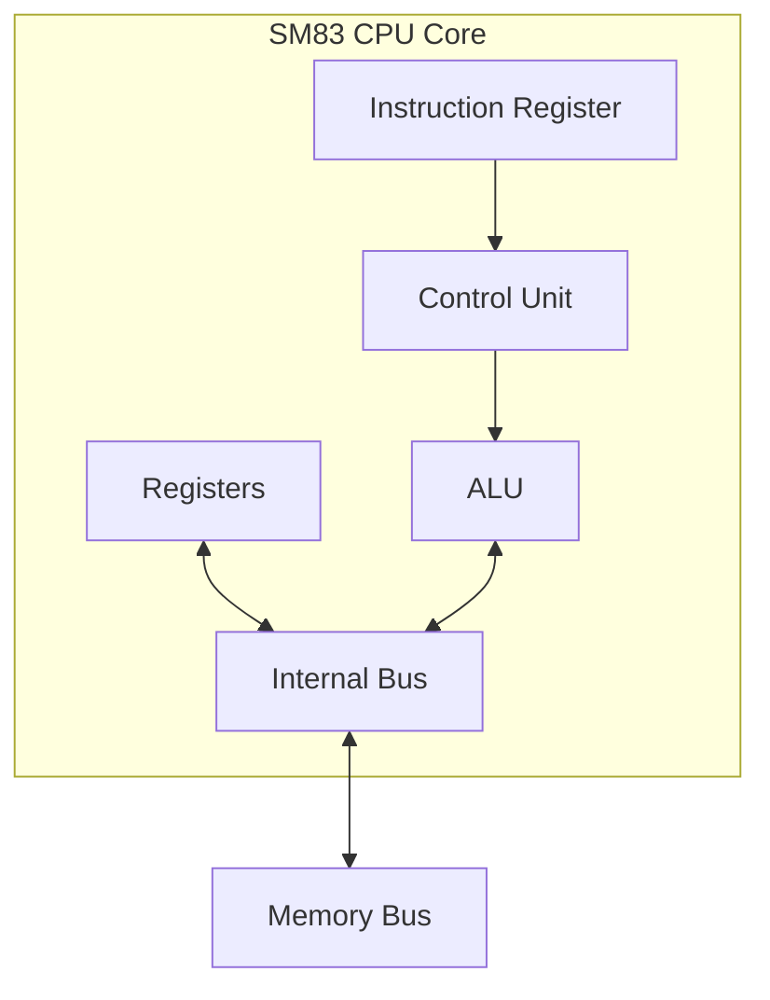

```
  ____                         ____                   
 / ___| __ _ _ __ ___   ___   | __ )  ___  _   _      
| |  _ / _` | '_ ` _ \ / _ \  |  _ \ / _ \| | | |     
| |_| | (_| | | | | | |  __/  | |_) | (_) | |_| |     
 \____|\__,_|_| |_| |_|\___|  |____/ \___/ \__, |     
                                           |___/      
  ____                      _      _       
 / ___|___  _ __ ___  _ __ | | ___| |_ ___ 
| |   / _ \| '_ ` _ \| '_ \| |/ _ \ __/ _ \
| |__| (_) | | | | | | |_) | |  __/ ||  __/
 \____\___/|_| |_| |_| .__/|_|\___|\__\___|
                     |_|                   
 _____         _           _           _ 
|_   _|__  ___| |__  _ __ (_) ___ __ _| |
  | |/ _ \/ __| '_ \| '_ \| |/ __/ _` | |
  | |  __/ (__| | | | | | | | (_| (_| | |
  |_|\___|\____|_| |_|_| |_|_|\___\__,_|_|
 ____       __                              
|  _ \ ___ / _| ___ _ __ ___ _ __   ___ ___ 
| |_) / _ \ |_ / _ \ '__/ _ \ '_ \ / __/ _ \
|  _ <  __/  _|  __/ | |  __/ | | | (_|  __/
|_| \_\___|_|  \___|_|  \___|_| |_|\___\___|
```

## Game Boy: Complete Technical Reference

gekkio https://gekkio.fi August 23, 2025

Revision 176

```
  ____  ____   ____ _____ ____  
 / ___|/ ___| | __ )_   _|  _ \ 
| |  _| |  _  |  _ \ | | | |_) |
| |_| | |_| | | |_) || | |  _ < 
 \____|\____| |____/ |_| |_| \_\
```

## Preface

|  Caveat                                                                                                                                                                                                                                                                               |
|----------------------------------------------------------------------------------------------------------------------------------------------------------------------------------------------------------------------------------------------------------------------------------------|
| IMPORTANT: This document focuses at the moment on 1st and 2nd generation devices (models beforetheGame Boy Color), and some hardware details are very different in later generations. Be very careful if you make assumptions about later gen- eration devices based on this document! |

## How to read this document

##  Speculation

This is something that hasn't been verified, but would make a lot of sense.

##  Caveat

This explains some caveat about this documentation that you should know.

```
  /!\
 /___\
  WARNING
```

##  Warning

This is a warning about something.

## 0.1 Formatting of numbers

When a single bit is discussed in isolation, the value looks like this: 0 , 1 .

Binary numbers are prefixed with 0b like  this: 0b0101101 , 0b11011 , 0b00000000 .  Values  are prefixed with zeroes when necessary, so the total number of digits always matches the number of digits in the value.

Hexadecimal numbers are prefixed with 0x like this: 0x1234 , 0xDEADBEEF , 0xFF04 . Values are prefixed with zeroes when necessary, so the total number of characters always matches the number of nibbles in the value.

Examples:

4-bit

8-bit

16-bit

Binary

0b0101

0b10100101

0b0000101010100101

Hexadecimal

0x5

0xA5

0x0AA5

## 0.2 Register definitions

Register 0.1: 0x1234 - This is a hardware register definition

| R/W-0      | R/W-1      | U-1   | R-0         | R-1         | R-x         | W-1   | U-0   |
|------------|------------|-------|-------------|-------------|-------------|-------|-------|
| VALUE<1:0> | VALUE<1:0> |       | BIGVAL<7:5> | BIGVAL<7:5> | BIGVAL<7:5> | FLAG  |       |
| bit 7      | 6          | 5     | 4           | 3           | 2           | 1     | bit 0 |

## Top row legend:

- R Bit can be read.
- W Bit can be written. If the bit cannot be read, reading returns a constant value defined in the bit list of the register in question.
- U Unimplemented bit. Writing has no effect, and reading returns a constant value defined in the bit list of the register in question.
- -n Value after system reset: 0 , 1 , or x.
- 1 Bit is set.
- 0 Bit is cleared.
- x Bit is unknown (e.g. depends on external things such as user input)

## Middle row legend:

| VALUE<1:0>   | Bits 1 and 0 of VALUE   |
|--------------|-------------------------|
|              | Unimplemented bit       |
| BIGVAL<7:5>  | Bits 7, 6, 5 of BIGVAL  |
| FLAG         | Single-bit value FLAG   |

## In this example:

- After system reset, VALUE is 0b01 , BIGVAL is either 0b010 or 0b011 , FLAG is 0b1 .
- Bits 5 and 0 are unimplemented. Bit 5 always returns 1 , and bit 0 always returns 0 .
- Both bits of VALUE can be read and written. When this register is written, bit 7 of the written value goes to bit 1 of VALUE.
- FLAG can only be written to, so reads return a value that is defined elsewhere.
- BIGVAL cannot be written to. Only bits 5-7 of BIGVAL are defined here, so look elsewhere for the low bits 0-4.

## Contents

| Preface . . . . . . . . . . . . . . . . . . . . . . . . . . . . . . .                                                          | . . 2     |
|--------------------------------------------------------------------------------------------------------------------------------|-----------|
| How to read this document . . . . . . . . . . . . . . . . . . .                                                                | . . 3     |
| 0.1 Formatting of numbers . . . . . . . . . . . . . . . . . . .                                                                | . . 3     |
| 0.2 Register definitions . . . . . . . . . . . . . . . . . . . . . .                                                           | . . 4     |
| Contents . . . . . . . . . . . . . . . . . . . . . . . . . . . . . . .                                                         | . . 5     |
| I Game Boy console architecture . . . . . . . . . . . . . . . .                                                                | . . 9     |
| 1 Introduction . . . . . . . . . . . . . . . . . . . . . . . . . . .                                                           | . 10      |
| 2 Clocks . . . . . . . . . . . . . . . . . . . . . . . . . . . . . . .                                                         | . 12      |
| 2.1 System clock . . . . . . . . . . . . . . . . . . . . . . . . . .                                                           | . 12      |
| System clock frequency . . . . . . . . . . . . . . . . . . . .                                                                 | . 12      |
| 2.2 Clock periods, T-cycles, and M-cycles . . . . . . . . . . . .                                                              | . 12      |
| II Sharp SM83 CPU core . . . . . . . . . . . . . . . . . . . . . .                                                             | . 14      |
| 3 Introduction . . . . . . . . . . . . . . . . . . . . . . . . . . .                                                           | . 15      |
| 3.1 History . . . . . . . . . . . . . . . . . . . . . . . . . . . . .                                                          | . 15      |
| 4 Simple model . . . . . . . . . . . . . . . . . . . . . . . . . . .                                                           | . 16      |
| 5 CPU core timing . . . . . . . . . . . . . . . . . . . . . . . . .                                                            | . 17      |
| 5.1 Fetch/execute overlap . . . . . . . . . . . . . . . . . . . .                                                              | . 17      |
| Fetch/execute overlap timing example . . . . . . . . . . .                                                                     | . 17      |
| 6 Sharp SM83 instruction set . . . . . . . . . . . . . . . . . .                                                               | . 19      |
| 6.1 Overview . . . . . . . . . . . . . . . . . . . . . . . . . . . .                                                           | . 19      |
| CB opcode prefix . . . . . . . . . . . . . . . . . . . . . . . . Undefined opcodes . . . . . . . . . . . . . . . . . . . . . . | . 19 . 19 |
| 6.2 8-bit load instructions . . . . . . . . . . . . . . . . . . . .                                                            | . 20      |
| LD r , r': Load register (register) . . . . . . . . . . . . . . . .                                                            | . 20      |
| LD r , n: Load register (immediate) . . . . . . . . . . . . . .                                                                | . 21      |
| LD r , (HL): Load register (indirect HL) . . . . . . . . . . . .                                                               | . 22      |
| LD (HL), r: Load from register (indirect HL) . . . . . . . . .                                                                 | . 23      |
| LD (HL), n: Load from immediate data (indirect HL) . . . .                                                                     | . 24      |
| LD A, (BC): Load accumulator (indirect BC) . . . . . . . . .                                                                   | . 25      |
| LD A, (DE): Load accumulator (indirect DE) . . . . . . . . .                                                                   | . 26      |
| LD (BC), A: Load from accumulator (indirect BC) . . . . . .                                                                    | . 27      |
| LD (DE), A: Load from accumulator (indirect DE) . . . . . .                                                                    | . 28      |
| LD A, (nn): Load accumulator (direct) . . . . . . . . . . . .                                                                  | . 29      |
| LD (nn), A: Load from accumulator (direct) . . . . . . . . .                                                                   | . 30      |
| LDH A, (C): Load accumulator (indirect 0xFF00 +C) . . . . .                                                                    | . 31      |
| LDH (C), A: Load from accumulator (indirect 0xFF00 +C) . . . .                                                                 | . 32      |
| LDH A, (n): Load accumulator (direct 0xFF00 +n) . . .                                                                          | 33        |
| . LDH (n), A: Load from accumulator (direct 0xFF00                                                                             | . .       |
| +n) . . .                                                                                                                      | 34        |
| LD A, (HL-): Load accumulator (indirect HL, decrement) . . LD (HL-), A: Load from accumulator (indirect HL, decrement)         | . 35 . 36 |
| LD A, (HL+): Load accumulator (indirect HL, increment) . .                                                                     | . 37      |
| LD (HL+), A: Load from accumulator (indirect HL, increment) . . . . . . . . . .                                                | . 38      |
| 6.3 16-bit load instructions . . . . . . . . . .                                                                               | . 39      |
| LD rr , nn: Load 16-bit register / register pair . . . . . . . .                                                               | . 39      |

| LD (nn), SP: Load from stack pointer (direct) . . .                                                         | . 40      |
|-------------------------------------------------------------------------------------------------------------|-----------|
| LD SP, HL: Load stack pointer from HL . . . . . .                                                           | . 41      |
| PUSH rr: Push to stack . . . . . . . . . . . . . . . .                                                      | . 42      |
| POP rr: Pop from stack . . . . . . . . . . . . . . .                                                        | . 43      |
| LD HL, SP+e: Load HL from adjusted stack pointer                                                            | . 44      |
| 6.4 8-bit arithmetic and logical instructions . . . . .                                                     | . 45      |
| ADD r: Add (register) . . . . . . . . . . . . . . . . .                                                     | . 45      |
| ADD (HL): Add (indirect HL) . . . . . . . . . . . . .                                                       | . 46      |
| ADD n: Add (immediate) . . . . . . . . . . . . . .                                                          | . 47      |
| ADC r: Add with carry (register) . . . . . . . . . .                                                        | . 48      |
| ADC (HL): Add with carry (indirect HL) . . . . . . .                                                        | . 49      |
| ADC n: Add with carry (immediate) . . . . . . . .                                                           | . 50      |
| SUB r: Subtract (register) . . . . . . . . . . . . . .                                                      | . 51      |
| SUB (HL): Subtract (indirect HL) . . . . . . . . . .                                                        | . 52      |
| SUB n: Subtract (immediate) . . . . . . . . . . . .                                                         | . 53      |
| SBC r: Subtract with carry (register) . . . . . . . .                                                       | . 54      |
| SBC (HL): Subtract with carry (indirect HL) . . . .                                                         | . 55      |
| SBC n: Subtract with carry (immediate) . . . . . .                                                          | . 56      |
| CP r: Compare (register) . . . . . . . . . . . . . . .                                                      | . 57      |
| CP (HL): Compare (indirect HL) . . . . . . . . . . .                                                        | . 58      |
| CP n: Compare (immediate) . . . . . . . . . . . .                                                           | . 59      |
| INC r: Increment (register) . . . . . . . . . . . . .                                                       | . 60      |
| INC (HL): Increment (indirect HL) . . . . . . . . . .                                                       | . 61      |
| DEC r: Decrement (register) . . . . . . . . . . . . .                                                       | . 62      |
| DEC (HL): Decrement (indirect HL) . . . . . . . . .                                                         | . 63      |
| AND r: Bitwise AND (register) . . . . . . . . . . . .                                                       | . 64      |
| AND (HL): Bitwise AND (indirect HL) . . . . . . . .                                                         | . 65      |
| AND n: Bitwise AND (immediate) . . . . . . . . . .                                                          | . 66      |
| OR r: Bitwise OR (register) . . . . . . . . . . . . . OR (HL): Bitwise OR (indirect HL) . . . . . . . . . . | . 67 . 68 |
| OR n: Bitwise OR (immediate) . . . . . . . .                                                                | .         |
| . . .                                                                                                       | 69        |
| XOR r: Bitwise XOR (register) . . . . . . . . . . . .                                                       | . 70      |
| XOR (HL): Bitwise XOR (indirect HL) . . . . . . . .                                                         | . 71      |
| XOR n: Bitwise XOR (immediate) . . . . . . . . . .                                                          | . 72      |
| CCF: Complement carry flag . . . . . . . . . . . .                                                          | . 73      |
| SCF: Set carry flag . . . . . . . . . . . . . . . . . .                                                     | . 74      |
| DAA: Decimal adjust accumulator . . . . . . . . .                                                           | . 75      |
| CPL: Complement accumulator . . . . . . . . . .                                                             | . 76      |
| 6.5 16-bit arithmetic instructions . . . . . . . . . . .                                                    | . 77      |
| INC rr: Increment 16-bit register . . . . . . . . . .                                                       | . 77      |
| DEC rr: Decrement 16-bit register . . . . . . . . .                                                         | . 78      |
| ADD HL, rr: Add (16-bit register) . . . . . . . . . .                                                       | . 79      |
| ADD SP, e: Add to stack pointer (relative) . . . . .                                                        | . 80      |
| 6.6 Rotate, shift, and bit operation instructions . . .                                                     | . 82      |
| RLCA: Rotate left circular (accumulator) . . . . . . RRCA: Rotate right circular (accumulator) . . . . .    | . 82 . 83 |
| RRA: Rotate right (accumulator) . . . . . . . . . .                                                         | . 85      |
| RLC r: Rotate left circular (register) . . . . . . . .                                                      | . 86      |

| RLC (HL): Rotate left circular (indirect HL) .     | . . 87    |
|----------------------------------------------------|-----------|
| RRC r: Rotate right circular (register) . . . .    | . . 89    |
| RRC (HL): Rotate right circular (indirect HL)      | . . 90    |
| RL r: Rotate left (register) . . . . . . . . . .   | . . 92    |
| RL (HL): Rotate left (indirect HL) . . . . . . .   | . . 93    |
| RR r: Rotate right (register) . . . . . . . . .    | . . 95    |
| RR (HL): Rotate right (indirect HL) . . . . . .    | . . 96    |
| SLA r: Shift left arithmetic (register) . . . .    | . . 98    |
| SLA (HL): Shift left arithmetic (indirect HL) .    | . . 99    |
| SRA r: Shift right arithmetic (register) . . .     | . 101     |
| SRA (HL): Shift right arithmetic (indirect HL)     | . 102     |
| SWAP r: Swap nibbles (register) . . . . . . .      | . 104     |
| SWAP (HL): Swap nibbles (indirect HL) . . .        | . 105     |
| SRL r: Shift right logical (register) . . . . . .  | . 106     |
| SRL (HL): Shift right logical (indirect HL) . .    | . 107     |
| BIT b, r: Test bit (register) . . . . . . . . . .  | . 109     |
| BIT b, (HL): Test bit (indirect HL) . . . . . .    | . 110     |
| RES b, r: Reset bit (register) . . . . . . . . .   | . 111     |
| RES b, (HL): Reset bit (indirect HL) . . . . .     | . 112     |
| SET b, r: Set bit (register) . . . . . . . . . . . | . 113     |
| SET b, (HL): Set bit (indirect HL) . . . . . . .   | . 114     |
| 6.7 Control flow instructions . . . . . . . . . .  | . 116     |
| JP nn: Jump . . . . . . . . . . . . . . . . . .    | . 116     |
| JP HL: Jump to HL . . . . . . . . . . . . . . .    | . 117     |
| JP cc, nn: Jump (conditional) . . . . . . . . .    | . 118     |
| JR e: Relative jump . . . . . . . . . . . . . .    | . 120     |
| JR cc, e: Relative jump (conditional) . . . . .    | . 121     |
| CALL nn: Call function . . . . . . . . . . . .     | . 123 124 |
| CALL cc, nn: Call function (conditional) . . .     | .         |
| RET: Return from function . . . . . . . . . .      | . 126     |
| RETI: Return from interrupt handler . . . .        | . 128     |
| RST n: Restart / Call function (implied) . . .     | . 129     |
| 6.8 Miscellaneous instructions . . . . . . . . .   | . 130     |
| HALT: Halt system clock . . . . . . . . . .        | . 130     |
| . STOP: Stop system and main clocks . . . .        | . 130     |
| DI: Disable interrupts . . . . . . . . . . . .     | . 130     |
| EI: Enable interrupts . . . . . . . . . . . . .    | . 131     |
| NOP: No operation . . . . . . . . . . . . . .      | . 132     |
| 7 BootROM . . . . . . . . . . . . . . . . . . .    | . 135     |
| . 7.1 Boot ROM types . . . . . . . . . . . . . . . | . 136     |
| DMGboot ROM . . . . . . . . . . . . . . . .        | . 136     |
| MGB boot ROM . . . . . . . . . . . . . . . .       | . 136     |
| SGB boot ROM . . . . . . . . . . . . . . . .       | . 136     |
| SGB2 boot ROM . . . . . . . . . . . . . . . .      | . 136     |
| Early DMGboot ROM ('DMG0') . . . . . . .           | . 136     |
| 8 DMA(Direct Memory Access) . . . . . . . . .      | . 137     |

| 8.1 Object Attribute Memory (OAM) DMA . . . . . . .           | . 137   |
|---------------------------------------------------------------|---------|
| OAM DMA address decoding . . . . . . . . . . . . .            | . 138   |
| OAM DMA transfer timing . . . . . . . . . . . . . .           | . 138   |
| OAM DMA bus conflicts . . . . . . . . . . . . . . . .         | . 138   |
| 9 PPU (Picture Processing Unit) . . . . . . . . . . . . .     | . 139   |
| 10 Port P1 (Joypad, Super Game Boy communication)             | . 140   |
| 11 Serial communication . . . . . . . . . . . . . . . . .     | . 141   |
| IV Game Boy game cartridges . . . . . . . . . . . . . .       | . 142   |
| 12 MBC1 mapper chip . . . . . . . . . . . . . . . . . .       | . 143   |
| 12.1 MBC1 registers . . . . . . . . . . . . . . . . . . .     | . 143   |
| 12.2 ROM in the 0x0000-0x7FFF area . . . . . . . . .          | . 145   |
| ROM banking example 1 . . . . . . . . . . . . . . .           | . 145   |
| ROM banking example 2 . . . . . . . . . . . . . . .           | . 146   |
| 12.3 RAM in the 0xA000-0xBFFF area . . . . . . . . . .        | . 146   |
| RAM banking example 1 . . . . . . . . . . . . . . .           | . 146   |
| 12.4 MBC1 multicarts ('MBC1M') . . . . . . . . . . . .        | . 147   |
| ROM banking example 1 . . . . . . . . . . . . . . .           | . 147   |
| Detecting multicarts . . . . . . . . . . . . . . . . .        | . 147   |
| 12.5 Dumping MBC1 carts . . . . . . . . . . . . . . . .       | . 148   |
| 13 MBC2 mapper chip . . . . . . . . . . . . . . . . . .       | . 149   |
| 13.1 MBC2 registers . . . . . . . . . . . . . . . . . . .     | . 149   |
| 13.2 ROM in the 0x0000-0x7FFF area . . . . . . . . .          | . 150   |
| 13.3 RAM in the 0xA000-0xBFFF area . . . . . . . . . .        | . 150   |
| 13.4 Dumping MBC2 carts . . . . . . . . . . . . . . . .       | . 151   |
| 14 MBC3 mapper chip . . . . . . . . . . . . . . . . . .       | . 152   |
| 15 MBC30 mapper chip . . . . . . . . . . . . . . . . . .      | . 153   |
| 16 MBC5 mapper chip . . . . . . . . . . . . . . . . . .       | . 154   |
| 16.1 MBC5 registers . . . . . . . . . . . . . . . . . . .     | . 154   |
| 17 MBC6 mapper chip . . . . . . . . . . . . . . . . . .       | . 156   |
| 18 MBC7 . . . . . . . . . . . . . . . . . . . . . . . . . . . | . 157   |
| 19 HuC-1 mapper chip . . . . . . . . . . . . . . . . . .      | . 158   |
| 20 HuC-3 mapper chip . . . . . . . . . . . . . . . . . .      | . 159   |
| 21 MMM01 . . . . . . . . . . . . . . . . . . . . . . . . .    | . 160   |
| 22 TAMA5 . . . . . . . . . . . . . . . . . . . . . . . . . .  | . 161   |
| Appendices . . . . . . . . . . . . . . . . . . . . . . . .    | . 162   |
| A Instruction set tables . . . . . . . . . . . . . . . . .    | . 163   |
| B Memory map tables . . . . . . . . . . . . . . . . . .       | . 166   |
| C Game Boy external bus . . . . . . . . . . . . . . . .       | . 171   |
| C.1 Bus timings . . . . . . . . . . . . . . . . . . . . . .   | . 171   |
| D Chip pinouts . . . . . . . . . . . . . . . . . . . . . . .  | . 173   |
| D.1 CPU chips . . . . . . . . . . . . . . . . . . . . . . .   | . 173   |
| D.2 Cartridge chips . . . . . . . . . . . . . . . . . . . .   | . 173   |
| Bibliography . . . . . . . . . . . . . . . . . . . . . . . .  | . 174   |

## Part I Game Boy console architecture

## Chapter 1 Introduction

The original Game Boy and its successors were the most popular and financially successful handheld consoles in the 1990s and early 2000s with several millions units sold and a large catalogue  of  officially  published  games.  Unlike  many  older  consoles,  Game  Boys  use  only a single integrated System-on-a-Chip (SoC) for almost everything, and this SoC includes the processor (CPU) core, some memories, and various peripherals.

##  Caveat

The Game Boy SoC is sometimes called the 'CPU', even though it has a large amount of other peripherals as well. For example, the Game Boy Pocket SoC literally has the text 'CPU MGB' on it, even though the CPU core takes only a small fraction of the entire chip area. This terminology is therefore misleading, and is like calling a computer motherboard and all connected expansion cards and storage devices the 'CPU'.

This document always makes a clear distiction between the entire chip (SoC) and the processor inside it (the CPU core ).

Most Game Boy consoles are handhelds, starting from the original Game Boy in 1989, ending with the Game Boy Micro in 2005. In addition to handheld devices, Game Boy SoCs are also used in some accessories meant for other consoles, such as the Super Game Boy for the SNES/SFC.

Game Boy consoles and their SoCs can be categorized based on three supported technical architectures:

- GB: the original Game Boy architecture with a Sharp SM83 CPU core and 4-level grayscale graphics
- GBC: a mostly backwards compatible extension to the GB architecture that adds color graphics and small improvements
- GBA: a completely different architecture based on the ARM processor instruction set and a completely redesigned set of peripherals. This document does not cover GBA architecture, because it has little in common with GB/GBC .  GBA-based consoles and chips are only mentioned for their backwards compatibility with GB/GBC architectures.

Table 1.1 lists all officially released Game Boy consoles, including handhelds and accessories for other consoles. Every model has an internal codename, such as original Game Boy's codename Dot Matrix Game (DMG), that is also present on the mainboard.

##  Caveat

This document refers to different console models usually by their unique codename to prevent confusion. For example, using the abbreviation GBP could refer to either Game Boy Pocket or Game Boy Player, but there's no confusion when MGB and GBS are used instead.

In this document GBC refers to the technical architecture, while CGB refers to Game Boy Color consoles specifically. Likewise, GBA refers to the architecture and AGB to exactly one console model.

Table 1.1: Summary of Game Boy consoles

| Console name        | Codename   | SoC type   | GB   | GBC   | GBA   |
|---------------------|------------|------------|------|-------|-------|
| Handhelds           |            |            |      |       |       |
| Game Boy            | DMG        | DMG-CPU    | ✓    |       |       |
| Game Boy Pocket     | MGB        | CPU MGB    | ✓    |       |       |
| Game Boy Light      | MGL        | CPU MGB    | ✓    |       |       |
| Game Boy Color      | CGB        | CPU CGB    | ✓    | ✓     |       |
| Game Boy Advance    | AGB        | CPU AGB    | ✓    | ✓     | ✓     |
| Game Boy Advance SP | AGS        | CPU AGB    | ✓    | ✓     | ✓     |
| Game Boy Micro      | OXY        | CPU AGB    |      |       | ✓     |
| Accessories         |            |            |      |       |       |
| Super Game Boy      | SGB        | SGB-CPU    | ✓    |       |       |
| Super Game Boy 2    | SGB2       | CPU SGB2   | ✓    |       |       |
| Game Boy Player     | GBS        | CPU AGB    | ✓    | ✓     | ✓     |

## Chapter 2 Clocks

## 2.1 System clock

The system oscillator is the primary clock source in a Game Boy system, and it generates the system clock . Almost all other clocks are derived from the system clock using prescalers / clock dividers, but there are some exceptions:

- If a Game Boy is set up to do a serial transfer in secondary mode, the serial data register is directly clocked using the serial clock signal coming from the link port. Two Game Boys connected with a link cable never have precisely the same clock phase and frequency relative to each other , so the serial clock of the primary side has no direct relation to the system clock of the secondary side.
- The inserted game cartridge may use other clock(s) internally. A typical example in some official games is the Real Time Clock (RTC), which is based on a 32.768 kHz oscillator and a clock-domain crossing circuit so that RTC data can be read using the cartridge bus while the RTC circuit is ticking independently using its own clock.

The Game Boy SoC uses two pins for the system oscillator: XI and XO. These pins along with some external components can be used to form a Pierce oscillator circuit. Alternatively, the XI pin can be driven directly with a clock signal originating from somewhere else, and the XO pin can be left unconnected.

## System clock frequency

In DMG and MGB consoles the system oscillator circuit uses an external quartz crystal with a nominal frequency of 4.194304 MHz (= 2 22 MHz = 4 MiHz) to form a Pierce oscillator circuit. This frequency is considered to be the standard frequency of a Game Boy.

In SGB the system oscillator input is directly driven by the ICD2 chip on the SGB cartridge. The clock is derived via /5 division of the main SNES / SFC clock, which has a different frequency depending on the console region (21.447 MHz NTSC, 21.281 MHz PAL). The SNES / SFC clock does not divide into 4.194304 MHz with integer division, so the clock seen by the SGB SoC is not the same as in DMG and MGB consoles. The frequency is higher, so everything is sped up by a small amount and audio has a slightly higher pitch.

In SGB2, just like SGB, the system oscillator input is driven by the ICD2 chip, but instead of using the SNES / SFC clock, the ICD2 chip is driven by a Pierce oscillator circuit with a 20.971520 MHz crystal. ICD2 then divides this frequency by /5 to obtain the final frequency seen by the SGB2 SoC, which is 4.194304 MHz that matches the standard DMG / MGB frequency.

## 2.2 Clock periods, T-cycles, and M-cycles

In digital logic, a clock switches between low and high states and every transition happens on a clock edge , which might be a rising edge (low → high transition) or a falling edge (high → low transition). A single clock period is measured between two edges of the same type, so that the clock goes through two opposing edges and returns to its original state after the clock period. The typical convention is that a clock period consists of a rising edge and a falling edge.

In addition to the system clock and other clocks derived from it, Game Boy systems also use inverted  clocks in  some  peripherals,  which  means the rising edge of an inverted clock may happen at the same time as a falling edge of the original clock. Figure 2.1 shows two clock

periods of the system clock and an inverted clock derived from it, and how they are out of phase due to clock inversion.

Figure 2.2: Clock edges in a machine cycle

```
CLK:    _____       _____       _____       _____
       |     |     |     |     |     |     |     |
       |     |_____|     |_____|     |_____|     |_____

       T1    T2    T3    T4    T1    T2    T3    T4
       |<--- M-cycle 1 --->|   |<--- M-cycle 2 --->|
```

## Part II Sharp SM83 CPU core

## Chapter 3 Introduction

The CPU core in the Game Boy SoC is a custom Sharp design that hasn't publicly been given a name by either Sharp or Nintendo. However, using old Sharp datasheets and databooks as evidence, the core has been identified to be a Sharp SM83 CPU core, or at least something that is 100% compatible with it. SM83 is a custom CPU core used in some custom Application Specific Integrated Chips (ASICs) manufactured by Sharp in the 1980s and 1990s.



SM83 is an 8-bit CPU core with a 16-bit address bus. The Instruction Set Architecture (ISA) is based on both Z80 and 8080, and is close enough to Z80 that programmers familiar with Z80 assembly can quickly become productive with SM83 as well. Some Z80 programs may also work directly on SM83, assuming only opcodes supported by both are used and the program is not sensitive to timing differences.

##  Speculation

Sharp  most  likely  designed  SM83  to  closely  resemble  Z80,  so  it  would  be  easy  for programmers  already  familiar  with  the  widely  popular  Z80  to  write  programs  for  it. However, SM83 is not a 'modified Z80' because the internal implementation is completely different. At the time Sharp also manufactured real Z80 chips such as LH0080 under a license from Zilog, so they were familiar with Z80 internals but did not directly copy the actual implementation of the CPU core. If you compare photos of a decapped Z80 chip and a GB SoC, you will see two very different-looking CPU cores.

## 3.1 History

The first known mention of the SM83 CPU core is in Sharp Microcomputers Data Book (1990), where it is listed as the CPU core used in the SM8320 8-bit microcomputer chip, intended for inverter air conditioners [1]. The data book describes some details of the CPU core, such as a high-level overview of the supported instructions, but precise details such as full opcode tables are not included. Another CPU core called SM82 is also mentioned, but based on the details it's clearly a completely different one.

The SM83 CPU core later appeared in Sharp Microcomputer Data Book (1996), where it is listed as the CPU core in the SM8311/SM8313/SM8314/SM8315 8-bit microcomputer chips, meant for home appliances [2]. This data book describes the CPU core in much more detailed manner, and other than some mistakes in the descriptions, the details seem to match what is known about the GB SoC CPU core from other sources.

## Chapter 4 Simple model

Figure 4.3: Simple model of the SM83 CPU core


Figure 4.3 shows a simplified model of the SM83 CPU core. The core interacts with the rest of the SoC using interrupt signals, an 8-bit bidirectional data bus, and a 16-bit address bus controlled by the CPU core.

The main subsystems of the CPU core are as follows:

- Control unit The  control  unit  decodes  the  executed  instructions  and  generates  control signals  for  the  rest  of  the  CPU  core.  It  is  also  responsible  for  checking  and dispatching interrupts.
- Register file The register file holds most of the state of the CPU inside registers. It contains the 16-bit Program Counter (PC), the 16-bit Stack Pointer (SP), the 8-bit Accumulator (A), the Flags register (F), general-purpose register pairs consisting of two 8-bit  halves  such  as  BC,  DE,  HL,  and  the  special-purpose  8-bit  registers Instruction Register (IR) and Interrupt Enable (IE).
- ALU An 8-bit Arithmetic Logic Unit (ALU) has two 8-bit input ports and is capable of performing various calculations. The ALU outputs its result either to the register file or the CPU data bus.
- IDU A dedicated 16-bit Increment/Decrement Unit (IDU) is capable of performing only simple increment/decrement operations on the 16-bit address bus value, but  they  can  be  performed  independently  of  the  ALU,  improving  maximum performance of the CPU core. The IDU always outputs its result back to the register file, where it can be written to a register pair or a 16-bit register .

## Chapter 5 CPU core timing

## 5.1 Fetch/execute overlap

Sharp SM83 uses a microprocessor design technique known as fetch/execute overlap to improve CPU performance by doing opcode fetches in parallel with instruction execution whenever possible. Since the CPU can only perform one memory access per M-cycle, it is worth it to try to do memory operations as soon as possible. Also, when doing a memory read, the CPU cannot use the data during the same M-cycle so the true minimum effective duration of instructions is 2 machine cycles, not 1 machine cycle.

Every instruction needs one machine cycle for the fetch stage, and at least one machine cycle for the decode/execute stage. However, the fetch stage of an instruction always overlaps with the last machine cycle of the execute stage of the previous instruction. The overlapping execute stage cycle may still do some work (e.g. ALU operation and/or register writeback) but memory access is reserved for the fetch stage of the next instruction.

Since all instructions effectively last one machine cycle longer , fetch/execute overlap is usually ignored in documentation intended for programmers. It is much easier to think of a program as a sequence of non-overlapping instructions and consider only the execute stages when calculating instruction durations. However , when emulating a SM83 CPU core, understanding and emulating the overlap can be useful.


## Fetch/execute overlap timing example

Let's assume the CPU is executing a program that starts from the address 0x1000 and contains the following instructions:


| 0x1000   | INC A      |
|----------|------------|
| 0x1001   | LDH (n), A |
| 0x1003   | RST 0x08   |
| 0x0008   | NOP        |

The following timing diagram shows all memory operations done by the CPU, and the fetch and execute stages of each instruction:

Figure 5.4: Fetch/execute overlap example


## Chapter 6 Sharp SM83 instruction set

## 6.1 Overview CB opcode prefix Undefined opcodes

## 6.2 8-bit load instructions

## LD r, r': Load register (register)

Load to the 8-bit register r , data from the 8-bit register r' .

```
Opcode 0b01xxxyyy /various Duration 1 machine cycle Length 1 byte: opcode Flags -Simple timing and pseudocode Mem R/W M-cycle opcode M1 opcode = read_memory(addr=PC); PC = PC + 1 if opcode == 0x41: # example: LD B, C B = C
```

## Detailed timing and pseudocode

```
+--------+--------+--------+--------+
| M-cycle|   M1   |   M2   |   M3   |
+--------+--------+--------+--------+
| Mem    | opcode | (data) | (next) |
| R/W    |   R    |   R    |   R    |
+--------+--------+--------+--------+
```

```
# M2/M1 if IR == 0x41: # example: LD B, C IR, intr = fetch_cycle(addr=PC); PC = PC + 1; B = C
```

## LD r, n: Load register (immediate)

Load to the 8-bit register r , the immediate data n .

```
+--------+--------+--------+--------+--------+--------+--------+--------+
| bit 7  | bit 6  | bit 5  | bit 4  | bit 3  | bit 2  | bit 1  | bit 0  |
+--------+--------+--------+--------+--------+--------+--------+--------+
| Opcode fields vary by instruction type                                |
+--------+--------+--------+--------+--------+--------+--------+--------+
```

```
Opcode 0b00xxx110 /various Duration 2 machine cycles Length 2 bytes: opcode + n Flags -Simple timing and pseudocode Mem R/W M-cycle opcode R: n M1 M2 opcode = read_memory(addr=PC); PC = PC + 1 if opcode == 0x06: # example: LD B, n B = read_memory(addr=PC); PC = PC + 1
```

## Detailed timing and pseudocode

```
+--------+--------+--------+--------+
| M-cycle|   M1   |   M2   |   M3   |
+--------+--------+--------+--------+
| Mem    | opcode | (data) | (next) |
| R/W    |   R    |   R    |   R    |
+--------+--------+--------+--------+
```

```
# M2 if IR == 0x06: # example: LD B, n Z = read_memory(addr=PC); PC = PC + 1 # M3/M1 IR, intr = fetch_cycle(addr=PC); PC = PC + 1; B = Z
```

## LD r, (HL): Load register (indirect HL)

Load to the 8-bit register r , data from the absolute address specified by the 16-bit register HL.

Duration 2 machine cycles

Opcode 0b01xxx110 /various Length 1 byte: opcode Flags -Simple timing and pseudocode Mem R/W M-cycle opcode R: data M1 M2 opcode = read\_memory(addr=PC); PC = PC + 1

```
CLK:    _____       _____       _____       _____
       |     |     |     |     |     |     |     |
       |     |_____|     |_____|     |_____|     |_____

       T1    T2    T3    T4    T1    T2    T3    T4
       |<--- M-cycle 1 --->|   |<--- M-cycle 2 --->|
```

```
if opcode == 0x46: # example: LD B, (HL) B = read_memory(addr=HL)
```

## Detailed timing and pseudocode

```
+--------+--------+--------+--------+
| M-cycle|   M1   |   M2   |   M3   |
+--------+--------+--------+--------+
| Mem    | opcode | (data) | (next) |
| R/W    |   R    |   R    |   R    |
+--------+--------+--------+--------+
```

```
# M2 if IR == 0x46: # example: LD B, (HL) Z = read_memory(addr=HL) # M3/M1 IR, intr = fetch_cycle(addr=PC); PC = PC + 1; B = Z
```

## LD (HL), r: Load from register (indirect HL)

Load to the absolute address specified by the 16-bit register HL, data from the 8-bit register r .

```
+--------+--------+--------+--------+--------+--------+--------+--------+
| bit 7  | bit 6  | bit 5  | bit 4  | bit 3  | bit 2  | bit 1  | bit 0  |
+--------+--------+--------+--------+--------+--------+--------+--------+
| Opcode fields vary by instruction type                                |
+--------+--------+--------+--------+--------+--------+--------+--------+
```

```
Opcode 0b01110xxx /various Duration 2 machine cycles Length 1 byte: opcode Flags -Simple timing and pseudocode Mem R/W M-cycle opcode W: data M1 M2 opcode = read_memory(addr=PC); PC = PC + 1
```

```
if opcode == 0x70: # example: LD (HL), B write_memory(addr=HL, data=B)
```

## Detailed timing and pseudocode

```
+--------+--------+--------+--------+
| M-cycle|   M1   |   M2   |   M3   |
+--------+--------+--------+--------+
| Mem    | opcode | (data) | (next) |
| R/W    |   R    |   R    |   R    |
+--------+--------+--------+--------+
```

```
# M2 if IR == 0x70: # example: LD (HL), B write_memory(addr=HL, data=B) # M3/M1 IR, intr = fetch_cycle(addr=PC); PC = PC + 1
```

## LD (HL), n: Load from immediate data (indirect HL)

Load to the absolute address specified by the 16-bit register HL, the immediate data n .

```
Opcode 0b00110110 / 0x36 Duration 3 machine cycles Length 2 bytes: opcode + n Flags -Simple timing and pseudocode opcode = read_memory(addr=PC); PC = PC + 1
```

```
Mem R/W M-cycle opcode R: n W: n M1 M2 M3 if opcode == 0x36: n = read_memory(addr=PC); PC = PC + 1 write_memory(addr=HL, data=n)
```

## Detailed timing and pseudocode

```
+--------+--------+--------+--------+
| M-cycle|   M1   |   M2   |   M3   |
+--------+--------+--------+--------+
| Mem    | opcode | (data) | (next) |
| R/W    |   R    |   R    |   R    |
+--------+--------+--------+--------+
```

```
# M2 if IR == 0x36: Z = read_memory(addr=PC); PC = PC + 1 # M3 write_memory(addr=HL, data=Z) # M4/M1 IR, intr = fetch_cycle(addr=PC); PC = PC + 1
```

## LD A, (BC): Load accumulator (indirect BC)

Load to the 8-bit A register , data from the absolute address specified by the 16-bit register BC.

```
+--------+--------+--------+--------+--------+--------+--------+--------+
| bit 7  | bit 6  | bit 5  | bit 4  | bit 3  | bit 2  | bit 1  | bit 0  |
+--------+--------+--------+--------+--------+--------+--------+--------+
| Opcode fields vary by instruction type                                |
+--------+--------+--------+--------+--------+--------+--------+--------+
```

```
Opcode 0b00001010 / 0x0A Duration 2 machine cycles Length 1 byte: opcode Flags -Simple timing and pseudocode opcode = read_memory(addr=PC); PC = PC + 1
```

```
Mem R/W M-cycle opcode R: data M1 M2 if opcode == 0x0A: A = read_memory(addr=BC)
```

## Detailed timing and pseudocode

```
+--------+--------+--------+--------+
| M-cycle|   M1   |   M2   |   M3   |
+--------+--------+--------+--------+
| Mem    | opcode | (data) | (next) |
| R/W    |   R    |   R    |   R    |
+--------+--------+--------+--------+
```

```
# M2 if IR == 0x0A: Z = read_memory(addr=BC) # M3/M1 IR, intr = fetch_cycle(addr=PC); PC = PC + 1; A = Z
```

## LD A, (DE): Load accumulator (indirect DE)

Load to the 8-bit A register , data from the absolute address specified by the 16-bit register DE.

```
+--------+--------+--------+--------+--------+--------+--------+--------+
| bit 7  | bit 6  | bit 5  | bit 4  | bit 3  | bit 2  | bit 1  | bit 0  |
+--------+--------+--------+--------+--------+--------+--------+--------+
| Opcode fields vary by instruction type                                |
+--------+--------+--------+--------+--------+--------+--------+--------+
```

```
Opcode 0b00011010 / 0x1A Duration 2 machine cycles Length 1 byte: opcode Flags -Simple timing and pseudocode Mem R/W M-cycle opcode R: data M1 M2 opcode = read_memory(addr=PC); PC = PC + 1 if opcode == 0x1A: A = read_memory(addr=DE)
```

## Detailed timing and pseudocode

```
+--------+--------+--------+--------+
| M-cycle|   M1   |   M2   |   M3   |
+--------+--------+--------+--------+
| Mem    | opcode | (data) | (next) |
| R/W    |   R    |   R    |   R    |
+--------+--------+--------+--------+
```

```
# M2 if IR == 0x1A: Z = read_memory(addr=DE) # M3/M1 IR, intr = fetch_cycle(addr=PC); PC = PC + 1; A = Z
```

## LD (BC), A: Load from accumulator (indirect BC)

Load to the absolute address specified by the 16-bit register BC, data from the 8-bit A register .

```
+--------+--------+--------+--------+--------+--------+--------+--------+
| bit 7  | bit 6  | bit 5  | bit 4  | bit 3  | bit 2  | bit 1  | bit 0  |
+--------+--------+--------+--------+--------+--------+--------+--------+
| Opcode fields vary by instruction type                                |
+--------+--------+--------+--------+--------+--------+--------+--------+
```

```
Opcode 0b00000010 / 0x02 Duration 2 machine cycles Length 1 byte: opcode Flags -Simple timing and pseudocode Mem R/W M-cycle opcode W: data M1 M2 opcode = read_memory(addr=PC); PC = PC + 1 if opcode == 0x02: write_memory(addr=BC, data=A)
```

## Detailed timing and pseudocode

```
+--------+--------+--------+--------+
| M-cycle|   M1   |   M2   |   M3   |
+--------+--------+--------+--------+
| Mem    | opcode | (data) | (next) |
| R/W    |   R    |   R    |   R    |
+--------+--------+--------+--------+
```

```
# M2 if IR == 0x02: write_memory(addr=BC, data=A) # M3/M1 IR, intr = fetch_cycle(addr=PC); PC = PC + 1
```

## LD (DE), A: Load from accumulator (indirect DE)

Load to the absolute address specified by the 16-bit register DE, data from the 8-bit A register .

```
+--------+--------+--------+--------+--------+--------+--------+--------+
| bit 7  | bit 6  | bit 5  | bit 4  | bit 3  | bit 2  | bit 1  | bit 0  |
+--------+--------+--------+--------+--------+--------+--------+--------+
| Opcode fields vary by instruction type                                |
+--------+--------+--------+--------+--------+--------+--------+--------+
```

```
Opcode 0b00010010 / 0x12 Duration 2 machine cycles Length 1 byte: opcode Flags -Simple timing and pseudocode Mem R/W M-cycle opcode W: data M1 M2 opcode = read_memory(addr=PC); PC = PC + 1 if opcode == 0x12: write_memory(addr=DE, data=A)
```

## Detailed timing and pseudocode

```
+--------+--------+--------+--------+
| M-cycle|   M1   |   M2   |   M3   |
+--------+--------+--------+--------+
| Mem    | opcode | (data) | (next) |
| R/W    |   R    |   R    |   R    |
+--------+--------+--------+--------+
```

```
# M2 if IR == 0x12: write_memory(addr=DE, data=A) # M3/M1 IR, intr = fetch_cycle(addr=PC); PC = PC + 1
```

## LD A, (nn): Load accumulator (direct)

Load to the 8-bit A register , data from the absolute address specified by the 16-bit operand nn .

```
Opcode 0b11111010 / 0xFA Duration 4 machine cycles Length 3 bytes: opcode + LSB( nn ) + MSB( nn ) Flags -Simple timing and pseudocode
```

```
Mem R/W M-cycle opcode R: lsb nn R: msb nn R: data M1 M2 M3 M4 opcode = read_memory(addr=PC); PC = PC + 1 if opcode == 0xFA: nn_lsb = read_memory(addr=PC); PC = PC + 1 nn_msb = read_memory(addr=PC); PC = PC + 1 nn = unsigned_16(lsb=nn_lsb, msb=nn_msb) A = read_memory(addr=nn)
```

## Detailed timing and pseudocode

```
+--------+--------+--------+--------+
| M-cycle|   M1   |   M2   |   M3   |
+--------+--------+--------+--------+
| Mem    | opcode | (data) | (next) |
| R/W    |   R    |   R    |   R    |
+--------+--------+--------+--------+
```

```
# M2 if IR == 0xFA: Z = read_memory(addr=PC); PC = PC + 1 # M3 W = read_memory(addr=PC); PC = PC + 1 # M4 Z = read_memory(addr=WZ) # M5/M1 IR, intr = fetch_cycle(addr=PC); PC = PC + 1; A = Z
```

## LD (nn), A: Load from accumulator (direct)

Load to the absolute address specified by the 16-bit operand nn , data from the 8-bit A register .

```
4 machine cycles
```

```
Opcode 0b11101010 / 0xEA Duration Length 3 bytes: opcode + LSB( nn ) + MSB( nn ) Flags -Simple timing and pseudocode
```

```
Mem R/W M-cycle opcode R: lsb nn R: msb nn W: data M1 M2 M3 M4 opcode = read_memory(addr=PC); PC = PC + 1 if opcode == 0xEA: nn_lsb = read_memory(addr=PC); PC = PC + 1 nn_msb = read_memory(addr=PC); PC = PC + 1 nn = unsigned_16(lsb=nn_lsb, msb=nn_msb) write_memory(addr=nn, data=A)
```

## Detailed timing and pseudocode

```
+--------+--------+--------+--------+
| M-cycle|   M1   |   M2   |   M3   |
+--------+--------+--------+--------+
| Mem    | opcode | (data) | (next) |
| R/W    |   R    |   R    |   R    |
+--------+--------+--------+--------+
```

```
# M2 if IR == 0xEA: Z = read_memory(addr=PC); PC = PC + 1 # M3 W = read_memory(addr=PC); PC = PC + 1 # M4 write_memory(addr=WZ, data=A) # M5/M1 IR, intr = fetch_cycle(addr=PC); PC = PC + 1
```

## LDH A, (C): Load accumulator (indirect 0xFF00 +C)

Load to the 8-bit A register , data from the address specified by the 8-bit C register . The full 16-bit absolute address is obtained by setting the most significant byte to 0xFF and the least significant byte to the value of C, so the possible range is 0xFF00-0xFFFF .

*[Figure 28: Technical diagram - see original document for details]*

*[Figure 29: Technical diagram - see original document for details]*

```
Opcode 0b11110010 / 0xF2 Duration 2 machine cycles Length 1 byte: opcode Flags -Simple timing and pseudocode Mem R/W M-cycle opcode R: data M1 M2 opcode = read_memory(addr=PC); PC = PC + 1 if opcode == 0xF2: A = read_memory(addr=unsigned_16(lsb=C, msb=0xFF)) Detailed timing and pseudocode Misc op ALU op IDU op Data bus Addr bus M-cycle Previous Previous A ← Z Previous PC ← PC + 1 IR ← mem Z ← mem IR ← mem Previous 0xFF00 +C PC M1 M2 M3/M1 # M2 if IR == 0xF2: Z = read_memory(addr=unsigned_16(lsb=C, msb=0xFF)) # M3/M1 IR, intr = fetch_cycle(addr=PC); PC = PC + 1; A = Z
```

## LDH (C), A: Load from accumulator (indirect 0xFF00 +C)

Load to the address specified by the 8-bit C register , data from the 8-bit A register . The full 16-bit absolute address is obtained by setting the most significant byte to 0xFF and the least significant byte to the value of C, so the possible range is 0xFF00-0xFFFF .

*[Figure 30: Technical diagram - see original document for details]*

*[Figure 31: Technical diagram - see original document for details]*

```
# M2 if IR == 0xE2: # M3/M1 IR, intr = fetch_cycle(addr=PC); PC = PC + 1
```

Opcode 0b11100010 / 0xE2 Duration 2 machine cycles Length 1 byte: opcode Flags -Simple timing and pseudocode Mem R/W M-cycle opcode W: data M1 M2 opcode = read\_memory(addr=PC); PC = PC + 1 if opcode == 0xE2: write\_memory(addr=unsigned\_16(lsb=C, msb=0xFF), data=A) Detailed timing and pseudocode Misc op ALU op IDU op Data bus Addr bus M-cycle Previous Previous Previous PC ← PC + 1 IR ← mem mem ← A IR ← mem Previous 0xFF00 +C PC M1 M2 M3/M1 write\_memory(addr=unsigned\_16(lsb=C, msb=0xFF), data=A)

## LDH A, (n): Load accumulator (direct 0xFF00 +n)

Load to the 8-bit A register , data from the address specified by the 8-bit immediate data n . The full 16-bit absolute address is obtained by setting the most significant byte to 0xFF and the least significant byte to the value of n , so the possible range is 0xFF00-0xFFFF .

<!-- formula-not-decoded -->

```
Opcode 0b11110000 / 0xF0 Duration Length 2 bytes: opcode + n Flags -Simple timing and pseudocode Mem R/W M-cycle opcode R: n R: data M1 M2 M3 opcode = read_memory(addr=PC); PC = PC + 1 if opcode == 0xF0: n = read_memory(addr=PC); PC = PC + 1 A = read_memory(addr=unsigned_16(lsb=n, msb=0xFF)) Detailed timing and pseudocode Misc op ALU op IDU op Data bus Addr bus M-cycle Previous Previous A ← Z Previous PC ← PC + 1 PC ← PC + 1 IR ← mem Z ← mem Z ← mem IR ← mem Previous PC 0xFF00 +Z PC M1 M2 M3 M4/M1 # M2 if IR == 0xF0: Z = read_memory(addr=PC); PC = PC + 1 # M3 Z = read_memory(addr=unsigned_16(lsb=Z, msb=0xFF)) # M4/M1 IR, intr = fetch_cycle(addr=PC); PC = PC + 1; A = Z
```

*[Figure 32: Technical diagram - see original document for details]*

*[Figure 33: Technical diagram - see original document for details]*

## LDH (n), A: Load from accumulator (direct 0xFF00 +n)

Load to the address specified by the 8-bit immediate data n , data from the 8-bit A register . The full 16-bit absolute address is obtained by setting the most significant byte to 0xFF and the least significant byte to the value of n , so the possible range is 0xFF00-0xFFFF .

```
3 machine cycles
```

```
Opcode 0b11100000 / 0xE0 Duration Length 2 bytes: opcode + n Flags -Simple timing and pseudocode Mem R/W M-cycle opcode R: n W: data M1 M2 M3 opcode = read_memory(addr=PC); PC = PC + 1 if opcode == 0xE0: n = read_memory(addr=PC); PC = PC + 1 write_memory(addr=unsigned_16(lsb=n, msb=0xFF), data=A) Detailed timing and pseudocode Misc op ALU op IDU op Data bus Addr bus M-cycle Previous Previous Previous PC ← PC + 1 PC ← PC + 1 IR ← mem Z ← mem mem ← A IR ← mem Previous PC 0xFF00 +Z PC M1 M2 M3 M4/M1 write_memory(addr=unsigned_16(lsb=Z, msb=0xFF), data=A)
```

*[Figure 34: Technical diagram - see original document for details]*

*[Figure 35: Technical diagram - see original document for details]*

```
# M2 if IR == 0xE0: Z = read_memory(addr=PC); PC = PC + 1 # M3 # M4/M1 IR, intr = fetch_cycle(addr=PC); PC = PC + 1
```

## LD A, (HL-): Load accumulator (indirect HL, decrement)

Load to the 8-bit A register , data from the absolute address specified by the 16-bit register HL. The value of HL is decremented after the memory read.

*[Figure 36: Technical diagram - see original document for details]*

*[Figure 37: Technical diagram - see original document for details]*

```
Opcode 0b00111010 / 0x3A Duration 2 machine cycles Length 1 byte: opcode Flags -Simple timing and pseudocode Mem R/W M-cycle opcode R: data M1 M2 opcode = read_memory(addr=PC); PC = PC + 1 if opcode == 0x3A: A = read_memory(addr=HL); HL = HL - 1 Detailed timing and pseudocode Misc op ALU op IDU op Data bus Addr bus M-cycle Previous Previous A ← Z Previous HL ← HL - 1 PC ← PC + 1 IR ← mem Z ← mem IR ← mem Previous HL PC M1 M2 M3/M1 # M2 if IR == 0x3A: Z = read_memory(addr=HL); HL = HL - 1 # M3/M1 IR, intr = fetch_cycle(addr=PC); PC = PC + 1; A = Z
```

## LD (HL-), A: Load from accumulator (indirect HL, decrement)

Load to the absolute address specified by the 16-bit register HL, data from the 8-bit A register . The value of HL is decremented after the memory write.

*[Figure 38: Technical diagram - see original document for details]*

```
Opcode 0b00110010 / 0x32 Duration 2 machine cycles Length 1 byte: opcode Flags -Simple timing and pseudocode Mem R/W M-cycle opcode W: data M1 M2 opcode = read_memory(addr=PC); PC = PC + 1 if opcode == 0x32: write_memory(addr=HL, data=A); HL = HL - 1 Detailed timing and pseudocode Misc op ALU op IDU op Data bus Addr bus M-cycle Previous Previous Previous HL ← HL - 1 PC ← PC + 1 IR ← mem mem ← A IR ← mem Previous HL PC M1 M2 M3/M1 # M2 if IR == 0x32: write_memory(addr=HL, data=A); HL = HL - 1 # M3/M1 IR, intr = fetch_cycle(addr=PC); PC = PC + 1
```

## LD A, (HL+): Load accumulator (indirect HL, increment)

Load to the 8-bit A register , data from the absolute address specified by the 16-bit register HL. The value of HL is incremented after the memory read.

```
2 machine cycles
```

```
Opcode 0b00101010 / 0x2A Duration Length 1 byte: opcode Flags -Simple timing and pseudocode Mem R/W M-cycle opcode R: data M1 M2 opcode = read_memory(addr=PC); PC = PC + 1 if opcode == 0x2A: A = read_memory(addr=HL); HL = HL + 1 Detailed timing and pseudocode Misc op ALU op IDU op Data bus Addr bus M-cycle Previous Previous A ← Z Previous HL ← HL + 1 PC ← PC + 1 IR ← mem Z ← mem IR ← mem Previous HL PC M1 M2 M3/M1 # M2 if IR == 0x2A: Z = read_memory(addr=HL); HL = HL + 1 # M3/M1 IR, intr = fetch_cycle(addr=PC); PC = PC + 1; A = Z
```

*[Figure 39: Technical diagram - see original document for details]*

*[Figure 40: Technical diagram - see original document for details]*

## LD (HL+), A: Load from accumulator (indirect HL, increment)

Load to the absolute address specified by the 16-bit register HL, data from the 8-bit A register . The value of HL is incremented after the memory write.

*[Figure 41: Technical diagram - see original document for details]*

```
Opcode 0b00100010 / 0x22 Duration 2 machine cycles Length 1 byte: opcode Flags -Simple timing and pseudocode Mem R/W M-cycle opcode W: data M1 M2 opcode = read_memory(addr=PC); PC = PC + 1 if opcode == 0x22: write_memory(addr=HL, data=A); HL = HL + 1 Detailed timing and pseudocode Misc op ALU op IDU op Data bus Addr bus M-cycle Previous Previous Previous HL ← HL + 1 PC ← PC + 1 IR ← mem mem ← A IR ← mem Previous HL PC M1 M2 M3/M1 # M2 if IR == 0x22: write_memory(addr=HL, data=A); HL = HL + 1 # M3/M1 IR, intr = fetch_cycle(addr=PC); PC = PC + 1
```

## 6.3 16-bit load instructions

## LD rr, nn: Load 16-bit register / register pair

Load to the 16-bit register rr , the immediate 16-bit data nn . Opcode 0b00xx0001 /various Duration 3 machine cycles Length 3 bytes: opcode + LSB( nn ) + MSB( nn ) Flags -Simple timing and pseudocode Mem R/W M-cycle opcode R: lsb nn R: msb nn M1 M2 M3 opcode = read\_memory(addr=PC); PC = PC + 1 if opcode == 0x01: # example: LD BC, nn nn\_lsb = read\_memory(addr=PC); PC = PC + 1 nn\_msb = read\_memory(addr=PC); PC = PC + 1 nn = unsigned\_16(lsb=nn\_lsb, msb=nn\_msb) BC = nn

## Detailed timing and pseudocode

```
+--------+--------+--------+--------+
| M-cycle|   M1   |   M2   |   M3   |
+--------+--------+--------+--------+
| Mem    | opcode | (data) | (next) |
| R/W    |   R    |   R    |   R    |
+--------+--------+--------+--------+
```

```
# M2 if IR == 0x01: # example: LD BC, nn Z = read_memory(addr=PC); PC = PC + 1 # M3 W = read_memory(addr=PC); PC = PC + 1 # M4/M1 IR, intr = fetch_cycle(addr=PC); PC = PC + 1; BC = WZ
```

## LD (nn), SP: Load from stack pointer (direct)

Load to the absolute address specified by the 16-bit operand nn , data from the 16-bit SP register .

```
Opcode 0b00001000 / 0x08 Duration 5 machine cycles Length 3 bytes: opcode + LSB( nn ) + MSB( nn ) Flags -Simple timing and pseudocode
```

```
Mem R/W M-cycle opcode R: Z R: W W: SPH W: SPL M1 M2 M3 M4 M5 opcode = read_memory(addr=PC); PC = PC + 1 if opcode == 0x08: nn_lsb = read_memory(addr=PC); PC = PC + 1 nn_msb = read_memory(addr=PC); PC = PC + 1 nn = unsigned_16(lsb=nn_lsb, msb=nn_msb) write_memory(addr=nn, data=lsb(SP)); nn = nn + 1 write_memory(addr=nn, data=msb(SP))
```

*[Figure 43: Technical diagram - see original document for details]*

```
if IR == 0x08: Z = read_memory(addr=PC); PC = PC + 1 # M3 W = read_memory(addr=PC); PC = PC + 1 # M4 # M5 write_memory(addr=WZ, data=msb(SP)) # M6/M1 IR, intr = fetch_cycle(addr=PC); PC = PC + 1
```

```
Detailed timing and pseudocode Misc op ALU op IDU op Data bus Addr bus M-cycle Previous Previous Previous PC ← PC + 1 PC ← PC + 1 WZ ← WZ + 1 PC ← PC + 1 IR ← mem Z ← mem W ← mem mem ← SPL mem ← SPH IR ← mem Previous PC PC WZ WZ PC M1 M2 M3 M4 M5 M6/M1 # M2 write_memory(addr=WZ, data=lsb(SP)); WZ = WZ + 1
```

## LD SP, HL: Load stack pointer from HL

Load to the 16-bit SP register , data from the 16-bit HL register .

```
Opcode 0b11111001 / 0xF9 Duration 2 machine cycles Length 1 byte: opcode Flags -Simple timing and pseudocode Mem R/W M-cycle opcode M1 M2 opcode = read_memory(addr=PC); PC = PC + 1 if opcode == 0xF9: SP = HL
```

## Detailed timing and pseudocode

```
+--------+--------+--------+--------+
| M-cycle|   M1   |   M2   |   M3   |
+--------+--------+--------+--------+
| Mem    | opcode | (data) | (next) |
| R/W    |   R    |   R    |   R    |
+--------+--------+--------+--------+
```

```
# M2 if IR == 0xF9: SP = HL # M3/M1 IR, intr = fetch_cycle(addr=PC); PC = PC + 1
```

## PUSH rr: Push to stack

Push to the stack memory, data from the 16-bit register rr .

*[Figure 45: Technical diagram - see original document for details]*

```
# M2 if IR == 0xC5: # example: PUSH BC SP = SP - 1 # M3 # M4 write_memory(addr=SP, data=lsb(BC)) # M5/M1 IR, intr = fetch_cycle(addr=PC); PC = PC + 1
```

```
Opcode 0b11xx0101 /various Duration 4 machine cycles Length 1 byte: opcode Flags -Simple timing and pseudocode Mem R/W M-cycle opcode W: msb rr W: lsb rr M1 M2 M3 M4 opcode = read_memory(addr=PC); PC = PC + 1 if opcode == 0xC5: # example: PUSH BC SP = SP - 1 write_memory(addr=SP, data=msb(BC)); SP = SP - 1 write_memory(addr=SP, data=lsb(BC)) Detailed timing and pseudocode Misc op ALU op IDU op Data bus Addr bus M-cycle Previous Previous Previous SP ← SP - 1 SP ← SP - 1 SP ← SP PC ← PC + 1 IR ← mem mem ← msb rr mem ← lsb rr IR ← mem Previous SP SP SP PC M1 M2 M3 M4 M5/M1 write_memory(addr=SP, data=msb(BC)); SP = SP - 1
```

## POP rr: Pop from stack

Pops to the 16-bit register rr , data from the stack memory.

This instruction does not do calculations that affect flags, but POP AF completely replaces the F register value, so all flags are changed based on the 8-bit data that is read from memory.

Opcode 0b11xx0001 /various Length 1 byte: opcode Simple timing and pseudocode

Duration 3 machine cycles

Flags

See the instruction description

```
Mem R/W M-cycle opcode R: lsb rr R: msb rr M1 M2 M3 opcode = read_memory(addr=PC); PC = PC + 1 if opcode == 0xC1: # example: POP BC lsb = read_memory(addr=SP); SP = SP + 1 msb = read_memory(addr=SP); SP = SP + 1 BC = unsigned_16(lsb=lsb, msb=msb)
```

## Detailed timing and pseudocode

```
+--------+--------+--------+--------+
| M-cycle|   M1   |   M2   |   M3   |
+--------+--------+--------+--------+
| Mem    | opcode | (data) | (next) |
| R/W    |   R    |   R    |   R    |
+--------+--------+--------+--------+
```

```
# M2 if IR == 0xC1: # example: POP BC Z = read_memory(addr=SP); SP = SP + 1 # M3 W = read_memory(addr=SP); SP = SP + 1 # M4/M1 IR, intr = fetch_cycle(addr=PC); PC = PC + 1; BC = WZ
```

## LD HL, SP+e: Load HL from adjusted stack pointer

Load to the HL register , 16-bit data calculated by adding the signed 8-bit operand e to the 16bit value of the SP register .

```
Opcode 0b11111000 / 0xF8 Length 2 bytes: opcode +
```

```
e
```

## Simple timing and pseudocode

```
Mem R/W M-cycle opcode R: e M1 M2 M3 opcode = read_memory(addr=PC); PC = PC + 1 if opcode == 0xF8: e = signed_8(read_memory(addr=PC)); PC = PC + 1 result, carry_per_bit = SP + e HL = result flags.Z = 0 flags.N = 0 flags.H = 1 if carry_per_bit[3] else 0 flags.C = 1 if carry_per_bit[7] else 0
```

## Detailed timing and pseudocode

```
+--------+--------+--------+--------+
| M-cycle|   M1   |   M2   |   M3   |
+--------+--------+--------+--------+
| Mem    | opcode | (data) | (next) |
| R/W    |   R    |   R    |   R    |
+--------+--------+--------+--------+
```

```
# M2 if IR == 0xF8: Z = read_memory(addr=PC); PC = PC + 1 # M3 result, carry_per_bit = lsb(SP) + Z L = result flags.Z = 0 flags.N = 0 flags.H = 1 if carry_per_bit[3] else 0 flags.C = 1 if carry_per_bit[7] else 0 Z_sign = bit(7, Z) # M4/M1 adj = 0xFF if Z_sign else 0x00 result = msb(SP) + adj + flags.C H = result IR, intr = fetch_cycle(addr=PC); PC = PC + 1
```

Duration

Flags

```
3 machine cycles 
```

```
Z = 0, N = 0, H = , C = 
```

## 6.4 8-bit arithmetic and logical instructions

## ADD r: Add (register)

Adds to the 8-bit A register , the 8-bit register r , and stores the result back into the A register .

```
Opcode 0b10000xxx /various Duration 1 machine cycle Length 1 byte: opcode Flags Z =  , N = 0, H =  , C =  Simple timing and pseudocode Mem R/W M-cycle opcode M1 opcode = read_memory(addr=PC); PC = PC + 1 if opcode == 0x80: # example: ADD B result, carry_per_bit = A + B A = result flags.Z = 1 if result == 0 else 0 flags.N = 0 flags.H = 1 if carry_per_bit[3] else 0 flags.C = 1 if carry_per_bit[7] else 0 Detailed timing and pseudocode Misc op ALU op IDU op Data bus Addr bus M-cycle Previous Previous A ← A + r Previous PC ← PC + 1 IR ← mem IR ← mem Previous PC M1 M2/M1 # M2/M1 if IR == 0x80: # example: ADD B result, carry_per_bit = A + B A = result flags.Z = 1 if result == 0 else 0 flags.N = 0 flags.H = 1 if carry_per_bit[3] else 0 flags.C = 1 if carry_per_bit[7] else 0 IR, intr = fetch_cycle(addr=PC); PC = PC + 1
```

## ADD (HL): Add (indirect HL)

Adds to the 8-bit A register , data from the absolute address specified by the 16-bit register HL, and stores the result back into the A register .

```
Opcode 0b10000110 / Length 1 byte: opcode
```

```
0x86
```

```
+--------+--------+--------+--------+--------+--------+--------+--------+
| bit 7  | bit 6  | bit 5  | bit 4  | bit 3  | bit 2  | bit 1  | bit 0  |
+--------+--------+--------+--------+--------+--------+--------+--------+
| Opcode fields vary by instruction type                                |
+--------+--------+--------+--------+--------+--------+--------+--------+
```

Duration 2 machine cycles

```
Flags Z =  , N = 0, H =  , C =  Simple timing and pseudocode Mem R/W M-cycle opcode R: data M1 M2 opcode = read_memory(addr=PC); PC = PC + 1 if opcode == 0x86: data = read_memory(addr=HL) result, carry_per_bit = A + data A = result flags.Z = 1 if result == 0 else 0 flags.N = 0 flags.H = 1 if carry_per_bit[3] else 0 flags.C = 1 if carry_per_bit[7] else 0 Detailed timing and pseudocode Misc op ALU op IDU op Data bus Addr bus M-cycle Previous Previous A ← A + Z Previous PC ← PC + 1 IR ← mem Z ← mem IR ← mem Previous HL PC M1 M2 M3/M1 # M2 if IR == 0x86: Z = read_memory(addr=HL) # M3/M1 result, carry_per_bit = A + Z A = result flags.Z = 1 if result == 0 else 0 flags.N = 0 flags.H = 1 if carry_per_bit[3] else 0 flags.C = 1 if carry_per_bit[7] else 0 IR, intr = fetch_cycle(addr=PC); PC = PC + 1
```

## ADD n: Add (immediate)

Adds to the 8-bit A register , the immediate data n , and stores the result back into the A register .

*[Figure 49: Technical diagram - see original document for details]*

*[Figure 50: Technical diagram - see original document for details]*

```
Opcode 0b11000110 / 0xC6 Duration 2 machine cycles Length 2 bytes: opcode + n Flags Z =  , N = 0, H =  , C =  Simple timing and pseudocode Mem R/W M-cycle opcode R: n M1 M2 opcode = read_memory(addr=PC); PC = PC + 1 if opcode == 0xC6: n = read_memory(addr=PC); PC = PC + 1 result, carry_per_bit = A + n A = result flags.Z = 1 if result == 0 else 0 flags.N = 0 flags.H = 1 if carry_per_bit[3] else 0 flags.C = 1 if carry_per_bit[7] else 0 Detailed timing and pseudocode Misc op ALU op IDU op Data bus Addr bus M-cycle Previous Previous A ← A + Z Previous PC ← PC + 1 PC ← PC + 1 IR ← mem Z ← mem IR ← mem Previous PC PC M1 M2 M3/M1 # M2 if IR == 0xC6: Z = read_memory(addr=PC); PC = PC + 1 # M3/M1 result, carry_per_bit = A + Z A = result flags.Z = 1 if result == 0 else 0 flags.N = 0 flags.H = 1 if carry_per_bit[3] else 0 flags.C = 1 if carry_per_bit[7] else 0 IR, intr = fetch_cycle(addr=PC); PC = PC + 1
```

## ADC r: Add with carry (register)

Adds to the 8-bit A register , the carry flag and the 8-bit register r , and stores the result back into the A register .

*[Figure 51: Technical diagram - see original document for details]*

```
Opcode 0b10001xxx /various Duration 1 machine cycle Length 1 byte: opcode Flags Z =  , N = 0, H =  , C =  Simple timing and pseudocode Mem R/W M-cycle opcode M1 opcode = read_memory(addr=PC); PC = PC + 1 if opcode == 0x88: # example: ADC B result, carry_per_bit = A + B + flags.C A = result flags.Z = 1 if result == 0 else 0 flags.N = 0 flags.H = 1 if carry_per_bit[3] else 0 flags.C = 1 if carry_per_bit[7] else 0 Detailed timing and pseudocode Misc op ALU op IDU op Data bus Addr bus M-cycle Previous Previous A ← A +c r Previous PC ← PC + 1 IR ← mem IR ← mem Previous PC M1 M2/M1 # M2/M1 if IR == 0x88: # example: ADC B result, carry_per_bit = A + B + flags.C A = result flags.Z = 1 if result == 0 else 0 flags.N = 0 flags.H = 1 if carry_per_bit[3] else 0 flags.C = 1 if carry_per_bit[7] else 0 IR, intr = fetch_cycle(addr=PC); PC = PC + 1
```

## ADC (HL): Add with carry (indirect HL)

Adds to the 8-bit A register , the carry flag and data from the absolute address specified by the 16-bit register HL, and stores the result back into the A register .

*[Figure 52: Technical diagram - see original document for details]*

```
Opcode 0b10001110 / 0x8E Duration 2 machine cycles Length 1 byte: opcode Flags Z =  , N = 0, H =  , C =  Simple timing and pseudocode Mem R/W M-cycle opcode R: data M1 M2 opcode = read_memory(addr=PC); PC = PC + 1 if opcode == 0x8E: data = read_memory(addr=HL) result, carry_per_bit = A + data + flags.C A = result flags.Z = 1 if result == 0 else 0 flags.N = 0 flags.H = 1 if carry_per_bit[3] else 0 flags.C = 1 if carry_per_bit[7] else 0 Detailed timing and pseudocode Misc op ALU op IDU op Data bus Addr bus M-cycle Previous Previous A ← A +c Z Previous PC ← PC + 1 IR ← mem Z ← mem IR ← mem Previous HL PC M1 M2 M3/M1 # M2 if IR == 0x8E: Z = read_memory(addr=HL) # M3/M1 result, carry_per_bit = A + Z + flags.C A = result flags.Z = 1 if result == 0 else 0 flags.N = 0 flags.H = 1 if carry_per_bit[3] else 0 flags.C = 1 if carry_per_bit[7] else 0 IR, intr = fetch_cycle(addr=PC); PC = PC + 1
```

## ADC n: Add with carry (immediate)

Adds to the 8-bit A register , the carry flag and the immediate data n , and stores the result back into the A register .

```
Opcode 0b11001110 / 0xCE Length 2 bytes: opcode + n
```

```
+--------+--------+--------+--------+--------+--------+--------+--------+
| bit 7  | bit 6  | bit 5  | bit 4  | bit 3  | bit 2  | bit 1  | bit 0  |
+--------+--------+--------+--------+--------+--------+--------+--------+
| Opcode fields vary by instruction type                                |
+--------+--------+--------+--------+--------+--------+--------+--------+
```

```
Duration 2 machine cycles Flags  
```

```
Z = , N = 0, H = , C =  Simple timing and pseudocode Mem R/W M-cycle opcode R: n M1 M2 opcode = read_memory(addr=PC); PC = PC + 1 if opcode == 0xCE: n = read_memory(addr=PC); PC = PC + 1 result, carry_per_bit = A + n + flags.C A = result flags.Z = 1 if result == 0 else 0 flags.N = 0 flags.H = 1 if carry_per_bit[3] else 0 flags.C = 1 if carry_per_bit[7] else 0 Detailed timing and pseudocode Misc op ALU op IDU op Data bus Addr bus M-cycle Previous Previous A ← A +c Z Previous PC ← PC + 1 PC ← PC + 1 IR ← mem Z ← mem IR ← mem Previous PC PC M1 M2 M3/M1 # M2 if IR == 0xCE: Z = read_memory(addr=PC); PC = PC + 1 # M3/M1 result, carry_per_bit = A + Z + flags.C A = result flags.Z = 1 if result == 0 else 0 flags.N = 0 flags.H = 1 if carry_per_bit[3] else 0 flags.C = 1 if carry_per_bit[7] else 0 IR, intr = fetch_cycle(addr=PC); PC = PC + 1
```

## SUB r: Subtract (register)

Subtracts from the 8-bit A register , the 8-bit register r , and stores the result back into the A register .

*[Figure 54: Technical diagram - see original document for details]*

```
Opcode 0b10010xxx /various Duration 1 machine cycle Length 1 byte: opcode Flags Z =  , N = 1, H =  , C =  Simple timing and pseudocode Mem R/W M-cycle opcode M1 opcode = read_memory(addr=PC); PC = PC + 1 if opcode == 0x90: # example: SUB B result, carry_per_bit = A - B A = result flags.Z = 1 if result == 0 else 0 flags.N = 1 flags.H = 1 if carry_per_bit[3] else 0 flags.C = 1 if carry_per_bit[7] else 0 Detailed timing and pseudocode Misc op ALU op IDU op Data bus Addr bus M-cycle Previous Previous A ← A r Previous PC ← PC + 1 IR ← mem IR ← mem Previous PC M1 M2/M1 # M2/M1 if IR == 0x90: # example: SUB B result, carry_per_bit = A - B A = result flags.Z = 1 if result == 0 else 0 flags.N = 1 flags.H = 1 if carry_per_bit[3] else 0 flags.C = 1 if carry_per_bit[7] else 0 IR, intr = fetch_cycle(addr=PC); PC = PC + 1
```

## SUB (HL): Subtract (indirect HL)

Subtracts  from  the  8-bit  A  register ,  data  from  the  absolute  address  specified  by  the  16-bit register HL, and stores the result back into the A register .

*[Figure 55: Technical diagram - see original document for details]*

```
Opcode 0b10010110 / 0x96 Duration 2 machine cycles Length 1 byte: opcode Flags Z =  , N = 1, H =  , C =  Simple timing and pseudocode Mem R/W M-cycle opcode R: data M1 M2 opcode = read_memory(addr=PC); PC = PC + 1 if opcode == 0x96: data = read_memory(addr=HL) result, carry_per_bit = A - data A = result flags.Z = 1 if result == 0 else 0 flags.N = 1 flags.H = 1 if carry_per_bit[3] else 0 flags.C = 1 if carry_per_bit[7] else 0 Detailed timing and pseudocode Misc op ALU op IDU op Data bus Addr bus M-cycle Previous Previous A ← A - Z Previous PC ← PC + 1 IR ← mem Z ← mem IR ← mem Previous HL PC M1 M2 M3/M1 # M2 if IR == 0x96: Z = read_memory(addr=HL) # M3/M1 result, carry_per_bit = A - Z A = result flags.Z = 1 if result == 0 else 0 flags.N = 1 flags.H = 1 if carry_per_bit[3] else 0 flags.C = 1 if carry_per_bit[7] else 0 IR, intr = fetch_cycle(addr=PC); PC = PC + 1
```

## SUB n: Subtract (immediate)

Subtracts from the 8-bit A register , the immediate data n , and stores the result back into the A register .

```
Opcode 0b11010110 / 0xD6 Length 2 bytes: opcode +
```

```
+--------+--------+--------+--------+--------+--------+--------+--------+
| bit 7  | bit 6  | bit 5  | bit 4  | bit 3  | bit 2  | bit 1  | bit 0  |
+--------+--------+--------+--------+--------+--------+--------+--------+
| Opcode fields vary by instruction type                                |
+--------+--------+--------+--------+--------+--------+--------+--------+
```

Duration 2 machine cycles

```
n Flags Z =  , N = 1, H =  , C =  Simple timing and pseudocode Mem R/W M-cycle opcode R: n M1 M2 opcode = read_memory(addr=PC); PC = PC + 1 if opcode == 0xD6: n = read_memory(addr=PC); PC = PC + 1 result, carry_per_bit = A - n A = result flags.Z = 1 if result == 0 else 0 flags.N = 1 flags.H = 1 if carry_per_bit[3] else 0 flags.C = 1 if carry_per_bit[7] else 0 Detailed timing and pseudocode Misc op ALU op IDU op Data bus Addr bus M-cycle Previous Previous A ← A - Z Previous PC ← PC + 1 PC ← PC + 1 IR ← mem Z ← mem IR ← mem Previous PC PC M1 M2 M3/M1 # M2 if IR == 0xD6: Z = read_memory(addr=PC); PC = PC + 1 # M3/M1 result, carry_per_bit = A - Z A = result flags.Z = 1 if result == 0 else 0 flags.N = 1 flags.H = 1 if carry_per_bit[3] else 0 flags.C = 1 if carry_per_bit[7] else 0 IR, intr = fetch_cycle(addr=PC); PC = PC + 1
```

## SBC r: Subtract with carry (register)

Subtracts from the 8-bit A register , the carry flag and the 8-bit register r , and stores the result back into the A register .

*[Figure 57: Technical diagram - see original document for details]*

```
Opcode 0b10011xxx /various Duration 1 machine cycle Length 1 byte: opcode Flags Z =  , N = 1, H =  , C =  Simple timing and pseudocode Mem R/W M-cycle opcode M1 opcode = read_memory(addr=PC); PC = PC + 1 if opcode == 0x98: # example: SBC B result, carry_per_bit = A - B - flags.C A = result flags.Z = 1 if result == 0 else 0 flags.N = 1 flags.H = 1 if carry_per_bit[3] else 0 flags.C = 1 if carry_per_bit[7] else 0 Detailed timing and pseudocode Misc op ALU op IDU op Data bus Addr bus M-cycle Previous Previous A ← A c r Previous PC ← PC + 1 IR ← mem IR ← mem Previous PC M1 M2/M1 # M2/M1 if IR == 0x98: # example: SBC B result, carry_per_bit = A - B - flags.C A = result flags.Z = 1 if result == 0 else 0 flags.N = 1 flags.H = 1 if carry_per_bit[3] else 0 flags.C = 1 if carry_per_bit[7] else 0 IR, intr = fetch_cycle(addr=PC); PC = PC + 1
```

## SBC (HL): Subtract with carry (indirect HL)

Subtracts from the 8-bit A register , the carry flag and data from the absolute address specified by the 16-bit register HL, and stores the result back into the A register .

*[Figure 58: Technical diagram - see original document for details]*

```
Opcode 0b10011110 / 0x9E Duration 2 machine cycles Length 1 byte: opcode Flags Z =  , N = 1, H =  , C =  Simple timing and pseudocode Mem R/W M-cycle opcode R: data M1 M2 opcode = read_memory(addr=PC); PC = PC + 1 if opcode == 0x9E: data = read_memory(addr=HL) result, carry_per_bit = A - data - flags.C A = result flags.Z = 1 if result == 0 else 0 flags.N = 1 flags.H = 1 if carry_per_bit[3] else 0 flags.C = 1 if carry_per_bit[7] else 0 Detailed timing and pseudocode Misc op ALU op IDU op Data bus Addr bus M-cycle Previous Previous A ← A c Z Previous PC ← PC + 1 IR ← mem Z ← mem IR ← mem Previous HL PC M1 M2 M3/M1 # M2 if IR == 0x9E: Z = read_memory(addr=HL) # M3/M1 result, carry_per_bit = A - Z - flags.C A = result flags.Z = 1 if result == 0 else 0 flags.N = 1 flags.H = 1 if carry_per_bit[3] else 0 flags.C = 1 if carry_per_bit[7] else 0 IR, intr = fetch_cycle(addr=PC); PC = PC + 1
```

## SBC n: Subtract with carry (immediate)

Subtracts from the 8-bit A register , the carry flag and the immediate data n ,  and stores the result back into the A register .

```
Opcode 0b11011110 / 0xDE Length 2 bytes: opcode +
```

```
+--------+--------+--------+--------+--------+--------+--------+--------+
| bit 7  | bit 6  | bit 5  | bit 4  | bit 3  | bit 2  | bit 1  | bit 0  |
+--------+--------+--------+--------+--------+--------+--------+--------+
| Opcode fields vary by instruction type                                |
+--------+--------+--------+--------+--------+--------+--------+--------+
```

Duration 2 machine cycles

```
n Flags Z =  , N = 1, H =  , C =  Simple timing and pseudocode Mem R/W M-cycle opcode R: n M1 M2 opcode = read_memory(addr=PC); PC = PC + 1 if opcode == 0xDE: n = read_memory(addr=PC); PC = PC + 1 result, carry_per_bit = A - n - flags.C A = result flags.Z = 1 if result == 0 else 0 flags.N = 1 flags.H = 1 if carry_per_bit[3] else 0 flags.C = 1 if carry_per_bit[7] else 0 Detailed timing and pseudocode Misc op ALU op IDU op Data bus Addr bus M-cycle Previous Previous A ← A c Z Previous PC ← PC + 1 PC ← PC + 1 IR ← mem Z ← mem IR ← mem Previous PC PC M1 M2 M3/M1 # M2 if IR == 0xDE: Z = read_memory(addr=PC); PC = PC + 1 # M3/M1 result, carry_per_bit = A - Z - flags.C A = result flags.Z = 1 if result == 0 else 0 flags.N = 1 flags.H = 1 if carry_per_bit[3] else 0 flags.C = 1 if carry_per_bit[7] else 0 IR, intr = fetch_cycle(addr=PC); PC = PC + 1
```

## CP r: Compare (register)

Subtracts from the 8-bit A register , the 8-bit register r , and updates flags based on the result. This instruction is basically identical to SUB r, but does not update the A register .

```
+--------+--------+--------+--------+--------+--------+--------+--------+
| bit 7  | bit 6  | bit 5  | bit 4  | bit 3  | bit 2  | bit 1  | bit 0  |
+--------+--------+--------+--------+--------+--------+--------+--------+
| Opcode fields vary by instruction type                                |
+--------+--------+--------+--------+--------+--------+--------+--------+
```

```
Opcode 0b10111xxx /various Duration 1 machine cycle Length 1 byte: opcode Flags Z =  , N = 1, H =  , C =  Simple timing and pseudocode Mem R/W M-cycle opcode M1 opcode = read_memory(addr=PC); PC = PC + 1 if opcode == 0xB8: # example: CP B result, carry_per_bit = A - B flags.Z = 1 if result == 0 else 0 flags.N = 1 flags.H = 1 if carry_per_bit[3] else 0 flags.C = 1 if carry_per_bit[7] else 0 Detailed timing and pseudocode Misc op ALU op IDU op Data bus Addr bus M-cycle Previous Previous A r Previous PC ← PC + 1 IR ← mem IR ← mem Previous PC M1 M2/M1 # M2/M1 if IR == 0xB8: # example: CP B result, carry_per_bit = A - B flags.Z = 1 if result == 0 else 0 flags.N = 1 flags.H = 1 if carry_per_bit[3] else 0 flags.C = 1 if carry_per_bit[7] else 0 IR, intr = fetch_cycle(addr=PC); PC = PC + 1
```

## CP (HL): Compare (indirect HL)

Subtracts  from  the  8-bit  A  register ,  data  from  the  absolute  address  specified  by  the  16-bit register HL, and updates flags based on the result. This instruction is basically identical to SUB (HL), but does not update the A register .

```
+--------+--------+--------+--------+--------+--------+--------+--------+
| bit 7  | bit 6  | bit 5  | bit 4  | bit 3  | bit 2  | bit 1  | bit 0  |
+--------+--------+--------+--------+--------+--------+--------+--------+
| Opcode fields vary by instruction type                                |
+--------+--------+--------+--------+--------+--------+--------+--------+
```

*[Figure 62: Technical diagram - see original document for details]*

```
Opcode 0b10111110 / 0xBE Duration 2 machine cycles Length 1 byte: opcode Flags Z =  , N = 1, H =  , C =  Simple timing and pseudocode Mem R/W M-cycle opcode R: data M1 M2 opcode = read_memory(addr=PC); PC = PC + 1 if opcode == 0xBE: data = read_memory(addr=HL) result, carry_per_bit = A - data flags.Z = 1 if result == 0 else 0 flags.N = 1 flags.H = 1 if carry_per_bit[3] else 0 flags.C = 1 if carry_per_bit[7] else 0 Detailed timing and pseudocode Misc op ALU op IDU op Data bus Addr bus M-cycle Previous Previous A - Z Previous PC ← PC + 1 IR ← mem Z ← mem IR ← mem Previous HL PC M1 M2 M3/M1 # M2 if IR == 0xBE: Z = read_memory(addr=HL) # M3/M1 result, carry_per_bit = A - Z flags.Z = 1 if result == 0 else 0 flags.N = 1 flags.H = 1 if carry_per_bit[3] else 0 flags.C = 1 if carry_per_bit[7] else 0 IR, intr = fetch_cycle(addr=PC); PC = PC + 1
```

## CP n: Compare (immediate)

Subtracts from the 8-bit A register , the immediate data n , and updates flags based on the result. This instruction is basically identical to SUB n, but does not update the A register .

```
Opcode 0b11111110 / 0xFE Length 2 bytes: opcode +
```

<!-- formula-not-decoded -->

```
n Simple timing and pseudocode
```

```
Mem R/W M-cycle opcode R: n M1 M2 opcode = read_memory(addr=PC); PC = PC + 1 if opcode == 0xFE: n = read_memory(addr=PC); PC = PC + 1 result, carry_per_bit = A - n flags.Z = 1 if result == 0 else 0 flags.N = 1 flags.H = 1 if carry_per_bit[3] else 0 flags.C = 1 if carry_per_bit[7] else 0
```

## Detailed timing and pseudocode

```
+--------+--------+--------+--------+
| M-cycle|   M1   |   M2   |   M3   |
+--------+--------+--------+--------+
| Mem    | opcode | (data) | (next) |
| R/W    |   R    |   R    |   R    |
+--------+--------+--------+--------+
```

```
# M2 if IR == 0xFE: Z = read_memory(addr=PC); PC = PC + 1 # M3/M1 result, carry_per_bit = A - Z flags.Z = 1 if result == 0 else 0 flags.N = 1 flags.H = 1 if carry_per_bit[3] else 0 flags.C = 1 if carry_per_bit[7] else 0
```

## INC r: Increment (register)

*[Figure 64: Technical diagram - see original document for details]*

```
Increments data in the 8-bit register r . Opcode 0b00xxx100 /various Duration 1 machine cycle Length 1 byte: opcode Flags Z =  , N = 0, H =  Simple timing and pseudocode Mem R/W M-cycle opcode M1 opcode = read_memory(addr=PC); PC = PC + 1 if opcode == 0x04: # example: INC B result, carry_per_bit = B + 1 B = result flags.Z = 1 if result == 0 else 0 flags.N = 0 flags.H = 1 if carry_per_bit[3] else 0 Detailed timing and pseudocode Misc op ALU op IDU op Data bus Addr bus M-cycle Previous Previous r ← r + 1 Previous PC ← PC + 1 IR ← mem IR ← mem Previous PC M1 M2/M1 # M2/M1 if IR == 0x04: # example: INC B result, carry_per_bit = B + 1 B = result flags.Z = 1 if result == 0 else 0 flags.N = 0 flags.H = 1 if carry_per_bit[3] else 0 IR, intr = fetch_cycle(addr=PC); PC = PC + 1
```

## INC (HL): Increment (indirect HL)

*[Figure 65: Technical diagram - see original document for details]*

```
Increments data at the absolute address specified by the 16-bit register HL. Opcode 0b00110100 / 0x34 Duration 3 machine cycles Length 1 byte: opcode Flags Z =  , N = 0, H =  Simple timing and pseudocode Mem R/W M-cycle opcode R: data W: data M1 M2 M3 opcode = read_memory(addr=PC); PC = PC + 1 if opcode == 0x34: data = read_memory(addr=HL) result, carry_per_bit = data + 1 write_memory(addr=HL, data=result) flags.Z = 1 if result == 0 else 0 flags.N = 0 flags.H = 1 if carry_per_bit[3] else 0 Detailed timing and pseudocode Misc op ALU op IDU op Data bus Addr bus M-cycle Previous Previous mem ← Z + 1 Previous PC ← PC + 1 IR ← mem Z ← mem mem ← ALU IR ← mem Previous HL HL PC M1 M2 M3 M4/M1 # M2 if IR == 0x34: Z = read_memory(addr=HL) # M3 result, carry_per_bit = Z + 1 write_memory(addr=HL, data=result) flags.Z = 1 if result == 0 else 0 flags.N = 0 flags.H = 1 if carry_per_bit[3] else 0 # M4/M1 IR, intr = fetch_cycle(addr=PC); PC = PC + 1
```

## DEC r: Decrement (register)

*[Figure 66: Technical diagram - see original document for details]*

```
Decrements data in the 8-bit register r . Opcode 0b00xxx101 /various Duration 1 machine cycle Length 1 byte: opcode Flags Z =  , N = 1, H =  Simple timing and pseudocode Mem R/W M-cycle opcode M1 opcode = read_memory(addr=PC); PC = PC + 1 # example: DEC B if opcode == 0x05: result, carry_per_bit = B - 1 B = result flags.Z = 1 if result == 0 else 0 flags.N = 1 flags.H = 1 if carry_per_bit[3] else 0 Detailed timing and pseudocode Misc op ALU op IDU op Data bus Addr bus M-cycle Previous Previous r ← r - 1 Previous PC ← PC + 1 IR ← mem IR ← mem Previous PC M1 M2/M1 # M2/M1 if IR == 0x05: # example: DEC B result, carry_per_bit = B - 1 B = result flags.Z = 1 if result == 0 else 0 flags.N = 1 flags.H = 1 if carry_per_bit[3] else 0 IR, intr = fetch_cycle(addr=PC); PC = PC + 1
```

## DEC (HL): Decrement (indirect HL)

*[Figure 67: Technical diagram - see original document for details]*

```
Decrements data at the absolute address specified by the 16-bit register HL. Opcode 0b00110101 / 0x35 Duration 3 machine cycles Length 1 byte: opcode Flags Z =  , N = 1, H =  Simple timing and pseudocode Mem R/W M-cycle opcode R: data W: data M1 M2 M3 opcode = read_memory(addr=PC); PC = PC + 1 if opcode == 0x35: data = read_memory(addr=HL) result, carry_per_bit = data - 1 write_memory(addr=HL, data=result) flags.Z = 1 if result == 0 else 0 flags.N = 1 flags.H = 1 if carry_per_bit[3] else 0 Detailed timing and pseudocode Misc op ALU op IDU op Data bus Addr bus M-cycle Previous Previous mem ← Z - 1 Previous PC ← PC + 1 IR ← mem Z ← mem mem ← ALU IR ← mem Previous HL HL PC M1 M2 M3 M4/M1 # M2 if IR == 0x35: Z = read_memory(addr=HL) # M3 result, carry_per_bit = Z - 1 write_memory(addr=HL, data=result) flags.Z = 1 if result == 0 else 0 flags.N = 1 flags.H = 1 if carry_per_bit[3] else 0 # M4/M1 IR, intr = fetch_cycle(addr=PC); PC = PC + 1
```

## AND r: Bitwise AND (register)

Performs a bitwise AND operation between the 8-bit A register and the 8-bit register r , and stores the result back into the A register .

```
Opcode 0b10100xxx /various Length 1 byte: opcode
```

```
+--------+--------+--------+--------+--------+--------+--------+--------+
| bit 7  | bit 6  | bit 5  | bit 4  | bit 3  | bit 2  | bit 1  | bit 0  |
+--------+--------+--------+--------+--------+--------+--------+--------+
| Opcode fields vary by instruction type                                |
+--------+--------+--------+--------+--------+--------+--------+--------+
```

```
Duration 1 machine cycle Flags 
```

```
Z = , N = 0, H = 1, C = 0 Simple timing and pseudocode Mem R/W M-cycle opcode M1 opcode = read_memory(addr=PC); PC = PC + 1 if opcode == 0xA0: # example: AND B result = A & B A = result flags.Z = 1 if result == 0 else 0 flags.N = 0 flags.H = 1 flags.C = 0 Detailed timing and pseudocode Misc op ALU op IDU op Data bus Addr bus M-cycle Previous Previous A ← A and r Previous PC ← PC + 1 IR ← mem IR ← mem Previous PC M1 M2/M1 # M2/M1 if IR == 0xA0: # example: AND B result = A & B A = result flags.Z = 1 if result == 0 else 0 flags.N = 0 flags.H = 1 flags.C = 0 IR, intr = fetch_cycle(addr=PC); PC = PC + 1
```

## AND (HL): Bitwise AND (indirect HL)

Performs a bitwise AND operation between the 8-bit A register and data from the absolute address specified by the 16-bit register HL, and stores the result back into the A register .

*[Figure 69: Technical diagram - see original document for details]*

```
Opcode 0b10100110 / 0xA6 Duration 2 machine cycles Length 1 byte: opcode Flags Z =  , N = 0, H = 1, C = 0 Simple timing and pseudocode Mem R/W M-cycle opcode R: data M1 M2 opcode = read_memory(addr=PC); PC = PC + 1 if opcode == 0xA6: data = read_memory(addr=HL) result = A & data A = result flags.Z = 1 if result == 0 else 0 flags.N = 0 flags.H = 1 flags.C = 0 Detailed timing and pseudocode Misc op ALU op IDU op Data bus Addr bus M-cycle Previous Previous A ← A and Z Previous PC ← PC + 1 IR ← mem Z ← mem IR ← mem Previous HL PC M1 M2 M3/M1 # M2 if IR == 0xA6: Z = read_memory(addr=HL) # M3/M1 result = A & Z A = result flags.Z = 1 if result == 0 else 0 flags.N = 0 flags.H = 1 flags.C = 0 IR, intr = fetch_cycle(addr=PC); PC = PC + 1
```

## AND n: Bitwise AND (immediate)

Performs a bitwise AND operation between the 8-bit A register and immediate data n ,  and stores the result back into the A register .

```
Opcode 0b11100110 / 0xE6 Length 2 bytes: opcode + n
```

```
+--------+--------+--------+--------+--------+--------+--------+--------+
| bit 7  | bit 6  | bit 5  | bit 4  | bit 3  | bit 2  | bit 1  | bit 0  |
+--------+--------+--------+--------+--------+--------+--------+--------+
| Opcode fields vary by instruction type                                |
+--------+--------+--------+--------+--------+--------+--------+--------+
```

Duration 2 machine cycles

```
Flags Z =  , N = 0, H = 1, C = 0 Simple timing and pseudocode Mem R/W M-cycle opcode R: n M1 M2 opcode = read_memory(addr=PC); PC = PC + 1 if opcode == 0xE6: n = read_memory(addr=PC); PC = PC + 1 result = A & n A = result flags.Z = 1 if result == 0 else 0 flags.N = 0 flags.H = 1 flags.C = 0 Detailed timing and pseudocode Misc op ALU op IDU op Data bus Addr bus M-cycle Previous Previous A ← A and Z Previous PC ← PC + 1 PC ← PC + 1 IR ← mem Z ← mem IR ← mem Previous PC PC M1 M2 M3/M1 # M2 if IR == 0xE6: Z = read_memory(addr=PC); PC = PC + 1 # M3/M1 result = A & Z A = result flags.Z = 1 if result == 0 else 0 flags.N = 0 flags.H = 1 flags.C = 0 IR, intr = fetch_cycle(addr=PC); PC = PC + 1
```

## OR r: Bitwise OR (register)

Performs a bitwise OR operation between the 8-bit A register and the 8-bit register r , and stores the result back into the A register .

```
Opcode 0b10110xxx /various Length 1 byte: opcode
```

```
+--------+--------+--------+--------+--------+--------+--------+--------+
| bit 7  | bit 6  | bit 5  | bit 4  | bit 3  | bit 2  | bit 1  | bit 0  |
+--------+--------+--------+--------+--------+--------+--------+--------+
| Opcode fields vary by instruction type                                |
+--------+--------+--------+--------+--------+--------+--------+--------+
```

```
Duration 1 machine cycle Flags 
```

```
Z = , N = 0, H = 0, C = 0 Simple timing and pseudocode Mem R/W M-cycle opcode M1 opcode = read_memory(addr=PC); PC = PC + 1 if opcode == 0xB0: # example: OR B result = A | B A = result flags.Z = 1 if result == 0 else 0 flags.N = 0 flags.H = 0 flags.C = 0 Detailed timing and pseudocode Misc op ALU op IDU op Data bus Addr bus M-cycle Previous Previous A ← A or r Previous PC ← PC + 1 IR ← mem IR ← mem Previous PC M1 M2/M1 # M2/M1 if IR == 0xB0: # example: OR B result = A | B A = result flags.Z = 1 if result == 0 else 0 flags.N = 0 flags.H = 0 flags.C = 0 IR, intr = fetch_cycle(addr=PC); PC = PC + 1
```

## OR (HL): Bitwise OR (indirect HL)

Performs a bitwise OR operation between the 8-bit A register and data from the absolute address specified by the 16-bit register HL, and stores the result back into the A register .

*[Figure 72: Technical diagram - see original document for details]*

```
Opcode 0b10110110 / 0xB6 Duration 2 machine cycles Length 1 byte: opcode Flags Z =  , N = 0, H = 0, C = 0 Simple timing and pseudocode Mem R/W M-cycle opcode R: data M1 M2 opcode = read_memory(addr=PC); PC = PC + 1 if opcode == 0xB6: data = read_memory(addr=HL) result = A | data A = result flags.Z = 1 if result == 0 else 0 flags.N = 0 flags.H = 0 flags.C = 0 Detailed timing and pseudocode Misc op ALU op IDU op Data bus Addr bus M-cycle Previous Previous A ← A or Z Previous PC ← PC + 1 IR ← mem Z ← mem IR ← mem Previous HL PC M1 M2 M3/M1 # M2 if IR == 0xB6: Z = read_memory(addr=HL) # M3/M1 result = A | Z A = result flags.Z = 1 if result == 0 else 0 flags.N = 0 flags.H = 0 flags.C = 0 IR, intr = fetch_cycle(addr=PC); PC = PC + 1
```

## OR n: Bitwise OR (immediate)

Performs a bitwise OR operation between the 8-bit A register and immediate data n , and stores the result back into the A register .

*[Figure 73: Technical diagram - see original document for details]*

```
Opcode 0b11110110 / 0xF6 Duration 2 machine cycles Length 2 bytes: opcode + n Flags Z =  , N = 0, H = 0, C = 0 Simple timing and pseudocode Mem R/W M-cycle opcode R: n M1 M2 opcode = read_memory(addr=PC); PC = PC + 1 if opcode == 0xF6: n = read_memory(addr=PC); PC = PC + 1 result = A | n A = result flags.Z = 1 if result == 0 else 0 flags.N = 0 flags.H = 0 flags.C = 0 Detailed timing and pseudocode Misc op ALU op IDU op Data bus Addr bus M-cycle Previous Previous A ← A or Z Previous PC ← PC + 1 PC ← PC + 1 IR ← mem Z ← mem IR ← mem Previous PC PC M1 M2 M3/M1 # M2 if IR == 0xF6: Z = read_memory(addr=PC); PC = PC + 1 # M3/M1 result = A | Z A = result flags.Z = 1 if result == 0 else 0 flags.N = 0 flags.H = 0 flags.C = 0 IR, intr = fetch_cycle(addr=PC); PC = PC + 1
```

## XOR r: Bitwise XOR (register)

Performs a bitwise XOR operation between the 8-bit A register and the 8-bit register r ,  and stores the result back into the A register .

```
Opcode 0b10101xxx /various Length 1 byte: opcode
```

```
+--------+--------+--------+--------+--------+--------+--------+--------+
| bit 7  | bit 6  | bit 5  | bit 4  | bit 3  | bit 2  | bit 1  | bit 0  |
+--------+--------+--------+--------+--------+--------+--------+--------+
| Opcode fields vary by instruction type                                |
+--------+--------+--------+--------+--------+--------+--------+--------+
```

```
Duration 1 machine cycle Flags 
```

```
Z = , N = 0, H = 0, C = 0 Simple timing and pseudocode Mem R/W M-cycle opcode M1 opcode = read_memory(addr=PC); PC = PC + 1 if opcode == 0xA8: # example: XOR B result = A ^ B A = result flags.Z = 1 if result == 0 else 0 flags.N = 0 flags.H = 0 flags.C = 0 Detailed timing and pseudocode Misc op ALU op IDU op Data bus Addr bus M-cycle Previous Previous A ← A xor r Previous PC ← PC + 1 IR ← mem IR ← mem Previous PC M1 M2/M1 # M2/M1 if IR == 0xA8: # example: XOR B result = A ^ B A = result flags.Z = 1 if result == 0 else 0 flags.N = 0 flags.H = 0 flags.C = 0 IR, intr = fetch_cycle(addr=PC); PC = PC + 1
```

## XOR (HL): Bitwise XOR (indirect HL)

Performs a bitwise XOR operation between the 8-bit A register and data from the absolute address specified by the 16-bit register HL, and stores the result back into the A register .

```
Opcode 0b10101110 / 0xAE Duration 2 machine cycles Length 1 byte: opcode Flags Z =  , N = 0, H = 0, C = 0 Simple timing and pseudocode Mem R/W M-cycle opcode R: data M1 M2 opcode = read_memory(addr=PC); PC = PC + 1 if opcode == 0xAE: data = read_memory(addr=HL) result = A ^ data A = result flags.Z = 1 if result == 0 else 0 flags.N = 0 flags.H = 0 flags.C = 0 Detailed timing and pseudocode Misc op ALU op IDU op Data bus Addr bus M-cycle Previous Previous A ← A xor Z Previous PC ← PC + 1 IR ← mem Z ← mem IR ← mem Previous HL PC M1 M2 M3/M1 # M2 if IR == 0xAE: Z = read_memory(addr=HL) # M3/M1 result = A ^ Z A = result flags.Z = 1 if result == 0 else 0 flags.N = 0 flags.H = 0 flags.C = 0 IR, intr = fetch_cycle(addr=PC); PC = PC + 1
```

*[Figure 75: Technical diagram - see original document for details]*

## XOR n: Bitwise XOR (immediate)

Performs a bitwise XOR operation between the 8-bit A register and immediate data n ,  and stores the result back into the A register .

*[Figure 76: Technical diagram - see original document for details]*

```
Opcode 0b11101110 / 0xEE Duration 2 machine cycles Length 2 bytes: opcode + n Flags Z =  , N = 0, H = 0, C = 0 Simple timing and pseudocode Mem R/W M-cycle opcode R: n M1 M2 opcode = read_memory(addr=PC); PC = PC + 1 if opcode == 0xEE: n = read_memory(addr=PC); PC = PC + 1 result = A ^ n A = result flags.Z = 1 if result == 0 else 0 flags.N = 0 flags.H = 0 flags.C = 0 Detailed timing and pseudocode Misc op ALU op IDU op Data bus Addr bus M-cycle Previous Previous A ← A xor Z Previous PC ← PC + 1 PC ← PC + 1 IR ← mem Z ← mem IR ← mem Previous PC PC M1 M2 M3/M1 # M2 if IR == 0xEE: Z = read_memory(addr=PC); PC = PC + 1 # M3/M1 result = A ^ Z A = result flags.Z = 1 if result == 0 else 0 flags.N = 0 flags.H = 0 flags.C = 0 IR, intr = fetch_cycle(addr=PC); PC = PC + 1
```

## CCF: Complement carry flag

Flips the carry flag, and clears the N and H flags.

*[Figure 77: Technical diagram - see original document for details]*

```
Opcode 0b00111111 / 0x3F Duration 1 machine cycle Length 1 byte: opcode Flags N = 0, H = 0, C =  Simple timing and pseudocode Mem R/W M-cycle opcode M1 opcode = read_memory(addr=PC); PC = PC + 1 if opcode == 0x3F: flags.N = 0 flags.H = 0 flags.C = ~flags.C Detailed timing and pseudocode Misc op ALU op IDU op Data bus Addr bus M-cycle Previous Previous cf ← not cf Previous PC ← PC + 1 IR ← mem IR ← mem Previous PC M1 M2/M1 # M2/M1 if IR == 0x3F: flags.N = 0 flags.H = 0 flags.C = ~flags.C IR, intr = fetch_cycle(addr=PC); PC = PC + 1
```

## SCF: Set carry flag

*[Figure 78: Technical diagram - see original document for details]*

```
Sets the carry flag, and clears the N and H flags. Opcode 0b00110111 / 0x37 Duration 1 machine cycle Length 1 byte: opcode Flags N = 0, H = 0, C = 1 Simple timing and pseudocode Mem R/W M-cycle opcode M1 opcode = read_memory(addr=PC); PC = PC + 1 if opcode == 0x37: flags.N = 0 flags.H = 0 flags.C = 1 Detailed timing and pseudocode Misc op ALU op IDU op Data bus Addr bus M-cycle Previous Previous cf ← 1 Previous PC ← PC + 1 IR ← mem IR ← mem Previous PC M1 M2/M1 # M2/M1 if IR == 0x37: flags.N = 0 flags.H = 0 flags.C = 1 IR, intr = fetch_cycle(addr=PC); PC = PC + 1
```

## DAA: Decimal adjust accumulator

*[Figure 79: Technical diagram - see original document for details]*

*[Figure 80: Technical diagram - see original document for details]*

## CPL: Complement accumulator

*[Figure 81: Technical diagram - see original document for details]*

```
Flips all the bits in the 8-bit A register , and sets the N and H flags. Opcode 0b00101111 / 0x2F Duration 1 machine cycle Length 1 byte: opcode Flags N = 1, H = 1 Simple timing and pseudocode Mem R/W M-cycle opcode M1 opcode = read_memory(addr=PC); PC = PC + 1 if opcode == 0x2F: A = ~A flags.N = 1 flags.H = 1 Detailed timing and pseudocode Misc op ALU op IDU op Data bus Addr bus M-cycle Previous Previous A ← not A Previous PC ← PC + 1 IR ← mem IR ← mem Previous PC M1 M2/M1 # M2/M1 if IR == 0x2F: A = ~A flags.N = 1 flags.H = 1 IR, intr = fetch_cycle(addr=PC); PC = PC + 1
```

## 6.5 16-bit arithmetic instructions

## INC rr: Increment 16-bit register

Increments data in the 16-bit register rr .

```
Opcode 0b00xx0011 /various Duration 2 machine cycles Length 1 byte: opcode Flags -Simple timing and pseudocode opcode = read_memory(addr=PC); PC = PC + 1
```

```
Mem R/W M-cycle opcode M1 M2 if opcode == 0x03: # example: INC BC BC = BC + 1
```

## Detailed timing and pseudocode

```
+--------+--------+--------+--------+
| M-cycle|   M1   |   M2   |   M3   |
+--------+--------+--------+--------+
| Mem    | opcode | (data) | (next) |
| R/W    |   R    |   R    |   R    |
+--------+--------+--------+--------+
```

```
# M2 if IR == 0x03: # example: INC BC BC = BC + 1 # M3/M1 IR, intr = fetch_cycle(addr=PC); PC = PC + 1
```

## DEC rr: Decrement 16-bit register

Decrements data in the 16-bit register rr .

*[Figure 83: Technical diagram - see original document for details]*

```
Opcode 0b00xx1011 /various Duration 2 machine cycles Length 1 byte: opcode Flags -Simple timing and pseudocode Mem R/W M-cycle opcode M1 M2 opcode = read_memory(addr=PC); PC = PC + 1 if opcode == 0x0B: # example: DEC BC BC = BC - 1
```

## Detailed timing and pseudocode

```
+--------+--------+--------+--------+
| M-cycle|   M1   |   M2   |   M3   |
+--------+--------+--------+--------+
| Mem    | opcode | (data) | (next) |
| R/W    |   R    |   R    |   R    |
+--------+--------+--------+--------+
```

```
# M2 if IR == 0x0B: # example: DEC BC BC = BC - 1 # M3/M1 IR, intr = fetch_cycle(addr=PC); PC = PC + 1
```

## ADD HL, rr: Add (16-bit register)

Adds to the 16-bit HL register pair , the 16-bit register rr , and stores the result back into the HL register pair .

```
Opcode 0b00xx1001 /various Length 1 byte: opcode
```

```
+--------+--------+--------+--------+--------+--------+--------+--------+
| bit 7  | bit 6  | bit 5  | bit 4  | bit 3  | bit 2  | bit 1  | bit 0  |
+--------+--------+--------+--------+--------+--------+--------+--------+
| Opcode fields vary by instruction type                                |
+--------+--------+--------+--------+--------+--------+--------+--------+
```

```
Duration 2 machine cycles Flags
```

```
N = 0, H =  , C =  Simple timing and pseudocode Mem R/W M-cycle opcode M1 M2 opcode = read_memory(addr=PC); PC = PC + 1 if opcode == 0x09: # example: ADD HL, BC result, carry_per_bit = HL + BC HL = result flags.N = 0 flags.H = 1 if carry_per_bit[11] else 0 flags.C = 1 if carry_per_bit[15] else 0 Detailed timing and pseudocode Misc op ALU op IDU op Data bus Addr bus M-cycle Previous Previous L ← L + lsb rr H ← H +c msb rr Previous PC ← PC + 1 IR ← mem IR ← mem Previous 0x0000 PC M1 M2 M3/M1 # M2 if IR == 0x09: # example: ADD HL, BC result, carry_per_bit = L + C L = result flags.N = 0 flags.H = 1 if carry_per_bit[3] else 0 flags.C = 1 if carry_per_bit[7] else 0 # M3/M1 result, carry_per_bit = H + B + flags.C H = result flags.N = 0 flags.H = 1 if carry_per_bit[3] else 0 flags.C = 1 if carry_per_bit[7] else 0 IR, intr = fetch_cycle(addr=PC); PC = PC + 1
```

## ADD SP, e: Add to stack pointer (relative)

Loads to the 16-bit SP register , 16-bit data calculated by adding the signed 8-bit operand e to the 16-bit value of the SP register .

```
Opcode 0b11101000 / 0xE8 Duration 4 machine cycles Length 2 bytes: opcode + e Flags Z = 0, N = 0, H =  , C = Simple timing and pseudocode Mem R/W M-cycle opcode R: e M1 M2 M3 M4 opcode = read_memory(addr=PC); PC = PC + 1 if opcode == 0xE8: e = signed_8(read_memory(addr=PC)); PC = PC + 1 result, carry_per_bit = SP + e SP = result flags.Z = 0 flags.N = 0 flags.H = 1 if carry_per_bit[3] else 0 flags.C = 1 if carry_per_bit[7] else 0 Detailed timing and pseudocode Misc op ALU op IDU op Data bus Addr bus M-cycle Previous SP ← WZ Previous Z ← SPL + Z W ← SPH +c adj Previous PC ← PC + 1 PC ← PC + 1 IR ← mem Z ← mem ALU ALU IR ← mem Previous PC 0x0000 0x0000 PC M1 M2 M3 M4 M5/M1 # M2 if IR == 0xE8: Z = read_memory(addr=PC); PC = PC + 1 # M3 result, carry_per_bit = lsb(SP) + Z Z = result flags.Z = 0 flags.N = 0 flags.H = 1 if carry_per_bit[3] else 0 flags.C = 1 if carry_per_bit[7] else 0 # M4 result = msb(SP) + adj + flags.C W = result # M5/M1 IR, intr = fetch_cycle(addr=PC); PC = PC + 1; SP = WZ
```

```

```

*[Figure 86: Technical diagram - see original document for details]*

## 6.6 Rotate, shift, and bit operation instructions

## RLCA: Rotate left circular (accumulator)

Rotates the 8-bit A register value left in a circular manner (carry flag is updated but not used).

Every bit is shifted to the left (e.g. bit 1 value is copied from bit 0). Bit 7 is copied both to bit 0 and the carry flag. Note that unlike the related RLC r  instruction, RLCA always sets the zero flag to 0 without looking at the resulting value of the calculation.

```
+--------+--------+--------+--------+--------+--------+--------+--------+
| bit 7  | bit 6  | bit 5  | bit 4  | bit 3  | bit 2  | bit 1  | bit 0  |
+--------+--------+--------+--------+--------+--------+--------+--------+
| Opcode fields vary by instruction type                                |
+--------+--------+--------+--------+--------+--------+--------+--------+
```

Opcode 0b00000111 / 0x07

Length

1 byte: opcode

## Simple timing and pseudocode

M-cycle

M1

Mem R/W

opcode

```
opcode = read_memory(addr=PC); PC = PC + 1 if opcode == 0x07: b7 = A[7] A = from_bits(7..1=A[6..0], 0=b7) flags.Z = 0 flags.N = 0 flags.H = 0 flags.C = 1 if b7 else 0
```

## Detailed timing and pseudocode

```
+--------+--------+--------+--------+
| M-cycle|   M1   |   M2   |   M3   |
+--------+--------+--------+--------+
| Mem    | opcode | (data) | (next) |
| R/W    |   R    |   R    |   R    |
+--------+--------+--------+--------+
```

```
# M2/M1 if IR == 0x07: b7 = A[7] result = from_bits(7..1=A[6..0], 0=b7) A = result flags.Z = 0 flags.N = 0 flags.H = 0 flags.C = 1 if b7 else 0 IR, intr = fetch_cycle(addr=PC); PC = PC + 1
```

```
Duration 1 machine cycle Flags Z = 0, N = 0, H = 0, C = 
```

## RRCA: Rotate right circular (accumulator)

Rotates the 8-bit A register value right in a circular manner (carry flag is updated but not used).

Every bit is shifted to the right (e.g. bit 1 value is copied to bit 0). Bit 0 is copied both to bit 7 and the carry flag. Note that unlike the related RRC r  instruction, RRCA always sets the zero flag to 0 without looking at the resulting value of the calculation.

```
+--------+--------+--------+--------+--------+--------+--------+--------+
| bit 7  | bit 6  | bit 5  | bit 4  | bit 3  | bit 2  | bit 1  | bit 0  |
+--------+--------+--------+--------+--------+--------+--------+--------+
| Opcode fields vary by instruction type                                |
+--------+--------+--------+--------+--------+--------+--------+--------+
```

Opcode 0b00001111 / 0x0F

Length

1 byte: opcode

```
Duration 1 machine cycle Flags Z = 0, N = 0, H = 0, C = 
```

## Simple timing and pseudocode

```
CLK:    _____       _____       _____       _____
       |     |     |     |     |     |     |     |
       |     |_____|     |_____|     |_____|     |_____

       T1    T2    T3    T4    T1    T2    T3    T4
       |<--- M-cycle 1 --->|   |<--- M-cycle 2 --->|
```

```
Mem R/W M-cycle opcode M1 opcode = read_memory(addr=PC); PC = PC + 1
```

```
if opcode == 0x0F: b0 = A[0] A = from_bits(7=b0, 6..0=A[7..1]) flags.Z = 0 flags.N = 0 flags.H = 0 flags.C = 1 if b0 else 0
```

## Detailed timing and pseudocode

```
+--------+--------+--------+--------+
| M-cycle|   M1   |   M2   |   M3   |
+--------+--------+--------+--------+
| Mem    | opcode | (data) | (next) |
| R/W    |   R    |   R    |   R    |
+--------+--------+--------+--------+
```

```
# M2/M1 if IR == 0x0F: b0 = A[0] result = from_bits(7=b0, 6..0=A[7..1]) A = result flags.Z = 0 flags.N = 0 flags.H = 0 flags.C = 1 if b0 else 0
```

## RLA: Rotate left (accumulator)

Rotates the 8-bit A register value left through the carry flag.

Every bit is shifted to the left (e.g. bit 1 value is copied from bit 0). The carry flag is copied to bit 0, and bit 7 is copied to the carry flag. Note that unlike the related RL r  instruction, RLA always sets the zero flag to 0 without looking at the resulting value of the calculation.

```
+--------+--------+--------+--------+--------+--------+--------+--------+
| bit 7  | bit 6  | bit 5  | bit 4  | bit 3  | bit 2  | bit 1  | bit 0  |
+--------+--------+--------+--------+--------+--------+--------+--------+
| Opcode fields vary by instruction type                                |
+--------+--------+--------+--------+--------+--------+--------+--------+
```

*[Figure 93: Technical diagram - see original document for details]*

```
# M2/M1 if IR == 0x17: b7 = A[7] A = result flags.Z = 0 flags.N = 0 flags.H = 0 flags.C = 1 if b7 else 0
```

```
Carry A register Before C b7 b6 b5 b4 b3 b2 b1 b0 After b7 b6 b5 b4 b3 b2 b1 b0 C Opcode 0b00010111 / 0x17 Duration 1 machine cycle Length 1 byte: opcode Flags Z = 0, N = 0, H = 0, C =  Simple timing and pseudocode Mem R/W M-cycle opcode M1 opcode = read_memory(addr=PC); PC = PC + 1 if opcode == 0x17: b7 = A[7] A = from_bits(7..1=A[6..0], 0=flags.C) flags.Z = 0 flags.N = 0 flags.H = 0 flags.C = 1 if b7 else 0 Detailed timing and pseudocode Misc op ALU op IDU op Data bus Addr bus M-cycle Previous Previous A ← rl A Previous PC ← PC + 1 IR ← mem IR ← mem Previous PC M1 M2/M1 result = from_bits(7..1=A[6..0], 0=flags.C)
```

## RRA: Rotate right (accumulator)

Rotates the 8-bit A register value right through the carry flag.

Every bit is shifted to the right (e.g. bit 1 value is copied to bit 0). The carry flag is copied to bit 7, and bit 0 is copied to the carry flag. Note that unlike the related RR r  instruction, RRA always sets the zero flag to 0 without looking at the resulting value of the calculation.

```
+--------+--------+--------+--------+--------+--------+--------+--------+
| bit 7  | bit 6  | bit 5  | bit 4  | bit 3  | bit 2  | bit 1  | bit 0  |
+--------+--------+--------+--------+--------+--------+--------+--------+
| Opcode fields vary by instruction type                                |
+--------+--------+--------+--------+--------+--------+--------+--------+
```

*[Figure 95: Technical diagram - see original document for details]*

*[Figure 96: Technical diagram - see original document for details]*

```
# M2/M1 if IR == 0x1F: b0 = A[0] A = result flags.Z = 0 flags.N = 0 flags.H = 0 flags.C = 1 if b0 else 0
```

```
A register Carry Before b7 b6 b5 b4 b3 b2 b1 b0 C After C b7 b6 b5 b4 b3 b2 b1 b0 Opcode 0b00011111 / 0x1F Duration 1 machine cycle Length 1 byte: opcode Flags Z = 0, N = 0, H = 0, C =  Simple timing and pseudocode Mem R/W M-cycle opcode M1 opcode = read_memory(addr=PC); PC = PC + 1 if opcode == 0x1F: b0 = A[0] A = from_bits(7=flags.C, 6..0=A[7..1]) flags.Z = 0 flags.N = 0 flags.H = 0 flags.C = 1 if b0 else 0 Detailed timing and pseudocode Misc op ALU op IDU op Data bus Addr bus M-cycle Previous Previous A ← rr A Previous PC ← PC + 1 IR ← mem IR ← mem Previous PC M1 M2/M1 result = from_bits(7=flags.C, 6..0=A[7..1])
```

## RLC r: Rotate left circular (register)

Rotates the 8-bit register r value left in a circular manner (carry flag is updated but not used).

Every bit is shifted to the left (e.g. bit 1 value is copied from bit 0). Bit 7 is copied both to bit 0 and the carry flag.

*[Figure 97: Technical diagram - see original document for details]*

Opcode

0b00000xxx

/various

Length

2 bytes: CB prefix + opcode

```
Duration 2 machine cycles Flags Z =  , N = 0, H = 0, C = 
```

## Simple timing and pseudocode

```
CLK:    _____       _____       _____       _____
       |     |     |     |     |     |     |     |
       |     |_____|     |_____|     |_____|     |_____

       T1    T2    T3    T4    T1    T2    T3    T4
       |<--- M-cycle 1 --->|   |<--- M-cycle 2 --->|
```

```
Mem R/W M-cycle CB prefix opcode M1 M2 opcode = read_memory(addr=PC); PC = PC + 1 if opcode == 0xCB: # CB prefix opcode = read_memory(addr=PC); PC = PC + 1 if opcode == 0x00: # example: RLC B b7 = B[7] B = from_bits(7..1=B[6..0], 0=b7) flags.Z = 1 if B == 0 else 0 flags.N = 0 flags.H = 0 flags.C = 1 if b7 else 0
```

## Detailed timing and pseudocode

```
+--------+--------+--------+--------+
| M-cycle|   M1   |   M2   |   M3   |
+--------+--------+--------+--------+
| Mem    | opcode | (data) | (next) |
| R/W    |   R    |   R    |   R    |
+--------+--------+--------+--------+
```

```
# M2 if IR == 0xCB: cb_mode = 1 IR = fetch_cycle(addr=PC); PC = PC + 1 # M3/M1 if cb_mode and IR == 0x00: # example: RLC B b7 = B[7] result = from_bits(7..1=B[6..0], 0=b7) B = result flags.Z = 1 if result == 0 else 0 flags.N = 0 flags.H = 0 flags.C = 1 if b7 else 0 IR, intr = fetch_cycle(addr=PC); PC = PC + 1
```

## RLC (HL): Rotate left circular (indirect HL)

Rotates, the 8-bit data at the absolute address specified by the 16-bit register HL, left in a circular manner (carry flag is updated but not used).

Every bit is shifted to the left (e.g. bit 1 value is copied from bit 0). Bit 7 is copied both to bit 0 and the carry flag.

*[Figure 100: Technical diagram - see original document for details]*

## Opcode 0x06

Length

2 bytes: CB prefix + opcode

## Simple timing and pseudocode

```
+--------+--------+--------+--------+
| M-cycle|   M1   |   M2   |   M3   |
+--------+--------+--------+--------+
| Mem    | opcode | (data) | (next) |
| R/W    |   R    |   R    |   R    |
+--------+--------+--------+--------+
```

```
opcode = read_memory(addr=PC); PC = PC + 1 if opcode == 0xCB: # CB prefix opcode = read_memory(addr=PC); PC = PC + 1 if opcode == 0x06: data = read_memory(addr=HL) b7 = data[7] result = from_bits(7..1=data[6..0], 0=b7) flags.Z = 1 if result == 0 else 0 flags.N = 0 flags.H = 0 flags.C = 1 if b7 else 0 write_memory(addr=HL, data=result)
```

Duration 4 machine cycles

Flags

Z =



, N = 0, H = 0, C =



## Detailed timing and pseudocode

```
CLK:    _____       _____       _____       _____
       |     |     |     |     |     |     |     |
       |     |_____|     |_____|     |_____|     |_____

       T1    T2    T3    T4    T1    T2    T3    T4
       |<--- M-cycle 1 --->|   |<--- M-cycle 2 --->|
```

```
# M2 if IR == 0xCB: cb_mode = 1 IR = fetch_cycle(addr=PC); PC = PC + 1 # M3 if cb_mode and IR == 0x06: Z = read_memory(addr=HL) # M4 b7 = Z[7] result = from_bits(7..1=Z[6..0], 0=b7) flags.Z = 1 if result == 0 else 0 flags.N = 0 flags.H = 0 flags.C = 1 if b7 else 0 write_memory(addr=HL, data=result) # M5/M1 IR, intr = fetch_cycle(addr=PC); PC = PC + 1
```

## RRC r: Rotate right circular (register)

Rotates the 8-bit register r value right in a circular manner (carry flag is updated but not used).

Every bit is shifted to the right (e.g. bit 1 value is copied to bit 0). Bit 0 is copied both to bit 7 and the carry flag.

*[Figure 103: Technical diagram - see original document for details]*

Opcode

0b00001xxx

Length

/various

2 bytes: CB prefix + opcode

## Simple timing and pseudocode

```
+--------+--------+--------+--------+
| M-cycle|   M1   |   M2   |   M3   |
+--------+--------+--------+--------+
| Mem    | opcode | (data) | (next) |
| R/W    |   R    |   R    |   R    |
+--------+--------+--------+--------+
```

```
Mem R/W M-cycle CB prefix opcode M1 M2 opcode = read_memory(addr=PC); PC = PC + 1 if opcode == 0xCB: # CB prefix opcode = read_memory(addr=PC); PC = PC + 1 if opcode == 0x08: # example: RRC B b0 = B[0] B = from_bits(7..1=B[7..1], 0=b0) flags.Z = 1 if B == 0 else 0 flags.N = 0 flags.H = 0 flags.C = 1 if b0 else 0
```

## Detailed timing and pseudocode

```
+--------+--------+--------+--------+
| M-cycle|   M1   |   M2   |   M3   |
+--------+--------+--------+--------+
| Mem    | opcode | (data) | (next) |
| R/W    |   R    |   R    |   R    |
+--------+--------+--------+--------+
```

```
# M2 if IR == 0xCB: cb_mode = 1 IR = fetch_cycle(addr=PC); PC = PC + 1 # M3/M1 if cb_mode and IR == 0x08: # example: RRC B b0 = B[0] result = from_bits(7..1=B[7..1], 0=b0) B = result flags.Z = 1 if result == 0 else 0 flags.N = 0 flags.H = 0 flags.C = 1 if b0 else 0 IR, intr = fetch_cycle(addr=PC); PC = PC + 1
```

```
Duration 2 machine cycles Flags Z =  , N = 0, H = 0, C = 
```

## RRC (HL): Rotate right circular (indirect HL)

Rotates, the 8-bit data at the absolute address specified by the 16-bit register HL, right in a circular manner (carry flag is updated but not used).

Every bit is shifted to the right (e.g. bit 1 value is copied to bit 0). Bit 0 is copied both to bit 7 and the carry flag.

*[Figure 106: Technical diagram - see original document for details]*

## Opcode 0x0E

Length

2 bytes: CB prefix + opcode

## Simple timing and pseudocode

```
+--------+--------+--------+--------+
| M-cycle|   M1   |   M2   |   M3   |
+--------+--------+--------+--------+
| Mem    | opcode | (data) | (next) |
| R/W    |   R    |   R    |   R    |
+--------+--------+--------+--------+
```

```
opcode = read_memory(addr=PC); PC = PC + 1 if opcode == 0xCB: # CB prefix opcode = read_memory(addr=PC); PC = PC + 1 if opcode == 0x0E: data = read_memory(addr=HL) b0 = data[0] result = from_bits(7=b0, 6..0=data[7..1]) flags.Z = 1 if result == 0 else 0 flags.N = 0 flags.H = 0 flags.C = 1 if b0 else 0 write_memory(addr=HL, data=result)
```

Duration 4 machine cycles

Flags

Z =



, N = 0, H = 0, C =



## Detailed timing and pseudocode

```
CLK:    _____       _____       _____       _____
       |     |     |     |     |     |     |     |
       |     |_____|     |_____|     |_____|     |_____

       T1    T2    T3    T4    T1    T2    T3    T4
       |<--- M-cycle 1 --->|   |<--- M-cycle 2 --->|
```

```
# M2 if IR == 0xCB: cb_mode = 1 IR = fetch_cycle(addr=PC); PC = PC + 1 # M3 if cb_mode and IR == 0x0E: Z = read_memory(addr=HL) # M4 b0 = Z[0] result = from_bits(7=b0, 6..0=Z[7..1]) flags.Z = 1 if result == 0 else 0 flags.N = 0 flags.H = 0 flags.C = 1 if b0 else 0 write_memory(addr=HL, data=result) # M5/M1 IR, intr = fetch_cycle(addr=PC); PC = PC + 1
```

## RL r: Rotate left (register)

Rotates the 8-bit register r value left through the carry flag.

Every bit is shifted to the left (e.g. bit 1 value is copied from bit 0). The carry flag is copied to bit 0, and bit 7 is copied to the carry flag.

*[Figure 109: Technical diagram - see original document for details]*

*[Figure 110: Technical diagram - see original document for details]*

*[Figure 111: Technical diagram - see original document for details]*

```
Carry Register r Before C b7 b6 b5 b4 b3 b2 b1 b0 After b7 b6 b5 b4 b3 b2 b1 b0 C Opcode 0b00010xxx /various Duration 2 machine cycles Length 2 bytes: CB prefix + opcode Flags Z =  , N = 0, H = 0, C =  Simple timing and pseudocode Mem R/W M-cycle CB prefix opcode M1 M2 opcode = read_memory(addr=PC); PC = PC + 1 if opcode == 0xCB: # CB prefix opcode = read_memory(addr=PC); PC = PC + 1 if opcode == 0x10: # example: RL B b7 = B[7] B = from_bits(7..1=B[6..0], 0=flags.C) flags.Z = 1 if B == 0 else 0 flags.N = 0 flags.H = 0 flags.C = 1 if b7 else 0 Detailed timing and pseudocode Misc op ALU op IDU op Data bus Addr bus M-cycle Previous Previous r ← rl r Previous PC ← PC + 1 PC ← PC + 1 IR ← mem IR ← mem IR ← mem Previous PC PC M1 M2 M3/M1 # M2 if IR == 0xCB: cb_mode = 1 IR = fetch_cycle(addr=PC); PC = PC + 1 # M3/M1 if cb_mode and IR == 0x10: # example: RL B b7 = B[7] result = from_bits(7..1=B[6..0], 0=flags.C) B = result flags.Z = 1 if result == 0 else 0 flags.N = 0 flags.H = 0 flags.C = 1 if b7 else 0 IR, intr = fetch_cycle(addr=PC); PC = PC + 1
```

## RL (HL): Rotate left (indirect HL)

Rotates, the 8-bit data at the absolute address specified by the 16-bit register HL, left through the carry flag.

Every bit is shifted to the left (e.g. bit 1 value is copied from bit 0). The carry flag is copied to bit 0, and bit 7 is copied to the carry flag.

*[Figure 112: Technical diagram - see original document for details]*

Opcode 0x16

Length

2 bytes: CB prefix + opcode

## Simple timing and pseudocode

```
+--------+--------+--------+--------+
| M-cycle|   M1   |   M2   |   M3   |
+--------+--------+--------+--------+
| Mem    | opcode | (data) | (next) |
| R/W    |   R    |   R    |   R    |
+--------+--------+--------+--------+
```

```
opcode = read_memory(addr=PC); PC = PC + 1 if opcode == 0xCB: # CB prefix opcode = read_memory(addr=PC); PC = PC + 1 if opcode == 0x16: data = read_memory(addr=HL) b7 = data[7] result = from_bits(7..1=data[6..0], 0=flags.C) flags.Z = 1 if result == 0 else 0 flags.N = 0 flags.H = 0 flags.C = 1 if b7 else 0 write_memory(addr=HL, data=result)
```

Duration 4 machine cycles

Flags

Z =



, N = 0, H = 0, C =



## Detailed timing and pseudocode

```
CLK:    _____       _____       _____       _____
       |     |     |     |     |     |     |     |
       |     |_____|     |_____|     |_____|     |_____

       T1    T2    T3    T4    T1    T2    T3    T4
       |<--- M-cycle 1 --->|   |<--- M-cycle 2 --->|
```

```
# M2 if IR == 0xCB: cb_mode = 1 IR = fetch_cycle(addr=PC); PC = PC + 1 # M3 if cb_mode and IR == 0x16: Z = read_memory(addr=HL) # M4 b7 = Z[7] result = from_bits(7..1=Z[6..0], 0=flags.C) flags.Z = 1 if result == 0 else 0 flags.N = 0 flags.H = 0 flags.C = 1 if b7 else 0 write_memory(addr=HL, data=result) # M5/M1 IR, intr = fetch_cycle(addr=PC); PC = PC + 1
```

## RR r: Rotate right (register)

Rotates the 8-bit register r value right through the carry flag.

Every bit is shifted to the right (e.g. bit 1 value is copied to bit 0). The carry flag is copied to bit 7, and bit 0 is copied to the carry flag.

*[Figure 115: Technical diagram - see original document for details]*

Opcode

0b00011xxx

Length

/various

2 bytes: CB prefix + opcode

## Simple timing and pseudocode

```
+--------+--------+--------+--------+
| M-cycle|   M1   |   M2   |   M3   |
+--------+--------+--------+--------+
| Mem    | opcode | (data) | (next) |
| R/W    |   R    |   R    |   R    |
+--------+--------+--------+--------+
```

```
Mem R/W M-cycle CB prefix opcode M1 M2 opcode = read_memory(addr=PC); PC = PC + 1 if opcode == 0xCB: # CB prefix opcode = read_memory(addr=PC); PC = PC + 1 if opcode == 0x18: # example: RR B b0 = B[0] B = from_bits(7=flags.C, 6..0=B[7..1]) flags.Z = 1 if B == 0 else 0 flags.N = 0 flags.H = 0 flags.C = 1 if b0 else 0
```

## Detailed timing and pseudocode

```
+--------+--------+--------+--------+
| M-cycle|   M1   |   M2   |   M3   |
+--------+--------+--------+--------+
| Mem    | opcode | (data) | (next) |
| R/W    |   R    |   R    |   R    |
+--------+--------+--------+--------+
```

```
# M2 if IR == 0xCB: cb_mode = 1 IR = fetch_cycle(addr=PC); PC = PC + 1 # M3/M1 if cb_mode and IR == 0x18: # example: RR B b0 = B[0] result = from_bits(7=flags.C, 6..0=B[7..1]) B = result flags.Z = 1 if result == 0 else 0 flags.N = 0 flags.H = 0 flags.C = 1 if b0 else 0 IR, intr = fetch_cycle(addr=PC); PC = PC + 1
```

```
Duration 2 machine cycles Flags Z =  , N = 0, H = 0, C = 
```

## RR (HL): Rotate right (indirect HL)

Rotates, the 8-bit data at the absolute address specified by the 16-bit register HL, right through the carry flag.

Every bit is shifted to the right (e.g. bit 1 value is copied to bit 0). The carry flag is copied to bit 7, and bit 0 is copied to the carry flag.

*[Figure 118: Technical diagram - see original document for details]*

*[Figure 119: Technical diagram - see original document for details]*

```
opcode = read_memory(addr=PC); PC = PC + 1 if opcode == 0xCB: # CB prefix opcode = read_memory(addr=PC); PC = PC + 1 if opcode == 0x1E: data = read_memory(addr=HL) b0 = data[0] flags.Z = 1 if result == 0 else 0 flags.N = 0 flags.H = 0 flags.C = 1 if b0 else 0 write_memory(addr=HL, data=result)
```

Opcode 0x1E Duration 4 machine cycles Length 2 bytes: CB prefix + opcode Flags Z =  , N = 0, H = 0, C =  Simple timing and pseudocode Mem R/W M-cycle CB prefix opcode R: data W: data M1 M2 M3 M4 result = from\_bits(7=flags.C, 6..0=data[7..1])

## Detailed timing and pseudocode

```
+--------+--------+--------+--------+
| M-cycle|   M1   |   M2   |   M3   |
+--------+--------+--------+--------+
| Mem    | opcode | (data) | (next) |
| R/W    |   R    |   R    |   R    |
+--------+--------+--------+--------+
```

```
# M2 if IR == 0xCB: cb_mode = 1 IR = fetch_cycle(addr=PC); PC = PC + 1 # M3 if cb_mode and IR == 0x1E: Z = read_memory(addr=HL) # M4 b0 = Z[0] result = from_bits(7=flags.C, 6..0=Z[7..1]) flags.Z = 1 if result == 0 else 0 flags.N = 0 flags.H = 0 flags.C = 1 if b0 else 0 write_memory(addr=HL, data=result) # M5/M1 IR, intr = fetch_cycle(addr=PC); PC = PC + 1
```

## SLA r: Shift left arithmetic (register)

Shifts the 8-bit register r value left by one bit using an arithmetic shift.

Bit 7 is shifted to the carry flag, and bit 0 is set to a fixed value of 0.

*[Figure 121: Technical diagram - see original document for details]*

Opcode

0b00100xxx

Length

/various

2 bytes: CB prefix + opcode

## Simple timing and pseudocode

```
+--------+--------+--------+--------+
| M-cycle|   M1   |   M2   |   M3   |
+--------+--------+--------+--------+
| Mem    | opcode | (data) | (next) |
| R/W    |   R    |   R    |   R    |
+--------+--------+--------+--------+
```

```
Mem R/W M-cycle CB prefix opcode M1 M2 opcode = read_memory(addr=PC); PC = PC + 1 if opcode == 0xCB: # CB prefix opcode = read_memory(addr=PC); PC = PC + 1 if opcode == 0x20: # example: SLA B b7 = B[7] B = from_bits(7..1=B[6..0], 0=0) flags.Z = 1 if B == 0 else 0 flags.N = 0 flags.H = 0 flags.C = 1 if b7 else 0
```

## Detailed timing and pseudocode

```
+--------+--------+--------+--------+
| M-cycle|   M1   |   M2   |   M3   |
+--------+--------+--------+--------+
| Mem    | opcode | (data) | (next) |
| R/W    |   R    |   R    |   R    |
+--------+--------+--------+--------+
```

```
# M2 if IR == 0xCB: cb_mode = 1 IR = fetch_cycle(addr=PC); PC = PC + 1 # M3/M1 if cb_mode and IR == 0x20: # example: SLA B b7 = B[7] result = from_bits(7..1=B[6..0], 0=0) B = result flags.Z = 1 if result == 0 else 0 flags.N = 0 flags.H = 0 flags.C = 1 if b7 else 0 IR, intr = fetch_cycle(addr=PC); PC = PC + 1
```

Duration 2 machine cycles

```
Flags Z =  , N = 0, H = 0, C = 
```

## SLA (HL): Shift left arithmetic (indirect HL)

Shifts,  the  8-bit  value  at  the  address  specified  by  the  HL  register ,  left  by  one  bit  using  an arithmetic shift.

Bit 7 is shifted to the carry flag, and bit 0 is set to a fixed value of 0.

*[Figure 124: Technical diagram - see original document for details]*

## Opcode 0x26

Length

2 bytes: CB prefix + opcode

## Simple timing and pseudocode

```
+--------+--------+--------+--------+
| M-cycle|   M1   |   M2   |   M3   |
+--------+--------+--------+--------+
| Mem    | opcode | (data) | (next) |
| R/W    |   R    |   R    |   R    |
+--------+--------+--------+--------+
```

```
opcode = read_memory(addr=PC); PC = PC + 1 if opcode == 0xCB: # CB prefix opcode = read_memory(addr=PC); PC = PC + 1 if opcode == 0x26: data = read_memory(addr=HL) b7 = data[7] result = from_bits(7..1=data[6..0], 0=0) data = result flags.Z = 1 if B == 0 else 0 flags.N = 0 flags.H = 0 flags.C = 1 if b7 else 0
```

Duration

Flags

```
4 machine cycles Z =  , N = 0, H = 0, C = 
```

## Detailed timing and pseudocode

```
CLK:    _____       _____       _____       _____
       |     |     |     |     |     |     |     |
       |     |_____|     |_____|     |_____|     |_____

       T1    T2    T3    T4    T1    T2    T3    T4
       |<--- M-cycle 1 --->|   |<--- M-cycle 2 --->|
```

```
Misc op ALU op IDU op Data bus Addr bus M-cycle Previous Previous mem ← sla Z Previous PC ← PC + 1 PC ← PC + 1 IR ← mem IR ← mem Z ← mem mem ← ALU IR ← mem Previous PC HL HL PC M1 M2 M3 M4 M5/M1 # M2 if IR == 0xCB: cb_mode = 1 IR = fetch_cycle(addr=PC); PC = PC + 1 # M3 if cb_mode and IR == 0x26: Z = read_memory(addr=HL) # M4 b7 = Z[7] result = from_bits(7..1=Z[6..0], 0=0) flags.Z = 1 if result == 0 else 0 flags.N = 0 flags.H = 0 flags.C = 1 if b7 else 0 write_memory(addr=HL, data=result) # M5/M1 IR, intr = fetch_cycle(addr=PC); PC = PC + 1
```

## SRA r: Shift right arithmetic (register)

Shifts the 8-bit register r value right by one bit using an arithmetic shift.

Bit 7 retains its value, and bit 0 is shifted to the carry flag.

*[Figure 127: Technical diagram - see original document for details]*

*[Figure 128: Technical diagram - see original document for details]*

*[Figure 129: Technical diagram - see original document for details]*

```
Register r Carry Before b7 b6 b5 b4 b3 b2 b1 b0 C After b7 b7 b6 b5 b4 b3 b2 b1 b0 Opcode 0b00101xxx /various Duration 2 machine cycles Length 2 bytes: CB prefix + opcode Flags Z =  , N = 0, H = 0, C =  Simple timing and pseudocode Mem R/W M-cycle CB prefix opcode M1 M2 opcode = read_memory(addr=PC); PC = PC + 1 if opcode == 0xCB: # CB prefix opcode = read_memory(addr=PC); PC = PC + 1 if opcode == 0x28: # example: SRA B b0 = B[0] B = from_bits(7=B[7], 6..0=B[7..1]) flags.Z = 1 if B == 0 else 0 flags.N = 0 flags.H = 0 flags.C = 1 if b0 else 0 Detailed timing and pseudocode Misc op ALU op IDU op Data bus Addr bus M-cycle Previous Previous r ← sra r Previous PC ← PC + 1 PC ← PC + 1 IR ← mem IR ← mem IR ← mem Previous PC PC M1 M2 M3/M1 # M2 if IR == 0xCB: cb_mode = 1 IR = fetch_cycle(addr=PC); PC = PC + 1 # M3/M1 if cb_mode and IR == 0x28: # example: SRA B b0 = B[0] result = from_bits(7=B[7], 6..0=B[7..1]) B = result flags.Z = 1 if result == 0 else 0 flags.N = 0 flags.H = 0 flags.C = 1 if b0 else 0 IR, intr = fetch_cycle(addr=PC); PC = PC + 1
```

## SRA (HL): Shift right arithmetic (indirect HL)

Shifts, the 8-bit value at the address specified by the HL register , right by one bit using an arithmetic shift.

Bit 7 is set to a fixed value of 0, and bit 0 is shifted to the carry flag.

*[Figure 130: Technical diagram - see original document for details]*

*[Figure 131: Technical diagram - see original document for details]*

## Data at address HL Carry Before b7 b6 b5 b4 b3 b2 b1 b0 C After 0 b7 b6 b5 b4 b3 b2 b1 b0 Opcode 0x2E Duration 4 machine cycles Length 2 bytes: CB prefix + opcode Flags Z =  , N = 0, H = 0, C =  Simple timing and pseudocode M-cycle

```
opcode = read_memory(addr=PC); PC = PC + 1 if opcode == 0xCB: # CB prefix if opcode == 0x2E: data = read_memory(addr=HL) b0 = data[0] data = result flags.Z = 1 if result == 0 else 0 flags.N = 0 flags.H = 0 flags.C = 1 if b0 else 0
```

```
Mem R/W CB prefix opcode R: data W: data M1 M2 M3 M4 opcode = read_memory(addr=PC); PC = PC + 1 result = from_bits(7=0, 6..0=data[7..1])
```

## Detailed timing and pseudocode

```
+--------+--------+--------+--------+
| M-cycle|   M1   |   M2   |   M3   |
+--------+--------+--------+--------+
| Mem    | opcode | (data) | (next) |
| R/W    |   R    |   R    |   R    |
+--------+--------+--------+--------+
```

```
Misc op ALU op IDU op Data bus Addr bus M-cycle Previous Previous mem ← sra Z Previous PC ← PC + 1 PC ← PC + 1 IR ← mem IR ← mem Z ← mem mem ← ALU IR ← mem Previous PC HL HL PC M1 M2 M3 M4 M5/M1 # M2 if IR == 0xCB: cb_mode = 1 IR = fetch_cycle(addr=PC); PC = PC + 1 # M3 if cb_mode and IR == 0x2E: Z = read_memory(addr=HL) # M4 b0 = Z[0] result = from_bits(7=0, 6..0=Z[7..1]) flags.Z = 1 if result == 0 else 0 flags.N = 0 flags.H = 0 flags.C = 1 if b0 else 0 write_memory(addr=HL, data=result) # M5/M1 IR, intr = fetch_cycle(addr=PC); PC = PC + 1
```

## SWAP r: Swap nibbles (register)

*[Figure 133: Technical diagram - see original document for details]*

*[Figure 134: Technical diagram - see original document for details]*

```
# M2 if IR == 0xCB: cb_mode = 1 IR = fetch_cycle(addr=PC); PC = PC + 1 # M3/M1 if cb_mode and IR == 0x30: # example: SWAP B B = result flags.Z = 1 if result == 0 else 0 flags.N = 0 flags.H = 0 flags.C = 0 IR, intr = fetch_cycle(addr=PC); PC = PC + 1
```

Swaps the high and low 4-bit nibbles of the 8-bit register r . Register r Before b7 b6 b5 b4 b3 b2 b1 b0 After b3 b2 b1 b0 b7 b6 b5 b4 Opcode 0b00110xxx /various Duration 2 machine cycles Length 2 bytes: CB prefix + opcode Flags Z =  , N = 0, H = 0, C = 0 Simple timing and pseudocode Mem R/W M-cycle CB prefix opcode M1 M2 opcode = read\_memory(addr=PC); PC = PC + 1 if opcode == 0xCB: # CB prefix opcode = read\_memory(addr=PC); PC = PC + 1 if opcode == 0x30: # example: SWAP B B = from\_bits(7..4=B[3..0], 3..0=B[7..4]) flags.Z = 1 if B == 0 else 0 flags.N = 0 flags.H = 0 flags.C = 0 Detailed timing and pseudocode Misc op ALU op IDU op Data bus Addr bus M-cycle Previous Previous r ← swap r Previous PC ← PC + 1 PC ← PC + 1 IR ← mem IR ← mem IR ← mem Previous PC PC M1 M2 M3/M1 result = from\_bits(7..4=B[3..0], 3..0=B[7..4])

## SWAP (HL): Swap nibbles (indirect HL)

Swaps the high and low 4-bit nibbles of the 8-bit data at the absolute address specified by the 16-bit register HL.

*[Figure 135: Technical diagram - see original document for details]*

*[Figure 136: Technical diagram - see original document for details]*

```
# M2 if IR == 0xCB: cb_mode = 1 IR = fetch_cycle(addr=PC); PC = PC + 1 # M3 if cb_mode and IR == 0x36: Z = read_memory(addr=HL) # M4 flags.Z = 1 if result == 0 else 0 flags.N = 0 flags.H = 0 flags.C = 0 write_memory(addr=HL, data=result) # M5/M1 IR, intr = fetch_cycle(addr=PC); PC = PC + 1
```

```
Data at address HL Before b7 b6 b5 b4 b3 b2 b1 b0 After b3 b2 b1 b0 b7 b6 b5 b4 Opcode 0x36 Duration 4 machine cycles Length 2 bytes: CB prefix + opcode Flags Z =  , N = 0, H = 0, C = 0 Simple timing and pseudocode Mem R/W M-cycle CB prefix opcode R: data W: data M1 M2 M3 M4 opcode = read_memory(addr=PC); PC = PC + 1 if opcode == 0xCB: # CB prefix opcode = read_memory(addr=PC); PC = PC + 1 if opcode == 0x36: data = read_memory(addr=HL) result = from_bits(7..4=data[3..0], 3..0=data[7..4]) flags.Z = 1 if result == 0 else 0 flags.N = 0 flags.H = 0 flags.C = 0 write_memory(addr=HL, data=result) Detailed timing and pseudocode Misc op ALU op IDU op Data bus Addr bus M-cycle Previous Previous mem ← swap Z Previous PC ← PC + 1 PC ← PC + 1 IR ← mem IR ← mem Z ← mem mem ← ALU IR ← mem Previous PC HL HL PC M1 M2 M3 M4 M5/M1 result = from_bits(7..4=Z[3..0], 3..0=Z[7..4])
```

## SRL r: Shift right logical (register)

Shifts the 8-bit register r value right by one bit using a logical shift. Bit 7 is set to a fixed value of 0, and bit 0 is shifted to the carry flag.

*[Figure 137: Technical diagram - see original document for details]*

*[Figure 138: Technical diagram - see original document for details]*

*[Figure 139: Technical diagram - see original document for details]*

```
Register r Carry Before b7 b6 b5 b4 b3 b2 b1 b0 C After 0 b7 b6 b5 b4 b3 b2 b1 b0 Opcode 0b00111xxx /various Duration 2 machine cycles Length 2 bytes: CB prefix + opcode Flags Z =  , N = 0, H = 0, C =  Simple timing and pseudocode Mem R/W M-cycle CB prefix opcode M1 M2 opcode = read_memory(addr=PC); PC = PC + 1 if opcode == 0xCB: # CB prefix opcode = read_memory(addr=PC); PC = PC + 1 if opcode == 0x28: # example: SRL B b0 = B[0] B = from_bits(7=0, 6..0=B[7..1]) flags.Z = 1 if B == 0 else 0 flags.N = 0 flags.H = 0 flags.C = 1 if b0 else 0 Detailed timing and pseudocode Misc op ALU op IDU op Data bus Addr bus M-cycle Previous Previous r ← srl r Previous PC ← PC + 1 PC ← PC + 1 IR ← mem IR ← mem IR ← mem Previous PC PC M1 M2 M3/M1 # M2 if IR == 0xCB: cb_mode = 1 IR = fetch_cycle(addr=PC); PC = PC + 1 # M3/M1 if cb_mode and IR == 0x28: # example: SRL B b0 = B[0] result = from_bits(7=0, 6..0=B[7..1]) B = result flags.Z = 1 if result == 0 else 0 flags.N = 0 flags.H = 0 flags.C = 1 if b0 else 0 IR, intr = fetch_cycle(addr=PC); PC = PC + 1
```

## SRL (HL): Shift right logical (indirect HL)

Shifts, the 8-bit value at the address specified by the HL register , right by one bit using a logical shift.

Bit 7 is set to a fixed value of 0, and bit 0 is shifted to the carry flag.

*[Figure 140: Technical diagram - see original document for details]*

*[Figure 141: Technical diagram - see original document for details]*

```
opcode = read_memory(addr=PC); PC = PC + 1 if opcode == 0xCB: # CB prefix if opcode == 0x3E: data = read_memory(addr=HL) b0 = data[0] flags.Z = 1 if result == 0 else 0 flags.N = 0 flags.H = 0 flags.C = 1 if b0 else 0 write_memory(addr=HL, data=result)
```

## Data at address HL Carry Before b7 b6 b5 b4 b3 b2 b1 b0 C After 0 b7 b6 b5 b4 b3 b2 b1 b0 Opcode 0x3E Duration 4 machine cycles Length 2 bytes: CB prefix + opcode Flags Z =  , N = 0, H = 0, C =  Simple timing and pseudocode Mem R/W M-cycle CB prefix opcode R: data W: data M1 M2 M3 M4 opcode = read\_memory(addr=PC); PC = PC + 1 result = from\_bits(7=0, 6..0=data[7..1])

## Detailed timing and pseudocode

```
+--------+--------+--------+--------+
| M-cycle|   M1   |   M2   |   M3   |
+--------+--------+--------+--------+
| Mem    | opcode | (data) | (next) |
| R/W    |   R    |   R    |   R    |
+--------+--------+--------+--------+
```

```
Misc op ALU op IDU op Data bus Addr bus M-cycle Previous Previous mem ← srl Z Previous PC ← PC + 1 PC ← PC + 1 IR ← mem IR ← mem Z ← mem mem ← ALU IR ← mem Previous PC HL HL PC M1 M2 M3 M4 M5/M1 # M2 if IR == 0xCB: cb_mode = 1 IR = fetch_cycle(addr=PC); PC = PC + 1 # M3 if cb_mode and IR == 0x3E: Z = read_memory(addr=HL) # M4 b0 = Z[0] result = from_bits(7=0, 6..0=Z[7..1]) flags.Z = 1 if result == 0 else 0 flags.N = 0 flags.H = 0 flags.C = 1 if b0 else 0 write_memory(addr=HL, data=result) # M5/M1 IR, intr = fetch_cycle(addr=PC); PC = PC + 1
```

## BIT b, r: Test bit (register)

*[Figure 143: Technical diagram - see original document for details]*

```
Tests the bit b of the 8-bit register r . The zero flag is set to 1 if the chosen bit is 0, and 0 otherwise. Opcode 0b01xxxxxx /various Duration 2 machine cycles Length 2 bytes: CB prefix + opcode Flags Z =  , N = 0, H = 1 Simple timing and pseudocode Mem R/W M-cycle CB prefix opcode M1 M2 opcode = read_memory(addr=PC); PC = PC + 1 if opcode == 0xCB: # CB prefix opcode = read_memory(addr=PC); PC = PC + 1 if opcode == 0x40: # example: BIT 0, B flags.Z = 1 if B[0] == 0 else 0 flags.N = 0 flags.H = 1 Detailed timing and pseudocode Misc op ALU op IDU op Data bus Addr bus M-cycle Previous Previous bit b , r Previous PC ← PC + 1 PC ← PC + 1 IR ← mem IR ← mem IR ← mem Previous PC PC M1 M2 M3/M1 # M2 if IR == 0xCB: cb_mode = 1 IR = fetch_cycle(addr=PC); PC = PC + 1 # M3/M1 if cb_mode and IR == 0x40: # example: BIT 0, B flags.Z = 1 if B[0] == 0 else 0 flags.N = 0 flags.H = 1 IR, intr = fetch_cycle(addr=PC); PC = PC + 1
```

## BIT b, (HL): Test bit (indirect HL)

Tests the bit b of the 8-bit data at the absolute address specified by the 16-bit register HL. The zero flag is set to 1 if the chosen bit is 0, and 0 otherwise.

*[Figure 144: Technical diagram - see original document for details]*

*[Figure 145: Technical diagram - see original document for details]*

```
# M2 if IR == 0xCB: cb_mode = 1 IR = fetch_cycle(addr=PC); PC = PC + 1 # M3 Z = read_memory(addr=HL) # M4/M1 flags.Z = 1 if Z[0] == 0 else 0 flags.N = 0 flags.H = 1 IR, intr = fetch_cycle(addr=PC); PC = PC + 1
```

```
Opcode 0b01xxx110 /various Duration 3 machine cycles Length 2 bytes: CB prefix + opcode Flags Z =  , N = 0, H = 1 Simple timing and pseudocode Mem R/W M-cycle CB prefix opcode R: data M1 M2 M3 opcode = read_memory(addr=PC); PC = PC + 1 if opcode == 0xCB: # CB prefix opcode = read_memory(addr=PC); PC = PC + 1 if opcode == 0x46: # example: BIT 0, (HL) data = read_memory(addr=HL) flags.Z = 1 if data[0] == 0 else 0 flags.N = 0 flags.H = 1 Detailed timing and pseudocode Misc op ALU op IDU op Data bus Addr bus M-cycle Previous Previous bit b , Z Previous PC ← PC + 1 PC ← PC + 1 IR ← mem IR ← mem Z ← mem IR ← mem Previous PC HL PC M1 M2 M3 M4/M1 if cb_mode and IR == 0x46: # example: BIT 0, (HL)
```

## RES b, r: Reset bit (register)

*[Figure 146: Technical diagram - see original document for details]*

```
Resets the bit b of the 8-bit register r to 0. Opcode 0b10xxxxxx /various Duration 2 machine cycles Length 2 bytes: CB prefix + opcode Flags -Simple timing and pseudocode Mem R/W M-cycle CB prefix opcode M1 M2 opcode = read_memory(addr=PC); PC = PC + 1 if opcode == 0xCB: # CB prefix opcode = read_memory(addr=PC); PC = PC + 1 if opcode == 0x80: # example: RES 0, B B = from_bits(7..1=B[7..1], 0=0) Detailed timing and pseudocode Misc op ALU op IDU op Data bus Addr bus M-cycle Previous Previous r ← res b , r Previous PC ← PC + 1 PC ← PC + 1 IR ← mem IR ← mem IR ← mem Previous PC PC M1 M2 M3/M1 # M2 if IR == 0xCB: cb_mode = 1 IR = fetch_cycle(addr=PC); PC = PC + 1 # M3/M1 if cb_mode and IR == 0x80: # example: RES 0, B B = from_bits(7..1=B[7..1], 0=0) IR, intr = fetch_cycle(addr=PC); PC = PC + 1
```

## RES b, (HL): Reset bit (indirect HL)

Resets the bit b of the 8-bit data at the absolute address specified by the 16-bit register HL, to 0.

*[Figure 147: Technical diagram - see original document for details]*

```
# M2 if IR == 0xCB: cb_mode = 1 IR = fetch_cycle(addr=PC); PC = PC + 1 # M3 Z = read_memory(addr=HL) # M4 result = from_bits(7..1=Z[7..1], 0=0) write_memory(addr=HL, data=result) # M5/M1 IR, intr = fetch_cycle(addr=PC); PC = PC + 1
```

```
Opcode 0b10xxx110 /various Duration 4 machine cycles Length 2 bytes: CB prefix + opcode Flags -Simple timing and pseudocode Mem R/W M-cycle CB prefix opcode R: data W: data M1 M2 M3 M4 opcode = read_memory(addr=PC); PC = PC + 1 if opcode == 0xCB: # CB prefix opcode = read_memory(addr=PC); PC = PC + 1 if opcode == 0x86: # example: RES 0, (HL) data = read_memory(addr=HL) result = from_bits(7..1=data[7..1], 0=0) write_memory(addr=HL, data=result) Detailed timing and pseudocode Misc op ALU op IDU op Data bus Addr bus M-cycle Previous Previous mem ← res b , Z Previous PC ← PC + 1 PC ← PC + 1 IR ← mem IR ← mem Z ← mem mem ← ALU IR ← mem Previous PC HL HL PC M1 M2 M3 M4 M5/M1 if cb_mode and IR == 0x86: # example: RES 0, (HL)
```

## SET b, r: Set bit (register)

*[Figure 148: Technical diagram - see original document for details]*

```
Sets the bit b of the 8-bit register r to 1. Opcode 0b11xxxxxx /various Duration 2 machine cycles Length 2 bytes: CB prefix + opcode Flags -Simple timing and pseudocode Mem R/W M-cycle CB prefix opcode M1 M2 opcode = read_memory(addr=PC); PC = PC + 1 if opcode == 0xCB: # CB prefix opcode = read_memory(addr=PC); PC = PC + 1 if opcode == 0xC0: # example: SET 0, B B = from_bits(7..1=B[7..1], 0=1) Detailed timing and pseudocode Misc op ALU op IDU op Data bus Addr bus M-cycle Previous Previous r ← set b , r Previous PC ← PC + 1 PC ← PC + 1 IR ← mem IR ← mem IR ← mem Previous PC PC M1 M2 M3/M1 # M2 if IR == 0xCB: cb_mode = 1 IR = fetch_cycle(addr=PC); PC = PC + 1 # M3/M1 if cb_mode and IR == 0xC0: # example: SET 0, B B = from_bits(7..1=B[7..1], 0=1) IR, intr = fetch_cycle(addr=PC); PC = PC + 1
```

## SET b, (HL): Set bit (indirect HL)

Sets the bit b of the 8-bit data at the absolute address specified by the 16-bit register HL, to 1.

```
4 machine cycles
```

```
CLK:    _____       _____       _____       _____
       |     |     |     |     |     |     |     |
       |     |_____|     |_____|     |_____|     |_____

       T1    T2    T3    T4    T1    T2    T3    T4
       |<--- M-cycle 1 --->|   |<--- M-cycle 2 --->|
```

```
# M2 if IR == 0xCB: cb_mode = 1 IR = fetch_cycle(addr=PC); PC = PC + 1 # M3 Z = read_memory(addr=HL) # M4 result = from_bits(7..1=Z[7..1], 0=1) write_memory(addr=HL, data=result) # M5/M1 IR, intr = fetch_cycle(addr=PC); PC = PC + 1
```

```
Opcode 0b11xxx110 /various Duration Length 2 bytes: CB prefix + opcode Flags -Simple timing and pseudocode Mem R/W M-cycle CB prefix opcode R: data W: data M1 M2 M3 M4 opcode = read_memory(addr=PC); PC = PC + 1 if opcode == 0xCB: # CB prefix opcode = read_memory(addr=PC); PC = PC + 1 if opcode == 0xC6: # example: SET 0, (HL) data = read_memory(addr=HL) result = from_bits(7..1=data[7..1], 0=1) write_memory(addr=HL, data=result) Detailed timing and pseudocode Misc op ALU op IDU op Data bus Addr bus M-cycle Previous Previous mem ← set b , Z Previous PC ← PC + 1 PC ← PC + 1 IR ← mem IR ← mem Z ← mem mem ← ALU IR ← mem Previous PC HL HL PC M1 M2 M3 M4 M5/M1 if cb_mode and IR == 0xC6: # example: SET 0, (HL)
```

## 6.7 Control flow instructions

## JP nn: Jump

Unconditional jump to the absolute address specified by the 16-bit immediate operand nn .

```
Opcode 0b11000011 / 0xC3 Duration 4 machine cycles Length 3 bytes: opcode + LSB( nn ) + MSB( nn ) Flags -Simple timing and pseudocode
```

```
Mem R/W M-cycle opcode R: lsb( nn ) R: msb( nn ) M1 M2 M3 M4 opcode = read_memory(addr=PC); PC = PC + 1 if opcode == 0xC3: nn_lsb = read_memory(addr=PC); PC = PC + 1 nn_msb = read_memory(addr=PC); PC = PC + 1 nn = unsigned_16(lsb=nn_lsb, msb=nn_msb)
```

```
+--------+--------+--------+--------+--------+--------+--------+--------+
| bit 7  | bit 6  | bit 5  | bit 4  | bit 3  | bit 2  | bit 1  | bit 0  |
+--------+--------+--------+--------+--------+--------+--------+--------+
| Opcode fields vary by instruction type                                |
+--------+--------+--------+--------+--------+--------+--------+--------+
```

```
PC = nn Detailed timing and pseudocode Misc op ALU op IDU op Data bus Addr bus M-cycle Previous PC ← WZ Previous Previous PC ← PC + 1 PC ← PC + 1 PC ← PC + 1 IR ← mem Z ← mem W ← mem IR ← mem Previous PC PC 0x0000 PC M1 M2 M3 M4 M5/M1 # M2 if IR == 0xC3: Z = read_memory(addr=PC); PC = PC + 1 # M3 W = read_memory(addr=PC); PC = PC + 1 # M4 PC = WZ # M5/M1 IR, intr = fetch_cycle(addr=PC); PC = PC + 1
```

## JP HL: Jump to HL

Unconditional jump to the absolute address specified by the 16-bit register HL.

*[Figure 151: Technical diagram - see original document for details]*

```
Opcode 0b11101001 / 0xE9 Duration 1 machine cycle Length 1 byte: opcode Flags -Simple timing and pseudocode Mem R/W M-cycle opcode M1 opcode = read_memory(addr=PC); PC = PC + 1 if opcode == 0xE9: PC = HL Detailed timing and pseudocode Misc op ALU op IDU op Data bus Addr bus M-cycle Previous Previous Previous PC ← HL + 1 IR ← mem IR ← mem Previous HL M1 M2/M1 # M2/M1 if IR == 0xE9: IR, intr = fetch_cycle(addr=HL); PC = HL + 1
```

*[Figure 152: Technical diagram - see original document for details]*

In some documentation this instruction is written as JP [HL] . This is very misleading, since brackets are usually used to indicate a memory read, and this instruction simply copies the value of HL to PC.

## JP cc, nn: Jump (conditional)

Conditional jump to the absolute address specified by the 16-bit operand nn , depending on the condition cc .

Note that the operand (absolute address) is read even when the condition is false!

Opcode 0b110xx010 /various

Duration 4 machine cycles (cc=true)

3 machine cycles (cc=false)

Length 3 bytes: opcode + LSB( nn ) + MSB( nn ) Flags Simple timing and pseudocode

-

```
cc=true Mem R/W M-cycle opcode R: lsb( nn ) R: msb( nn ) M1 M2 M3 M4 cc=false Mem R/W M-cycle opcode R: lsb( nn ) R: msb( nn ) M1 M2 M3 opcode = read_memory(addr=PC); PC = PC + 1 if opcode == 0xC2: # example: JP NZ, nn nn_lsb = read_memory(addr=PC); PC = PC + 1 nn_msb = read_memory(addr=PC); PC = PC + 1 nn = unsigned_16(lsb=nn_lsb, msb=nn_msb) if !flags.Z: # cc=true
```

```
PC = nn
```

## Detailed timing and pseudocode

```
+--------+--------+--------+--------+
| M-cycle|   M1   |   M2   |   M3   |
+--------+--------+--------+--------+
| Mem    | opcode | (data) | (next) |
| R/W    |   R    |   R    |   R    |
+--------+--------+--------+--------+
```

## JR e: Relative jump

Unconditional jump to the relative address specified by the signed 8-bit operand e .

*[Figure 154: Technical diagram - see original document for details]*

```
# M2 if IR == 0x18: Z = read_memory(addr=PC); PC = PC + 1 # M3 Z_sign = bit(7, Z) result, carry_per_bit = Z + lsb(PC) Z = result 0 W = msb(PC) + adj # M4/M1 IR, intr = fetch_cycle(addr=WZ); PC = WZ + 1
```

```
Opcode 0b00011000 / 0x18 Duration 3 machine cycles Length 2 bytes: opcode + e Flags -Simple timing and pseudocode Mem R/W M-cycle opcode R: e M1 M2 M3 opcode = read_memory(addr=PC); PC = PC + 1 if opcode == 0x18: e = signed_8(read_memory(addr=PC)); PC = PC + 1 PC = PC + e Detailed timing and pseudocode Misc op ALU op IDU op Data bus Addr bus M-cycle Previous Previous Z ← PCL + Z Previous PC ← PC + 1 W ← adj PCH PC ← WZ + 1 IR ← mem Z ← mem ALU IR ← mem Previous PC PCH WZ M1 M2 M3 M4/M1 adj = 1 if carry_per_bit[7] and not Z_sign else -1 if not carry_per_bit[7] and Z_sign else
```

## JR cc, e: Relative jump (conditional)

Conditional jump to the relative address specified by the signed 8-bit operand e , depending on the condition cc .

Note that the operand (relative address offset) is read even when the condition is false!

Opcode 0b001xx000 /various

Duration

3 machine cycles (cc=true)

2 machine cycles (cc=false)

Length 2 bytes: opcode + e

Flags -

## Simple timing and pseudocode

```
CLK:    _____       _____       _____       _____
       |     |     |     |     |     |     |     |
       |     |_____|     |_____|     |_____|     |_____

       T1    T2    T3    T4    T1    T2    T3    T4
       |<--- M-cycle 1 --->|   |<--- M-cycle 2 --->|
```

```
cc=true Mem R/W M-cycle opcode R: e M1 M2 M3 cc=false Mem R/W M-cycle opcode R: e M1 M2 opcode = read_memory(addr=PC); PC = PC + 1 if opcode == 0x20: e = signed_8(read_memory(addr=PC)); PC = PC + 1 if !flags.Z: # cc=true PC = PC + e
```

## Detailed timing and pseudocode

```
+--------+--------+--------+--------+
| M-cycle|   M1   |   M2   |   M3   |
+--------+--------+--------+--------+
| Mem    | opcode | (data) | (next) |
| R/W    |   R    |   R    |   R    |
+--------+--------+--------+--------+
```

```
# M2 if IR == 0x20: Z = read_memory(addr=PC); PC = PC + 1 if !flags.Z: # cc=true # M3 Z_sign = bit(7, Z) result, carry_per_bit = Z + lsb(PC) Z = result 0 W = msb(PC) + adj # M4/M1 IR, intr = fetch_cycle(addr=WZ); PC = WZ + 1 else: # cc=false # M3/M1 IR, intr = fetch_cycle(addr=PC); PC = PC + 1
```

```
cc=true Misc op ALU op IDU op Data bus Addr bus M-cycle Previous cc check Previous Z ← PCL + Z Previous PC ← PC + 1 W ← adj PCH PC ← WZ + 1 IR ← mem Z ← mem ALU IR ← mem Previous PC PCH WZ M1 M2 M3 M4/M1 cc=false Misc op ALU op IDU op Data bus Addr bus M-cycle Previous cc check Previous Previous PC ← PC + 1 PC ← PC + 1 IR ← mem Z ← mem IR ← mem Previous PC PC M1 M2 M3/M1 adj = 1 if carry_per_bit[7] and not Z_sign else -1 if not carry_per_bit[7] and Z_sign else
```

## CALL nn: Call function

*[Figure 157: Technical diagram - see original document for details]*

```
# M2 if IR == 0xCD: Z = read_memory(addr=PC); PC = PC + 1 # M3 W = read_memory(addr=PC); PC = PC + 1 # M4 SP = SP - 1 # M5 # M6 write_memory(addr=SP, data=lsb(PC)); PC = WZ # M7/M1 IR, intr = fetch_cycle(addr=PC); PC = PC + 1
```

Unconditional function call to the absolute address specified by the 16-bit operand nn . Opcode 0b11001101 / 0xCD Duration 6 machine cycles Length 3 bytes: opcode + LSB( nn ) + MSB( nn ) Flags -Simple timing and pseudocode Mem R/W M-cycle opcode R: lsb( nn ) R: msb( nn ) W: msb(PC₀+3) W: lsb(PC₀+3) M1 M2 M3 M4 M5 M6 opcode = read\_memory(addr=PC); PC = PC + 1 if opcode == 0xCD: nn\_lsb = read\_memory(addr=PC); PC = PC + 1 nn\_msb = read\_memory(addr=PC); PC = PC + 1 nn = unsigned\_16(lsb=nn\_lsb, msb=nn\_msb) SP = SP - 1 write\_memory(addr=SP, data=msb(PC)); SP = SP - 1 write\_memory(addr=SP, data=lsb(PC)) PC = nn Detailed timing and pseudocode Misc op ALU op IDU op Data bus Addr bus M-cycle Previous PC ← WZ Previous Previous PC ← PC + 1 PC ← PC + 1 SP ← SP - 1 SP ← SP - 1 SP ← SP PC ← PC + 1 IR ← mem Z ← mem W ← mem mem ← PCH mem ← PCL IR ← mem Previous PC PC SP SP SP PC M1 M2 M3 M4 M5 M6 M7/M1 write\_memory(addr=SP, data=msb(PC)); SP = SP - 1

## CALL cc, nn: Call function (conditional)

Conditional function call to the absolute address specified by the 16-bit operand nn , depending on the condition cc .

Note that the operand (absolute address) is read even when the condition is false!

Opcode 0b110xx100 /various

Duration 6 machine cycles (cc=true)

3 machine cycles (cc=false)

Length 3 bytes: opcode + LSB( nn ) + MSB( nn ) Flags

## Simple timing and pseudocode

```
CLK:    _____       _____       _____       _____
       |     |     |     |     |     |     |     |
       |     |_____|     |_____|     |_____|     |_____

       T1    T2    T3    T4    T1    T2    T3    T4
       |<--- M-cycle 1 --->|   |<--- M-cycle 2 --->|
```

```
cc=true Mem R/W M-cycle opcode R: lsb( nn ) R: msb( nn ) W: msb(PC₀+3) W: lsb(PC₀+3) M1 M2 M3 M4 M5 M6 cc=false Mem R/W M-cycle opcode R: lsb( nn ) R: msb( nn ) M1 M2 M3 opcode = read_memory(addr=PC); PC = PC + 1 if opcode == 0xC4: # example: CALL NZ, nn nn_lsb = read_memory(addr=PC); PC = PC + 1 nn_msb = read_memory(addr=PC); PC = PC + 1 nn = unsigned_16(lsb=nn_lsb, msb=nn_msb) if !flags.Z: # cc=true SP = SP - 1 write_memory(addr=SP, data=msb(PC)); SP = SP - 1 write_memory(addr=SP, data=lsb(PC)) PC = nn
```

-

## Detailed timing and pseudocode

```
+--------+--------+--------+--------+
| M-cycle|   M1   |   M2   |   M3   |
+--------+--------+--------+--------+
| Mem    | opcode | (data) | (next) |
| R/W    |   R    |   R    |   R    |
+--------+--------+--------+--------+
```

```
# M2 if IR == 0xC4: # example: CALL NZ, nn Z = read_memory(addr=PC); PC = PC + 1 # M3 W = read_memory(addr=PC); PC = PC + 1 if !flags.Z: # cc=true # M4 SP = SP - 1 # M5 # M6 write_memory(addr=SP, data=lsb(PC)); PC = WZ # M7/M1 IR, intr = fetch_cycle(addr=PC); PC = PC + 1 else: # cc=false # M4/M1 IR, intr = fetch_cycle(addr=PC); PC = PC + 1
```

```
cc=true Misc op ALU op IDU op Data bus Addr bus M-cycle Previous cc check PC ← WZ Previous Previous PC ← PC + 1 PC ← PC + 1 SP ← SP - 1 SP ← SP - 1 SP ← SP PC ← PC + 1 IR ← mem Z ← mem W ← mem mem ← PCH mem ← PCL IR ← mem Previous PC PC SP SP SP PC M1 M2 M3 M4 M5 M6 M7/M1 cc=false Misc op ALU op IDU op Data bus Addr bus M-cycle Previous cc check Previous Previous PC ← PC + 1 PC ← PC + 1 PC ← PC + 1 IR ← mem Z ← mem W ← mem IR ← mem Previous PC PC PC M1 M2 M3 M4/M1 write_memory(addr=SP, data=msb(PC)); SP = SP - 1
```

## RET: Return from function

*[Figure 160: Technical diagram - see original document for details]*

```
Unconditional return from a function. Opcode 0b11001001 / 0xC9 Duration 4 machine cycles Length 1 byte: opcode Flags -Simple timing and pseudocode Mem R/W M-cycle opcode R: lsb(PC) R: msb(PC) M1 M2 M3 M4 opcode = read_memory(addr=PC); PC = PC + 1 if opcode == 0xC9: lsb = read_memory(addr=SP); SP = SP + 1 msb = read_memory(addr=SP); SP = SP + 1 PC = unsigned_16(lsb=lsb, msb=msb) Detailed timing and pseudocode Misc op ALU op IDU op Data bus Addr bus M-cycle Previous PC ← WZ Previous Previous SP ← SP + 1 SP ← SP + 1 PC ← PC + 1 IR ← mem Z ← mem W ← mem IR ← mem Previous SP SP 0x0000 PC M1 M2 M3 M4 M5/M1 # M2 if IR == 0xC9: Z = read_memory(addr=SP); SP = SP + 1 # M3 W = read_memory(addr=SP); SP = SP + 1 # M4 PC = WZ # M5/M1 IR, intr = fetch_cycle(addr=PC); PC = PC + 1
```

## RET cc: Return from function (conditional)

Conditional return from a function, depending on the condition cc .

*[Figure 161: Technical diagram - see original document for details]*

```
Opcode 0b110xx000 /various Duration 5 machine cycles (cc=true) 2 machine cycles (cc=false) Length 1 byte: opcode Flags -Simple timing and pseudocode cc=true Mem R/W M-cycle opcode R: lsb(PC) R: msb(PC) M1 M2 M3 M4 M5 cc=false Mem R/W M-cycle opcode M1 M2 opcode = read_memory(addr=PC); PC = PC + 1 if opcode == 0xC0: # example: RET NZ if !flags.Z: # cc=true lsb = read_memory(addr=SP); SP = SP + 1 msb = read_memory(addr=SP); SP = SP + 1 PC = unsigned_16(lsb=lsb, msb=msb) Detailed timing and pseudocode cc=true Misc op ALU op IDU op Data bus Addr bus M-cycle Previous cc check PC ← WZ Previous Previous SP ← SP + 1 SP ← SP + 1 PC ← PC + 1 IR ← mem Z ← mem W ← mem IR ← mem Previous 0x0000 SP SP 0x0000 PC M1 M2 M3 M4 M5 M6/M1 cc=false Misc op ALU op IDU op Data bus Addr bus M-cycle Previous cc check Previous Previous PC ← PC + 1 IR ← mem IR ← mem Previous 0x0000 PC M1 M2 M3/M1 # M2 if IR == 0xC0: # example: RET NZ if !flags.Z: # cc=true # M3 Z = read_memory(addr=SP); SP = SP + 1 # M4 W = read_memory(addr=SP); SP = SP + 1 # M5 PC = WZ # M6/M1 IR, intr = fetch_cycle(addr=PC); PC = PC + 1 else: # cc=false # M3 IR, intr = fetch_cycle(addr=PC); PC = PC + 1
```

## RETI: Return from interrupt handler

Unconditional return from a function. Also enables interrupts by setting IME=1.

```
Opcode 0b11011001 / 0xD9 Duration 4 machine cycles Length 1 byte: opcode Flags -Simple timing and pseudocode
```

```
Mem R/W M-cycle opcode R: lsb(PC) R: msb(PC) M1 M2 M3 M4 opcode = read_memory(addr=PC); PC = PC + 1 if opcode == 0xD9: lsb = read_memory(addr=SP); SP = SP + 1 msb = read_memory(addr=SP); SP = SP + 1 PC = unsigned_16(lsb=lsb, msb=msb)
```

```
+--------+--------+--------+--------+--------+--------+--------+--------+
| bit 7  | bit 6  | bit 5  | bit 4  | bit 3  | bit 2  | bit 1  | bit 0  |
+--------+--------+--------+--------+--------+--------+--------+--------+
| Opcode fields vary by instruction type                                |
+--------+--------+--------+--------+--------+--------+--------+--------+
```

```
IME = 1 Detailed timing and pseudocode Misc op ALU op IDU op Data bus Addr bus M-cycle Previous PC ← WZ, IME ← 1 Previous Previous SP ← SP + 1 SP ← SP + 1 PC ← PC + 1 IR ← mem Z ← mem W ← mem IR ← mem Previous SP SP 0x0000 PC M1 M2 M3 M4 M5/M1 # M2 if IR == 0xD9: Z = read_memory(addr=SP); SP = SP + 1 # M3 W = read_memory(addr=SP); SP = SP + 1 # M4 PC = WZ; IME = 1 # M5/M1 IR, intr = fetch_cycle(addr=PC); PC = PC + 1
```

## RST n: Restart / Call function (implied)

Unconditional function call to the absolute fixed address defined by the opcode.

```
4 machine cycles
```

```
CLK:    _____       _____       _____       _____
       |     |     |     |     |     |     |     |
       |     |_____|     |_____|     |_____|     |_____

       T1    T2    T3    T4    T1    T2    T3    T4
       |<--- M-cycle 1 --->|   |<--- M-cycle 2 --->|
```

```
# M2 if IR == 0xDF: # example: RST 0x18 SP = SP - 1 # M3 # M4 # M5/M1 IR, intr = fetch_cycle(addr=PC); PC = PC + 1
```

```
Opcode 0b11xxx111 /various Duration Length 1 byte: opcode Flags -Simple timing and pseudocode Mem R/W M-cycle opcode W: msb PC W: lsb PC M1 M2 M3 M4 opcode = read_memory(addr=PC); PC = PC + 1 if opcode == 0xDF: # example: RST 0x18 n = 0x18 SP = SP - 1 write_memory(addr=SP, data=msb(PC)); SP = SP - 1 write_memory(addr=SP, data=lsb(PC)) PC = unsigned_16(lsb=n, msb=0x00) Detailed timing and pseudocode Misc op ALU op IDU op Data bus Addr bus M-cycle Previous PC ← addr Previous Previous SP ← SP - 1 SP ← SP - 1 SP ← SP PC ← PC + 1 IR ← mem mem ← PCH mem ← PCL IR ← mem Previous SP SP SP PC M1 M2 M3 M4 M5/M1 write_memory(addr=SP, data=msb(PC)); SP = SP - 1 write_memory(addr=SP, data=lsb(PC)); PC = 0x0018
```

## 6.8 Miscellaneous instructions

## HALT: Halt system clock

```
TODO STOP: Stop system and main clocks
```

```
TODO
```

## DI: Disable interrupts

Disables interrupt handling by setting IME=0 and cancelling any scheduled effects of the EI instruction if any.

```
Opcode 0b11110011 / 0xF3 Duration 1 machine cycle Length 1 byte: opcode Flags -Simple timing and pseudocode Mem R/W M-cycle opcode M1 opcode = read_memory(addr=PC); PC = PC + 1 if opcode == 0xF3: IME = 0 Detailed timing and pseudocode
```

```
+--------+--------+--------+--------+
| M-cycle|   M1   |   M2   |   M3   |
+--------+--------+--------+--------+
| Mem    | opcode | (data) | (next) |
| R/W    |   R    |   R    |   R    |
+--------+--------+--------+--------+
```

```
# M2/M1 if IR == 0xF3: IR = read_memory(addr=PC); PC = PC + 1; IME = 0
```

```
Misc op ALU op IDU op Data bus Addr bus M-cycle Previous IME ← 0 Previous Previous PC ← PC + 1 IR ← mem IR ← mem Previous PC M1 M2/M1 # interrupt checking is suppressed so fetch_cycle(..) is not used
```

## EI: Enable interrupts

Schedules interrupt handling to be enabled after the next machine cycle.

```
CLK:    _____       _____       _____       _____
       |     |     |     |     |     |     |     |
       |     |_____|     |_____|     |_____|     |_____

       T1    T2    T3    T4    T1    T2    T3    T4
       |<--- M-cycle 1 --->|   |<--- M-cycle 2 --->|
```

```
Opcode 0b11111011 / 0xFB Duration 1 machine cycle Length 1 byte: opcode Flags -Simple timing and pseudocode Mem R/W M-cycle opcode M1 opcode = read_memory(addr=PC); PC = PC + 1 if opcode == 0xFB: IME_next = 1 Detailed timing and pseudocode Misc op ALU op IDU op Data bus Addr bus M-cycle Previous IME ← 1 Previous Previous PC ← PC + 1 IR ← mem IR ← mem Previous PC M1 M2/M1 # M2/M1 if IR == 0xFB: IR, intr = fetch_cycle(addr=PC); PC = PC + 1; IME = 1
```

## NOP: No operation

No operation. This instruction doesn't do anything, but can be used to add a delay of one machine cycle and increment PC by one.

```
Opcode 0b00000000 / 0x00 Duration 1 machine cycle Length 1 byte: opcode Flags -Simple timing and pseudocode opcode = read_memory(addr=PC); PC = PC + 1
```

```
Mem R/W M-cycle opcode M1 if opcode == 0x00: # nothing
```

```
CLK:    _____       _____       _____       _____
       |     |     |     |     |     |     |     |
       |     |_____|     |_____|     |_____|     |_____

       T1    T2    T3    T4    T1    T2    T3    T4
       |<--- M-cycle 1 --->|   |<--- M-cycle 2 --->|
```

```
Detailed timing and pseudocode Misc op ALU op IDU op Data bus Addr bus M-cycle Previous Previous Previous PC ← PC + 1 IR ← mem IR ← mem Previous PC M1 M2/M1 # M2/M1 if IR == 0x00: IR, intr = fetch_cycle(addr=PC); PC = PC + 1
```

## Part III Game Boy SoC peripherals and features

## Chapter 7

## Boot ROM

The  Game  Boy  SoC  includes  a  small  embedded  boot  ROM,  which  can  be  mapped  to  the 0x0000-0x00FF memory area. While mapped, all reads from this area are handled by the boot ROM instead of the external cartridge, and all writes to this area are ignored and cannot be seen by external hardware (e.g. the cartridge MBC).

The boot ROM is enabled by default, so when the system exits the reset state and the CPU starts execution from address 0x0000 , it executes the boot ROM instead of instructions from the cartridge ROM. The boot ROM is responsible for showing the initial logo, and checking that a valid cartridge is inserted into the system. If the cartridge is valid, the boot ROM unmaps itself before execution of the cartridge ROM starts at 0x0100 . The cartridge ROM has no chance of executing any instructions before the boot ROM is unmapped, which prevents the boot ROM from being read byte by byte in normal conditions.

##  Warning

```
  /!\
 /___\
  WARNING
```

Don't confuse the boot ROM with the additional SNES ROM in SGB/SGB2 that is executed by the SNES CPU.

Register 7.1: 0xFF50 - BOOT - Boot ROM lock register

| U     | U   | U   | U   | U   | U   | U   | R/W-0    |
|-------|-----|-----|-----|-----|-----|-----|----------|
|       |     |     |     |     |     |     | BOOT_OFF |
| bit 7 | 6   | 5   | 4   | 3   | 2   | 1   | bit 0    |

## bit 7-1 Unimplemented : Ignored during writes, reads are undefined

## bit 0 BOOT\_OFF : Boot ROM lock bit

0b1 = Boot ROM is disabled and 0x0000-0x00FF works normally.

0b0 = Boot ROM is active and intercepts accesses to 0x0000-0x00FF .

BOOT\_OFF can only transition from 0b0 to 0b1 , so once 0b1 has been written, the boot ROM is permanently disabled until the next system reset. Writing 0b0 when BOOT\_OFF is 0b0 has no effect and doesn't lock the boot ROM.

The 1-bit BOOT register controls mapping of the boot ROM. Once 0b1 has been written to it to unmap the boot ROM, it can only be mapped again by resetting the system.

## 7.1 Boot ROM types

Table 7.1: Summary of boot ROM file hashes

| Type   | CRC32    | MD5                              | SHA1                                     |
|--------|----------|----------------------------------|------------------------------------------|
| DMG    | 59c8598e | 32fbbd84168d3482956eb3c5051637f5 | 4ed31ec6b0b175bb109c0eb5fd3d193da823339f |
| MGB    | e6920754 | 71a378e71ff30b2d8a1f02bf5c7896aa | 4e68f9da03c310e84c523654b9026e51f26ce7f0 |
| SGB    | ec8a83b9 | d574d4f9c12f305074798f54c091a8b4 | aa2f50a77dfb4823da96ba99309085a3c6278515 |
| SGB2   | 53d0dd63 | e0430bca9925fb9882148fd2dc2418c1 | 93407ea10d2f30ab96a314d8eca44fe160aea734 |
| DMG0   | c2f5cc97 | a8f84a0ac44da5d3f0ee19f9cea80a8c | 8bd501e31921e9601788316dbd3ce9833a97bcbc |

## DMG boot ROM

The most common boot ROM is the DMG boot ROM used in almost all original Game Boy units. If a valid cartridge is inserted, the boot ROM scrolls a logo to the center of the screen, and plays a 'di-ding' sound recognizable by most people who have used Game Boy consoles.

This boot ROM was originally dumped by neviksti in 2003 by decapping the Game Boy SoC and visually inspecting every single bit.

## MGB boot ROM

This boot ROM was originally dumped by Bennvenn in 2014 by using a simple clock glitching method that only requires one wire.

## SGB boot ROM

This boot ROM was originally dumped by Costis Sideris in 2009 by using an FPGA-based clock glitching method [4].

## SGB2 boot ROM

This boot ROM was originally dumped by gekkio in 2015 by using a Teensy 3.1 -based clock glitching method [5].

## Early DMG boot ROM ('DMG0')

Very early original Game Boy units released in Japan (often called 'DMG0') included the launch version 'DMG-CPU' SoC chip, which used a different boot ROM than later units.

This boot ROM was originally dumped by gekkio in 2016 by using a clock glitching method invented by BennVenn.

## Chapter 8 DMA (Direct Memory Access)

## 8.1 Object Attribute Memory (OAM) DMA

OAM DMA is a high-throughput mechanism for copying data to the OAM area (a.k.a. Object Attribute  Memory,  a.k.a.  sprite  memory).  It  can  copy  one  byte  per  machine  cycle  without involving the CPU at all, which is much faster than the fastest possible memcpy routine that can be written with the SM83 instruction set. However , a transfer cannot be cancelled and the transfer length cannot be controlled, so the DMA transfer always updates the entire OAM area (= 160 bytes) even if you actually want to just update the first couple of bytes.

The  Game  Boy  CPU  chip  contains  a  DMA  controller  that  coordinates  transfers  between  a source area and the OAM area independently of the CPU. While a transfer is in progress, it takes control of the source bus and the OAM area, so some precaution is needed with memory accesses (including instruction fetches) to avoid OAM DMA bus conflicts. OAM DMA uses a different address decoding scheme than normal memory accesses, so the source bus is always either the external bus or the video RAM bus, and the contents normally visible to the CPU in the 0xFE00-0xFFFF address range cannot be used as a source for OAM DMA transfers.

The upper 8 bits of the OAM DMA source address are stored in the DMA register , while the lower 8 bits used by both the source and target address are stored in the DMA controller and are not accessible directly. A transfer always begins with 0x00 in the lower bits and copies exactly 160 bytes, so the lower bits are never in the 0xA0-0xFF range.

Writing to the DMA register updates the upper bits of the DMA source address and also triggers an OAM DMA transfer request, although the DMA transfer does not begin immediately.

Register 8.1: 0xFF46 - DMA - OAM DMA control register

| R/W-x    | R/W-x    | R/W-x    | R/W-x    | R/W-x    | R/W-x    | R/W-x    | R/W-x    |
|----------|----------|----------|----------|----------|----------|----------|----------|
| DMA<7:0> | DMA<7:0> | DMA<7:0> | DMA<7:0> | DMA<7:0> | DMA<7:0> | DMA<7:0> | DMA<7:0> |
| bit 7    | 6        | 5        | 4        | 3        | 2        | 1        | bit 0    |

## bit 7-0 DMA&lt;7:0&gt; : OAM DMA source address

Specifies the top 8 bits of the OAM DMA source address.

Writing to this register requests an OAM DMA transfer , but it's just a request and the actual DMA transfer starts with a delay.

Reading this register returns the value that was previously written to the register . The stored value is not cleared on reset, so the initial value before the first write is unknown and should not be relied on.

##  Warning

```
  /!\
 /___\
  WARNING
```

Avoid writing 0xE0-0xFF to the DMA register , because some poorly designed flash carts can trigger bus conflicts or other dangerous behaviour .

## OAM DMA address decoding

The OAM DMA controller uses a simplified address decoding scheme, which leads to some addresses being unusable as source addresses. Unlike normal memory accesses, OAM DMA transfers  interpret  all  accesses  in  the 0xA000-0xFFFF range  as  external  RAM  transfers.  For example, if the OAM DMA wants to read 0xFF00 , it will output 0xFF00 on the external address bus and will assert the external RAM chip select signal. The P1 register which is normally at 0xFF00 is not involved at all, because OAM DMA address decoding only uses the external bus and the video RAM bus. Instead, the resulting behaviour depends on several factors, including the connected cartridge. Some flash carts are not prepared for this unexpected scenario, and a bus conflict or worse behaviour can happen.

Table 8.1: OAM DMA address decoding scheme

| DMA register value   | Used bus      | Asserted chip select signal   |
|----------------------|---------------|-------------------------------|
| 0x00-0x7F            | external bus  | external ROM (A15)            |
| 0x80-0x9F            | video RAM bus | video RAM (MCS)               |
| 0xA0-0xFF            | external bus  | external RAM (CS)             |

## OAM DMA transfer timing

TODO

OAM DMA bus conflicts

TODO

## Chapter 9

## PPU (Picture Processing Unit)

Register 9.1: 0xFF40 - LCDC - PPU control register

| R/W-0   | R/W-0   | R/W-0   | R/W-0    | R/W-0   | R/W-0    | R/W-0   | R/W-0   |
|---------|---------|---------|----------|---------|----------|---------|---------|
| LCD_EN  | WIN_MAP | WIN_EN  | TILE_SEL | BG_MAP  | OBJ_SIZE | OBJ_EN  | BG_EN   |
| bit 7   | 6       | 5       | 4        | 3       | 2        | 1       | bit 0   |

Register 9.2: 0xFF41 - STAT - PPU status register

| U     | R/W-0    | R/W-0   | R/W-0   | R/W-0   | R-0      | R-0           | R-0           |
|-------|----------|---------|---------|---------|----------|---------------|---------------|
|       | INTR_LYC | INTR_M2 | INTR_M1 | INTR_M0 | LYC_STAT | LCD_MODE<1:0> | LCD_MODE<1:0> |
| bit 7 | 6        | 5       | 4       | 3       | 2        | 1             | bit 0         |

Register 9.3: 0xFF42 - SCY - Vertical scroll register

| R/W-0    | R/W-0    | R/W-0    | R/W-0    | R/W-0    | R/W-0    | R/W-0    | R/W-0    |
|----------|----------|----------|----------|----------|----------|----------|----------|
| SCY<7:0> | SCY<7:0> | SCY<7:0> | SCY<7:0> | SCY<7:0> | SCY<7:0> | SCY<7:0> | SCY<7:0> |
| bit 7    | 6        | 5        | 4        | 3        | 2        | 1        | bit 0    |

Register 9.4: 0xFF43 - SCX - Horizontal scroll register

| R/W-0    | R/W-0    | R/W-0    | R/W-0    | R/W-0    | R/W-0    | R/W-0    | R/W-0    |
|----------|----------|----------|----------|----------|----------|----------|----------|
| SCX<7:0> | SCX<7:0> | SCX<7:0> | SCX<7:0> | SCX<7:0> | SCX<7:0> | SCX<7:0> | SCX<7:0> |
| bit 7    | 6        | 5        | 4        | 3        | 2        | 1        | bit 0    |

Register 9.5: 0xFF44 - LY - Scanline register

| R-0     | R-0     | R-0     | R-0     | R-0     | R-0     | R-0     | R-0     |
|---------|---------|---------|---------|---------|---------|---------|---------|
| LY<7:0> | LY<7:0> | LY<7:0> | LY<7:0> | LY<7:0> | LY<7:0> | LY<7:0> | LY<7:0> |
| bit 7   | 6       | 5       | 4       | 3       | 2       | 1       | bit 0   |

Register 9.6: 0xFF45 - LYC - Scanline compare register

| R/W-0    | R/W-0    | R/W-0    | R/W-0    | R/W-0    | R/W-0    | R/W-0    | R/W-0    |
|----------|----------|----------|----------|----------|----------|----------|----------|
| LYC<7:0> | LYC<7:0> | LYC<7:0> | LYC<7:0> | LYC<7:0> | LYC<7:0> | LYC<7:0> | LYC<7:0> |
| bit 7    | 6        | 5        | 4        | 3        | 2        | 1        | bit 0    |

## Chapter 10 Port P1 (Joypad, Super Game Boy communication)

Register 10.1: 0xFF00 - P1 - Joypad/Super Game Boy communication register

| U     | U   | W-0   | W-0   | R-x   | R-x   | R-x   | R-x   |
|-------|-----|-------|-------|-------|-------|-------|-------|
|       |     | P15   | P14   | P13   | P12   | P11   | P10   |
| bit 7 | 6   | 5     | 4     | 3     | 2     | 1     | bit 0 |

bit 7-6 Unimplemented : Ignored during writes, reads are undefined

bit 5

P15

bit 4

P14

bit 3

P13

bit 2

P12

bit 1

P11

bit 0

P10

## Chapter 11 Serial communication

Register 11.1: 0xFF01 - SB - Serial data register

| R/W-0   | R/W-0   | R/W-0   | R/W-0   | R/W-0   | R/W-0   | R/W-0   | R/W-0   |
|---------|---------|---------|---------|---------|---------|---------|---------|
| SB<7:0> | SB<7:0> | SB<7:0> | SB<7:0> | SB<7:0> | SB<7:0> | SB<7:0> | SB<7:0> |
| bit 7   | 6       | 5       | 4       | 3       | 2       | 1       | bit 0   |

## bit 7-0 SB&lt;7:0&gt; : Serial data

Register 11.2: 0xFF02 - SC - Serial control register

| R/W-0   | U   | U   | U   | U   | U   | U   | R/W-0   |
|---------|-----|-----|-----|-----|-----|-----|---------|
| SIO_EN  |     |     |     |     |     |     | SIO_CLK |
| bit 7   | 6   | 5   | 4   | 3   | 2   | 1   | bit 0   |

## bit 7 SIO\_EN

bit 6-1 Unimplemented

: Ignored during writes, reads are undefined

bit 0 SIO\_CLK

## Part IV Game Boy game cartridges

## Chapter 12 MBC1 mapper chip

The majority of games for the original Game Boy use the MBC1 chip. MBC1 supports ROM sizes up to 16 Mbit (128 banks of 0x4000 bytes) and RAM sizes up to 256 Kbit (4 banks of 0x2000 bytes). The information in this section is based on my MBC1 research, Tauwasser's research notes [6], and Pan Docs [7].

## 12.1 MBC1 registers

##  Caveat

These registers don't have any standard names and are usually referred to using their address ranges or purposes instead. This document uses names to clarify which register is meant when referring to one.

The MBC1 chip includes four registers that affect the behaviour of the chip. Of the cartridge bus address signals, only A13-A15 are connected to the MBC, so lower address bits don't matter when the CPU is accessing the MBC and all registers are effectively mapped to address ranges instead of single addresses. All registers are smaller than 8 bits, and unused bits are simply ignored during writes. The registers are not directly readable.

Register 12.1: 0x0000-0x1FFF - RAMG - MBC1 RAM gate register

| U     | U   | U   | U   | W-0       | W-0       | W-0       | W-0       |
|-------|-----|-----|-----|-----------|-----------|-----------|-----------|
|       |     |     |     | RAMG<3:0> | RAMG<3:0> | RAMG<3:0> | RAMG<3:0> |
| bit 7 | 6   | 5   | 4   | 3         | 2         | 1         | bit 0     |

## bit 7-4 Unimplemented : Ignored during writes

## bit 3-0 RAMG&lt;3:0&gt; : RAM gate register

0b1010 = enable access to chip RAM All other values disable access to chip RAM

The  RAMG  register  is  used  to  enable  access  to  the  cartridge  SRAM  if  one  exists  on  the cartridge circuit board. RAM access is disabled by default but can be enabled by writing to the 0x0000-0x1FFF address range a value with the bit pattern 0b1010 in the lower nibble. Upper bits don't matter , but any other bit pattern in the lower nibble disables access to RAM.

When RAM access is disabled, all writes to the external RAM area 0xA000-0xBFFF are ignored, and reads return undefined values. Pan Docs recommends disabling RAM when it's not being accessed to protect the contents [7].

##  Speculation

We don't know the physical implementation of RAMG, but it's certainly possible that the 0b1010 bit pattern check is done at write time and the register actually consists of just a single bit.

Register 12.2: 0x2000-0x3FFF - BANK1 - MBC1 bank register 1

| U     | U   | U   | W-0        | W-0        | W-0        | W-0        | W-1        |
|-------|-----|-----|------------|------------|------------|------------|------------|
|       |     |     | BANK1<4:0> | BANK1<4:0> | BANK1<4:0> | BANK1<4:0> | BANK1<4:0> |
| bit 7 | 6   | 5   | 4          | 3          | 2          | 1          | bit 0      |

bit 7-5 Unimplemented

: Ignored during writes

## bit 4-0 BANK1&lt;4:0&gt; : Bank register 1

Never contains the value 0b00000 .

If 0b00000 is written, the resulting value will be 0b00001 instead.

The 5-bit BANK1 register is used as the lower 5 bits of the ROM bank number when the CPU accesses the 0x4000-0x7FFF memory area.

MBC1 doesn't allow the BANK1 register to contain zero (bit pattern 0b00000 ), so the initial value at reset is 0b00001 and attempting to write 0b00000 will write 0b00001 instead. This makes it impossible to read banks 0x00 , 0x20 , 0x40 and 0x60 from the 0x4000-0x7FFF memory area, because those bank numbers have 0b00000 in the lower bits. Due to the zero value adjustment, requesting any of these banks actually requests the next bank (e.g. 0x21 instead of 0x20 ).

Register 12.3: 0x4000-0x5FFF - BANK2 - MBC1 bank register 2

| U     | U   | U   | U   | U   | U   | W-0        | W-0        |
|-------|-----|-----|-----|-----|-----|------------|------------|
|       |     |     |     |     |     | BANK2<1:0> | BANK2<1:0> |
| bit 7 | 6   | 5   | 4   | 3   | 2   | 1          | bit 0      |

bit 7-2 Unimplemented

: Ignored during writes

## bit 1-0 BANK2&lt;1:0&gt; : Bank register 2

The 2-bit BANK2 register can be used as the upper bits of the ROM bank number , or as the 2-bit RAM bank number. Unlike BANK1, BANK2 doesn't disallow zero, so all 2-bit values are possible.

Register 12.4: 0x6000-0x7FFF - MODE - MBC1 mode register

| U     | U   | U   | U   | U   | U   | U   | W-0   |
|-------|-----|-----|-----|-----|-----|-----|-------|
|       |     |     |     |     |     |     | MODE  |
| bit 7 | 6   | 5   | 4   | 3   | 2   | 1   | bit 0 |

## bit 7-1 Unimplemented : Ignored during writes

## bit 0 MODE : Mode register

0b1 = BANK2 affects accesses to 0x0000-0x3FFF , 0x4000-0x7FFF ,

0b0 = BANK2 affects only accesses to

0xA000-0xBFFF 0x4000-0x7FFF

The MODE register determines how the BANK2 register value is used during memory accesses.

##  Warning

Most documentation, including Pan Docs [7], calls value 0b0 ROM banking mode, and value 0b1 RAM banking mode. This terminology reflects the common use cases, but 'RAM banking' is slightly misleading because value 0b1 also affects ROM reads in multicart cartridges and cartridges that have a 8 or 16 Mbit ROM chip.

## 12.2 ROM in the 0x0000-0x7FFF area

In MBC1 cartridges, the A0-A13 cartridge bus signals are connected directly to the corresponding  ROM  pins,  and  the  remaining  ROM  pins  (A14-A20)  are  controlled  by  the  MBC1.  These remaining pins form the ROM bank number.

When the 0x0000-0x3FFF address range is accessed, the effective bank number depends on the MODE register. In MODE 0b0 the bank number is always 0, but in MODE 0b1 it's formed by shifting the BANK2 register value left by 5 bits.

When the 0x4000-0x7FFF addess range is accessed, the effective bank number is always a combination of BANK1 and BANK2 register values.

If the cartridge ROM is smaller than 16 Mbit, there are less ROM address pins to connect to and therefore some bank number bits are ignored. For example, 4 Mbit ROMs only need a 5bit bank number, so the BANK2 register value is always ignored because those bits are simply not connected to the ROM.

Table 12.1: Mapping of physical ROM address bits in MBC1 carts

|                            | ROM address bits   | ROM address bits   | ROM address bits    |
|----------------------------|--------------------|--------------------|---------------------|
| Accessed address           | Bank number        | Bank number        | Address within bank |
|                            | 20-19              | 18-14              | 13-0                |
| 0x0000-0x3FFF , MODE = 0b0 | 0b00               | 0b00000            | A<13:0>             |
| 0x0000-0x3FFF , MODE = 0b1 | BANK2              | 0b00000            | A<13:0>             |
| 0x4000-0x7FFF              | BANK2              | BANK1              | A<13:0>             |

## ROM banking example 1

Let's assume we have previously written 0x12 to the BANK1 register and 0b01 to the BANK2 register . The effective bank number during ROM reads depends on which address range we read and on the value of the MODE register:

| Value of the BANK 1 register                                   | 0b10010   |                |
|----------------------------------------------------------------|-----------|----------------|
| Value of the BANK 2 register                                   | 0b01      |                |
| Effective ROMbank number (reading 0x4000-0x7FFF )              | 0b0110010 | (= 50 = 0x32 ) |
| Effective ROMbank number (reading 0x0000-0x3FFF , MODE = 0b0 ) | 0b0000000 | (= 0 = 0x00 )  |
| Effective ROMbank number (reading 0x0000-0x3FFF , MODE = 0b1 ) | 0b0100000 | (= 32 = 0x20 ) |

## ROM banking example 2

Let's assume we have previously requested ROM bank number 68, MBC1 mode is 0b0 , and we are now reading a byte from 0x72A7 . The actual physical ROM address that will be read is going to be 0x1132A7 and is constructed in the following way:

| Value of the BANK 1 register   | Value of the BANK 1 register   | Value of the BANK 1 register   | Value of the BANK 1 register   | 0b00100   | 0b00100   | 0b00100        |
|--------------------------------|--------------------------------|--------------------------------|--------------------------------|-----------|-----------|----------------|
| Value of the BANK 2 register   | Value of the BANK 2 register   | Value of the BANK 2 register   | Value of the BANK 2 register   | 0b10      | 0b10      | 0b10           |
| ROMbank number                 | ROMbank number                 | ROMbank number                 | ROMbank number                 | 0b1000100 | 0b1000100 | (= 68 = 0x44 ) |
| Address being read             |                                | 0b0111                         | 0010                           | 1010      | 0111      | (= 0x72A7 )    |
| Actual physical ROMaddress     | 0b1 0001                       | 0011                           | 0010                           | 1010      | 0111      | (= 0x1132A7 )  |

## 12.3 RAM in the 0xA000-0xBFFF area

Some MBC1 carts include SRAM, which is mapped to the 0xA000-0xBFFF area. If no RAM is present, or RAM is not enabled with the RAMG register, all reads return undefined values and writes have no effect.

On boards that  have  RAM,  the  A0-A12  cartridge  bus  signals  are  connected  directly  to  the corresponding RAM pins, and pins A13-A14 are controlled by the MBC1. Most of the time the RAM size is 64 Kbit, which corresponds to a single bank of 0x2000 bytes. With larger RAM sizes the BANK2 register value can be used for RAM banking to provide the two high address bits.

In MODE 0b0 the BANK2 register value is not used, so the first RAM bank is always mapped to the 0xA000-0xBFFF area. In MODE 0b1 the BANK2 register value is used as the bank number.

Table 12.2: Mapping of physical RAM address bits in MBC1 carts

|                            | RAM address bits   | RAM address bits    |
|----------------------------|--------------------|---------------------|
| Accessed address           | Bank number        | Address within bank |
|                            | 14-13              | 12-0                |
| 0xA000-0xBFFF , MODE = 0b0 | 0b00               | A<12:0>             |
| 0xA000-0xBFFF , MODE = 0b1 | BANK2              | A<12:0>             |

## RAM banking example 1

Let's assume we have previously written 0b10 to the BANK2 register , MODE is 0b1 ,  RAMG is 0b1010 and we are now reading a byte from 0xB123 . The actual physical RAM address that will be read is going to be 0x5123 and is constructed in the following way:

| Value of the BANK 2 register   | 0b10   |      |      |      |             |
|--------------------------------|--------|------|------|------|-------------|
| Address being read             | 0b1011 | 0001 | 0010 | 0011 | (= 0xB123 ) |
| Actual physical RAM address    | 0b101  | 0001 | 0010 | 0011 | (= 0x5123 ) |

## 12.4 MBC1 multicarts ('MBC1M')

MBC1 is also used in a couple of 'multicart' cartridges, which include more than one game on the same cartridge. These cartridges use the same regular MBC1 chip, but the circuit board is wired a bit differently. This alternative wiring is sometimes called 'MBC1M', but technically the mapper chip is the same. All known MBC1 multicarts use 8 Mbit ROMs, so there's no definitive wiring for other ROM sizes.

In MBC1 multicarts bit 4 of the BANK1 register is not physically connected to anything, so it's skipped. This means that the bank number is actually a 6-bit number . In all known MBC1 multicarts the games reserve 16 banks each, so BANK2 can actually be considered 'game number', while BANK1 is the internal bank number within the selected game. At reset BANK2 is 0b00 , and the 'game' in this slot is actually a game selection menu. The menu code selects MODE 0b1 and writes the game number to BANK2 once the user selects a game.

From a ROM banking point of view, multicarts simply skip bit 4 of the BANK1 register, but otherwise the behaviour is the same. MODE 0b1 guarantees that all ROM accesses, including accesses to 0x0000-0x3FFF , use the BANK2 register value.

Table 12.3: Mapping of physical ROM address bits in MBC1 multicarts

|                            | ROM address bits   | ROM address bits   | ROM address bits    |
|----------------------------|--------------------|--------------------|---------------------|
| Accessed address           | Bank number        | Bank number        | Address within bank |
|                            | 19-18              | 17-14              | 13-0                |
| 0x0000-0x3FFF , MODE = 0b0 | 0b00               | 0b0000             | A<13:0>             |
| 0x0000-0x3FFF , MODE = 0b1 | BANK2              | 0b0000             | A<13:0>             |
| 0x4000-0x7FFF              | BANK2              | BANK1<3:0>         | A<13:0>             |

## ROM banking example 1

Let's assume we have previously requested 'game number' 3 (= 0b11 ) and ROM bank number 29 (= 0x1D ), MBC1 mode is 0b1 , and we are now reading a byte from 0x6C15 . The actual physical ROM address that will be read is going to be 0xF6C15 and is constructed in the following way:

| Value of the BANK 1 register   |             |      | 0b11101   |      |                |
|--------------------------------|-------------|------|-----------|------|----------------|
| Value of the BANK 2 register   |             |      | 0b11      |      |                |
| ROMbank number                 |             |      | 0b111101  |      | (= 61 = 0x3D ) |
| Address being read             | 0b0110      | 1100 | 0001      | 0101 | (= 0x6C15 )    |
| Actual physical ROMaddress     | 0b1111 0110 | 1100 | 0001      | 0101 | (= 0xF6C15 )   |

## Detecting multicarts

MBC1 multicarts are not detectable by simply looking at the ROM header , because the ROM type value is just one of the normal MBC1 values. However, detection is possible by going through BANK2 values and looking at 'bank 0' of each multicart game and doing some heuristics based

on the header data. All the included games, including the game selection menu, have proper header data. One example of a good heuristic is logo data verification.

So, if you have a 8 Mbit cart with MBC1, first assume that it's a multicart and bank numbers are 6-bit values. Set BANK1 to zero and loop through the four possible BANK2 values while checking the data at 0x0104-0x0133 . In other words, check logo data starting from physical ROM locations 0x00104 , 0x40104 , 0x80104 , and 0xC0104 . If proper logo data exists with most of the BANK2 values, the cart is most likely a multicart. Note that multicarts can just have two actual games, so one of the locations might not have the header data in place.

## 12.5 Dumping MBC1 carts

MBC1 cartridge dumping is fairly straightforward with the right hardware. The total number of banks is read from the header, and each bank is read one byte at a time. However , BANK1 register  zero-adjustment and multicart cartridges need to be considered in ROM dumping code.

Banks 0x20 , 0x40 and 0x60 can only be read from the 0x0000-0x3FFF memory area and only when MODE register value is 0b1 . Using MODE 0b1 has no undesirable effects when doing ROM dumping, so using it at all times is recommended for simplicity.

Multicarts  should  be  detected  using  the  logo  check  described  earlier ,  and  if  a  multicart  is detected, BANK1 should be considered a 4-bit register in the dumping code.

```
BANK1 = 0x2000 BANK2 = 0x4000 MODE = 0x6000 write_byte(MODE, 0x01) for bank in range(0, num_banks): write_byte(BANK1, bank) if is_multicart: write_byte(BANK2, bank >> 4) bank_start = 0x4000 if bank & 0x0f else 0x0000 else: write_byte(BANK2, bank >> 5) bank_start = 0x4000 if bank & 0x1f else 0x0000 for addr in range(bank_start, bank_start + 0x4000): buf += read_byte(addr)
```

Listing 12.1: Python pseudo-code for MBC1 ROM dumping

## Chapter 13 MBC2 mapper chip

MBC2 supports ROM sizes up to 2 Mbit (16 banks of 0x4000 bytes) and includes an internal 512x4 bit RAM array, which is its unique feature. The information in this section is based on my MBC2 research, Tauwasser's research notes [8], and Pan Docs [7].

##  Speculation

MBC1 is strictly more powerful than MBC2 because it supports more ROM and RAM. This raises a very important question: why does MBC2 exist? It's possible that Nintendo tried to integrate a small amount of RAM on the MBC chip for cost reasons, but it seems that this didn't work out very well since all later MBCs revert this design decision and use separate RAM chips.

## 13.1 MBC2 registers

##  Caveat

These registers don't have any standard names and are usually referred to using one of their addresses or purposes instead. This document uses names to clarify which register is meant when referring to one.

The  MBC2  chip  includes  two  registers  that  affect  the  behaviour  of  the  chip.  The  registers are mapped a bit differently compared to other MBCs. Both registers are accessible within 0x0000-0x3FFF , and within that range, the register is chosen based on the A8 address signal. In practice, this means that the registers are mapped to memory in an alternating pattern. For example, 0x0000 , 0x2000 and 0x3000 are RAMG, and 0x0100 , 0x2100 and 0x3100 are ROMB. Both registers are smaller than 8 bits, and unused bits are simply ignored during writes. The registers are not directly readable.

Register 13.1: 0x0000-0x3FFF when A8= 0b0 - RAMG - MBC2 RAM gate register

| U     | U   | U   | U   | W-0       | W-0       | W-0       | W-0       |
|-------|-----|-----|-----|-----------|-----------|-----------|-----------|
|       |     |     |     | RAMG<3:0> | RAMG<3:0> | RAMG<3:0> | RAMG<3:0> |
| bit 7 | 6   | 5   | 4   | 3         | 2         | 1         | bit 0     |

## bit 7-4 Unimplemented : Ignored during writes

## bit 3-0 RAMG&lt;3:0&gt; : RAM gate register

0b1010 = enable access to chip RAM

All other values disable access to chip RAM

The 4-bit MBC2 RAMG register works in a similar manner as MBC1 RAMG, so the upper bits don't matter and only the bit pattern 0b1010 enables access to RAM.

When RAM access is disabled, all writes to the external RAM area 0xA000-0xBFFF are ignored, and reads return undefined values. Pan Docs recommends disabling RAM when it's not being accessed to protect the contents [7].

##  Speculation

We don't know the physical implementation of RAMG, but it's certainly possible that the 0b1010 bit pattern check is done at write time and the register actually consists of just a single bit.

Register 13.2: 0x0000-0x3FFF when A8= 0b1 - ROMB - MBC2 ROM bank register

| U     | U   | U   | U   | W-0       | W-0       | W-0       | W-1       |
|-------|-----|-----|-----|-----------|-----------|-----------|-----------|
|       |     |     |     | ROMB<3:0> | ROMB<3:0> | ROMB<3:0> | ROMB<3:0> |
| bit 7 | 6   | 5   | 4   | 3         | 2         | 1         | bit 0     |

## bit 3-0 ROMB&lt;3:0&gt; : ROM bank register

Never contains the value 0b0000 .

If 0b0000 is written, the resulting value will be 0b0001 instead.

The  4-bit  ROMB  register  is  used  as  the  ROM  bank  number  when  the  CPU  accesses  the 0x4000-0x7FFF memory area.

Like  MBC1 BANK1, the MBC2 ROMB register doesn't allow zero (bit pattern 0b0000 )  in  the register , so any attempt to write 0b0000 writes 0b0001 instead.

## 13.2 ROM in the 0x0000-0x7FFF area

In MBC2 cartridges, the A0-A13 cartridge bus signals are connected directly to the corresponding  ROM  pins,  and  the  remaining  ROM  pins  (A14-A17)  are  controlled  by  the  MBC2.  These remaining pins form the ROM bank number.

When the 0x0000-0x3FFF address range is accessed, the effective bank number is always 0.

When the 0x4000-0x7FFF address range is accessed, the effective bank number is the current ROMB register value.

Table 13.1: Mapping of physical ROM address bits in MBC2 carts

|                  | ROM address bits   | ROM address bits    |
|------------------|--------------------|---------------------|
| Accessed address | Bank number        | Address within bank |
|                  | 17-14              | 13-0                |
| 0x0000-0x3FFF    | 0b0000             | A<13:0>             |
| 0x4000-0x7FFF    | ROMB               | A<13:0>             |

## 13.3 RAM in the 0xA000-0xBFFF area

All MBC2 carts include SRAM, because it is located directly inside the MBC2 chip. These cartridges never use a separate RAM chip, but battery backup circuitry and a battery are optional. If RAM is not enabled with the RAMG register , all reads return undefined values and writes have no effect.

MBC2 RAM is only 4-bit RAM, so the upper 4 bits of data do not physically exist in the chip. When writing to it, the upper 4 bits are ignored. When reading from it, the upper 4 data signals are not driven by the chip, so their content is undefined and should not be relied on.

MBC2 RAM consists of 512 addresses, so only A0-A8 matter when accessing the RAM region. There is no banking, and the 0xA000-0xBFFF area is larger than the RAM, so the addresses wrap around. For example, accessing 0xA000 is the same as accessing 0xA200 , so it is possible to write to the former address and later read the written data using the latter address.

Table 13.2: Mapping of physical RAM address bits in MBC2 carts

| Accessed address   | RAM address bits   |
|--------------------|--------------------|
|                    | 8-0                |
| 0xA000-0xBFFF      | A<8:0>             |

## 13.4 Dumping MBC2 carts

MBC2 cartridges are very simple to dump. The total number of banks is read from the header, and each bank is read one byte at a time. ROMB zero adjustment must be considered in the ROM dumping code, but this only means that bank 0 should be read from 0x0000-0x3FFF and not from 0x4000-0x7FFF like other banks.

```
ROMB = 0x2100 for bank in range(0, num_banks): write_byte(ROMB, bank) bank_start = 0x4000 if bank > 0 else 0x0000 for addr in range(bank_start, bank_start + 0x4000): buf += read_byte(addr)
```

Listing 13.2: Python pseudo-code for MBC2 ROM dumping

## Chapter 14

## MBC3 mapper chip

MBC3 supports ROM sizes up to 16 Mbit (128 banks of 0x4000 bytes), and RAM sizes up to 256 Kbit (4 banks of 0x2000 bytes). It also includes a real-time clock (RTC) that can be clocked with a quartz crystal on the cartridge even when the Game Boy is powered down. The information in this section is based on my MBC3 research, and Pan Docs [7].

## Chapter 15

## MBC30 mapper chip

MBC30 is a variant of MBC3 used by Japanese Pokemon Crystal to support a larger ROM chip and a larger RAM chip. Featurewise MBC30 is almost identical to MBC3, but supports ROM sizes up to 32 Mbit (256 banks of 0x4000 bytes), and RAM sizes up to 512 Kbit (8 banks of 0x2000 bytes). Information in this section is based on my MBC30 research.

##  Warning

The circuit board of Japanese Pokemon Crystal includes a 1 Mbit RAM chip, but MBC30 is limited to 512 Kbit RAM. One of the RAM address pins is unused, so half of the RAM is wasted and is inaccessible without modifications. So, the game only uses 512 Kbit and there is a mismatch between accessible and the physical amounts of RAM.

## Chapter 16

## MBC5 mapper chip

The majority of games for Game Boy Color use the MBC5 chip. MBC5 supports ROM sizes up to 64 Mbit (512 banks of 0x4000 bytes), and RAM sizes up to 1 Mbit (16 banks of 0x2000 bytes). The information in this section is based on my MBC5 research, and The Cycle-Accurate Game Boy Docs [9].

## 16.1 MBC5 registers

Register 16.1: 0x0000-0x1FFF - RAMG - MBC5 RAM gate register

| W-0       | W-0       | W-0       | W-0       | W-0       | W-0       | W-0       | W-0       |
|-----------|-----------|-----------|-----------|-----------|-----------|-----------|-----------|
| RAMG<7:0> | RAMG<7:0> | RAMG<7:0> | RAMG<7:0> | RAMG<7:0> | RAMG<7:0> | RAMG<7:0> | RAMG<7:0> |
| bit 7     | 6         | 5         | 4         | 3         | 2         | 1         | bit 0     |

## bit 7-0 RAMG&lt;7:0&gt; : RAM gate register

0b00001010 = enable access to cartridge RAM

All other values disable access to cartridge RAM

The 8-bit MBC5 RAMG register works in a similar manner as MBC1 RAMG, but it is a full 8-bit register so upper bits matter when writing to it. Only 0b00001010 enables RAM access, and all other values (including 0b10001010 for example) disable access to RAM.

When RAM access is disabled, all writes to the external RAM area 0xA000-0xBFFF are ignored, and reads return undefined values. Pan Docs recommends disabling RAM when it's not being accessed to protect the contents [7].

##  Speculation

We don't know the physical implementation of RAMG, but it's certainly possible that the 0b00001010 bit pattern check is done at write time and the register actually consists of just a single bit.

Register 16.2: 0x2000-0x2FFF - ROMB0 - MBC5 lower ROM bank register

| W-0        | W-0        | W-0        | W-0        | W-0        | W-0        | W-0        | W-1        |
|------------|------------|------------|------------|------------|------------|------------|------------|
| ROMB0<7:0> | ROMB0<7:0> | ROMB0<7:0> | ROMB0<7:0> | ROMB0<7:0> | ROMB0<7:0> | ROMB0<7:0> | ROMB0<7:0> |
| bit 7      | 6          | 5          | 4          | 3          | 2          | 1          | bit 0      |

## bit 7-0 ROMB0&lt;7:0&gt; : Lower ROM bank register

The 8-bit ROMB0 register is used as the lower 8 bits of the ROM bank number when the CPU accesses the 0x4000-0x7FFF memory area.

Register 16.3: 0x3000-0x3FFF - ROMB1 - MBC5 upper ROM bank register

| U     | U   | U   | U   | U   | U   | U   | W-0   |
|-------|-----|-----|-----|-----|-----|-----|-------|
|       |     |     |     |     |     |     | ROMB1 |
| bit 7 | 6   | 5   | 4   | 3   | 2   | 1   | bit 0 |

bit 7-1 Unimplemented

: Ignored during writes

bit 0 ROMB1

: Upper ROM bank register

The 1-bit ROMB1 register is used as the most significant bit (bit 9) of the ROM bank number when the CPU accesses the 0x4000-0x7FFF memory area.

Register 16.4: 0x4000-0x5FFF - RAMB - MBC5 RAM bank register

| U     | U   | U   | U   | W-0       | W-0       | W-0       | W-0       |
|-------|-----|-----|-----|-----------|-----------|-----------|-----------|
|       |     |     |     | RAMB<3:0> | RAMB<3:0> | RAMB<3:0> | RAMB<3:0> |
| bit 7 | 6   | 5   | 4   | 3         | 2         | 1         | bit 0     |

bit 7-4 Unimplemented

: Ignored during writes

bit 3-0 RAMB&lt;3:0&gt;

: RAM bank register

The  4-bit  RAMB  register  is  used  as  the  RAM  bank  number  when  the  CPU  accesses  the 0xA000-0xBFFF memory area.

## Chapter 17 MBC6 mapper chip

MBC6 supports ROM sizes up to 16 Mbit (256 banks of 0x2000 bytes), and RAM sizes up to 4 Mbit (128 banks of 0x1000 bytes). The information in this section is based on my MBC6 research.

## Chapter 18 MBC7

TODO.

## Chapter 19

## HuC-1 mapper chip

HuC-1 supports ROM sizes up to 8 Mbit (64 banks of 0x4000 bytes), and RAM sizes up to 256 Kbit (4 banks of 0x2000 bytes). It also includes a sensor and a LED for infrared communication. The information in this section is based on my HuC-1 research.

## Chapter 20

## HuC-3 mapper chip

HuC-3 supports ROM sizes up to 16 Mbit (128 banks of 0x4000 bytes), and RAM sizes up to 1 Mbit (16 banks of 0x2000 bytes). Like HuC-1, it includes support for infrared communication, but also includes a real-time-clock (RTC) and output pins used to control a piezoelectric buzzer . The information in this section is based on my HuC-3 research.

## Chapter 21 MMM01

TODO.

## Chapter 22 TAMA5

TODO.

## Appendices

## Appendix A Instruction set tables

These tables include all the opcodes in the Sharp SM83 instruction set. The style and layout of these tables was inspired by the opcode tables available at pastraiser .com [10].

Table A.1: Sharp SM83 instruction set


|    | x0        | x1        | x2         | x3        | x4         | x5        | x6        | x7        | x8         | x9        | xa         | xb     | xc        | xd      | xe        | xf       |
|----|-----------|-----------|------------|-----------|------------|-----------|-----------|-----------|------------|-----------|------------|--------|-----------|---------|-----------|----------|
| 0x | NOP       | LD BC,nn  | LD (BC),A  | INC BC    | INC B      | DEC B     | LD B,n    | RLCA      | LD (nn),SP | ADD HL,BC | LD A,(BC)  | DEC BC | INC C     | DEC C   | LD C,n    | RRCA     |
| 1x | STOP      | LD DE,nn  | LD (DE),A  | INC DE    | INC D      | DEC D     | LD D,n    | RLA       | JR e       | ADD HL,DE | LD A,(DE)  | DEC DE | INC E     | DEC E   | LD E,n    | RRA      |
| 2x | JR NZ,e   | LD HL,nn  | LD (HL+),A | INC HL    | INC H      | DEC H     | LD H,n    | DAA       | JR Z,e     | ADD HL,HL | LD A,(HL+) | DEC HL | INC L     | DEC L   | LD L,n    | CPL      |
| 3x | JR NC,e   | LD SP,nn  | LD (HL-),A | INC SP    | INC (HL)   | DEC (HL)  | LD (HL),n | SCF       | JR C,e     | ADD HL,SP | LD A,(HL-) | DEC SP | INC A     | DEC A   | LD A,n    | CCF      |
| 4x | LD B,B    | LD B,C    | LD B,D     | LD B,E    | LD B,H     | LD B,L    | LD B,(HL) | LD B,A    | LD C,B     | LD C,C    | LD C,D     | LD C,E | LD C,H    | LD C,L  | LD C,(HL) | LD C,A   |
| 5x | LD D,B    | LD D,C    | LD D,D     | LD D,E    | LD D,H     | LD D,L    | LD D,(HL) | LD D,A    | LD E,B     | LD E,C    | LD E,D     | LD E,E | LD E,H    | LD E,L  | LD E,(HL) | LD E,A   |
| 6x | LD H,B    | LD H,C    | LD H,D     | LD H,E    | LD H,H     | LD H,L    | LD H,(HL) | LD H,A    | LD L,B     | LD L,C    | LD L,D     | LD L,E | LD L,H    | LD L,L  | LD L,(HL) | LD L,A   |
| 7x | LD (HL),B | LD (HL),C | LD (HL),D  | LD (HL),E | LD (HL),H  | LD (HL),L | HALT      | LD (HL),A | LD A,B     | LD A,C    | LD A,D     | LD A,E | LD A,H    | LD A,L  | LD A,(HL) | LD A,A   |
| 8x | ADD B     | ADD C     | ADD D      | ADD E     | ADD H      | ADD L     | ADD (HL)  | ADD A     | ADC B      | ADC C     | ADC D      | ADC E  | ADC H     | ADC L   | ADC (HL)  | ADC A    |
| 9x | SUB B     | SUB C     | SUB D      | SUB E     | SUB H      | SUB L     | SUB (HL)  | SUB A     | SBC B      | SBC C     | SBC D      | SBC E  | SBC H     | SBC L   | SBC (HL)  | SBC A    |
| ax | AND B     | AND C     | AND D      | AND E     | AND H      | AND L     | AND (HL)  | AND A     | XOR B      | XOR C     | XOR D      | XOR E  | XOR H     | XOR L   | XOR (HL)  | XOR A    |
| bx | OR B      | OR C      | OR D       | OR E      | OR H       | OR L      | OR (HL)   | OR A      | CP B       | CP C      | CP D       | CP E   | CP H      | CP L    | CP (HL)   | CP A     |
| cx | RET NZ    | POP BC    | JP NZ,nn   | JP nn     | CALL NZ,nn | PUSH BC   | ADD n     | RST 0x00  | RET Z      | RET       | JP Z,nn    | CB op  | CALL Z,nn | CALL nn | ADC n     | RST 0x08 |
| dx | RET NC    | POP DE    | JP NC,nn   | -         | CALL NC,nn | PUSH DE   | SUB n     | RST 0x10  | RET C      | RETI      | JP C,nn    | -      | CALL C,nn | -       | SBC n     | RST 0x18 |
| ex | LDH (n),A | POP HL    | LDH (C),A  | -         | -          | PUSH HL   | AND n     | RST 0x20  | ADD SP,e   | JP HL     | LD (nn),A  | -      | -         | -       | XOR n     | RST 0x28 |
| fx | LDH A,(n) | POP AF    | LDH A,(C)  | DI        | -          | PUSH AF   | OR n      | RST 0x30  | LD HL,SP+e | LD SP,HL  | LD A,(nn)  | EI     | -         | -       | CP n      | RST 0x38 |

16-bit arithmetic

Rotates, shifts, and bit operations

## Legend:

8-bit loads

Undefined

- n

unsigned 8-bit immediate data

- nn

unsigned 16-bit immediate data

e signed 8-bit immediate data

16-bit loads

8-bit arithmetic/logical

Control flow

Miscellaneous

Table A.2: Sharp SM83 CB-prefixed instructions


|    | x0      | x1      | x2      | x3      | x4      | x5      | x6         | x7      | x8      | x9      | xa      | xb      | xc      | xd      | xe         | xf      |
|----|---------|---------|---------|---------|---------|---------|------------|---------|---------|---------|---------|---------|---------|---------|------------|---------|
| 0x | RLC B   | RLC C   | RLC D   | RLC E   | RLC H   | RLC L   | RLC (HL)   | RLC A   | RRC B   | RRC C   | RRC D   | RRC E   | RRC H   | RRC L   | RRC (HL)   | RRC A   |
| 1x | RL B    | RL C    | RL D    | RL E    | RL H    | RL L    | RL (HL)    | RL A    | RR B    | RR C    | RR D    | RR E    | RR H    | RR L    | RR (HL)    | RR A    |
| 2x | SLA B   | SLA C   | SLA D   | SLA E   | SLA H   | SLA L   | SLA (HL)   | SLA A   | SRA B   | SRA C   | SRA D   | SRA E   | SRA H   | SRA L   | SRA (HL)   | SRA A   |
| 3x | SWAP B  | SWAP C  | SWAP D  | SWAP E  | SWAP H  | SWAP L  | SWAP (HL)  | SWAP A  | SRL B   | SRL C   | SRL D   | SRL E   | SRL H   | SRL L   | SRL (HL)   | SRL A   |
| 4x | BIT 0,B | BIT 0,C | BIT 0,D | BIT 0,E | BIT 0,H | BIT 0,L | BIT 0,(HL) | BIT 0,A | BIT 1,B | BIT 1,C | BIT 1,D | BIT 1,E | BIT 1,H | BIT 1,L | BIT 1,(HL) | BIT 1,A |
| 5x | BIT 2,B | BIT 2,C | BIT 2,D | BIT 2,E | BIT 2,H | BIT 2,L | BIT 2,(HL) | BIT 2,A | BIT 3,B | BIT 3,C | BIT 3,D | BIT 3,E | BIT 3,H | BIT 3,L | BIT 3,(HL) | BIT 3,A |
| 6x | BIT 4,B | BIT 4,C | BIT 4,D | BIT 4,E | BIT 4,H | BIT 4,L | BIT 4,(HL) | BIT 4,A | BIT 5,B | BIT 5,C | BIT 5,D | BIT 5,E | BIT 5,H | BIT 5,L | BIT 5,(HL) | BIT 5,A |
| 7x | BIT 6,B | BIT 6,C | BIT 6,D | BIT 6,E | BIT 6,H | BIT 6,L | BIT 6,(HL) | BIT 6,A | BIT 7,B | BIT 7,C | BIT 7,D | BIT 7,E | BIT 7,H | BIT 7,L | BIT 7,(HL) | BIT 7,A |
| 8x | RES 0,B | RES 0,C | RES 0,D | RES 0,E | RES 0,H | RES 0,L | RES 0,(HL) | RES 0,A | RES 1,B | RES 1,C | RES 1,D | RES 1,E | RES 1,H | RES 1,L | RES 1,(HL) | RES 1,A |
| 9x | RES 2,B | RES 2,C | RES 2,D | RES 2,E | RES 2,H | RES 2,L | RES 2,(HL) | RES 2,A | RES 3,B | RES 3,C | RES 3,D | RES 3,E | RES 3,H | RES 3,L | RES 3,(HL) | RES 3,A |
| ax | RES 4,B | RES 4,C | RES 4,D | RES 4,E | RES 4,H | RES 4,L | RES 4,(HL) | RES 4,A | RES 5,B | RES 5,C | RES 5,D | RES 5,E | RES 5,H | RES 5,L | RES 5,(HL) | RES 5,A |
| bx | RES 6,B | RES 6,C | RES 6,D | RES 6,E | RES 6,H | RES 6,L | RES 6,(HL) | RES 6,A | RES 7,B | RES 7,C | RES 7,D | RES 7,E | RES 7,H | RES 7,L | RES 7,(HL) | RES 7,A |
| cx | SET 0,B | SET 0,C | SET 0,D | SET 0,E | SET 0,H | SET 0,L | SET 0,(HL) | SET 0,A | SET 1,B | SET 1,C | SET 1,D | SET 1,E | SET 1,H | SET 1,L | SET 1,(HL) | SET 1,A |
| dx | SET 2,B | SET 2,C | SET 2,D | SET 2,E | SET 2,H | SET 2,L | SET 2,(HL) | SET 2,A | SET 3,B | SET 3,C | SET 3,D | SET 3,E | SET 3,H | SET 3,L | SET 3,(HL) | SET 3,A |
| ex | SET 4,B | SET 4,C | SET 4,D | SET 4,E | SET 4,H | SET 4,L | SET 4,(HL) | SET 4,A | SET 5,B | SET 5,C | SET 5,D | SET 5,E | SET 5,H | SET 5,L | SET 5,(HL) | SET 5,A |
| fx | SET 6,B | SET 6,C | SET 6,D | SET 6,E | SET 6,H | SET 6,L | SET 6,(HL) | SET 6,A | SET 7,B | SET 7,C | SET 7,D | SET 7,E | SET 7,H | SET 7,L | SET 7,(HL) | SET 7,A |

## Appendix B Memory map tables

|             | bit 7     | 6         | 5           | 4         | 3           | 2            | 1            | bit 0        |
|-------------|-----------|-----------|-------------|-----------|-------------|--------------|--------------|--------------|
| 0xFF00 P1   | d-pad     |           | P15 buttons | P14       | P13  start | P12  select | P11  B      | P10  A      |
| 0xFF01 SB   | SB<7:0>   | SB<7:0>   | SB<7:0>     | SB<7:0>   | SB<7:0>     | SB<7:0>      | SB<7:0>      | SB<7:0>      |
| 0xFF02 SC   | SIO_EN    |           |             |           |             |              | SIO_FAST     | SIO_CLK      |
| 0xFF03      |           |           |             |           |             |              |              |              |
| 0xFF04 DIV  | DIVH<7:0> | DIVH<7:0> | DIVH<7:0>   | DIVH<7:0> | DIVH<7:0>   | DIVH<7:0>    | DIVH<7:0>    | DIVH<7:0>    |
| 0xFF05 TIMA | TIMA<7:0> | TIMA<7:0> | TIMA<7:0>   | TIMA<7:0> | TIMA<7:0>   | TIMA<7:0>    | TIMA<7:0>    | TIMA<7:0>    |
| 0xFF06 TMA  | TMA<7:0>  | TMA<7:0>  | TMA<7:0>    | TMA<7:0>  | TMA<7:0>    | TMA<7:0>     | TMA<7:0>     | TMA<7:0>     |
| 0xFF07 TAC  |           |           |             |           |             | TAC_EN       | TAC_CLK<1:0> | TAC_CLK<1:0> |
| 0xFF08      |           |           |             |           |             |              |              |              |
| 0xFF09      |           |           |             |           |             |              |              |              |
| 0xFF0A      |           |           |             |           |             |              |              |              |
| 0xFF0B      |           |           |             |           |             |              |              |              |
| 0xFF0C      |           |           |             |           |             |              |              |              |
| 0xFF0D      |           |           |             |           |             |              |              |              |
| 0xFF0E      |           |           |             |           |             |              |              |              |
| 0xFF0F IF   |           |           |             | IF_JOYPAD | IF_SERIAL   | IF_TIMER     | IF_STAT      | IF_VBLANK    |
| 0xFF10 NR10 |           |           |             |           |             |              |              |              |
| 0xFF11 NR11 |           |           |             |           |             |              |              |              |
| 0xFF12 NR12 |           |           |             |           |             |              |              |              |
| 0xFF13 NR13 |           |           |             |           |             |              |              |              |
| 0xFF14 NR14 |           |           |             |           |             |              |              |              |
| 0xFF15      |           |           |             |           |             |              |              |              |
| 0xFF16 NR21 |           |           |             |           |             |              |              |              |
| 0xFF17 NR22 |           |           |             |           |             |              |              |              |
| 0xFF18 NR23 |           |           |             |           |             |              |              |              |
| 0xFF19 NR24 |           |           |             |           |             |              |              |              |
| 0xFF1A NR30 |           |           |             |           |             |              |              |              |
| 0xFF1B NR31 |           |           |             |           |             |              |              |              |
| 0xFF1C NR32 |           |           |             |           |             |              |              |              |
| 0xFF1D NR33 |           |           |             |           |             |              |              |              |
| 0xFF1E NR34 |           |           |             |           |             |              |              |              |
| 0xFF1F      |           |           |             |           |             |              |              |              |
|             | bit 7     | 6         | 5           | 4         | 3           | 2            | 1            | bit 0        |

Table B.3: 0xFFxx registers: 0xFF00-0xFF1F

Table B.4: 0xFFxx registers: 0xFF20-0xFF3F

|              | bit 7   | 6   | 5   | 4   | 3   | 2   | 1   | bit 0   |
|--------------|---------|-----|-----|-----|-----|-----|-----|---------|
| 0xFF20 NR41  |         |     |     |     |     |     |     |         |
| 0xFF21 NR42  |         |     |     |     |     |     |     |         |
| 0xFF22 NR43  |         |     |     |     |     |     |     |         |
| 0xFF23 NR44  |         |     |     |     |     |     |     |         |
| 0xFF24 NR50  |         |     |     |     |     |     |     |         |
| 0xFF25 NR51  |         |     |     |     |     |     |     |         |
| 0xFF26 NR52  |         |     |     |     |     |     |     |         |
| 0xFF27       |         |     |     |     |     |     |     |         |
| 0xFF28       |         |     |     |     |     |     |     |         |
| 0xFF29       |         |     |     |     |     |     |     |         |
| 0xFF2A       |         |     |     |     |     |     |     |         |
| 0xFF2B       |         |     |     |     |     |     |     |         |
| 0xFF2C       |         |     |     |     |     |     |     |         |
| 0xFF2D       |         |     |     |     |     |     |     |         |
| 0xFF2E       |         |     |     |     |     |     |     |         |
| 0xFF2F       |         |     |     |     |     |     |     |         |
| 0xFF30 WAV00 |         |     |     |     |     |     |     |         |
| 0xFF31 WAV01 |         |     |     |     |     |     |     |         |
| 0xFF32 WAV02 |         |     |     |     |     |     |     |         |
| 0xFF33 WAV03 |         |     |     |     |     |     |     |         |
| 0xFF34 WAV04 |         |     |     |     |     |     |     |         |
| 0xFF35 WAV05 |         |     |     |     |     |     |     |         |
| 0xFF36 WAV06 |         |     |     |     |     |     |     |         |
| 0xFF37 WAV07 |         |     |     |     |     |     |     |         |
| 0xFF38 WAV08 |         |     |     |     |     |     |     |         |
| 0xFF39 WAV09 |         |     |     |     |     |     |     |         |
| 0xFF3A WAV10 |         |     |     |     |     |     |     |         |
| 0xFF3B WAV11 |         |     |     |     |     |     |     |         |
| 0xFF3C WAV12 |         |     |     |     |     |     |     |         |
| 0xFF3D WAV13 |         |     |     |     |     |     |     |         |
| 0xFF3E WAV14 |         |     |     |     |     |     |     |         |
| 0xFF3F WAV15 |         |     |     |     |     |     |     |         |
|              | bit 7   | 6   | 5   | 4   | 3   | 2   | 1   | bit 0   |

Table B.5: 0xFFxx registers: 0xFF40-0xFF5F

|              | bit 7     | 6        | 5        | 4        | 3        | 2        | 1             | bit 0         |
|--------------|-----------|----------|----------|----------|----------|----------|---------------|---------------|
| 0xFF40 LCDC  | LCD_EN    | WIN_MAP  | WIN_EN   | TILE_SEL | BG_MAP   | OBJ_SIZE | OBJ_EN        | BG_EN         |
| 0xFF41 STAT  |           | INTR_LYC | INTR_M2  | INTR_M1  | INTR_M0  | LYC_STAT | LCD_MODE<1:0> | LCD_MODE<1:0> |
| 0xFF42 SCY   |           |          |          |          |          |          |               |               |
| 0xFF43 SCX   |           |          |          |          |          |          |               |               |
| 0xFF44 LY    |           |          |          |          |          |          |               |               |
| 0xFF45 LYC   |           |          |          |          |          |          |               |               |
| 0xFF46 DMA   | DMA<7:0>  | DMA<7:0> | DMA<7:0> | DMA<7:0> | DMA<7:0> | DMA<7:0> | DMA<7:0>      | DMA<7:0>      |
| 0xFF47 BGP   |           |          |          |          |          |          |               |               |
| 0xFF48 OBP0  |           |          |          |          |          |          |               |               |
| 0xFF49 OBP1  |           |          |          |          |          |          |               |               |
| 0xFF4A WY    |           |          |          |          |          |          |               |               |
| 0xFF4B WX    |           |          |          |          |          |          |               |               |
| 0xFF4C ????  |           |          |          |          |          |          |               |               |
| 0xFF4D KEY1  | KEY1_FAST |          |          |          |          |          |               | KEY1_EN       |
| 0xFF4E       |           |          |          |          |          |          |               |               |
| 0xFF4F VBK   |           |          |          |          |          |          | VBK<1:0>      | VBK<1:0>      |
| 0xFF50 BOOT  |           |          |          |          |          |          |               | BOOT_OFF      |
| 0xFF51 HDMA1 |           |          |          |          |          |          |               |               |
| 0xFF52 HDMA2 |           |          |          |          |          |          |               |               |
| 0xFF53 HDMA3 |           |          |          |          |          |          |               |               |
| 0xFF54 HDMA4 |           |          |          |          |          |          |               |               |
| 0xFF55 HDMA5 |           |          |          |          |          |          |               |               |
| 0xFF56 RP    |           |          |          |          |          |          |               |               |
| 0xFF57       |           |          |          |          |          |          |               |               |
| 0xFF58       |           |          |          |          |          |          |               |               |
| 0xFF59       |           |          |          |          |          |          |               |               |
| 0xFF5A       |           |          |          |          |          |          |               |               |
| 0xFF5B       |           |          |          |          |          |          |               |               |
| 0xFF5C       |           |          |          |          |          |          |               |               |
| 0xFF5D       |           |          |          |          |          |          |               |               |
| 0xFF5E       |           |          |          |          |          |          |               |               |
| 0xFF5F       |           |          |          |          |          |          |               |               |
|              | bit 7     | 6        | 5        | 4        | 3        | 2        | 1             | bit 0         |

Table B.6: 0xFFxx registers: 0xFF60-0xFF7F , 0xFFFF

|                         | bit 7          | 6              | 5              | 4         | 3         | 2         | 1         | bit 0     |
|-------------------------|----------------|----------------|----------------|-----------|-----------|-----------|-----------|-----------|
| 0xFF60 ????             |                |                |                |           |           |           |           |           |
| 0xFF61                  |                |                |                |           |           |           |           |           |
| 0xFF62                  |                |                |                |           |           |           |           |           |
| 0xFF63                  |                |                |                |           |           |           |           |           |
| 0xFF64                  |                |                |                |           |           |           |           |           |
| 0xFF65                  |                |                |                |           |           |           |           |           |
| 0xFF66                  |                |                |                |           |           |           |           |           |
| 0xFF67                  |                |                |                |           |           |           |           |           |
| 0xFF68 BCPS             |                |                |                |           |           |           |           |           |
| 0xFF69 BPCD             |                |                |                |           |           |           |           |           |
| 0xFF6A OCPS             |                |                |                |           |           |           |           |           |
| 0xFF6B OCPD             |                |                |                |           |           |           |           |           |
| 0xFF6D                  |                |                |                |           |           |           |           |           |
| 0xFF6E                  |                |                |                |           |           |           |           |           |
| 0xFF6F                  |                |                |                |           |           |           | SVBK<1:0> |           |
| 0xFF71                  |                |                |                |           |           |           |           |           |
| 0xFF70 SVBK             |                |                |                |           |           |           |           |           |
| 0xFF72 ???? 0xFF73 ???? |                |                |                |           |           |           |           |           |
| 0xFF74 ????             |                |                |                |           |           |           |           |           |
| 0xFF75 ????             |                |                |                |           |           |           |           |           |
| 0xFF76 PCM12            |                | PCM12_CH2      |                |           | PCM12_CH1 | PCM12_CH1 | PCM12_CH1 | PCM12_CH1 |
| 0xFF77 PCM34            | PCM34_CH4      | PCM34_CH4      | PCM34_CH4      | PCM34_CH4 | PCM34_CH3 | PCM34_CH3 | PCM34_CH3 | PCM34_CH3 |
| 0xFF78                  |                |                |                |           |           |           |           |           |
| 0xFF79                  |                |                |                |           |           |           |           |           |
| 0xFF7A                  |                |                |                |           |           |           |           |           |
| 0xFF7B                  |                |                |                |           |           |           |           |           |
| 0xFF7D                  |                |                |                |           |           |           |           |           |
| 0xFF7E                  |                |                |                |           |           |           |           |           |
| 0xFF7F                  |                |                |                |           |           |           |           |           |
| 0xFFFF IE               | IE_UNUSED<2:0> | IE_UNUSED<2:0> | IE_UNUSED<2:0> | IE_JOYPAD | IE_SERIAL | IE_TIMER  | IE_STAT   | IE_VBLANK |
|                         | bit 7          | 6              | 5              | 4         | 3         | 2         | 1         | bit 0     |

## Appendix C Game Boy external bus

## C.1 Bus timings

Figure C.5: External bus idle machine cycle

```
CLK:    _____       _____       _____       _____
       |     |     |     |     |     |     |     |
       |     |_____|     |_____|     |_____|     |_____

       T1    T2    T3    T4    T1    T2    T3    T4
       |<--- M-cycle 1 --->|   |<--- M-cycle 2 --->|
```

Figure C.6: External bus CPU read machine cycles

```
CLK:    _____       _____       _____       _____
       |     |     |     |     |     |     |     |
       |     |_____|     |_____|     |_____|     |_____

       T1    T2    T3    T4    T1    T2    T3    T4
       |<--- M-cycle 1 --->|   |<--- M-cycle 2 --->|
```

¹Does not apply to 0x0000-0x00FF accesses while the boot ROM is enabled. Boot ROM accesses do not affect the external bus, so it is in the idle state.

Figure C.7: External bus CPU write machine cycles

```
CLK:    _____       _____       _____       _____
       |     |     |     |     |     |     |     |
       |     |_____|     |_____|     |_____|     |_____

       T1    T2    T3    T4    T1    T2    T3    T4
       |<--- M-cycle 1 --->|   |<--- M-cycle 2 --->|
```

Figure C.8: External bus timings for OAM DMA read machine cycles

```
CLK:    _____       _____       _____       _____
       |     |     |     |     |     |     |     |
       |     |_____|     |_____|     |_____|     |_____

       T1    T2    T3    T4    T1    T2    T3    T4
       |<--- M-cycle 1 --->|   |<--- M-cycle 2 --->|
```

## Appendix D Chip pinouts

## D.1 CPU chips

Figure D.9: DMG/SGB CPU (Sharp QFP080P-1420)


Figure D.10: MGB/SGB2 CPU (Sharp QFP080P-1420)


## D.2 Cartridge chips

*[Figure 177: Technical diagram - see original document for details]*

Figure D.11: MBC1 (Sharp SOP24-P-450) [6]

Figure D.12: MBC2 (Sharp SOP28-P-450) [8]

*[Figure 178: Technical diagram - see original document for details]*

Figure D.13: MBC5 (Sharp QFP32-P-0707)

*[Figure 179: Technical diagram - see original document for details]*

## Bibliography

- [1] 'Microcomputers  Data  Book  (1990).'  Sharp  Corporation.  [Online].    Available:  https:// archive.org/details/bitsavers\_sharpdataBomputersDataBook\_31076011
- [2] 'Microcomputer  Data  Book  (1996).'  Sharp  Corporation.  [Online].    Available:  https:// archive.org/details/bitsavers\_sharpdataBomputerDataBook\_13840187
- [3] 'SM8311/SM8313/SM8314/SM8315 - 8-Bit Single-Chip Microcomputers (Controllers For Home Appliances).' Sharp Corporation.
- [4] Costis Sideris, 'The quest for dumping GameBoy Boot ROMs!.' [Online]. Available: http:// www.its.caltech.edu/~costis/sgb\_hack/
- [5] gekkio, 'Dumping the Super Game Boy 2 boot ROM.' [Online]. Available: https://gekkio. fi/blog/2015/dumping-the-super-game-boy-2-boot-rom/
- [6] Tauwasser, 'MBC1 - Tauwasser's Wiki.' [Online]. Available: https://wiki.tauwasser .eu/view/ MBC1
- [7] Pan  of  ATX,  M.  Fayzullin,  P.  Felber ,  P .  Robson,  and  M.  Korth,  'Pan  Docs  -  Everything You Always Wanted To Know About GAMEBOY.' [Online]. Available: http://bgb.bircd.org/ pandocs.htm
- [8] Tauwasser, 'MBC2 - Tauwasser's Wiki.' [Online]. Available: https://wiki.tauwasser .eu/view/ MBC2
- [9] Antonio Niño Díaz (AntonioND), 'The Cycle-Accurate Game Boy Docs.' [Online]. Available: https://github.com/AntonioND/giibiiadvance/tree/master/docs
- [10] 'Gameboy CPU (LR35902) instruction set.' [Online]. Available: http://www.pastraiser .com/ cpu/gameboy/gameboy\_opcodes.html