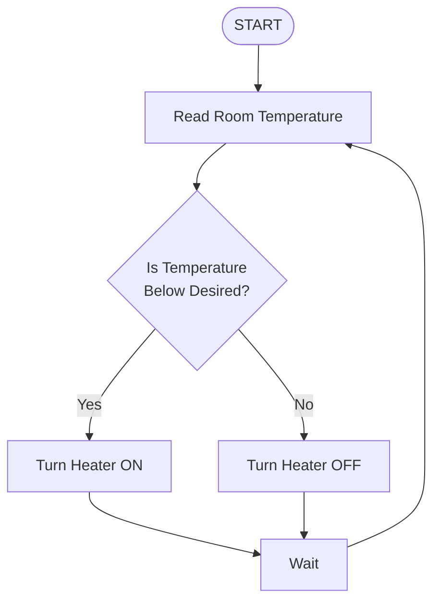
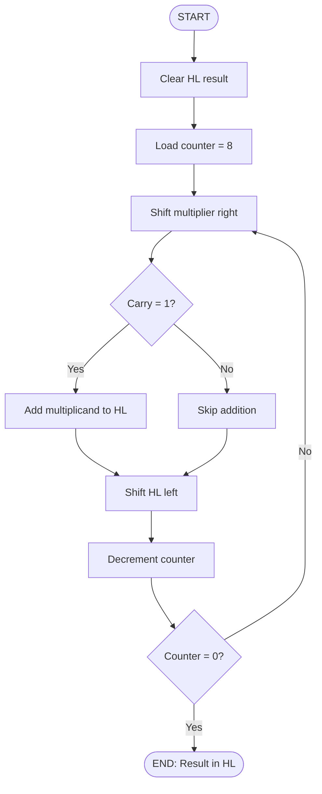
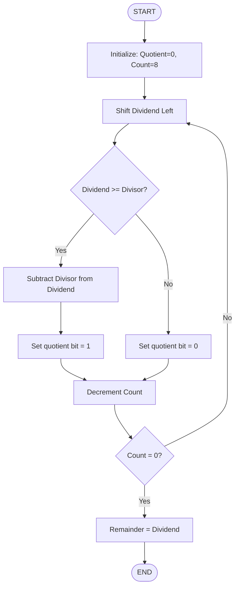
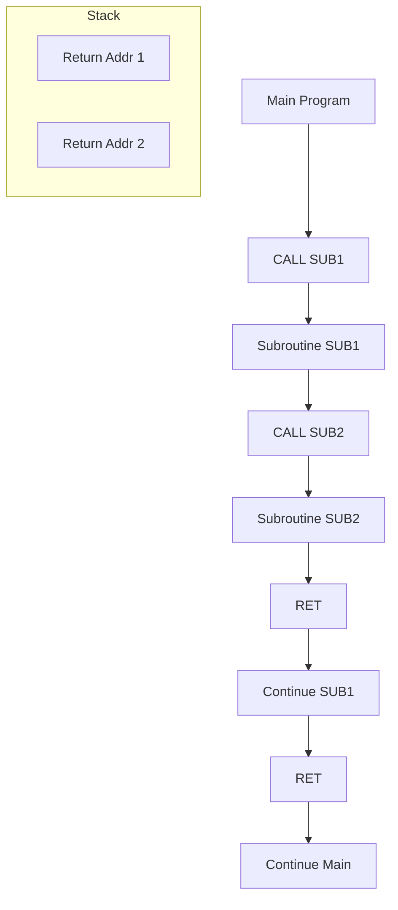

## programming the Z80

SECOND EDITION

RODNAY ZAKS

```
====================================
PROGRAMMING THE Z80
SECOND EDITION
A Complete Guide to Z80 Assembly
Language Programming
====================================
```

## programming theZ80

RODNAYZAKS

SECOND EDITION

```
====================================
PROGRAMMING THE Z80
Third Edition
by Rodnay Zaks
====================================
```

## ACKNOWLEDGEMENTS

Designing a programming textbook is always difficult. Designing it so that it will teach elementary programming as well as advanced concepts while covering both hardware and software aspects make It a challenge. The author would like to acknowledge here the many constructive suggestIOns for improvements or changes made by: O.M. Barlow, Dennis L. Feick, Richard D. Reid, Stanley E. Erwin, Philip Hooper, Dennis B. Kitsz.

A special acknowledgement is also due to Chris Williams for his contribution to the instruction-set and the data structures section.

Any additional suggestions for improvements or changes should be sent to the author, and will be reflected in forthcoming editions.

Several tables in Chapter Four showing hexadecimal codes for the Z80 instructions have been reprinted by permission of Zilog Inc. Tables 2.26 and 2.27 have been reprinted by permission of Intel Corporation.

## NOTICE:

"Z80" IS a registered trademark of ZILOG Inc., with whom SYBEX is not connected many way.

## Cover Design by Damelle Noury

Every effort has been made to supply complete and accurate information. However, Sybex assumes no responsibility for its use; nor any mfringements of patents or other nghts of third parties which would result. No license is granted by the equipment manu­ facturers under any patent or patent rights. Manufacturers reserve the right to change circuitry at any time without notice.

Copyright © 1980 SYBEX Inc. World Rights reserved. No part of this publication may be stored in a retrieval system, transmitted, or reproduced in any way, including but not limited to, photocopy, photograph, magnetic or other record, without the prior written permissIOn of the publisher.

Library of Congress Card Number: 80-5468

ISBN: 0-89588-047-4

First Edition published 1979, Second Edition 1980

Pnnted in the United States of America

Pnnttng 1098765432 I

:

## TABLE OF CONTENTS

| PREFACE 13   | PREFACE 13                                                                                                                                            |
|--------------|-------------------------------------------------------------------------------------------------------------------------------------------------------|
| I.           | BASIC CONCEPTS 15                                                                                                                                     |
|              | IntroductIOn. What is programming?, Flowchartmg, Information Representation                                                                           |
| II.          | Z80 HARDWAREORGANIZATION 46                                                                                                                           |
|              | IntroductIOn, System Architecture, Internal Orgallization of the 280. In­ struction Formats. ExecutIOn of Instructions with the 280. Hardware Summary |
| m.           | BASICPROGRAMMING TECHNIQUES 94                                                                                                                        |
|              | IntroductIOn. Arithmetic Programs, BCD Arithmetic Multiplication. Binary DiviSIOn. Instruction Summary. Subroutines. Summary                          |
| IV.          | THEZ80 INSTRUCTION SET 154                                                                                                                            |
|              | Introduction. Classes ofInstructions. Summary, Individual Descnptions                                                                                 |
| V.           | ADDRESSING TECHNIQUES 438                                                                                                                             |
|              | Introduction. Possible Addressing Modes. 280 Addressmg modes. Usmg the 280 Addressmg Modes. Summary                                                   |
| VI.          | INPUT/OUTPUT TECHNIQUES 460                                                                                                                           |
|              | IntroductIOn. Input/output. Parallel Word Transfer, Bit Serial Transfer, Penpheral Summary. Input/Output Scheduling, Summary                          |
| VII.         | INPUT/OUTPUT DEVICES 511                                                                                                                              |
|              | Introduction, The Standard PIO. The Internal Control Register, Program­ ming a PIO. The 2i1og 280 PIO                                                 |

| VIII.                                                      | APPLICATION EXAMPLES ................•..•..•. 520                                                       |
|------------------------------------------------------------|---------------------------------------------------------------------------------------------------------|
| IX.                                                        | DATA STRUCTURES .......•.........•........... 539                                                       |
|                                                            | PARTi-THEORY Introduction, Pointers, Lists, Searching and Sorting, Section Summary PART2-DESIGNEXAMPLES |
| X.                                                         | PROGRAMDEVELOPMENT 579                                                                                  |
|                                                            | CONCLUSION                                                                                              |
| XI.                                                        | 602                                                                                                     |
| APPENDIX A.............•...•........•...•.......•..... 604 | APPENDIX A.............•...•........•...•.......•..... 604                                              |
| APPENDIX B ASCII ConversIOn Table                          | 605                                                                                                     |
| APPENDIX C Relative Branch Tables APPENDIX D               | 606 607                                                                                                 |
| APPENDIX E Z80 Instruction Codes                           | 608                                                                                                     |
| APPENDIX F                                                 | 615                                                                                                     |
| Z80 to 8080 Equivalence APPENDIX G 8080 to Z80             | .........•.......•...•....•.....•.....••... 616 Equivalence                                             |
| INDEX                                                      | 617                                                                                                     |

## LIST OF ILLUSTRATIONS

| Figure   | 1.1 :   | A Flowchart for Keeping Room Temperature Constant                         | .. 17    |
|----------|---------|---------------------------------------------------------------------------|----------|
| Figure   | 1.2:    | Decimal-Binary Table .. , . , . , , . , .. , . ,                          | 21       |
| Figure   | 1.3:    | 2'sComplement Table , ,., ,                                               | ,.29     |
| Figure   | 1.4:    | BCD Table , . , , .. , , . , . , , , . , , .. , ,                         | , 35     |
| Figure   | 1.5:    | TypIcal Floating-Point Representation , ., . ' .. ,                       | ,.38     |
| Figure   | 1.6:    | ASCII Conversion Table , , , , , .. , , . , , . ,                         | .40      |
| Figure   | 1.7:    | Octal Symbols , , ., . , . , , , , .. , " ,                               | ,42      |
| Figure   | 1.8:    | Hexadecimal Codes, , . , . , , , . , . , .. , . , , ,                     | .43      |
| Figure   | 2.1:    | Standard Z80 System , , , . , .. , , , .. ,                               | .47      |
| Figure   | 2.2:    | "Standard" Microprocessor Architecture, , . , , . , . ,                   | 49       |
| Figure   | 2.3:    | Shift and Rotate. , , .. , , , , .. ,                                     | .50      |
| Figure   | 2.4:    | The 16-bit Address Registers Create the Address Bus                       | .52      |
| Figure   | 2.5:    | The Two-Stack Manipulation Instructions .. , ,                            | .. 54    |
| Figure   | 2.6:    | Fetching an Instruction from the Memory, . , , , . , , .. ,               | .. 56    |
| Figure   | 2.7:    | Automatic Sequencing, ... , . , .... , , , . , , , , ..                   | .56      |
| Figure   | 2.8:    | Single-Bus Architecture. "" .. , .. ", " .. , .. , .. ,                   | ,57      |
| Figure   | 2.9:    | Execution of an Addition-RO into ACC , , . , . , , , .                    | .. 58    |
| Figure   | 2.10:   | Addition-Second Register RI into ALU , , . , , .. , ..                    | 58       |
| Figure   | 2.11:   | Result Is Generated and Goes into RO . , .. , , ,                         | 59       |
| Figure   | 2.12:   | The Critical Race Problem .... , , . , .... , . , . , . , . , . , ,       | .. 60    |
| Figure   | 2.l3:   | Two Buffers Are Required, . , . , , , , , , , . , .. , ... , , , , .....  | ,61      |
| Figure   | 2.14:   | Internal Z80 Organization.. , , , .. , .. , .. , . , , , , ,              | .65      |
| Figure   | 2.15:   | Typical Instruction Formats. , , , . , .. , .. , .. , ... , ,             | .67      |
| Figure   | 2.16:   | The Register Codes ., ".,., .. ,.,." "",.,                                | 68       |
| Figure   | 2.17:   | Instruction Fetch-(pC) Is Sent to the Memory. ,                           | ,.70     |
| Figure   | 2.18:   | PC Is Incremented. , . , ... , , , , , ... , , .. , , , . , . , , . , , , | , 71     |
| Figure   | 2.19:   | The Instruction Arrives from the Memory into IR. " , '                    | 72       |
| Figure   | 2.20:   | Transferring C into D ..... ,., .. "" ... ,.,." ... ,                     | ",.,.73  |
| Figure   | 2.21:   | The Contents ofC are Deposited into TMP , . , . , . , , . ,               | ... 73   |
| Figure   | 2.22:   | The Contents ofTMP Are DeposIted into D ,.,., .. ,                        | ,.".,.74 |
| Figure   | 2.23:   | Two Transfers Occur Simultaneously .. , , .. , , . , , , , .,             | ,.,.76   |
| Figure   | 2.24:   | End ofADD r , , .. , .. , , . , ... , . , .. , . , . , . , , , , ... , .. | . ,77    |
| Figure   | 2.25:   | Fetch-Execute Overlap during TI-T2 '" '.,. , ..                           | .. 78    |
| Figure   | 2.26:   | Intel Abbreviations "'" .. , . , , . , , . , . , , ..                     | , , 79   |
| Figure   | 2.27:   | Intel Instruction Formats, , , , . , .. , , , . , .. , , .. , . , ..      | , . 80   |
| Figure   | 2.28:   | Transfer Contents of HL to Address Bus, , . , , , .... ,                  | . ,85    |
| Figure   | 2.29:   | LDA, (ADDRESS) Is a 3-Word Instruction.",.".,                             | , ,86    |
| Figure   | 2.30:   | Before Execution of LD A ",." .. ".,.,.,., .. ",.,                        | "".,,87  |
| Figure   | 2.31:   | After Execution of LD A... , ' .. , , , ' , . , . , . " ,..               | , . 87   |
| Figure   | 2.32:   | Second Byte of Instruction Goes into Z , . , . ,                          | .. 88    |
| Figure   | 2.33:   | Z80 MPU Pinout, . ' ,.. , , . , , , , ,                                   | ,91      |

| Figure        | 3.0:        | The Z80 Registers                                                  | 95          |
|---------------|-------------|--------------------------------------------------------------------|-------------|
| Figure        | 3.1:        | Eight-Bit A.ddition RES = OPl + OP2                                | 96          |
| Figure        | 3.2:        | LD A. (ADRI): OPI is Loaded from Memory. , ..                      | . 97        |
| Figure        | 3.3:        | ADD A, (HL) , , , . , . , ,                                        | ,915        |
| Figure        | 3.4:        | LD (ADR3), A (Save Accumulation in Memory)                         | 98          |
| Figure        | 3.5:        | 16-Bit Addition-The Operands , . ,                                 | 100         |
| Figure        | 3.6:        | Storing Operands in Reverse Order .. , ,...                        | ,. 102      |
| Figure        | 3.7:        | Pointing to the High Byte, , , ,                                   | 103         |
| Figure        | 3.8:        | A 32-Bit Addition , .. . . . . . . .. ., ',                        | .. 104      |
| Figure        | 3.9:        | 16-Bit Load-LD HL, (ADRI) ,                                        | ,,106       |
| Figure        | 3.10:       | Storing BCD Digits , , , , .. '"                                   | , .. 109    |
| Figure        | 3.11:       | Packed BCD Subtract: NI-N2 - NI ,., ".......                       | . . III     |
| Figure        | 3.12:       | The Basic Multiplication Algorithim-Flowchart                      | , 114       |
| Figure        | 3.13:       | 8 x 8 Multiplication Program ,                                     | 115         |
| Figure        | 3.14:       | 8 x 8 Multiplication-The Registers                                 | , . 116     |
| Figure        | 3.15:       | LD BC. (MPRAD).. ,.. " ",                                          | 117         |
| Figure        | 3.16:       | LD DE (MPDAD) .. , ., , .. ,.,..                                   | , 118       |
| Figure        | 3.17:       | Shift and Rotate, , , ,                                            | .. 120      |
| Figure        | 3.18:       | Shifting from E into D.. , , , "                                   | 121         |
| Figure        | 3.19:       | Form for Multiplication Exercise , , , , , . ,                     | 123         |
| Figure        | 3.20:       | Multiplication: After One Instruction, .. '. ,. , ""               | , . 124     |
|               | 3.22:       | Multiplication: After Five Instructions .. , , ,., ,               | , 125       |
| Figure        |             |                                                                    | ..          |
| Figure Figure | 3.23: 3.24: | One Pass Through The Loop, , . , . , Improved Multiply, Step 1 " , | , . 125 127 |
| Figure        | 3.25:       | Registers for Improved Multiply , ,                                | , 128       |
| Figure        | 3.26:       | Improved Multiply, Step 2 ,                                        | 129         |
| Figure        | 3.27:       | 16 x 16 Multiply-The Registers ", , ..                             | .. 130      |
| Figure        | 3.28:       | 16 x 16 Multiplication Program , .. , , .. ,                       | ,,131       |
| Figure        | 3.29:       | 16 x 16 Multiply with 32 Bit Result. " . '. " .. , ,.,.            | 133         |
| Figure        | 3.30:       | 8-Bit Binary Division Flowchart. , ,. .                            | .. 134      |
| Figure        | 3.31 :      | 16 x 8 Division-The Registers , ' " ,. ,                           | ,.,134      |
| Figure        | 3.32:       | 16 x 8 DiVision Program. , ,., " ,., , .. ,. , ,.,                 | , , 135     |
| Figure        | 3.33:       | Form for Division Program ..... "., ',                             | 137         |
| Figure        | 3.34:       | Non-Restoring DivIsor-The Registers. , , ,                         | 138         |
| Figure        | 3.35:       | SubroutmeCall                                                      | ".,,143     |
| Figure        | 3.36:       | Nested Calls .. , , . , . , , , . , . , , . ,                      | , , 145     |
| Figure        | 3.37:       | The Subroutine Calls , , , , .. , .. ,                             | , . 146     |
| Figure        | 3.38:       | Stack vs. Time., ""'" ,                                            | .. 146      |
| Figure        | 3.39:       | Multiplication: AComplete Trace, , , .                             | . , 151     |
| Figure        | 3.40:       | The Multiplication Program (Hex) ' "                               | 153         |
| Figure        | 3.41:       | Two Interations Through the Loop. , ,                              | 153         |
| Figure        | 4.1:        | Shift and Rotate ,                                                 | 156         |
| Figure        | 4.2:        | Eight-Bit Load Group-'LD' '"                                       | 160         |
| Figure        | 4.3:        | 16-Bit Load Group-'LD'.'PUSH'and 'POP'                             | , 161       |
| Figure        | 4.4:        | Exchanger 'EX'and 'EXX' ., .. , .. , " ..                          | ".,.,.162   |
| Figure        | 4.5:        | Block Transfer Group , , ,                                         | 163         |
| Figure        | 4.6:        | Block Search Group.. , , , . , .. , . ,                            | 165         |
| Figure        | 4.7:        | Eight-Bit Arithmetic and Logic ,                                   | .. 166      |

| Figure        | 4.8:        | Sixteen-Bit Arithmetic and Logic                                    | 167          |
|---------------|-------------|---------------------------------------------------------------------|--------------|
| Figure        | 4.9:        | Shift and Rotate ,                                                  | , . 170      |
| Figure        | 4.10:       | Rotates and Shifts. , , .. , . ,                                    | , . 171      |
| Figure        | 4.11:       | Nine-Bit Rotation ' , ,                                             | 171          |
| Figure        | 4.12:       | Eight-Bit Rotation , , .. , ,                                       | 171          |
| Figure        | 4.13:       | Digit Rotate Instructions ,                                         | 172          |
| Figure        | 4.14:       | Bit Manipulation Group. , . , ,                                     | , 173        |
| Figure        | 4.15:       | General-Purpose AF Operation, ,                                     | 174          |
| Figure        | 4.16:       | The Flags Register '                                                | 174          |
| Figure        | 4.17:       | Summary of Flag Operations , ,                                      | 180          |
| Figure        | 4.18:       | Jump Instructions ,                                                 | 182          |
| Figure        | 4.19:       | Restart Group , ,                                                   | .. 183       |
| Figure        | 4.20:       | Output Group. , , , , ,                                             | 186          |
| Figure        | 4.21:       | Input Group, , , , ,                                                | ,.186        |
| Figure        | 4.22:       | Miscellaneous CPU Control ,                                         | , . 187      |
| Figure        | 5.1 :       | Basic Addressing Modes , , , ..                                     | 440          |
| Figure        | 5.2:        | Addressing (Pre-Indexmg)                                            | .. 442       |
| Figure        | 5.3:        | Indirect Indexed Addressing (Post-Indexing)                         | .. 443       |
| Figure        | 5.4:        | Indirect Addressmg ,                                                | , .444       |
| Figure        | 5.5:        | Indexed Addressing Has 2-Byte Opcode                                | 447          |
| Figure        | 5.6:        | Character Search Flowchart ,                                        | 450          |
| Figure        | 5.7:        | Block Transfer: Initializing the Register                           | 451          |
| Figure        | 5.8:        | A Block Transfer-Memory Map. ' ,                                    | 453          |
| Figure        | 5.9:        | Adding Two Blocks: BLK I = BLK I + BLK2,                            | 456          |
| Figure        | 5.10:       | Memory Organization for Block Transfer .. ,.                        | ,458         |
| Figure        | 6.1:        | Turning on a Relay , , , ,                                          | 462          |
| Figure        | 6.2:        | A Programmed Pulse ,                                                | 462          |
| Figure        | 6.3:        | Basic Delay Flowchart , . , .. , , , , ..                           | 464          |
| Figure        | 6.4:        | Parallel Word Transfer: The Memory. ,                               | .. 468       |
| Figure        | 6.5:        | Parallel Word Transfer: Flowchart .. , . , . ,                      | ., .469      |
| Figure        | 6.6:        | Bit Serial Transfer-Flowchart , . , , . . . .                       | 472          |
| Figure        | 6.7:        | Serial-to-Parallel: The Registers , .. , .. ,                       | .. ,474      |
| Figure        | 6.8:        | Handshaking(Output) .. '.. , .. ,.,                                 | .. ,478      |
| Figure        | 6.8a:       | Handshaking (Input) , .. , . , .. , , ,                             | ,478         |
| Figure        | 6.9:        | Printer-Data Paths " ,.,.'..                                        | , .479       |
| Figure        | 6.10:       | Seven Segment LED , . , .. , , ,                                    | 481          |
| Figure        | 6.11:       | Hexadecimal Characters Generated with a Seven-Segment               | 481          |
| Figure        | 6.12:       | Format of a Teletype Word , , .. ,                                  | .. 485       |
| Figure        | 6.13:       | TTY Input with Echo , .. , , ,                                      | 486          |
| Figure        | 6.14:       | Teletype Program.. , . , , , '..                                    | , .487       |
| Figure        | 6.15:       | Teletype Input .. , .. , , ,                                        | 488          |
| Figure        | 6.16:       | Teletype Output .. , .. , , ..                                      | . .489       |
| Figure        | 6.17:       | Printing a Memory Block .. , ,                                      | 491          |
| Figure        | 6.18:       | Three Methods of 110 Control .. , ' ,                               | 492          |
| Figure        | 6.19:       | Polling Loop Flowchart .. , , ,                                     | ,494         |
| Figure        | 6.20:       | Reading from a Paper-Tape Reader , .. ,                             | , .494       |
| Figure        | 6.21:       | Pnnting on a Punch or Printer ,                                     | 495          |
| Figure Figure | 6.22: 6.23: | Z80 Stack After Interruption , , .. Saving Some Working Registers , | , 496 , .496 |
| Figure        | 6.24:       | Interrupt Sequence , ,                                              | 497          |

| figure        | 6.25:       | NMI Forces Automatic Vectoring ,                                 | 499     |
|---------------|-------------|------------------------------------------------------------------|---------|
| figure        | 6.26:       | Interrupt Mode 0 , ,                                             | 501     |
| Figure        | 6.27:       | Saving the RegIsters .. , ,                                      | 502     |
| Figure        | 6.28:       | Mode I Interrupt ,                                               | 503     |
| Figure        | 6.29:       | Mode 2 Interrupt , , , . ,                                       | 504     |
| Figure        | 6.30:       | Mode 2: A Practical Example                                      | 505     |
| Figure        | 6.31:       | Polled vs. Vectored Interrupt ,                                  | .. 506  |
| figure        | 6.32:       | Several Devices May Use the Same Interrupt Line                  | 507     |
| Figure        | 6.33:       | Stack Contents During Multiple Interrupts                        | 508     |
| Figure        | 6.34:       | Interrupt Logic                                                  | 510     |
| Figure        | 7.1:        | Typical PIO                                                      | 512     |
| Figure        | 7.2:        | Using a PIO-Load Control Register                                | 513     |
| Figure        | 7.3:        | Using a PIO-Load Data Direction                                  | 514     |
| Figure        | 7.4:        | Using a PIO-Read Status                                          | 514     |
| Figure        | 7.5:        | Using a PIO-Read INPUT                                           | 515     |
| Figure        | 7.6:        | Z80 PIO Pinout                                                   | 516     |
| Figure        | 7.7:        | Z80 Block Diagram                                                | 517     |
| Figure        | 8.1:        | Largest Element in a Table                                       | 527     |
| Figure        | 8.2:        | Sum of NElements ,                                               | 528     |
| figure        | 8.3:        | BCD Block Transfer-the Memory. ,                                 | 530     |
| Figure        | 8.4:        | Comparing Two Signed Numbers                                     | 532     |
| Figure        | 8.5:        | Bubble-Sort Examples: Phases I to 12                             | 534     |
| Figure        | 8.6:        | Bubble-Sort Example: Phases 13 to 21 ,                           | 535     |
| Figure        | 8.7:        | Bubble-Sort Flowchart ,                                          | 536     |
| Figure        | 8.8:        | Bubble-Sort. , ,                                                 | 537 540 |
| Figure        | 9.1:        | An Indirection Pomter                                            |         |
| Figure        | 9.2:        | A Directory Structure , . , ,                                    | 541     |
|               |             | Inserting a New Block                                            | 542     |
| Figure        | 9.4:        |                                                                  |         |
| Figure        | 9.5:        | A Queue                                                          | 543     |
| figure        | 9.6:        | Round Robin is Circular List                                     | 545     |
| Figure        | 9.7:        | Genealogical Tree                                                | 545     |
| Figure        | 9.8:        | Doubly-Linked List .. "                                          | 546     |
| Figure        | 9.9:        | The Table Structure '"                                           | 549     |
| Figure Figure | 9.10:       | Typical List Entnes m the Memory The Simple List.                | 549 550 |
| figure        | 9.11: 9.12: | Table Search flowchart                                           | .. 551  |
| Figure        | 9.13:       | Table Insertion Flowchart.                                       | 552     |
| Figure        | 9.14:       | Deleting an Entry (Simple List)                                  | 553     |
|               |             | Flowchart. . . . . . . .                                         |         |
| Figure        | 9.15:       | Table Deletion                                                   | ,554    |
| Figure        | 9.16:       | Simple List- The Programs                                        | 555     |
| figure        | 9.17:       | Simple List-A Sample Run                                         | 556     |
| Figure        | 9.18:       | Binary Search Flowchart ,                                        | 559     |
| figure        | 9.19:       | A Binary Search, , ,                                             | 561     |
| Figure Figure | 9.20: 9.21: | Insert "BAC".. . . , """ Delete "BAC" ,                          | 563 564 |
| Figure        |             | Deletion Flowchart (AlphabetIc List)                             | ..      |
|               | 9.22:       |                                                                  | 565     |
| Figure Figure | 9.23: 9.24: | Binary Search Program " . .. Alphabetic List-A Sample Run        | 566 569 |
| Figure        | 9.25:       | Linked List Structure..... , . . . . . . . . . . . . . . . . . . | 571     |

| Figure   | 9.26:   | Linked List-A Search              | 573    |
|----------|---------|-----------------------------------|--------|
| Figure   | 9.27:   | Linked List: Example of Insertion | 573    |
| Figure   | 9.28:   | Example of Deletion (Linked List) | 574    |
| Figure   | 9.29:   | Linked LIst-The Programs          | ,575   |
| Figure   | 9.30:   | Linked List-A Sample Run ,        | .. 577 |
| Figure   | 10.1:   | Programming Levels                | 581    |
| Figure   | 10.2:   | A Typical Memory Map ,            | 586    |
| Figure   | 10.3:   | Microprocessor Programmmg Form    | 591    |
| Figure   | 10.4:   | Assembler Output-An Example .. ,  | 593    |
| Figure   | 10.5:   | Operator Precedence               | 597    |

## PREFACE

This book has been designed as a complete self-contained text for learning programming, using the Z80. It can be used by a person who has never programmed before, and should also be of value to anyone using the Z80.

For the person who has already programmed, this book will teach specific programming techniques using (or working around) the speci­ fic characteristics of the Z80. This text covers the elementary to inter­ mediate techniques required to start programming effectively.

This text aims at providing a true level of competence to the person who wished to program using this microprocessor. Naturally, no book will effectively teach how to program, unless one actually practices. However, it is hoped that this book will take the reader to the point where he feels that he can start programming by himself and can solve simple or even moderately complex problems using a microcomputer.

This book is based on the author'sexperience in teaching more than 1000 persons how to program microcomputers. As a result, it is strongly structured. Chapters normally go from the simple to the complex. For readers who have already learned elementary programming, the intro­ ductory chapter may be skipped. For others who have never program­ med, the final sections of some chapters may require a second reading. The book has been designed to take the reader systematically through all the basic concepts and techniques required to build increasingly complex programs. It is, therefore, strongly suggested that the ordering of the chapters be followed. In addition. for effective results, it is important that the reader attempt to solve as many exercises as possible. The difficulty within the exercises has been carefully graduated. They are designed to verify that the material which has been presented is really understood. Without doing the programming exercises, it will not be possible to realize the full value of this book as an educational medium. Several of the exercises may require time, such as the multi­ plication exercise. However, by doing those, you will actually program and learn by doing. This is indispensable.

For those who have acquired a taste for programming when reaching the end of this volume, a companion volume is planned: the "Z80 Applications Book."

Other books in this series cover programming for other popular microprocessors.

For those who wish to develop their hardware knowledge, it is suggested that the reference books "Microprocessors" (ref. C20l) and "Microprocessor Interfacing Techniques" (ref. C207) be consulted.

The contents of this book have been checked carefully and are believed to be reliable. However, inevitably, some typographical or other errors will be found. The author will be grateful for any comments by alert readers so that future editions may benefit from their experience. Any other suggestions for improvements, such as other programs desired, developed, or found of value by readers, will be appreciated.

1

1

## BASIC CONCEPTS

## INTRODUCTION

This chapter will introduce the basic concepts and definitions re­ lating to computer programming. The reader already familiar with these concepts may want to glance quickly at the contents of this chapter and then move on to Chapter 2. It is suggested. however, that even the experienced reader look at the contents of this intro­ ductory chapter. Many significant concepts are presented here in­ cluding, for example. two'scomplement. BCD. and other represen­ tations. Some of these concepts may be new to the reader; others may improve the knowledge and skills of experienced programmers.

## WHAT IS PROGRAMMING?

Given a problem. one must first devise a solution. This solution. expressed as a step-by-step procedure, is called an algorithm. An algorithm is a step-by-step specification of the solution to a given problem. It must terminate in a finite number of steps. This algorithm may be expressed in any language or symbolism. A sim­ ple example of an algorithm is:

- I-insert key in the keyhole
- 2-turn key one full turn to the left
- 3-seize doorknob
- 4-turn doorknob left and push the door

At this point. if the algorithm is correct for the type of lock in­ volved. the door will open. This four-step procedure qualifies as an algorithm for door opening.

Once a solution to a problem has been expressed in the form of an algorithm, the algorithm must be executed by the computer. Unfortunately, it is now a well-established fact that computers cannot understand or execute ordinary spoken English (or any other human language). The reason lies in the syntactic ambiguity of all common human languages. Only a well-defined subset of natural language can be "understood" by the computer. This is called a programming language.

Converting an algorithm into a sequence of instructions in a pro­ gramming language is called programming. To be more specific, the actual translation phase of the algorithm into the program­ ming language is called coding. Programming really refers not just to the coding but also to the overall design of the programs and "data structures" which will implement the algorithm.

Effective programming requires not only understanding the possible implementation techniques for standard algorithms. but also the skillful use of all the computer hardware resources, such as internal registers, memory. and peripheral devices. plus a creative use of appropriate data structures. These techniques will be covered in the next chapters.

Programming also requires a strict documentation discipline, so that the programs are understandable to others, as well as to the author. Documentation must be both internal and external to the program.

Internal program documentation refers to the comments placed in the body of a program, which explain its operation.

External documentation refers to the design documents which are separate from the program: written explanations, manuals, and flowcharts.

## FLOWCHARTING

One intermediate step is almost always used between the algorithm and the program. It is called a flowchart. A flowchart is simply a symbolic representation of the algorithm expressed as a sequence of rectangles and diamonds containing the steps of the algorithm. Rectangles are used for commands, or "executable statements." Diamonds are used for tests such as: If information

X is true, then take action A, else B. Instead of presenting a formal definition of flowcharts at this point, we will introduce and discuss flowcharts later on in the book when we present programs.

Flowcharting is a highly recommended intermediate step be­ tween the algorithm specification and the actual coding of the solu­ tion. Remarkably, it has been observed that perhaps 10% of the programming population can write a program successfully with­ out having to flowchart. Unfortunately, it has also been observed that 90070 of the population believes it belongs to this lO%! The result: 80% of these programs, on the average, will fail the first time they are run on a computer. (These percentages are naturally not meant to be accurate.) In short, most novice programmers sel­ dom see the necessity of drawing a flowchart. This usually results in "unclean" or erroneous programs. They must then spend a long time testing and correcting their program (this is called the

Fig. 1.1: A Flowchart for Keeping Room Temperature Constant



debugging phase). The discipline of flowcharting is therefore highly recommended in all cases. It will require a small amount of additional time prior to the coding, but will usually result in a clear program which executes correctly and quickly. Once flowcharting is well understood, a small percentage of programmers will be able to perform this step mentally without having to do it on paper. Un­ fortunately, in such cases the programs that they write will usual­ ly be hard to understand for anybody else without the documenta­ tion provided by flowcharts. As a result, it is universally recom· mended that flowcharting be used as a strict discipline for any significant program. Many examples will be provided throughout the book.

## INFORMATION REPRESENTATION

All computers manipulate information in the form of numbers or in the form of characters. Let us exarnine here the external and internal representations of information in a computer.

## INTERNAL REPRESENTATION OF INFORMATION

All information in a computer is stored as groups of bits. A bit stands for a binary digit("O" or "1 "). Because of the limitations of conventional electronics, the only practical representation of infor­ mation uses two-state logic (the representation of the state "0" and "1 "). The two states of the circuits used in digital electronics are generally "on" or "off", and these are represented logi­ cally by the symbols "0" or "I". Because these circuits are used to implement "logical" functions, they are called "binary logic." As a result, virtually all information-processing today is performed in binary format. In the case of microprocessors in general, and of the Z80 in particular, these bits are structured in groups of eight. A group of eight bits is called a byte. A group of four bits is called a nibble.

Let us now examine how information is represented internally in this binary format. Two entities must be represented inside the computer. The first one is the program, which is a sequence of instructions. The second one is the data on which the program will operate, which may include numbers or alphanumeric text. We will discuss below three representations: program, numbers, and alpha­ numerics.

## Program Representation

All instructions are represented internally as single or multiple bytes. A so-called "short instruction" is represented by a single byte. A longer instruction will be represented by two or more bytes. Because the Z80 is an eight-bit microprocessor, it fetches bytes successively from its memory. Therefore. a single-byte instruction always has a potential for executing faster than a two­ or three-byte instruction. It will be seen later that this is an impor­ tant feature of the instruction set of any microprocessor and in particular the Z80, where a special effort has been made to pro­ vide as many single-byte instructions as possible in order to im­ prove the efficiency of the program execution. However, the limita­ tion to 8 bits in length has resulted in important restrictions which will be outlined. This is a classic example of the compromise be­ tween speed and flexibility in programming. The binary code used to represent instructions is dictated by the manufacturer. The Z80, like any other microprocessor, comes equipped with a· fixed instruction set. These instructions are defined by the manufac­ turer and are listed at the end of this book. with their code. Any program will be expressed as a sequence of these binary instruc­ tions. The Z80 instructions are presented in Chapter 4.

## Representing Numeric Data

Representing numbers is not quite straightforward, and several cases must be distinguished. We must first represent integers. then signed numbers. Le.. positive and negative numbers. and finally we must be able to represent decimal numbers. Let us now address these requirements and possible solutions.

Representing integers may be performed by using a direct binary representation. The direct binary representation is simply the representation of the decimal value of a number in the binary system. In the binary system. the right-most bit represents 2 to the power 0. The next one to the left represents 2 to the power 1, the next represents 2 to the power 2. and the left-most bit represents 2 to the power 7 = 128.

<!-- formula-not-decoded -->

## PROGRAMMING THE zao

The powers of 2 are:

<!-- formula-not-decoded -->

The binary representation is analogous to the decimal representa­ tion of numbers. where "123" represents:

<!-- formula-not-decoded -->

Note that 100 = 10 2 · 10 = 10 1 · 1 = 10°.

In this "positional notation," each digit represents a power of 10. In the binary system. each binary digit or "bit" represents a power of 2. instead of a power of 10 in the decimal system.

Example: "00001001" in binary represents:

in decimal:

<!-- formula-not-decoded -->

Let us examine some more examples:

"10000001" represents:

in decimal:

<!-- formula-not-decoded -->

"10000001" represents, therefore, the decimal number 129.

1

By examining the binary representation of numbers. you will understand why bits are numbered from 0 to 7. going from right to left. Bit 0 is "bo" and corresponds to 2°. Bit 1 is "bl" and cor­ responds to 2 1 · and so on.

Fig. 1.2: Decimal-Binary Table

| Decimal                                              | Binary                                                                                                                                                                     | Decimal                                            | Binary                                                                                    |
|------------------------------------------------------|----------------------------------------------------------------------------------------------------------------------------------------------------------------------------|----------------------------------------------------|-------------------------------------------------------------------------------------------|
| 0 1 2 3 4 5 6 7 8 9 10 11 12 13 14 15 16 17 · · · 31 | 00000000 00000001 00000010 00000011 00000100 00000101 00000110 00000111 00001000 00001001 00001010 00001011 00001100 00001101 00001110 00001111 00010000 00010001 00011111 | 32 33 · · · 63 64 65 · · 127 128 129 · · · 254 255 | 00100000 00100001 00111111 01000000 01000001 01111111 10000000 10000001 11111110 11111111 |

The binary equivalents of the numbers from 0 to 255 are shown in Fig. 1-2.

Exercise 1.1: What is the decimal value of "11111100"?

Decimal to Binary

Conversely, let us compute the binary equivalent of "11" decimal:

<!-- formula-not-decoded -->

The binary equivalent is 1011 (read right-most column from bot­ tom to top).

The binary equivalent of a decimal number may be obtained by dividing successively by 2 until a quotient of 0 is obtained.

Exercise 1.2: What is the binary for 257?

Exercise 1.3: Convert 19 to binary, then back to decimal.

Operating on Binary Data

The arithmetic rules for binary numbers are straightforward. The rules for addition are:

<!-- formula-not-decoded -->

where (1) denotes a "carry" of 1 (note that "10" is the binary equivalent of "2" decimal). Binary subtraction will be performed by "adding the complement" and will be explained once we learn how to represent negative numbers.

Example:

<!-- formula-not-decoded -->

Addition is performed just like in decimal, by adding columns, from right to left:

Adding the right-most column:

<!-- formula-not-decoded -->

1

:

Adding the next column:

<!-- formula-not-decoded -->

Exercise 1.4: Compute 5 + 10 in binary. Verify that the result is 15.

Some additional examples of binary addition:

| 0010   | (2)   | 0011   | (3)   |
|--------|-------|--------|-------|
| +0001  | (1,   | +0001  | (1)   |
| =0011  | (3)   | =0100  | (4)   |

This last example illustrates the role of the carry.

Looking at the right-most bits: 1 + 1 = (11 0

A carry of 1 is generated. which must be added to the next bits:

<!-- formula-not-decoded -->

The final result is: 0100

Another example:

<!-- formula-not-decoded -->

In chis example. a carry is again generated. up to the left-most co­ lumn.

Exercise 1.5: Compute the result of:

<!-- formula-not-decoded -->

Does the result hold in four bits?

With eight bits. it is therefore possible to represent directly the numbers "00000000" to "11111111," i.e., "0" to "255". Two obstacles should be visible immediately. First, we are only representing positive numbers. Second. the magnitude of these numbers is limited to 255 if we use only eight bits. Let us address each of these problems in turn.

## Signed Binary

In a signed binary representation, the left-most bit is used to in­ dicate the sign of the number. Traditionally. "0" is used to denote a positive number while"1" is used to denote a negative number. Now "11111111" will represent -127, while "01111111" will represent + 127. We can now represent positive and negative numbers, but we have reduced the maximum magnitude of these numbers to 127.

Example: "0000 0001" represents +1 (the leading "0" is "+". followed by "000 0001" = 11.

"10000001" is -1 (the leading "1" is "-").

Exercise 1.6: What is the representation of "-5" in signed binary?

Let us now address the magnitude problem: in order to represent larger numbers. it will be necessary to use a larger number of bits. For example, if we use sixteen bits (two bytes) to represent numbers, we will be able to represent numbers from -32K to +32K in signed binary (1K in computer jargon represents 1.024). Bit 15 is used for the sign, and the remaining 15 bits (bit 14 to bit 0) are used for the magnitude: 2 15 = 32K. If this magnitude is still too small. we will use 3 bytes or more. If we wish to represent large integers, it will be necessary to use a larger number of bytes inter­ nally to represent them. This is why most simple BASICs. and other languages, provide only a limited precision for integers. This way. they can use a shorter internal format for the numbers which they manipulate. Better versions of BASIC. or of these other languages, provide a larger number of significant decimal digits at the expense of a large number of bytes for each number.

Now let us solve another problem, the one of speed efficiency. Weare going to attempt performing an addition in the signed

binary representation which we have introduced. Let us add" -5" and "+7".

```
+7 is represented by -5 is represented by The binary sum is : 00000111 10000101 10001100, or -12
```

This is not the correct result. The correct result should be + 2. In order to use this representation, special actions must be taken, de­ pending on the sign. This results in increased complexity and re­ duced performance. In other words, the binary addition of signed numbers does not "work correctly." This is annoying. Clearly, the computer must not only represent information, but also perform arithmetic on it.

The solution to this problem is called the two's complement representation, which will be used instead of the signed binary representation. In order to introduce two's complement let us first introduce an intermediate step: one's complement.

## One's Complement

In the one'scomplement representation, all positive integers are represented in their correct binary format. For example "+3" is represented as usual by 00000011. However, its complement" -3" is obtained by complementing every bit in the original representa­ tion. Each 0 is transformed into a 1 and each 1 is transformed into a O. In our example, the one'scomplement representation of "-3" will be 11111100.

## Another example:

```
+ 2 is 00000010 -2 is 11111101
```

Note that, in this representation, positive numbers start with a "0" on the left, and negative ones with a "1" on the left.

Exercise 1.7: The representation of "+6" is "0 סס oo110". What is the representation of "-6" in one's complement?

As a test, let us add minus 4 and plus 6:

the sum is:

<!-- formula-not-decoded -->

The "correct result" should be "2", or "00000010".

Let us try again:

The sum is:

<!-- formula-not-decoded -->

or "1," plus a carry. The correct result should be "-5." The repre­ sentation of " 5" is 11111010. It did not work.

This representation does represent positive and negative numbers. However the result of an ordinary addition does not always come out "correctly." We will use still another representa­ tion. It is evolved from the one's complement and is called the two's complement representation.

## Two's Complement Representation

In the two's complement representation, positive numbers are still represented, as usual, in signed binary, just like in one's com­ plement. The difference lies in the representation of negative numbers. A negative number represented in two's complement is obtained by first computing the one's complement, and then ad­ ding one. Let us examine this in an example:

+3 is represented in signed binary by 00000011. Its one's com­ plement representation is 11111100. The two's complement is ob­ tained by adding one. It is 11111101.

Let us try an addition:

The result is correct.

<!-- formula-not-decoded -->

Let us try a subtraction:

<!-- formula-not-decoded -->

Let us identify the result by computing the two'scomplement:

the one's complement of 11111110 is Adding 1 therefore the two's complement is 00000001 + 1 00000010 or +2

Our result above. "11111110" represents "-2". It is correct.

We have now tried addition and subtraction, and the results were correct (ignoring the carry). It seems that two'scomplement works!

Exercise /.8: What is the two's complement representation of "+ 127"?

Exercise /.9: What ~s the two's complement representation of "-/28 "?

Let us now add +4 and -3 (the subtraction is performed by add­ ing the two's complement):

The result is:

<!-- formula-not-decoded -->

If we ignore the carry. the result is 00000001, Le., "I" in decimal. This is the correct result. Without giving the complete mathe­ matical proof. let us simply state that this representation does work. In two's complement, it is possible to add or subtract signed numbers regardless of the sign. Using the usual rules of binary addi­ tion, the result comes out correctly, including the sign. The carry is ignored. This is a very significant advantage. If it were not the case, one would have to correct the result for sign every time. caus­ ing a much slower addition or subtraction time.

For the sake of completeness. let us state that two'scomplement is simply the most convenient representation to use for simpler processors such as microprocessors. On complex processors, other representations may be used. For example, one'scomplement may be used. but it requires special circuitry to "correct the result."

From this point on, all signed integers will implicitly be represented internally in two's complement notation. See Fig. 1. 3 for a table of two'scomplement numbers.

Exercise 1.10: What are the smallest and the largest numbers which one may represent in two's complement notation, using only one byte?

Exercise 1.11: Compute the two's complement of 20. Then com­ pute the two's complement of your result. Do you find 20 again?

The following examples will serve to demonstrate the rules of two's complement. In particular. C denotes a possible carry (or borrow) condition. (It is bit 8 of the result.)

V denotes a two'scomplement overflow, Le.. when the sign of the result is changed "accidentally" because the numbers are too large. It is an essentially internal carry from bit 6 into bit 7 (the sign bit). This will be clarified below.

Let us now demonstrate the role of the carry "C" and the overflow "V".

The Carry C

Here is an example of a carry:

| (128) +(129)   | 10000000   |
|----------------|------------|
| =              | + 10000001 |
| (257) (1)      | 00000001   |

where (1) indicates a carry.

The result requires a ninth bit (bit "8", since the right-most bit is "0"). It is the carry bit.

If we assume that the carry is the ninth bit of the result. we recognize the result as being 100000001 = 257.

However. the carry must be recognized and handled with care. Inside the microprocessor, the registers used to hold information are generally only eight-bit wide.When storing the result, only bits 0 to 7 will be preserved.

A carry, therefore, always requires special action: it must be detected by special instructions, then processed. Processing the carry means either storing it somewhere (with a special instruc­ tion). or ignoring it, or deciding that it is an error (if the largest authorized result is "11111111").

1

Fig. 1.3: 2's Complement Table

| +          | 2'scomplement code   |             | 2'scomplement code   |
|------------|----------------------|-------------|----------------------|
| + 127      | 01111111             | -128        | 10000000             |
| + 126      | 01111110             | -127        | 10000001             |
| + 125 · .. | 01111101             | 126 -125    | 10000010 10000011    |
| +65        | 01000001 01000000    | · .. 65 -64 | 10111111             |
| +64 +63    | 00111111             | -63         | 11000000 11000001    |
| · .. +32   | 00100000 00011111    | · .. -33    | 11011111             |
| +33        | 00100001             | 32          | 11100000             |
| · .. + 17  | 00010000             | -16         | 11101111             |
| +31        |                      | -31         | 11100001             |
|            | 00010001             | · .. -17    |                      |
| +16 + 15   |                      | -15         | 11110000             |
| +14        | 00001111 00001110    | -14         | 11110001 11110010    |
| + 13       | 00001101             | 13 -12      | 11110011             |
| + II       | 00001011             | - I I       | 11110101             |
| +12        | 00001100             |             | 11110100             |
| +10        | 00001010             | 10 -8       | 11110110             |
| +9         | 00001001             | -9          |                      |
| +8         | 00001000             |             | llllOl! I 11111000   |
| +7         | 00000111             | -7 -6       | 11111001             |
| +6         | 00000110             |             | 11111010             |
| +5         | 00000101             | -5          | 11111011             |
| +4         | 00000100             | -4          | 11111100             |
| +3         | 00000011             | -3          | 11111101             |
| +2         | 00000010             | -2          | 11111110             |
| +1 +0      | 00000001 00000000    | I           | 11I11I11             |

Overflow V

Here is an example of overflow:

<!-- formula-not-decoded -->

An internal carry has been generated from bit 6 into bit 7. This is called an overflow.

The result is now negative, "by accident." This situation must be detected, so that it can be corrected.

Let us examine another situation:

<!-- formula-not-decoded -->

In this case. an internal carry has been generated from bit 6 into bit 7, and also from bit 7 into bit 8 (the formal "Carry" C we have examined in the preceding section). The rules of two's complement arithmetic specify that this carry should be ignored. The result is then correct.

This is because the carry from bit 6 into bit 7 did not change the sign bit.

This is not an overflow condition. When operating on negative numbers, the overflow is not simply a carry from bit 6 into bit 7. Let us examine one more example.

<!-- formula-not-decoded -->

This time. there has been no internal carry from bit 6 into bit 7, but there has been an external carry. The result is incorrect. as bit 7 has been changed. An overflow condition should be indicated.

## Overflow will occur in four situations:

- I-adding large positive numbers
- 2-adding large negative numbers
- 3-subtracting a large positive number from a large negative number
- 4-subtracting a large negative number from a large positive number.

## Let us now improve our definition of the overflow:

Technically, the overflow indicator, a special bit reserved for this purpose, and called a "flag," will be set when there is a carry from bit 6 into bit 7 and no external carry, or else when there is no carry from bit 6 into bit 7 but there is an external carry. This indicates that bit 7, i.e., the sign of the result, has been accidentally changed. For the technically-minded reader, the overflow flag is set by Exclusive ORing the carry-in and carry-out of bit 7 (the sign bit;. Practically every microprocessor is supplied with a special overflow flag to automatically detect this condition, which re­ quires corrective action.

Overflow indicates that the result of an addition or a subtraction requires more bits than are available in the standard eight-bit register used to contain the result.

## The Carry and the Overflow

The carry and the overflow bits are called "flags." They are pro­ vided in every microprocessor, and in the next chapter we will learn to use them for effective programming. These two indicators are located in a special register called the flags or "status" register. This register also contains additional indicators whose function will be clarified in Chapter 4.

## Examples

Let us now illustrate the operation of the carry and the overflow in actual examples. In each example, the symbol V denotes the overflow, and C the carry.

If there has been no overflow, V = O. If there has been an overflow, V = 1 (same for the carry C). Remember that the rules of two's complement specify that the carry be ignored. (The mathematical proof is not supplied here.,

## PROGRAMMING THE Z80

## Positive-Positive

<!-- formula-not-decoded -->

## (CORRECT)

Positive-Positive with Overflow

<!-- formula-not-decoded -->

The above is invalid because an overflow has occurred. (ERROR)

Positive-Negative (result positive)

<!-- formula-not-decoded -->

=(1)00000010

(CORRECT)

Positive-Negative (result negative)

<!-- formula-not-decoded -->

## (CORRECT)

Negative-Negative

<!-- formula-not-decoded -->

## (CORRECT)

Negative-Negative with Overflow

<!-- formula-not-decoded -->

(+2)

V:o

C:1 (disregard)

C:1 (disregard)

This time an "underflow" has occurred, by adding two large negative numbers. The result would be -189, which is too large to reside in eight bits.

Exercise 1.12: Complete the following additions. Indicate the result. the carry C, the overflow V, and whether the result is correct or not:

Exercise 1.13: Can you show an example of overflow when adding a positive and a negative number? Why?

```
DECIMAL-BINARY CONVERSION TABLE
===============================

Decimal  Binary    | Decimal  Binary
-------  ------    | -------  ------
   0     0000      |    8     1000
   1     0001      |    9     1001
   2     0010      |   10     1010
   3     0011      |   11     1011
   4     0100      |   12     1100
   5     0101      |   13     1101
   6     0110      |   14     1110
   7     0111      |   15     1111

Note: 4 bits can represent values 0-15 (16 values)
      8 bits can represent values 0-255 (256 values)
```

## Fixed Format Representation

Now we know how to represent signed integers. However, we have not yet resolved the problem of magnitude. If we want to represent larger integers, we will need several bytes. In order to perform arithmetic operations efficiently. it is necessary to use a fixed number of bytes rather than a variable one. Therefore, once the number of bytes is chosen, the maximum magnitude of the number which can be represented is fixed.

Exercise 1.14: What are the largest and the smallest numbers which may be represented in two bytes using two's complement?

## The Magnitude Problem

When adding numbers we have restricted ourselves to eight bits because the processor we will use operates internally on eight bits at a time. However. this restricts us to the numbers in the range -128 to + 127. Clearly, this is not sufficient for many applications.

Multiple precision will be used to increase the number of digits which can be represented. A two-, three-, or N-byte format may

then be used. For example. let us examine a 16-bit. "double-pre­ cision" format:

Exercise 1.15: What is the largest negative integer which can be represented in a two's complement triple-precision format?

|   00000000 00000000 |   00000000 00000001 | is "0" is "1"   |
|---------------------|---------------------|-----------------|
|            01111111 |            11111111 | is "32767"      |
|            11111111 |            11111111 | is "-1"         |
|            11111111 |            11111110 | is "-2"         |

However. this method will result in disadvantages. When adding two numbers, for example. we will generally have to add them eight bits at a time. This will be explained in Chapter 3 (Basic Pro­ gramming Techniques). It results in slower processing. Also, this representation uses 16 bits for any number. even if it could be represented with only eight bits. It is. therefore, common to use 16 or perhaps 32 bits, but seldom more.

Let us consider the following important point: whatever the number of bits N chosen for the two's complement representation, it is fixed. If any result or intermediate computation should generate a number requiring more than N bits, some bits will be lost. The program normally retains the N left-most bits (the most significantI and drops the low-order ones. This is called truncating the result.

Here is an example in the decimal system. using a six digit representation:

| 123456 X 1.2   |
|----------------|
| 246912         |
| 123456         |
| = 148147.2     |

The result requires 7 digits! The "2" after the decimal point will be dropped and the final result will be 148147. It has been truncated. Usually, as long as the position of the decimal point is not lost, this method is used to extend the range of the operations which may be performed, at the expense of precision.

The problem is the same in binary. The details of a binary multi-

!

plication will be shown in Chapter 4.

This fixed-format representation may cause a loss of precision, but it may be sufficient for usual computations or mathematical operations.

Unfortunately, in the case of accounting, no loss of precision is tolerable. For example, if a customer rings up a large total on a cash register, it would not be acceptable to have a five figure amount to pay, which would be approximated to the dollar. Another representation must be used wherever precision in the result is essential. The solution normally used is BCD, or binary-coded decimal.

## BCD Representation

The principle used in representing numbers in BCD is to encode each decimal digit separately, and to use as many bits as necessary to represent the complete number exactly. In order to encode each of the digits from 0 through 9, four bits are necessary. Three bits would only supply eight combinations, and can therefore not en­ code the ten digits. Four bits allow sixteen combinations and are therefore sufficient to encode the digits "0" through "9". It can also be noted that six of the possible codes will not be used in the BCD representation (see Fig. 1-31. This will result later on in a po­ tential problem during additions and subtractions, which we will have to solve. Since only four bits are needed to encode a BCD

Fig. 1.4: BCD Table

| CODE   | BCD SYMBOL   | CODE   | BCD SYMBOL   |
|--------|--------------|--------|--------------|
| 0000   | 0            | 1000   | 8            |
| 0001   | I            | 1001   | 9            |
| 0010   | 2            | 1010   | unused       |
| 0011   | 3            | 1011   | unused       |
| 0100   | 4            | 1100   | unused       |
| 0101   | 5            | IIOJ   | unused       |
| OJ 10  | 6            | 1110   | unused       |
| 0111   | 7            | 111I   | unused       |

digit, two BCD digits may be encoded in every byte. This is called "packed BCD. "

As an example, "00000000" will be "00" in BCD. "10011001" will be "99".

A BCD code is read as follows:

```
BCD CODE READING EXAMPLE
========================

Binary:    1001  0101
           ----  ----
Decimal:    9     5    =  95 (decimal)

Each nibble (4 bits) represents one decimal digit (0-9)
```

Exercise 1.16: What is the BCD representation for "29"? "91 "?

<!-- formula-not-decoded -->

As many bytes as necessary will be used to represent all BCD digits. Typically, one or more nibbles will be used at the beginning of the representation to indicate the total number of nibbles, i.e., the total number of BCD digits used. Another nibble or byte will be used to denote the position of the decimal point. However, con­ ventions may vary.

Here is an example of a representation for multibyte BCD m­ tegers:

```
MULTIBYTE BCD REPRESENTATION
============================

+--------+--------+--------+--------+
| Sign   | Digit  | Digit  | Digit  |
| Nibble | Count  |   2    |   1    |
+--------+--------+--------+--------+
|  0000  |  0011  |  0010  |  0001  |
+--------+--------+--------+--------+
    +       3        2        1     =  +221

Sign: 0000 = positive (+)
      0001 = negative (-)
```

This represents +221

(The sign may be represented by 0000 for +, and 0001 for -, for example.,

Exercise 1.18: Using the same convention, represent "-23123". Show it in BCD format, as above, then in binary.

Exercise 1.19: Show the BCD for "222" and "111 ", then for the re­ sult of 222 X 111. (Compute the result by hand, then show it in the above representation,)

The BCD representation can easily accommodate decimal numbers.

## For example. +2.21 may berepresented by:

```
TWO'S COMPLEMENT TABLE (4-bit example)
======================================

Binary    Unsigned    Signed (2's Comp)
------    --------    -----------------
 0000        0             0
 0001        1            +1
 0010        2            +2
 0011        3            +3
 0100        4            +4
 0101        5            +5
 0110        6            +6
 0111        7            +7
 1000        8            -8
 1001        9            -7
 1010       10            -6
 1011       11            -5
 1100       12            -4
 1101       13            -3
 1110       14            -2
 1111       15            -1

Range: -8 to +7 (for 4-bit signed)
       -128 to +127 (for 8-bit signed)
```

The advantage of BCD is that it yields absolutely correct results. Its disadvantage is that it uses a large amount of memory and results in slow arithmetic operations. This is acceptable only in an accounting environment and is normally not used in other cases.

Exercise 1.20: How many bits are required to encode "9999" in BCD? And in two's complement?

We have now solved the problems associated with the represen­ tation of integers. signed integers and even large integers. We have even already presented one possible method of representing decimal numbers. with BCD representation. Let us now examine the problem of representing decimal numbers in a fixed length for­ mat.

## Floating-Point Representation

The basic principle is that decimal numbers must be represented with a fixed format. In order not to waste bits. the representation will normalize all the numbers.

For example. "0.000123" wastes three zeros on the left of the number. which have no meaning except to indicate the position of the decimal point. Normalizing this number results in .123 X 10- 3 · ".123" is called a normalized mantissa, "-3" is called the expo­ nent. We have normalized this number by eliminating all the meaning­ less zeros on the left of it and adjusting the exponent.

## Let us consider another example:

22.1 is normalized as .221 x 10 2

or M X lO E where M is the mantissa, and E is the exponent.

I t can be readily seen that a normalized number is characterized by a mantissa less than 1 and greater or equal to .1 in all cases where the number is not zero. In other words, this can be repre­ sented mathematically by:

<!-- formula-not-decoded -->

Similarly, in the binary representation:

<!-- formula-not-decoded -->

Where M is the absolute value of the mantissa (disregarding the sign).

For example:

<!-- formula-not-decoded -->

The mantissa is 111Ol.

The exponent is 3.

Now that we have defined the principle of the representation, let us examine the actual format. A typical floating-point represen­ tation appears below.

```
BCD (BINARY CODED DECIMAL) TABLE
================================

Decimal    BCD Code    | Decimal    BCD Code
-------    --------    | -------    --------
   0        0000       |    5        0101
   1        0001       |    6        0110
   2        0010       |    7        0111
   3        0011       |    8        1000
   4        0100       |    9        1001

Note: Each decimal digit (0-9) is encoded as 4 bits
      Codes 1010-1111 are invalid in BCD
      
Example: 95 decimal = 1001 0101 BCD
                       9    5
```

I

1&lt;

Fig. 1.5: Typical Floating-Point Representation

In the representation used in this example, four bytes are used for a total of 32 bits. The first byte on the left of the illustration is used to represent the exponent. Both the exponent and the man­ tissa will be represented in two's complement. As a result, the maximum exponent will be -128. "S" in Fig. 1-5 denotes the sign bit.

Three bytes are used to represent the mantissa. Since the first bit in the two'scomplement representation indicates the sign, this leaves 23 bits for the representation of the magnitude of the man­ tissa.

1

Exercise 1.21: How many decimal digits can the mantissa repre­ sent with the 23 bits?

This is only one example of a floating point representation. It is possible to use only three bytes, or it is possible to use more. The four-byte representation proposed above is just a common one which represents a reasonable compromise in terms of accuracy, magnitude of numbers, storage utilization, and efficiency in arithmetic operation.

We have now explored the problems associated with the rep­ resentation of numbers and we know how to represent them in in­ teger form, with a sign, or in decimal form. Let us now examine how to represent alphanumeric data internally.

## Representing Alphanumeric Data

The representation of alphanumeric data, i.e. characters, is com­ pletely straightforward: all characters are encoded in an eight-bit code. Only two codes are in general use in the computer world. the ASCII Code. and the EBCDIC Code. ASCII stands for "American Standard Code for Information Interchange," and is universally used in the world of microprocessors. EBCDIC is a variation of ASCII used by IBM, and therefore not used in the microcomputer world unless one interfaces to an IBM terminal.

Let us briefly examine the ASCII encoding. We must encode 26 letters of the alphabet for both upper and lower case, plus 10 numeric symbols, plus perhaps 20 additional special symbols. This can be easily accomplished with 7 bits, which allow 128 possible codes. (See Fig.l-6.) All characters are therefore encoded in 7 bits. The eighth bit, when it is used, is the parity bit. Parity is a tech­ nique for verifying that the contents of a byte have not been ac­ cidentally changed. The number of l's in the byte is counted and the eighth bit is set to one if the count was odd, thus making the total even. This is called even parity. One can also use odd parity, i.e. writing the eighth bit (the left-most) so that the total number of l's in the byte is odd.

Example: letus compute the parity bit for "0010011" using even parity. The number of 1'sis 3. The parity bit must therefore be a 1 so that the total number of bits is 4. i.e. even. The result is 10010011. where the leading 1 is the parity bit and 0010011 iden­ tifies the character.

The table of 7-bit ASCII codes is shown in Fig. 1-6. In practice, it is used "as is," i.e. without parity, by adding a 0 in the left-most position. or else with parity. by adding the appropriate extra bit on the left.

Exercise 1.2J' Compute the 8-bit representation of the digits "0" through "9", using even parity. (This code will be used in applica­ tion examples of Chapter 8.)

Exercise 1.23: Same for the letters "A" through "F".

Exercise 1.24: Using a non-parity ASCII code (where the left-most bit is "0"), indicate the binary contents of the 4 bytes below:

Fig. 1.6: ASCII Conversion Table (see Appendix B for abbreviations)

| HEX LSD   | MSD   | 0   | 1   | 2         | 3 011   | 4 100   | 5 101   | 6 110   | 7 111   |
|-----------|-------|-----|-----|-----------|---------|---------|---------|---------|---------|
|           | BITS  | 000 | 001 | 010 SPACE | 0       | @       | P       | -       | P       |
| 0         | 0000  | NUL | DLE |           |         | A       | Q       |         |         |
| 1         | 0001  | SOH | DC1 | !         | 1       |         |         | a       | q       |
| 2         | 0010  | STX | DC2 | "         | 2       | B       | R       | b       | r       |
| 3         | 0011  | ETX | DC3 | #         | 3       | C       | S       | c       | s       |
| 4         | 0100  | EOT | DC4 | $         | 4       | D       | T       | d       | t       |
| 5         | 0101  | ENQ | NAK | %         | 5       | E       | U       | e       | u       |
| 6         | 0110  | ACK | SYN | &         | 6       | F       | V       | f       | v       |
| 7         | 0111  | BEL | ETB | ,         | 7       | G       | W       | 9       | w       |
| 8         | 1000  | BS  | CAN | (         | 8       | H       | X       | h       | x       |
| 9         | 1001  | HT  | EM  | )         | 9       | I       | Y       | i       | Y       |
| A         | 1010  | LF  | SUB | *         |         | J       | Z       | j       | z       |
| B         | 1011  | VT  | ESC | +         |         | K       | [       | k       | {       |
| C         | 1100  | FF  | FS  |           | <       | L       | \       | I       | --      |
| D         | 1101  | CR  | GS  |           | =       | M       | ]       | m       | }       |
| E         | 1110  | SO  | RS  |           | >       | N       | /\      | n       | ,..,    |
| F         | 1111  | 81  | US  | I         | ?       | 0       | -E-     | 0       | DEL     |

In specialized situations such as telecommunications, other codings may be used such as error-correcting codes. However they are beyond the scope of this book.

We have examined the usual representations for both program and data inside the computer. Let us now examine the possible ex­ ternal representations.

## EXTERNAL REPRESENTATION OF INFORMATION

The external representation refers to the way information is pre­ sented to the user, i.e. generally to the programmer. Information may be presented externally in essentially three formats: binary, octal or hexadecimal and symbolic.

## 1. Binary

It has been seen that information is stored internally in bytes, which are sequences of eight bits (O's or 1's). It is sometimes desirable to display this internal information directly in its binary format and this is called binary representation. One simple exam­ ple is provided by Light Emitting Diodes (LEDs) which are essen­ tially miniature lights, on the front panel of the microcomputer. In the case of an eight-bit microprocessor, a front panel will typically be equipped with eight LEDs to display the contents of any inter­ nal register. (A register is used to hold eight bits of information and will be described in Chapter 2). A lighted LED indicates a one. A zero is indicated by an LED which is not lighted. Such a binary representation may be used for the fine debugging of a complex program, especially if it involves input/output, but is naturally impractical at the human level. This is because in most cases, one likes to look at information in symbolic form. Thus "9" is much easier to understand or remember than" 1001". More convenient representations have been devised, which improve the person­ machine interface.

## 2. Octal and Hexadecimal

"Octal" and "hexadecimal" encode respectively three and four binary bits into a unique symbol. In the octal system, any combination of three binary bits is represented by a number be­ tween 0 and 7.

"Octal" is a format using three bits, where each combination of three bits is represented by a symbol between 0 and 7:

Fig. 1. 7: Octal Symbols

| binary                          | octal           |
|---------------------------------|-----------------|
| 000 001 010 011 100 101 110 III | 0 1 2 3 4 5 6 7 |

100 100" binary is represented by; For example, "00

```
'f Y 4 4 'f o or "044" in octaL Another example: 11 'f 3 III 111 is: 'f 'f 7 7 or "377" in octaL Conversely, the octal "211" represents: 010 001 001
```

or "10001001" binary.

Octal has traditionally been used on older computers which were employing various numbers of bits ranging from 8 to perhaps 64. More recently, with the dominance of eight-bit microprocessors, the eight-bit format has become the standard, and another more practical representation is used. This is hexadecimal.

In the hexdecimal representation, a group of four bits is en­ coded as one hexadecimal digit. Hexadecimal digits are represented by the symbols from 0 to 9, and by the letters A, B, C, D, E, F. For example, "0000" is represented by "0", "0001" is represented by "1" and "1111" is represented by the letter "F" (see Fig. 1-8).

Fig. 1.8: Hexadecimal Codes

|   DECIMAL |   BINARY | HEX   |   OCTAL |
|-----------|----------|-------|---------|
|         0 |     0000 | 0     |       0 |
|         1 |     0001 | 1     |       1 |
|         2 |     0010 | 2     |       2 |
|         3 |     0011 | 3     |       3 |
|         4 |     0100 | 4     |       4 |
|         5 |     0101 | 5     |       5 |
|         6 |     0110 | 6     |       6 |
|         7 |     0111 | 7     |       7 |
|         8 |     1000 | 8     |      10 |
|         9 |     1001 | 9     |      11 |
|        10 |     1010 | A     |      12 |
|        11 |     1011 | B     |      13 |
|        12 |     1100 | r- \J |      14 |
|        13 |     1101 | 0     |      15 |
|        14 |     1110 | E     |      16 |
|        15 |     1111 | F     |      17 |

Example: 1010 0001 in binary is represented by --------A 1 in hexadecimal.

Exercise 1.25: What is the hexadecimal representation of "10101010?'

Exercise 1.26: Conversely, what is the binary equivalent of "FA" hexadecimal?

Exercise 1.27: What is the octal of "01000001"?

Hexadecimal offers the advantage of encoding eight bits into on­ ly two digits. This is easier to visualize or memorize and faster to type into a computer than its binary equivalent. Therefore, on most new microcomputers, hexadecimal is the preferred method of representation for groups of bits.

Naturally, whenever the information present in the memory has a meaning, such as representing text or numbers, hexadecimal is not convenient for representing the meaning of this information when it is brought out for use by humans.

## Symbolic Representation

Symbolic representation refers to the external representation of information in actual symbolic form. For example, decimal num­ bers are represented as decimal numbers, and not as sequences of hexadecimal symbols or bits. Similarly, text is represented as such. Naturally, symbolic representation is most practical to the user. It is used whenever an appropriate display device is available, such as a CRT display or a printer. (A CRT display is a television-type screen used to display text or graphics.' Unfortu­ nately, in smaller systems such as one-board microcomputers, it is uneconomical to provide such displays, and the user is restricted to hexadecimal communication with the computer.

## Summary of External Representations

Symbolic representation of information is the most desirable since it is the most natural for a human user. However, it requires an expensive interface in the form of an alphanumeric keyboard, plus a printer or a CRT display. For this reason, it may not be

available on the less expensive systems. An alternative type of rep­ resentation is then used, and in this case hexadecimal is the domi­ nant representation. Only in rare cases relating to fine de-bugging at the hardware or the software level is the binary representation used. Binary directly displays the contents of registers of memory in binary format.

(The utility of a direct binary display on a front panel has always been the subject of a heated emotional controversy, which will not be debated here.l

We have seen how to represent information internally and exter­ nally. We will now examine the actual microprocessor which will manipulate this information.

## Additional Exercises

Exercise /.28: What is the advantage of two's complement over other representations used to represent signed numbers?

Exercise /.29: How would you represent "1024" in direct binary? Signed binary? Two's complement?

Exercise /.30: What is the V-bit? Should the programmer test it after an addition or subtraction?

Exercise /.3/: Compute the two's complement of "+16", "+17", "+18", "-16", "-17", "-18".

Exercise /.32: Show the hexadecimal representation of the follow­ ing text, which has been stored internally in ASCII format, with no parity: = "MESSAGE".

## Z80 HARDWARE ORGANIZATION

## INTRODUCTION

In order to program at an elementary level, it is not necessary to understand in detail the internal structure of the processor that one is using. However, in order to do efficient programming, such an understanding is required. The purpose of this chapter is to present the basic hardware concepts necessary for understanding the operation of the Z80 system. The complete microcomputer system includes not only the microprocessor unit (here the Z80), but also other components. This chapter presents the Z80 proper, while the other devices (mainly input/output) will be presented in a separate chapter (Chapter 7).

We will review here the basic architecture of the microcomputer system, then study more closely the internal organization of the Z80. We will examine, in particular, the various registers. We will then study the program execution and sequencing mechanism. From a hardware standpoint, this chapter is only a simplified presentation. The reader in­ terested in gaining detailed understanding is referred to our book ref. C201 ("Microprocessors," by the same author).

The Z80 was designed as a replacement for the Intel 8080, and to of­ fer additional capabilities. A number of references will be made in this chapter to the 8080 design.

## SYSTEM ARCHITECTURE

The architecture of the microcomputer system appears in Figure 2.1. The microprocessor unit (MPU), which will be a Z80 here, appears on the left of the illustration. It implements the functions of a central­ processing unit (CPU) within one chip: it includes an arithmetic-logical Unit (ALU), plus its internal registers, and a control unit (CU), in

charge of sequencing the system. Its operation will be explained in this chapter.

Fig. 2.1: Standard Z80 System

```
+------------------------------------------------------------------+
|                     STANDARD Z80 SYSTEM                          |
+------------------------------------------------------------------+
                              |
              +---------------+---------------+
              |               |               |
              v               v               v
    +---------+-----+ +-------+-------+ +-----+---------+
    |   DATA BUS    | |  ADDRESS BUS  | |  CONTROL BUS  |
    |   (8-bit)     | |   (16-bit)    | |               |
    | bidirectional | | unidirectional| |               |
    +-------+-------+ +-------+-------+ +-------+-------+
            |               |               |
    +-------+---------------+---------------+-------+
    |                       |                       |
    v                       v                       v
+--------+            +---------+            +---------+
|  Z80   |            |  MEMORY |            |   I/O   |
|  MPU   |<---------->|  (RAM/  |<---------->| DEVICES |
|        |            |   ROM)  |            |         |
+--------+            +---------+            +---------+
```

The MPU creates three buses: an 8-bit bidirectional data bus, which appears at the top of the illustration, a 16-bit unidirectional address bus, and a control bus, which appears at the bottom of the illustration. Let us describe the function of each of the buses.

The data bus carries the data being exchanged by the various ele­ ments of the system. Typically, it will carry data from the memory to the MPU or from the MPU to the memory or from the MPU to an in­ put/output chip. (An input/output chip is a component in charge of communicating with an external device.)

The address bus carries an address generated by the MPU, which will select one internal register within one of the chips attached to the system. This address specifies the source, or the destination, of the data which will transit along the data bus.

The control bus carries tile various synchronization signals required by the system.

Having described the purpose of buses, let us now connect the addi­ tional components required for a complete system.

Every MPU requires a precise timing reference, which is supplied by a clock and a crystal. In most "older" microprocessors, the clock-oscil­ lator is external to the MPU and requires an extra chip. In most recent microprocessors, the clock-oscillator is usually incorporated within the MPU. The quartz crystal, however, because of its bulk, is always exter-

nal to the system. The crystal and the clock appear on the left of the MPU box in Figure 2.1.

Let us now turn our attention to the other elements of the system. Going from left to right on the illustration, we distinguish:

The ROM is the read-only memory and contains the program for the system. The advantage of the ROM memory is that its contents are per­ manent and do not disappear whenever the system is turned off. The ROM, therefore, always contains a bootstrap or a monitor program (their function will be explained later) to permit initial system opera­ tion. In a process-control environment, nearly all the programs will reside in ROM, as they will probably never be changed. In such a case, the industrial user has to protect the system against power failures; pro­ grams must not be volatile. They must be in ROM.

However, in a hobbyist environment, or in a program-development environment (when the programmer tests his program), most of the programs will reside in RAM so that they can be easily changed. Later, they may remain in RAM, or be transferred into ROM, if desired. RAM, however, is volatile. Its contents are lost when power is turned off.

The RAM(random-access memory) is the read/write memory for the system. In the case of a control system, the amount of RAM will typically be small (for data only). On the other hand, in a program­ development environment, the amount of RAM will be large, as it will contain programs plus development software. All RAM contents must be loaded prior to use from an external device.

Finally the system will contain one or more interface chips so that it may communicate with the external world. The most frequently used interface chip is the PIO or parallel input/output chip. It is the one shown on the illustration. This PIO, like all other chips in the system, connects to all three buses and provides at least two 16-bit ports for communication with the outside world. For more details on how an ac­ tual PIO works, refer to book C201 or, for specifics of the Z80 system, refer to Chapter 7 (Input/Output Devices).

All the chips are connected to all three buses, including the control bus. However, to clarify the illustration, the connections between the control bus and these various chips are not shown on the diagram.

The functional modules which have been described need not necessarily reside on a single LSI chip. In fact, we could use combina­ tion chips, which may include both PIO and a limited amount of ROM

or RAM.

Still more components will be required to build a real system. In par-

ticular, the buses usually need to be buffered. Also, decoding logic may be used for the memory RAM chips, and, finally, some signals may need to be amplified by drivers. These auxiliary circuits will not be described here as they are not relevant to programming. The reader in­ terested in specific assembly and interfacing techniques is referred to book C207 "Microprocessor Interfacing Techniques."

## INSIDE A MICROPROCESSOR

The large majority of all microprocessor chips on the market today implement the same architecture. This "standard" architecture will be described here. It is shown in Figure 2.2. The modules of this standard microprocessor will now be detailed, from right to left.

Fig. 2.2: "Standard" Microprocessor Architecture

```
+------------------------------------------------------------------+
|              "STANDARD" MICROPROCESSOR ARCHITECTURE              |
+------------------------------------------------------------------+

                    +------------------+
                    |   CONTROL UNIT   |
                    +--------+---------+
                             |
         +-------------------+-------------------+
         |                   |                   |
         v                   v                   v
+--------+--------+  +-------+-------+  +--------+--------+
|    REGISTERS    |  |     ALU       |  |   DATA BUS      |
|  (A, B, C, D,   |  | (Arithmetic   |  |   INTERFACE     |
|   E, H, L, etc) |  |  Logic Unit)  |  |                 |
+-----------------+  +---------------+  +-----------------+
         |                   |                   |
         +-------------------+-------------------+
                             |
                    +--------v---------+
                    |   INTERNAL BUS   |
                    +------------------+
```

The control box on the right represents the control unit which syn­ chronizes the entire system. Its role will be clarified within the re­ mainder of this chapter.

The ALU performs arithmetic and logic operations. A special register equips one of the inputs of the ALU, the left input here. It is called the accumulator. (Several accumulators may be provided.) The accumulator may be referenced both as input and output (source and destination) within the same instruction.

The ALU must also provide shift and rotate facilities.

A shift operation consists of moving the contents of a byte by one or more positions to the left or to the right. This is illustrated in Figure 2.3. Each bit has been moved to the left by one position. The details of shifts and rotations will be presented in the next chapter.

Fig. 2.3: Shift and Rotate

```
SHIFT AND ROTATE OPERATIONS
===========================

Logical Shift Left (SLA):
  +---+---+---+---+---+---+---+---+
  | 7 | 6 | 5 | 4 | 3 | 2 | 1 | 0 | <-- 0
  +---+---+---+---+---+---+---+---+
    |
    v
  Carry

Logical Shift Right (SRL):
    0 --> +---+---+---+---+---+---+---+---+
          | 7 | 6 | 5 | 4 | 3 | 2 | 1 | 0 |
          +---+---+---+---+---+---+---+---+
                                        |
                                        v
                                      Carry

Rotate Left (RL):
  +---+---+---+---+---+---+---+---+
  | 7 | 6 | 5 | 4 | 3 | 2 | 1 | 0 | <-- Carry
  +---+---+---+---+---+---+---+---+
    |
    +--> Carry

Rotate Right (RR):
  Carry --> +---+---+---+---+---+---+---+---+
            | 7 | 6 | 5 | 4 | 3 | 2 | 1 | 0 |
            +---+---+---+---+---+---+---+---+
                                          |
                                  Carry <-+
```

The shifter may be on the ALU output, as illustrated in Figure 2.2, or may be on the accumulator input.

To the left of the ALU, the flags or status register appear. Their role is to store exceptional conditions within the microprocessor. The con­ tents of the flags register may be tested by specialized instructions, or may be read on the internal data bus. A conditional instruction will cause the execution of a new program, depending on the value of one of these bits.

The role of the status bits in the 280 will be examined later in this chapter.

## Setting Flags

Most of the instructions executed by the processor will modify some or all of the flags. It is important to always refer to the chart provided by the manufacturer listing which bits will be modified by the instruc­ tions. This is essential in understanding the way a pr&lt;. .sram is being ex­ ecuted. Such a chart for the Z80 is shown in the Appendix.

## The Registers

Let us look now at Figure 2.2. On the left of the illustration, the registers of the microprocessor appear. One can distinguish the general purpose registers and the address registers.

## The General-Purpose Registers

General-purpose registers must be provided in order for the ALU to manipulate data at high speed. Because of restrictions on the number of bits which it is reasonable to provide within an instruction, the number of (directly addressable) registers is usually limited to fewer than eight. Each of these registers is a set of eight flip-flops, connected to the bidirectional internal data bus. These eight bits can be transferred simultaneously to or from the data bus. The implementation of these registers in MaS flip-flops provides the fastest level of memory available, and their contents can be accessed within tens of nanoseconds.

Internal registers are usually labelled from 0 to n. The role of these registers is not defined in advance: they are said to be "general purpose." They may contain any data used by the program.

These general-purpose registers will normally be used to store eight­ bit data. On some microprocessors, facilities exist to manipulate two of these registers at a time. They are then called "register pairs." This ar­ rangement facilitates the storage of 16-bit quantities, whether data or addresses.

## The Address Registers

Address registers are 16-bit registers intended for the storage of ad­ dresses. They are also often called data counters or pointers. They are double registers, i.e., two eight-bit registers. Their essential characteristic is to be connected to the address bus. The address registers create the address bus. The address bus appears on the left and the bottom part of the illustration in Figure 2.4.

The only way to load the contents of these 16-bit registers is via the data bus. Two transfers will be necessary along the data bus in order to transfer 16 bits. In order to differentiate between the lower half and the higher half of each register, they are usually labelled as L (low) or H (high), denoting bits 0 through 7, and 8 through 15 respectively. This label is used whenever it is necessary to differentiate the halves of these registers. At least two address registers are present within most microprocessors. "MUX" in Fig. 2.4 stands for multiplexer.

Fig. 2.4: The 16-bit Address Registers Create the Address Bus

```
THE 16-BIT ADDRESS REGISTERS CREATE THE ADDRESS BUS
====================================================

   16-bit Registers          Address Bus (16-bit)
  +--------------+           +------------------+
  |      PC      |---------->|                  |
  | (Program     |           |   A15-A0         |
  |  Counter)    |           |                  |
  +--------------+           |   Memory         |
                             |   Address        |
  +--------------+           |   Space:         |
  |      SP      |---------->|   0000h-FFFFh    |
  | (Stack       |           |   (64KB)         |
  |  Pointer)    |           |                  |
  +--------------+           +------------------+
                                    |
  +--------------+                  v
  |    HL/IX/IY  |           +------------+
  | (Index Regs) |---------->|   MEMORY   |
  +--------------+           +------------+
```

## Program Counter (PC)

The program counter must be present in any processor. It contains the address of the next instruction to be executed. The presence of the program counter is indispensable and fundamental to program execu­ tion. The mechanism of program execution and the automatic sequenc­ ing implemented with the program counter will be described in the next section. Briefly, execution of a program is normally sequential. In order to access the next instruction, it is necessary to bring it from the memory into the microprocessor. The contents of the PC will be deposited on the address bus, and transmitted towards the memory. The memory will then read the contents specified by this address and send back the corresponding word to the MPU. This is the instruction.

In a few exceptional microprocessors, such as the two-chip F8, there is no PC on the microprocessor. This does not mean that the system does not have a program counter. The PC happens to be implemented direct­ lyon the memory chip, for reasons of efficiency.

## Stack Pointer (SP)

The stack has not been introduced yet and will be described in the next section. In most powerful, general-purpose microprocessors, the stack is implemented in "software," i.e., within the memory. In order to keep track of the top of this stack within the memory, a 16-bit register is dedicated to the stack pointer or SP. The SP contains the ad­ dress of the top of the stack within the memory. It will be shown that the stack is indispensable for interrupts and for subroutines.

## Index Register (IX)

Indexing is a memory-addressing facility which is not always pro­ vided in microprocessors. The various memory-addressing techniques will be described in Chapter 5. Indexing is a facility for accessing blocks of data in the memory with a single instruction. An index register will typically contain a displacement which will be automatically added to a base (or it might contain a base which would be added to a displace­ ment). In short, indexing is used to access any word within a block of instructions.

## The Stack

A stack is formally called an LIFO structure (last-in, first-out). A stack is a set of registers, or memory locations, allocated to this data structure. The essential characteristic of this structure is that it is a chronological structure. The first element introduced into the stack is always at the bottom of the stack. The element most recently deposited in the stack is on the top of the stack. The analogy can be drawn with a stack of plates on a restaurant counter. There is a hole in the counter with a spring in the bottom. Plates are piled up in the hole. With this organization, it is guaranteed that the plate which has been put first in the stack (the oldest) is always at the bottom. The one that has been placed most recently on the stack is the one which is on top of it. This example also illustrates another characteristic of the stack. In normal use, a stack is only accessible via two instructions: "push" and "pop" (or "pull"). The push operation results in depositing one element on

top of the stack (two in the case of the Z80). The pull operation consists of removing one element from the stack. In the case of a microprocessor, it is the accumulator that will be deposited on top of the stack. The pop will result in a transfer of the top element of the stack into the accumulator. Other specialized instructions may exist to transfer the top of the stack between other specialized registers, such as the status register. The Z80 is more versatile than most in this respect.

The availability of a stack is required to implement three program­ ming facilities within the computer system: subroutines, interrupts, and temporary data storage. The role of the stack during subroutines will be explained in Chapter 3 (Basic Programming Techniques). The role of the stack during interrupts will be explained in Chapter 6 (Input/Out­ put Techniques). Finally, the role of the stack in saving data at high speed will be explained during specific application programs.

We will simply assume at this point that the stack is a required facility in every computer system. A stack may be implemented in two ways:

1. A fixed number of registers may be provided within the micro­ processor itself. This is a "hardware stack." It has the advantage of high speed. However, it has the disadvantage of a limited number of registers.
2. Most general-purpose microprocessors choose another approach, the software stack, in order not to restrict the stack to a very small number of registers. This is the approach chosen in the Z80. In the soft­ ware approach, a dedicated register within the microprocessor, here register SP, stores the stack pointer, i.e., the address of the top element of the stack (or, sometimes, the address of the top element of the stack plus one). The stack is then implemented as an area of memory. The stack pointer will therefore require 16 bits to point anywhere in the memory.

Fig. 2.5: Tile Two-Stack Manipulation Instructions

```
THE TWO STACK MANIPULATION INSTRUCTIONS
=======================================

PUSH Instruction:              POP Instruction:
                              
   SP-1 --> High Byte            High Byte --> Register
   SP-2 --> Low Byte             Low Byte --> Register
                                 SP+2
           
   Before PUSH:                  Before POP:
   SP --> [    ]                 SP --> [Low ]
          [    ]                        [High]
          [    ]                        [    ]
                                 
   After PUSH:                   After POP:
   SP --> [Low ]                 SP --> [    ]
          [High]                        [    ] (was Low)
          [    ]                        [    ] (was High)
```

## The Instruction Execution Cycle

Let us refer now to Figure 2.6. The microprocessor unit appears on the left, and the memory appears on the right. The memory chip may be a ROM or a RAM, or any other chip which happens to contain memory. The memory is used to store instructions and data. Here, we will fetch one instruction from the memory to illustrate the role of the program counter. We assume that the program counter has valid con­ tents. It now holds a I6-bit address which is the address of the next in­ struction to fetch in the memory. Every processor proceeds in three cycles:

- I-fetch the next instruction
- 2-decode the instruction
- 3-execute the instruction

## Fetch

Let us now follow the sequence. In the first cycle, the contents of the program counter are deposited on the address bus and gated to the memory (on the address bus). Simultaneously, a read signal may be issued on the control bus of the system, if required. The memory will receive the address. This address is used to specify one location within the memory. Upon receiving the read signal, the memory will decode the address it has received, through internal decoders, and will select the location specified by the address. A few hundred nanoseconds later, the memory will deposit the eight-bit data corresponding to the specified address on its data bus. This eight-bit word is the instruction that we want to fetch. In our illustration, this instruction will be deposited on top of the data bus.

Let us briefly summarize the sequencing: the contents of the program counter are output on the address bus. A read signal is generated. The memory cycles, and perhaps 300 nanoseconds later, the instruction at the specified address is deposited on the data bus (assuming a single byte instruction). The microprocessor then reads the data bus and deposits its contents into a specialized internal register, the IR register. The IR is the instruction register: it is eight-bits wide and is used to con­ tain the instruction just fetched from the memory. The fetch cycle is now completed. The 8 bits of the instruction are now physically in the special internal register of the MPU, the IR register. The IR appears on the left of Figure 2.7. It is not accessible to the programmer.

Fig. 2.6: .Fetching an Instruction from the Memory

```
FETCHING AN INSTRUCTION FROM MEMORY
===================================

  +--------+                    +----------+
  |   PC   |---(Address)------->|  MEMORY  |
  +--------+                    +----------+
      |                              |
      v                              |
  Address Bus                        |
  (16-bit)                          |
                                     |
  +--------+                         |
  |   IR   |<---(Instruction)--------+
  +--------+       Data Bus
                   (8-bit)
                   
  1. PC places address on Address Bus
  2. Memory reads address
  3. Memory places instruction on Data Bus
  4. Instruction loaded into IR (Instruction Register)
```

## Decoding and Execution

Once the instruction is contained in IR, the control unit of the microprocessor will decode the contents and will be able to generate the correct sequence of internal and external signals for the execution of the specified instruction. There is, therefore, a short decoding delay fol­ lowed by an execution phase, the length of which depends on the nature of the instruction specified. Some instructions will execute entirely within the MPU. Other instructions will fetch or deposit data from or into the memory. This is why the various instructions of the MPU re­ quire various lengths of time to execute. This duration is expressed as a number of (clock) cycles. Refer to the Appendix for the number of

Fig. 2.7: Automatic Sequencing

```
AUTOMATIC SEQUENCING
====================

  +-------+     +-------+     +-------+     +-------+
  | FETCH |---->|DECODE |---->|EXECUTE|---->| FETCH |---> ...
  +-------+     +-------+     +-------+     +-------+
      ^                           |
      |                           v
      +--------(PC = PC + 1)------+
      
  Cycle 1: Fetch instruction at PC
  Cycle 2: Decode instruction in IR
  Cycle 3: Execute instruction
  Cycle 4: PC increments automatically
  Cycle 5: Fetch next instruction
  ... (repeat)
```

:

:

cycles required by each instruction. Since various clock rates may be used, speed of execution is normally expressed in number of cycles rather than in number of nanoseconds.

Fig. 2.8: Single-Bus Architecture

```
SINGLE-BUS ARCHITECTURE
=======================

        +-------+     +-------+     +-------+
        |  R0   |     |  R1   |     |  R2   |
        +---+---+     +---+---+     +---+---+
            |             |             |
            v             v             v
  +---------+-------------+-------------+---------+
  |              INTERNAL DATA BUS                |
  +---------+-------------+-------------+---------+
            |             |             |
            v             v             v
        +---+---+     +---+---+     +---+---+
        | BUFFER|     |  ALU  |     |  ACC  |
        +-------+     +---+---+     +-------+
                          |
                          v
                      (Result)
                      
  Note: Only ONE register can use the bus at a time
  Buffers are required to hold operands for ALU
```

## Fetching the Next Instruction

We have described how, using the program counter, an instruction can be fetched from the memory. During the execution of a program, instructions are fetched in sequence from the memory. An automatic mechanism must therefore be provided to fetch instructions in se­ quence. This task is performed by a simple incrementer attached to the program counter. This is illustrated in Figure 2.7. Every time that the contents of the program counter (at the bottom of the illustration) are placed on the address bus, its contents will be incremented and written back into the program counter. As an example, if the program counter contained the value "0", the value "0" would be output onthe address bus. Then the contents of the program counter would be incremented and the value" I" would be written back into the program counter. In this way, the next time that the program counter is used, it is the in­ struction at address I that will be fetched. We have just implemented an automatic mechanism for sequencing instructions.

It must be stressed that the above descriptions are simplified. In reali­ ty, some instructions may be two- or even three-bytes long, so that suc­ cessive bytes will be fetched in this manner from the memory. However, the mechanism is identical. The program counter is used to fetch

## PROGRAMMING THE laO

successive bytes of an instruction as well as to fetch successive instruc­ tions themselves. The program counter, together with its incrementer, provides an automatic mechanism for pointing to successive memory, locations.

Fig. 2.9: Execution of an Addition-RO into ACC

```
EXECUTION OF AN ADDITION - R0 INTO ACC (Step 1)
================================================

        +-------+     +-------+
        |  R0   |     |  R1   |
        +---+---+     +-------+
            |
            v (R0 contents onto bus)
  +---------+-------------------------+
  |           INTERNAL BUS            |
  +-----------------------------------+
            |
            v
        +---+---+     +-------+
        | BUFFER|---->|  ALU  |
        +-------+     +---+---+
        (holds R0)        |
                          v
                    (waiting for R1)
```

INTERNAL

```
TYPICAL FLOATING-POINT REPRESENTATION
=====================================

+------+----------+------------+
| Sign | Exponent |  Mantissa  |
+------+----------+------------+
|1 bit |  8 bits  |  23 bits   |
+------+----------+------------+

Sign bit: 0 = positive, 1 = negative

Value = (-1)^sign x 1.mantissa x 2^(exponent-127)

Example: +2.21
  Sign: 0
  Exponent: 10000000 (128 = 1 + 127 bias)
  Mantissa: 00011010111000010100011...
  
The mantissa is normalized with implicit leading 1
```

DATA

BUS

Fig. 2.10: Addition-Second Register Rl into ALU

We will now execute an instruction within the MPU (see Figure 2.8). A typical instruction will be, for example: RO = RO + Rl. This means: "ADD the contents of RO and Rl, and store the results in RO." To per­ form this operation, the contents of RO will be read from register RO, carried via the single bus to the left input of the ALU, and stored in the buffer register there. RI will then be selected and its contents will be read onto the bus, then transferred to the right input of the ALU. This sequence is illustrated in Figures 2.9 and 2.10. At this point, the right input of the ALU is conditioned by Rl, and the left input of the ALU is conditioned by the buffer register, containing the previous value of RO. The operation can be performed. The addition is performed by the ALU, and the results appear on the ALU output, in the lower right-hand corner of Fig. 2.11. The results wiII be deposited on the single bus, and will be propagated back to RO. This means, in practice, that the input latch of RO wiII be enabled, so that data can be written into it. Execution of the instruction is now complete. The results of the addition are in RO. It should be noted that the contents of RI have not been modified by this operation. This is a general prin­ ciple: the contents of a register, or of any read/write memory, are not modified by a read operation.

The buffer register on the left input of the ALU was necessary in order to memorize the contents of RO, so that the single bus could be used again for another transfer. However, a problem remains.

Fig. 2.11: Result Is Generated and Goes into RO

```
ADDITION - SECOND REGISTER R1 INTO ALU (Step 2)
================================================

        +-------+     +-------+
        |  R0   |     |  R1   |
        +-------+     +---+---+
                          |
                          v (R1 contents onto bus)
  +-----------------------+-------------------+
  |                 INTERNAL BUS              |
  +-------------------------------------------+
                          |
                          v
        +-------+     +---+---+
        | BUFFER|---->|  ALU  |<---+
        +-------+     +---+---+    |
        (R0 value)        |        (R1 value)
                          v
                    R0 + R1 = Result
```

## The Critical Race Problem

The simple organization shown in Figure 2.8 will not function cor­ rectly.

Question: What is the timing problem?

Answer: The problem is that the result which will be propagated out of the ALU will be deposited back on the single bus. It will not pro­ pagate just in the direction of RO, but along all of the bus. In particular, it will recondition the right input of the ALU, changing the result coming out of it a few nanoseconds later. This is a critical race. The output of the ALU must be isolated from its input (see Figure 2.12).

Several solutions are possible which will isolate the input of the ALU from the output. A buffer register must be used. The buffer register could be placed on the output of the ALU, or on its input. It is usually placed on the input of the ALU. Here it would be placed on its right in­ put. The buffering of the system is now sufficient for a correct opera­ tion. It will be shown later in this chapter that if the left register which appears in this illustration is to be used as an accumulator (permitting the use of one-byte long instructions), then the accumulator will require a buffer too, as shown in Figure 2.13.

Fig. 2.12: The Critical Race Problem

```
THE CRITICAL RACE PROBLEM
=========================

Problem: When two registers try to use the bus simultaneously

  +-------+     +-------+
  |  R0   |     |  R1   |
  +---+---+     +---+---+
      |             |
      v             v
  ====X=============X====  <-- COLLISION!
      INTERNAL BUS
      
  R0 wants to WRITE to bus (output)
  R1 wants to READ from bus (input)
  
  Both operations cannot happen at the same time
  on a single bus architecture!
  
  Solution: Use buffers/temporary registers
```

Fig. 2.13: Two Buffers Are Required

```
TWO BUFFERS ARE REQUIRED
========================

  +-------+                     +-------+
  |  R0   |                     |  R1   |
  +---+---+                     +---+---+
      |                             |
      v (Step 1: R0 to Buffer1)     |
  +---+---+                         |
  | BUF 1 |                         |
  +---+---+                         |
      |                             v (Step 2: R1 to Buffer2)
      |                         +---+---+
      |                         | BUF 2 |
      |                         +---+---+
      |                             |
      +----------+     +------------+
                 |     |
                 v     v
               +---+---+
               |  ALU  | <-- Now both values available
               +---+---+
                   |
                   v
               (Result)
```

## INTERNAL ORGANIZATION OF THE Z80

The terms necessary in order to understand the internal elements of the microprocessor have been defined. We will now examine in more detail the Z80 itself, and describe its capabilities. The internal organiza­ tion of the Z80 is shown in Figure 2.14. This diagram presents a logical description of the device. Additional interconnections may exist but are not shown. Let us examine the diagram from right to left.

On the right part of the illustration, the arithmetic-logical unit (the ALU) may be recognized by its characteristic "V" shape. The accumu­ lator register, which has been described in the previous section, is iden­ tified as A on the right input path of the ALU. It has been shown in the previous section that the accumulator should be equipped with a buffer register. This is the register labeled ACT (temporary accumulator). Here, the left input of the ALU is also equipped with a temporary register, called TMP. The operation of the ALU will become clear in the next section, where we will describe the execution of actual instructions.

Theflags register is called" F" in the Z80,and is shown on the right of the accumulator register. The contents of the flags register are essentially conditioned by the ALU, but it will be shown that some of its bits may also be conditioned by other modules or events.

The accumulator and the flags registers are shown as double registers labelled respectively A, A' and F, F'. This is because the Z80 is

equipped internally with two sets of registers: A + F, and A' + F'. However, only one set of these registers may be used at anyone time. A special instruction is provided to exchange the contents of A and F with A' and F'. In order to simplify the explanations, only A and F will be shown on most of the diagrams which follow. The reader should remember that he has the option of switching to the alternate register set A' and F' if desired.

The role of each flag in the flags register will be described in Chapter 3 (Basic Programming Techniques).

A large block of registers is shown at the center of the illustration. On top of the block of registers, two identical groups can be recognized. Each one includes six registers labeled B, C, D, E, H, L. These are the general-purpose eight-bit registers of the Z80. There are two peculiari­ ties of the Z80 with respect to the standard microprocessor which has been described at the beginning of this chapter.

First, the Z80 is equipped with two banks of registers, i.e., two iden­ tical groups of 6 registers. Only six registers may be used at anyone time. However, special instructions are provided to switch between the two banks of registers. One bank, therefore, behaves as an internal memory, while the other one behaves as a working set of internal registers. The possible uses of this special facility will be described in the next chapter.

Conceptually, it will be assumed, for the time being, that there are only six working registers, B, C, D, E, H, and L, and the second register bank will temporarily be ignored, in order to avoid confusion.

The MUX symbol which appears above the memory bank is an ab­ breviation for multiplexer. The data coming from the internal data bus will be gated through the multiplexer to the selected register. However, only one of these registers can be connected to the internal data bus at anyone time.

A second characteristic of these six registers, in addition to being general-purpose eight-bit registers, is that they are equipped with a con­ nection to the address bus. This is why they have been grouped in pairs. For example, the contents of Band C can be gated simultaneous­ ly onto the 16-bit address bus which appears at the bottom of the illustra­ tion. As a result, this group of 6 registers may be used to store either eight-bit data or else 16-bit pointers for memory addressing.

The third group of registers, which appears below the two previous ones in the middle of Figure 2.14, contains four "pure" address registers. As in any microprocessor, we find the program counter (PC) and the stack pointer (SP). Recall that the program counter contains

the address of the next instruction to be executed.

The stack pointer points to the top of the stack in the memory. In the case of the Z80, the stack pointer points to the last actual entry in the stack. (In other microprocessors, the stack pointer points just above the last entry.) Also, the stack grows "downwards, "i.e. towards the lower addresses.

This means that the stack pointer must be decremented any time a new word is pushed on the stack. Conversely, whenever a word is removed (popped) from the stack, the stack pointer must be in­ cremented by one. In the case of the Z80, the "push" and "pop" always involve two words at the same time, so that the contents of the stack pointer will be decremented or incremented by two.

Looking at the remaining two registers of this group of four registers, we find a new type of register which has not been described yet: two index-registers, labeled IX (Index Register X) and IY (Index Register Y). These two registers are equipped with a special adder shown as a miniature V-shaped ALU on the right of these registers in Figure 2.14. A byte brought along the internal data bus may be added to the con­ tents of IX or IY. This byte is called the displacement, when using an in­ dexed instruction. Special instructions are provided which will automatically add this displacement to the contents of IX or IY and generate an address. This is called indexing. It allows convenient access to any sequential block of data. This important facility will be des­ cribed in Chapter 5 on addressing techniques.

Finally, a special box labeled" ± I " appears below and to the left of the block of registers. This is an increment/decrement. The contents of any of the four registers belonging to the group we have just described (the"pure-address" registers) may be automatically incremented. or decremented every time they deposit an address on the internal address bus. This is an essential facility for implementing automated program loops, which will be described in the next section. Using this feature, it will be possible to access successive memory locations conveniently.

Let us move now to the left of the illustration. One register pair is shown, isolated on the left: I and R. The I register is called the interrupt­ page address register. Its role will be described in the section on inter­ rupts of Chapter 6 (Input/Output Techniques). It is used only in a special mode where an indirect call to a memory location is generated in response to an interrupt. The I register is used to store the high-order part of the indirect address. The lower part of the address is supplied by the device which generated the interrupt.

The R register is the memory-refresh register. It is provided to refresh dynamic memories automatically. Such a register has traditionally been located outside the microprocessor, since it is associated with the dynamic memory. It is a convenient feature which minimizes the amount of external hardware for some types of dynamic memories. It will not be used here for any programming purposes, as it is essentially a hardware feature (see reference C207 "Microprocessor Interfacing Techniques" for a detailed description of memory refresh techniques). However, it is possible to use it as a software clock, for example.

Let us move now to the far left of the illustration. There the control section of the microprocessor is located. From top to bottom, we find first the instruction register IR, which will contain the instruction to be executed. The IR register is totally distinct from the "I, R" register pair described above. The instruction is received from the memory via the data bus, is transmitted along the internal data bus and is finally deposited into the instruction register. Below the instruction register ap­ pears the decoder which will send signals to the controller-sequencer and cause the execution of the instruction within the microprocessor and outside it. The control section generates and manages the control bus which appears at the bottom part of the illustration.

The three buses managed or generated by the system, i.e., the data bus, the address bus, and the control bus, propagate outside the microprocessor through its pins. The external connections are shown on the right-most part of the illustration. The buses are isolated from the outside through buffers shown in Figure: 2.14.

All the logical elements of the Z80 have now been described. It is not essential to understand the detailed operation of the Z80 in order to start writing programs. However, for the programmer who wishes to write efficient codes, the speed of a program and its size will depend upon the correct choice of registers as well as the correct choice of techniques. To make a correct choice, it is necessary to understand how instructions are executed within the microprocessor. We will therefore examine here the execution of typical instructions inside the Z80 to demonstrate the role and use of the internal registers and buses.

"'%'J tiS" N ... f:-.... = -("I) ., = a N QC &lt;:&gt; 0 ., IJCl ~ = N" ~ -S" =

```
ASCII CONVERSION TABLE (Partial)
================================

Hex  Dec  Char  | Hex  Dec  Char  | Hex  Dec  Char
---  ---  ----  | ---  ---  ----  | ---  ---  ----
20   32   SP    | 41   65    A    | 61   97    a
21   33    !    | 42   66    B    | 62   98    b
22   34    "    | 43   67    C    | 63   99    c
...  ...  ...   | ...  ...  ...   | ...  ...  ...
30   48    0    | 4A   74    J    | 6A  106    j
31   49    1    | 4B   75    K    | 6B  107    k
32   50    2    | 4C   76    L    | 6C  108    l
33   51    3    | 4D   77    M    | 6D  109    m
34   52    4    | 4E   78    N    | 6E  110    n
35   53    5    | 4F   79    O    | 6F  111    o
36   54    6    | 50   80    P    | 70  112    p
37   55    7    | 51   81    Q    | 71  113    q
38   56    8    | 52   82    R    | 72  114    r
39   57    9    | 53   83    S    | 73  115    s

Control characters: 00-1F (NUL, SOH, STX, ETX, etc.)
Printable chars: 20-7E
```

## INSTRUCTION FORMATS

The Z80 instructions are listed in the Appendix. Z80 instructions may be formated in one, two, three or four bytes. An instruction specifies the operation to be performed by the microprocessor. From a simplified standpoint, every instruction may be represented as an op­ code followed by an optional literal or address field, comprising one or two words. The opcode field specifies the operation to be carried out. In strict computer terminology, the opcode represents only those bits which specify the operation to be performed, exclusive of the register pointers that might be necessary. In the microprocessor world, it is con­ venient to call opcode the operation code itself, as well as any register pointers which it might incorporate. This "generalized opcode" must reside in an eight-bit word for efficiency (this is the limiting factor on the number of instructions available in a microprocessor).

The 8080 uses instructions which may be one, two, three, bytes long (see Figure 2.15). However, the Z80 is equipped with additional indexed instructions, which require one more byte. In the case of the Z80, op­ codes are, in general, one byte long, except for special instructions which require a two-byte opcode.

Some instructions require that one byte of data follow the opcode. In such a case, the instruction will be a two-byte instruction, the second byte of which is data (except for indexing, which adds an extra byte).

In other cases, the instruction might require the specification of an address. An address requires 16 bits and, therefore, two bytes. In that case, the instruction will be a three-byte or a four-byte instruction.

For each byte of the instruction, the control unit will have to perform a memory fetch, which will require four clock cycles. The shorter the instruction, the faster the execution.

## A One-Word Instruction

One-word instructions are, in principle, fastest and are favored by the programmer. A typical such instruction for the Z80 is:

<!-- formula-not-decoded -->

This instruction means: "Transfer the contents of register r' into r." This is a typical "register-to-register" operation. Every microprocessor must be equipped with such instructions, which allow the programmer to transfer information from any of the machine's registers into another one. Instructions referencing special registers of the machine,

Fig. 2.15 Typical Instruction Formats

```
TYPICAL INSTRUCTION FORMATS
===========================

1-Byte Instructions:
+--------+
| Opcode |
+--------+
   8 bits

2-Byte Instructions:
+--------+--------+
| Opcode |  Data  |
+--------+--------+
   8 bits   8 bits

3-Byte Instructions:
+--------+--------+--------+
| Opcode | Low    | High   |
|        | Byte   | Byte   |
+--------+--------+--------+
   8 bits   8 bits   8 bits

Examples:
  NOP         = 1 byte  (00h)
  LD B,n      = 2 bytes (06h nn)
  LD BC,nn    = 3 bytes (01h nn nn)
  JP nn       = 3 bytes (C3h nn nn)
```

such as the accumulator or other special-purpose registers, may have a special opcode.

After execution of the above instruction, the contents of r will be equal to the contents of r'. The contents of r' will not have been modified by the read operation.

Every instruction must be represented internally in a binary format. The above representation "LD r,r' " is symbolic or mnemonic. It is called the assembly-language representation of an instruction. It is simply meant as a convenient symbolic representation of the actual binary encoding for that instruction. The binary code which will repre­ sent this instruction inside the memory is: OlD DDS S S (bits 0 to 7).

This representation is still partially symbolic. Each of the letters S and D stands for a binary bit. The three D's, "D DO", represent the three bits pointing to the destination register. Three bits allow selection of one out of eight possible registers. The codes for these registers ap­ pear in Figure 2.16. For example, the code for register B is "000", the code for register C is "0 0 1", and so on.

Similarly, "S S S" represents the three bits pointing to the source register. The convention here is that register r' is the source, and that register r is the destination. The placement of the bits in the binary representation of an instruction is not meant for the convenience of the programmer, but for the convenience of the control section of the microprocessor, which must decode and execute the instruction. The assembly-language representation, however, is meant for the conve­ nience of the programmer. It could be argued that LO r,r' should really mean: "Transfer contents of r into r'." However, the convention has

## PROGRAMMING THE zao

been chosen in order to maintain compatibility with the binary representation in this case. It is naturally arbitrary.

Exercise 2.]: Write below the binary code which will transfer the con­ tents of register C into register B. Consult Fig. 2.16 for the codes cor­ responding to C and B.

Another simple example of a one-word instruction is:

ADD A, r

This instruction will result in adding the contents of a specified register (r) to the accumulator (A). Symbolically, this operation may be represented by: A = A + r. It can be verified in Appendix C that the binary representation of this instruction is:

## 10000SSS

were S S S specifies the register to be added to the accumulator. Again, the register codes appear in Figure 2.16.

Exercise 2.2:' What is the binary code of the instruction which will add the contents of register D to the accumulator?

Fig. 2.16: The Register Codes

```
THE REGISTER CODES
==================

  Register    Binary Code
  --------    -----------
     B           000
     C           001
     D           010
     E           011
     H           100
     L           101
    (HL)         110  (Memory reference)
     A           111

  These 3-bit codes are used in instruction encoding
  to specify source and destination registers.
  
  Example: LD D,C instruction
  - Destination: D = 010
  - Source: C = 001
```

| CODE                                        | REGISTER                 |
|---------------------------------------------|--------------------------|
| o 0 0 o 0 I o 1 0 o 1 1 1 0 0 101 110 1 1 1 | B C D E H l - (MEMORY> A |

## A Two-Word InstruCltion

ADD A, n

This simple two-word instruction will add the contents of the second byte of the instruction to the accumulator. The contents of the second

word of the instruction are said to be a "literaL" They are data and are treated as eight bits without any particular significance. They could happen to be a character or numerical data. This is irrelevant to the operation. The code for this instruction is:

1 1 0 0 0 I 1 0 followed by the 8-bit byte "n"

This is an immediate operation. "Immediate," in most programming languages, means that the next word, or words, within the instruction contains a piece of data which should not be interpreted (the wayan op­ code is). It means that the next one or two words are to be treated as a literal.

The control unit is programmed to "know" how many words each instruction has. It will, therefore, always fetch and execute the right number of words for each instruction. However, the longer the possible number of words for the instruction, the more complex it is for the con­ trol unit to decode.

## A Three-Word Instruction

LD A, (nn)

The instruction requires three words. It means: "Load the ac­ cumulator from the memory address specified in the next two bytes of the instruction." Since addresses are 16-bits long, they require two words. In binary, this instruction is represented by:

o0 I 1 1 0 1 0:

Low address:

High address:

8 bits for the opcode 8 bits for the lower part of the address 8 bits for the upper part of the address

## EXECUTION OF INSTRUCTIONS WITHIN THE Z80

We have seen that all instructions are executed in three phases: FETCH, DECODE, EXECUTE. We now need to introduce some definitions. Each of these phases will require several clock cycles. The Z80 executes each phase in one or more logical cycles, called a "machine cycle." The shortest machine cycle lasts three clock cycles.

Accessing the memory requires four clock cycles. Since each instruc­ tion must be fetched first from the memory, the fastest instruction will require four clock cycles. Most instructions will require more.

Each machine cycle is labeled as Ml, M2, etc., and will require three or more clock cycles, or "states," labeled TI, T2, etc.

## The FETCH Phase

The FETCH phase of an instruction is implemented during the first three states of machine cycle Ml; they are called Tl, T2, and T3. These three states are common to all instructions of the microprocessor, as all instructions must be fetched prior to execution. The FETCH mechanism is the following:

## Tl : PC OUT

The first step is to present the address of the next instruction to the memory. This address is contained in the program counter (PC). As the' first step of any instruction fetch, the contents of the PC are placed on the address bus (see Figure 2.17). At this point, an address is presented to the memory, and the memory address decoders will decode this ad­ dress in order to select the appropriate location within the memory. Several hundred ns (a nanosecond is 10-' second) will elapse before the contents of the selected memory location become available on the out-

Fig. 2.17: Instruction Fetch-(pC) Is Sent to the Memory

```
INSTRUCTION FETCH - (PC) IS SENT TO MEMORY
==========================================

  +---------+                    +----------+
  |   PC    |                    |  MEMORY  |
  | (0100h) |-----(0100h)------->|          |
  +---------+   Address Bus      +----------+

  Step 1: PC contains address 0100h
  Step 2: Address 0100h placed on Address Bus
  Step 3: Memory receives address request
  Step 4: Memory prepares instruction at 0100h
```

put pins of the memory, which are connected to the data bus. It is standard computer design to use the memory read time to perform an operation within the microprocessor. This operation is the incrementation of the program counter:

T2: PC = PC + I

While the memory is reading, the contents of the PC are incremented by I (see Figure 2.18). At the end of state T2, the contents of the memory are available and can be transferred within the micro­ processor:

T3 : INST into IR

Fig 2.18: PC Is Incremented

```
PC IS INCREMENTED
=================

  Before Fetch:              After Fetch:
  +---------+                +---------+
  |   PC    |                |   PC    |
  | (0100h) |  ==========>   | (0101h) |
  +---------+                +---------+

  The Program Counter automatically increments
  after each instruction byte is fetched.
  
  This enables sequential program execution:
    PC = 0100h -> Fetch instruction -> PC = 0101h
    PC = 0101h -> Fetch next byte  -> PC = 0102h
    ... and so on
```

## The DECODE and EXECUTE Phases

During state T3, the instruction which has been read out of the memory is deposited on the data bus and transferred into the instruc­ tion register of the Z80, where it will be decoded.

---------

Fig. 2.19: The Instruction Arrives from the Memory into IR

```
INSTRUCTION ARRIVES FROM MEMORY INTO IR
=======================================

  +----------+                   +---------+
  |  MEMORY  |----(Opcode)------>|   IR    |
  |  (0100h) |    Data Bus       +---------+
  +----------+                        |
                                      v
                               +------------+
                               |  DECODER   |
                               +------------+
                                      |
                                      v
                               (Execute Instruction)

  Step 1: Memory outputs instruction byte
  Step 2: Instruction travels via Data Bus
  Step 3: Instruction loaded into IR
  Step 4: Decoder interprets opcode
```

It should be noted that state T4 of Ml will always be required. Once the instruction has been deposited into IR during T3, it is necessary to decode and execute it. This will require at least one machine state, T4.

A few instructions require an extra state of Ml (state T5). It will be skipped by the processor for most instructions. Whenever the execution of an instruction requires more than Ml, i.e., Ml, M2 or more cycles, the transition will be directly from state T4 of Ml into state T1 of M2. Let us examine an example. The detailed internal sequencing for each example is shown in the tables of Figure 2.27. As these tables have not been released for the Z80, the 8080 tables are used instead. They provide an in­ depth understanding of instruction execution.

## IDD,C

This corresponds to MOV rl, r2 for the 8080. Refer to line I of Fig. 2.27. By coincidence, the destination register in this example happens to be named "0". The transfer is illustrated in Figure 2.20.

This instruction has been described in the previous section. It transfers the contents of register C, denoted by "C", into register D.

The first three states of cycle M1 are used to fetch the instruction from the memory. At the end of T3, the instruction is in IR, the In­ struction Register, where it can be decoded (see Figure 2.19).

During T4: (S S S) ~ TMP.

The contents of C are deposited into TMP (SeeFigure2.21).

During T5: (TMP) ~ DOD.

The contents of TMP are deposited into D. This is shown in Figure 2.22.

Fig. 2.20: Transferring C into D

```
TRANSFERRING C INTO D (LD D,C)
==============================

  Before:                After:
  +---+---+              +---+---+
  | B | C |              | B | C |
  +---+---+              +---+---+
  |12h|34h|              |12h|34h|
  +---+---+              +---+---+
  | D | E |              | D | E |
  +---+---+  =========>  +---+---+
  |56h|78h|              |34h|78h|
  +---+---+              +---+---+
  | H | L |              | H | L |
  +---+---+              +---+---+
  |9Ah|BCh|              |9Ah|BCh|
  +---+---+              +---+---+

  The value in C (34h) is copied to D
  C remains unchanged
```

Fig. 2.21: The Contents of C Are Deposited into TMP

```
CONTENTS OF C ARE DEPOSITED INTO TMP
====================================

  +-------+          +-------+
  |   C   |--------->|  TMP  |
  | (34h) |          | (34h) |
  +-------+          +-------+
      |                  |
      v                  v
  =========================
       INTERNAL BUS

  Step 1: Contents of C (34h) read onto bus
  Step 2: TMP register latches the value
  Step 3: C still contains 34h (unchanged)
  Step 4: TMP now holds 34h for ALU use
```

Fig. 2.22: The Contents of TMP are Deposited into D

```
CONTENTS OF TMP ARE DEPOSITED INTO D
====================================

  +-------+          +-------+
  |  TMP  |--------->|   D   |
  | (34h) |          | (34h) |
  +-------+          +-------+
      |                  |
      v                  v
  =========================
       INTERNAL BUS

  Step 1: TMP outputs 34h onto bus
  Step 2: D register latches the value
  Step 3: D now contains 34h
  Step 4: LD D,C instruction complete!
```

Execution of the instruction is now complete. The contents of register C have been transferred into the specified destination register D. This terminates execution of the instruction. The other machine cycles M2, M3, M4, and M5 will not be necessary and execution stops withMl.

It is possible to compute the duration of this instruction easily. The duration of every state for the standard Z80 is the duration of the clock: 500 ns. The duration of this instruction is the duration of five states, or 5 x 500 = 2500 ns = 2.5 us.

Question: Why does this instruction require two states, T4 and T5, in order to transfer the contents C into D, rather than just one? It' transfers the contents of C into TMP, and then the contents of TMP in­ to D. Wouldn't it be simpler to transfei' the contents of C into D direct­ ly within a single state?

Answer: This is not possible because of the implementation chosen for the internal registers. All the intenal registers are, in fact, part of a

single RAM, a read/write memory internal to the microprocessor chip. Only one word may be addressed or selected at a time within an RAM (single-port). For this reason, it is not possible to both read and write into, or from, an RAM at two different locations. Two RAM cycles are required. It becomes necessary first to read the data out of the register RAM, and store it in a temporary register, TMP, then, to write it back into the final destination register, here D. This is a design inadequacy. However, this limitation is common to virtually all monolithic microprocessors. A dual-port RAM would be required to solve the problem. This limitation is not intrinsic to microprocessors and it normally does not exist in the case of bit-slice devices. It is a result of the constant search for logic density on the chip and may be eliminated in the future.

## Important Exercise:

At this point, it is highly recommended that the user review by him­ self the sequencing of this simple instruction before we proceed to more complex ones. For this purpose, go back to Figure 2.14. Assemble a few small-sized "symbols" such as matches, paperclips, etc. Then move the symbols on Figure 2.14 to simulate the flow of data from the registers into the buses. For example, deposit a symbol into Pc. Tl will move the symbol contained in PC out on the address bus towards the memory. Continue simulated execution in this fashion until you feel comfortable with the transfers along the buses and between the registers. At this point, you should be ready to proceed.

Progressively more complex instructions will now be studied:

## ADD A, r

This instruction means: "Add the contents of register r (specified by a binary code S S S) to the accumulator (A), and deposit the result in the accumulator." This is an implicit instruction. It is called implicit as it does not explicitly reference a second register. The instruction expli­ citly refers only to register r. It implies that the other register involved in the operation is the accumulator. The accumulator, when used in such an implicit instruction, is referenced both as source and destina­ tion. Data will be deposited in the accumulator as a result of this addi­ tion. The advantage of such an implicit instruction is that its complete opcode is only eight bits in length. It requires only a three-bit register field for the specification of r. This is a fast way to perform an addition operation.

Other implicit instructions exist in the system which will reference

other specialized registers. More complex examples of such implicit in­ structions are, for example, the PUSH and POP operations, which will transfer information between the top of the stack and the accumulator, and will at the same time update the stack pointer (SP), decrementing it or incrementing it. They implicitly manipulate the SP register.

The execution of the ADD A, r instruction will now be examined in detail. This instruction will require two machine cycles, M I and M2. As usual, during the first three states of M I, the instruction is fetched from the memory and deposited in the IR register. At the beginning of T4, it is decoded and can be executed. It will be assumed here that register B is added to the accumulator. The code for the instruction will then be: 1 a a a a a a a (the code for register B is aa0). The 8080 equivalent is ADD r.

<!-- formula-not-decoded -->

Fig. 2.23: Two Transfers Occur Simultaneously

```
TWO TRANSFERS OCCUR SIMULTANEOUSLY
==================================

With dual-bus or buffered architecture:

  +-------+                        +-------+
  |  R0   |-----+          +------>|  R2   |
  +-------+     |          |       +-------+
                v          ^
           +--------+  +--------+
           | BUS A  |  | BUS B  |
           +--------+  +--------+
                |          |
                v          ^
           +-------+   +-------+
           |  TMP  |-->|  ALU  |
           +-------+   +-------+

  Parallel transfers enable faster execution
```

Two transfers will be executed simultaneously. First, the contents of the specified source register (here B) are transferred into TMP, I.e., to the right input of the ALU (see Fig. 2.23). At the same time, the con­ tents of the accumulator are transferred to the temporary accumulator (ACT). By inspecting Fig. 2.23, you will ascertain that those transfers can occur in parallel. They use d,ifferent paths within the system. The

transfer from B to TMP uses the internal data bus. The transfer from ACT uses a short internal path independent of this data bus. In order to gain time, both transfers are done simultaneously. At this point, both the left and the right input of the ALU are correctly conditioned. The left input of the ALU is now conditioned by the accumulator contents, and the right input of the ALU is conditioned by the contents of register B. We are ready to perform the addition. We would normally expect to see the addition take place during state T5 of M1. However, this state is simply not used. The addition is not performed! We will enter machine cycle M2. During state T1, nothing happens! It is only in state T2 of M2 that the addition takes place (refer to ADD r in Figure 2.27):

<!-- formula-not-decoded -->

The contents of ACT are added to the contents of TMP, and the result is finally deposited in the accumulator. See Figure 2.24. The operation is now complete.

Fig. 2.24: End of ADD r

```
END OF ADD r INSTRUCTION
========================

  +-------+     +-------+
  |   A   |     |   r   |
  | (10h) |     | (05h) |
  +---+---+     +---+---+
      |             |
      v             v
    +---------------+
    |      ALU      |
    |   10h + 05h   |
    +-------+-------+
            |
            v
        +-------+
        |   A   |
        | (15h) | <-- Result stored in Accumulator
        +-------+

  A = A + r
  Flags updated based on result
```

Question: Why was the completion of the addition deferred until state T2 of machine cycle M2, rather than taking place during state T5 ofMl? (This is a difficult question, which requires an understanding of CPU design. However, the technique involved is fundamental to clock­ synchronous CPU design. Try to see what happens.)

Answer: This is a standard design "trick" used in most CPU's. It is called "fetch/execute overlap." The basic idea is the following: looking back at Figure 2.23 it can be seen that the actual execution of the addi­ tion wiII only require the use of the ALU and of the data bus. In parti­ cular, it wiII not access the register RAM (register block). We (or the control unit) know that the next three states which will be executed after completion of any instruction will be T 1, T2, T3 of machine cycle M I of the next instruction. Looking back at the execution of these three states, it can be seen that their execution will only require access to the program counter (PC) and use of the address bus. Access to the pro­ gram counter will require access to the register RAM. (This explains why the same trick could not be used in the instruction LD r,r'.) It is therefore possible to use simultaneously the shaded area in Figure 2.17 and the shaded area in Figure 2.24.

The data bus is used during state T I of M 1 to carry status informa­ tion out. It cannot be used for the addition that we wish to perform. For that reason, it becomes necessary to wait until state T2 before the addition can be effectively carried out. This is what occurred in the chart: the addition is completed during state T2 of M2. The mechanism has now been explained. The advantage of this approach should now be clear. Let us assume that we had implemented a straightforward scheme, and performed the addition during state T5 of machine cycle

Fig. 2.25: FETCH-EXECUTE Overlap during TI-T2

```
FETCH-EXECUTE OVERLAP DURING T1-T2
==================================

Time:    T1      T2      T3      T4      T1      T2
         |-------|-------|-------|-------|-------|
Instr 1: |<-FETCH->|<---EXECUTE--->|
Instr 2:                 |<-FETCH->|<---EXECUTE--->|

  While executing instruction 1 in T3-T4,
  the CPU can begin fetching instruction 2 in T1-T2.
  
  This pipelining improves performance by
  overlapping fetch and execute cycles.
```

MI. The duration of the ADD instruction would have been 5 x 500 = 2500 ns. With the overlap approach which has been implemented, once state T4 has been executed, the next instruction is initiated. In a manner

that is invisible to this next instruction, the "clever" control unit will use state T2 to carry out the end of the addition. On the chart T2 is shown as part of M2. Conceptually, M2 will be the second machine cy­ cle of the addition. In fact, this M2 will be overlapped, i.e., be identical to machine cycle M1 of the next instruction. For the programmer, the delay introduced by ADD will be only four states, i.e., 4 x 500 = 2000 ns, instead of 2500 ns using the "straightforward" approach. The speed improvement is 500 ns, or 20010!

The overlap technique is illustrated on Figure 2.25. It is used when­ ever possible to increase the apparent execution speed of the micropro­ cessor. Naturally, it it not possible to overlap in all cases. Required buses or facilities must be available without conflict. The control unit "knows" whether an overlap is possible.

Fig. 2.26: Intel Abbreviations

```
INTEL ABBREVIATIONS
===================

Symbol    Meaning
------    -------
  r       Any 8-bit register (A,B,C,D,E,H,L)
  n       8-bit immediate data
  nn      16-bit immediate data
  d       8-bit signed displacement
  rp      Register pair (BC,DE,HL,SP)
  cc      Condition code (NZ,Z,NC,C,PO,PE,P,M)
  (HL)    Memory location addressed by HL
  (nn)    Memory location at address nn
  A       Accumulator
  F       Flags register
  SP      Stack Pointer
  PC      Program Counter
```

Fig. 2.27: Intel Instruction Formats

|            |          |            | "\1m          | "\1m       | "\1m        | "\1m                   | "\1m               |                          |             |
|------------|----------|------------|---------------|------------|-------------|------------------------|--------------------|--------------------------|-------------|
|            | °7°6°5°4 | D30201 0 0 |               | nl21       |             |                        |                    | n l2l                    |             |
| MQV,j,,2   |          |            | reDUT 5T,\TUS | I          |             |                        |                    |                          |             |
|            |          |            |               |            |             | x13)                   | HLQUT STATUsI6!    |                          |             |
|            |          |            | i             |            |             |                        | HLOUT              | STATUSI7l                |             |
|            |          |            |               |            |             | " "------              |                    |                          |             |
| MVI r.d~l~ |          |            |               | !          |             |                        | PCOUT 5TATUsl61    |                          |             |
| MVrM,d>u   |          |            |               | I I        |             |                        | i                  |                          |             |
|            |          |            | i             |            |             |                        |                    |                          |             |
|            |          |            |               |            | I           |                        |                    |                          |             |
|            |          |            |               |            | I           |                        |                    |                          |             |
|            |          |            |               |            | I           |                        |                    |                          |             |
|            |          | I' ,       |               |            |             |                        | peoUT STATusl61    |                          |             |
| LDAX,p!4]  |          |            |               |            |             |                        | ~T~~0s161          |                          |             |
| STAX,p!4]  |          | I' , ,     |               |            |             |                        | ,pOUT STATUS!7l    |                          |             |
|            |          |            |               |            |             | ISSSI-TMP (Al--ACT     |                    |                          |             |
|            |          |            |               |            |             | IA1~ACT                |                    | HlOUT STATusl61          |             |
|            |          |            |               |            |             | 1"'I-AC1               | peOUT STATUS!61    |                          | B2..J.TMP   |
|            |          |            |               |            |             | I$SS]-TMP tAl_ACT      |                    | lACT)'(TMP)<-(;Y_A       |             |
|            |          |            |               |            |             |                        | '" HLOUT STATusl61 |                          |             |
|            |          |            |               |            |             |                        |                    | peOUT STATtJS161         |             |
|            |          |            |               |            |             | (SSSI_TMP (A}-ACT      |                    |                          |             |
|            |          |            |               |            |             |                        |                    | HlOUT STATusl 61         |             |
|            |          |            |               |            |             |                        | ""mIT STATusl61    | I PC~ 1'C +l             | " ...TMP    |
|            |          |            |               |            |             | (SSS)_TMP (AI-ACT      |                    | lAcn~ITMP1-cY_A          |             |
|            |          |            |               |            |             |                        | HlOUT STATusl61    |                          |             |
|            |          |            |               |            |             |                        | peOUT STATUS161    |                          |             |
|            |          |            |               |            |             | lOOOl-1MP (TMPj+ l-AlU |                    |                          |             |
|            |          |            |               |            |             |                        | ~iA~~~n>1          | DATA (TMPIH              | l~~         |
|            |          |            |               |            |             |                        |                    |                          | .. 1MI' .cu |
|            |          |            |               |            |             |                        | HLOUT STATusl6]    | OATA ITMP1~1             |             |
|            |          |            |               |            |             | IRPl+l~flP             |                    |                          | '<          |
|            |          |            | I             |            |             | (RPI-I_Rl'             |                    |                          |             |
| OADtpllll  |          |            | I             |            |             |                        |                    | {Lr-TMP. jACT!+(TMPI-ALU |             |
|            |          |            |               |            |             | ISSSI-Tt.IP            |                    | IACTI+jTMPI-A            |             |
|            |          |            | i .           |            | 1           | OM-A, FLAGS!10!        |                    | '91                      |             |
|            |          |            | peoUT STATUS  | PC ~ PC +1 | lNST_TMPIlR | {Al-ACT 1M-ACT         | HLOUT STATUS[61    |                          | OATAi.. TMP |

•

Fig.2.27: Intel Instruction Formats (continued)

```
INTEL INSTRUCTION FORMATS
=========================

Format 1: Register to Register
+----------+---------+---------+
| 01       | DDD     | SSS     |
| (2 bits) | (3 bits)| (3 bits)|
+----------+---------+---------+
  Opcode   Dest Reg  Src Reg

Format 2: Immediate to Register
+----------+---------+---------+--------+
| Opcode   | DDD     | 110     | Data   |
+----------+---------+---------+--------+
  6 bits    3 bits              8 bits

Format 3: Memory Reference
+----------+--------+--------+
| Opcode   | Low    | High   |
|          | Addr   | Addr   |
+----------+--------+--------+
  8 bits    8 bits   8 bits
```

Fig. 2.27: Intel Instruction Formats (continued)

|            |                         | Ml[ll    | Ml[ll   | Ml[ll                                          | Ml[ll                            | Ml[ll                                             |                   |            |
|------------|-------------------------|----------|---------|------------------------------------------------|----------------------------------|---------------------------------------------------|-------------------|------------|
|            |                         |          |         |                                                |                                  |                                                   | nl21              |            |
|            |                         | ~~Tlfl"S | PC"PC+1 | lNST_TMP/lR                                    |                                  | fCDUT STATUSlffi                                  | .TMP              | .TMP       |
|            |                         |          |         |                                                | [AI-ACT [SSS!_TMI'               | '"                                                |                   |            |
|            |                         |          |         |                                                |                                  | HLOUT STATUsllil                                  |                   |            |
|            |                         |          |         |                                                |                                  | I'COUT STATUsl6l                                  |                   |            |
|            |                         |          |         |                                                | (A)_ACT ISSS!-TMP                |                                                   |                   |            |
|            |                         |          |         |                                                |                                  | t1LOUT STATUSl61                                  |                   |            |
|            |                         |          |         |                                                |                                  | peOUT STATusl lil                                 |                   |            |
|            |                         |          |         |                                                |                                  | 191                                               | IIACTl-I™Pl.FLAGS |            |
|            | , I                     |          |         |                                                | (A)_ACT                          | HLOUT 5TATU5161                                   |                   |            |
|            |                         |          |         |                                                |                                  | peOUT STATusl61                                   |                   |            |
|            |                         |          |         |                                                | IAl-ALU ROTATE                   | '01                                               | AtIJ-A.CY         |            |
|            |                         |          |         |                                                |                                  | '01                                               |                   |            |
|            |                         |          |         |                                                |                                  |                                                   | ALlJ-A.CY         |            |
|            |                         |          |         |                                                | 'A~A                             | =1=+=                                             |                   |            |
|            |                         |          |         |                                                |                                  | ---=---l---I---l-I--+--L-j---;-+---+-~,--ec_ec.-, | '                 | ---+---I   |
|            |                         |          |         |                                                |                                  | STATusI6 !                                        |                   |            |
|            |                         |          |         |                                                |                                  | I'COUT STATUsl61                                  |                   |            |
|            |                         |          |         |                                                |                                  | reOUT STATusl51                                   |                   |            |
|            |                         |          |         |                                                | JUDGE CONOIT10~' IFTRIJLSP·SI'-I | I'COUT STATusl61                                  |                   |            |
|            |                         |          |         |                                                |                                  | SPOUT 5TATU5[151                                  |                   |            |
|            |                         |          |         |                                                | JUDGE CONO!TIONIl~l              | SPOUT STATUS l1S1                                 |                   |            |
|            |                         |          | I       | ~w lNST-TMI'IIR                                |                                  | SPOUT STATusl1G1                                  | lI' CH1           | l--OATA6US |
| PUSH.p     |                         |          |         |                                                |                                  |                                                   |                   |            |
|            |                         |          |         | -",,-.-,,---:---+---+-!~:-+-!--+-+----~~(~,d-I |                                  | ~ou,                                              |                   |            |
|            |                         |          |         |                                                |                                  |                                                   | [L:_::_:_:~_: __  | + _        |
| POI'I'SI'/ |                         |          |         |                                                | :;,';C::;                        | ~~2~JsIl5J                                        | SI'·51'. 1        | I. FLAGS   |
|            |                         |          |         |                                                |                                  | SPOUT STATUS[lSI                                  |                   |            |
|            |                         |          |         |                                                |                                  | PCOUT STATUS1E[                                   |                   |            |
|            |                         |          |         |                                                |                                  | ~.                                                |                   | ".,"~      |
|            |                         |          | 1       | ,-I-----j--+----+j-                            |                                  |                                                   |                   |            |
|            | ----+----1----+-I--+--+ | PC OUT   | PC - PC | lNST_TMPfIR                                    |                                  |                                                   |                   |            |
|            |                         | STATUS   | + 1     |                                                |                                  |                                                   |                   |            |

Fig. 2.27: Intel Instruction Formats (continued)

```
INTEL INSTRUCTION FORMATS
=========================

Format 1: Register to Register
+----------+---------+---------+
| 01       | DDD     | SSS     |
| (2 bits) | (3 bits)| (3 bits)|
+----------+---------+---------+
  Opcode   Dest Reg  Src Reg

Format 2: Immediate to Register
+----------+---------+---------+--------+
| Opcode   | DDD     | 110     | Data   |
+----------+---------+---------+--------+
  6 bits    3 bits              8 bits

Format 3: Memory Reference
+----------+--------+--------+
| Opcode   | Low    | High   |
|          | Addr   | Addr   |
+----------+--------+--------+
  8 bits    8 bits   8 bits
```

Question: Would it be possible to go further using this scheme, and to also use state T3 ofM2 if we have to execute a longer instruction?

In order to clarify the internal sequencing mechanism, it is suggested that you examine Figure 2.27, which shows the detailed instruction execution for the 8080. The Z80 includes all 8080 instructions, and more. The information presented in Figure 2.27 is not available for the Z80. It is shown here for its educational value in understanding the in­ ternal operation of this microprocessor. The equivalence between Z80 and 8080 instructions is shown in the Appendix.

A more complex instruction will now be examined:

## ADD A, (HL)

The opcode for this instruction is 10000110. This instruction means "add to the accumulator the contents of memory location (HL)." The memory location is specified through a rather strange system. It is the memory location whose address is contained in registers Hand L. This instruction assumes that these two special registers (HL) have been loaded with contents prior to executing the instruction. The 16-bit con­ tents of these registers will now specify the address in the memory where data resides. This data will be added to the accumulator, and the result will be left in the accumulator.

This instruction has a history. It has been supplied in order to pro­ vide compatibility between the early 8008, and its successor, the 8080. The early 8008 was not equipped with a direct-memory addressing capability! The procedure used to access the contents of the memory was to load the two registers Hand L, and then execute an instruction referencing Hand L. ADD A, (HL) is just such an instruction. It must be stressed that the 8080 and the Z80 are not limited in the same way as the 8008 in memory-addressing capability. They do have direct-memory addressing. The facility for using the Hand L registers becomes an added advantage, not a drawback, as was the case with the 8008.

Let us now follow the execution of this instruction (it is called ADD M for the 8080 and is the 16th instruction on Figure 2.27). States Tl, T2, and T3 of Ml will be used, as usual, to fetch the instruction. During state T4, the contents of the accumulator are transferred to its buffer register, ACT, and the left input of the ALU is conditioned.

~em~ry must be accessed in order to provide the second byte of data WhICh WIll be added to the accumulator. The address of this byte of

data is contained in Hand L. The contents of Hand L will therefore have to be transferred onto the address bus, where they will be gated to the memory. Let us do it.

Fig. 2.28: Transfer Contents of HL to Address Bus

```
TRANSFER CONTENTS OF HL TO ADDRESS BUS
======================================

  +---+---+
  | H | L |
  +---+---+
  |12h|34h|
  +---+---+
      |
      v
  +--------+--------+
  |  A15-A8| A7-A0  |
  |   12h  |  34h   |
  +--------+--------+
     ADDRESS BUS
         |
         v
  +---------------+
  |    MEMORY     |
  | Address: 1234h|
  +---------------+

  HL register pair provides 16-bit address
```

During machine cycle M2,we read: HL OUT. Hand L are deposited on the address bus, in the same way PC used to be deposited there in previous instructions. As a remark, it has already been indicated that during state Tl status is output on the data bus, but no use of this will be made here. From a simplified standpoint, it will require two states: one for the memory to read its data, and one for the data to become available and transferred onto the right input of the ALU, TMP.

Both inputs of the ALU are now conditioned. The situation is analo­ gous to the one we were in with the previous instruction ADDA, r: both inputs of the ALU are conditioned. We simply have to ADD as before. A fetch/execute overlap technique will be used, and, instead of exe­ cuting the addition within state T4 of M2, final execution is postponed until state T2 of M3. It can be seen in Figure 2.27 that during T2 we in­ deed have: ACT + TMP A. The addition is finally performed, the con­ tents of ACT are added to TMP, and the result deposited into the ac­ cumulator A.

Question: What is apparent execution time (to the programmer) for this instruction? Is it 7.5 us, or is it 4.5 us?

Another more complex instruction will now be examined which is a direct-memory addressing instruction using two invisible Wand Z registers:

## LD A,(nn)

The opcode is 00111010. The 8080 equivalent is LDA addr. As usual, states Tl, T2, T3 of Ml will be used to fetch the instruction from the memory. T4 is used, but no visible result can be described. During state T4, the instruction is in fact decoded. The control unit then finds out that it has to fetch the next two bytes of this instruction in order to ob­ tain the address from which the accumulator will be loaded. The effect of this instruction is to load the accumulator from the memory contents whose address is specified in bytes 2 and 3 of the instruction. Note that state T4 is necessary to decode the instruction. It could be considered a waste of time since only part of the state is necessary to do the decoding. It is. However, this is the philosophy of clock-synchonous logic. Because microinstructions are used internally to perform the decoding and execution, this is the penalty that has to be paid in return for the advantages of microprogramming. The structure of this instruc­ tion appears in Figure 2.29.

```
HEXADECIMAL CODES
=================

Hex  Decimal  Binary  | Hex  Decimal  Binary
---  -------  ------  | ---  -------  ------
 0      0      0000   |  8      8      1000
 1      1      0001   |  9      9      1001
 2      2      0010   |  A     10      1010
 3      3      0011   |  B     11      1011
 4      4      0100   |  C     12      1100
 5      5      0101   |  D     13      1101
 6      6      0110   |  E     14      1110
 7      7      0111   |  F     15      1111

Hexadecimal uses base 16 (0-9, A-F)
One hex digit = 4 bits = 1 nibble
Two hex digits = 8 bits = 1 byte

Example: FFh = 11111111 = 255 decimal
```

'------'

Fig. 2.29: LD A, (ADDRESS) Is a 3-Word Instruction

The next two bytes of instruction will now be fetched. They will specify an address (see Figure 2.30).

Fig. 2.30: Before Execution of LD A

```
BEFORE EXECUTION OF LD A,(nn)
=============================

  Registers:         Memory:
  +---+               +------+------+
  | A | = XXh         | 1000h| 3Ah  | <- Opcode
  +---+               +------+------+
                      | 1001h| 50h  | <- Low addr
  +---+---+           +------+------+
  | H | L |           | 1002h| 20h  | <- High addr
  +---+---+           +------+------+
                      |  ... |      |
  PC = 1000h          +------+------+
                      | 2050h| 42h  | <- Data to load
                      +------+------+
```

Fig. 2.31: After Execution of LD A

```
AFTER EXECUTION OF LD A,(nn)
============================

  Registers:         Memory:
  +---+               +------+------+
  | A | = 42h  <------|------+      |
  +---+               +------+------+
                      | 2050h| 42h  |
  PC = 1003h          +------+------+

  A now contains value from memory location 2050h
```

The effect of the instruction is shown in Figures 2.30 and 2.31 above.

Two special registers are available to the control unit within the Z80 (but not to the programmer). They are "W" and "Z", and are shown in Figure 2.28.

Second Machine Cycle M2: As usual, the first 2 states, Tl and T2, are used to fetch the contents of memory location Pc. During T2, the pro­ gram counter, PC, is incremented. Sometime by the end ofT2, data be­ comes available from the memory, and appears on the data bus. By the end of T3, the word which has been fetched from memory address PC (B2, second byte of the instruction) is available on the data bus. It must now be stored in a temporary register. It is deposited into Z: B2 ~ Z (see Figure 2.32).

Fig. 2.32: Second Byte of Instruction Goes into Z

```
SECOND BYTE OF INSTRUCTION GOES INTO Z
======================================

  Memory:              Registers:
  +------+------+      +---+
  | 1000h| 3Ah  | ---> | IR| (Opcode)
  +------+------+      +---+
  | 1001h| 50h  | ---> | Z | (Low addr byte)
  +------+------+      +---+
  | 1002h| 20h  |
  +------+------+

  Z register temporarily holds the low byte
  of the address during multi-byte instruction
  fetch sequence.
```

Machine Cycle M3: Again, PC is deposited on the address bus, incre­ mented, and finally the third byte, B3, is read from the memory and de­ posited into register W of the microprocessor. At this point, i.e., by the end of state T3 of M3, registers Wand Z inside the microprocessor con­ tain B2 and B3, i.e., the complete 16-bit address which was originally contained in the two words following the instruction in the memory. Execution can now be completed. Wand Z contain an address. This ad­ dress will have to be sent to the memory, in order to extract the data. This is done in the next memory cycle:

Machine Cycle M4: This time, Wand Z are output on the address bus. The 16-bit address is sent to the memory, and by the end of state T2, data corresponding to the contents of the specified memory location becomes available. It is finally deposited in A at the end of state T3. This terminates execution of this instruction.

This illustrates the use of an immediate instruction. This instruction required three bytes in order to store a two-byte explicit address. This instruction also required four memory cycles, as it needed to go to the memory three times in order to extract the three bytes of this three­ word instruction, plus one more memory access in order to fetch the data specified by the address. It is a long instruction. However, it is also a basic one for loading the accumulator with specified contents residing at a known memory location. It can be noted that this instruction re­ quires the use of Wand Z registers.

Question: Could this instruction have used other registers than W, Z within the system?

Answer: No. If this instruction had used other registers, for example the Hand L registers, it would have modified their contents. After ex­ ecution of this instruction, the contents of Hand L would have been lost. It is always assumed in a program that an instruction will not modify any registers other than those it is explicitly using. An instruc­ tion loading the accumulator should not destroy the contents of any other register. For this reason, it becomes necessary to supply the extra two registers, Wand Z, for the internal use of the control unit.

Question: Would it be possible to use PC instead of Wand Z?

Answer: Positively not. This would be suicidal. The reader should ana­ lyze this.

One more type of instruction will be studied now: a branch or jump instruction, which modifies the sequence in which instructions are executed within the program. So far, we have assumed that instructions were executed sequentially. Instructions exist which allow the pro­ grammer to jump out of sequence to another instruction within the program, or in practical terms, to jump to another area of the memory containing the program, or to another address. One such instruction is:

## JP nn

This instruction appears on Line 18 of Figure 2.27 as "JMP addr." Its execution will be described by following the horizontal line of the Table. This is again a three-word instruction. The first word is the opcode, and contains 11000011. The next two words contain the

16-bit address, to which the jump will be made. Conceptually, the ef­ fect of this instruction is to replace the contents of the program counter with the 16 bits following the "JUMP" opcode. In practice, a some­

what different approach will be implemented, for reasons of efficiency.

As before, the first three states of M I correspond to the instruction­ fetch. During state T4 the instruction is decoded and no other event is recorded (X). The next two machine cycles are used to fetch bytes B2 and B3 of the instruction. During M2, B2 is fetched and deposited into internal register W. The next two steps will be implemented by the pro­ cessor during the next instruction-fetch, as was the case already with the addition. They will be executed instead of the usual steps for Tl and T2

of the next instruction. Let us look at them.

The next two steps will be: WZ OUT and (WZ) + 1 ~ Pc. In other words, the contents of WZ will be used instead of the contents of PC during the next instruction-fetch. The control unit will have recorded the fact that a jump was being executed and will execute the beginning of the next instruction differently.

The effect of these two extra states is the following:

The address placed on the address bus of the system will be the ad­ dress contained in Wand Z. In other words, the next instruction will be fetched from the address that was contained in Wand Z. This is effec­ tively a jump. In addition, the contents of WZ will be incremented by I and deposited in the program counter, so that the next instruction will be fetched correctly by using PC as usual. The effect is therefore cor­ rect.

Question: Why have we not loaded the contents of PC directly? Why use the intermediate Wand Z registers?

Answer: It is not possible to use PC. If we had loaded the lower part of PC (PCL) with B2, instead of using Z, we would have destroyed PC! It would then have become impossible to fetch B3.

Question: Would it be possible to use just Z, instead of Wand Z?

Answer: Yes, but it would be slower. We could have loaded Z with B2, then fetched B3, and deposited it into the high order half of PC (PCH). However, it would then have become necessary to transfer Z in­ to PCL, before using the contents of Pc. This would slow down the process. For this reason, both Wand Z should be used. Further, and in order to save time, Wand Z are not transferred into Pc. They are directly gated to the address bus in order to fetch the next instruction.

Understanding this point is crucial to the understanding of efficient ex­ ecution of instructions within the microprocessor.

Question: (For the alert and informed reader only). What happens in the case ofan interrupt at the end ofM3? (If instruction execution is suspended at this point, the program counter points to the instruction following the jump, and the jump address, contained in Wand Z, will be lost.)

The answer is left as an interesting exercise for the alert reader.

The detailed descriptions we have presented for the execution of typical instructions should clarify the role of the registers and of the internal buses. A second reading of the preceding section may help in gaining a detailed understanding of the internal operation of the Z80.

Fig. 2.33: Z80 MPU Pinout

```
Z80 MPU PINOUT (40-pin DIP)
===========================

         +----v----+
    A11 -| 1    40 |- A10
    A12 -| 2    39 |- A9
    A13 -| 3    38 |- A8
    A14 -| 4    37 |- A7
    A15 -| 5    36 |- A6
    CLK -| 6    35 |- A5
     D4 -| 7    34 |- A4
     D3 -| 8    33 |- A3
     D5 -| 9    32 |- A2
     D6 -| 10   31 |- A1
    +5V -| 11   30 |- A0
     D2 -| 12   29 |- GND
     D7 -| 13   28 |- /RFSH
     D0 -| 14   27 |- /M1
     D1 -| 15   26 |- /RESET
   /INT -| 16   25 |- /BUSRQ
   /NMI -| 17   24 |- /WAIT
  /HALT -| 18   23 |- /BUSAK
  /MREQ -| 19   22 |- /WR
  /IORQ -| 20   21 |- /RD
         +---------+
```

## TheZ80 Chip

For completeness, the signals of the Z80 microprocessor chip will be examined here. It is not indispensable to understand the functions of

the Z80 signals in order to be able to program it. The reader who is not interested in the details of hardware may therefore skip this section. The pinout of the Z80 appears on Fig. 2.33. On the right side of the illustration, the address bus and the data bus perform their usual role, as described at the beginning of this chapter. We will describe here the function of the signals on the control bus. They are shown on the left of Figure 2.33.

The control signals have been partitioned in four groups. They will be described, going from the top of Figure 2.33 towards the bottom.

The clock input is O. The Z80 incorporates the clock oscillator within the microprocessor chip. Only a 330-ohm pull-up resistor is necessary externally. It is connected to the 0 input and to 5 volts. However, at 4

MHz, an external clock driver is required.

The two bus-control signals, BUSRQ and BUSAK, are used to dis­ connect the Z80 from its busses. They are mainly used by the DMA, but could also be used by another processor in the system. BUSRQ is the bus-request signal. It is issued to the Z80. In response, the Z80 will place its address bus, data bus, and tristate output control signals in the high­ impedance state, at the end of the current machine cycle. BUSAK is the acknowledge signal issued by the Z80 once the busses have been placed in the high-impedance state.

Six Z80 control signals are related to its internal status or to its se­ quencing:

INT and NMI are the two interrupt signals. INT is the usual interrupt request. Interrupts will be described in Chapter 6. A number of in­ put/output devices may be connected to the INT interrupt line. When­ ever an interrupt request is present on this line, and when the internal interrupt enable flip-flop (IFF) is enabled, the Z80 will accept the inter­ rupt (provided the BUSRQ is not active). It will then generate an acknowledge signal: IORQ (issued during the MI state). The rest of the sequence of events is described in Chapter 6.

NMI is the non-maskable interrupt. It is always accepted by the Z80, and it forces the Z80 to jump to location 0066 hexadecimal. It too is described in Chapter 6. (It also assumes that BUSRQ is not active.)

WAIT is a signal used to synchronize the Z80 with slow memory or input/output devices. When active, this signal indicates that the memory or the device is not yet ready for the data transfer. The Z80 CPU will then enter a special wait state until the WAIT signal becomes inactive. It will then resume normal sequencing.

HALT is the acknowledge signal supplied by the Z80 after it has ex-

ecuted the HALT instruction. In this state, the Z80 waits for an exter­ nal interrupt and keeps executing NOPs to continually refresh memory.

RESET is the signal which usually initializes the MPU. It sets the program counter, register I and R to "0". It disables the interrupt enable flip-flop and sets the interrupt mode to "0". It is normally used after power is applied to the board.

## Memory and I/O Control

Six memory and I/O control signals are generated by the Z80. They are: MREQ is the memory request signal. It indicates that the address pres­ ent on the address bus is valid. A read or write operation can then be performed on the memory.

MI is machine cycle 1. This cycle corresponds to the fetch cycle of an instruction.

IORQ is the input/output request. It indicates that the I/O address present on bits 0-7 of the address bus is valid. An I/O read or write operation can then be carried out. IORQ is also generated together with M1when the Z80 acknowledges an interrupt. This information may be used by external chips to place the interrupt response vector on the data bus. (Normal I/O operations never occur during the Ml state. The combination IORQ plus Ml indicates an interrupt-acknowledge situa­ tion.)

RD is the memory-read signal. It indicates the Z80 is ready to read the contents of the data bus into its accumulator. It can be used by any external chip, whether memory or I/O, to deposit data onto the data bus.

WR is the memory write signal. It indicates that the data bus holds valid data, ready to be written into the specified device.

RFSH is the refresh signal. When RFSH is active, the lower seven bits of the address bus contain a refresh address for dynamic memories. The MREQ signal is then used to perform the refresh by reading the memory.

## HARDWARE SUMMARY

This completes our description of the internal organization of the Z80. The exact hardware details of the Z80 are not important here. However, the role of each of the registers is important and should be fully understood before proceeding to the next chapters. The actual in­ structions available on the Z80 will now be introduced, and basic pro­ gramming techniques for the Z80 will be presented.

3

## BASIC PROGRAMMING

## TECHNIQUES

## INTRODUCTION

The purpose of this chapter is to present the basic techniques neces­ sary in order to write a program using the Z80. This chapter will intro­ duce new concepts such as register management, loops, and sub­ routines. It will focus on programming techniques using only the inter­ nal Z80 resources, i.e., the registers. Actual programs will be de­ veloped, such as arithmetic programs. These programs will serve to il­ lustrate the various concepts presented so far and will use actual in­ structions. Thus, it will be seen how instructions may be used to manipulate the information between the memory and the MPU, as well as to manipulate information within the MPU itself. The next chapter will then discuss in complete detail the instructions available on the Z80. Chapter 5 will present Addressing Techniques, and Chapter 6 will pre­ sent the techniques available for manipulating information outside the Z80: the Input/Output Techniques.

In this chapter, we will essentially learn by "doing." By examining programs of increasing complexity, we will learn the role of the various instructions, of the registers, and we will apply the concepts developed so far. However, one important concept will not be presented here; it is the concept of addressing techniques. Because of its apparent complexi­ ty, it will be presented separately in Chapter 5.

Let us immediately start writing some programs for the Z80. We will start with arithmetic programs. The "programmer'smodel" of the Z80 registers is shown in Figure 3.0.

Fig. 3.0: The Z80 Registers

```
THE Z80 REGISTERS
=================

Main Register Set:        Alternate Register Set:
+---+---+                  +---+---+
| A | F | Accumulator/Flags| A'| F'|
+---+---+                  +---+---+
| B | C |                  | B'| C'|
+---+---+                  +---+---+
| D | E |                  | D'| E'|
+---+---+                  +---+---+
| H | L |                  | H'| L'|
+---+---+                  +---+---+

Special Purpose Registers:
+-------+
|   IX  | Index Register X (16-bit)
+-------+
|   IY  | Index Register Y (16-bit)
+-------+
|   SP  | Stack Pointer (16-bit)
+-------+
|   PC  | Program Counter (16-bit)
+-------+

+---+---+
| I | R | Interrupt/Refresh (8-bit each)
+---+---+
```

## ARITHMETIC PROGRAMS

Arithmetic programs include addition, subtraction, multiplication, and division. The programs presented here will operate on integers. These integers may be positive binary integers or may be expressed in two's complement notation, in which case the left-most bit is the sign bit (see Chapter I for a description of the two's complement notation).

## 8-Bit Addition

We will add two 8-bit operands called OPI and OP2, respectively stored at memory address ADR I, and ADR2. The sum will be called RES and will be stored at memory address ADR3. This is illustrated in Figure 3.1. The program which will perform this addition is the follow­ Ing:

| Instructions                         | Comments                    |
|--------------------------------------|-----------------------------|
| LD A, (ADRI) LD HL, ADR2 ADD A, (HL) | LOAD OPR INTO A             |
|                                      | LOAD ADDRESS OF OP2 INTO HL |
|                                      | ADD OP2 TO OPl              |
| LD (ADR 3), A                        | SAVE RESULT RES AT ADR3     |

Fig. 3.1: Eight-Bit Addition RES = OPt + OP2

```
EIGHT-BIT ADDITION: RES = OP1 + OP2
===================================

  +--------+     +--------+
  |  OP1   |     |  OP2   |
  | (from  |     | (from  |
  | memory)|     | memory)|
  +---+----+     +----+---+
      |              |
      v              v
    +-----------------+
    |       ALU       |
    |   OP1 + OP2     |
    +--------+--------+
             |
             v
         +-------+
         |  RES  | (stored in memory)
         +-------+

  Memory addresses:
  ADR1 -> OP1
  ADR2 -> OP2
  ADR3 -> RES (result)
```

This is our first program. The instructions are listed on the left and comments appear on the right. Let us now examine the program. It is a four-instruction program. Each line is called an instruction and is ex­ pressed here in symbolic form. Each such instruction will be translated by the assembler program into one, two, three or four binary bytes. We will not concern ourselves here with the translation and will only look at the symbolic representation.

The first line specifies loading the contents of ADRI into the accu­ mulator A. Referring to Figure 3.1, the contents of ADRI are the first operand, "OP1". This first instruction therefore results in transferring OPI from the memory into the accumulator. This is shown in Figure 3.2. "ADR1" is a symbolic representation for the actual 16-bit address in the memory. Somewhere else in the program, the ADRI symbol will be defined. It could, for example, be defined as being equal to the ad­ dress "100".

This load instruction will result in a read operation from address 100 (see Figure 3.2), the contents of which will be transferred along the data

Fig. 3.2: LD A, (ADRl): OPt is Loaded from Memory

```
LD A,(ADR1): OP1 IS LOADED FROM MEMORY
======================================

  Memory:              CPU:
  +------+------+      +---+
  | ADR1 | OP1  | ---> | A | = OP1
  +------+------+      +---+
  |      | (7Fh)|      |(7Fh)|
  +------+------+      +---+

  Instruction: LD A,(ADR1)
  Effect: A <- (ADR1)
  
  The first operand is now in the Accumulator
```

bus and deposited inside the accumulator. You will recall from the pre­ vious chapter that arithmetic and logical operations operate on the accumulator as one of the source operands. (Refer to the previous chapter for more details.) Since we wish to add the two values OPI and OP2 together, we must first load OPI into the accumulator. Then, we will be able to add the contents of the accumulator, i.e., add OPI to OP2. The right-most field of this instruction is called a comment field. It is ignored by the assembler program at translation time, but is pro­ vided for program readability. In order to understand what the pro­ gram does, it is of paramount importance to use good comments. This is called documenting a program.

Here the comment is self-explanatory: the value of OPI, which is located at address ADRI, is loaded into the accumulator A.

The result of this first instruction is illustrated by Figure 3.2. The second instruction of our program is:

## LDHL, ADR2

It specifies: "Load from (ADR2) into registers Hand L." In order· to read the second operand, OP2, from the memory, we must first ~lace; its address into a register pair of the Z80, such as Hand L. Then, we can add the contents of the memory location whose address is in Hand L to the accumulator.

Referring to Figure 3.1, the contents of memory location ADR2 are OP2, our second operand. The contents of the accumulator are now OPI, our first operand. As a result of the execution of this instruction, OP2 will be fetched from the memory and added to OPI. This is il­ lustrated in Figure 3.3.

Fig. 3.3: ADD A, (HL)

```
ADD A,(HL): ADD MEMORY TO ACCUMULATOR
=====================================

  Before:                After:
  +---+                  +---+
  | A | = 7Fh            | A | = 7Fh + 3Ah = B9h
  +---+                  +---+
  
  +---+---+              +---+---+
  | H | L | = ADR2       | H | L | = ADR2
  +---+---+              +---+---+
  
  Memory (ADR2):
  +------+------+
  | ADR2 | 3Ah  |
  +------+------+

  Instruction: ADD A,(HL)
  Effect: A <- A + (HL)
```

The sum will be deposited in the accumulator. The reader will remember that, in the case of the Z80, the results of the arithmetic oper­ ation are deposited back into the accumulator. In other processors, it may be possible to deposit these results in other registers, or back into the memory.

The sum of OPI and OP2 is now contained in the accumulator. To complete our program, we simply have to transfer the contents of the accumulator into memory location ADR3, in order to store the results at the specified location. This is performed by the fourth instruction of our program:

## LD (ADR3), A

This instruction loads the contents of A into the specified address ADR3. The effect of this final instruction is illustrated by Figure 3.4.

```
LD (ADR3),A: RESULT IS STORED IN MEMORY
=======================================

  Registers:         Memory:
  +---+               +------+------+
  | A | = B9h ------->| ADR3 | B9h  |
  +---+               +------+------+

  The result of the addition is now stored
  at memory location ADR3.
```

ADDRESS

Fig. 3.4: LD (ADR3), A (Save Accumulator in Memory)

Before execution of the ADD operation, the accumulator contained OPI (see Figure 3.3). After the addition, a new result has been written into the accumulator. It is "OPI + OP2". Recall that the contents of any register within the microprocessor, as well as any memory location, remain the same after a read operation has been performed on this register. In other words, reading the contents of a register or memory location does not change its contents. It is only, and exclusively, a write operation into this register location that will change its contents. In this example, the contents of memory locations ADRI and ADR2 remain unchanged throughout the program. However, after the ADD instruc­ tion, the contents of the accumulator will have been modified, because the output of the ALU has been written into the accumulator. The previous contents of A are then lost.

Actual numerical addresses may be used instead of ADRI, ADR2, and ADR3. In order to keep symbolic addresses, it will be necessary to use so-called "pseudo-instructions" which specify the value of these symbolic addresses, so that the assembly program may, during transla­ tion, substitute the actual physical addresses. Such pseudo-instructions could be, for example:

```
ADRI ADR2 ADR3 IOOH I20H 200H
```

Exercise 3.1: Now close this book. Refer only to the list of instructions at the end of the book. Write a program which will add two numbers stored at memory locations LOCI and LOC2. Deposit the results at memory location LOC3. Then, compare your program to the one above.

## 16-Bit Addition

An 8-bit addition will only allow the addition of 8-bit numbers, i.e., numbers between 0 and 255, if absolute binary is used. For most prac­ tical applications it is necessary to add numbers having 16 bits or more, i.e., to use multiple precision. We will here present examples of arith­ metic on I6-bit numbers. They can be readily extended to 24, 32 bits or more (always multiples of 8 bits). We will assume that the first operand is stored at memory locations ADRI and ADRI-l. Since OPI is a I6-bit number this time, it will require two 8-bit memory locations. Similarly,

OP2 will be stored at ADR2 and ADR2-1. The result is to be deposited at memory addresses ADR3 and ADR3-1. This is illustrated In hgure 3.5. H indicates the high half (bits 8 through 15), while L indicates the low half (bits 0 through 7).

MEMORY

Fig. 3.5: 16-Bit Addition-The Operands

```
16-BIT ADDITION - THE OPERANDS
==============================

Memory Layout:
  +--------+--------+
  | ADR1   | OP1-L  |  Low byte of operand 1
  | ADR1+1 | OP1-H  |  High byte of operand 1
  +--------+--------+
  | ADR2   | OP2-L  |  Low byte of operand 2
  | ADR2+1 | OP2-H  |  High byte of operand 2
  +--------+--------+
  | ADR3   | RES-L  |  Low byte of result
  | ADR3+1 | RES-H  |  High byte of result
  +--------+--------+

  Little-endian: Low byte at lower address
```

The logic of the program is exactly like the previous one. First, the lowet half of the two operands will be added, since the microprocessor can only add on 8 bits at a time. Any carry generated by the addition of these low order bytes will automatically be stored in the internal carry bit ("C"). Then, the high order half of the two operands will be added together along with any carry, and the result will be saved in the memory. The program appears below:

| LD A, (ADRI)   | LOAD LOW HALF OF OPI        |
|----------------|-----------------------------|
| LD HL, ADR2    | ADDRESS OF LOW HALF OF OP2  |
| ADD A, (HL),   | ADD OPI AND OP2 LOW         |
| LD (ADR3), A   | STORE RESULT, LOW           |
| LD A, (ADRI-l) | LOAD HIGH HALF OF OPI       |
| DEC HL         | ADDRESS OF HIGH HALF OF OP2 |
| ADC A, (HL)    | (OPI + OP2) HIGH + CARRY    |
| LD (ADR3-I), A | STORE RESULT, HIGH          |

The first four instructions of this program are identical to the ones used for the 8-bit addition in the previous section. They result in adding the least significant halves (bits 0-7) of OPI and OP2. The sum, called "RES" is stored at memory location ADR3 (see Figure 3.5).

Automatically, whenever an addition is performed, any resulting carry (whether "0" or "I ") is saved in the carry bit C of the flags register (register F). If the two numbers do generate a carry, then the C bit will be equal to "I" (it will be set). If the two 8-bit numbers do not generate any carry, the value of the carry bit will be "0".

The next four instructions of the program are essentially like those used in the previous 8-bit addition program. This time they add together the most significant half (or high half, i.e., bits 8-15) of OPI and OP2, plus any carry, and store the result at address ADR3-1.

After execution of this 8-instruction program, the 16-bit result is stored at memory locations ADR3 and ADR3-1, as specified. Note, however, that there is one difference between the second half of this program and the first half. The "ADD" ins/rue/ion which has been used is not the same as in the first half. In the first half of this program (the 3rd instruction), we had used the "ADD" instruction. This instruc­ tion adds the two operands, regardless of the carry. In the second half, we use the"ADC" instruction, which adds the two operands together, plus any carry that may have been generated. This is necessary in order to obtain the correct result. The addition initially performed on the low operands may result in a carry. Such a possible carry must be taken into account in the second half of the addition.

The question which comes naturally then is: what if the addition of the high half of the operands also results in a carry? There are two pos­ sibilities: the first one is to assume that this is an error. This program is then designed to work for results of only up to 16 bits, but not 17. The other one is to include additional instructions to test explicitly for the possibility of a carry at the end of this program. This is a choice which the programmer must make, the first of many choices.

Note: we have assumed here that the high part of the operand is stored "on top of" the lower part, i.e., at the lower memory address. This need not necessarily be the case. In fact, addresses are stored by the Z80 in the reverse manner: the low part is first saved in the memory, and the high part is saved in the next memory location. In order to use a common convention for both addresses and data, it is recommended that data also be kept with the low part on top of the high part. This is illustrated in Figure 3.6.

Fig. 3.6: Storing Operands in Reverse Order

```
STORING OPERANDS IN REVERSE ORDER (Little-Endian)
=================================================

Example: Value 1234h stored at address 2000h

  Address   Content    Meaning
  -------   -------    -------
   2000h      34h      Low byte (least significant)
   2001h      12h      High byte (most significant)

  This is "reverse" because the low byte
  comes first in memory (lower address).
  
  To read the value:
    HL = (2000h) -> L = 34h, H = 12h
    HL = 1234h
```

When operating on multibyte operand, it is important to keep in mind two essential conventions:

- -the order in which data is stored in the memory.
- -where data pointers are pointing: low byte or high byte.

Exercises 3.2 and 3.3 are designed to clarify this point.

t.xercise 3.2: Rewrire rhe 16-hir addif/on program a!Jove wirh rhe memory layour indicated in Figure 3.6.

Erercise 3.3: Assume now rhar ADR1 does nor jJoint to the lower Iw(( of OPRI (as in Figures 3.5 or 3.6), bur points to the h(f5her pal'! of OPRI. This is illustrated in Figure 3. 7. Again, write rhe corresponding program.

:

!

Fig. 3.7: Pointing to the High Byte

```
POINTING TO THE HIGH BYTE
=========================

After loading a 16-bit value:

  +--------+--------+
  | 2000h  |   34h  | <- HL started here
  +--------+--------+
  | 2001h  |   12h  | <- HL now points here
  +--------+--------+

  To point to high byte:
    INC HL  (HL = 2001h)
  
  This is needed when processing multi-byte
  values sequentially in memory.
```

It is the programmer, i.e., you, who must decide how to store 16-bit numbers (i.e., low part or high part first) and also whether your address references point to the lower or to the higher half of such numbers. This is another choice which you will learn to make when designing algorithms or data structures.

The programs presented above are traditional programs, using the accumulator. We will now present an alternative program for the 16-bit addition that does not use the accumulator, but instead uses some of the special 16-bit instructions available on the Z80. Operands will be assumed to be stored as indicated in Figure 3.6. The program is:

| LD HL, (ADR1)   | LOAD HL WITH OP1    |
|-----------------|---------------------|
| LD Be, (ADR2)   | LOAD BC WITH OP2    |
| ADD HL, BC      | ADD 16 BITS         |
| LD (ADR3), HL   | STORE RES INTO ADR3 |

Note how much shorter this program is, compared to our previous ver­ sion. It is more "elegant." In a limited manner, the Z80 allows registers Hand L to be used as a 16-bit accumulator.

## PROGRAMMING THE ISO

Exercise 3.4: Using the 16-bit instructions which have just been intro­ duced, write an addition program jor 32-bit operands, assuming that operands are stored as shown in Figure 3.8. (The answer appears below.)

## Answer:

- LD HL, (ADRl-l)
- LD BC, (ARR2-1)
- ADD HL,BC
- LD (ADR3-1), HL
- LD HL, (ADRl-3)
- LD BC, (ADR2-3)
- ADC HL,BC
- LD (ADR3-3), HL

Fig. 3.8: A 32-Bit Addition

```
A 32-BIT ADDITION
=================

  Operand 1 (32-bit):        Operand 2 (32-bit):
  +----+----+----+----+      +----+----+----+----+
  |ADR1|ADR1|ADR1|ADR1|      |ADR2|ADR2|ADR2|ADR2|
  | +0 | +1 | +2 | +3 |      | +0 | +1 | +2 | +3 |
  +----+----+----+----+      +----+----+----+----+
  | LL | LH | HL | HH |      | LL | LH | HL | HH |
  +----+----+----+----+      +----+----+----+----+
        |                          |
        v                          v
     +---------------------------------+
     |           32-BIT ADD            |
     +---------------------------------+
                    |
                    v
  Result (32-bit):
  +----+----+----+----+
  | LL | LH | HL | HH |
  +----+----+----+----+

  Process: Add bytes with carry propagation
```

Now that we have learned to perform a binary additIon, let us turn to subtraction.

## Subtracting l6-Bit Numbers

Doing an 8-bit subtract would be too simple. Let us keep it as an ex­ ercise and directly perform a 16-bit subtract. As usual, our two num­ bers, OPI and OP2, are stored at addresses ADRI and ADR2. The memory layout will be assumed to be that of Figure 3.6. In order to subtract, we will use a subtract operation (SBC) instead of an add operation (ADD).

## Exercise 3.5: Now write a subtraction program.

The program appears below. The data paths are shown in Figure 3.9.

| LD HL, (ADRI)   | OPI INTO HL   |
|-----------------|---------------|
| LD DE, (ADR2)   | OP2 INTO DE   |
| ANDA            | CLEAR CARRY   |
| SBC HL, DE      | OPI - OP2     |
| LD (ADR3), HL   | RES INTO ADR3 |

The program is essentially like the one developed for 16-bit addition. However, the Z80 instruction-set has two types of additions on double registers: ADD and ADC, but only one type of subtraction: SHC.

As a result, two changes can be noted.

Fig. 3.9: 16-Bit Load LD HL, (ADRl)

```
16-BIT LOAD: LD HL,(ADR1)
=========================

  Memory:             Registers:
  +------+------+     +---+---+
  | ADR1 | 34h  | --> | H | L |
  | ADR1+1| 12h | --> +---+---+
  +------+------+     |12h|34h|
                      +---+---+

  L <- (ADR1)      ; L gets low byte
  H <- (ADR1+1)    ; H gets high byte
  
  Result: HL = 1234h
```

A first change is the use of SBC instead of ADD.

The other change is the" AND A" instruction, used to clear the carry flag prior to the subtraction. This instruction does not modify the value of A.

This precaution is necessary because the Z80 is equipped with two modes of addition. with and without carryon the Hand L register. but with only one mode of subtraction. the SBC instruction of "subtract with carry" when operating on the HL register pair. Because SBC auto­ matically takes into account the value of the carry bit, it must be set to 0 prior to starting the subtraction. This is the role of the "AND A" in­ struction.

Erercise 3.6: Rea'rite the subtract1011 program withollt IISlIIg the speeiali:::ed f 6-blt illSI ruetiOIl.

Erercise 3.7: Write the subtract program for 8-IJII operallds.

It must be remembered that in the case of two'scomplement arithme­ tic. the final value of the carry flag has no meaning. I I' an overflow con­ dition has occurred as a result of the subtraction. then the overflow bit (bit V) of the flags register will have been set. It can then be tested.

The examples just presented are simple binary additions or subtrac­ tions. However, another type of arithmetic may be necessary; it is BCD arithmetic.

## BCD ARITHMETIC

## 8-Bit BCD Addition

The concept of BCD arithmetic has been presented in Chapter I. Let us recall its features. It is essentially used for business applications where it is imperative to retain every significant digit in a result. In the BCD notation, a 4-bit nibble is used to store one decimal digit (0 through 9). As a result, every 8-bit byte may store two BCD digits. (This is called packed BCD). Let us now add two bytes each containing two BCD digits.

In order to identify the problems, let us try some numeric examples first.

Let us add "01" and "02":

"01" is represented by: 00000001

"02" is represented by: 00000010

The result is:

00000011

This is the BCD representation for "03". (II' you feel unsure of the BCD equivalent, refer to the conversion table at the end of the book.) Everything worked very simply in this case. Let us now try another ex­ ample.

```
"08" is represented by 0000 1000
```

"03" is represented by 00000011

Exercise 3.8: Compute the sum of the two numbers above in the BCD representation. What do you obtain? (answer follows)

If you obtain "0000 10II", you have computed the binary sum of 8 and 3. You have indeed obtained II in binary. Unfortunately, "lOll" is an illegal code in BCD. You should obtain the BCD representation of "II", i.e.. 0001 0001!

The problem stems from the fact that the BCD representation uses only the first ten combinations of 4 digits in order to encode the decimal symbols 0 through 9. The remaining six possible combinations of 4 digits are unused, and the illegal" 1011" is one such combination. In other words, whenever the sum of two binary digits is greater than 9,

then one must add 6 to the result in order to skip over the 6 unused codes.

Add the binary representation of "6" to 1011:

The result is:

<!-- formula-not-decoded -->

This is, indeed, "II" in the BCD notation! We now have the correct result.

This example illustrates one of the basic difficulties of the BCD mode. One must compensate for the six missing codes. A special in­ struction, "DAA", called "decimal adjust," must be used to adjust the result of the binary addition. (Add 6 if the result is greater than 9.)

The next problem is illustrated by the same example. In our example, the carry will be generated from the lower BCD digit (the right-most one) into the left-most one. This internal carry must be taken into ac­ count and added to the second BCD digit. The addition instruction takes care of this automatically. However, it is often convenient to detect this internal carry from bit 3 to bit 4 (the "half-carry"). The H flag is provided for this purpose.

As an example, here is a program to add the BCD numbers" II" and "22":

| LD A,IIH    | LOAD LITERAL BCD 'Ii'   |
|-------------|-------------------------|
| ADD A, 22H  | ADD LITERAL BCD '22'    |
| DAA         | DECIMAL ADJUST RESULT   |
| LD (ADR), A | STORE RESULT            |

In this program, we are using a new symbol "H". The"H" sign within the operand field of the instruction specifies that the data which follows is expressed in hexadecimal notation. The hexadecimal and the BCD representations for digits "0" through "9" are identical. Here we wish to add the literals (or constants) "II" and "22". The result is stored at the address ADR. When the operand is specified as part of the instruction, as it is in the above example, this is called Immediate ad­ dressing. (The various addressing modes will be discussed in detail in Chapter 5.) Storing the result at a specified address, such as LD (ADR), A is called absolute addressing when ADR represents a 16-bit address.

Fig. 3.10: Storing BCD Digits

```
STORING BCD DIGITS
==================

Packed BCD Format (2 digits per byte):
+--------+--------+
|  High  |  Low   |
| Nibble | Nibble |
+--------+--------+
|  Tens  |  Ones  |
+--------+--------+

Example: Decimal 95
+--------+--------+
|  1001  |  0101  |  = 95h
+--------+--------+
|    9   |    5   |

Multi-byte BCD (for larger numbers):
+--------+--------+--------+
|  ADR   | ADR+1  | ADR+2  |
+--------+--------+--------+
|   95   |   12   |   34   | = 951234 decimal
+--------+--------+--------+
```

This program is analogous to the 8-bit binary addition, but uses a new instruction: "DAA". Let us illustrate its role in an example. We will first add" II" and "22" in BCD:

<!-- formula-not-decoded -->

The result is correct, using the rules of binary addition.

Let us now add "22" and "39", by using the rules of binary addi­ tion:

<!-- formula-not-decoded -->

"1011" is an illegal BCD code. This is because BCD uses only the first 10 binary codes, and "skips over" the next 6. We must do the same, i.e. add 6 to the result:

<!-- formula-not-decoded -->

This is the correct BCD result.

Erercise 3.9: Could we /1/ove the DAA instruction in the program ajier the Iflstruction LD (ADR), A?

## BCD Subtraction

BCD subtraction is, in appearance, complex. In order to perform a BCD subtraction, one must add the fen's complement of the number, just as one adds the two's complement of a number to perform a binary subtracL The ten's complement is obtained by computing the comple­ ment to 9, then adding" I". This requires typically three to four opera­ tions on a standard microprocessor. However, the Z80 is equipped with a powerful DAA instruction which simplifies the program.

The DAA instruction automatically adjusts the value of the result in the accumulator, depending on the value of the C and H flags before DAA, to the correct value. (See the next chapter for more details on DAA.)

## 16-Bit BCD AdditiolI1

16-bit addition is performed just as simply as in the binary case. The program for such an addition appears below:

| LD A, (ADRI) LD HL, ADR2 ADD A, (HL) DAA LD (ADR3), A LD A, (ADRI + I) INC HL ADC A, (HL) DAA LD (ADR3 + I), A   | LOAD (OPl) L INTO A LOAD ADR2 INTO HL (OPI + OP2) LOW DECIMAL ADJUST STORE (RESULT) LOW LD (OPI) H INTO A POINT TO ADR2 + I (OPI + OP2) HIGH + DECIMAL ADJUST STORE (RESULT) HIGH   |
|------------------------------------------------------------------------------------------------------------------|-------------------------------------------------------------------------------------------------------------------------------------------------------------------------------------|

## Packed BCD Subtract

Elementary BCD addition and subtraction have been described. However, in actual practice, BCD numbers include any number or bytes. As a simplified example of a packed BCD subtract, we will assume that the two numbers N I and N2 include the same number of BCD bytes. The number of bytes is called COUNT. The register and

memory allocation is shown in Figure 3.11. The program appears below:

| BCDPAK   | LD   | B, COUNT   |                          |
|----------|------|------------|--------------------------|
|          | LD   | DE, N2     |                          |
|          | LD   | HL, Nl     |                          |
|          | AND  | A          | CLEAR CARRY              |
| MINUS    | LD   | A, (DE)    | N2 BYTE                  |
|          | SBe  | A, (HL)    | N2 - I                   |
|          | DAA  |            |                          |
|          | LD   | (HL), A    | STORE RESULT             |
|          | INC  | DE         |                          |
|          | INC  | HL         |                          |
|          | DJNZ | MINUS      | DEC B, LOOP UNTIL B = O. |

Fig. 3.11: Packed BCD Subtract: Nl ~ N 2 · Nl

```
PACKED BCD SUBTRACT: N1 - N2 -> N1
==================================

Example: 95 - 37 = 58

Before:                After:
  N1 = 95h               N1 = 58h
  N2 = 37h               N2 = 37h (unchanged)

Binary subtraction:
  95h = 1001 0101
- 37h = 0011 0111
--------------------
        0101 1110 = 5Eh (WRONG!)

Need DAA adjustment after SUB:
  The DAA instruction corrects the result
  to valid BCD: 5Eh -> 58h
```

N I and N2 represent the addresses where the BCD numbers are stored. These addresses will be loaded in register pairs DE and HL:

BCDPAK LD

LD

LD

B, COUNT

DE,N2

HL, NI

## PROGRAMMING THE zao

Then, in anticipation of the first subtraction, the carry bit must be cleared. It has been pointed out that the carry bit can be cleared in a number of equivalent ways. Here, for example, we use:

## AND A

The first byte of N2 is loaded into the accumulator, then the first byte of NI is subtracted from it. The DAA instruction is then used, to obtain the correct BCD value:

MINUS LD A, (DE)

SBC A, (HL)

DAA

The result is then stored into NI:

LD (HL), A

Finally, the pointers to the current byte are incremented:

INC DE

INC HL

The counter is decremented and the subtraction loop is executed until it reaches the value "0":

## DJNZ MINUS

The DJNZ instruction is a special Z80 instruction which decrements register B and jumps if it is not zero, in a single instruction.

Etercise 3.10: Compare the program above to the one for the 16-bit binaryaddi{ion. Wha{ is {he difference?

Etercise 3.1I: Can you exchange {he roles of DE and HL? (Hin{: Be careful wi{h SBC.)

Exercise 3./2: Write {he sub{raction program for a 16-bi{ BCD.

## BCD Flags

In BCD mode, the carry nag during an addition indicates the fact that the result is larger than 99. This is not like the two's complement situation, since BCD digits are represented in true binary. Conversely, the presence of the carry flag during a subtraction indicates a borrow.

## Instruction Types

We have now used two types of microprocessor instructions. We

have used LD, which loads the accumulator from the memory address, or stores its contents at the specified address. This is a data trallsfer in­ struction.

Next, we have used arithmetic instructions, such as ADD, SUB, ADC and SBe. They perform addition and subtraction operations. More ALU instructions will be introduced soon in this chapter.

Still other types of instructions are available within (he micropro­ cessor which we have not used yet. They are in particular "jump" in­ structions, which will modify the order in which the program is being executed. This new type of instruction will be introduced in our next ex­ ample. Note that jump instructions are often called "branch" for con­ ditional situations, i.e. instances where there is a logical choice in the program. The "branch" derives its name from the analogy to a tree, and implies a fork in the representation of (he program.

## MULTIPLICATION

Let us now examine a more complex arithmetic problem: the multi­ plication of binary numbers. In order to introduce the algorithm for a binary multiplication, let us start by examining a usual decimal multi­ plication: We will multiply 12 by 23.

<!-- formula-not-decoded -->

The multiplication is performed by multiplying the right-most digit of the multiplier by the multipiicand, i.e., "3" x "12". The partial prod­ uct is "36". Then one multiplies the next digit of the multiplier, I.e., "2", by "12". "24" is then added to the partial product.

But there is one more operation: 24 is offset to the left by one posi­ tion. We will say that 24 is shifted left by one position. Equivalently, we could have said that the partial product (36) had been shifted one posi­ tioll to the right before adding.

The two numbers, correctly shifted, are then added and the sum is 276. This is simple. The binary multiplication is performed in exactly the same way.

Let us look at an example. We will multiply 5 x 3:

<!-- formula-not-decoded -->

In order to perform the multiplication, we operate exactly as we did above. The formal representation of this algorithm appears in Figure 3-12. It is a flowchart for the algorithm, our first flowchart. Let us ex­ amine it more closely.



,

Fig. 3.12: The Basic Multiplicatiol1l Algorithm-Flowchart

This flowchart is a symbolic representation of the algorithm we have just presented. Every rectangle represents an order to be carried out. It will be translated into one or more program instructions. Every

diamond-shaped symbol represents a test being performed. This will be a branching point in the program. If the test succeeds, we will branch to a specified location. If the test does not succeed, we will branch to another location. The concept of branching will be explained later, in the program itself. The reader should now examine this flowchart and ascertain that it does indeed exactly represent the algorithm which has been presented. Note that there is an arrow coming out of the last dia­ mond at the bottom of the flowchart, back to the first diamond on top. This is because the same portion of the flowchart will be executed eight times, once for every bit of the multiplier. Such a situation, where ex­ ecution will restart at the same point, is called a program loop for ob­ vious reasons.

t:'.xercise 3.13: Multiply "4" by "7" in binary, using the jlowchart, and verify that you obtain "28". If you do not, try again. It is only if you obtain the correct result that you are ready to translate this jlowchart into a program.

## 8-By-8 Multiplication

Let us now translate this flowchart into a program for the Z80. The complete program appears in Figure 3.13. We are going to study it in detail. As you will recall from Chapter I, programming consists here of translating the flowchart of Figure 3.12 into the program of Figure 3.13. Each of the boxes in the fiowchart will be translated by one or more instructions.

It is assumed that MPR and MPD already have a value.

Fig. 3.13: 8 x 8 Multiplication Program

| MPY88   | LD   | BC, (MPRAD)   | LOAD MULTIPLIER INTO C          |
|---------|------|---------------|---------------------------------|
|         | LD   | B,8           | B IS BIT COUNTER                |
|         | LD   | DE, (MPDAD)   | LOAD MULTIPLICAND INTO E        |
|         | LD   | 0,0           | CLEAR 0                         |
|         | LD   | HL,O          | SET RESULT TO 0                 |
| MULT    | SRL  | C             | SHIFT MULTIPLIER BIT INTO CARRY |
|         | JR   | NC, NOADD     | TEST CARRY                      |
|         | ADD  | HL, DE        | ADD MPD TO RESULT               |
| NOADD   | SLA  | E             | SHIFT MPD LEFT                  |
|         | RL   | o             | SAVE BIT IN 0                   |
|         | DEC  | B             | DECREMENT SHIFT COUNTER         |
|         | JP   | NZ, MULT      | DO IT AGAIN IF COUNTER i= 0     |
|         | LD   | (RESAD), HL   | STORE RESULT                    |

The first box of the flowchart is an initialization box. It is necessary to set a number of registers or memory locations to "0", as this pro­ gram will require their use. The registers which will be used by the multiplication program appear in Figure 3.14.

Fig 3.14: 8 x 8 MuItiplicatioDl-The Registers

```
8 x 8 MULTIPLICATION - THE REGISTERS
====================================

  Multiplicand     Multiplier      Result
  (8-bit)          (8-bit)         (16-bit)
  +-------+        +-------+       +---+---+
  |   E   |   x    |   D   |   =   | H | L |
  +-------+        +-------+       +---+---+
  
  Initial Setup:
    BC = (MPRAD)  ; Multiplicand address
    DE = (MPDAD)  ; Multiplier address
    HL = 0        ; Result accumulator
    
  Process:
    Shift and add for each bit of multiplier
```

Three register pairs of the Z80 are used for the mUltiplication pro­ gram. The 8-bit multiplier is assumed to reside at memory address MPRAD. The multiplicand MPD is assumed to reside at memory ad­ dress MPDAD. The multiplier and the multiplicand respectively will be loaded into registers C and E (see Figure 3.14). Register B will be used as a counter.

Registers D and E will hold the multiplicand as it is shifted left one bit at a time.

Note that, even though only C and E need to be loaded initially, a 16­ bit load must be used, so that Band D will also be loaded from memory, and will have to be reset respectively to "8" and to "0".

Finally, the results of an 8-bit by 8-bit multiplication may require up to 16 bits. This is because 2' x 2' = 2'6. Two registers must therefore be reserved for the result. They are registers Hand L, as indicated on Figure 3. 14.

The first step is to load registers B, C, and E with the appropriate contents, and to initialize the result (the partial product) to the value "0" as sped fied by the flowchart of Figure 3.12. This is accomplished by the following instructions:

| MPY88   | LD   | BC, (MPRAD)   |
|---------|------|---------------|
|         | LD   | B, 8          |
|         | LD   | DE, (MPDAD)   |
|         | LD   | D,O           |
|         | LD   | HL, 0         |

The first three instructions respectively load MPR into the register pair BC, the value "8" into register B, and MPD into the register pair DE. Since MPR and MPD are 8-bit words, they are, in fact, loaded into registers C and E respectively, while the next words in the memory after MPR and MPD get loaded into Band D. This is shown in Figure 3.15 and 3.16. The next instruction will zero the contents of D.

In this multiplication program, the multiplicand will be shifted left before being added to the result (remember that, optionally, it is pos­ sible to shift the result right instead, as indicated in the fourth box of the flowchart of Figure 3.12). The multiplicand MPD will be shifted in­ to register D at each step. This register D must therefore be initialized to the value "0". This is accomplished by the fourth instruction. Finally, the fifth instruction sets the contents of registers Hand L to 0 in a single instruction.

Fig. 3.15: LD Be, (MPRAD)

```
LD BC,(MPRAD) - LOAD MULTIPLICAND ADDRESS
=========================================

  Memory:              Registers:
  +--------+------+    +---+---+
  | MPRAD  | MPR  |    | B | C | = MPR
  +--------+------+    +---+---+
  
  BC now points to the multiplicand in memory
```

,

!

Fig. 3.16: LD DE, (MPDAD)

```
LD DE,(MPDAD) - LOAD MULTIPLIER ADDRESS
=======================================

  Memory:              Registers:
  +--------+------+    +---+---+
  | MPDAD  | MPD  |    | D | E | = MPD
  +--------+------+    +---+---+
  
  DE now points to the multiplier in memory
```

Referring back to the Oowchart of Figure 3.12, the next step is to test the least significant bit (the right-most bit)of the multiplier MPR. 'I' this bit is a "''', then the value of MPD must be added to the partial result, otherwise it will not be added. This is accomplished by the next three in­ structions:

<!-- formula-not-decoded -->

The first problem we must solve is how to test the least significant bit of the multiplier, contained in register C. We could here use the BIT in­ struction of the Z80, which allows testing any bit in any register. How­ ever, in this case, we would like to construct a program as simple as possible, using a loop. If we were using the BIT instruction here, we would first test bit 0, then later test bit I, and so on until we reached bit 7. This would require a different instruction every time, and a simple loop could not be used. In order to shorten the length of the program, we must use a different instruction. Here we are using a shift instruc­ tion.

Note: There is a way to use the BIT instruction and a loop, but this would require the program to modify itself, a practice we will avoid.

SRL is a new type of operation within the arithmetic and logical unit. It stand for "shift right logical." A logical shift is characterized by the fact that a "0" comes into bit position 7. This can be contrasted to an arithmetic shift, where the bit coming into position 7 is identical to the previous value of bit 7. The different types of shift operations will be described in the next chapter. The effect of the SRL C instruction is il­ lustrated in Figure 3.14 by an arrow coming out of register C and into the square used to designate the carry bit (also called "e"). At this point, the right-most bit of the MPR will be in the carry bit C, where it can be tested.

The next instruction, "JR NC, NOADD", is a jump operation. It means "jump on no carry" (NC) to the address (the label) NOADD. If the contents of the carry bit are "0" (no carry), then the program will jump to the address NOADD. If the contents of Care" 1" (the carry bit is set), then no branch will occur, and the next sequential instruction will be executed, i.e., the instruction "ADD HL, DE" will be executed.

This instruction specifies that the contents of D and E be added to H and L, with the result in Hand L. Since E contains the multiplicand MPD (see Figure 3.14), this adds the multiplicand to the partial result.

At this point, regardless of whether MPD has been added to the result or not, the multiplicand must be shifted left (this is the fourth box in the flowchart of Figure 3.12). This is accomplished by:

## NOADD SLA E

SLA stands for "shift left arithmetic." It has just been explained above that there are two types of shift operations, a logical shift and an arith­ metic shift. This is the arithmetic one. In the case of a left shift, an SLA specifies that the bit coming into the right part of the register (the least significant bit) be a "0" Uust as in the case of an SRL before).

As an example, let us assume that the initial contents of register E were 00001001. After the SLA instruction, the contents of E will be

00010010. And the contents of the carry bit will be O.

However, looking back at Figure 3.14, we really want to shift the most significant bit (called the MSB) of E directly into D (this is il­ lustrated by the arrow on the illustration coming from E into D). However, there is no instruction which will shift a double register such as D and E in one operation. Once the contents of E have been shifted, the left-most bit has "fallen into" the carry bit. We must collect this bit from the carry bit and shift it into register D. This is accomplished by the next instruction:

RL is still another type of shift operation. It stands for "rotate left." In a rotation operation, as opposed to a shift operation, this bit coming into the register is the contents of the carry bit C (see Figure 3.17). This is exactly what we want. The contents of the carry bit C are loaded into the right-most part of D, and we have effectively transferred the left­ most bit of E.

This sequence of two instructions is illustrated in Figure 3.18. It can be seen that the bit marked by an X in the most significant position of E will first be transferred into the carry bit, then into the least significant position of D. Effectively, it will have been shifted from E into D.

At this point, referring back to the flowchart of Figure 3.12, we must point to the next bit of MPR and check for the eighth bit. This is ac­ complished by decrementing the byte counter, contained in register B (see Figure 3.14). The register is decremented by:

## DEC B

This is a decrement instruction, which has the obvious effect.

Finally, we must check whether the counter has decremented to the value zero. This is accomplished by checking the value of the Z bit. The reader will recall that the Z (zero) flag indicates whether the previous arithmetic operation (such as a DEC operation) has produced a zero result. However, note that DEC HL, DEC BC, DEC DE, DEC IX, DEC SP do not affect the Z flag. If the counter is not "0", the opera­ tion is not finished, and we must execute this program loop again. This is accomplished by the next instruction:

## lP NZ MULT

Fig. 3.17: Shift and Rotate

```
SHIFT AND ROTATE OPERATIONS
===========================

SLA (Shift Left Arithmetic):
  C <- [7|6|5|4|3|2|1|0] <- 0
  
SRA (Shift Right Arithmetic):
  [7] -> [7|6|5|4|3|2|1|0] -> C
  (Sign bit preserved)
  
SRL (Shift Right Logical):
  0 -> [7|6|5|4|3|2|1|0] -> C
  
RL (Rotate Left through Carry):
  C <- [7|6|5|4|3|2|1|0] <- C
  
RR (Rotate Right through Carry):
  C -> [7|6|5|4|3|2|1|0] -> C
```

Fig. 3.18: Shifting from E into D

```
SHIFTING FROM E INTO D
======================

16-bit shift using 8-bit operations:

Before:            After SLA E; RL D:
+---+---+          +---+---+
| D | E |          | D | E |
+---+---+          +---+---+
|00|7F|  ------>>> |00|FE|
+---+---+          +---+---+

Step 1: SLA E   ; Shift E left, bit 7 -> Carry
Step 2: RL D    ; Rotate D left through Carry

This creates a 16-bit left shift of DE
```

This is a jump instruction which specifies that whenever the Z bit is not set (NZ stands for non-zero), a jump occurs to location MULT. This is the program loop, which will be executed repeatedly until B decre­ ments to the value 0. Whenever B decrements to the value 0, the Z bit will be set, and the JP NZ instruction will fail. This will result in the next sequential instruction being executed, namely:

## LD (RESAD), HL

This instruction merely saves the contents of Hand L, i.e., the result of the multiplication, at address RESAD, the address specified for the result. Note that this instruction will transfer the contents of both regis­ ters Hand L into two consecutive memory locations, corresponding to addresses RESAD and RESAD + 1. It saves 16 bits at a time.

Exercise 3.14: Could you write the same multiplication program using the BIT instruction (described in the next chapter) instead ofthe SRL C instruction? What would be the disadvantage?

Let us now improve the program, if possible:

Exercise 3.15: Can iR be substituted for iP at the end ofthe program? If so, what is the advantage?

Exercise 3.16: Can you use DiNZ to shorten the end of the program?

Exercise 3.17: Examine the two instructions: LD D, 0 and LD HL, 0 at the beginning of the program. Can you substitute:

XOR A

LD D, A

LD H, A

LD L, A

If so, what is the impact on size (number of bytes) and speed?

Note that, in most cases, the program that we have just developed will be a subroutine and the final instruction in the subroutine will be RET (return). The subroutine mechanism will be explained later in this chapter.

## Important Self-Test

This is the first significant program we have encountered so far. It in­ cludes many different types of instructions, including transfer instruc­ tions (LD), arithmetic operations (ADD), logical operations (SRL, SLA, RL), and jump operations (JR, JP). It also implements a pro­ gram loop, in which the lower seven instructions, starting at address MULT, are executed repeatedly. In order to understand programming, it is essential to understand the operation of such a program in com­ plete detail. The program is much longer than the previous simple arith­ metic programs we have developed so far, and it should be studied in detail. An important exercise will now be proposed. The reader is strongly urged to do this exercise completely and correctly before pro­ ceeding. This will be the only real proof that the concepts presented so far have been understood. If a correct result is obtained, it will mean that you have really understood the mechanism by which instructions manipulate information in the microprocessor, transfer it between the memory and the registers, and process it. If you do not obtain the cor­ rect result, or if you do not do this exercse, it is likely that you will ex­ perience difficulties later in writing programs yourself. Learning to pro­ gram requires personal practice. Please pause now, take a piece of paper, or use the illustration of Figure 3.19, and do the following exer­

cise:

Exercise 3.18: Every time that a program is written, it should be verified by hand, in order to ascertain that its results will be correct. We are go­ ing to do just that: the goal of this exercise is to fill in the table ofFigure 3.19 completely and accurately.

Fig. 3.19: Form for Multiplication Exercise

```
FORM FOR MULTIPLICATION EXERCISE
================================

Fill in the register values at each step:

Step | A  | B  | C  | D  | E  | H  | L  | Carry
-----|----|----|----|----|----|----|----|----- 
  0  |    |    |    |    |    | 00 | 00 |
  1  |    |    |    |    |    |    |    |
  2  |    |    |    |    |    |    |    |
  3  |    |    |    |    |    |    |    |
  4  |    |    |    |    |    |    |    |
  5  |    |    |    |    |    |    |    |
  6  |    |    |    |    |    |    |    |
  7  |    |    |    |    |    |    |    |
  8  |    |    |    |    |    |    |    |

Trace through the multiply algorithm step by step
```

| LABEL   | INSTRUCTION   | B   | C                 | D   | E   | H           |
|---------|---------------|-----|-------------------|-----|-----|-------------|
|         |               |     | ICARRY) I I I I I |     | I   | I I I I ! I |

You may want to write directly on Figure 3.19 or make a copy of it. You must determine the contents of every relevant register in the Z80 after the execution of each instruction in the program, from beginning to end. All the registers used by the program of Figure 3.13 are shown in Figure 3.19. From left to right. they are registers Band C, the carry C, registers D and E, and, finally, registers Hand L. On the left pan of this illustration, fill in the label, if applicable, and then the instructions

being executed. On the right of the instruction, fill in the contents of each register after execution of the instruction. Whenever the contents of a register are not known (indefinite), you may use dashes to repre­ sent its contents. Let us start filling in this table together. You will then have to fill it out by yourself until the end. The first line appears below:

Fig. 3.20: Multiplication: After One Instruction

| LABEL   | INSTRUCTION   | B   | C   | C   | D   | E   | H   | L   |
|---------|---------------|-----|-----|-----|-----|-----|-----|-----|
| MP488   | LD BC.(02oo)  | --  | --  | -   | --  | --  | - - | --  |
|         |               | 00  | 03  | -   | --  | --  | --  | --  |

We will assume here that we are multiplying "3" (MPR) by "5" (MPD).

The first instruction to be executed is "LD BC, (MPRAO)". The contents of memory location MPRAD is loaded into registers Band C. It has been assumed that MPR is equal to 3, i.e., "00000011". After ex­ ecution of this instruction, the contents of register C have been set to "3". Note that this instruction will also result in loading register B with whatever followed MPR in the memory. However, the next instruction in the program will take care of this by loading register B with "8", as shown in Figure 3.21. Note that, at this point, the contents of 0 and E and Hand L are still undefined, and this is indicated by dashes. The LD instruction does not condition the carry bit, so that the contents of the carry bit C are undefined. This is also indicated by a dash.

Fig. 3.21: Multiplication: After Two Instructions

| LABEL   | INSTRUCTION   | B   | C   | C   | D   | E   | H   | L   |
|---------|---------------|-----|-----|-----|-----|-----|-----|-----|
| MP488   | LD BC, (0200) | --  | --  | -   | --  | --  | --  | --  |
|         |               | 00  | 03  | -   | - - | --  | - - | --  |
|         | LD B08        | 08  | 03  | -   | - - | --  | --  | --  |

The situation after the execution of the first five instructions of the program (just before the MULT) is shown in Figure 3.22.

Fig. 3.22: Multiplication: After Five Instructions

| LABEL   | INSTRUCTION                                              | B                 | C                   | I C               | D        | E                | H        | l                  |
|---------|----------------------------------------------------------|-------------------|---------------------|-------------------|----------|------------------|----------|--------------------|
| MP488   | LD BC, (0200) LD B, 08 LD DE, (0202) LD D, 00 LD HL,OOOO | -- 00 08 08 08 08 | -- I 03 03 03 03 03 | I - - I - I - - - | -- -- -- | I -- -- -- 05 05 | -- -- -- | -- -- - - -- -- 00 |
| MP488   |                                                          |                   |                     |                   | 00       |                  | --       |                    |
| MP488   |                                                          |                   |                     |                   | 00       |                  | --       |                    |
| MP488   |                                                          |                   |                     | I                 | 00       | 05               | 00       |                    |
| MP488   |                                                          |                   |                     |                   |          |                  |          |                    |

The SRL instruction will perform a logical shift right, and the right­ most bit of MPR will fall into the carry bit. You can see in Figure 3.23 that the contents of MPR and after the shift is "00000001". The carry bit C is now set to "1". The other registers are unchanged by this opera­ tion. Please continue to fill out the chart by yourself.

A second iteration is shown at the end of this chapter in Fig. 3.41.

I

Fig. 3.23: One Pass Through The Loop.

| LABEL      | INSTRUCTION                                    | B                             | C                                 | C                     | D                                   | E                                 | H                                    | L                              |
|------------|------------------------------------------------|-------------------------------|-----------------------------------|-----------------------|-------------------------------------|-----------------------------------|--------------------------------------|--------------------------------|
| MP488 MULT | LD BC, (0200) LD B,08 LD DE, (0202) I LD D, 00 | -- 00 08 08 08 08 08 08 08 08 | -- 03 I 03 03 03 03 01 01 I 01 01 | - - - - - - 1 1 0 0 0 | -- -- -- 00 00 00 00 00 00 00 00 00 | -- -- - - 05 05 05 05 05 05 OA OA | -- - - -- - - I -- 00 00 00 00 00 00 | -- -- - - -- -- 00 00 00 05 05 |
|            | LD HL,OOOO                                     |                               |                                   |                       |                                     |                                   |                                      |                                |
|            | SRLC                                           |                               |                                   |                       |                                     |                                   |                                      |                                |
|            | JR NC,0114                                     |                               |                                   |                       |                                     |                                   |                                      |                                |
|            | ADD HLDE                                       |                               |                                   |                       |                                     |                                   |                                      |                                |
| NOADD      | SLAE                                           |                               |                                   |                       |                                     |                                   |                                      |                                |
|            | RLD                                            | 08                            | 01                                |                       |                                     |                                   |                                      | 05                             |
|            | DECB                                           | 07                            | 01                                | 0                     |                                     | OA                                | 001                                  | 05                             |
|            | JP NZ,010F                                     | 07                            | 01                                | 0                     | 00                                  | OA                                | 001                                  | 05                             |

---~----~~

A complete listing showing the contents of all the Z80 registers and the flags is shown in Fig. 3.39 at the end of this chapter for the complete multiplication. A hex or decimal listing is shown in Fig. 3.40.

## Programming Alternatives

The program that we have just developed could have been written~in many other ways. As a general rule, every programmer can usually find ways to modify, and often improve, a program. For example; we have shifted the multiplicand left before adding. It would have been mathe­ matically equivalent to shift the result one position to the right before adding it to the multiplicand. As a matter of fact, this is an interesting exercise!

Exercise 3./9: Write an 8 x 8 multiplication program using the same algorithm, but shifting the result one position to the right instead of shifting the multiplicand by one position to the left. Compare it .to the previous program, and determine whether this different approach would befaster or slo wer than the preceding one. The speeds ofthe Z80 instructions are given in the next chapter and also in the appendix.

## Improved Multiplication Program

The program that we have just developed is a straightforward trans­ lation of the algorithm to code. However, eJfective progralllllling re­ qlllres close allellllOn /() detail, and the length of the program can often be reduced or its execution speed can be Improved. We are now going to study alternatives designed to improve this basic program.

## Step I

A first possible improvement lies in the better utilization of the Z80 instruction set. The second-to-Iast instruction as well as the preceding one can be replaced by a single instruction:

## DJNZLOOP

This is a special Z80 "automated jump" which decrements the B register and branches to a specified location if it is not "0". To be absolutely correct, the instruction is not completely identical to the previous pair:

DEC B JP NZ, MULT

for it specifies a displacement, and one can only jump within the range of 256 to + 256. However, we must here jump to a location which is only a few bytes away, and this improvement is legitimate. The resulting program is shown in Figure 3.24 below:

Fig. 3.24: Improved Multiply, Step I

| MP488B   | LD LD LD   | DE, (MPDAD) BC, (MPRAD) B,8   | BIT COUNTER   |
|----------|------------|-------------------------------|---------------|
| MULT     | SRL JR ADD | C NC, NOADD HL, DE            |               |
| NOADD    | SLA RL     | E o                           |               |
| NOADD    | DJNZ       | MULT                          |               |
| NOADD    | LD         | (RESAD), HL                   |               |
| NOADD    |            |                               |               |

## Step 2

In order to improve this multiplication program further, we will observe that three different shift operations are used in the initial pro­ gram of Figure 3.13. The multiplier is shifted right, then the multipli­ cand MPD is shifted left, in two operations, by first shifting register E left, then rotating register 0 to the left. This is time-consuming. A stan­ dard programming "trick" used in the case of multiplication is based on the following observation: every time that the multiplier is shifted by one bit position, another bit position becomes available in the multi­ plier register. For example, assuming that the multiplier shifts right (111 the previous example), a bit position becomes available on the left. Simultaneously, it can be observed that the first partial product (or "result") will use, at most, 9 bits. If a single register had been allocated to the result in the beginning of the program, we could then use the bit position that has been vacated by the multiplier to store the fourth bit of the result.

After the next shift of the MPR, the size of the partial product will be increased by just one bit again. In other words, a single register can be reserved intially for the partial product, and the bit positions which are being freed by the multiplier can then be used as the MPR is being shifted. In order to improve the program, we are therefore going to

assign MPR and RES to a register pair. Ideally, they should be shifted together in a single operation. Unfortunately, the Z80 shifts only 8-bit registers at a time. Like most other 8-bit microprocessors, it has no in­ struction that allows shifting 16 bits at a time.

However, another trick can be used. The Z80 (like the 8080) is equipped with special 16-bit add instructions that we have already used. Provided that the multiplier and the result are stored in the register pair Hand L, we can use the instruction:

## ADD HL, HL

which adds the contents of Hand L to itself. Adding a number to itself is doubling it. Doubling a number in the binary system is equiva­ lent to a left shift. We have just obtained a 16-bit shift in a single in­ struction. Unfortunately, the shift occurs to the left when we would like it to occur to the right. This is not a problem.

Conceptually, the MPR can be shifted either left or right. We have used a right shift algorithm because this is the one which is used in or­ dinary addition. However, it does not necessarily need to be so. The addition operation is commutative, and the order can be reversed: shif­ ting the MPR to the left is just as valid.

In order to take advantage of this simulated 16-bit shift, we will have to shift the MPR to the left. Therefore, the MPR will reside in register H and the result in register L. The resulting register configuration is shown in Figure 3.25.

Fig. 3.25: Registers for Improved Multiply

```
REGISTERS FOR IMPROVED MULTIPLY
===============================

  +---+---+    Multiplier (shifts right)
  | D | E |    Each bit tested, then shifted
  +---+---+
  
  +---+---+    Multiplicand
  | B | C |    Added to HL when bit is 1
  +---+---+
  
  +---+---+    Partial Product (accumulates)
  | H | L |    Result builds here
  +---+---+
  
  +---+
  | A |    Loop counter (8 iterations)
  +---+

Improved: Uses less code, same result
```

The rest of the program is essentially identical to the previous one. The resulting program appears below:

Fig. 3.26: Improved Multiply, Step 2

| MUL88C   | LD   | HL, (MPRAD-I) L, 0   |            |
|----------|------|----------------------|------------|
|          | LD   |                      |            |
|          | LD   | DE, (MPDAD)          |            |
|          | LD   | D,O                  |            |
|          | LD   | B,8                  | COUNTER    |
| MULT     | ADD  | HL,HL                | SHIFT LEFT |
|          | JR   | NC, NOADD            |            |
|          | ADD  | HL,DE                |            |
| NOADD    | DJNZ | MULT                 |            |
|          | LD   | (RESAD), HL          |            |

When comparing this program to the previous one, it can be seen that the length of the multiplication loop (the number of instructions be­ tween MULT and the jump) has been reduced. This program has been written in fewer instructions and this will usually result in faster execu­ tion. This shows the advantage of selecting the correct registers to con­ tain the information.

A straightforward design will generally result in a program that works. It will not result in a program that is optillll::;ed. It is therefore important to understand and use the available registers and instructions in the best possible way. These examples illustrate a rational approach to register selection and instruction selection for maximum efficiency.

Etercise 3.20: Compute the speed of a multiplicatIOn operatIOn uSlllg this last program. Assume that a branch will occur in 50% of {he cases. Look up the number ofcycles requlI'edby every instruction III the Index section. Assume a clock rate of 2 MHz (one cycle = 2 us).

Etercise 3.2/: Note that here we have used the register pair D and E to contain the multiplicand. How would the above program be changed U we had used the register pair Band C instead? (Him: this would re­ quire a modification at the end.)

Exercise 3.22: Why did we have to bother zerolllg register D when loading MPD into E?

Finally, let us address a detail which may look irritating to the pro­ grammer who is not yet familiar with the Z80. The reader will have

noticed that, in order to load MPD into E from the memory, we had to load both registers D and E at the same time from a memory address. This is because, unless the address is contained in registers Hand L, there is no way to fetch a single byte directly and load it into register K This is a feature carried over from the early SOOS', which had no direct addressing mode. The feature was carried forward into the S080, with some improvements, and improved still further in the ZSO, where it is possible to fetch 16 bits directly from a given memory address (but not S bits).

Now, having solved this possible mystery, let us execute a more complex multiplication.

## A 16 X16 Multiplication

In order to put our newly acquired skills to a test, we will multiply two 16-bit numbers. However, we will assume that the result requires only 16 bits, so that it can be contained in one of the register pairs.

The result, as in our first multiplication example, is contained in registers Hand L (see Figure 3.27). The multiplicand MPD is contained in registers D and E.

Fig. 3.27: 16 X 16 Multiply-The Registers

```
16 x 16 MULTIPLY - THE REGISTERS
================================

  Multiplicand (16-bit)    Multiplier (16-bit)
  +---+---+                +---+---+
  | B | C |        x       | D | E |
  +---+---+                +---+---+

  Result (32-bit):
  +---+---+---+---+
  | H | L |IX-H|IX-L|
  +---+---+---+---+
  |  High   |  Low   |
  
  Or stored in memory:
  +------+------+------+------+
  |ADR+0 |ADR+1 |ADR+2 |ADR+3 |
  | LL   | LH   | HL   | HH   |
  +------+------+------+------+
```

It would be tempting to deposit a multiplier into register Band C. However, if we want to take advantage of the DJNZ instruction, register B must be allocated to the counter. As a result, half of the multiplier will be in register C, and the other half in register A (see Figure 3.27). The multiplication program appears below:

Fig. 3.28: 16 X 16 Multiplication Program

| MULl6   | LD       | A, (MPRAD + I)   | MPR, HIGH               |
|---------|----------|------------------|-------------------------|
|         | LD       | C,A              |                         |
|         | LD       | A, (MPRAD)       | MPR, LOW                |
|         | LD       | B, 16            | COUNTER                 |
|         | LD       | DE, (MPDAD)      | MPD                     |
|         | LD       | HL,O             |                         |
| MULT    | SRL      | C                | RIGHT SHIFT MPR, HIGH   |
|         | RRA      |                  | ROTATE RIGHT MPR, LOW   |
|         | JR       | NC, NOADD        | TEST CARRY              |
|         | ADD      | HL, DE           | ADD MPD TO RESULT       |
| NOADD   | EX       | DE,HL            |                         |
|         | ADD      | HL. HL           | DOUBLE - SHIFT MPD LEFT |
|         | EX       | DE, HL           |                         |
|         | DJNZ RET | MULT             |                         |

The program is analogous to those we have developed before. The first six instructions (from label MULl6 to label MULT) perform the initialization of registers with the appropriate contents. One complica­ tion is introduced here by the fact that the two halves of MPR must be loaded in separate operations. It is assumed that MPRAD points to the low part of the MPR in the memory, followed in the next sequential memory location by the high part. (Note that the reverse convention can be used.) Once the high part of MPR has been read into A, it must be transferred into C:

<!-- formula-not-decoded -->

LD C, A

Finally, the low part of MPR can be read directly into the accumulator:

<!-- formula-not-decoded -->

The rest of the registers, B, D, E, H, and L are initialized as usual:

LD B, 16

LD DE, (MPDAD)

LD HL,O

A 16-bit shift must be performed on the multiplier. It requires two separate shift or rotate operations on registers C and A:

<!-- formula-not-decoded -->

After the 16-bit shift, the right-most bit of the MPR, i.e., the LSB, is contained in the carry bit C where it can be tested:

JR NC, NOADD

As usual, the multiplicand is not added to the result if the carry bit is "0". and is added to the result if the carry bit is "I":

ADD HL, DE

Next, the multiplicand MPD must be shifted by one position to the left. However, the Z80 does not have an instruction which will shift the contents of register 0 and E simultaneously to the left by one bit posi­ tion, and it can also not add the contents of 0 and E to itself. The con­ tents of 0 and E will therefore first be transferred into Hand L, then doubled, and transferred back to 0 and E. This is accomplished by the next three instructions:

<!-- formula-not-decoded -->

EX DE,HL

Finally. the counter B is decremented and a jump occurs to the begin­ ning of the loop as long as it does not decrement to "0":

DJNZ MULT

As usual, it is possible to consider other register allocations which may (or may not) result in shorter codes:

Erercise 3.23: Load the lIIultiplier into registers Band C. Place the counter in A. Write the corresponding lIIultiplication program and discuss the advantages or disadvantages of this register allocation.

Erercise 3.24: Referring to the uriginal 16-bit mulliplication program of Figure 3.28, can you propose a way to shift the MPD, contamed in regislers D and E, wilhout transferring it inlO registers Hand L?

!::rercise 3.25: Wrile a 16-by-16 mulliplication program which detects thefael that the result has more than 16 bits. This !:S' a slIIlple Improve­ ment of our basic program.

Erercise 3.26: Write a 16-by-16 multiplication program with a 32-bil result. The suggesled register allocation appears in Figure 3.29. Remember that Ihe initial resull aJler the firsl addition [/I the loo!} will require only 16 bits, and that the multiplier will ji"ee one bit for each subsequenl ileration.

Fig. 3.29: 16 x 16 Multiply with 32-Bit Result

```
16 x 16 MULTIPLY WITH 32-BIT RESULT
===================================

    BC (16-bit)     DE (16-bit)
    +-------+       +-------+
    | 1234h |   x   | 5678h |
    +-------+       +-------+
                |
                v
    +---------------------------+
    | 32-bit Result: 06260060h  |
    +---------------------------+
    
  Stored as:
    Byte 0: 60h (lowest)
    Byte 1: 00h
    Byte 2: 26h
    Byte 3: 06h (highest)
```

Let us now examine the last usual arithmetic operation, the division.

## BINARY DIVISION

The algorithm for binary division is analogous to the one which has been used for the multiplication. The divisor is successively subtracted from the high order bits of the dividend. After each subtraction, the result is used instead of the initial dividend. The value of the quotient is simultaneously increased by I every time. Eventually, the result of the subtraction is negative. This is called an overdraw. One must then restore the partial result by adding the divisor back to it. Naturally, the quotient must be simultaneously decremented by I. Quotient and divi­ dend are then shifted by one bit position to the left and the algorithm is repeated. The flow-chart is shown in Figure 3.30.

The method just described is called the restoring melhod. A variation of this method which yields an improved speed of execution is called the non-restoring method.

## PROGRAMMING THE zao

Fig. 3.30: 8-Bit Binary Division f&lt;'lowchart



Fig. 3.31: 16 x 8 Division-The Registers

```
16 x 8 DIVISION - THE REGISTERS
===============================

  Dividend (16-bit)    Divisor (8-bit)
  +---+---+            +---+
  | H | L |      /     | C |
  +---+---+            +---+
        |                |
        v                v
  +-----------+    +-----------+
  |  Quotient |    | Remainder |
  |  (16-bit) |    |  (8-bit)  |
  +---+---+---+    +---+
  | D | E |        | A |
  +---+---+        +---+
```

## 16-by-8 Division

As an example, let us here examine a 16-by-8 division, which will yield an 8-bit quotient and an 8-bit remainder dividend. The register allocation is shown in Figure 3.31.

The program appears below:

Fig. 3.32: 16 x 8 Division Program

| DIV168   | LD       | A, (DVSAD)   | LOAD DIVISOR                         |
|----------|----------|--------------|--------------------------------------|
|          | LD       | D,A          | INTO D                               |
|          | LD       | E,O          |                                      |
|          | LD       | HL, (DVDAD)  | LOAD 16-BIT DIVIDEND                 |
|          | LD       | B,8          | INITIALIZE COUNTER                   |
| DIV      | XOR      | A            | CLEAR C BIT                          |
|          | SBC      | HL,DE        | DIVIDEND - DIVISOR                   |
|          | INC      | HL           | QUOTIENT = QUOTIENT +                |
|          | JP       | P,NOADD      | TEST IF REMAINDER POSITIVE           |
|          | ADD      | HL,DE        | RESTORE IF NECESSARY                 |
|          | DEC      | HL           | QUOTIENT = QUOTIENT -                |
| NOADD    | ADD      | HL,HL        | SHIFT DIVIDEND LEFT LOOP UNTIL B = 0 |
|          | DJNZ RET | DIV          |                                      |

The first five instructions in the program load the divisor and the divi­ dend respectively into the appropriate registers. They also initialize the counter, in register B, to the value 8. Note again that register B is a pre­ ferred location for a counter if the specialized Z80 instruction DJNZ is to be used:

| DIV168   | LD   | A, (DVSAD)   |
|----------|------|--------------|
|          | LD   | D,A          |
|          | LD   | E,O          |
|          | LD   | HL, (DVDAD)  |
|          | LD   | B, 8         |

Next, the divisor is subtracted from the dividend. Since an SBC in­ struction must be used (there is no 16-bit subtract without carry), the carry must be set to the value "0" before subtracting. This can be ac­ complished in a number of ways. The carry can be cleared by perform-

1

## PROGRAMMING THE Z80

ing instructions such as:

XORA

AND A

ORA

Here, an XOR is used:

DIV XOR A

The subtraction can then be performed:

<!-- formula-not-decoded -->

It is anticipated that the subtraction will be successful, i.e., that the re­ mainder will be positive. This is called the "trial subtract" step (refer to the flowchart of Figure 3.30). The quotient is therefore incremented by one. If the subtraction has in fact failed (i.e., if the remainder is negative), the quotient will have to be decremented by one later on:

INC HL

The resuit of the subtraction is then tested:

<!-- formula-not-decoded -->

If the remainder is positive or zero, the subtraction has been successful, and it is not necessary to store it. The program jumps to address NOADD. Otherwise, the current dividend must be restored to its previous value, by adding the divisor back to it, and the quotient must be decremented by one. This is performed by the next instructions:

<!-- formula-not-decoded -->

DEC HL

Finally, the resulting dividend is shifted left, in anticipation of the next trial subtract operation. Finally, the B counter is decremented and tested for the value "0". As long as B is not zero, this loop is executed:

<!-- formula-not-decoded -->

Exercise 3.27: Verify the operation of this division program by hand, by filling out the table of Figure 3.33, as in Exercise 3.18 for the multi­ plication. Note that the contents of D need not be entered on the form of Figure 3.33, since they are never modified.

I

1

Fig. 3.33: Form for Division Program

```
FORM FOR DIVISION PROGRAM
=========================

Trace through division algorithm:

Step | A  | B  | C  | D  | E  | H  | L  | Flags
-----|----|----|----|----|----|----|----|----- 
  0  |    |    |DIV |    |    |DVH |DVL | 
  1  |    |    |    |    |    |    |    |
  2  |    |    |    |    |    |    |    |
  3  |    |    |    |    |    |    |    |
  ...
 16  |REM |    |    | QH | QL |    |    |

DIV = Divisor, DV = Dividend
Q = Quotient, REM = Remainder
```

| LABEL   | INSTRUCTION   | B   | I   |
|---------|---------------|-----|-----|
|         | I I           |     | !   |

## 8-Bit Division

The following program uses a restoring method, and leaves a com­ plemented quotient in A. It divides 8 bits by 8 bits (unsigned).

E IS DIVIDEND

C IS DIVISOR

A IS QUOTIENT

B IS REMAINDER

| DIV88   | XOR   | A       | CLEAR ACCUMULATOR            |
|---------|-------|---------|------------------------------|
|         | LD    | B,8     | LOOP COUNTER                 |
| LOOP88  | RL    | E       | ROTATE CY INTO ACC­ DIVIDEND |
|         | RLA   |         | CY WILL BE OFF               |
|         | SUB   | C       | TRIAL SUBTRACT DIVISOR       |
|         | JR    | NC, $ + | SUBTRACT OK                  |
|         | ADD   | A,C     | RESTORE ACCUM, SET CY        |
|         | DJNZ  | LOOP88  |                              |
|         | LD    | B,A     | PUT REMAINDER IN B           |
|         | LD    | A,E     | GET QUOTIENT                 |
|         | RLA   |         | SHIFT IN LAST RESULT BIT     |
|         | CPL   |         | COMPLEMENT BITS              |
|         | RET   |         |                              |

Note: the "$" symbol in the sixth instruction represents the value of the program counter.

## Non Restoring Division

The following program performs a 16-bit by IS-bit integer division, using a non-restoring technique. IX points to the dividend, IY to the divisor (not zero). The resulting address is left in IX (see Figure 3.34).

Fig. 3.34: Non-Restoring Divisor-The Registers

```
NON-RESTORING DIVISION - THE REGISTERS
======================================

  +---+---+  Dividend (shifts left)
  | H | L |  After division: Quotient
  +---+---+
  
  +---+
  | A |  Partial remainder
  +---+
  
  +---+
  | C |  Divisor
  +---+
  
  +---+
  | B |  Loop counter
  +---+

Non-restoring: Faster than restoring division
  - Don't restore partial remainder
  - Adjust quotient bit based on sign
```

Register B is used as a counter, initially set to 16.

A and C contain the dividend.

D and E contain the divisor.

Hand L contain the result.

The 16-bit dividend is shifted left by:

RL C

RLA

The remainder is shifted left by:

<!-- formula-not-decoded -->

The final quotient is left in B, C, with the remainder in HL. The program follows.

RET

## BASIC PROGRAMMING TECHNIQUES

| DIVI6   | LD      | B, (IX + I) C, (IX)   |                                        |
|---------|---------|-----------------------|----------------------------------------|
|         | LD LD   | D,(IY + I)            |                                        |
|         | LD      | E, (IY)               |                                        |
|         | LD      | A,D                   |                                        |
|         | OR      | E                     |                                        |
|         |         |                       | (DIVISOR) HIGH OR (DIVISOR) LOW        |
|         | JR LD   | Z, ERROR              | CHECK FOR DIVISOR = ZERO               |
|         | LD      | A,B HL,O              | GET (DVD)HI CLEAR RESULT               |
|         | LD      | B, 16                 | COUNTER                                |
| TRIALSB | RL      | C                     | ROTATE RESULT + ACC LEFT               |
|         | RLA ADC |                       |                                        |
|         |         | HL,HL                 | LEFT SHIFT. NEVER SETS CARRY.          |
|         | SBC     | HL, DE                | MINUS DIVISOR RESULT BIT               |
| NULL    | CCF JR  | NC, NGV               | ACCUMULATOR NEGATIVE?                  |
| PTV     | DJNZ JP | TRIALSB DONE          | COUNTER ZERO?                          |
| RESTOR  | RL      | C                     | ROTATE RESULT + ACC LEFT               |
|         | RLA     |                       |                                        |
|         | ADC AND | HL,HL A               | AS ABOVE                               |
|         | ADC     | HL,DE                 |                                        |
|         |         |                       | RESTORE BY ADDING DVSR RESULT POSITIVE |
|         | JR JR   | C, PTV Z, NULL        | RESULT ZERO                            |
| NGV     | DJNZ    | RESTOR                | COUNTER ZERO?                          |
| DONE    | RL      | C                     | SHIFT IN RESULT BIT                    |
|         | RLA     |                       |                                        |
|         | ADD     | HL,DE                 | CORRECT REMAINDER                      |
|         | LD      | B,A                   | QUOTIENT IS IN B, C                    |

## PROGRAMMING THE laO

Exercise 3.28: Compare the previous program to the following one, us­ ing a restoring technique:

| DIVIDEND IN AC DIVISOR IN DE QUOTIENT IN AC REMAINDER IN HL   | DIVIDEND IN AC DIVISOR IN DE QUOTIENT IN AC REMAINDER IN HL   | DIVIDEND IN AC DIVISOR IN DE QUOTIENT IN AC REMAINDER IN HL   | DIVIDEND IN AC DIVISOR IN DE QUOTIENT IN AC REMAINDER IN HL   |
|---------------------------------------------------------------|---------------------------------------------------------------|---------------------------------------------------------------|---------------------------------------------------------------|
| DIVI6                                                         | LD LD                                                         | HL,O B, 16                                                    | CLEAR ACCUMULATOR SET COUNTER                                 |
| LOOPI6                                                        | RL RLA                                                        | C                                                             | ROT ACC-RESULT LEFT                                           |
|                                                               | ADC                                                           | HL, HL                                                        | LEFT SHIFT                                                    |
|                                                               | SBC                                                           | HL,DE                                                         | TRIAL SUBTRACT DIVISOR                                        |
|                                                               | JR                                                            | NC, $ + 3                                                     | SUB WAS OK                                                    |
|                                                               | ADD CCF                                                       | HL,DE                                                         | RESTORE ACCUM CALC RESULT BIT                                 |
|                                                               | DJNZ                                                          | LOOPl6                                                        | COUNTER NOT ZERO                                              |
|                                                               | RL                                                            | C                                                             | SHIFT IN LAST RESULT BIT                                      |
|                                                               | RLA RET                                                       |                                                               |                                                               |

Note: The symbol "$" means "current location" (eighth instruction).

## LOGICAL OPERAnONS

The other class of instructions which can be executed by the ALU in­ side the microprocessor is the set of logical instructions. They include: AND, OR and exclusive OR (XOR). In addition, one can also include here the shift and rotate operations which have already been utilized, and the comparison instruction, called CP for the Z80. The individual use of AND, OR, XOR, will be described in Chapter 4 on the instruc­ tion set.

Let us now develop a brief program which will check whether a given memory location called LOC contains the value "0", the value" I", or something else.

The program will introduce the comparison instruction, and perform a series of logical tests. Depending on the result of the comparison, one program segment or another will be executed.

The program appears below:

|          | LD CP JP CP JP   | A, (LOC) DOH Z, ZERO OIH Z,ONE   | READ CHARACTER IN LOC COMPARE TO ZERO IS IT A a? COMPARE TO ONE   |
|----------|------------------|----------------------------------|-------------------------------------------------------------------|
| ONEFOUND |                  |                                  |                                                                   |
| ZERO     |                  |                                  |                                                                   |
| ONE      |                  |                                  |                                                                   |

The first instruction: "LD A, (LOC)" reads the contents of memory location LOC, and loads it into the accumulator. This is the character we want to test. It is compared to the value a by the following instruc­ tion:

## CP DOH

This instruction compares the contents of the accumulator to the hex­ adecimal value "00", i.e., the bit pattern "0000 0000". This compan­ son instruction will set the Z bit in the flags register to the value" I", if it succeeds. This bit can then be tested by the next instruction:

## JP Z, ZERO

Thc jump instruction tests the value of the Z bit. If the comparison suc­ ceeds, the Z bit has been set to one, and the jump will succeed. The pro­ gram will then jump to the address ZERO. If the test fails, then the next sequential instruction will be executed:

## CP OIH

Similarly, the following jump instruction will branch to location ONE if the comparison succeeds. If none of the comparisons succeed, then the instruction at location NONEFOUND will be executed.

JP Z, ONE

NONEFOUND

## PROGRAMMING THE zao

This program was introduced to demonstrate the value of the com­ parison instruction followed by a jump, This combination will be used in many of the following programs.

Lrercise 3.29: Refer to the definition (~lthe LD A. (LDC) instruction in the next chapter. t,:nlll/il/e the e.!lect (~r thiS lIIStrt/ctlOl/ Ol/ the jlags. ~l any. Is the second instruction ofthis program necessary (ep OOH)?

I:~rercise 3.30: "Vrite the progralll which will read the contellfs of lIIelllOIY locatlOl/ "24" and branch to an address called':')7AR"IIthere was a "*" in lIIelllOIY location 24, The Int paffem for a "*" in blllwy nofaflon will be assulIIed to be re/Jresel/ted by "00101010".

## INSTRUCTION SUMMARY

We have now studied most of the important instructions of the Z80 by using them. We have transferred values between the memory and the regIsters. We have performed arithmetic and logical operations on such data. We have tested it. and depending on the results of these tests. have executed various portions of the program. In particular. special "automated" Z80 instructions such as DJNZ have been used to shorten programs. Other automated instructions: LDDR, CPIR, INIR will be introduced throughout the remainder of this book.

Full use has been made of special Z80 features. such as 16-bit register instructions (0 simplify the programs. and the reader should be careful not to use these programs on an 8080: they have been optimized for the Z80.

We have also introduced a structure called a loop. Another impor­ tant programming structure will be introduced now: the subroutine.

## SUBROUTINES

In concept. a subroutine IS SImply a block of instructions which has been given a name by the programmer. From a practical standpoint. a subroutine must start with a special instruction called a subroUfil/e declaratf()!l. which identifies it as such for the assembler. It is also ter­ minated by another special instruction called a return. Let us first il­ IW,(fate the use of a subroutlI1e in a program in order to demonstrate its value. Then. we will examine how it IS actually implemented.

Fig. 3.35: Subroutine Calls



The use of a subroutine is illustrated in Figure 3.35. The main pro­ gram appears on the left of the illustration. The subroutine is shown symbolically on the right. Let us examine the subroutine mechanism. The lines of the main program are executed successively until a new in­ struction "CALL SUB" is met. This special instruction is the subroutine call and results in a transfer to the subroutine. This means that the next instruction to be executed after the CALL SUB is the first instruction within the subroutine. This is illustrated by arrow I on the illustration.

Then, the subprogram within the subroutine executes just like any other program. We will assume that the subroutine does not contain any other calls. The last instruction of this subroutine is a RETURN. This IS a special instruction which will cause a return to the main pro­ gram. The next instruction to be executed after the RETURN is the one following the CALL SUB in the main program. This is illustrated by ar­ m\\ 3 on the illustration. Program execution continues then. as il­ lustrated by arrow 4.

In the body of the main program a second CALL SUB appears. A ne\\ I rans fer occurs. shown by arrow 5. This means that the body of the subroutine is again executed following the CALL SUB instruction.

\\'henever the RETURN within the subroutine b encountered, a return occurs to the Il1struction followll1g the CALL SUB in question. This is illustrated by arrow 7. Following the return to the main pro­ gram, program execution proceeds normally. as illustrated by arrow 8.

The effect of the two special instructions CALL SUB and RETURN should now be clear. What is the value of the subroutine mechanism?

TilL' essential value of the subroutine is that it ean be called from any number of points in the main program. and used repeatedly without

rewnllng II. A first advantage is that this approach saves memory space, since there is no need to rewrite the subroutine every time. A se­ cond advantage is that the programmer can design a speci fic subroutine only once and then use it repeatedly. This is a significant simplification Il1 program design.

El:ercise 3.31: Whal Is Ihe lIlain dlsadvanlage o/a suhrouIllle? (Answer follows. )

The disadvantage of the subroutine should be clear just by examining the flow of execution between the main program and the subroutine. A subroutine results in a s!ower execulion. since extra instructions must be executed: the CALL SUB and the RETURN.

## Implementation of the Subroutine Mechanism

We will examine here how the two special instructions, CALL SUB and RETURN, are implemented internally within the processor. The elTect of the CALL SUB instruction is to cause the next instruction to be fetched at a new address. You will remember (or else read Chapter I again) that the address of the next instruction to be executed in a computer is contained 111 the program counter (PC). This means that the effect of the CALL SUB is to substitute new contents in register Pc. Its erl'cct is to load the start address or the subroutine in the program counter. Is l!lal rea!!y sl~l.!iClenl?

To answer this question, let us consider the other instruction which has to be implemented: the RETURN. The RETURN must cause, as its name Il1dicates, a return to the instruction that follows the CALL SUB. This is possible only if the address of this instruction has been preserved somewhere. This address happens to be the value of the program counter at the time that the CALL SUB was encountered. This is because the program counter is automatically incremented every time it is used (read Chapter I again). This is precisely the address that we want to preserve, so that we can later perform the RETURN.

The next problem is: where can we save this return address? This ad­ dress must be saved in a location where it is guaranteed that it will not be erased.

However, let us now consider the following situation, illustrated by Figure 3.36. In this example, subroutine I contains a call to SUB2. Our mechanism should work in this case as well. Naturally, there might even be more than two subroutines, say N "nested" calls. Whenever a new

CALL is encountered, the mechanism must therefore again store the program counter. This implies that we need at least 2N memory loca­ tions for this mechanism. Additionally, we will need to return from SUB2 first and SUBI next. In other words, we need a structure which can preserve the chronological ordering in which addresses have been saved.

The structure has a name and has already been introduced. It is the stack. figure 3.38 shows the actual contents of the stack during suc­ cessive subroutine calls. Let us look at the main program first. At ad­ dress 100, the first call is encountered: CALL SUB\. We will assume that, in this microprocessor, the subroutine call uses 3 bytes (RST is an exception). The next sequential address is therefore not "101", but "103", The CALL instruction uses addresses "100", "101", "102". Because the control unit of the Z80 "knows" that it is a 3-byte instruc­ tion, the value of the program counter, when the call has been com­ pletely decoded, will be "103". The effect of the call will be to load the value "280" in the program counter. "280" is the starting address of SUBl.

Fig. 3.36: Nested Calls

```
NESTED SUBROUTINE CALLS
=======================

  Main Program          Subroutine A          Subroutine B
  +------------+        +------------+        +------------+
  | ...        |        | ...        |        | ...        |
  | CALL A ----|------->| ...        |        | ...        |
  | ...   <----|--+     | CALL B ----|------->| ...        |
  +------------+  |     | ...   <----|--+     | RET -------|--+
                  |     | RET -------|--|-----+            |  |
                  |     +------------+  |                  |  |
                  +---------------------+                  |  |
                                        +------------------+  |
                                                              |
Stack grows with each CALL, shrinks with each RET
```

V·ic are now ready to demonstrate the effect of the RETURN instruc­ tion and the correct operation of our stack mechanism. Execution pro­ ceeds within SUB2 until the RETURN instruction is encountered at time 3, The effect of the RETURN instruction is simply to pop the top of the stack into the program counter. In other words, the program counter is restored to its value prior to the entry into the subroutine. The top of the stack in our example is "303". Figure 3.38 shows that, at time 3, value "303" has been removed from the stack and has been put back into the program counter. As a result, instruction execution pro­ ceeds from address "303". At time 4, the RETURN of SUBl is encoun­ tered. The value on LOp of the stack is "103", It is popped and is in­ stalled in the program counter. As a result, program execution will pro­ ceed from location" 103" on within the main program. This is, indeed,

the effect that we wanted. Figure 3.38 shows that at time 4 the stack is again empty. The mechanism works.

The subroutine call mechanism works up to the maximum dimension of the stack. This is why early microprocessors which had a 4or 8-register stack were essentially limited to 4 or 8 levels of subroutine calls.

Note that, on Figures 3.36 and 3.37, the subroutines have been shown to the right of the main program. This is only for the clarity of the diagram. In reality, the subroutines are typed by the user as regular instructions of the program. On a sheet of paper, when producing the listing of the complete program, the subroutines may be at the begin­ ning of the text, in its middle, or at the end. This is why they are pre­ ceded by a subroutine declaration: they must be identified. The special instructions tell the assembler that what follows should be treated as a subroutine. Such assembler directives will be discussed in Chapter 10.

Fig. 3.37: The Subroutine Calls

```
THE SUBROUTINE CALLS
====================

  Address   Main Program
  -------   ------------
  1000      ...
  1003      CALL 2000    ; Push 1006 onto stack
  1006      ...          ; Return here
  ...

  Address   Subroutine
  -------   ----------
  2000      ...          ; Entry point
  2005      ...
  2010      RET          ; Pop return address, jump there
```

Fig. 3.38: Stack vs. Time

```
STACK VS. TIME
==============

Time -->
     T1      T2      T3      T4      T5      T6
Stack|       |       |       |       |       |
  ^  |       |       |       |       |       |
  |  |       | RET1  | RET1  |       |       |
  |  |       | RET2  | RET2  | RET2  |       |
  |  | START | CALL1 | CALL2 | RET2  | RET1  | END
  +--+-------+-------+-------+-------+-------+---->
     
T1: Start (empty stack)
T2: CALL 1 (push return address 1)
T3: CALL 2 (push return address 2)
T4: RET (pop and return to address 2)
T5: RET (pop and return to address 1)
T6: Back to main (empty stack)
```

:

## Z80 Subroutines

The basic concepts relating to subroutines have now been presented. It has been shown that the stack is required in order to implement this mechanism. The Z80 is equipped with a l6-bit stack-pointer register. The stack can therefore reside anywhere within the memory and may have up to 64K (lK = 1024) bytes, assuming they are available for that purpose. In practice, the start address for the stack, as well as its max­ imum dimension, will be defined by the programmer before writing his program. A memory area will then be reserved for the stack.

The subroutine-call instruction, in the case of the Z80, is called CALL, and comes in two versions; the direct or uncondit iOllal call. such as CALL ADDRESS, is the one we have already described. In ad­ dition, the Z80 is equipped with a conditional call instruction which will call a subroutine if a condition is met. For example: CALL NZ, SUBI will result in a call to subroutine I if the result of the previous operation is non-zero. This is a powerful facility, since many subroutine calls are conditional, i.e., occur only if some specific condition is met.

CALL Cc. NN is executed only if the condition specified by "CC" is true. CC is a set of three bits (bits 4, 5 and 6 of the opcode) which may specify up to eight conditions. They correspond respectively to the four flags "Z", "C", "P/V", "s" 0eing either zero or non-zero.

Similarly, two types of return instructions are provided: RET and RET CC.

RET is the basic return instruction. It occupies one byte, and causes the top two bytes of the stack to be re-installed in the program counter. It is unconditional.

RET CC has the same effect except that it is executed only if the con­ ditions specified by CC are true. The condition bits are the same as for the CALL instruction just described.

Additionally, two specialized types of return are available which are used to terminate interrupt routines: RETl, RETN. They are described in the section on the Z80 instructions as well as in the section on inter­ rupts.

Finally, one more specialized instruction is provided which is analo­ gous to a subroutine call, but allows the program to branch to only one of eight starting locations located in page zero. This is the RST P in­ struction. This is a one-byte instruction which automatically preserves the program counter in the stack, and causes a branch to the three-bit address specified by the P field. The P field corresponds to bits 4, 5, and 6 of the instruction, multiplied by eight.

In other words, if bits 4, 5, 6 are "000", the jump wiII occur to loca­ tion OOH. If these bits are "001 ", the branch will occur to U~H, elc. lip to 111, which will cause a branch to location 38H. The RST instruction is very efficient in terms of speed since it is a single-byte instruction. However, it can jump to only eight locations, in page O. Additionally, these addresses in page 0 are only eight bytes apart. This instruction is a carry-over from the 8080 and was extensively used for interrupts. This will be described in the interrupt section. However, this instruction may be used for any other purpose by the programmer, and should be con­ sidered as a possible specialized subroutine call.

## Subroutine Examples

Most of the programs that we have developed and are going to develop would usually be written as subroutines. For example, the multiplication program is likely to be used by many areas of the pro­ gram. In order to facilitate and clarify program development, it is therefore convenient to define a subroutine whose name would be, for example, MULT. At the end of this subroutine we would simply add the instruction RET.

Exercise 3.32: If MULT is used as a subroutine, would it "damage" any internal flags or registers?

## Recursion

Recursion is a word used to indicate that a subroutine is calling itself. If you have understood the implementation mechanism, you should now be able to answer the following question:

Exercise 3.33: Is It legal to let a subroutine call itself? (In other words, will everything work even if a subroutine calls itself?) If you are not sure, draw the stack andfill it with the successive addresses. Then, look at the registers and memOlY (see Exercise 3.18) and determine if a pro­

blem exists.

Interrupts will be discussed in the input/output chapter (Chapter 6). All returns are one-byte instructions; all calls are 3-byte instructions (except RST).

Exercise 3.34: Look at the execution times of the CALL alld Ihe RLT instructions in the next chapter. Why IS the return from a subroutine so much faster than the CALL? (Hint: if the answer is not obvious, look again at the stack implementation of the subroutine mechanislll, and analyze the internal operations that must be pefjormed.)

## Subroutine Parameters

When calling a subroutine, one normally expects the subroutine to work on some data. For example, in the case of multiplication, one wants to transmit two numbers to the subroutine which will perform the multiplication. We saw in the case of the multiplication routine that this subroutine expected to find the multiplier and the multiplicand in given memory locations. This illustrates one method of passing para­ meters: through memory. Two other techniques are used, so that we have three ways of passing parameters.

- I-through registers
- 2-through memory
- 3-through the stack

Registers can be used to pass parameters. This is an advantageous solution, provided that registers are available, since one does not need to use a fixed memory location: the subroutine remains memory-inde­ pendent. If a fixed memory location is used, any other user of the sub­ routine must be very careful that he uses the same convention and that the memory location is indeed available (look at Exercise 3.19 above). This is why, in many cases, a block of memory locations is reserved simply to pass parameters among various subroutines.

Using memory has the advantage of greater flexibility (more data), but results in poorer performance and also in tying the subroutine to a given memory area.

Depositing parameters in the stack has the same advantage as using registers: it is memory-independent. The subroutine simply knows that it is supposed to receive, say, two parameters which are stored on top of the stack. Naturally, it has disadvantages: it clutters the stack with data and, therefore, reduces the number of possible levels of subroutine calls. It also significantly complicates the use of the stack. and may re­ quire multiple stacks.

The choice is up to the programmer. In general, one wishes to remain independent from actual memory locations as long as possible.

If registers are not available, a possible solution is the stack. How­ ever, if a large quantity of information should be passed to a sub­ routine, this information may have to reside directly in the memory. An elegant way around the problem of passing a block of data is simply to transmit a pointer to the information. A pointer is the address of the beginning of the block. A pointer can be transmitted in a register, or in the stack (two-stack locations can be used to store a 16-bit address), or in a given memory location(s).

## PROGRAMMING THE Z80

Finally, if neither of the two solutions is applicable, then an agree­ ment may be made with the subroutine that the data will be at some fixed memory location (the "mail-box").

I:..~.xercise 3.35: Which of the three methods above IS best for recursion?

## Subroutine Library

There is a strong advantage to structuring portions of a program into identifiable subroutines: they can be debugged independently and can have a mnemonic name. Provided that they will be used in other areas of the program, they become shareable, and one can thus build a library of useful subroutines. However, there is no general panacea in computer programming. Using subroutines systematically for any group of instructions that can be grouped by function may also result in poor efficiency. The alert programmer will have to weigh the advan­ tages against the disadvantages.

## SUMMARY

This chapter has presented the way information is manipulated inside the Z80 by instructions. Increasingly complex algorithms have been in­ troduced and translated into programs. The main types of instructions have been used and explained.

Important structures such as loops, stacks and subroutines, have been defined.

You should now have acquired a basic understanding of program­ ming, and of the major techniques used in standard applications. Let us study the instructions available.

## BASIC PROGRAMMING TECHNIQUES

```
A=OO BC=OOOO DE=OOOO I-IL=OOOO 8=0300 P'~0100 0100' LD BC,(0200> A'=OO £1'=0000 D'=OOOO 1-1'=0000 X=OOOO Y=OOOO 1=00 (0200' ) A=OO BC=OO03 DE=OOOO I-IL=OOOO 8=0300 P=0104 0104' LD £1,08 A'=OO £1'=0000 D'=OOOO 1-1'=0000 X=OOOO Y=OOOO 1=00 A=OO BC=0803 DE=OOOO I-IL=OOOO 8=0300 P=0106 0106' UJ DE, (0202) A'=OO £1'=0000 D'=OOOO 1-1'=0000 X=OOOO y=OOOO 1=00 (0202' ) A=OO BC=0803 DE=0005 I-IL=OOOO 8=0300 P=010A 010A' LD D.OO A'=OO £1'=0000 D'=OOOO 1-1'=0000 X=OOOO y=OOOO 1=00 A=OO· BC=0803 DE=0005 I-IL=OOOO 5=0300 P=010C 010C' LD HL,OOOO A'=OO £1'=0000 D'=OOOO H'=OOOO X=OOOO y=OOOO 1=00 (0000' ) A=OO BC=0803 DE=0005 I-IL=OOOO 5=0300 P=010F 010F' 5RL C A'=OO D'=OOOO D'=OOOO 1-1'=0000 X=OOOO y=OOOO 1=00 C A=OO BC=0801 DE=0005 HL=OOOO 8=0300 P=Ol11 0111 ' .JR NC,0114 A'=OO £1'=0000 D'=OOOO 1-1'=0000 X=OOOO y=OOOO 1=00 (OU4', C A=OO BC=0801 DE=0005 HL=OOOO 8=0300 F'=0113 0113' ADD HL,DE A'=OO D'=OOOO D'=OOOO H'=OOOO X=OOOO y=OOOO 1=00 A=OO BC=0801 DE=0005 HL=0005 S=0300 F'=0114 0114' 5LA E A'=OO £1'=0000 D'=OOOO 1-1'=0000 X=OOOO y=OOOO 1=00 V A=OO DC=0801 DE=OOOA I-IL=0005 8=0300 P=0116 0116' RL D A'=OO D'=OOOO D'=OOOO 1-1'=0000 X=OOOO Y=OOOO 1=00 Z V A=OO BC=0801 DE=OOOA I-IL=0005 8=0300 P=0118 0118' DEC £I A'=OO D'=OOOO D'=OOOO 1-1'=0000 X=OOOO y=OOOO 1=00 N A=OO BC=0701 DE=OOOA I-IL=OO05 8=0300 P=0119 O:l19' .JP NZ,010F A'=OO B'=OOOO D'=OOOO 1-1'=0000 X=OOOO Y=OOOO 1=00 (010F' ) N A=OO BC=0701 DE=OOOA HL=OO05 8=0300 P=010F 010F' 3RL C A'=OO D'=OOOO D'=OOOO 1-1'=0000 X=OOOO Y=OOOO 1=00 Z V C A"'OO BC=0700 DE=OOOA I-IL=OO05 S=0300 P=0111 0111 ' JR NC,0:l:l4 A'=OO B'=OOOO D'=OOOO 1-1'=0000 X=OOOO Y=OOOO 1=00 (OlH') Z V C A=OO BC=0700 DE=OOOA HL=OOO5 5=0300 P=0113 OlD' ADD HL,DE A'=OO B'=OOOO D'=OOOO H'~'OOOO X=OOOO yo.,OOOO 1=00 .. V A'''OO DC=OlOO DE=OOOA HL=OOOF S'''0300 P=0114 OU4 ' SL(.) E: A "'00 B'=OOOO D'=OOOO H""()OOO X=OOOO y=OOOO 1=00 V A=OO BC=OlOO DE=OO14 I-IL=OOOF S=0300 P=O;l16 0116' RL D A'=OO B'=OOOO D'=OOOO W=OOOO X=OOOO y=OOOO 1=00 Z V A=OO BC=OlOO DE:=OO14 I-IL=OOOF S=0300 P=0118 01113' DEC D A'=OO B'=OOOO D'=OOOO H"~OOOO X=OOOO Y=OOOO 1=00 N A"OO DC=0600 DE=OO14 HL=OOOF S=0300 P=0119 Oll'?' ·.JF' NZ, 010F A'=OO B'=OO()O D'=OOOO 1-1'=0000 X=OOOO y=OOOO 1=00 (0101'" ) N A=OO BC=0600 DE=OO14 I-IL=OOOF S=0300 P,"010F 010F' SRL C A'=OO B'=OOOO D'=OOOO H'=OOOO X=OOOO Y=OOOO 1=00 Z V A=OO BC=0600 DE=0014 I-IL=OOOF 8=0300 P=011l 011l ' JR NC,01l4 A' ~'OO B'=OOOO D""OOOO H'=OOOO X=OOOO Y,~OOOO 1=00 fOll4 ) Z V A=OO BC=0600 DE=0014 HL"'OOOF S'''0300 P=Oll4 0114 ' SL.A I': A""OO B'=OOOO D'=OOOO 1-1'=0000 X=OOOO Y=OOOO 1=00 V A=OO BC=0600 DE=00213 I-IL=OOOF S=0300 P'~0116 0116 ' F,L D A'=OO B'=OOOO D'=OOOO 1-1'=0000 X=OOOO Y=OOOO 1=00 Z V A=OO DC=0600 DE=OO28 HL=OOOF S=O;500 P=Oll13 0:l18' DEC F.< A'=OO B'=OO()O D'=OOOO 1-1'=0000 X"'OOOO y"OOOO 1=00 N A=OO BC=0500 DE,o.OO~!8 HL~'OOOF S=0300 F'=Oll9 0119' .JP N2:'O:lOF A'=O() B'=OOOO D'=OOOO 1-1'=0000 X=OOOO Y=OOOO 1=00 (Ol ()f7 " .' N A=OO BC=0500 DE=OO28 I-IL=OOOF S=0300 P=OlOF 010F' SRL C A'=OO B'=OOOO D'=OOOO 1-1'=0000 X"'OOOO y=OOOO 1=00 Z V A=OO BC=0500 DE=OO28 I-IL=OOOF S=0300 P=Ol:1.1. OUl .m NC,O:ll4 A'=OO B'=OOOO D'=OOOO 1-1'=0000 X=OOOO y=OOOO 10.,00 (OU4 .' Z V A=OO BC=0500 mo=002B I-IL"'OOOF S=0300 P=0114 Ol14' SI.J) F A'=OO B'=OOO() [1'"'0000 1-1'=0000 X=OOOO y=OOOO 1=O() V A=OO BC=0500 [IE=OO:50 I-IL=OOOF 5=0300 1""'0116 O11b' RL D A'=OO B'=OOOO D'=OOOO 1-1'=0000 X=OOOO y=OOOO 1"'00 Z V A=OO BC=0500 DE=OO50 HL=OOOF S=0300 P=011 13 oI1f:1 ' [IEC B A'=OO B'=O()OO D'=OOOO 1-1'=0000 X'''OOOO y'-'OOOO ["00 N A=()O BC=0400 DE=0050 HL~'OOOF S'-'0300 P"'Ol19 OU'I .JP ;~Z,()lOF A ',00 B'=OOOO D"'-0000 1-1'"0000 X=OOOO Y"OOOO 1=00 ' 010F' ) N A'''OO BC=0400 DE=0050 I-IL=OOOF S.... 0300 P'=010F 0101'" ERL C A'=OO B'=OOOO D'=OOOO H'=OOOO X=OOOO y=OOOO 1=00
```

Fig. 3.39: Multiplication: A Complete Trace

## PROGRAMMING THE lSO

```
z V A~OO BC~0400 DE~OO50 HL~OOOF S""0300 P~01:1.l. 0:1.:1.1 ' ,m NC,01:l4 A'=OO D'=OOOO D'=OOOO H'~OOOO X~OOOO Y~'OOOO l~OO (0:1.14'.' ~ V A~OO BC~0400 DE>OOoiO HL.~'OO(W S'~();300 F"~OI14 0114 ' ~:)LA E ,. A'~OO [1"'0000 D'=OOOO 1-1''=0000 X'~OOOO y,,,OOOO 1=00 S V A=OO DC~0400 [lE"'OOAO HL.~OOOF ~,"'0300 P=O:ll6 01.16 ' F(l. [I A'=OO B'=OOOO [1'=0000 w=OOOO x=OOOO Y'=OOOO 1"00 Z V A=OO BC=0400 [lE=OOAO HL.=OOOF S=0300 P'''0118 OU8 ' [lEC B A'=OO B'=OOOO [1'=0000 H'',0000 X'~()OOO y,=OOOO 1'·'00 1'1 A=OO BC=0300 [lE=OOAO HL.'=OOOF S~0300 P~Ol:1. '? OJ.:l9' ..IF' NZ,O:l.OF A'=OO D'=OOOO I!'"OOOO H''''OOOOx=OOOO Y=OOOO I~O() (010F " N A=OO EtC'=0300 [lE=OOAO I-IL=OOOF S=0300 F'=O:l.OF 01(W' sr';:L C A'=OO B'=OOOO [1'=0000 1-1'=0000 x=OOOO Y=OOOO 1=00 Z V A~OO DC=0300 [lE=OOAO HL.=OOOF S=0300 P=OUI OUI ..m NC,O.1l4 A'=OO B"=OOOO [1'=0000 1-1'=0000 X=OOOO Y'=OOOO 1=00 (0:1.14' ) Z V A=OO DC=O;lOO [lE=OOAO I-IL=OOOF C;=0300 F'=O:l.14 0:l14' SLA E A'=OO B'=OOOO [1'=0000 1-1 "°0000 x=OOOO Y'=OOOO 1=()0 C A=OO EtC=0300 [lE=0040 HL=OOOF S"O;IOO P=0116 OU6 . r'L. D A'=OO D'=OOOO [1'=0000 1-1'=0000 x=OOOO Y=OOOO 1=00 A=OO BC=0300 DF>0140 I-II,=OOOF S=0300 F'=0118 O:l.lEJ' DEC D A'=OO D'=OOOO D'=OOOO 1-1'=0000 X=OOOO Y=OOOO I"OO N A=OO D(>0200 DE=0140 I-IL.·=OOOF S"0300 1"'''0:1.1 '7 0119" ..IP NZ,()l OF A'=OO B"'OOOO [1'=0000 1-1"'0000 X=()OOO Y=OOOO 1~'()O (OlOF' ) N A=OO DC=0200 [lE=0140 I-IL.=OOOF S""0300 1"=0101' OlOF' SI~L C A'=OO B'=OOOO [1'=0000 1-1"'0000 x=OOOO Y=OOOO 1=00 Z V A=OO BC=0200 DE=O:l.40 I-IL.=OO(W S=0300 P=Olll. OUI ,m NC ,OU4 A'=OO B'=OOOO [1',,0000 H'''OOOO x=OOOO Y=OOOO I=()O (O:ll4 .' ) z V A=OO BC>=0200 DE=O:l.40 HL."OOOF S=0300 1"'=01:1.4 0114' r:;L(.l E A'=OO D'=OOOO [1'=0000 H'''OOOO X=OOOO Y"OOOO 1"'00 C' A·=OO DC=0200 [lE=O:lfJO HL."OOOF S=0300 P=O:l16 OU6 ' F(L D .. , A'=OO D'=()OOO [1'=0000 H'=OOOO x"OOOO Y=OOOO I=()O A=OO BC"0200 [lE=02EJO I-IL.'·'OOOF S=0300 P=OI:1.EJ Ol1EJ' [lET B A'=OO B'=OOOO [1'=0000 H'=OOOO X"OOOO Y"OOOO 1"'00 1'1 A=OO BC=O:l.OO DE=0280 HL=OOOF S=0300 P"OU9 O:l.l'?' · .11'" NZ'()jOF A'=OO D'=OOOO [1'=0000 1-1',,0000 x,=OOOO Y=OOOO 1=00 (010F') 1'1 A=OO BC=0100 [lE=0280 HL."OOOF 5=0300 F'''OlOF OlOF' SRL C A'=OO [1"'0000 [1'=0000 1-1'=0000 X=OOOO Y"OOOO 1=00 Z V A"OO BC=0100 [lE=0280 HL.~OOOF 5"0300 P=O:l1 1 0111 ' ..II, NC,O:l.14 A'=OO E<'=0000 D'=OOOO 1-1',,0000 X=OOOO Y'''OOOO 1=00 (0114 " Z V A=OO [lC=0100 [lE=02EJO HL.=OOOF S'=0300 F"'Ol:1.4 O:l:l4 ' SL.(~ E A'''OO B'''OOOO [1'=0000 H'=OOOO x'''OOOO Y=OOOO 'E"'OO Z V C A=OO BC"0100 [lE=0200 HL.=OOOF 5"0300 P=0116 01.1f> ' F<l. [I A'=OO B'=OOOO [1'=0000 H''''OOOOx=OOOO Y=OOOO 1=00 V A=OO E<C=0100 [lE=0500 HL.=OOOF 5=0300 F'''OJ.:l.B 011B' [IEC D A'='00 [I' ~'OOOO [1'=0000 H'"0000 x'=OOOO Y"OOOO 1='00 Z 1'1 A=OO BC=OOOO [lE",,0500 HL=OOOF 8"0;lOO P=O:ll'l 011'?' .JP NZ,010F A'=OO f)'=OOOO [1'=0000 H'=OOOO x=OOOO Y·~OOOO 1"00 (O:lOF " Z 1'1 A=OO BC"OOOO DE=0500 HL.=OOOF 8=0300 P"O:l.1C O:llC' I,D (0204' ,I-IL A'=OO B'=OOOO [1'=0000 H'=OOOO X=OOOO Y=OOOO 1"00 (0204! ) Z 1'1 A=OO BC=OOOO [lE"0500 HL.=OOOF 8=0300 P=OllF 011F' NOP A'''OO B'=OOOO [1'=0000 H'=OOOO X=OOOO Y'=OOOO T=OO
```

Fig. 3.39: Multiplication: A Complete Trace (continued)

:

## ANSWERS TO EXERCISE 3.18 (MULTIPLICATION):

Fig. 3.40: The Multiplication Program (Hex)

```
THE MULTIPLICATION PROGRAM (HEX)
================================

Address   Hex       Mnemonic        Comment
-------   ---       --------        -------
0100      21 00 00  LD HL,0000h     ; Clear result
0103      06 08     LD B,08h        ; Loop counter
0105      CB 23     SLA E           ; Shift multiplier
0107      30 03     JR NC,010Ch     ; Skip if bit=0
0109      19        ADD HL,DE       ; Add multiplicand
010A      18 02     JR 010Eh        ; Skip to shift
010C      CB 24     SLA H           ; Shift result high
010E      CB 25     SLA L           ; Shift result low
0110      05        DEC B           ; Decrement counter
0111      20 F2     JR NZ,0105h     ; Loop if not done
0113      C9        RET             ; Return
```

| aooo'   | aooo'     | 0001      | 0001         | or~GLYPH(cmap:df00)   | 0100H             |                                             |
|---------|-----------|-----------|--------------|-----------------------|-------------------|---------------------------------------------|
|         | (0::00)   | 000::     | MPRAD        | [>L                   | 0200H             |                                             |
|         | (0202)    | 0003      | MPDArI       | [>L                   | 0202H             |                                             |
|         | (0204 )   | 0004 OOO~ | RE~31':}rl ; | D!                    | \l:!.(HH          |                                             |
| 0100    | ED·nWOO2  | 0006      | MP'188       | LD                    | DC, (I'lF'F:flf,) | ; LOriD HUL r rr'L JEri 1Nl 0 J'            |
| 0101    | 0608      | 0007      |              | LD                    | n .8              | ;[1 Tf:i flIT COUNTEr,'                     |
| 0106    | E05.80202 | aOoo      |              | L[>                   | DE~ (MP[lliIr)    | 'LO{\D MUTTFLII:AND INTI] E                 |
| OlOA    | 1600      | 0009      |              | LD                    | [1,0              | 1 CLEr\I~: [I                               |
| 010e    | 210000    | i)O:l 0   |              | L.D                   | HI_,O             | "~FI fi'FSU1.-I Tn 0                        |
| OlOF    | CB39      | 0011      | NUU          | !:;r~l                | r:                | ~{:;I-!lT l' MlH,"r n'LJF:R Hn UHO Cr')f\RY |
| 0111    | 3001      | 0012      |              | Jl;;                  | NC1NUfll)1:       | ,'TEST Ctlll:i1;'i                          |
| 0113    | 19        | 001:\     |              | AnD                   | HL,DE             | ,i'lllll MF'D TO RESlILI                    |
| 0114    | C[<!]     | 001.'1    | NOArm        | SLA                   |                   | ;~jHIFT Mr:'[r LEFT                         |
| 0116    | CB12      | 0015      |              | r,L                   |                   | ;S{\I)E [lIT HI il                          |
| 01:1.0  | 0:::;     | OOlb      |              | VEe                   | l'                | ,;!I[(:F:FMEill SHIFT cnUN"1[r~             |
| O.IJt.) | C20FOJ    | (IO.!.?   |              | JP                    | NZ.MULT           | ; DO I i' (ll,tl r P .f ~ COl )fIlER ()     |
| ouc     | 220'102   | 0018      |              | L[I                   | tf"i:ES(lV> ,flL  | ; ~:i ru!,;[ [-,;[8UL f                     |
| OIlF    | (0000)    | 001 f ;   |              | ENn                   |                   |                                             |

I

I

Fig. 3.41: Two Iterations Through the Loop

| LABEL   | INSTRUCTION     |   B |   C | C (CARRYI   | D    | E   | H    | L    |
|---------|-----------------|-----|-----|-------------|------|-----|------|------|
|         |                 |  00 |  00 | 0           | 00   | 00  | 00   | 00   |
| MP488   | LD BC, (0200) I |  00 |  03 | 0           | 00   | 00  | 00   | 00   |
|         | LD B, 08        |  08 |  03 | 0           | 00   | 00  | 00   | I 00 |
|         | LD DE, (0202)   |  08 |  03 | 0           | 00   | 05  | 00   | 00   |
|         | I LD D, 00      |  08 |  03 | 0           | 00   | 05  | 00   | 00   |
| I       | LD HL,OOOO      |  08 |  03 | 0           | 00   | 05  | 00   | 00   |
| MULT    | SRLC            |  08 |  01 | 1           | 00   | 05  | I 00 | 00   |
|         | JR NC,0114      |  08 |  01 | 1           | 00   | 05  | 00   | 00   |
|         | ADD HL,DE       |  08 |  01 | 1           | 00   | 05  | 00   | 05   |
| NOADD   | SLAE            |  08 |  01 | 0           | 00   | OA  | 00   | 05   |
|         | RL D            |  08 |  01 | 0           | 00 , | OA  | 00   | 05   |
|         | DEC B           |  07 |  01 | 0           | 00   | OA  | 00   | 05   |
|         | JP NZ,010F      |  07 |  01 | 0           | 00   | OA  | 00   | 05   |
| MULT    | SRLC            |  07 |  00 | 1           | 00   | OA  | 00   | 05   |
|         | JR NC,01l4      |  07 |  00 | 1           | 00   | OA  | 00   | 05   |
| I       | ADD HL,DE       |  07 |  00 |             | 00   | OA  | 00   | OF   |
| NOADD   | SLA E           |  07 |  00 | ° 0         | 00   | 14  | 00   | OF   |
|         | RL D            |  07 |  00 | 0           | 00   | 14  | 00   | OF   |
|         | I DECB          |  06 |  00 | 0           | 00   | 14  | 00   | OF   |
|         | JP NZ,OlOF      |  06 |  00 | 0           | 00   | 14  | 00   | OF   |

4

## THE Z80 INSTRUCTION SET

## INTRODUCTION

This chapter will first analyze the various classes of instructions which should be available in a general-purpose computer. It will then analyze one by one all of the instructions available for the Z80, and ex­ plain in detail their purpose and the manner in which they affect flags or can be used in conjunction with various addressing modes. A de­ tailed discussion of addressing techniques will be presented in Chapter 5.

## CLASSES OF INSTRUCTIONS

Instructions may be classified in many ways, and there is no standard. We will here distinguish five main categories of instructions:

- I-data transfers
- 2-data processing
- 3-test and branch
- 4-input/output
- 5-control

Let us now examine each of these classes of instructions in turn.

## Data Transfers

Data transfer instructions will transfer data between registers, or be­ tween a register and memory, or between a register and an input/output device. Specialized transfer instructions may exist for registers which playa specific role. For example, push and pop operations are provided for efficient stack operation. They will move a word of

data between the top of the stack and the accumulator in a single in­ struction, while automatically updating the stack-pointer register.

## Data Processing

Data processing instructions fall into five general categories:

- I-arithmetic operations (such as plus/minus)
- 2-bit manipulation (set and reset)
- 3-increment and decrement
- 4-logical operations (such as AND, OR, exclusive OR)
- 5-skew and shift operations (such as shift, rotate)

It should be noted that, for efficient data processing, it is desirable to have powerful arithmetic instructions, such as multiply and divide. Unfortunately, they are not available on most microprocessors. It is also desirable to have powerful shift and skew instructions, such as shift n bits, or a nibble exchange, where the right half and the left half of the byte are exchanged. These are also usually unavailable on most microprocessors.

Before examining the actual Z80 instructions, let us recall the dif­ ference between a shift and a rotation. The shift will move the contents of a register or a memory location by one bit location to the left or to the right. The bit falling out of the register will go into the carry bit. The bit coming in on the other side will be a "0" except in the case of an "arithmetic shift right," where the MSB will be duplicated.

In the case of a rotation, the bit coming out still goes in the carry. However, the bit coming in is the previous value which was in the carry bit. This corresponds to a 9-bit rotation. It is often desirable to have a true 8-bit rotation where the bit coming in on one side is the one falling from the other side. This is not provided on most microprocessors but is available on the Z80 (see Figure4.1).

Finally, when shifting a word to the right, it is convenient to have one more type of shift, called a sign extension or an "arithmetic shift right." When doing operations on two's complement numbers, parti­ cularly when implementing floating-point routines, it is often necessary to shift a negative number to the right. When shifting a two's comple­ ment number to the right, the bit which must come in on the left side should be a "I" (the sign should get repeated as many times as needed by the successive shifts). This is the arithmetic shift right.

## Test and Jump

The test instructions will test bits in the specified register for "0" or "I ", or combinations. At a minimum, it must be possible to test the flags register. It is, therefore, desirable to have as many flags as pos­ sible in this register. In addition, it is convenient to be able to test for combinations of such bits with a single instruction. Finally, it is desirable to be able to test any bit position in any register, and to test the value of a register compared to the value of any other register (greater than, less than, equal). Microprocessor test instructions are usually limited to testing single bits of the flags register. The Z80, how­ ever, offers better facilities than most.

The jump instructions that may be available generally fall into three categories:

- I-the jump, which specifies a full 16-bit address
- 2-the relative jump, which often is restricted to an 8-bit displace­ ment field
- 3-the call, which is used with subroutines

•

Fig. 4.1: Shift and Rotate

```
SHIFT AND ROTATE INSTRUCTIONS
=============================

Shifts:
  SLA r - Shift Left Arithmetic
    C <-- [7|6|5|4|3|2|1|0] <-- 0
    
  SRA r - Shift Right Arithmetic  
    [7] --> [7|6|5|4|3|2|1|0] --> C
    (sign preserved)
    
  SRL r - Shift Right Logical
    0 --> [7|6|5|4|3|2|1|0] --> C

Rotates:
  RLCA/RLA - Rotate Left
  RRCA/RRA - Rotate Right
  RLC/RL   - Rotate Left (memory)
  RRC/RR   - Rotate Right (memory)
```

It is convenient to have two- or even three-way jumps, depending, for example, on whether the result of a comparison is "greater than," "less than," or "equal." It is also convenient to have skip operations, which will jump forward or backwards by a few instructions. However, a "skip" is equivalent to a "jump." Finally, in most loops, there is usually a decrement or increment operation at the end, followed by a test-and-branch. The availability of a single-instruction increment! decrement plus test-and-branch is, therefore, a significant advan­ tage for efficient loop implementation. This is not available in most microprocessors. Only simple branches. combined with simple tests,are available. This, naturally, complicates programming and reduces effi­ ciency. In the case of the Z80. a "decrement and jump" instruction is available. However, it only tests a specific register (B) for zero.

## Input/Output

Input/output instructions are specialized instructions for the hand­ ling of input/output devices. In practice, a majority of the 8-bit micro­ processors use memory-mapped 1/0: input/output devices are con­ nected to the address bus just like memory chips, and addressed as such. They appear to the programmer as memory locations. All memory-type operations normally require 3 bytes and are, therefore, slow. For efficient input/output handling in such an environment, it is desirable to have a short addressing mechanism available so that I/O devices whose handling speed is crucial may reside in page O. However, if page 0 addressing is available, it is usually used for RAM memory, which prevents its effective use for input/output devices. The Z80, like the 8080, is equipped with specialized I/O instructions. As a result, in the case of the Z80, the designer may use either method: in­ put/output devices may be addressed as memory devices, or else as in­ put/output devices, using the I/O instructions.

They will be described later in this chapter.

## Control Instructions

Control instructions supply synchronization signals and may suspend or interrupt a program. They can also function as a break or a simu­ lated interrupt. (Interrupts will be described in Chapter 6 on In­ put/Output Techniques.)

## THE Z80 INSTRUCTION SET

## Introduction

The Z80 microprocessor was designed to be a replacement for the 8080, and to offer additional capabilities. As a result of this design philosophy, the Z80 offers all the instructions of the 8080, plus addi­ tional instructions. In view of the limited number of bits available in an 8-bit opcode, one may wonder how the designers of the Z80 succeeded in implementing many additional ones. They did so by using a few unused 8080 opcodes and by adding an additional byte to the opcode for indexed operations. This is why some of the Z80 instructions oc­ cupy up to five bytes in the memory.

It is important to remember that any program can be written in many different ways. A thorough knowledge and understanding of the in­ struction set is indispensable for achieving efficient programming. However, when learning how to program, it is not essential to write op­ timized programs. During a first reading of this chapter, it is therefore unimportant to remember all the various instructions. It is important to remember the categories of instructions and to study typical examples. Then, when writing programs, the reader should consult the Z80 instruction-set description, and select the instructions best suited to his needs. The various instructions of the Z80 will therefore be reviewed in this section with the intent of simplifying them and grouping them in logical categories. The reader interested in exploring the capabilities of the various instructions is referred to the individual descriptions of the instructions.

We will now examine the capabilities provided by the Z80 in terms of the five classes of instructions which have been defined at the beginning of this chapter.

## Data Transfer Instructions

Data transfer instructions on the Z80 may be classified in four categories: 8-bit transfers, 16-bit transfers, stack operations, and block transfers. Let us examine them.

## Eight-Bit Data Transfers

All eight-bit data transfers are accomplished by load instructions. The format is:

LD destination, source

For example, the accumulator A may be loaded from register B by using the instructions:

```
LD B, A
```

Direct transfers may be accomplished between any two of the working registers (ABCDEHL).

In order to load any of the working registers, except for the accu­ mulator, from a memory loca tion, the address of this memory loca­ tion must first be loaded into any register pair, such as registers H and L .

For example, in order to load register C from memory location 1234, register Hand L will first have to be loaded with the value" 1234". (A load instruction operating on 16 bits will be used. This is described in the following section.)

Then, the instruction LD C, (HL) will be used and will accomplish the desired result.

The accumulator is an exception. It can be loaded directly from any specified memory location. This is called the extended addressing mode. For example, in order to load the accumulator with the contents of memory location 1234, the following instruction will be used:

```
LD A, (l234H) (Note the use of "()" to denote "contents of.")
```

The instruction will be stored in the memory as follows:

```
address PC :3A PC + 1:34 PC + 2:12 (opcode) (low order half of the address) (high order half of the address)
```

Note that the address is stored in "reverse order" in the instruction itself:

3A

I

low addr

I

high addr

I

All the working registers may also be loaded with any specified eight-bit value, or "literal," contained in the second byte of the instruction (this is called immediate addressing). An example is:

```
LD E, 12H
```

which loads register E with the value 12 hexadecimal. In the memory, the instruction appears as:

```
PC: IE PC + I: 12 (opcode)
```

(literal operand)

As a result of this instruction, the immediate operand, or literal value will be contained in register E.

The indexed addressing mode is also available for loading register contents, and will be fully described in the next chapter on addressing techniques. Other miscellaneous possibilities exist for loading specific registers, and a table listing all the possibilities is shown in Figure 4.2 (tables supplied by Zilog, Inc.). The grey areas show instructions common with the 8080A.

SOURCE

| REGISTER     |        |         |         |         |        |         |         |         |    |         |    |
|--------------|--------|---------|---------|---------|--------|---------|---------|---------|----|---------|----|
| REGISTER     |        |         |         |         | 4.     |         |         | 40      | 'E | 00 4E d | n  |
| REGISTER     | 0      |         |         | 51      | 52     |         |         |         |    | 00 56 d | n  |
| REGISTER     |        |         |         |         | 5.     | 5.      |         | 50      | 6E | DO 5E d | n  |
| REGISTER     |        |         |         | 61      | 62     | 63      | 64      | G5      |    | 00 66 d | n  |
| REGISTER     |        |         |         |         | 6A     |         | 6C      | GO      | 6E | 00 6E d | n  |
| REG INDIRECT | IHLJ   | 77      | 7071    |         | 72     | 13      | 74      | 75      |    |         | K  |
| REG INDIRECT | !BC)   |         |         |         |        |         |         |         |    |         |    |
| REG INDIRECT | IDEI   |         |         |         |        |         |         |         |    |         |    |
| INDEXED      | (IX+d1 | 00 n d  | 00 70 d | 00 71 d | 00 n d | 00 7J d | 00 74 d | 00 75 d |    |         |    |
| INDEXED      | lIV+d! | FO 77 d | Fe 70 d | FO 71 d | FD n d | FD 7J d | Fe 74 d | FO 75 d |    |         |    |
| EXT. ADDA    | InnJ   | x" n    |         |         |        |         |         |         |    |         |    |
| IMPLIED      |        | ED "    |         |         |        |         |         |         |    |         |    |
| IMPLIED      |        | ED      |         |         |        |         |         |         |    |         |    |

## 8 BIT LOAD GROUP 'LD' TABLE 5.3-1

Fig. 4.2: Eight-Bit Load Group-'LD'

## 16-Bit Data Transfers

Basically, any of the 16-bit register pairs, BC, DE, HL, SP, IX, IY, may be loaded with a literal 16-bit operand, or from a specified memory address (extended addressing), or from the top of the stack, i.e., from the address contained in IP. Conversely, the contents of these

O£lTINATION

"

register pairs may be stored in the same manner at a specified memory address or on top of the stack. Additionally, the SP register may be loaded from HL, IX, and IY. This facilitates creating multiple stacks. The register pair AF may also be pushed on top of the stack.

The table listing all the possibilities is shown in Figure 4.3. The stack push and pop operations are included as parts of the 16-bit data transfers. All stack operations transfer the contents of a register pair to or from the stack. Note that there are no single push and pop instruc­ tions for saving individual eight-bit registers.

Fig. 4.3: 16-Bit Load Group-'LD', 'PUSH'and 'POP'

```
16-BIT LOAD GROUP - LD, PUSH, POP
=================================

LD dd,nn    Load 16-bit immediate
LD dd,(nn)  Load from memory
LD (nn),dd  Store to memory
LD SP,HL    Load SP from HL
LD SP,IX    Load SP from IX
LD SP,IY    Load SP from IY

PUSH qq     Push register pair onto stack
            SP <- SP-2
            (SP) <- qq
            
POP qq      Pop from stack into register pair
            qq <- (SP)
            SP <- SP+2

dd: BC, DE, HL, SP
qq: AF, BC, DE, HL
```

A double-byte push or pop is always executed on a register pair: AF, BC, DE, HL, IX, IY (see the bottom row and right-most column in Figure: 4.3).

When operating on AF, BC, DE, HL, a single-byte is required for the instruction, resulting in good efficiency. For example, assume that the

stack pointer SP contains the value "0100". The foilowing instruc­ tion is executed:

## PUSH AF

When pushing the contents of the register pair on the stack, the stack pointer SP is first decremented, then the contents of register A are de­ posited on top of the stack. Then the SP is decremented again, and the contents of F are deposited on the stack. At the end of the stack trans­ fer, SP points to the top element of the stack, which in our example is the value ofF.

It is important to remember that, in the case of the Z80, the SP points to the top of the stack and the SP is decremented whenever a register pair is pushed. Other conventions are often used in other pro­ cessors, and this may be a source of confusion.

The effect of this instruction is illustrated by the following diagram:

Fig. 4.4: Exchanges 'EX'and 'EXX'

```
EXCHANGES - EX AND EXX
======================

EX DE,HL    Exchange DE with HL
            DE <--> HL

EX AF,AF'   Exchange AF with alternate
            AF <--> AF'

EX (SP),HL  Exchange top of stack with HL
            (SP) <--> L
            (SP+1) <--> H

EXX         Exchange BC,DE,HL with alternates
            BC <--> BC'
            DE <--> DE'
            HL <--> HL'
```

|             |             | IMPLIED ADDRESSING   | IMPLIED ADDRESSING   | IMPLIED ADDRESSING   | IMPLIED ADDRESSING   | IMPLIED ADDRESSING   |
|-------------|-------------|----------------------|----------------------|----------------------|----------------------|----------------------|
|             |             | AF                   | BC. DE & HL          | HL                   | IX                   | IV                   |
|             | AF          | 08                   |                      |                      |                      |                      |
| IMPLIED     | BC. DE & HL |                      | D9                   |                      |                      |                      |
|             | DE          |                      |                      |                      |                      |                      |
| REG. INDIR. | (SP)        |                      |                      | ~                    | DD E3                | FD E3                |

## Exchange Instructions

Additionally. a specialized mnemonic EX has been reserved for ex­ change operations. EX is not a simple data transfer, but a dual data transfer. It actually changes the contents of two specified locations. EX

may be used to exchange the top of the stack with HL, IX, IY and also to swap the contents of DE and HL and AF and AF' (remember that AF' stands for the other AF register pair available in the Z80).

Finally, a special EXX instruction is available to exchange the con­ tents of Be, DE. HL with the contents of the corresponding registers in the second register bank of the Z80.

The possible exchanges are summarized in Figure 4.4.

```
REGISTER EXCHANGES SUMMARY
==========================

EX DE,HL    DE <--> HL
EX AF,AF'   AF <--> AF'
EX (SP),HL  (SP) <--> HL
EXX         BC,DE,HL <--> BC',DE',HL'
```

Reg Hl points to source

Reg DE points to destmation

Reg BC

is byte counter

Fig. 4.5: Block Transfer Group

## Block Transfer Instructions

Block transfer instructions are instructions which will result in the transfer of a block of data rather than a single or double byte. Block transfer instructions are more complex for the manufacturer to imple­ ment than most instructions and are usually not provided on micropro­ cessors. They are convenient for programming, and may improve the

performance of a program, especially during input/output operation. Their use and advantages will be demonstrated throughout this book. Some automatic block transfer instructions are available in the case of the Z80. They use specific conventions.

All block transfer instructions require the use of three pairs of registers: BC, DE, HL:

BC is used as a l6-bit counter. This means that up to 2 16 = 64K bytes may be moved automatically. HL is used as the source pointer. It may point anywhere in the memory. DE is used as the destination pointer and may point anywhere in the memory.

Four block transfer instructions are provided:

## LDD, LDDR, LDI, LDIR

All of them decrement the counter register BC with each transfer. Two of them decrement the pointer registers DE and HL, LDD and LDDR, while the two others increment DE and HL, LDl and LDIR. For each of these two groups of instructions, the letter R at the end of the mnemonic indicates an automatic repeat. Let us examine these instruc­ tions.

LDI stands for "load and increment." It transfers one byte from the memory location pointed to by Hand L to the destination in the memory pointed to by D and E. It also decrements Be. It will automati­ cally increment Hand Land D and E so that all register pairs are pro­ perly conditioned to perform the next byte transfer whenever required.

LDIR stands for "load increment and repeat," i.e., execute LDI repeatedly until the counter registers BC reach the value "0". It is used to move a continuous block of data automatically from one memory area to another.

LDD and LDDR operate in the same way except that the address pointer is decremented rather than incremented. The transfer therefore starts at the highest address in the block instead of the lowest. The ef­ fect of the four instructions is summarized in Figure 4.5.

Similar automated instructions are available for CP (compare) and are summarized in Figure 4.6.

## Data Processing Instructions

## Arithmetic

Two main arithmetic operations are provided: addition and subtrac­ tion. They have been used extensively in the previous chapter. There are two types of addition, with and without carry, ADD and ADC respec-

Fig. 4.6: Block Search Group

```
BLOCK SEARCH GROUP
==================

CPI     Compare and Increment
        A - (HL), HL++, BC--
        
CPIR    Compare, Increment, Repeat
        Repeat CPI until BC=0 or match
        
CPD     Compare and Decrement
        A - (HL), HL--, BC--
        
CPDR    Compare, Decrement, Repeat
        Repeat CPD until BC=0 or match

Flags affected: S, Z, H, P/V, N
  Z=1 if A=(HL) (match found)
  P/V=0 if BC=0 after operation
```

tively. Similarly, two types of subtraction are provided with and without carry. They are SUB and SBC.

Additionally. three special instructions are provided: DAA. CPL. and NEG. The Decimal Adjust Accumulator instruction DAA has been used to implement BCD operations. It is normally used for each BCD add or subtract. Two complementation instructions also are available. CPL will compute the one'scomplement of the accumulator. and NEG will negate the accumulator into its complement format (two's comple­ ment).

All the previous instructions operate on eight-bit data. 16-bit opera­ tions are more restricted. ADD. ADC, and SBC are available on specific registers. as described in Figure 4.8.

Finally. increment and decrement instructions are available which operate on all the registers, both in an eight-bit and a 16-bit format. They are listed in Figure 4.7 (eight-bit operations) and 4.8 (l6-bit opera­ tions).

SOURCE

Fig. 4.7: Eight-Bit Arithmetic and Logic

```
EIGHT-BIT ARITHMETIC AND LOGIC
==============================

Arithmetic:       Logic:
  ADD A,r           AND r
  ADC A,r           OR r
  SUB r             XOR r
  SBC A,r           CP r
  INC r
  DEC r

DAA - Decimal Adjust Accumulator (for BCD)
CPL - Complement A (one's complement)
NEG - Negate A (two's complement)
SCF - Set Carry Flag
CCF - Complement Carry Flag

r = A,B,C,D,E,H,L,(HL),n
```

|                   | REGISTER ADDRESSING   | REGISTER ADDRESSING   | REGISTER ADDRESSING   | REGISTER ADDRESSING   | REGISTER ADDRESSING   | REGISTER ADDRESSING   | REGISTER ADDRESSING   | REG. INDIR.   | INDEXED   | INDEXED   | IMMED.   |
|-------------------|-----------------------|-----------------------|-----------------------|-----------------------|-----------------------|-----------------------|-----------------------|---------------|-----------|-----------|----------|
|                   | A                     | B                     | c                     | o                     | E                     | H                     | L                     | IHLI          | (IX-t1l1  | (IY-t1l1  | n        |
| 'ADD'             |                       |                       |                       |                       |                       |                       |                       |               |           |           |          |
| ADD w CARRY 'ADC' |                       |                       |                       |                       |                       |                       |                       |               |           |           |          |
| SUBTRACT 'SUB'    |                       |                       |                       |                       |                       |                       |                       |               |           |           |          |
| SUBw CARRY 'SBC'  |                       |                       |                       |                       |                       |                       |                       |               |           |           |          |
| 'AND'             |                       |                       |                       |                       |                       |                       |                       |               |           |           |          |
| 'XOR'             |                       |                       |                       |                       |                       |                       |                       |               |           |           |          |
| 'OR'              |                       |                       |                       |                       |                       |                       |                       |               |           |           |          |
| COMPARE 'CP'      |                       |                       |                       |                       |                       |                       |                       |               |           |           |          |
| INCREMENT 'INC'   |                       |                       |                       |                       |                       |                       |                       |               |           |           |          |
| DECREMENT 'DEC'   |                       |                       |                       |                       |                       |                       |                       |               |           | FD 35 d   |          |

Note that, in general, all arithmetic operations modify some of the flags. Their effect is fully described in the Appendix at the end of this book. However, it is important to note that the INC and DEC instruc­ tions which operate on register pairs do not modify any of the flags. This detail is important to keep in mind. This means that if you incre­ ment or decrement one of the register pairs to the value "0", the Z-bit in the flags register F will not be set. The value of the register must be explicitly tested for the value "0" in the program,

Also, it is important to remember that the instructions ADC and SBC always affect all the flags. This does not mean that all the flags will necessarily be different after their execution. However, they might.

z

i=

o

&lt;I:

i=

Z

1I)

C

w

## Logical

Three logical operations are provided: AND, OR (inclusive) and XOR (exclusive), plus a comparison instruction CP. They all operate exclusively on eight-bit data. Let us examine them in turn. (A table list­ ing all the possibilities and operation codes for these instructions is part of Figure 4.7.)

## AND

Each logical operation is characterized by a truth table, which ex­ presses the logical value of the result in function of the inputs. The truth table for AND appears below:

SOURCE

Fig. 4.8: Sixteen-Bit Arithmetic and Logic

```
SIXTEEN-BIT ARITHMETIC AND LOGIC
================================

ADD HL,ss   HL <- HL + ss
ADC HL,ss   HL <- HL + ss + Carry
SBC HL,ss   HL <- HL - ss - Carry

ADD IX,pp   IX <- IX + pp
ADD IY,rr   IY <- IY + rr

INC ss      ss <- ss + 1
DEC ss      ss <- ss - 1

ss: BC, DE, HL, SP
pp: BC, DE, IX, SP
rr: BC, DE, IY, SP
```

|                                    |                 | BC     | DE    | HL    | SP    | IX    | IV    |
|------------------------------------|-----------------|--------|-------|-------|-------|-------|-------|
| 'ADD'                              | HL              | 09     | 19    | 29    | 39    |       |       |
|                                    | IX              | DD 09  | DD 19 |       | DD 39 | DD 29 |       |
|                                    | IV              | FD 09  | FD 19 | I     | FD 39 |       | FD 29 |
| ADD WITH CARRV AND SET FLAGS 'ADC' | HL              | ED 4A  | ED 5A | ED 6A | ED 7A |       |       |
| SUB WITH CARRV AND SET FLAGS 'SBC' | HL              | ED 42  | ED 52 | ED 62 | ED 72 |       |       |
| INCREMENT 'INC'                    | INCREMENT 'INC' | I 03 I | 13    | 23    | 33    | DD 23 | FD 23 |
| DECREMENT 'DEC'                    | DECREMENT 'DEC' | I OB   | 1B    | 2B    | 3B    | DD 28 | FD 28 |

| OANDO =0             |   AND |   0 |   1 |
|----------------------|-------|-----|-----|
| OAND 1 = 0 1ANDO = 0 |     0 |   0 |   0 |
| 1AND 1 = 1           |     1 |   0 |   1 |

The AND operation is characterized by the fact that the output is "1" only if both inputs are" 1". In other words, if one of the inputs is "0", it is guaranteed that the result is "0". This feature is used to zero a bit position in a word. This is called "masking."

One of the important uses of the AND instruction is to clear or "mask out" one or more specified bit positions in a word. Assume for example that we want to zero the right-most four-bit positions in a word. This will be performed by the following program:

| LD   | A, WORD   | WORD CONTAINS '10101010'   |
|------|-----------|----------------------------|
| AND  | 11110000B | '11110000'IS MASK          |

Let us assume that WORD is equal to '10101010'.The result of this program is to leave the value'10101010' in the accumulator. "B" is used to indicate a binary value.

Exercise 4.1: Write a three-line program which will zero bits 1 and 6 of WORD.

<!-- formula-not-decoded -->

This instruction is the inclusive OR operation. It is characterized by the following truth table:

,

| o OR 0       | =0     |   OR |   0 |   I |
|--------------|--------|------|-----|-----|
| o OR 1 lOR 0 | 1 1 or |    0 |   0 |   1 |
| 1 OR         | 1 1    |    1 |   1 |   1 |

The logical ORis characterized by the fact that if one of the operands is "1", then the result is always" 1". The obvious use of OR is to set any bit in a word to "1".

Let us set the right-most four bits of WORD to 1'so The program is:

$$LD A, WORD$$

OR A,0000l111B

Let us assume that WORD did contain'10101010'. The final value of the accumulator will be '10101111'.

Exercise 4.3: What would happen if we were to use the instruction ORA,lOlOll11B?

Exercise 4.4.' What is the effect of ORing with "FF" hexadecimal?

## XOR

XOR stands for "exclusive OR." The exclusive OR differs from the inclusive OR that we have just described in one respect: the result is "0" only if one, and only one, of the operands is equal to "1". If both operands are equal to "1", the normal OR would give a "1" result. The exclusive OR gives a "0" result. The truth table is:

<!-- formula-not-decoded -->

```
EXCLUSIVE OR (XOR) TRUTH TABLE
==============================

  A | B | A XOR B
----+---+---------
  0 | 0 |    0
  0 | 1 |    1
  1 | 0 |    1
  1 | 1 |    0

XOR outputs 1 only when inputs differ
```

The exclusive OR is used for comparisons. If any bit is different, the exclusive OR of two words will be non-zero. In addition, in the case of the Z80, the exclusive OR may be used to complement a word, since there is no complement instruction on anything but the accumulator. This is done by performing the XOR of a word with all ones. The pro­ gram appears below:

<!-- formula-not-decoded -->

XOR r,llllllllB

where"r" designates the register.

Let us assume that WORD contained" 10101010". The final value of the register will be "01010101". You can verify that this is the comple­ ment of the original value.

XOR can be used to advantage as a "bit toggle."

Exercise 4.5: What is the effect ofXOR using a register with "00" hex­ adecimal?

## Skew Operations (Shift and Rotate)

Let us first differentiate between the shift and the rotate operations, which are illustrated in Figure 4.9. In a shift operation, the contents of

the register are shifted to the left or to the right by one bit position. The bit which falls out of the register goes into the carry bit C, and the bit which comes in is zero. This was explained in the previous section.

Fig. 4.9: Shift and Rotate

```
SHIFT AND ROTATE SUMMARY
========================

Operation   Bit 7   Bit 0   Carry
---------   -----   -----   -----
RLCA        ->C     <-b7    b7
RLA         ->C     <-C     b7
RRCA        b0->    b0->    b0
RRA         C->     ->C     b0
RLC         ->C     <-b7    b7
RL          ->C     <-C     b7
RRC         b0->    b0->    b0
RR          C->     ->C     b0
SLA         ->C     <-0     b7
SRA         b7->    ->C     b0
SRL         0->     ->C     b0
```

One exception exists: it is the shift-right-arithmetic. When perform­ ing operations on negative numbers in the two's complement format, the left-most bit is the sign bit. In the case of negative numbers it is "1". When dividing a negative number by "2" by shifting it to the right, it should remain negative, i.e., the left-most bit should remain a " 1". This is performed automatically by the SRA instruction or Shift Right Arithmetic. In this arithmetic shift right, the bit which comes in on the left is identical to the sign bit. It is "0" if the left-most bit was a "0", and" I" if the left-most bit was a "1". This is illustrated on the right of Figure 4.10, which shows all the possible shift and rotate opera­ tions.

## Rotations

A rotation differs from a shift by the fact that the bit coming into the register is the one which will fall from either the other end of the register or the carry bit. Two types of rotations are supplied in the case of the Z80: an eight-bit rotation and a nine-bit rotation.

The nine-bit rotation is illustrated in Figure 4.11. For example, in the case of a right rotation, the eight bits of the register are shifted right by one bit position. The bit which falls off the right part of the register goes, as usual, into the carry bit. At this time the bit which comes in on the left end of the register is the previous value of the carry bit (before it is overwritten with the bit falling out.) In mathematics this is called a nine-bit rotation since the eight bits of the register plus the ninth bit (the

\

carry bit) are rotated to the right by one bit position. Conversely, the left rotation accomplishes the same result in the opposite direction.

Fig. 4.10: Rotates and Shifts

```
ROTATES AND SHIFTS - VISUAL SUMMARY
===================================

SLA (Shift Left Arithmetic):
  C <-- [b7|b6|b5|b4|b3|b2|b1|b0] <-- 0

SRA (Shift Right Arithmetic):
  [b7] --> [b7|b6|b5|b4|b3|b2|b1|b0] --> C

SRL (Shift Right Logical):
  0 --> [b7|b6|b5|b4|b3|b2|b1|b0] --> C

RLC (Rotate Left Circular):
  +--[b7|b6|b5|b4|b3|b2|b1|b0]<--+
  |                              |
  +------> C                     |
           (also)----------------+
```

°

Fig. 4.11: Nine-Bit Rotation

```
NINE-BIT ROTATION (RL, RR)
==========================

RL (Rotate Left through Carry):
  +--[b7|b6|b5|b4|b3|b2|b1|b0]<--C<--+
  |                                   |
  +-->C-->----------------------------+

RR (Rotate Right through Carry):
  +-->C-->[b7|b6|b5|b4|b3|b2|b1|b0]--+
  |                                   |
  +--<--C<----------------------------+

The Carry flag becomes the 9th bit in the rotation
```

The eight-bit rotation operates in a similar way. Bit ° is copied into bit seven, or else bit seven is copied into bit 0, depending on the direc­ tion of the rotation. In addition, the bit coming out of the register is also copied in the carry bit. This is illustrated by Figure 4.12.

Fig. 4.12: Eight-Bit Rotation

```
EIGHT-BIT ROTATION (RLC, RRC)
=============================

RLC (Rotate Left Circular):
  +--[b7|b6|b5|b4|b3|b2|b1|b0]<--+
  |                               |
  +---->C (copy of b7)------------+

RRC (Rotate Right Circular):
  +-->[b7|b6|b5|b4|b3|b2|b1|b0]--+
  |                               |
  +----C (copy of b0)<------------+

Carry receives a COPY of the rotating bit
```

## Special Digit Instructions

Two special digit-rotate instructions are provided to facilitate BCD arithmetic. The result is a four-bit rotation between two digits con­ tained in the memory location pointed to by the HL registers and one digit in the lower half of the accumulator. This is illustrated by Figure 4.13.

Fig. 4.13: Digit Rotate Instructions

```
DIGIT ROTATE INSTRUCTIONS (RLD, RRD)
====================================

RLD (Rotate Left Digit):
  Before:    A = [a7-a4|a3-a0]  (HL) = [h7-h4|h3-h0]
  After:     A = [a7-a4|h7-h4]  (HL) = [h3-h0|a3-a0]

  +---+---+     +---+---+
  |A.H|A.L| <-- |H.H|H.L| <--+
  +---+---+     +---+---+    |
        |                    |
        +--->----------------+

RRD (Rotate Right Digit):
  Before:    A = [a7-a4|a3-a0]  (HL) = [h7-h4|h3-h0]
  After:     A = [a7-a4|h3-h0]  (HL) = [a3-a0|h7-h4]

Useful for BCD digit manipulation
```

## Bit Manipulation

It has been shown above how the logical operations may be used to set or reset bits or groups of bits in specific registers. However, it is con­ venient to set or reset any bit in any register or memory location with a single instruction. This facility requires a considerable number of op­ codes and is therefore usually not provided on most microprocessors. However, the Z80 is equipped with extensive bit-manipulation facilities. They are shown in Figure 4.14. This table also includes the test instructions which will be described only in the next section.

Two special instructions are also available for operating on the carry flag. They are CCF (Complement Carry Flag) and SCF (Set Carry Flag). They are shown in Figure 4.15.

## Test and Jump

Since testing operations rely heavily on the use of the flags register, we will here describe in detail the role of each of the flags. The contents of the flags register appear in Figure 4.16.

## THE laO INSTRUCTION SET

Fig. 4.14: Bit Manipulation Group

![Image](data:image/png;base64,iVBORw0KGgoAAAANSUhEUgAAAbUAAAOyCAIAAAB7UtwbAAEAAElEQVR4nOy9d3wUVRc3vr23ZEuy6Z0ECKFXaVIFQUBBmjQBKWIBBZSOIhaQDioQqoQOAlKUJr239J5sku2919nfhxzfefMGzE7AzPP88vD9g8/ucjP3zsy95557yvcQ/X4/oZHiwIEDJBJpyJAhRCKxXn/o9/tJJBKZTIbP6J/D55q/vMIrvEIjxtPVTmik+Ouvv8aPH9+8eXMSifT0VqtFG/wXfECFHfov+r88Hi8kJMTv97vdbhaLRSaTHQ6H1+tlMBhOpzMiIsLhcJBIJBqNZrPZgoODlUqlVCqtqqoKCwtTqVRisdhkMjGZTJ/PFxcXhyCIyWSKiYkhEollZWVMJlMikTw74JqCGL6SSCQEQeAzgiAkEgmVzjXH7Pf7w8PDLRaL3+8XiUQkEkkmk8XGxtrtdgaDERwcrNVqBQKBzWaj0WhEItHtdrPZbIPBEBcX53a7LRYLj8fTarVKpVKj0cDjqjkk2DBgJOjv0HXNEdbaTtCvtZ5zzf9Cx08ikaKiojQajdVqFYlEDAaDzWaXlZVFRkb6qkEmkykUColEEggEGo2Gw+GYzWZ4O3BrVCqVQCDArRmNRolEolKpQkJCaDRaZWVlSkoKbHj/VSgsLLTb7Xq9XigUKhSKoKAgCoVCJpPhllksls/n83q9AoHAaDTS6fSgoCC9Xi8SidRqdUhIiFqtDg4OFolEdDq91pVtNpvL5QoODv4P3VkjAYXQeEGlUhEE6dq1q9ls5nK5eXl5IpGIzWYTCASxWOx0On0+H4/H81ajtLQ0MjKSwWCQSCSXy0WlUvPy8mg0mk6nKywshCnbsWPH+/fvt2rV6saNGz6fDxVbZDLZ6/Xm5uZ6vd78/HxYzD6fD8TZgwcP/H4/giBUKhVkE6qcoiASiRaLxeVyUSgUBEGCg4Pdbrder5fL5QkJCSaTye12R0ZGymQyOp2u0+mYTCafz7fb7Ww2m0KheDweiUSiVqutViufz0cQxGg0hoeHFxcXs9ns6Ojo4uJiBoMB1ycSiR6Ph8FgWK3W0NBQj8fjdDqZTKbZbGaxWFKpFBVhRCLRaDTCeMrLy6OiouB3EomkUCh4PJ7f7y8sLGzevDmFQtFqtVQqlc/nV1RUUKlUCoXi8/lCQ0MVCoXZbGaz2WazOTg4WKFQUKlUGo3GZrM1Gk1oaOjTWfh/7rqqqorNZiMI4vV6yWSywWAIDg62Wq0WiwUeGpFIhEsxGAy73e71eul0OpvNdrlc8EhhD7PZbDwez2QyCQQCMpms0+kiIiIYDAaBQHA6nVQqlUwm19QMHA4Hi8Wq+Qs8JbvdDs8ZOvL7/SCwQBbDkyeTyR6PB/7X6XSCHEffPjQDeQftqVSq1+ul0Wh+v99sNsfExFRWVjIYDDKZbDKZXC4Xi8VyuVyw63C5XLlczmazYQPgcDhWq5XL5cKtmUwmDofD4/GgAew0DAbD6/XC9BYKhQ6Hg0ajud3uZ++aSCTClPB4PH6/H91gYB9yu93oNPZ4PLCzwoekpKTy8nKj0cjhcJKTkwsKCggEgsfjSU5OlslkNpvNXw2pVMrn83Nzc2NjY30+H5PJLCoqSklJgbUGAysuLpZKpbBZkslkOp3u9XrhvggEAp1OJ5FINpstKiqquLiYw+GEhYWVlZW5XK7U1NSioqKoqCilUsnj8YRCIbxxu91uMpl69+5dVFREJBLj4uJgbYaFhYnF4tOnTxcVFYHeA6+AQCD4fD6Xy0Wj0TweD4XyVCTOmDFj5MiRjVx/vHr16qxZs44cORIfH/8fHEZNXbWWGlsTIB/JZDKCIEKh0OPxaDSaysrK5ORkg8Hgdrujo6PLysoYDIZGowGlCeQjlUr1eDwgYWGRwGImk8kVFRUUCkUoFGq1WmhTc1QkEgmV8jCk6Ojopk2b1hyVwWCA8ZSWlsbGxqK/KxQKPp/v9/tzc3NbtWpFJpM1Gg2NRuPz+TKZDOSj1+uVSqUKhQKmu8lkEgqFVVVVVCqVTqdzOByVSgXiGCSIx+Ox2WxisVin09ntdhA6Pp/PZrNZrdZaymZNVRRBkGdvDdRtBEH8fj9sYPB7Tk5OeHg4DB5t/+jRo1atWtW8cSKRKJfL7927N3jw4Nu3b2s0mpSUFHgpBoMhIiLC7/eLxeKKigqBQKBUKpOSkux2e15eHpfLDQkJMRqNLBYL5E5YWJjBYNBqtWFhYZWVlREREQqFIjEx0WaztW3bNiUlBcSiRCKpqKgAlR9eltPpFAgECoUCVc/Rm3r2Bk+fPr1+/foePXrMnDmzvLw8NjaWyWQSCISsrKyYmJjy8vKIiAjY0tB7JJFI+fn5EolELpd7PJ7IyEgCgVBUVCSRSNhsdnl5uUAg0Ov1PB6vqqoqKiqKQqFUVlYmJCScOHHi4sWLQ4YM6d69u9PptFqtaWlpcrk8Nzc3NDSUw+E4nU4EQRgMBoIgZrOZRqOVlpay2ezQ0FC5XB4REVFRUeHz+UJCQjgcjsfjKSkpYTKZIKzZbHZmZmZqaqrb7Xa5XH6/32q1BgUFgbxDJy2sFPRQgh5TAFQq1efzQXvQTqCBUChs1aqVx+MpLi6Oi4uD/cxgMOTm5sbHx1dWVoaFhe3cubN///579uz5e3I0Vly9erV58+agvr3CKzRuFBUV8Xi8n376CYe+8vLykpKSrl275m+MGD169NChQ+Hz/7U0NUrATf6nR/EKr9DgIBKJtUwEDQ2khj26MYFIJHq9XvjcmOWj3+9nMpmvTNSv8L8AgUAQExODm8yy2+0Gg4HQSCEUChu/fAT7rkAg+E+P4hVeocFBoVDA4IgD/H4/l8t9bgxG4wCXy2388hEs3Eaj8T89kFd4hQYHTHV8InOJ1SvLYrEQGiP8fr9Wq2388T2oY+s/PZBXeIUGB4vFEolE+JyvEQThcDgikYjQGEEikVDVuDHrjyQSyWw2V1RU/KcH8gqv0OCw2WwqlapmbH/DgUQiGQyGxrqyEARBb60xy0ewkoSHh/+nB/IKr9DggNhp3PzXZDIZ4skbH0gkUkxMTOM/XxOJRKvVqlAoagY2v8IrNEpYrValUvlP1qSqqqrKykrIjYmPj5dIJCaTadWqVS6XS61W9+3bt3v37uHh4ZXVgByYQYMG/dMJ2u/3Q4YCoTHC7Xbn5uaCda4xy0e/389ms0NCQv7TA3mFV2hwsFgssVj8XP3RaDSOHz/+8uXL3bt3z8/P79Sp0/79+2/fvv3999+npKT06dNn9+7dsbGxDodjyJAhTqczJSXl+vXrOTk5P/zww3P7IhKJNptNr9cTGiMSExNlMhnsNI1ZPiIIYrVaNRrNfza/8BVeAQdQqVQmk/lc+ejxeLxe7+rVq8eNG/fHH3+sW7fO5XL5fL7k5OTt27c3bdoU8kEXLVrUvHnzb775JioqSiaTAVPBc4EgCIVCgRTpxgc2my2TySB9szHLx5CQkOjoaB6P958eyCu8QoPDYrHI5fLnnq/5fH54ePjOnTvz8/Nv3brF4XCARKO0tHTKlClRUVH9+vUbM2ZMQUFBSkpKXFycyWR6+PBhUFDQP529+Hw+JPUTGiO4XC4kzjdy/dHtdut0OoVCUYtz4RVeofGBQqE8y3IG8Hq9DofDbDZHRkbevHkzLi4OiD84HM60adOSkpLkcjlwJtntdsiNWbJkCY1Ge/DgwXMvyGKxKBSKSqUiNEbY7XZUDW/M/muj0eh0Ol/lF77C/0784z/9r9frHTFixBdffLFq1aq7d++Wlpb6/X46nQ58NgMGDODz+SNGjDh27Ni5c+fYbPann34K2ThWqxX4cmrCZrPV4gltTAAavcZvf4SbbKxZ9K/wCjXh9XpdLtdz/4tGo4WFhYE9MSwsjEKhqNXqJk2acLncTz75JD4+nkgkHjx4cPjw4bt37/7oo4+Cg4O9Xi/kIM+cObNVq1Yff/xxzZM7g8EICgpqrMwvwHTZ+M/Xfr8f6OT+0wN5hVdocADX4XP/i0KhrFy5EgRcQkLCyZMnhUIhm82+cOGCxWIB9TAoKIhEImVkZKjV6szMzMTERNBG27Rpw+Vya9HCA1MvoZECVObGrz8ymUyv11tVVZWcnPyfHssrvELDAkJ9/yn+MSgoCD5QqVSUB15cjZrNeNVISEhAf/noo4+evZrNZlMoFI31fB0cHEyhUBq//igSiYKCgpxOJ6ERITc3d8eOHQiCREZGtmrVqk2bNkwmMy8v78iRI1qtls1mT5kyJTY21uPxZGVlFRQUmEym/v37w5KwWq10Op1Kpfr9/pycHIfDwePxkpKSCgsLzWYzUC6TyeSUlJQrV66cPXsWvHjh4eFz5841m81bt27VaDRRUVFt27Zt3bo1MNGjkMlkRqMxPj4eFHatVltZWQns1hwOp0mTJtDmypUrTZs2hctCcQWVSqVQKKAlj8dLTExEEKS8vPzIkSNAuD948OCIiAiNRlNWVkYikZKSkrhcbmlpqV6vh+tIpVIEQSwWC5/P93q9lZWVaP5DrUdns9nYbHZKSgqh0YHFYgmFQnysSWaz2W63R0dHExojlEolSrbfmOVjWVkZlMoiNCJkZWX9+uuvM2bMOH/+/Lp163bs2NGtW7fdu3f//PPPs2bNksvlOp0uMjLyhx9+OHbsWGJi4pMnTw4dOrRnz56QkJDPP/+8Q4cOw4cPnz179oMHD7xer8/n27179549e/744w+9Xs9isVJSUn755ZeLFy/u3r37008/BYWCQCBs3rz5q6++mj59+pEjR77//vtVq1a988476KgcDsf8+fMvXry4devWQYMGEQiEkydPLlq0CKprGY3GiRMnzpgx47vvvtu/f39KSgqULtmzZ09iYuLevXs3btwolUrdbrfH49mxY0dqauqXX355//795ORkFovVv3//33///fvvv3c4HG63u0ePHjNmzBg3bpzb7fZ6vXw+//fff7948WJubu78+fPT09N//PHH7du3d+nS5cmTJ9evX582bZrNZluyZMn9+/dd1Zg3b96IESMaGXEJhULhcrnoTWm12qtXr/bt25dGo33//fd9+/Zt06aN1+s9c+ZM165dORzOhg0bHj161KJFi0GDBoWGhgoEArPZbDKZwsLCSCTSo0ePduzYARvtxIkThUJhTW2RRqORSCSdTod9eAiCnDt3rqqqavLkyRcvXjxy5MjChQulUmlJScnx48dnzpz56NGjffv2xcbG+v3+8ePHg1v15MmThw8fhto+I0eO7NWrV0VFBZPJFIlEVqtVq9VKpVI6nV5YWLh27VoomPPBBx80a9bs/PnzMC3T0tLi4uLqperGx8dDZYinf+VvvMjOzu7UqVMjY4H/8ccfmzRpolarS0pKkpOTT5065ff7hw4dOn36dLRNYWFhTEzM3bt3/X6/y+XKy8uD6ivvvffe7NmzNRoNlUrdsGGDXq+HmDgoKxYTE/PTTz95PB4EQRYsWNC1a9fi4uLCwkK45vHjxzt16oQgSFVVVUJCwuHDh2uO6vHjxywWKzo6+t133wVN8Ntvv+3fv7/ZbNbr9cuWLevQoYNKpRo6dOjEiRNBt01JSZk2bZrf7587d26PHj1cLpdMJmvatOnu3bt9Pl/Xrl2PHj2KXv+zzz4LDQ3VarVqtfr3338/fvx4XFxcZmZmWVnZ5s2b7Xb70qVL27Vr53A4ZsyYQSAQRo8e7ff7T5w4MWjQII/Hs3Dhwtdff12j0Xi93hs3bvz666/wQBoTlEplixYtNm/eDF9v377N5XIfP35cUlLCrYZery8qKgoPD79w4cLjx485HM6cOXNGjBgRFxc3ePBgj8ezd+/e5OTkqqoqu93evXv3li1bLlu2rGnTpu3atdNoNDX7UqlUTZs23bRpE/bhuVyu4cOHDx482O/3r127Fmpg+f3+ffv2dejQQafTDR06tH379ps3b+7Ro0fr1q0fPXrk9/vnz58fFxe3bt26DRs2HDt2zO/3jxo1qnPnzna7fdGiRVAOzOv1vvXWW02aNFm3bt3mzZvLy8svXLhAIBBatGjx2muvJSUlLV++vF6ve/v27V27doU/acz6I1T2aWRRWvHx8UVFRSNHjnS73VDrCuovnj59etSoUW63e9KkSXq9PjQ0FLKGioqKHA6H1WrlcDgKhUIsFvP5/HfeeWfz5s1EInHixIksFgtyqmJiYlJTU+HUTKFQrl69+sEHH8hksokTJ86fP5/NZt+6dWvw4MFqtdpoNMbFxdUc1fHjx+fMmTN48OBZs2YVFBTAaToyMhJ4RseOHZuenl5QUEClUhMTEykUSrNmzT744INbt25BFafHjx+vXLny+vXrOp0uNDQUfpw+ffrevXuZTOaCBQuGDx/+xx9/zJgx4+OPP+7atavT6QwNDd24ceO4ceNGjBjBZDKJRGJUVBToNWFhYcXFxcePHyeRSHQ63WAwXLx4sW3btiKRyGKxMBiMN95447+w1utLgs/n1+QPZ7PZDAaDSCSClcPj8ezevXvChAktW7aE5JmEhIR58+ZxOJwjR4588MEHWq02OjoajenR6/UzZsz44IMP+Hz+qlWrHA5Hzb44HE6HDh3qxU8BhXmBcpxIJPL5/F9//XXgwIFJSUlQFoJMJn/88cejR48ePHjwO++8k56evm7dOgRB+vbt+9FHH0G9MwKB8MEHH0ycOPHNN9/Mzc3dtm1bRESETqdTKpXvvfceaio1mUx9+vT54YcfoqOj7969++mnnw4fPhy7E0Kr1aL1FRqzfNTpdFQqtWXLloRGhNLS0ujo6LFjx2ZnZ2dlZYGPPj4+3mazDRkyxOPxwJkaigISCAQ4bO7Zs2fs2LHh4eFQZvarr766ePHiL7/8cuDAgW+//bZz584VFRVGoxGN2PB4PCNHjlywYEFBQUGbNm2gBqZYLB4wYEBlZeX+/ftrZiVZrdYLFy5YrVadTnfr1q2MjIylS5dSqdQHDx6YTCaoFEij0SB6WSaTwdalVCqhZCMU8FSpVAaDAc7LsI0nJSV16dJFr9d7vd727dsfOnRo/fr1Q4YM6dat2+HDh9esWXPx4sWpU6eGh4efOnWKRCKpVCooi7pkyZKBAwf27t2by+UmJiZCsVPYLbKyskaNGpWUlHT69Ola9tP/v8Pn87ndbvR87XQ6QQOSSCQRERHDhg3bsGFDQkICeGahxIrL5RKLxa1btw4JCfF6vQqFAh6gWCxu3779li1bTp8+/ddff/Xv318qldbqrm3btvWiKyeTyRKJxGw2EwgEl8s1adIk2FbZbLbdboc4vLKyMgKBEB4e3qFDB3AbMBiMNWvWFBUVyWSyDz74YPbs2d27d//uu+9GjBjRt2/f/v37E4lELpcrlUr37Nlz8+ZNv98/ceJEHo+Xk5MTFBQkEAiaN29OJBJv3LiBXT5KJBJU9DdODxSARCLZ7fZGpj+KRCKhUDhixIhly5alpKRYrVYEQeRyOZfLHThw4MiRI2NiYpKTk7Ozs9PT0+12++LFi1NTU0FdAv+mz+fTarXjx48/fvy4zWaD4sVKpVKv1yuVSujF6/U+efLEZDLFxsZyOByw9Ekkkvfee2/p0qVkMvnw4cPokH744Qe73d6jR4+4uLgePXr8+uuvxcXFQC7n9XqNRuN3333H5XIjIiLcbjePx7Pb7dnZ2RkZGVCD1OFwSCSSxYsXnzp1Ki0tLT8/H8qxJiYmzpw584svvmjWrFlubq5cLt+wYcPGjRuvXbuWkZHh9Xo/+eSTY8eOKRQKlUpFJpNZLBbU/KyqqgoPD+/Tp8/du3d9Pp9IJOrbt++VK1ecTmenTp0WL16s1WrdbjehceFpsvD/8bqCisfn89GXPn78+IkTJ06bNi0vLy80NNTr9YrFYiDgsVQDBA25Glqt9t69e0Kh8KOPPurRo4fD4agVIm6xWPbs2QPJNhjh8/lUKhVcBzb1b775BkGQtWvXpqWlgeUU8txcLldWVha8IK/X26ZNm88++yw9PR0KUns8nsOHD1MolOzsbI1GA9uzWq3u3bv37NmzP/nkk+bNm7NYLCqVCldwOp10Oh32eIyAOvXwuVFtof8L9WdCQ0OTkpLgANWpU6fy8nLYcjds2NCvXz8GgxEXF7d8+fKJEycuWrToxIkTTZs2heLCUHWIQqEYDAY4brRv376oqAjUOpFIxGQyPR4P9NKhQ4fLly9//PHHRUVFM2bMmDlzZnh4OJvNVqvVcXFx/fr1g6LMgPLy8pkzZ06YMIFAILzzzjsfffTR3bt3k5OTv/7668GDB3u93oKCgrVr10okkuTk5M2bN9+/f18ul1Op1HHjxhEIhKSkJAi+Y7FYsMjhxR09erSqqsrhcEyePJlMJk+aNGnGjBkKhUIgEIjF4gkTJrz55pt8Pr+iogIUIrPZDG7HnJwcBEHeeuutzZs3+3w+KpXap0+fTZs2TZs2rVevXhkZGWDUJzTG+Ed0YXs8HovFgiCIQCAA7WzWrFkHDx7My8uz2+1MJrO8vByKWf/11182m41MJut0Oqg3TavG2LFje/fujSDIhx9+aDQaQ0JC0ChIDofTsWPHeingJBIJbKCoqstgMCZMmLBz58779+/bbDYEQXJzcwcPHnzkyBH4ACnCYWFhycnJer0eNMr09PSHDx+mp6fv3LlzyZIl33//PZPJhBN6jx49wA+Tn58fFxcHlvQrV66Ul5fXiwTWbDajFdUbs3xEEMTtdjey+J5u3bq1aNECYmiWLVvmdrtJJNK8efNGjhwJ5yngufr2229HjRqVnZ19//79OXPm9OvXj0AgTJ06FQ4dO3bsyMjIKC4ufv/99+G/YmNj169fjxJlDhs2rHv37mq1GlTIkGqcPHkSvIqLFi2qmaqxZMkStJ5RVFTUtm3bbDZbRETE1q1b7Xa7x+Np3759amoqgUCYP3++RCLhcDhJSUkxMTEQIDJmzJjOnTsLBAIajfbTTz8JBAISibR+/Xq9Xo8giM/ni46OlkqlBoPhr7/+IhKJ3377be/evTdt2rRjxw65XP7FF19IJJK33367devWbDZ78uTJ5eXlRCKxXbt2x44dYzAYBAKhZ8+e586d27t377lz58Ri8eDBgxtf7J7dbq9JGCESifr378/j8YxGY1JSEsQhzJgxY/ny5QiC0Gg0l8s1ffp0KpWalZX10UcfCYXC0NBQsVgMqSNsNjs3NxcOm0wmU6/X79q1q7S0dPXq1SwWy+v1PnjwAKzMGIEgCNi4CQRCamoqfOjQocMXX3whl8sZDAaXy924ceOlS5eys7PHjRs3bdo0aJmenv7WW29ZrdYOHTp8++23W7duHT58+HvvvQfxGAqFIjo6msvlHj58OCcnh0wmd+rUaeTIkTqdbsSIEWFhYSqVavbs2fVVklwul91u53A4f6fRNEoUFBRMmDBh+fLlvXv3/k+P5RVeoWFhNpuHVQM8+D6fz2KxgJlYp9NBlJvb7ZbJZPHx8Q6HIzc31+v1IggCQV00Gs3tdpeXl0dHR9NotPLycjabLRKJ/H5/cXFxSEjI77//rlKppk+fTqPRjEbjgAED3nvvvenTp7/ksEGD4fF4ZWVlEGDAYrGSk5NBwXe73QUFBXCQ53A4ycnJZWVlsMXCAo+MjGQymVVVVQqFAvSDoKCghISE4uLiixcvtmrVislkNm/evF7uuD179qxYseLkyZNPfYmExgun0+nxeGg02n96IK/wCg0OiKWv+RVVmtAQYBqNBrkxLBbrWZMcjUZLTEyEz2jsN5FIhD8B8x/A5XKByfLlhw1neQKBEFONZ/+3efPmNX+pGTgBhiawL9U6QTepxosNCUEQNPyjsZ0yasJkMhkMhkYWBvwKr/BcAKUjbsdBpPHSvoDhEp5kY5aPkZGRoaGhr+pfv8L/Alwul8lkwkcbYLFYUqm0sZrmfD7f/wT/o0ql0uv1qOvgFV6hcQO3goJOpxNiaxolaqrGjVk+er1eNpuNspW8wis0buCm0DGrM6AbXwxATf4e+Nw47xAQEhLC4XCqqqr+0wN5hVdocFAoFMizxKEvBEHS0tJQZ04jQ2ZmpsPhAJd3Y5aPOp0Okk//0wN5hVdocFCpVJFIpNFocJjwfr9fp9M9fPiwUZoghw4dymKxrl692sjlI4/H69ixo1wu/08P5BVeocFBo9EGDhx47tw5yHFuUPB4vLFjx965c6dRlsAWCoUKhaKysrKR589AlOm3335LJBKhNDCFQoHdFfJASSQSutlGR0e73W4gfYMfKRSKz+cLDg7WaDQsFovP5xuNRj6fbzab0VQ8LpeLIAiXy2Wz2ZWVlZCt4fV6RSLRyzPEQCZDzRNTza9A4gAjQVl8yGQyRJPBLcAVIBeVQqGQSCTY8CHhjEQiASEuelmfz1eLqaVmd7V+qTkk9AroV7Tlc1UMGo3m9/thAPCovV4v5L3CL0QiEZKpEQSBD/ALerONhl3C4/FAMhIUzIJcSXi5NBoNXhP6PGu9r2cvBY8LJmHDPSIikWg0Gu12e6MsXhIRERETE9P48wuJRGJ4ePj27dvXrVtHJBI9Hs/jx4/DwsJ8Pl9MTIzX69VoNBEREUAT6/F4SCSSWq2WSqUejwe4P8PCwtRqtVarZbFYQUFBer0eaERR+cjj8RAE4fF4TCaztLSUXg2PxyORSOoVjAbzHj57vV54N6iwril6YAGg6yQ+Pl6r1QqFQqPRqFarxWJxcHAw0O2RSCQqlWq1WpOSkvLy8gQCAZ/Phz2ATqebzWaxWKxUKsPCwkwmk0Ag8Hg8er2+vLwcsvogmRcGA7IMHilkKcBX+ICKWojCgwGjUhJ+QXcjGLZUKoUFbLPZfD6fRCKpqqqSSqUMBsNoNBKJRAaDwWQyLRaLx+MRiURGo5FMJgcFBVVVVbVt2zYzMzMtLU0oFGZlZdFotJCQEOBiqHsy1BTWIIvRMsfoXlKzcc3fn/3f5zZ+dp+ADyKRiM/n5+bmJiYmGo1Gq9WamJgIpBtF1QBZBkHODAbD5XK53e7Y2Fi9Xs/hcIBWh8FgWK1WsVhsNBpFIhGFQnG5XBD26HQ6pVLpDz/8oFarv/vuOwaDATnIAoEgKCjo2U3un+4XFcQ1fyE+s08TCITTp09nZWXt3LkTdAKgIxGLxaWlpQkJCZD2SiKRGAyGyWSiUqmQ0chisQwGQ1RUlNFoFAgEdrvdbDbDu9ZqtXw+H27QYDBAkkxlZWVoaKhGo8nJyZFIJL169ao5bOxA5/CtW7cKCgrq2DmIRKJWq83Kyvp7wjdKCwKKWbNmlZaWpqeng+ZYWVnJ5/MRBAEmeqvVKhAIINxJpVLRaDSbzcbhcBAEgRq4PB4PuGHQif6sQgf/rlq16tSpU5999ln//v2pVGp9bUBZWVkxMTGQNfXw4UM+nw8lPsLCwnQ6HYfD8Xg8Xq+Xy+UWFRXt2LEjKSlp5syZwcHBd+/eDQ8Ph1UEyfznz5+32WxNmjRxOBx0Oj0nJwfUkGdXMira4KY8Hk9aWlrPnj0JBEJ2dnZ0dDSHwzlw4MC6devefvttyO9mMBgPHz70eDxQ0sDtdnO5XKBxlslkdru9WbNmMplMIpGQyWS73e71elNSUjQajc/nCw0NVSqVsbGxQPhIIpFKS0sjIiJASBVU48aNGx06dGjbti2DwSgqKgJnYlhYGMxXeP7o9gD6FCzmuv0SRCJRLpez2WwQoxaL5eTJkwiC9OzZMyIiwu/3Q/JyeHg49GIymex2O4PBMFRDLBZrNBqhUMhisZxOp8PhgKIRIPp1Oh3wG0HWs8lkgg3SbrcHBwfz+fzLly8jCMJmsxMSEoRCoU6nIxKJAoHAarW2bds2JSUFtr2EhASQmFFRUVVVVWazWSgUPnjwAHUTIwgikUhEIlFWVtazoTxA+l1VVdWrVy8obw33QiKRlEolkUh0Op3R0dHwrqEuk1QqhVp9ZWVlDAbD6/WGh4f7/X6ZTKZWq5lMps/nEwgEWq1WLBZrtVoajQa7GrwdvV7frVu3yMhIiKbOz8+Pjo6G0gsVFRVcLpfP5wNjCJ1O12q1drudSqWGhoZCYXoWi+V2u4G9ic1mA4uKy+XicDh2u53L5QJ3J5/P1+v1JSUlEokEsvjrCzgVPU2mJhLLy8uZTKbT6eRwOA6HA5YGfECVbmAIzsjIePvttxu5fBw2bFhCQsL333/f0B0dPnx4+fLlf/75Z0hISIN25HQ6e/XqNW7cuA8++IDQ8Lh9+/bYsWP37NnTsWPHhu7r5s2b77///qFDh5o1a/avX9xkMjEYDMjA83g8c+bMOXfu3L179yA81ufzmc1mtIgVJAXTaDSr1Wqz2Xg8nslkghXr8Xjcbrff72cwGLC1WCwWOILAecJut/t8Ph6P53K5uFwuWPo//fTTt99++9NPP3W5XB6Ph06nu91uNpvt8/kCar7YsXXr1vT09HPnztVk54TUbJCJ6A0SCAS9Xo+qlnq9nkajoYPR6/UmkwmELJvNNpvNfD7fYrHAfgCswzt27NizZ8/p06cjIiLgghUVFWw2m0qlqtVqg8EAWqHL5YIHZTQaId1bKpXq9XrYFKF3NptNJpPBbApbBap6g4hXq9WzZs167733BgwY8ALeJ7vdXlJSkpqaCuSnISEhLpcLxgaHPLA+occ4tVo9f/78qVOnjhw5sjGfrwkEQsuWLYGtqKFjtRwOh16vLywsbGj5yGAwUlJS8vPzCbjA6/W63W58zPA1TcP/OmqKISqVKhQKgTMGfoHD+7NJwQwGA8qc1vzfOq78XKSkpACvIqcahAYD6HHPSpBa4hIAVEzPfoavz/5v0P/7BAQCAYfDqXnlyMhI+BAwIwNtiREmk0ksFickJLRr147wQoBTEUYwmUzUx9XI5aNMJrPZbF6vFx+WCnyUcThj4tAR6hNAeSEbFOBAw4eZEY7nOHSE+pqArq1B92nU/YgD7NVqMj4T3lmNBto4nwUYBP4n5CNUYsEh0D84OFgsFteqytJwAFpcHAAuctChGhpEItHtduMQngLWOtzkI/BIoS7RhkPXrl2fPHmCDzV6SUmJy+XC5xnS6XRgwMWhr1ruqcYc/whRO8HBwThoW75q4KNnQWoQPh3BkQ2fZQBGPaFQ2Mj0R9DphEJhQ/fIZrPDwsLwUSHbtGkDZVdx6AtBEDzDufx+P/j9Gr98pNFoMpkMB7FlNpspFEodVqp/EX6/H7ekcg6Hw2AwahJTNxwgAPC5xrJ/HXq9HrcSNFqtVqlU4iBK7t27d/78eXxMST179oSqvI2PTo3JZPJ4vMbPbwbVTSkUCg6aAsQQmEwmfPR/3NhTEhIS3nzzTSjL2dAgk8kGgwHqhTU0kpOTG9RVUhPx8fFNmzbFYYXb7XaLxYIPbYTT6cTtzEuj0dhsNm4iUq1Wy2Sy/wn9kcViCYVCHGYMnGvUajUBF0AlTBxQWFh46tQpfE43ECQYFhaGQ1+FhYX1Kr/3MjAYDFqtFodNukmTJpD+0NAdEaqjeW7evImPrgrZB7jZQ/h8PhSWaPzyMTExsWa174YDg8GIjIxs27YtARdYrVZ8OuLxeC+WsfACIBKJEBWPQ18MBgO39SYQCCCpqaE7at269eDBg/E58xKJREiywKEvn8+HwxJGYTKZ0P2skcvHwsJCOp2OTzQM1OHFoSM0EQ0HCAQCdC9taEAMc60E8AYCn8/Hk03W4XDgoINfu3Zty5Yt+BD6UalUo9GIz1meTqfjJotBJxAKhf8T+qPT6YR6oQ3dEZoxTWhc+qPVasUn4AaeHpfLRStDNSiMRiNuwQZMJpNOpxcUFDT09NBqtX6/H8ppNTR81dQt+Ex4l8ul0+lwi/m12+2oI6GRy8f4+PjKykrsK8Hv979YvRqIQseoZ9ntdl01XlhXwq1oBIPBwE3PIpFIFosFn9BOyJ7GoSPIVnS5XAKBoKFP9O3atWvZsiU+yn5pNfB5hpDFhFt8OJ1OR3mJGnl8uN1uDwoKwn60+e677w4cOLBs2bLBgwfXq6OqqirIqw3YsqKiYtasWUql0uPx9O/f/+uvv36BZYM9/tFoNJ47d06j0fTr1+8FCJ85HM5rr72GsXFhYeHp06chWm3IkCH1TSOrb/yjz+czGAyQpcvn8+t1gKVSqfU9VbjdbtQd4fV6gZ8Gyx/CximRSLC8aKvVmpub26JFixfIIxIIBFKptKysrFa+YE2YzWYul2u322k0Gux8kFHOZrMdDofL5eLxeOh9Wa1WOp3+3A3SaDQ6nU58bLg2m02j0eC2n0FO7f+E/iiXy7Evg8LCwq1bt2ZnZx85cqS+mzCdTudwOHXMSxSPHz/Ozs5eunTp4sWLT506BSw19QVGxVMul48ePXrdunXnzp0bNGjQ/v3769uR2WwuLS3FuAx27Njx7bfflpSUnDhxomfPnr///nu9+gIOIZvNhqWx3+9fs2bNW2+9NWLEiKlTpzY0C3JZWdmcOXOgF6vV+t1332G3NcN9YUyZl8lkY8eOfbEgp4sXL964caOOSXjkyJHp06e7XK4lS5Zs2bIFfvz++++//fZbAoGQnp7+6aefom59n883f/7827dvP/dS2dnZdDq91p5kNpv37NkDT8ZWDbgOelw1mUxY1ECXy1VzAXI4HIlE8tw//FeCWA0Gwz/5fxq5fAS+WIzL+/z5861bt/7tt98ePXr05MmTenVUWVkpl8tlMlnAlsBl8uTJk9LSUqvV+gJHbIwJLQiCpKenazSakydPHjt2bOXKlS8QjWE0Gh89eoSxscPh6NSp04YNG44dOxYXF/cC2wz2HHadTpeRkTF37tw9e/asXbtWKpXWqxegksXe3mazXbhwAc7+TqczIyMDO0UIxIuIxWKM7Q0Gw4st+/79+w8aNIjJZP5Tg8uXL0dERDAYjJKSkqysLPixrKysoqIC6n0CaTaAWD3H/vjjj+deSiAQxMTE1JKPT548Wb16NVioFi9evGfPHgKBsHfv3jFjxjgcDo/HM3z48EOHDkFju91e6xVYrdZDhw6pVKoffvghJycH/d1isQDNYK0xZGRk7NixAwb5559/wjL8+uuv4XY8Hs+OHTtOnDgBYvTZEP2cnJzTp0/n5+ePGjWquLgY/Z1CoaAqcyOXjwiCWCwWLCvBZrMdO3YsLy9PpVIVFxfv2rWrXiEFCIIwmUws+TNcLtflcp06deqXX35RqVQvZt0DUtK64fP5bt682bFjR6FQSKFQhg4dOmzYsPp2FB8f37NnT4wyKzg4mMVieb1eDofz5ptvymQyp9NZr+6AUxJLS5vNZrfbz5w5c+HChRfwVnE4nHqdx51Op8lkOn/+fElJyalTp1wuF3Y7AJyvMfKY0Wg0Lpf7YjbEkpKSvLy8fzow2Wy2oqIisMyQSKTffvstPT1969atpaWlsHGSyeSaZgoSidSkSZNr164992pxcXEFBQU1d3cEQTIzM9u1axcbG+twOJ48eWKxWAgEQlpamslkmj59+vjx4/1+f4sWLaD97t27z549C599Pp9arf7jjz++/PJLo9GYm5u7e/du9MpcLlcqlT6rP2ZkZOTl5YEyu2jRItB8N23atG7dOtCmp02bBtRTOp1u3rx5aOiYTqcrLCz87rvvtm7dKhaLKysra3odgJWy8fOHw7G3TZs2WFbCsWPHrl279u677549ezY8PPz48eOzZs2KjY3F2BFQjWJxBAUFBbVq1WrDhg2RkZF9+/a9cOFCSkoKoT4gEomFhYUBm5FIpNDQUCyStA4gCNK/f3+MSq7FYmndujVKpVdfnmAgncVotRSJRFFRUWfPnr1582Z0dPTGjRvrlXMJFITY2wcHB1Op1F27dl24cCE3N9fpdMLixwIqlUqhUAoLC7Eo/uA8fbFd8/79+w8ePPinvwX9C94ImUyOiooqLi7Ozs6+cuUKapg2mUw11YKYmJh/qqAA21jN23G73ZcuXRIKhVQq1WKx2Gw26LFly5YbN27s27evWq2+d+9e06ZNS0pKduzYcfLkSZFIFB4enpiY+O233966dctTDYFA0Lp165oKncViUSgUtfRHv99fWlo6ZswY6NpqtXo8noiIiEWLFq1evZpKpR44cGDixIkjRoxQKBRnzpy5c+fOjz/+OHr0aI1Gs3z5cqfTmZmZOWTIEOAwzsrK6tChA1wZ+PNhi2rk8hFEJJZmCoXiyy+/nDt3rsfjKSsrmzJlyv3797HLR7DpYlGXysvLMzMzMzIyvF5vaWkpFpNlLQBjaMBmZDI5LCzs1q1bSqWSTCb/+OOPKSkp48aNq1dfhYWFK1as+Oyzz7A0Dg4Ovn//fl5ens/nO3nyZM+ePetVn4RIJDocDo1GgzFCxev1btq0qW3btiQSCfvpFRASElIvB4hCoaBSqatWrerQocONGzcWLlwoEAjq5b/G6FITCoXh4eEqlQolB8Hul6jbYWKz2XQ6HexeHo+nQ4cOK1assFgs06dPh60CSMWtViubzYbrGKtrXTz3apmZmRQKpebYqFSqWCwG+cvhcGqGzVZVVcHSABUPNsL8/Pzy8vLLly/funXr0KFDGRkZubm58+fPJ5PJLBarqKhIp9OBku7z+Z7lCgLDaMuWLeFEjGrN06ZNs1qt8+bNGzBgwI8//shisYqLizdt2qRQKJ48eRIXF/f9998nJSVt27btww8/RFmN4UiOjtbn8wFJc+OXjxiRlpbWrFkzIEZt1qzZr7/+Wq8YGnDOYMmNa9my5cKFC+/evZuYmDht2rSBAwfWd6h+vx+mRUBMnz49Ozu7V69eHA6noKAA7EH1QkREhEAgwKgGhoSE/PLLL++++y6Hw2nVqtUnn3xSr74QBOFwONhD371e77Zt2x49ekQkEt999934+HjsfVVWVtbr7A+1cUQiUWhoKFSPwD49QEzw+XwsVmM+nx8UFDRmzJgBAwYQCITJkyd37doVY0csFgst5vUshELh0KFDwUSOFvPgcrlCoRDy66Ojo0tKSqZNm8blct94441333330KFD/7TxkMnkzp0718xhB3pwkFNms7mqqgru96+//nr//fcnTZpkNBq/+OKL9PT0pKSkuXPnXrp0qWvXrh9//PFff/3F5XKbNGlis9ksFovJZKqqqoqNjUVVBzqdzmAwat1XmzZtiERiRUVFkyZNyGQyKh9JJNLo0aN37ty5fPlyFotFIBBSU1NPnz49Z86c1atXh4SEnD9/HspadO/ePTs7Gzbmmhs5iURC/YSNXD4iCAJBswGnZt++fWt+xa45AuDVGgyGgCbI8PDw2bNnO51OeOUvFiGBkZ8iLCxs165dd+7c0Wg0cXFx7du3r29HUIAF4yAnTpzYsWNHqObIYrHqG6EC+YUqlQrLSRkqU+7YsePRo0fR0dF6vb5e8jE0NLRewwsNDd2wYUNycjLwga9fvx67/ZFMJkM5MCyNGQzGN998I5fLIZyoXiFZTCaz7l6GDh168+ZNAoEwb9481Kc8d+5cUFffffddrVbL4/HKy8slEglUBKujrgbYGVADDp1O79mz55o1a8rLyyMiIpo3b04ikTQazYoVKzp16rRkyRKfz/f2228fPnz4yy+/JBKJa9asAfVTJBJZrdbPPvvsyZMnffr04XA4V65c6dmzJ3ovZrNZo9HUsqtSqVSVSnXlypXevXuDMRoVoAaDQaVS1dzUGQzGlClTYG1GR0f/+uuvISEhV65ckUgkbre7qqqqR48eaGMwFkskkv8J+WixWHBgMFSr1ZZqYKQ4g1n1YqMiEonYSRy4XG6vXr0IL4rg4OB6pXbV15ZaC16vFyNtBIVC6VSNF+uIzWbXK/6RyWSiS0goFNaLrx9BEI/HU1RUhIU/nEKhdO7cmfBCCOjVSa4GaProeT+8GjBV5s+fX/Nqc+bMiYmJ+aerMZnMWmf/oUOH7t69G2wCc+bMAY1748aNSUlJ0ODw4cPoXEKnSrNmzbZv337mzJl27dq99957arW6uLi4pn+Gx+OBvK41gP79+4MVuF27dmq1GjW8JiQkzJw5syZRHp/P7969O3xesmRJVFTU4cOHExMTJ02aVFhYCMeCWtVr1Wp1XFzcf698rFXAF6JYoT6kXC53OByQkBAbG1uHgQZscDjkF4pEIolEggMto8/ns9vt9dKVXgalpaVKpbK+0TMvDBaLBft2Q0OtVuPG/wj518D00aAdKZVKtDjwy4NIJKIui38yuNeSyGQyedOmTbAKUD81KhxhmTz3arDVgR6j0+kOHDhQc8o9V38EzReIrLpVAz0QMJnMhQsX/pNXViAQfPrpp9OmTaPRaGQy2el0btu2Da0yBjal0NBQqPD8XyofT58+vW/fvvDwcIFAMH36dIFA8Ntvvx04cGDLli379+8/derUo0ePwIp86NChVq1a/dN1fD5fWVkZDvojh8PBJ1ffbreXl5fXsgY0HNhsNpfLxefWYBfEGB/+kuByubhRUkul0ri4uJp1qBsILBYLN1Ki1NTUa9eu1Yq5IZFIL5M+D4MXCoW1UrbYbHZQUNCz+mOzajw33C1gqC8aJcpgMGoZ0+RyuVqtBvvJf2n84969e4uKiiBuA7I+SktLy8rKyGTysGHDfv7559deey0xMXHfvn11l3yhUCgJCQk4TBqHw4FPfiiHw0lMTHzw4AEOfUF3CILgkxPt9/tpNBo+/OF0Oh03UQLRJ7m5uTiwOeApH1ksFj6bGURT4XZrUPEVjhf/pfIRQZDu3bt369aNyWQCuT8con0+X1g1tFrte++91759+4Bht/ioCTU9aDgUw8ONM0KtVnu93iZNmjQyfrOaESENDbPZbDKZmjZt2tA9gn8GH36KkydPZmZm4jMPqVTqS4bx1gvgnwHH/X/j+drlctnt9p07d/7xxx+lpaVohAEEEMAZU61WY9mNvV4vxrjclwR2B+XLw+/31zfc7yV5bvCpf41Kfxw6UqlUuNkfKdXAYXro9XrceLajo6NxI4xAqoFPX7C+0B7/G/VHs9lssVgWLFhw/Pjxvn37QhKSz+cTCoUQpkSn0zHWaYPIYRxmjEajwW291ct//ZIwm83AzYVPdyQSCR99H09+M7vdbrPZcJiEQDWAj/6Ym5sbHR2Nj1oHBQUJeIHFYlkslpKSkv9S+Ugmk71e74kTJyoqKlCrNpfLNRgMkGnr9/udTieWeQDMVziMmU6n43NeM5vN2dnZuK3toKAgDoeDT90x8M/gRv2LGyB/BoeOrFYrgiD46I98Pt9oNOJT9oBGozGZTNzqXwcFBSUnJ//3nq+Dg4Pbtm177ty5OXPmuFwuSMMYNWoUj8cDewf472u65P8JHo8Hn/M1jUbDRz5yOJyEhATc6nORyWSXy4XP+Rr4H/GpkevxeHBbb2w2m8Ph4NBdUFAQmUzG577Cw8MvXbqEDwe7w+Ewm8242Yu9Xq/NZgM7+H+jfIQYzrlz58JniITi8/mjR49GG/Tv3x/LdchkMnYq2ZeB0+nE5whgsVgKCwvr9tr/i+ByuWgt4IYGiUQCyzIO0Z0ikQg3HxeDwcCnlqxKpfoX4x/rRm5ubrNmzeqVX//CgORd3EyQimpAHMV/4/kaZUIGvMx1gLIJhxnzbC5BA4FGo/H5/BdgAn8x6PV6t9uNTzkwyL/Gx7Sal5eHT2wKxABUVlbiMAkjIyMpFAo+m1lSUlJOTg4+NXKNRqNKpcJNfwwODpZIJKAa/5fKx38Fcrm8tLQUn+miVCrxsTGBrRq3vRT8M/iceYlEot1uh3CuhkZYWNgLFDB4MQgEArQeXoOioqKiefPm+OiqlZWVbDYbHx2cz+eHhITgNueJRKLBYACKg8YsH8PCwurOPvwXAbTMuAUJ4uaf4fP5LBYLn5hEBEHCwsLatGmDQ19yuRyf/QzUH7SecoMiIiIiOzsbH73YarW2atUKCHIaGmazGU/9UafTsdlsyI98an+0WCy3b9+22WwIgsDaQ6k0YUxg1ICvUH1JKpUCQz2ZTAY6ch6Pp9PpgoODjUYjn8+3Wq0MBgPcWxQKxeFwxMbGUqlUYFKqVS7d6XTqdLpnD3E6ne7OnTtAMwfWPRgA+i+MqpbPDv0vKpVaWVl57949oVAIIyESiSEhIVVVVUwmE/KHnE4niUSCMgwul8vn8zGZTLRuEbgLrFYrn8+vW/zdu3fPaDQ+y5n6AvEW4KYAUgMWiwUkgHCDZDIZTjR2ux14N8CvB/+LfniZXR2quaLPE2qnZGVl1V0Yj0gk0ul0fzVoNBowZlOpVL/f7/F44A26XC4SiUSlUmHm0Ol0mGxQYAuuYzKZUNa/BkWLFi3+qXLAv47IyMiYmJg6ljcW3gos0Ol0qamp+ARjtWnT5vz58zh0RCAQxGJxYmIibvHFYWFhdrs9MzMzOjr6qXw8ceLEhAkTgKklLS2tuLgY2CLFYrFGoyESifHx8R6PJzg4WK/Xi0QilUrF4XCANA1qWcjlcoFAoNFoxGKxTqcLCgoym80sFgvO8CAfExIS6HS6RqNBEAQWAKwNlBU1Ojq6lgpNo9FEIlFBQYFMJoMZplQqg4KCtFqtVCpVqVQulwuYiOx2O2REeDye8PDwyspKKG5XVlZ2+fLltWvXwgVjYmJoNJrFYgF+YBKJBPKRRCJ16NDh7t27IJIgedPtdjOZzODgYKvVKhAI/inCAGR0VlaW1WodPHgwrHkQ2dALpNZA0Cl8he0Hdh1UqIFMh0jP6Ohoh8OhVquTk5NdLpfH4wFZw2azgfBZqVRmZGS43e6EhASHw0Gn02FvA8mYkJDgdrsZDIbL5YqPj8cooIGW/NatW+hEJJFIOp0uOzvbYDAcPHgQHT/osHBTcPtUKhXG7Pf7IyIitFqty+UKDQ11u91qtVogEAQFBZWXl9Pp9PDw8IqKCo/HExMTYzAYGAyG2+0WCASJiYlnzpx59OjR3LlzRSIRiUQSiUTAogo5trWG+uxN1fqxJhMivGv4Cp/PnDlTUVGxY8cOkOnoi4A2RCKxSZMmZWVlCQkJOTk5ycnJTqfT5XLRaDSwb0A6AIh+mN5sNlssFhcWFnK5XLFYbDKZYP4DzfWjR4/atWt34sQJHo+n1WpDQkLkcnlYWJhKpbp165bFYmnZsuULVAeqee8EAuH69eu3bt3auHEjqtbB7fh8vpSUlKqqKgqFEhQUBAUVoqKiYMGWlpbGxsY6nU4YgMfjAUcZm82m0WgSiUSlUoWGhiqVytDQUK1Wy+VyY2JiHj9+rNVqd+3a1bVrVz6f/+TJk7S0ND6fX1VVJZPJeDxeVFQUl8t9+UMxmUyWyWRPnjxp3rw5Gk4E2wmsKVhNNbUE9G9rqQ5kMvn69es+n08mkyUmJj558iQiIgJBELlcDmu2adOmMpmsrKyMwWDANvN0Qpw8efLrr7/ev38/k8kMCQkxGAwQ78ZmsyGuFZLDmUymw+FgsVhWq9Vut5PJZEhiNRgMZrO5plpXc6qh7w+EhVqt/uSTT4hE4sqVK1G2GyKRSCKRavl/IcunSZMmer3eZDIBWw+opXa7ncvlWq1Wn88HxWrhpcJa5XK5ZrMZ+po0adKbb745aNAguKBAILDb7SwWy+Vywa2h4xSLxWD5ggWDrjeQdOiPz4XFYlm2bFl+fv6aNWvy8/OTk5Plcjmbzc7MzFSr1ampqTExMTqdzmAwOByOpk2bxsXFMZnMy5cvw10IhUJI7AdvoMfjKSkpgVjfnJwc0J29Xi+dTs/Pz/f7/bdv3xaLxbNmzdLpdAqFoqSkpNZxG2YPDBtjwAeRSJTL5a1bt65Vo2bfvn1r164dPXr0O++84/F4DAZD69atobZRWFiYUqkMDw+3VsPv92dlZbHZbIFAYDQagb5QpVJJpdJHjx7Fx8cjCEKj0dxut0wmi42NpVAoXC4X6qARiUQKhSKXy69fv96lS5eQkBCYQjBtat4diGa5XA4E4Oibgi02KioKxJ/FYsnPz4+KinI6nVartUmTJtnZ2YxqREZGlpeXFxQUyOXyPn36OByOuLi4oqKixMREhUIB4y8vL3e5XFarNSgoiM1mk8lk0Cb8fr9Op7NYLCQSKSoqyuVyQepbQUEBjUYDeloqlQqFUqlUKkxpj8cjk8lEIhEcU0D0WCwWLpcbERERGRlZL5LwZ1+c0+lUq9UikejEiRNut7t79+4kEslms/F4PA6Hw+fzTSYThUKBM4dUKgVGVNAqQF0ALYTL5YJCAwvfXf0GTSaT1WrlcrkwYPiToKCgkpISlUrF5/NjYmLodDpITwaDAcmUdDqdz+ejL+hlAPXs7t+/z2QyO3Xq5HK5UBI8CoUCx1aYKmjpCDgLQnlFEKnweFNSUvLz8/l8vtPphHOMx+MRi8VWq5VGoymVSniJJSUler3+1KlTr7322lP9EYzHFAoFSNCCq/HcscIZk06n1zwB1bdCwN69eyMjI99++22M7WuOp+bZoQ6nAQzP4/GA8puWloalIywBlf+Eq1evGo3GUaNGYf+Tdu3a/dN/1c0AOGbMmP79+9erLyyAgiG1zAgSieTSpUuDBg0aOnQoxsG/MG7dujVp0qTvv/8epcb6JxiNxlqnSARBzGYz+iOUChCJRB6Px+l0hoaGVlVVUalUGo0mEAgMBsP69ev37dt3+PBht9stFArVarVEIjGbzQwGg0ajgcWQSqV6vV6pVAps2KGhoV6vFy05KRKJQBsgk8lQ7gJBENAkTCZTTe3VYDDMmzdv6NChcLxAdVUEQSIjI18+/gx65PP5S5YsOXr06M6dO/l8PqgyYCzyer0Wi4VMJttsNjabjapdsNlAwpJarQaLB4lEAguJs/popdVq0XNeTb1nxYoVRUVFP/30E5xdUAsY6DrQRc2EUbSiS80fsSQOkkikvLy8SZMmDRky5NNPP1WpVDabraSkBDShVq1aXbx4kUqlkslkt9tNIpEYDIZYLFYqlSEhIaAqwawGJePDDz+USqVUKtVms8HOwefzIWvLaDSCsnL16tU5c+aAsvJ3/CNsv/Ut6P5i8Hg8CoWiZrX1hgOcuBu6F1gtONwO6Krl5eUNYat+biyb0Wg0m834pE56PJ6goCAszO3PmthIJFLNHykUSi2irZrW7aBq8Hg8tEYCkE6i1EGCaqDtWSxWTf7UZ1H3wrFarWKxOCEhAeM+XV+QSCTQFXw+H4R/AdAGcKyueYPP4p/KRcT9Q6RtaGioSCTq0qULxlJoNbcBv9+v1Wq9Xm9oaCgWqyI4WgcNGvTcXRl7/YmaACbKWm+5Zi0NMFU9lY9Go5FGo+ETRw27B/aa1C/ZEW42XavVik+uFYPBCA0NffjwIVRua2hA3gJudLygfeDQEZ4xUiaTyWg04pA+APZofOKWvNWKcC3rx7NIT09fvny5QCB47bXXOnToMGrUKAqFMm3atN9++y00NDQhIWHKlCldu3at2w8O7l8sio7H47l79+6FCxc8Hk98fPzYsWN1Ot2RI0fodHpwcHDnzp2xsC8Dx8ffXgEQ8OC6JeAC1LTU0B0xGIx61dh6GYDHFoeO3G43uKdw6As1ZeIzNyD+EXibG008PyxvfM4WISEhZrMZn31aUO2PDdjXxYsXW7RosWXLFh6PN2XKlJ9//plAIBw9erRjx47btm2Lj48fPnz4yZMn676IzWYDR3HAUanV6lmzZkEdur/++stmsy1btuzzzz8/ePDgkiVL3n33XSyFP4lEIlqL9Kn+GBMTw+fzUUJdHICP/mgymfCJO4M4Idz0Eb/fj5uyLxaLw8PDcUvFw1JE5V9BrULPjYO/p7CwEI2+aGiEhYVdvnzZ6XTWra6SyeRmzZp16tSpffv2drv90qVLM2fO5HK5gwYNgiKC165dC5jdHxMTU8v8/U9wOp0ajWbp0qXjx493uVwsFkulUk2aNGn16tUqlWrGjBmLFi1av3593WOGsDlQrUg1KY4JuAB8WzhMF4hYwme98fl8fIi5SCQSnU7HTdn3+XxKpTI3NxeHvtD6hTj0hWf+NYfDwSeHnUKhhIeH4zMP8/LyUlJSsMSHox4/BoMBOrvJZCooKACTd1pa2sOHD+s+OwNZFxZ9HyoxfPPNN4MHD54/f75CodDr9SwWi0qlRkRE9O/f/969ewHzAiBOBiK1/28gCG5LLiYm5tatWzhkboLHitC4ztfgWMTNrkqj0cRi8csUFcEOcBa/QBHaF4BCocAtfwaC3nF4ZfHx8bdv34YI/4ZGYmJiXl5ewFXs8/lgcyWTyVqtFhx9XC43ISEBnszVq1dbtGhR914ll8uPHTuG5XxWWlr65MmTgdUYNGiQVCqNiIhAnzxGNyOCIP9PfVetVkuj0XAzaYF8xKEjiN3FoaOa0d0NDa/XazabcZOPlZWV5eXluOngLpcrMzMzNTW1ofuSSqWNL/+6srKSz+fjoxdrNJrmzZsH1B/JZPLt27evXLmye/fuw4cP//LLL1Ag4OrVq2lpafv27cvPzw8YV8dkMjEq4F6vNyIiYtasWSB/CQSCTCaDEFGVSnX69OmePXsGzE/n8Xhut7u8vPxplC6EjJBIJHyoiggEQr3Wm1KpvHXrlsfj4XK5PXr0qFeOs9vtxm4TvHHjRkVFBZFITE5Obtas2eXLlw0GA4IgHTt2xFK1FbuDS6fTXbp0KTIyEopnlpaWajQaoVDIYDCw0ORQqVSMZIJ2u/3UqVN9+vR5GXaJsLAwgUAgl8sDttTr9VlZWQkJCS9MwAPl9/Dxz8jlcjDA4wCj0YjPTUF4Iz46gVAovHTpkt1ur5t/esyYMUaj8bvvvqNQKF999dWbb75JIBDmz5//xx9/LFu2DEGQtWvXvvXWW3X3xeVyRSIRlvUVHBwsEAhqGjQTEhK2b9+uUCiys7M5HM7ChQsDBkjQ6XSUavbpowwPD4eYRHxUSMiEwdISQZCMjIz09PS4uLj79+/v2LGjT58+2DtyuVwY18DRo0e//vrr2NhYyFlcs2bN/PnzxWKx1+vdtGnT/v37Az4ZOp2OxT5y+vTp1atXBwUFud1uu92+cuXKRYsW6fV6Go1GpVLXr18fUHUC+2Pdbfx+/2+//bZu3Tq1Wv3dd9/179+/a9eu33zzDTCB9+rVa/HixRhXESTGBBR52dnZw4YNYzAYPB4vNjZ21apVs2fPVigUkAW/atWqZ3MEnwUE8WKxP+7du/enn36CU96PP/547dq1JUuWREdHv/322x07dkR1hzqQlJSERSFAEKSysvLatWvZ2dlt27bt1q2bzWa7d++ex+Oh0Wjt27fHsqWxWKygoKCAW7vL5dq8efO5c+dsNtuUKVOGDRu2YcMGtL7za6+9FtDKQSQSJRJJHfPQ7/c/fvx448aNBQUFffv2nTZtGpFI/PXXX10uV0I1mjdvjnFtRkZGQs5r3c369u3bq1cvCDKHkEOfzzdlypQJEyZAmTksWrzX601LS8PCS9SkSZNz587VnK6LFy+eNm0axLqHh4djCfFWq9U2mw0iXp8uEplMZrfbcXO/6vV6jITeTqfzxIkTQ4cOXbZsWf/+/Y8dO1Yv+SiVSiF5q+5mGo1m4cKFs2bNmj59ulqtzsnJsdlsHo9n06ZNLpdr4MCBjx8/DigfxWIxlnPNzp07e/bsuXDhQrVavXr1aiKRaDKZli1bFhwcPGHChHPnzgWUj5B7UPdNVVRULFiwYOrUqQMGDLh27ZrNZqusrKRQKF9++eWFCxfS09OnT5+OcS8E7uuAzdLT0xMTE5csWVJeXn727Fm5XF5YWPj+++9HRkZ++umnZ86cwSIf5XK52WwOKAUOHz68dOnSN954o0WLFhkZGSdOnLh165bL5Ro9ejSE2kFCRd0XsdvtWGzTMplswIABwEMKuyaXy928eXP37t0vX778+uuvb9myJeC+WFJSolQqA55CMjIyvvrqq1WrVrnd7mXLlkVGRu7cufOdd95JTU2dPHnyV1999emnnwYcsNForGMhV1ZWTp48uXXr1pMnT/7ll1/Ky8vj4uI2bdrUp0+fgwcPms3mmzdvYkyHU6vVbrc74CrW6/V79+49ePAgk8ns3r37lClT9u/f/+effwYHB8fExCxcuBBLXxaL5dy5c1iInYAJZdeuXR6PZ+jQoUKhUCwWFxcXUygUkUiE0YwOiUY6nS4+Pv6pfKRQKHw+Hx8OVDROHeMRm0qldu7cmUgkJiUl1dfoJpPJCgoKAjKNq9Xq4uJiKGEqqYZarXY4HIMHD2axWD6fD4s5LCUlJSIiom65D3nKMTEx0NF3331ns9lMJtOOHTvat2+vUqngv+qGw+GAdPo62pw8eZLJZE6YMAFl0t23b9+TJ0/u3r1bVlYWGRmJnZYKSxy1TCa7dOnSnDlz2lXjnXfecTgcBoPh5s2bkISHxUAB+5lUKg3IpZaRkdG2bds1a9ZQKJSRI0ciCHLu3Llu3br179//woULoKoE7Cs5ORlLOumZM2fodHpGRoZEIrl7967RaDSZTB9//PGoUaM2b968Z88eh8MRcP+g0+kCgaDuut4ul+vEiRNLly6dNGkSgUDo16+fUChMTU3l8/kdOnRo2bIlRvWl7rpM27ZtY7PZGzZsoNPpb731lkajOX36dPv27VetWvXHH3+sWLECu8+KVp2oE/CsunLlyvT09BkzZjRt2nTJkiV9+/a9e/duWFhYly5dVq1aJRAIPvnkk4AXATUTi8S4ffv26NGjmzdvbrfbN2/enJ6evnHjxt9//71fv363b9+ePXv25MmTA4oRIIIBu8FT+ViLzayhweVysdsffT4fhHRWVVXV17DFqUbAvng8nlgsRpvZq0GhUCZOnJiUlPTxxx9fvXp15MiRdV+kuLjYZDLV/eh1Ol1NGjvIPaDT6cXFxWFhYUlJSViCV2Fe1r1axGJxrWMLUDY8evSopKTEZrNhf/5wCKpb4lCpVKi8XPOvfD5fTk6OQCCorKzE6DdUqVRmszmgYksikYDeAs2K83q9x48fLyoqevLkyfjx47FM4/z8fCxFx8rKyoRCIYg2SG47dOjQ1q1bDx8+rNFoWrRogeV4yOPxoqOj6w5ZtVgsOp0OvXdIspTL5cuWLTt06FBWVlbAGQgICwurQ3dWq9Xh4eEQIAk5iGKx+M6dO++++25xcXFoaCh2bt3c3FwwmtfRBkGQsrKyzz//fP78+QQCoVOnTkAlw+VyO3fuHBER8fjxYyxiB+pzYRnVrl27WrRosXfvXq/Xu2XLFj6fbzabX3/99Z07dw4fPvzmzZsTJ04MaFkiEolQYvrv+J56+TFeHj6fj8fjYZnEYGt78OCBTCYD23NDFAsVCoUtW7bcs2fPw4cPL1y4MHr06NOnTyMI0rlz58TERIFAAGxvdUOj0QQMc5VIJAkJCX/99ZdSqczMzJwyZUpVVVVsbOysWbPWrl3bpk2bq1evYrmpgAHAQFL3+PFjAoGQlZV16tQpm83Wq1evXbt2bdu2zWw2A2sOFpjNZqvVWvfsBE5/mE9+v3/Pnj0lJSXh4eHbt29fs2ZN06ZNFQoFlr6EQiGLxVIqlXU3i4uLy8/Ph89arRb4IgcOHLh58+Z333330qVLWIzOLpfLaDQGbJaQkFCTntLv98tkMhaLtXnz5ilTpiiVSiyVy9RqNWxLdbQRiUTBwcEPHjyAr7m5uUVFRS6Xa8eOHQcPHhw9enRmZmbAXc3n87nd7jqatWnTRi6XQwOz2axUKr1eb7t27bZs2TJv3rzKykrshSpbtmxZXl5ed3yPxWJRqVSoyS8mJiY4OJjH423atGns2LGXL1+Oj4/Houx7vV4syYVOp7OsrKx169ag/c2fPz82Ntbn8509e3b+/Pk3b95s27YtFoEAsZawyv4D/OE5OTmJiYlYNl4Gg7F48eKHDx/279+/srLyvffea4j4HhaL9c033+Tn57///vuzZs0KDw+HRzx79uzx48d7PB4sCfBYEoeZTObSpUuLi4t79uw5bdo0ML3TaLSNGzd+8cUXJ0+exFJ0DKjA6l4qYrG4b9++U6dOXbJkyZAhQw4fPszn82/evDlnzpzPP/8cKBoJ2BAREcHhcAoLC+vubuzYsZs2bVq4cOGYMWO+++47jUYDB5zPP/+8rKwMI2OryWQym81YpP+jR4/Wr19/8eLFrl27bt682ePxFBQUgB9Jr9djcXT26NEDLCp1o0OHDuXl5VevXi0vL//444937NgBDGZAa1ZcXIxR9APNT91tevXqdfDgwR9++OGXX34ZNWpURUWF1+u9fft2Tk7OkydP9Hp9QCWmSZMmwCz3Tw169+5tMBh++OGHq1ev9uvX7/jx4xQKpaqqymKxWK3WgAcg7IZOAJ/Pj46OhlORz+crKiqqrKxEEGTp0qXHjx//5ptvTpw4gWWXwjgqi8ViNBprnT98Pl9iNRISEm7cuIHRgID2+Lf9Ebd4OhDPSqUyYGY7oGPHjocOHcrOzhYKhSkpKfXqyGq1Pkvo/Vy0aNHi1KlTsHkCucvJkyfBlMNkMrG4MjC6g1NSUg4fPvzbb7/5/f6ePXtGR0cvWLDg6NGjbrd78+bNPXr0CHgF4MGtu01wcPC6det27typ0Wjef//9wYMHR0ZGfvfddzKZrFWrVjNnzsTCkQMwGAxAFlt3s+nTp3M4nLy8vISEhC+++CIxMXHq1KkVFRV+v3/p0qVDhgzBnmcScCqOGjWqpKRk3bp1PB4vPDz8vffeu3Xr1rlz5yZOnOjz+T788EMsQWDmagRslpycPHHixE8++YTBYOj1+jZt2kgkktLS0okTJ+p0uuHDh7ds2RLLrWHJv/jwww9NJtP69euTkpLGjBnTvHnzqVOnbtu2Ta/X9+zZ84033gi4AQNZWR0PMCIiYunSpZs3bz548CCFQnnrrbcePnyo1+unTZvm8XjefPNN7FyFfmwmmk6dOq1Zs6aqGvfv31+5ciWdTr9586ZYLD527FiTJk2wHAopFAoW+6NYLE5JSfn1119Hjhxpt9vT09PbtGlDJpM7dOgwevRonU63Y8cOu90eUDMD5mOQpBQ8cz8AERERubm52E/04DN5gY5QJRkLhNVAv9Y31Ck0NBTj3BIIBOPHj0e/plYDe0coZW/dzYKCgmq5O6dOnUqoPzwej1arlclkdae1EInEcePGvWR36mpgmb4Qb+Dz+dhsNp1Ol0qlb7zxBtCn1+0GQRERESEUCrVaLQSd/BNoNNqCBQveeecdq9WanJzMZrPdbvebb74JPIkY2U/AJILFJ7ZgwYIPP/wQNbd98MEHY8aMYTKZGEPZaTSazWarQxBTKJShQ4cOGDDAarUCO6RIJHrw4AHsuFwuF3tsOf3/lNOou9nw4cMVCsXBgwdDQ0O//fbbvn37EgiEb7/99qeffkpISJg2bRqWFQpcxVgscosWLZo0adKIESPy8/PNZvO5c+cSEhJ++eWX7OzswsLCCRMmYHkLUODk//I/1qRixgEymYxKpeLgC8Ly/v4tvPbaazdv3sTBxwU2WdzuCzio8anPFRUVFRoaijGUumZYMr0a9epLo9HUfRStiZrqM60a9erLaDSC0w/LDlqLt7FexWRycnKoVGrAo0zNxwW2AkL9ERwcLBaLAx4BxWLxV199NXPmTJQB5+233+7Ro4fP5wsODsZ46mKxWAKBAItGFRMTs23btnPnzg0ZMiQmJqZly5YJCQnt27enUqnBwcEdOnTAcrPAAwAHfwqaS4DbETs6OrqwsBCHFQ58+hgbWyyWe/futWvXjsPh7Nu3j0KhSCQSJpOZlpaG5SK//PLLn3/+iVE45uTkoPomnDWwhDQDfD6fw+HA8rLsdntxcTH2iN/ngsfj1Z0gURMOh8PpdEK6TmlpqdFoTE1NxZ7OUVFRYTab8SntfezYsdLSUnxqbSuVSnzoncDgjs9CVigU2DmhQ0ND8/PzRSIRHNHqW3/NYrGo1WqM9xUXFzd9+nSLxcJkMkkkEo/Hw16qAIAgCMS0/O2fgXpyBLxQVVWFDx81WmQGS+P58+cPGTKkuLjY6/XeunXr8uXLw4cPX7p0KcZqmc2bN8e41d+7d2/o0KE//fST2+1OT08fPXr0lClTJk+ejLEjv9+PkXTjq6++mj59OriDCwsLJ0+evGXLFkI9oVAoPB5PwIIHBAIBeAFWrFjh8Xi2bt367rvvTpkyZfz48VgM8CisVisWj4ff7z927NiyZcsg/Gv16tWDBg36/vvvsXP/REREYCf0g1hO9AWVl5ffv38f+xxu2rQpmq8WEEuWLDl9+rTH49m5c+dbb701bNiwWbNmAZcMFkRERATsqLS0dM2aNSqVCkGQzMzMMWPGfPHFF3W74J5FUFBQXl4eloOF3+9XqVRz5sy5d+8e4YXA5XLj4uLqVdf7s88+W79+/Yt1VzOi6Kl8TElJqVdM4ksiJCQEMm0buiMKhcJgMLDc1+nTp/fu3QvcohQKZf369UuXLqXRaG3atMG4173++utJSUmlpaUBW2ZkZBQUFAQHBxcXF69YsWL+/PkLFiw4f/58ZmYmlo6eLRHzXFy6dCk9PT0nJwfEzcmTJ3fv3v3o0SNCPUGn000mE5ax3bhx49KlSyQSyeFw5OXlffLJJytXrszMzMTOm4cgCIvFwqLT5eTkTJgw4fDhw3a7/cGDBzdu3OjWrduiRYuA/uDfzb/W6/VTp07t3LkzSBCHwzF27NiBAwdCNTfsMfZYdrVTp079+OOP4EY4fvy42WweO3bs4MGDsYvyysrKukNhHA7HxIkTv/zyS5lMlp2dPWLECCaTqVar//zzT0J9oFarsdjBnzx5MnPmzH79+l28ePGFJQyE5WO0LN++fXvnzp1XrlzBfu6pBSgoBOElFOzxB/8WHj9+HBERgUN37moEbPbgwYOZM2euXLly+/btFy5cgDQmCAweMWIExr6A37hugz2CICdPnvzjjz9SUlIyMzObNm3q8/l69+4tEolCQkI0Gg2Wjrxeb0ClWK/X79y5s0mTJqWlpSAFpkyZkpub+wJ7UlBQEBbumXPnzv3yyy8hISEWi4XNZq9cuZJGo+3atcvhcGA3bwUFBdHpdLlcXncemNVqXbJkCRSP1ev1ffr0ef31171e7++//479vqDGSMBmCILs37//zJkzYrEYhNTq1asfPnwYEhJSr4fpdrsDng+ePHkybtw4t9sNdbKsVitEEUG1LIwdBSQzXr16dWZmZkhICJvN3r17N41G69evn1QqrW9wCJPJ5HA4dRuUCgoK3nnnnXHjxq1YsWLx4sUvfEgF8h4sYcjLli27efMmi8VSq9VYSFWeC6j8BYrR3/yPer2+uLiYgAtat25tNBpxYGYkk8lYjF8PHz6Uy+WZmZmlpaXwTL1e78aNG+vlWT5w4MCdO3fqdobm5eWBJpKamqpWq41GIyR6M5lMBoOBxgZjSVare6qtW7fu/Pnzs2fPdjgcELTEZDKtVusLTFCTyQQhPnW00Wg0X3zxRfv27QcOHKhSqfx+PyzpM2fOdO7cGbuxiUgkcjicgNToGRkZubm5a9asodFoTqcTohQOHDjw119/YfecqNVqLKFweXl5EMX52muvicXinJycv/76a82aNSEhIdgfJoIgYrE4OTm57mbbtm2D3HyoDRsaGlpeXp6ent6vX7/Dhw9j7AtCvv/pf8+dO3f69OmVK1dKpVK9Xg/FnI8dO/b+++9v3bqVUB+IxeK4uLi63WJQ9aVv376pqakvY1Kj0WhYAr+0Wu25c+cmT5589OjR1q1bv1jQC8ofDuoq5QVCYV4SVVVVJpMJH3M1FuWlW7duCxYsMJlMPp8PbBz3798/e/bsDz/8gF1HgBiAuttQqdS3336bRqMdPXpUKpVarVYymez1eg0Gg1arxVgx1ePxBNQf4+LievXqtXr1ap1O9/DhwzfeeMPv97NYLOxhjyi4XC6fz69bf7Rarc2aNbtw4YLVau3atSuRSMzKytq4caPVav3xxx+x+2f0en1FRYVOp/unmnmA27dvO53OBQsWZGVlPXnyBJTNN954o0uXLkBJh8VLFhQUhGVu/PTTT5Bncv78+bFjxyoUCrlczmKxiouL8/PzMVIWQD2TuhPAVCpVVlYWmDKqqqoqKioWLVpEo9FiY2M7deoEZz0sEIvFdTzwa9eulZWVbdu27dGjR3fv3jUYDB07dty3b9/XX3/922+/TZo0CbtMUavVubm5TqezDrnB4XAYDMa+fftee+01u93+wgzc8AoCvlY2m83j8QwGg9PptNlsGEP368bfj9Ln8+FGp+xwOPApaYLRP5OYmLh48WKIBgd2gNu3b7do0SIgLV1NYKmLlJiYuHnzZtTAMXTo0KtXry5YsAACaDDWCERrB9eB8dW4e/fupEmTOnbsCMyA2dnZWPgvasHpdNrt9rrlY2xsbHp6elZW1tWrVx88eGC1WufOnXvmzJkJEyYUFBRg9xETiURgSKu72cKFCz/88MOrV69+9NFHISEhJ06c+P33399++20KhaLVan0+H0b5iEUheO+990gkUnl5ucViiYuLe+2119Rq9a1bt0zVwH5fUGGqDvkYEhKSnp6u0+k2btz4559/slisAwcO3L9/v3nz5uXl5a1bt8bSEYIgFosFqlE/t8H06dOHDRv25MmTDz/8kMVipaamZmRkHDhwQCaTcbncelWgElR7I+vWcoRC4apVq+DM27ZtWywJS88Fi8UKuEnDIalv374//vjj5cuXc3Nzp0+f/mLdkUgkvV4PFc+fyke/3x8UFIQ9xOQl0a5du99++83pdNbLIfUCgNgu7ERBy5cvhyG99957Y8aMqVfoGUZ7FmDFihUGg4HJZK5cuXLt2rUOh+P48eNJSUlY/hbyC7G0bNeu3fnz5+GOeDzeihUrXiCcxePxEInEgDKLSqW2atWqadOmer2ew+F89NFHzZo1c7vdjx8/7tChA8aF5/f70bpxdQCkPJvNXr9+fZcuXe7evavT6dasWRMZGbl8+XKM+y7E3ARsBoxEBoMhPDx83rx5kEqsUCi+//572Hiw+50C2hliqvHll1++/vrrsbGx3bp1UygUGo1m48aNgwYNwtJRcHBweXl5HZlpYdVITU31eDwdO3bk8/lNmzadN29efHz8hx9+WK9inw6HAwtLYdu2bfft2+fz+dDV5HK5vF5vvbgUgJwfy0KeNWtW8+bNHz58+N57771YXWyYh6j/+ulKIxKJBoOhsLAQn9Azv98vEAhw8M9g8a+hIJPJqLx+AcJtrVaLXQFnMBiQnyMQCJYuXVqvjjB6QgGoLY9EIvXq1YtQf1RWVtpsNow7P6SyEAiE/tWob1+hoaFY6EsBkFQLGaj79+93OBxcLrde9PLYIRAIVq1ahV5cKpWuXLkSu92ARCKB/ohFAKH31bka9RpnaGgo1J+qWzWmUCiTJ0+GzwcPHqyqqhIIBNgzCwGwfrHILDabvWfPHsiwMhgMX3zxRUFBQc+ePSdOnIiRB4DBYMTFxWE5FlCp1L59+7Zr145IJIIIrqqqunfvXnJycmJiIvbcDchS+9s/A/bI+gZtvjB8Pl9QUBAOLPDArohPuCw+GUF4FroBsNlsIpGI0bf+koDihVgYcWqBw+GIxeJ6Ccd6vS84+Nf8hcFgYJ/A4J+p26j6r+DJkydRUVHYyT1hS4uLi6uvcCTUp0Tz1atXJ0yYAHzvq1atevDgwRtvvJGTkyOTyTD25fP5unbtijFep6SkpHfv3sCodvv27aFDhy5atOi99967fv16vY5NECb19xRhMBgvU6WkXjCZTBaLBYdyiaxq4BPXabVa8amVCMm8uAWrRkZGBgUFlZeX49CXxWLBUsvhXwEkV+DQEYhXoHds6I4iIiIcDgcWKrCXx71797AQLVdVVS1ZsiQiIgJ054KCAqvV+tprr82ePRu7t9Bms50/fx5LxVOn07l69eoHDx4YjUar1bpu3brk5OTbt2//8ssvAeMHUHA4nNDQULi1v+N7NBpNdnY2ARdUVVWx2WwcZieNRsOtRh1Ge//LA/JncFMhgQMJn+5IJJLb7a5Xvs0Lw+fz4cnJ4vP5cBBbHA5HpVLhIx9TUlLQeq3/BL/fv23btqSkpBUrVsDqyM3Nraqqmjt37qRJk/bs2YOxr+Dg4HfffRfL+eDKlSv5+fkzZswgkUhWq7WgoODGjRuffPLJmjVrgA4VC2g0msPhgMSzv8/XQqHwhb1L9UVUVBSVSsVhyXk8nqioKHzWNhT2wqEj1DKCDwQCQVBQED610SEIKWD8478CNpuNW0IEqCD4JIzhExlCqI4h4/P5dctHqBtz4MCBXbt25ebmZmdnA6Pr1atXO3fujN2QYrPZtmzZEjBgwGw2L1++PCgoyGw2KxQKq9VKJBJDQkLatGlz4cKF+/fvY+wO4u3gMf6tP2q1WijjjQNUKpVAIMBBfxSJRG+//TY+8hG3eso4n6+rqqq0Wi3k6jc0wI8RkD/8XwGeewwAhwlfXl6Ohaf5X4GtOrWh7jYsFmvNmjXp6ekGg0Eul1ssFolEcq0a5eXl2M9bQMgYsBmJRGrRokV5efmpU6du376tVqvDwsKmTJkyderULl26YDd/IQgikUggTOJv/VEsFjdv3pyAC4KDgyFOraE70uv1P/74Iz6iRKFQ4EMChrP+CEk+GFNfXxIIgrDZbKir2dDAs6aI3+/ncrk47DFSqTQ3NxeLne7l0aZNm+Dg4LqfIYVC6dChw9tvv/3ll1/OnTu3Y8eOCxYscLlcQ4YM0el0Q4cOxdiXrxoBm3E4nM2bN9+5c2fJkiWJiYlpaWl9+/ZdsGDBrFmzzp49i93cWZsfFzLqHA5HfQu8vBi0Wq3NZsO4e0DYds0AKNghEQSh0Whut5tGowH/EI1Gg7eFnpv4fH69cldfBkKhEJ/oKJfLpdPpcLOrNm3aNDw8vKys7LXXXmvoviDPBDufxcsAHw8hgEQiqVSq7OxsLEVuXwY8Ho/L5eKjP3o8nrCwMIx7zDvvvAPZFh07djx8+HBFRQWfz8e+EWJMFEYxadKkgQMHstns4cOHx8TE7N+/f+nSpcOGDcP45yQSyWQyqdXqp2Xg4DvwSuETIt6pU6eVK1du2rQJDK7P6nd+v59KpcbExJSWlp4+fRqtoodUg06nU6lUj8cjkUjkcrlUKgXbn1Qq9Xg8brdbIpF4vd6QkBCfz/f48WOr1epyuchkMhy00e6e/UokEuF91zySPzcwFf0RQmShKJXX6922bRv8kpyc7Ha7gdEaQRCXyyUQCNxuN4vFstvtUqlUqVRKJBKj0chkMn0+n9frZTKZZrO5Q4cOPp9PJpMpFIqQkJCEhITS0lIgiYDMOavVqlQqHz16NHLkSIVC4XK5YmJiak5TYAWGRYIOD36Br/AL+jv8Arecm5v75MkTiUQCYwZNv6qqqqio6Pr162KxGFj/TCYTk8n0+/0ulyssLCwyMtLtdkPlWPg94NODR42uZPjs8/lQnm0EQdBBom/k2T98YeATgYtCIpH8k3CEd1fzraFvCuWKx2i+1Ov1YWFh9UqDeWGcPHnywoULS5YswdgezHlkMpnFYtXX1QGkv9hfOq8a8NgHVqNe3ZHJZD6fD1wKFPzjHxUKRUlJyfr162k0mlKpDA8P9/v9FAoFQRAol8xms51OJ6z8jh07UigUCK8VCAQQiVZSUpKSkvLgwQMSiaTRaPx+f5MmTSgUCpPJzMrKqqqqAi1VXg0KhXLz5k0KhVJWVgaEzOCQ9Xg8Xq83KioKRGdubq5er09JSeHxePfv34fEGzqdbrFYGAwGuFYRBIFxer3e4OBgIOzxer0ikejOnTsejwdIlZVKJZ/Pz8zMlEgkRCLR5/PBsG02G5lMVigUbDbbbrczmUy32w0XhCu73e7Q0FC/32+xWGw2G6RVmc1mOp0OewmRSLRarSqVau3atXfu3LFaraAEoTo1hGpRqVRIb2AymUajEeoUWywWOp3udrtht/B6vSCMXC5XeHi43W6fPHmyy+X64YcfwsLCbDYbDMnn85WUlPzyyy8HDhyAW2AymS6XC2qEQcY6h8Px+XwWi4XD4dTc5+FQUisoGvh9PR4Pn88H0iMqlRoUFEQkEquqqoqLi7t37y4SiaDyrcvlotPpwJkG053L5RYVFcXExGg0mujoaCiNC8l/+fn5QO4tEAg4HE5paWl0dHRZWVlMTExVVZWoGjKZzO/3R0ZG3rx588GDB7NmzWratCkqoEEqoXolmUwGMQ1f0VlaU+KjbZ79XyKRCMeX33///datWx9//HFqaiq8a5DyVCr19u3bjx49gjcF8xzoylUqVXBwMGz8Ho8HKqlSKBSdTkej0cLDw41GI0zXiooKoJlgsVjnz583mUz5+fkSiYRCoUBuaNeuXSMjI0HnQBAE8i/RLEz4gO6mFArl77g/EgnCJOCvYHbBI4LyfqdPn1YqlT///DObzYabgkpYlZWVYWFhKpWKQqHw+XwYM2y0sKIhtBBs6NA7mUyGma9QKBgMhkgkUqvVEolEr9dD+v/Zs2fv3bs3ePBg8JEIhUKYOSKRqNbui+79zypA8Mu9e/fKysrIZPKzyT/oTlxaWqrT6fR6fXx8/N+z2eFwaLVafEIgeTxeWlpaeno6l8vV6XQgp2HEUNkZFobJZAoLC3uZoJny8vLBgwe///77H330EeyuFAqFxWIB/zYYNdDIWJVKZbVaIyIi6HR6aWkpKBcgaMDbDlV6YD0gCMLhcIhEIpPJBLZhqVR6+vTpgwcPcjgcoLqQyWRBQUGgAoAIBjuA2WxGtYOa+lHNxYnaE2pOSvjdaDROmzatVatW8+bNgz/JzMwEmQgzWyqVcrncqqoqn88HJYZbtGhBJpPz8/NDQkJ0Op1Wq2UwGBaLJTg4GAQNmUx+8uRJSEhI8+bNoUgxPCIEQdRq9ZQpU8aNG9enTx9YMM8O++9MgxrjREW5QqFITEys+aPT6ZTJZBaLJS0t7dKlS7BXt23b1u/3Hz16dP369f379+/cuTOTyZRIJCqVSiwWU6lUuVxOJBLpdHpFRUW/fv3kcjmXy5VIJAUFBUwm02AwwCyCGZ+QkCCXy8HeBFHZkJZjs9lACXA6nVarFThPc3JyCgoKJBIJlL5xu93x8fFwI0VFRWFhYWgJdTKZnJubGxoaiuYC+/3+wsLC8PBwYPoqKCgQCoXw0kkkksFguHXrVosWLS5fvuxyuQoKCu7du6dWq6VSqdFohPU/cODAefPmuVyu6OhoJpNZXl7u9/s9Hg9URReLxaGhoWazGbqmUqlAMCoWi5OSksAbExUVBZkzJBJJKpX6fD5gvEefOaSK2+32a9euCYXC5ORkuVweGRmp0+mAJchisSiVSjjDZmdnd+3a1el0mkymhIQEr9d77969oKAghUIRFhYml8tBUhsMhjt37pBIpF27dlmtVmBdotPpR44cYTKZHo+HTCarVCrQHqxWq0gkevToUUhIiFAoJJPJhYWF8KYgFZJEInk8nqCgIL1eD1Q9JpOJz+dDYWEmk5mfn+9wODZs2PDzzz8TiUQ+nw9BYLWIrPx+v9PpZDAYTqcT3VPRhQzZqywWS6/Xw3nU6XTCkQVBEI/HA1RydDo9MzNTKpWCvfhv/VEgEOAQ3w949OhR82pAoffntmGxWC8vrEGZR/ViVBQ+N80rpBrw+QV4bqKiothsNmQoQqD/C+QkYAGoacOGDWvbti38gn6oCWCxRKva1/zluUDJOGoN2+PxCASC119/HWOhvnqhU6dONb/6fL5Tp07NmzcPBzvPTz/9lJ6evnHjRlAOmEymw+Egk8k+nw89n9rt9lrxz3X/4nA4GAxGTa1EqVQKhcLffvttzZo1x44dc7vddrudzWa7XC4Wi+V0Oms97brfUUDs2bNn8+bN69evf64jQalUMhgMgUAAY3a73WiBeNgOgZchNDQUQRC32w1HFoPBAOcGNptts9kYDAaZTHa5XFOnTrVYLLt27QLNlMViwZbA5XLh6AO6MJxCwC4EnZLJ5JqsMTUVanSLrbUNq9XqCRMmjBs3bujQoWiDZ01zCILk5OQ0bdo0Pz+fyWTm5eX5fD4ej+fz+cLCwnw+X2lpadu2bZOTk+FmgbcYNDN0nGQy+dy5c1u3boWN52/7Iz7xWQC9Xg8Kf0N3BPeFj5uy5rmsQQG7PW7xPVwu1+PxZGVlveTSxR6zjU8YqcfjQZ8hCMRnzXbPJofU/cuzVwAXBI/Ho9FoUA0J7GKwQ9crERAL1Go1qu0+C9QfAv3WPJmhI4c2JBIJDcYOqlZTaj0iJpMZExNjNptr8aGBhgHXBxmNIAhQgQCDIqj5brcbqjtgLAgRHh4eHR0dHh4ekMMlJSVFoVC0b9/e5/O1b9/+xXSUqKgo8BPyeLyn8tFkMimVysLCQnxCxFu1apWfn+/1ehvaQA6GFXxECZlMxiewmcFgiMVi3GJTLBYL2FXx6Q40Fxw6wtM/k5ubi49TXqFQYC9085JITEw8fPgwHK7raLZ///5ly5YB2ymBQNi9e3fTpk03btyYnp4uFoudTmdKSsqaNWvqzq32er0YaVkePnz45ptvMplMPp//xhtvrFix4vfff//jjz/gVDd+/HgsLIIIgkBN46dnXHBlMJlM0CdxAJh1cHiLGPlx/xXY7XZ85CPUn8FNPpLJZB6PVzcv+r8IMBDj0BFKEI0DXC4XPu8LHGv4BLSZzWadThfwzKTT6dhs9tGjR3fs2BEREbFo0SKXy3X27Nlu3bodO3bs119/LSgoAOqKOuDz+ex2O5YDLvgPv/nmm927d8+cOdPv90+ZMuXu3bsREREPHz7s3r37jRs3Al5EIpGEhoYC/d1T+SgWi6HOOgEXNG/ePGAVoX8FIpFoypQp+ISDCQQCjAW2XhLAZIyb7mM0GsGBjk93uMU/ejweHBik6sVV/vLIzMwUiUT4vCxmtcM9YDOr1dqxY8fg4ODU1NTRo0drNBrQJDgcDvg8WrRoceTIkbpfOofDSU1NxSIfSSSSy+XKzc0F5zisl2HDhn3++ed79uyJjY29cuVKwAOlyWSy2WygFz+VHSqVCmMtt38FVqu1qqoKB/mo0+leuKRkfaHRaPDZt9lsdufOnXETWA6Hw2Kx4HNrPp9PKpXiYOiESYi9AOFLQqVS4WM0iI2NhVja/54EJJFIlJWVBZ+9Xq/ZbDYajXK5HNVa/H6/zWarWw91Op0UCgXLnKdQKFVVVfv37582bVp6ejqRSIQgOdBgWrRocefOnYA6r8PhgMCyv+VjcnKyw+FAb6OhIZFIwM3f0B3ZbLa//voLn6NNSEjIC1QveGGyLNyKYVAoFIhBw6EvMpms1Wrx4ZHCk59CIBDgo6tCvUN8DkwKhSI1NTWgMUSlUjVr1gwChn7//XepVBoZGRkREeGqhsViUSgUAwcOrJs52GazXbt2Dcuct1qtcXFx+/btO3369Oeffw7xlaivSS6Xt2zZMuC7oFAoQqEQbO5Pm3o8HpFI1NDJTyguXbrUvHnzekX5e71euVxeXwspl8vFaDjT6XR//fUXxL61a9eupKTkwYMHEPjdtWtXLBuXXC7HJ2/B6/XSq4FDXyD3EQS5c+cODr47n88nFovxmYcQzYpDR+BWxkd/pFAoWVlZdrsdB6o9sVh88eJFu91e994ZERGxatWq8vJyr9d7/fr17du3Q6bGpUuXCgsLTSbTvXv3pk+fXrdMl0ql7du3x3LiLCgooNFoEKMKyqlerz958iQE2x4/fhxLLo1IJHK5XJmZma+99hpOJpiaiIyMrKqq8nq9GDdVu93+2Wef3b179+jRo9j590HuQ2BX3c2USuVHH31kMBi8Xm9eXt6UKVO0Wu3FixebNWt29erVNWvWjBkzJmBf4eHhWIpw3rt3b9OmTeXl5VarddmyZS1btty7d6/RaNTpdJMmTWrfvn3AK9BoNC6XG/CMoNVqjx49unv3bg6H06dPHzhu7N69u1WrVikpKVOmTMFY/EetVmMpHUcgEG7evLlu3brWrVunpaW1bds2Jyfn3LlzYWFhTZo06dChA5buiESi3W7X6/UB3eVqtfqPP/7Iyclp1apVz549mUzmjRs39Ho9lUpt3rw5lko+TqcT48HC5XJBpDGTyaTT6SgRMp/PxxgSh52L9/r16xUVFRQKpWfPnkKhEPJhhEIhlKYJ+OeRkZFAHhiwpVwuv3XrVsuWLaVSKZVKLSgoALabsLAwiGQMeIWSkhKhUBhwnx40aJBer/f5fE6nc/ny5VBo7Lvvvtu8eTObzR48ePCmTZsClt52OBxhYWFY/GkdOnQYOXIkSgVCJBLbtWt36dKlzMxMNpv9/vvv9+vXL+BFwPACnu6/JRSa5kFoeFCp1LCwMOx90en0Vq1anTp1qr7EJEwmE3Ik6m62cuXKzMzMq1evUqnUX3/9lUwmV1VVvfnmm6tWrRo5cmRlZSWWvuRyeVpaWt1ttFrtrFmzxGLxnDlzfv75519//bW8vHznzp2LFy8+ceLEvHnzjhw5ElA0OBwOLIXP161b9+eff06dOpVEIs2ePRsq1fXq1UskEs2fP5/L5aIVSOqGWCzGUuv50KFDCxYs6NWrl06ne//993fs2DF37tyIiIi8vLzPPvts69atWPYYMpms0+ny8vLqrrui1+vHjh0LyWrnz5/Pyspq2rTppEmTBgwYAA6KS5cuBZQRFAoFi3S7fPny1q1by8rKIC9lzJgxq1at0uv1Xq+3Y8eO06ZNw8JKLZFIsOj7hw4dWrhwYevWrUtKSg4fPrx27dpx48ZBapbZbN6+fXvAEP2qqio0ibsO/Pbbb8uXL4d6OKNGjerYsePkyZNZLBaXy42Pj1+/fj2WU1d8fLxCoQi4uIRC4ezZswkEAkRuw48dq0HADARBHjx4gCVroHU1av6yf//+nJwcr9fbrFkzjBRKPp/PZrOBS+bv+lw6na6goACfo41arWYwGD6fD6P+CMl5CQkJUPsJO/R6vVqtDrgMqqqqhg0bBnNixowZCILcunXr3r17q1atunDhQvfu3bH0FRoaGrDAxfnz5z0ez6+//srlcrt162a1Wo8ePRoWFtazZ8+8vLycnBwsJwgmk8lms+s+rzkcjlu3bn3wwQcTJ04kEAg9e/aEFMlmzZr17t375MmT2OslQN3aumseWCyWbdu2zZw586OPPiISiTNnzoTomc8++yw6Olqr1WIsherz+UJDQ1u1alV3s6qqqtu3b1+5ciUtLU0mkxUWFlZUVHTp0uXnn3++devWkiVLXC5XQPmIFhipAzab7euvvxYKhZs3b87JydmzZw+NRlMoFEuWLCkuLp47d26LFi2wyEcs3MnwDD+shtlsXrdunVarjYyMXLVqVbNmzQYNGnT9+vWA8rGoqCigLC4uLl6wYMG8efN69+59586dqqoqYDY4ceKETCabNWuWzWbDIh/VarXL5Qq4uIxG44cffiiTyXQ6XXJy8sqVK0+ePPnrr79CTeOvv/66T58+AQU6jUYbM2YMliOI0Wg8ePDg/v37W7ZsOWDAgB49ely8eNFsNrvdbtCWsJCQQ3bN31wh8JNAIHiBpLoXQ3R0NGQoY/8TMOXW1+UNe2/AZgwGA0gu4CuCIDabTa/XKxSKyMjI69evYzFUYSksBanlYIrmcrlSqZRCoVy+fHnw4MGbN2+WSqVYZgAQvtVt67RarTKZDG0THR0NIvWjjz4aOnTogwcPWrRoQcAGs9lMJBKjo6PraAM53SEhIbBaoqKigHti+vTpI0eOfPDgAUarCNSJVqlUdTe7detWu3btQDBFRUX16tUrISHh0aNHEydOnD9/vt1ux3LANJlMqampdbeRy+UajWbUqFFpaWmjRo3as2cPj8cDdr6YmJigoCCMpXKwxPcolcrKykqxWAz5xYsXL05JSdFoNGvWrPnhhx+0Wm23bt0CdkSj0XQ6Xd3+69u3b/P5/HfeeUcqlb711lszZswICwsrLy/fvn37pk2bgG0Ay03p9frY2NiAevG+ffvu3r27atWqHTt28Hi8e/fuWSyW2NjYNWvWEAiEjIwMLIvL6XT+8ccfWI6Pv/766/Lly1NSUnJycj799NP8/PyPPvpo27Zt9+7dGz9+/NGjR7HcGhDT/D/1Z8xmM/ZyYi+J7OxssHpg/xMonlvfwAUWi4VmH9eBNm3anDp16smTJwQCYf78+cDk/sYbb6xevXrMmDEXL17E0q/b7Q6oStjtdp1OB7UAfT4fWDxHjRqVkZGxcuXKsrIyLK8Asujr1kcEAkHz5s0vXboEX/V6Pcz7JUuW7Ny5EworE7ABysbXHZ4GdVnRujE6nc5ms1EolKlTp+7YsaNFixbAqoDdZFx3m+jo6MLCQtTu4XK5QOXp1atX3759IYkiYEccDicgUbnFYiGRSGgNUqFQGBIS4vF4tm/f/v333wuFwvDwcCw3ZTabA27tFovFZDLVPFERiUTgRjKZTGazGUukWlxcXMCEWuCwqFnkx+v1ejyeyspK4I40m81YbiopKSk7OztgsOqNGzc6d+7cvhpbtmwZPnw4EJSUlZXx+XypVIrFykGn03v06IGlFtj27duXLl26adOm48ePnzx5MjIyMjQ0dF41RCIRpIQHBIIgqGv3qXxEECQ4OBhjffqXR3BwcE2iFyyAmID6Bi5otVqgj6wb/fv3b9KkyaRJk8aMGbN3714KhRIbG3v58uW5c+euX79+0KBBWEylNeO8/gn9+vULDQ395ZdfLly4MGrUqBUrVpBIpPz8fJvNBpScWCpyAOlI3fs2lUpNSkq6ePFiaWnpmjVr+vbtm5eXh+b82+127KF/kDtcd3sofpmRkZGbm3vu3LmhQ4c+fvxYIBAkJyfzeLzExMS7d+9icYbA2g64G0VFRclkssuXL8tksoMHD27ZsqWkpITD4bzzzjsTJkyg0WhYIoQ8Ho9ara67DWjEd+/ehcf++++/22y2sLCwb775Zs+ePVwuF2PJ0KioqIBkK82bN2/RosW5c+e8Xm9ubu7KlSuLiop4PN7s2bM3b97cqVMnLFtadnb205ThOs1WERERZWVld+7cAW9hRkYGRAgCJavBYMB4UxqNJiQkJKCjnEQivf766/AZuC3UanVZWdmtW7ceP35cUlKC5Rxps9l+++23gILb4XCg/nQGgxETE8Pj8XQ63dy5c0ePHp2VlYVR3ycSiQ6HA7r7v/wUuIU7hISEyGSyermDUlJSFi5cWF+Gem41At5XSkrKiRMnDhw4IJPJvvzyy2bNmlkslh07dqjV6s8//3zs2LFY5LJWqw3ohouMjPz00083btx49OhRJpM5bty4iIiIrVu3AhXK0KFDsWi7RCKxsLAw4L49b948k8k0adIkmUwWGRmZkJDw+uuvb9269ciRIwaDoWfPngRskMvlOp2uFg3Bs/jiiy8+/fTTadOmWSyWgQMHxsbGcrnc5cuX0+l0n8/32WefYVETEAQJCgoKyCMVHx///fff//zzzxs3bkQQ5K233urfv39VVdX48eO9Xq9AIMBC3I+FZFcoFLZq1eqnn36i0+lHjx4Fc6RKpdq2bVt8fPzdu3enTJkSsCPQVQP6Xmk02ogRI7788ssJEyaAajxmzBiZTDZ9+nQul5uXl4eR/ho1nP0TYmNjBw8evHbt2suXLx85cqRnz56jRo0ymUxz584FEg2MxhCJRPLw4UO32133Vs3j8c6ePTtixAjgxQFyoMGDB//www8EAuH3338PGCEEHgiDwRBQkopEopr2NLPZzOFwWCzW/PnzU1NThw8fnpeXhyW+B1hlZTJZamrqU/mo0WiUSmVpaSk+/OE5OTnYYyMA4mrUtyPgL8LSspY/l8vlAmUkdpDJZCz2kbfeeqtv376QvQSm4r/++gvs3BiZBfx+f0hISEAzs0AgWLVqFTDyslgsBoOxZMmSTz/9FApRYE89BobUgGpCUlISsBWQSCQglMvIyHC73WDKwd4dlvQPKpUK+1ZZWVlsbKxAIGAwGAcOHLBare3bt6dSqXUHGwOsVmtAbySDwQDOwePHj3ft2rVFixZdunSZM2fO3bt3Kyoqtm7d+vbbb2O5qfLycixREBMmTGjbtu2ff/7ZokWLsWPHhoWFLVu2TKvVer3eRYsWdenSJeAVkpOTjx49CsQz/9SGQqEsXrz46NGjDofjs88+GzhwYEhIyM8//wwjHDVqFMZCGi6XC0suI8QVDBs2jMlknj9/fvPmzRwO58KFC1u2bLl+/TpGVnCoBhOwpUAgSElJOXbsGFhgfv311/Xr13s8Hrlc3qZNm6ZNm2ZnZ2MJKwSyV3CB/s3+xmQy8aFXANY/tVqNQ5Q/rG0CLtBoNBhzWoDys5aSi70jJpM5YMAALH/Cqgb6lUKhvAAND9SEwWKTqnVfL8D+gNb5wJKuI60G+rW+5XGYTGZZWVnAZiwW6+OPP64ZLvrRRx95vd6AalpNWCwWjPs08KKiXyH8ADvkcnliYmLAPIWIiIha2z+W6KtnodFogAmc8M9IS0vbu3fv2bNnqVTq1KlTe/fuDVaXK1euvPPOO927d8fikwQTMxaNau7cubNnz547d67NZoO9Mzo6+uDBg3/++SeJRJowYQKWMyuCIKhx+al8jIyM5PP5+BTngkBiILtu6CQQMDxjbGy324GvVKlUnjlzprCwkMVi9erVq3Xr1ljG2apVq5s3bxIaHnq9fvny5V9//TUBLzCZTHz4e4DfH5/UIOykbSQSqdYarm+yoFAoxCe/0Gw241O8kFCtFEP9u7qbkcnk3tWoI0QxIDgcDtRfCtgyJibm6NGjNY0nFy5cAK6KF3sFT6+SmZmJMULtX0FoaGhwcDAOM8blcmGcLn/++Sc4rAkEwtmzZ5csWXLhwoWrV696PB6MdgCNRoPljoDi+JdffvH7/SqVat26daNHjz516hTUzMECPp/fu3dvjKbb7OxsYBXS6XRbtmz59ttvz549W18eX7vdHtCVAVrSjRs38vPzweDr8/kePnx4//79enWHkeYPHnh2djbUEbt79+6lS5f++uuviooKjB1BhRaMjWvegtvtdlQDu71+wIABnTp1wtIeQRA0wqGqqurq1asXL14sKSnBuM23bt3aaDRiPMc4HA6QOEql8sqVKxergT3SgEgkRkREYHyGCIIsX74cPF0vAOAnx/7ALRbLtWvXUBs9kUisl7QBHyacmZ7Kx9TUVB6Ph5t/hs/n2+12HGgjWCwWlpxos9k8f/78K1euwCy02+1paWm3bt06d+5ct27dMKayOhwOLNSbMpnstdde2717N5FIXFWN9u3bjx07Foj+sYBGo73++utYztfnzp3r2rXr9OnTwQz01VdfyWSycePGXblypV46HZvNxhJGum/fvi5dusyfPx+kyaNHj7p27dqpU6cHDx5g7w67/vjFF1907dq1srKyrKxs8ODBy5YtmzRp0qBBg6CEU0AoFIr8/HwsLXU63SeffHLo0CECgVBWVjZhwoRhw4YNGTLkhx9+wCi2MjMzZTIZlo02Nzd36NCh33zzjdVqnTVr1ogRI1auXNm/f/9x48bl5eUF/POHDx9yOBwsM/bcuXPvvvsu7J3Tpk179913f/zxx9WrV2OhR0SBkaWwrKzs/v37O3fuDBjZ+k/Q6XQlJSXYDRq3bt0aNGjQC3cHQU6wSz3t0m6341YLGGQEDvnz8FjJZHJNg86z8Pl8Z8+eBVJu2CGoVOqZM2fee++9MWPGYKd0lEgkxcXFAZutW7cOUoxlMpnRaExMTBw5cmSvXr3qxW2Rk5MTMJZIp9OtXLnSYDCAuJHJZGvXrt24cWPnzp0vXLiAva+goCA6nR5wqimVymPHjgUFBUVFRcE8/uuvv4AQ/88//8TYl9/vx+g7OnTo0IkTJ4xGo8VigTpQ33zzzZYtW6ACGpa+BAIBloxmv9//xRdfbNy4EfK1t2zZotPpFi1a1LVr1yNHjmAMhSkvL8ei2Fosljlz5ly9ehVCOxgMxsCBA0+cOLFhw4a7d+8eO3YMS19YyhVoNJqvvvrq5MmT8FrLysq++OKLQ4cOHThwoF6GyIhAfSEIsnDhwiFDhixduhSq4xFeCFwuNykpCYKg68bhw4e7d+/++eefd+7cub7pdiigrCnIjacjlsvlWFKF/i0kJCRAomhDdyQUCn0+X1ZWVh32DkgQ7t+/v8Viyc7OhnSRZs2atW7d2mq1Yn+jRqMxoPf/2LFj9+7dW7x48c2bN6Oiovr06bNt27ZevXpVVFSg5bGwACov1t3mhx9+4HK5U6dOhRNTs2bNDh8+DHbxgHkjNQF1PgP6Z3788cc2bdpERUWhlY+uXLmybdu2ysrKbdu2zZo1C4vCC87ugMtArVbv2rXrq6++2r59O1rw9uOPPwb1M2AoEuDu3btYAn6PHz9+4MABNpsNJXDPnz8/adKkztWYOnUqRscaRm7Q48ePOxyON954A2YdRLkymcx+/fpBadNnS5LWAolEAp2ubv1j3bp1CIJAMDmYoQ4ePFhcXGy322fOnImxEBuJRKqoqKi7r9LS0lOnTs2ePTssLKyoqOiFj4ygzQWU+0ePHl20aNHcuXNVKtWBAweeLaZWL/1Rp9M9LYwMAWX1Ot6/JCBWGQf/taEadbeh0+lvvfWWz+crLy8vKSnxer1GozEqKmrWrFmQ44WxLyhHV0cDp9O5Y8eOx48fb9y48datWzdv3ty8efO4ceP27dvXoUOHgoICjB2ZTKY///yzbt1HLpfv27dPoVAUFhbqdDqLxTJ37tzg4OCtW7caDIZ6vWitVut0OuuOicvNzd29e/f169dBghgMhr179548eXLOnDkZGRkPHjy4ffs2lr5Qfoq6m50/f/7Jkydms9lms929eze8GkuWLBk1apRGo8FyDoWY7YBB8hqN5scff5w1a9aECRMyMjJgvXXo0AH+VyKRYNT6pVJpQKOBWq3etGlTx44d/X5/Xl6e1Wr1eDxoKjpYxAJuii1atIDNqY429+/f37Rp04gRI5o1awZR4nQ63WazmUwmMpmMPcIhNTXVZrMF5G2z2+1hYWFpaWlsNvuFJQyfz6dSqQHznSorK4ODgydOnNihQ4eoqCgs+uZzgSAIn8//v/VdS0pKMLrP/xVA0UUc5CNwuNcdKpiQkLBhwwYILs3MzKRQKFAHvL7v8smTJ3X7TMhk8syZM0ePHr1nz54rV644HI7k5GSJRBIREcHn87Hz3QLfZ91rQCwWb9++XS6Xf/3113a7HWxtgwcPDg4OvnfvHkqjggVkMhlKGNfRJjo6etmyZU6nc8OGDcDUuX///vfff79jx45hYWEGg+Hzzz+/c+dOwP3f5/MFBQUFVMOTkpLeeeedGzdu5OTkXLp0KT4+3u12R0VFNW3adM2aNVhcSbBdgYGpDpSWlpaVlVkslsLCwoEDB0Ji/m+//QYFde/duxcVFYVFXdXpdAHtdEDEd/PmzcePH5NIJKVSyWKx7t+/P3nyZJVK9eDBgwEDBgQ8zTx69EgsFtctiyGqafv27aWlpTqdbsGCBT6f75133lmyZElA/bQmHj9+LBKJ6t4hQkJCYmNjf/rpJw6HU1xcjIUb4rmw2+21ki+fi6ioKJVKde/evYsXLxYXFxsMhhcImq5pf+RyuU+7pFKp+HAOA5o0aVJaWopDfI/D4aDRaBhZdZctWwaBtV9++aXX662vhdTv96OFtp8LKpUK3HOtW7e+fPlyp06dHA7H3LlzL168qNFosNt9sNQqolKpffr0gXi6nTt3RkVFXb9+feHChRKJ5LXXXnvzzTfrdV9UKrXuIDUWi/XBBx/AZpOTkxMTEzN48ODhw4dDVJBEIlm6dKnH4wkoH8lkskajefLkSd3xH22rYbFYxowZM3ny5LS0tODg4PHjx7dq1UokEmFM/1Cr1Whi9T8hLS3t+vXrbrd7yJAhQLvZuXPnP//8c/DgwSdPnty1a9eePXuwyEcsXOXR0dG///47+HlLS0ujo6NDQ0MvXbo0evRoo9GoVCqfW+X8WZjN5rpTgwYNGvTo0SOXy7V48eLExESgLv3ll18qKyuVSuXMmTP79++P3SxIqlNucDicNWvW7N692+l0rlixom7aujoAbBEBbRQdO3bs27fv1KlTbTbbqFGjXqb+GkRc/q0/4smlDLZ8kUiEQ3wPjUazWCwFBQVYyOagPPGLBTbDXMFCywjqD1i+evToceLECQRBmEwmxsxQGGdwcDBGf1qbNm2aNGnCYDBGjhzZrVs3n88XEhJSrxuE2DGMjtp+/fr17t2bTqeD0xzQokWLrVu3YtQdyGQyxl2Ty+Vu27YNqHF27dpVXl4OodFolee6QSKRAp4N6XQ6bK4LFy5MSkpis9nffvvt+vXr586dy2KxPv/8c4wySyQSYdlu4Ww7f/58lUoFmdcSicRsNqelpXXt2hXjfQV8ejQaDdiYNm7cCPbTXbt2PXr0SKPRuN3ugHniz1IB1L2QmzZt+u2336JfbTYbWGPBFxceHo5FDrjdboj0rrtZaGjoxo0by8rKGAxGSEjIC7PZIggiEong1T8dHIIgeMpHEokElSFxKwCCA5KSki5fvlyvP2Gz2VhCgmrB5/NxuVzs6i2ofkwm8wX6gj+nUqlYiDPAPfLsdKdQKPVKzcJ+xEN1t5RqYO+ivnN+5MiR8IHD4Xz55ZeTJk0KaLepCYVCgb3+HZB4w4e5c+cS6gnsln005j8kJAQLq/azwHgeVygUn376afPmzRcuXHj+/PkPPvggISGBQqFERESsWbMG4xHYbDYH9CWAbImIiDh79myfPn0YDMa5aoA/MyUlZerUqVgWDpyvtVrt3/6ZyMhIJpOJJz8FPvGPUK6IgAtMJhNGtquXBI1G69u37wvbnl/MhotbmiZUr8WhI4lEUi9dqSZCQ0PrNa/wfIC41dpGEATjQ0hPTz9w4MD58+dBzFEolH379p04cWLLli11m6RQUKlUBEEsFkvAlk6nc+7cuWPHjr19+7bf79+7d29GRoZIJIqNjU1LS8OoVSAIIhAIQGF/Kh8dDgee8Y+PHz+uL//jCwM3oU+hUPCpz+VwOPbt24dlL/1XIJfL9Xr9i9m56wuwdeKT58pkMnEjPEUzVRoaLVq0UCqVAQk0/xUIhUKgaq672cOHDy9evJiQkADClEKhGI3Gzz//fObMmceOHcNeAgg4AAO2vHTp0rp164AcHgg0u3fvPnXq1ClTpnTt2rVe8xAG/LRLnU7ndrtx818nJSXhI5HpdDo+gehAbY9lf3t5uFwuuVyOp9x3uVy4lYqmUCj4vDKMCS3/CqC4BQ4dZWdn8/l8fBLYxWKxx+OpexXbbLbPP/+8ZcuWEydOtNlsFouFQqHYbDadTken0ykUCka7NovFEggEAed8YWHhkiVLFi9eDHZhv99vNpt///33Dh06jBkzpl55XKhq9dRalJycjIUn8d8CgiA8Hg8f4yNuN5WWlqbT6XDoiMvlJiQk4KbvR0VFhYeH4yP6iUQiFNLAp6+A9v5/CwE5a/8t+Hy+sLAwfE5mubm5wHcbkODnzJkzcrmcSCRmZWVFRUW98cYbGzduDAkJYbFYGLcNq9Wq0+kC6o/nz58vLS3NysoqLCw8e/Zsx44dbTZb165d582bJ5VKMTq4YJOWyWRZWVktW7Z82mVBQYHVasVtOy0vLzeZTDhILq/Xi5scMZvNhYWFOHTk8/mwFK39t1BWVmYwGCAQpKGBIAhG9saXh9/vx87F8JLIy8vDyOz/kvD7/VVVVfUt0/RiIJPJFoul7lUcExNz+vTpEydOfPDBB/Hx8U2aNLHb7VeuXJk8efKIESOgkDKWvng8HpYimqNHj961a1dSUpJKpQLOb7BIGo3GR48eYU/HhvpOMA+fbmsQJIGbqtWxY8ecnBwsO+pL+rjh0eBzXsOtQIXdbq+qqsItXhW4QvExaTEYDARBNBoNlszolwSLxcKHtA3ylPHxE7KrgZsvKCwsLOAqZrPZCQkJixcvnjx5cnBwcJcuXW7dulVQUKBQKNq2bYtxLzQajSQSKWDiAJ/PHzBgQPfu3f1+/9tvv81kMt96662TJ0/u27fP5XKx2WyMK9Tn8wUHB0MUAQV/++Pt27eVSuWmTZuaNGliMBi4XC6ZTIYHTaPR+Hx+cXFxnz59WCzWo0ePjh49GhUVBZEEtSQ4+kvNkUNL+EWr1Wo0mnPnzoG6GhkZ6Xa7lUolkUhMSUkpLy+PjY0FhxqFQgECnuLiYhaL5fP53G63UCjkcrkVFRVUKjUyMrKioiI8PFylUolEIrPZzGAw/H6/y+Xicrl8Pn/v3r1er7e4uJjL5TqdTrFYnJ+fT6FQnpusAsOreTskEgm2RxB86P2it4beKZvNjoiIgMbwY81bfnnU3KVRKVxeXh4XF4fuNOhg0A81306tl/LsLfxT18HBwVwuN2DpiH8FkZGRGJl+Xh4qlSpgrOW/gujo6BfmEKsvSCSSQqHAOOvYbDYcQWg0Wi0OYCwQiUQIgpSUlGAhUYcwVfg8qRr16gvO11QqFcy4T6VSQDvCv4s33nhjypQp+fn5AoEALVX8d7VZEgmCuqH2KZ1Oj4yMVKvVbrdbLpdHR0fXfB+FhYXx8fFkMrmyspLH41mtVhaLRafTKysr7Xa7VCpVqVRQDIhOp1dUVPB4PKfT6Xa7KRTK2bNnS0pKwsLCnE4niUQCh1dQUBCUynU6nSKRSKFQ0Gg0cJyx2WybzQZJ1nQ63ePxkMlkv98PR0IajZabm2u324cPH06hUIBZwGw2k0ikZ6mwofoPgiA1M1ItFgukwENRQy6X63A4GAwGPB84LJBIJKfTCXQMBQUF69evhwFwOByv19u0adO8vLyIiAigvKRSqUFBQZWVlWQyOSoqqry8XCKRmEwmqMgBuVN0Or1Vq1ZoWgKVSs3Ly3v48CE6KiKRWFVVVVJSMmHChMTERMgCJhKJTCYTCg1yuVy4nb+T+atfItyXzWYDeRofH+9yuVgsVm5uLoIg4eHhUCUGoouB7x6Y6G7cuFFYWDh79mwoCgZuRLhHp9PZunVrILDweDxxcXHoIOGB1/yKElDCQ6sV6kgikSgUypkzZ0Qi0U8//YTeKRxWwO8JywHqhcGfo9sGvHc4PKpUKiaTSaVS1Wp1YmKi0+mErDAIuKNQKGQyOSgoSKlUms3mn376CciQYAOGnfXhw4dAKcZms/V6vVQqraysjIqKMhgMPXr0yMvL4/P5Op0uLCwsoIOCQqH89ttvJSUlP/zwA5/PB+MSPA20wBQAbhYSE6RSqV6vh4wDqD9MJBJhg3e73Xa7HZ4JlUoVCoV6vT4oKAjmanFxMZTlAenhcrmCg4NpNJrX6xUKhQKBoKSkJCQkBII6iESi0WgsLi5u0qTJs7lYz2oDtYIri4qKIOO+jhRsLpf7bIo6RKHDqGAdZWdnV1VV0Wg0j8dDIpFgyYvFYp1OJxAILBYLh8O5fv26wWCAbLqnw9q9e/dPP/107do1fE5tCxYsuHTp0urVq+HQUeutw3OBeRkUFIRavoxGY62gP61WC0ckeGEgUCCBGt5WYWHhuHHj5s2bN2rUKKjV6fV6ydWwWq0mk4nJZCIIQiQSPR4PTCNwEHs8HoFAoFAoUCtGzVdYU5lFP3z99dfZ2dn79+9HFxL84bNGEyKRCLXVo6Ki4H+JRGJBQUFkZCSCIA8fPrRarYmJiQqFIiQkRKPRQHI+lUqlUCgajaa8vPzYsWNQogTqcsTFxZWXl5PJZCjaqVAogoODXS4XSO3mzZvXJENjs9khISElJSXo06755Js0aQJJYOjsPHz48O7du9euXZuQkIAgSFVVFYVCkUqlZrNZoVCA0FQqlffu3UtOTqbRaEQiMTIy0u/3l5WVCQQCEomkUqmIRCLEEsCkzM3NhXQxNptdXl4uFAqVSiWdTvf7/Zs2berSpQs4oFgsVmhoaGlpKaomPzuXyGRyTk5OaGhoUFAQPMy8vDwWi0UmkyMjI+12u0wmi42NBWkLwtFgMJSUlNy9e5dMJr/++usymQyOC7Gxsfn5+V27djWbzcXFxSQSyW63SyQSqNInlUphqpSWlvJ4PEgHBse0w+Fwu93gnIXJA/F6DAaDTqcbjca8vDy73Z6QkAD1WuVyOUhSBoPRsmXLuLi451rJn51sdYBEIhmNxkOHDrHZ7LfeeuvGjRuJiYnR0dGZmZl0Ol2tVvt8PpAUEJcTGRnJ5XL1en15eXlQUBDkaxiNRojl4vF4KpXK4/GEhoaCWIGdKScnh8fjORwOUDhcLpdAIGCxWLCyOBwO7FU8Hg/SyQQCAWhhQLOkUCikUimZTIYMSLCT0mg0Op0Oixdcc36/Hx4dkBDTaDSVSlVSUpKUlATECE6nE2gB6HQ6bFd+vz8uLq6iosLpdFKpVFjmsLHB8U6v10OWZ2FhocFggDbADA8FwqCYF3prYWFhFy9ejI6Ofqo/4nayBhiNxh49enTq1Klef/VsRDRqPwIrBrovob+Hh4fz+Xx4DbUsHUwmM2BMX8D83FqD6d27d32J41GgmWrdu3evu6XH47l9+/ab1UB/bN++PaFh4PV6T5061bRpUzgT/VNG3bNl4erIvRs8ePBzf5fJZA8ePFi9enWTJk2wjxCqJ9X8SiaT0dJDtf4XYLFYJk+ezOfzN2zYAKkKoIabzWaJROLxeCwWCyhZwDBGIpHQAxacPzwej9PpZDKZqAoMEtPv98PCA5sDCNkzZ85s3boVSg0TiUSbzQaiFuqcYCm2gxF+v7+ysnLTpk02mw2SrKBAGwQqQs0cUG/hmQBdOYfDAZsG3BS9GsBox2azUR3c6/VCFhDI6/T09OvXr2/atAl9vDUNLEBhCXIQxAv8azKZysvLvV4vi8WSyWRkMjk6OjomJubx48fNmzcHZlKXy5WSkpKQkJCVleX1ekUi0ZkzZzIyMiZOnNi6dWuPx1NSUsLlcrVabWxsbHBwMOxPQNBJJBJBIwY5TiQSNRqNz+eTyWRQBWjGjBlNmzatOdRn9Z5du3adPHkS0nD/A/wUIpGoqqrK7XY3tOfE6XTixmsJJ0ocOrJarWq1GjdnGtBhKJXK+tqMXjiwASPBBIpa4q/urwAul8vhcFwuF8iCWo1Byfqn7mDS1vrDf+oI4qgh1g/djxvOL8ThcGJjY+EsDL9AsP0/eYdIJBKM6tnBBxwki8WSSqXJycl1iw6r1QomIxqNBh6PtLQ0jUbjdDqbNWuGljYC30utfRF1yLRu3frOnTtNmjTp27dvwIcAe5vX60UZFeqLN99889SpU0ajMSgo6Kl8hNMlAS88fvw4KCgIH7GFJ2kbPjZcGo0G5moc+gK5DysBn77APIdDX7g9QJAI+BQHBX0QTpcN3Rep+tBdN9OVUqkcPXp0UVFRfHx8RUVF+/bt165dS6PRevbsCc/fZDLNmjVrzpw5dfvcXS4XGnBTN8rKyt59912wtnXp0mX16tXLli3T6/VwBh8wYMAbb7wR8CIgD/82yODPTwFKMg4TFBzT+KwEiUSCj+MVVBLc8oKgvis+5duIRCJUGsGnLyysTv8KYmNjk5OT8VliYALGoSOLxRLQr+vz+SorKwcNGnT48OEPPvhg//79Go0mNzdXrVZ/8cUXmzdvfvfdd/fs2ROwOB2CIEqlEgs/VkVFhU6ne//99+fNmwcUf/v37793715MTExJScn48eOvXr0a8CLgkABjwlP5CE4rAl4oLS19qrg2fEaBTqezWq34UDkwGAx8ApvBV0DAC2CUwcf8wuVyqVQqPmlIsMLx6ejmzZv379/HZ4mJxWJ84h8ZDIbJZKo7bgmcgV26dBEKhR999NHAgQOPHTvG4/GkUmm7du169OixYsUKgUBw6dKluvui0Whg6sUysPDw8NTU1KSkpLS0NFAm3nrrrdmzZ2dkZCQnJz969CjgFcCzD3bhp/Pe7XbjqT8GBwfjUxFMq9USiUQcDGewceGjPzqdTnCsN774cDabLRaLsVP8vwz8fr9CocChI6h1g1sCu/7/Y+8twNpMurdx4kYSgkNwL5QWqFH3Uuq+dXfb6tZL3X279W691Ch1dy9VtLgHSYgS1/9Vzv6yfO1unoF288n1v6/r3beBIfPIzJkzZ865b5EIUSD3B2Gqyb6ybPSVSqVYLIYNHJlMdnV1/fz5M6SXwA9BgRmT/E2lUuHxeJQCQSKR+OzZs3bt2g0YMGD37t1Q4wg5MCwWKzw8PCcnB8XWmTlPv04zyESzsSLYbLYVQiRwDGedNGAcDofOcfsjgPwGq/n7KPzhPwsVFRU5OTlWMyXWsSNwzmCdoCq4S9aJg+t0OjabbXkXaG9v7+npCTI1RUVFr1694nK5YWFhdDpdoVDodLqPHz/KZLJGjRpZ7otMJlOpVJT39e7du/Dw8CtXrty5c2fBggXA6g/RIY1GU1xc/E0O9T8Cj8erVCrYXny9vbCwMGvqXxcUFNjb26N3V1paev/+/eLi4mbNmrVv3x6d/8rJycnDwwOxfUVFRW5urrOzc/3KBPF4fFFRkc1/D6hFtc5ZOYBOp1uH3wyHwzGZTHQegR+EdYjUwP+wThAcUvct6yv8LDAYDMiYsdAGigh279598+ZNHo9XVVU1f/58R0dHkUg0e/ZsZ2fn9PT0Jk2aYMaLFApFfn4+Cqcf5O21bdsWDDecLr58+ZLJZN66devOnTszZ87E/BLIk/+7/rpO/MY/Djs7O3R/RCAQzJ07V1KDU6dO3blzB7MM0wwajYYpZQV+RHx8/KFDh+BNjB8/XiAQPHr0iMlkCoXCPn36LFu2DLOv0NBQUD7C7OvMmTOgWOTi4rJ06VKTyTRnzhyDwTBq1CgPD48uXbpYXt/0er2TkxNK0pxQKDx06FBaWlpISEi3bt0aN2785MkTqVT6+fPnvn37Ip5OQL5eeXm55Zro8vLyBQsWlJSUGI3GwMDA3bt379+///Lly7a2ts2aNZs5cyZKMinoxiHm91RXV79580YgEPj6+kZGRup0uidPnlRXV9vZ2XXt2hUlBoe4xmg0mhcvXhAIhIiICDs7O6VS+ebNGxaL5eHhARUjmN9ApVIRDdbnz5937dpVUlLi5ua2dOlSFou1Y8cOrVYrk8lmzZrVrFkzy3+u1+tRoreQ5//69Ws8Hh8VFeXj45OdnV1RUcFisSgUSkBAAApDmlAohG2vhTYMBmPFihXnz58PrYGPjw8Mg3bt2rm5uXl6eq5cubJhw4aY3cEOBmU9CwgIaNOmTW2r7e7uXlJSsmvXLjabfeDAgc6dO2N+CR6Pt7e3hwLiryb27NmzrVq1MlkLcXFxkydPhqAnJsrLy58+fapWq2/fvu3t7Z2ZmYne0dOnT/39/V++fGm5WVZWFpPJ3LZtW25u7t69e8PDw3E4XP/+/V++fLlkyRJvb2+USx0zZszAgQMxm2VkZAQFBf36668PHz7s0KHDuHHjduzYERERsXnz5p49ewYFBWk0GsvfUFFR4enpefbsWcy+QCDlzJkz/fr1i46OfvTokaenJyhnRUZGfvjwAfMbTCbTs2fPIiMji4qKMPtq1qzZuXPnjhw50qdPn7t374aGhi5btuzy5ctkMnn79u2IfTVu3Dg/Px+zJY/HGzFiRN++fYcMGeLr67t3794TJ06Eh4ePHTu2QYMG69evx3yMo0eP7tu3L2ZHIpFoxIgRdDo9IiKiffv2iYmJy5cvZ7FY7du3b9q06eXLl1HuKy4uLiIiArOZQCBo0KDB6tWrYWxMnDhx+/btYWFhDx486N+/f3R0NKR5W8COHTv69u2rVCotNwNFplatWnXr1i0gIODTp0+9evWyt7efPn16QEBAfHw8yk2dPHly5MiRoMpdD+h0ury8PMTGEolk2bJlBw8ehEybeqCiogK9sUQi6d+//x9//GEwGL6af4hEWm3LVlpaqtFoEKM/rq6u7dq1o1AoN27c8Pf3RyRkB3C53MaNG9++fduyCymVSp2dnQcPHuzv7z9jxoynT5+uWrXq7du3r169ys7O9vX1RQnoBAcHl5eXY55jXLp0ydXVdf369Z06dbp27dqmTZuAs2/06NFhYWEoxGUODg4DBgxITk623OzDhw/Xr1/fsGHD8OHDgWVeKpWSSKTffvvtl19+AToTzJuCMhgvL69du3ZZYM2Sy+XJyckzZ8785ZdfJkyYEB8f36JFCyqVmpeXx2Kx4BgRBc2aNfPy8oqPj8ds+eLFi9LS0lOnTsXHx+/atSs2NrawsLBjx47Hjh0bPHjw7du3MfdDv/zyS1lZGaYY7MWLF9PS0t68eXPr1q22bdtCJfvIkSMTExO9vLwQtbbHjh3L4XCuXLliudn79+9ZLNacOXNgbKxfvz4kJIREIrFYLBgbmMoTHTt2zM/Pt8yLrtVq169f7+Licvfu3YsXL4L19/Pz27Bhw/bt2wkEQl5eHspNRUZG5ufnY2ahmEymKVOmREREtGnTJigo6N69excuXGjcuHH7GuzZswelL3Bsjx8/jtlSp9NdvXq1Y8eOkZGRGzduLC0tTUpKAgrI8ePHJycno4T12Gy2yWT68OHDX+czHTt2JBAIUNxjBUydOjU7O/vTp0/of/LkyZMHDx5s3ry5TrUH/v7+Hh4e5eXllu0jDoeTSqXm5YHD4QCVQ0ZGBo/HUyqVKJuj4cOH43C4Z8+eWW7G5/OJRCIYQSaT6ezsTKVSb9261adPn2PHjpmZESyASCQ2atTo/v37lpvJ5XIymQyaXAwGw8fHJzg4WK/Xz5o1a968eTqdDvHEAGIUZDLZwkwQ1MC8paXT6Ww2283NLSMjY9++fRkZGYiM1pAjhbljNRqNd+7cgcZ4PL5Pnz5+fn4EAiEhIWHevHmJiYldunTB1Gi0t7eXSqWYIZE7d+60bNkyPDzczc1t7dq1UVFRYrE4NTV13759r1+/RgwTGY1GkUiESeFTUlICpCHmsVFSUvLly5etW7fu3r1bo9FgGiOU8aPRaPLz83/55RdbW1sWi7Vq1SofHx+RSHT48OFdu3bJZDLE9CA7OzuDwYDJeXrx4sXHjx8vW7Zs586dbdq0IZPJfD7f29v70KFD06ZNu3jxIhQyYt4XaLFhWrcPHz4sWLCgY8eOK1asOHr06KsaqNXqsWPH5uTkTJ06FdhbMBEZGcnlcr/WY8LLoNPpVss7A/IP9PzHZcuW9enTJzY21s/Pr6590Wi08vJyy74qnI5B9Pfdu3dr1669cOHCuHHj/vzzz23btkmlUgusIWaAaiUmJXWPHj1AoRhidpDr0LFjx9OnT69ZswaoBDD7EgqFmAOFyWQqFIqMjAz4yOfzXVxcfHx8Nm/efPfuXTabfePGDRs0aDQa8zX/I7hcrouLC2SWGQyGd+/eZWZmVlVV7dq16/z58+PGjbt//z7iAQUOh8M8n8HhcFQq1Zy2ZbY7Li4uIF/z/PlzzIR2qD/DlOiCUH3tp+3v719dA0dHxzdv3qDcl1arZTKZvr6+lpuFh4d/+fIFBptOp5NKpY6OjhMmTNi3b9/OnTvhvWP2pdfrLfPjwpV8P6RpNJpYLHZ2dkY8/tbXzCnMxSwrK8vf33/w4MHNmjXbv38/0AskJSX9+eefz58/p9PpiHbg/fv37u7umJ7K/v37GzZsuGLFigEDBrx+/RpCKPAG+/XrBwSjKN2VlJRALfZf9TNQVG9jFSgUChqNhp62/enTJwaD8fr16w0bNqCsNrUhFosxNXaDgoJGjhw5ZcqUBQsWDBo06Nq1a/n5+S9fvly8ePGyZcvUajVK9YjJZFIqlQKBwHKzyMhItVq9Zs2ae/fudezY8fDhwzB/QMoDeOR/it58eHh4ixYtEhISUlJSdu/ePWrUqJs3bwJJvVKpRGfuA/ILy9JjZDK5X79+Fy5cmDdv3tChQ8ePHy8Wiw0Gw+bNm0+dOvXy5Usz5xgKMEcwDodr0qTJ7du3nz17JhAIZs6cefHiRZPJ1LZt282bNy9atEgqlWJGb6BGAjOm1KFDh+TkZJVKpdfrt27deu/evZKSktjY2E2bNo0bNy4pKQnFH7GzszMajVlZWZabeXt7u7i47Nix4/79+/AYCwsLr169yuPx1Gp1dXU1ygEu0JRZbsNgME6cOAFCRrt3705LS8vMzFy3bt3mzZvbtm378eNHFLZKPB6PwttQWlpqPkuEOhRgr4BDdqiGxOwLHg6K4ZbJZH5+fjC2nZycoPL9w4cPc+bM2bRpE5vNRiw8Ax4AHA73F3+PlfPDfX190VngT506pdVq4a3XVSNQKBR6eXlZto9UKnXmzJnAejt79uwhQ4aUlZU9fPhQr9d37ty5U6dOKHQyQBiVm5trWSbN1dV127ZtGzdufPToUf/+/UeOHFlWVnb27NkpU6ZUV1cPHjw4LCwMsy+9Xo85B0gk0po1a2bPnj19+nSBQDBnzpyYmJjTp0/HxcXZ2Nj07dt32LBhNmjIy8uDeLGFATp58mQohIAtW9OmTdevX7927dqLFy8GBASsWbMG3SvJysrCFFYeM2bMgwcPBgwY0L59+7dv3/bu3dvJyWn79u08Hu/Vq1ctW7ZE2SR+Hf1YzsuoUaMSEhJGjx6tVqvfvHmTmJjo6up67dq1ysrKu3fvNmrUCOW+jEYjkFFabubm5nbu3LmZM2e+evWKwWDMnz8/NDT03r17s2bNMhgMS5cuxax0AAEfTJM9evTo9+/fT5gwITs7u7q6ukmTJoGBgb/99ltERMSZM2dWrlyJ4tNVVVWVlZVh1oyFhIQcPnwYWJQePnwIya0DBgzYuXPnu3fvhg4dmpaWBpR6lsFisVDmfocOHdLT0+HfBQUFNBpNrVaPHz9+3bp1iYmJ+/btUygUKNEek8mUmppqMpm+Pgg7OztHR0ermcjq6uo6qcfV6UzmGwAzHeatcbnc+fPnmz96enq2aNGiTh1B4AZFpT4mJqZNmzZKpRKSCj09PR8/fqzRaP6RTPcfgZjM7+/vf/HiRWC4gqKUixcvQoy/TorMYrHYz8/PcnscDvdLDcw/6datG7A9wxqO2Bew+WKODSKRuH///nv37jk6Om7atCkwMBDoxUQiUY8ePfr164cZf0SM1jk4OBw/fvzmzZtarXbq1Klt27a1t7cHKszWrVv36tULZdICXS7Kzi4wMDAhIUGlUtna2sI3X7x4ETjHUMaGwWBwc3PD3Mi3aNHi7t279+/f1+l0vXr1YjAYjRs3PnfunEQi2bNnz4ABA1C2ks7OzsB8bLnZgAEDnj592r9/f09Pz5s3bw4ZMqRBgwbPnj2bNWtWUlISi8VCTNfTaDSZmZmYqZ0dO3b8448/li1b1rhx47lz586ePZtMJj99+vTGjRugzINodszMRl8HLhyNWZPqBujhrNAXkJBb4dYqKytFIhFiCTbohJg/okzm2gD+V8SWtc9h6toRwMXFpbKy8muuQx0jMPVIwAbNYpSWdnZ2Q4YMMX9ks9kTJkz4L+om/f39Z8+ebf4YVgP0jiD+YGdnh1g3CRy65o+sGiB2hMfjRSJRRUWFZbogHA7H4XBqPz0mkzlp0iSbukAqlVZVVWESiMFRzNatW5OTkzds2BAbGyuVSoFvPCwsrHnz5nDw8lNiSpCGPGfOnIMHDz58+LBdu3bjx48vLi6+dOnS7t27TSbTgAEDEB8myN38tb9WKpVAmmZjFdjb29va2lpH4d7Pz+/t27cqlcryXAXmZLlc3rBhw/rFYd3d3dlsdllZWV0nTz0gkUiso1EHcHJy0uv11hkeBoOhpKQEc3/94wCS6p/ITWsBCoUCJCWs0BcQ+lqhI61WCzS3mC2dnZ23bt1q/uji4lKPEjWxWIwSFSUSidOnT586dap5Fjs5Ob148QLiG+g+mdFohLpkotn/t7EWJBIJCKFYoS+dThccHGw5KPvly5fx48eDWMeCBQs4HM6ePXugbmTMmDHDhw9H6UggEMhkMkwfISkpaeXKlVQqFYfD7dy509vbOykpSS6XMxiMiIgIRDpPR0dHlCSYly9fwsHF4MGDmzZtSqfTi4qKtFptXcVa09LSQkNDLY+tzZs3P3r0iMFg2Nvbr1+//t69e5Bm3LVr11mzZtWJUcbMOG0BoMAD4jyRkZEsFisvL6+ysrJhw4aIjga4BVVVVZACZQHp6elAdNiwYUMIFBiNRq1Wi74vAcm23Nxcy/JS1dXVq1atyszMJJPJS5cu9fLymjNnTnV1tYuLy5IlS1D2oSAdgxl/lEgk6enpKpXK3t4eVH2Kiop4PF5oaCjmgb4ZJpPJ3t4e0fuzsbE5ePCgs7Nzv3796rfyubi4eHl5ITbG4XAQxQ4JCUEMNH//DZCL8pdqoFmgwwoARQjrUMIQiUTMM8qXL19KJBIIYwUFBUFthkgkWrZs2dChQxE74nA4QNBvudnNmzdfvXq1adMmT09PDoezf//+nTt3enl5PX/+/OjRo6NGjULpq6KiAjPuI5FIFi1apFQq/fz8zp8/36hRo7KysgEDBhiNxidPntQpjZRAIECOlAUzl5SUhMPhRo0aFRAQQCQSt23b1rJlS3t7+99//33YsGHohGwEAgGl8dmzZ9euXdumTRtbW9u1a9e+fv162rRper0+ODh4zpw534s9fA+TyWRra4uZS3T79u3Ro0e3a9dOqVQeO3bM1dXVYDBs27YtIyNjx44diJFxIpHYtGlTTKv95cuXI0eObNy40dPTk0QinTt37tOnTytXrqTRaIhzE4fDoRxz79y5c/PmzV26dImMjIyKinrz5s2YMWOMRiMUzyCaSDweD0c0mA9BKpXeunXr5s2bvr6+ffv2rZ995PF46GWaRqNxw4YNEonk6tWr9egLniS4xn8JzlnHJweAZKB12AFcXV0lEonlHAIej5ednX3ixImcnJzPnz97e3sPGjSIwWD4+/v369cPsSO1Wi2TyTBtsaOjI+zEPT092Wz2hw8fYmNjb9y4MWrUqFevXiEmZwUEBGA+PYlEUl1d3bNnz4ULF27btg2O4GJjY/l8fl3Jblu3bo2pdIzH46urq/V6PWRcx8fH7927d8CAAUwms65bExRbwOfzQ0NDDx8+vHv3bj8/P7lcPnHixEePHolEopSUFJRejEYji8XCrPUuLi52dnYGMldYVE6dOrV48eKUlBT0ec5isQYPHozZ3mQyeXh4cDgcAoEQFBQE2iy2trbBwcGYTi7AYDB4eHhgepr5+fkDBgw4cuTIvHnzbGxs4uLimjVr9uzZs969e6O/LGONeA7mAnP9+vVevXolJiY+fPjwR3gUuVxufn4+5gTh8XijapCRkfGDDLN/84eTyWQmk2k1/1GhUECE2Ap9iUQiR0dHy0t3dHT0uHHj7OzsNm7cCMq5er3+9u3bHTp0QL9IiURCIpHCw8MtN3v8+LFUKj1w4ECHDh1Wrlz5+PHjgIAAGo3m7u6elZWFyCCpVCoxs8ZAvHvXrl1Q7V5VVWVnZ9emTZt6kPg+f/6cx+Nh5tjjcLjExMTRo0cXFBSEhobi8fitW7cymcy6xt0w7YjRaKyurk5OTh48ePDQoUOvXr06cODApUuX5uXllZSUYL6C2oJ/BQUFlpuVlpYWFBTMmjUrLi5OrVbn5OQcPXrU19eXTqej20epVPrnn39izi8ikZiRkfHHH3+MHDly3bp1FArl6dOnu3btiomJuXjxIkpHQFeD+YrxePz58+cHDhy4bt06CA1lZGT8+eefoG6KeFM2Nc4+ZuTk7Nmzbm5uFy5cmDhxYllZWb2NTGlpKUqO1NatW9Vq9ejRoz09PX+afayoqCguLrZafriDg4NAIMBMl/0pgI285bfSsWPHrVu3/vnnn5MmTYL3/fHjx3fv3g0aNAi9IxhYmJSr+/bte//+/YMHD3777bf169ebs2dBdw2x5g+FXZjNZq9YsSIjI2PZsmUXLlyAmlwHBwdbW9u6jlECgYCZYz9ixIibN2+ePXs2Kirq9evXWq123rx5Uqn07NmzdZpyIDVnuQ0Ohxs+fPjKlSsPHTqk1WrNeyhIC0csA6stqmcBw4cP/+WXX5YtW0YkEgcPHhwXF+fm5hYXFyeVStEDREQi0d3dHbOv8PDwrKysR48ebd68OT8/f+TIkSkpKXfv3u3bt++hQ4cQuwOGBcttunbtevXq1eXLlz99+nTp0qUVFRV9+vTx9PTcvHnztWvXEG8K9z+6x5abkUikdu3a2djYZGdn/4jqVGhoKAjEW25WXFzco0eP7t27e3h4oJzn/BsMBsPnz5+/phMhrgM/EVqtlsFg1C/XpK54/vw5yPJaaJOYmDhs2LBVq1bt2bMH5HR///13e3v7Op2yQf4qpgP44sWLuLi4L1++fPz4cerUqSEhIffv36+oqHj37h366MHU/YATjNLSUqhjMZlM0L6qqkoqldZ1jELVo+Wtzblz5xYsWLBu3bqioqKWLVuuW7du9+7dMTExzs7OdaI+hNpBzDb29vaDBw/28/MzGo0kEunTp08VFRVDhgzp3r37vXv3UDaJoFuNaUy9vb0PHDjQq1cvLy+vO3fuXLly5fPnz8uWLSsqKsIsPTZDKBTevHkTs5lAINi2bduDBw9u375NJBKzs7P37NmTm5sL2uiIhR8oYhgNGzZs2bJlbGysq6urv79/YGBgjx49BgwYwOVyUcpbAeB2YI4lOp1+4MAByHb09PSsd1YfSgE70Klcv349KSnp8ePH9RZbBpMYFRWFx+OJZh0rq+2v5XK5wWCwTrpDWFhYZWUlpv+Ylpb29u1bqNzE4XBDhgzB4/F1suByuRyFFKdhw4aXLl2aNGkSi8UC7oZly5Z16tRJpVLNmzcPcfTodDrMsWJnZyeRSMaPH08gEEaMGAElQEwms3PnznXNt2/YsKFEIrE863r06JGYmPjq1auxY8cGBwfLZDJvb+9jx45VVlauWrUKXWYTj8ejSP09efIEytXpdPqYMWNOnDiRkpISERFx69at5cuXo+yEoLAa8xVfu3Zt8eLFLVu2/PDhw8aNG0eOHGkwGB4+fLhq1Sr0o1tggsCcX3C68ttvv0HxjE6nKysrGz16tIODw4QJE1DGBiRdSKVSy3lLCQkJx44d8/T0VCqVoaGh0dHRCxcubNSokVgs7tSpE+JN5efnoxisjRs3JiQkZGVlQVzCpr4Qi8UoDsSoUaOeP3++bds2Op3+I/bR7BoTrS93aTQa/f39raN4Ceuh5btzdnZesWKFTqczV3r07t27rh05OzuTSKScnJyWLVtaaBYSEnL69OmioiI2m+3o6Ojs7Awl0u7u7ug6OUqlEvPdUyiU+fPn9+/fH87WwUJF1qCuK1NSUpKbm5vllP6hQ4cOGjRIo9GQyWQSibR+/Xog/QWe0Tp1hzIUx40bR6fT9Xp9dHR0SEhIUFDQqVOnpFLp6tWrR4wYgeIgm0wmJpOJydrbv39/lUpVWFgYGxs7cuRIsLzDhw+nUCgojL8AdQ0wr8rd3f3UqVPFxcVsNhvWsNOnT/N4PFdXV/SosVKpxEyimDNnjp+fX3Fxcffu3aOiosLCwk6ePAnk3pZZkGvDw8MDZdPJZDJ79erVtWtXSBiA44eysjISiYTeF+zPUBYkT0/Pw4cPEwgEo9HI5XJtfhj/G+qvrQkXF5ePHz9aVuk1Zzj9SEcKhYJMJqMkqRGJxNrHka41qFNfJBIJRcsBagBq/6R+PvvXXcb/cLJZAOxC/rFAqE5AsW4UCmX06NHmj05OTnAUiw6gdcG8SAqFMm7cuG9+SKVSR4wYgd4XDodzcnJCOYMmEom1SarodHqdklVNJpOzszPmobyDg0PtmyKRSCiqA9+Az+ejVA0kJyePGzfOwcEBh8NNnTq1f//+ixYt+vz5s0QimT179rhx4xAjexqNJi0tDXNHD/xbBAKBw+Fs376dw+GsXr0akpAmT55cJ4sM+Ht/bWMt4PF44Fu0QopPUVGRm5ubFdSiKysrhUKhdZKWcDicdaqPAFBXbp3jO71en52dbQUFFQKBIBKJ8vPz60GaV4++5HI5psrzTwFQ41inIxPCWZBSqSSTyYcOHXJ2dmaz2c+fP79z586tW7cqa2AwGNBPPho1aoQ5Kh4/flxRUTFixIiAgAAmk/no0aP4+PjRo0dnZWW9evWqnvbRas8U4OTkxGKxBAIBegSn3lAqlS4uLlao9YYcfUQi2B8EiAfYWAt6vT43N9dgMFjnMdZ1P14/GI1GlPzwnwKZTMbn861TEGE1UNDKh8hkcmFh4bRp0/z9/ceOHVtcXFxdXb1+/XoWizV16lR0t4xMJsOwt9wpnU4nk8kg4qjVas+cORMUFNS3b1+DwYDJzfoNwBZ//R8wstlYC0KhkM/n1yMRrx4wmUxSqdQKdwfUUnWlp6wfWCyWNfMNQOLVOv4jVPJZwfqbTCYymWwd2VUSiWTN+jTrwIR8O2q12t/f/8mTJ8OGDSspKeHz+U2bNs3Pz+/Tpw8K8zQAiOUxO33x4sXLly9HjRrVo0ePlJQUjUZz/fr1hg0btm3btk76CEajEfLM8NYUAgZApbN1ZniPHj1KSkowq/F+HIj1GD8FBQUFiDTxPwV0Op3BYFhnehOJxICAAOtwO1nNYAH1yY/Q9KHjqySAVVYyFouF8ppCQkJu3ry5ffv2DRs2VFVVHT58mEQiTZ06FVjU0B0XoVCYnZ2N6bEuX7787t27t27dGjNmTEJCAp1O79mz5/3797t06XLs2DH0jEjzY/z6P6FQWFlZac38cJQ04J8Co9Go0Wis4x3rdDrryOQ2aNDAOuwegKCgIGvSBVmNKsVqhFUqlYrNZqPnJ9QbeDxeIBCUlZVZx+jrEfwqg8EAchRqtbpr164jR45s1KhRcnIyhUKpk8HhcDgNGjTAfGXV1dUMBiMmJgaHw2VnZ9vb2xMIhI4dOwYFBaGTh4tEovLycshP+Lr/96iB1bbYmhognqWCFCSkbRuNxrqetFRVVTVq1MgK1sTZ2RmkYn8kyQsRarXamnxLOTk57u7uVvO2rOM84vF4uVwuEAiABvU/Begr5OTkoDPQ/Ahpm3WCBiqVCsViiMXitWvXGgyGqqqqMWPGzJ079927d6NGjTIajb169XJ3d0fsLikpCaUy6s2bN/Hx8XQ6XavV7t69WyaTnT59Ojo6WqfT1SbAtgwqlcpgMODuvtpHa3oHML3LysrOnDljZmoxGAyBgYEymYzJZOr1egaDgcfjNRqNUCh8/fq1VCql0WhGo1Gn0zk7O3t7e+NwuPLycqPR+P3zNa8wX7V18PhXr159+fLFy8sL1L7Nk7x2s+8XpX+0BSaTydXVlUKh5ObmNmjQABKM09PTg4ODdTqdRqOpqqqKj4+3s7NLSUlp0KCBVqvl8/n29vYQv6NQKFqtNiQkpPaZAB6P/+YQEDYdFoq34CCo9jXDLdQ+84VXW48NQV5enkwm02q1rq6uPB4PyjaysrJAiyMrK8vBwQGR5/Wb26mdQ/aPFw9t9Hp9ZmbmN1oO8LeWX1ldAd9vnT2Tt7d3UFCQFXIbCASCra1tnciZ6o3IyEgGg4EZJfP394+Pjy8pKaFSqY0bN6ZSqVu2bBGLxTgcDqieELvz9PQUiUSYzebOndurV6/i4mIfHx9IqDp16lRBQQFk/iL2RafTzd7b1+tTq9Uoyss/C0Duv2fPnk6dOonFYqFQyOFwKBRKVlYWPG4CgQBThcPhgMSHTqeDWSEUCuHhggNlLofC4/E8Hg/+Co5KXFxcioqKXr58CdX4er1erVaHhIQ4OjryeLySkhL42ubNm+fm5spkMjKZrNPpyGQyi8UiEoksFqs2Z4fBYCgvL2ez2eXl5UQi8e7du7CVFolEvr6+fD6/pKSktLQ0MTFRIpF8+PCByWQajUa1Wg0OL4QzDAYDi8Uyn8/icDiZTEapAXRkMpnkcjmdTler1QQC4fuTXBwOp9VqoTI0MDCQTqcrlUoWi6XX60Hs1NvbOzk5mc1mGwwGMpns4eEBamjwkGHNp1AoarVap9PRaDQymSwSiby9vQsLC318fHg8XllZGWj7gWYIkUhMS0tLSUl58OAB5GrUyYWXyWTgzohEIrgq2Afo9XoikajX6ykUisFggHXRw8MDOCtv3boFdOWwY9BoNFQqVSaTtW7dOiUlRavVgoigwWCwtbXl8/m+vr5wbeDX2NnZVVZWwk35+flRKJTMzMzWrVtzOByzIb5+/XpaWtqqVatCQkJgg/LN1h6mrtkWf5Ui+R/yR/gSGGnOzs5Qe6bVaul0enV1tUKh8PX1hZw7uIXy8vJHjx5xOBzYZqrVahKJBKtCdnb269evIWNUJBK5u7uXlJT4+PgUFBR4e3sXFxc7OTkxGAyQxoTr/7dHTSAQbt++/fr16/nz54eFhUG+ASwt8KhhEGq1WtiNwX/hRuBX5oUZYKz5WLs+FZ4PDocLDAw8evRoTk7OwYMHaTSag4MDkUgkEAhNmzbNy8uDrNuCggKtVstiscrLy/39/WUyWWZmpouLi5OTU2FhIYPBAIGw2qvmNw6B+cnjcLicnBwymYwSOgCqdqPRCI0bNmwYFhaGx+PLyspwONyHDx/y8/PByTCZTP7+/nCbSqUSjA8OhyspKbl16xZwd/2VH2414wjm2M3NbcOGDd26dauurga3UafTVVRUfONZ2NnZoaenAbcYkHzodDoOh8Pn87dt21ZRUbFp0yYYwR4eHmQyWaFQVFVVwbv39fWtqqpSKBQkEgkOjkC9gE6nf+NcVFdXE4nEqqoqoDvV6/UwdJhMZnV1dWZm5ubNm6dOndqxY0fwbf/xldce33g8Pi8vD14nNDMajQUFBVwuVygUkslk2LPX/nMcDieXy3fu3Pnp06dZs2a5urpWVFQEBAQoFIqAgID8/HzQgwaBlIyMDCaTmZ6eHhQUVFFRweFw5HI5ZCBVVlaSyWQCgVBZWQnPLTw83Gg09unTB+p/YFDCfxcvXuzm5jZ9+vR6FKHm5eW5u7sbjcbk5OSgoCBI0dBqtZD9qlQq7e3t4XxTJpN9+fIlPz8/MjJy3rx5oOej1Wo5HI5IJHJycsrOznZ0dOzevTt44vn5+aWlpQ0bNgT+2m/6dXBwMJlMYWFh8KvQ0FBhDcyPERJuCgoK4L0XFxcTCITaUSbIRrazswPxQvCjjUajh4eHo6MjVOZVVVUVFhZKpdKQkJCioqKAgAB4sEajkc/nu7u7CwQCHA6Xl5cnEomg2jIpKalBgwYmk4nH4wkEgnbt2vn7+4PdAb8vNDTUfOXwb7ie2tf/j8Dj8RUVFWq1Gpw18PfhCX/69CkqKqqkpEQgEHTu3Lm0tJROp+fn54NRjo6OLquBs7OzWCyGraVWq+VyuSqVytvbm06nA3+Np6enyWQSCARPnz599epVZWXl9u3bWSwWj8eDeGJgYGB5eTmQcQBnKIPBAG1hlUpFpVLt7e0NBkNWVhaVSuVyueYjaRgVwAJlVr+A+CaYrfT0dLVanZqaCvsk88wikUjm+Bs8BLAA8F/4LfwX+gJWYBaLlZKSEh4eXlRUJBKJ8Hi8SqXicrksFisrKwsKPWH6/+XfWnOLrdfr2Wx2VFQUuE7m7QB6MOIf8f3+xcXFRSKRsFisb9hTvqnucKwB5vdDQtI/nlA7ODhIJBKZTBYUFORcA8Rr/t7nb9asGeZfPXnyJD8/v7Yoyj9+W5MmTWxsbNApLP8N9vb2wcHBzZs3r8ffwjXY2NgAiYtldOjQ4cWLF9HR0V26dPn+tyCd/LNw7969VatWJSYmwvQDZ7D2ph7SFcF6wjqhUChMJhM43QaDAbx+IA0Cbwh8YRKJpFQqgSdCq9XicLiMjIzffvttyZIlHTp0kEqlLBYLjg3B+v/ERLdXr17Nnz//+PHjEFTVarVwPVCRrVKptFqtg4ODRqMhEAhKpRK2UHZ2dhqNBvY6Op0OVkGj0Qhq0bCg1n4+sMt59+7dihUrTpw44ejoWF1dDRcAgREw9+bGZs8Uvtbsu8GDhT8Eo+nv7w/dQQUE7A65XK5Op4OK0gkTJiiVSiKRCOEymON8Pt/Ozg5YZclkMjgBAoGAwWC4u7sXFhZyudzKykovLy+dThcSEuLi4kIkEsEtq33KRCaTiUQiZIZMnz79b30FxPr5nwXYL1RVVf2UAkmUfGMryIFVV1dDBbfNfw+rZRoAmEwmj8ezTn64wWAQCoVWqJ+BGLeZFP37QJiZMdr8q9ovF36Iw+HMgaraDNPfDAM2my2Tyezs7OoktlUPANG1OQBi/gekFpkNMVxe7SsBT8WCfjKx1vPB4XBMJhMyXtzc3BgMxk/hmvmmFvabWpeIiAgmk1knCTbLAJfoe7J687OCf3y9bZFIJBQKrbbFrqqqIhKJ//VZHsDV1bWoqMiydvNPAZfLpVKpGRkZoaGhNv89rBkP8fDwqAcr2v/hC4DJZFIoFAKBwArjEA7orPMA+Xx+cXExIknwj8DT01OtVldVVVk+d1KpVEVFRXB+ALzoJBJJJBKVlZWBL2lra4uS8gF5QuiyQng8nkaj0en0+ikjgLrOX/aRRqNZ038kEol8Ph8Ii/7rvvh8vnW8raqqKo1Gg87p8n9Rfs/nz5/9/f2tMzxwOJx1fHDY7lknrESn04lEYl1lLeoB0OeyTiGjqgaYdQpfvnzp378/MBKBikmXLl2uXLny66+/RkVFlZaW6vX6EydOdOjQwfL3AIE05lWZTKbNmzfHx8e7urq6uLj079+/devW+/btE4lEJpOpdevWgwYNQgxo/JUEAh+sOd8MBoOzs7N1+B99fX0Riep+EFCiY52bcnFxsU6RMsDb2xv4V6zQl9FoFAgE1qkH1Wq1iIIWP4iKigq5XG6dDZPBYLBOOVx1dTWHw8G0WUqlksPhnD179tKlSyNGjFi0aFFxcXFeXl7btm0TEhJOnjzp4eFx7tw5zDcOhz+YV2UymT5+/BgbG7t+/frFixe3a9fu9evXe/bsCazBihUrDh8+XKfR9Zf+jDV3T6CSYR03gcViWefu4NAccQvwg+jatSvw3VoHTCazuLjYav6jnZ2dFfrS6/UuLi6NGze2sQpQuNR+VkfW0drz9/cXCoUoPHtUKtXFxcXBwSEmJkYoFJaUlHz48KFx48aOjo6tW7ceOnQoira1wWBAVF4jEAgQLoejajwe37Zt2zlz5ixatGjr1q0JCQl1mqRf99cEAsFqBFYAq2UUFRYWhoaGWsfbolKp1hEde/jwYW5uro21kJeX5+vra53hQSKRQLrvv+4IUjqsE+Sxs7PT6/VwPvtf94XCLf9TYDKZNBoNpmBn7Vi5g4MDpM0FBwebnVw2m52bm6tWqy1PUjKZjKgsRKVSHz58CCv6uXPnysrKzHxXgYGBIpEoNzfXnFaBia+Dnk6nd+vWzWr2kUgklpWVVVVVof9Jbm7uu3fv6tEXhUJJTk5GicjweLznz5+bP6Jw230DpVKJLt/xI4BqIhtrISgoiM/no0Rgftzv0+l0wP9o899Dq9Vah2+JSqXa2dlZwX8Ejm7L4go/C0aj0dfXF7Oo3GQyQUq8yWT68OEDnU6HrDsYKgqF4sSJEx4eHpg1kb6+vsA4abkZHo93d3cfPXr0zZs3Dx8+DOnfAoEAfpubm2tnZ1cnXamv/mNRUdGGDRtmzJhhYxU4Ojp6e3ujM9CMHDny/fv3JpMpODj4jz/+qBNHDpvNtrW1teyPyGSyuXPnZmRkQP7X+PHjHz58CMxLdnZ2v//+O8qpCwQNMPkE9Xr969evDx48SKfTW7Ro0atXL6PReODAATs7O09Pz2bNmqGw1FVUVKDsR96/f3/v3r1Pnz6NGDEiNja2qKgoNTUV0mUjIiLQR0llZSWLxbLs76elpY0ZM8be3l4sFv/666/dunWbOnVqSUlJ586dO3bs2KJFC3TVeRaLhblU6/X64uLit2/f4nA4X1/fFi1a5OXlpaWlubi4eHp6Ojk5oRT5QEkVZjO1Wg2KxHCgCXnLRqMRvcwZNCdQjH5JScnr1691Op2trW10dDSDwXj27JlWq3Vzc2vYsCGmhYX0TERDnFMDrxpQqdSSkpLy8nI/Pz+oCML8cxwOJ5FIBAKB5YwlV1dXPB7fv39/BweH1NTUCRMm+Pn5qVSq8+fPv3v3Tq/Xl5aW7t+/H/N9FRQUsNlsFA3xioqK4OBgpxqAhyQSieLj4xkMxvnz5xFpK80gmrX3rOaSQDUe4ikSVBH06dOHSqWuWrUKxZ+vjerqaldXV8tPPz4+/s2bN7t27fL19T1w4MCnT58+f/68dOlSLpe7dOnShw8fjhkzBrMjPB6vUChghFlolpubO378+L59+4aFhS1cuBCPx7958+bx48edO3c+dOhQ8+bNjx8/jiJUghkxyM3NHTx4MKjFT5gwYdu2bVlZWQkJCZ07d37+/Pkvv/yyevVqGzTY2dm9fv1arVb/28QTCARr1qzx9PScPn36gQMHTp8+bTKZ7t27t2jRIjKZPHr06MTExNatW6P0hcfjUSzpp0+fZsyYwWAwdDpdZmbmhw8fVq9enZKS0rlz57dv35qFdyzAaDQ6OjpihnGrqqpmzJgBXFODBg0aOXLk/v37MzMztVpt7969hw0bhhK6Ka0BZsDdaDRu2LAhNTU1MDDw9OnTS5YsCQ0NHT169IgRI3g8XmRk5IYNGyyv9FD4IZFIMH2IixcvLl26NDg4WCQSde7cuUWLFr/99hsIYHXq1Gn58uUoC4wB4SwoMDDwwoULUNuHx+ObNm1qY2OzefPmZ8+ewdDy8vJCqYxGJFfF4XBjxoypvb726NHj2rVru3bt8vLyCggIWLJkSZ34O77aR6VSqdForHZEYzQaXV1dER0KHA63dOlSGxub+fPnE4nEukaLQCvRsul//Phx//79u3btamNjs23bNolE0rJly8TExLZt2xKJxOjoaHQ+aszjvM2bN0dFRW3cuJFEInXv3p3JZD59+rRt27arVq06f/78rVu3UFLZeTwepuPz9OlTPz+/mzdv0un0yspKrVZ7586dli1brlmzZt26dRkZGUqlEnGgVFdXd+vWzULUPzs7+/Pnz+fOnYuKimrdurVOp8vPz/fx8enSpYtAIKBQKOgZJzqdLi0tDaqz/62NXq/fvXu3u7t7fHy8yWS6e/cu1KqPGjVq5syZQ4YMuX79eo8ePTDtEUo0IC4urqCgYOPGjTKZbNu2bdHR0QkJCePHjyeTydOmTdPr9ZMmTcL8EqgTx6yGSEtLO3PmzNWrVzt27Dhw4ECxWFxcXDxkyJA///xz7dq1p06dWrFihWUmKqPRyOFwMBmJPnz4sGbNmi1btnTr1u3p06cgDRIWFnbkyJEDBw4cOXJk9uzZmBVluJpcIpRdoKura2ZmJo/Ha9euHZlMViqVVCq1e/fuJpPJxcUF0ewAtwBKy5iYGJlMJpFIqDXw9fU9ffq0Xq9HSQ/6Hl9HIZfL9fLysia/cV0VHUDrUqFQ1DUPiUqlKhQKy31ptVqRSGSu2WAwGDgcrri4OCcnp7y8HNx1zI7weDzEHy37jwqFIjg4GGo24IVJJJJXr14VFBSkpKT069cP5WgCaIQst3n58qW7uzt4fLDr9/PzO378+NChQ9PT02fPno2+ijo5OVlWYjIYDHQ6Hbaf0KNUKq2srJwxYwbYx5CQEMS+iERicHAw5v5OLpe3b98eTHb//v2VSmVlZeXHjx/5fP6bN2/Wrl2L+XyAHsJyUVBlZWVKSsr8+fM7d+4MJRwQZ3BxcYmMjORyuYjyDB4eHnZ2doWFhZZnuEKhCAoKgtTuXr162djY7Nmz5+HDh0uWLLl161azZs0wfVU8Hi8Sifh8vuULk8vlrq6u4GL36NHDxsbmzp07qampW7ZsycrKAk4pzJsyGo1OTk6YoScYBlDkt3r16q1bt1Kp1PXr18PEbN++/ebNm1F8cJPJVFpaitnMxsbmypUru3btYrPZIM4llUo3bNhgMpkaN24MnjLKl5g90K//x+fzUc7p/7dAJBLdvHmTRCJNnjy5HgF1g8FQVlZmOQ24TZs2crkcxsTx48cXLVpkNBrj4+P37dsXHR19/fp1xI5cXFwwZVe9vLw+f/4M0UMej1dRUcFgMHr37n3ixImJEye+fv0aJXlNKBRixh+9vLzMHh+c35lMpm7dup0+fXrGjBlXrlyprKxEuS/wayzHmMAmwqvRaDQFBQVEItHNzW3Xrl0PHjzA4/E3btxA7Euv1+fn52OuggaDwXwUBtKptra2QKEaHBz8+fNnzMcIBArJyckW2piphuCjr68vcCCtWbNm9OjRQPeAclNAn4OZawm8U7V/4unpSafTvb29O3XqVFhYiNkdEGqguH4qleqb69FoNCKRCJLYUeKPeDy+qqoKk1DnzZs3xcXF9+7dO3fuHASUSktLw8PDr1692r59+wcPHiCm6MOyhNmsvLw8Li6uefPmCxYskMvl58+ff/DgQW5ubmBg4P379+fMmYNiQJRKpblg7OuDcHZ2njRpknV4SQHAwIHSUi6Xb9q06eLFi3l5eXq9vq65XQKBoFGjRpYXqNjY2OXLl+v1eldX18TExC5duqjV6o0bN9ra2t65cwcl+Ah3JJPJioqKLGextmjR4tKlS8+ePTMajbNnzx41apSPj09paSnwBgEDwk/Rn4mIiDh37tytW7cCAwP37NkTEREBu2wcDken0+VyOXoWMVC/WGBdDA8Pb9So0Zw5c7p3715WVlZeXj506FClUgmb5TrtS4BEx/JQxOPxLVq0uHbtmlgsFolEu3btmjx5cnV1dVhYGChAXbp0SSaTWeap5HK5Li4ullNGOByOg4OD2Y4A85uzs/Pq1au9vLymTZuGmHFSVVWlUqkw6VdoNFpFRcW+ffvmzJnz+vXr+/fvOzg4cDicPn36lJSUnDlz5tWrVwMHDvxxflwmk1lYWHjlypWRI0c+f/48Ly9PrVa3adNm//79b9++HT58eHp6eps2bSx/iclkQtnLFxcXE4lEeBdz5swBpzg5OXnr1q3Pnz8PDg5GzL0zmUwSiQSz2cWLF+l0+sqVK21tbZs1awbn41Qqdfz48VQq9eLFiyjbVpVKZc6R/GofhUJhQUEB+iboBwG7AGBCx2zs5eW1Z8+emzdvBgQENG/evK4CL2QymUqlWp5vAQEBp06d+vLli8lk2rFjR79+/U6fPl1YWIjD4TZu3DhkyBDEvlDOQwcNGlRaWhoXF6fT6QIDA8eMGfPy5ct79+6NGDHCZDLNmzcPRZZHpVJhelj9+/cXi8WrVq2i0+kCgWDcuHE0Gm3Hjh2jR4+WSqU9evRAl0PJzc318fGxsJ6RyeR169adPn364cOHwcHBY8eObdu2bVBQ0OrVq+Vyebdu3YYPH47Yl9ForKiosMyAi8fjx40bV1FR0bt378rKSpPJNGvWLA8Pj/Pnz8vl8ocPH44cORLz9E8oFGLaLAqFEhsbu3LlyrKyMhaLtW/fvuXLl4vF4k+fPgFpDaLpVygUGo0Gc2kPCwtbunTpoUOHHj9+LBKJ/Pz8AgICioqKxo8fX1JSEhER0bFjR8y+UPLSwsPDly1btmnTpgcPHty+fbtFixazZs3atGnTiBEjcnJy6HQ6IqlgdXU1cFZaaKNUKr8fqxUVFcCWZmYYQukOxTfSaDRm7wHij2Qy+eXLl2PGjMnKykKUMnVwcPDw8Pjbf9RoNHfv3q2TEvmPAKii0DWz6sT9+w0CAwMfPHigVqstLKokEumbZXnUqFH16AtlaOJwuDlz5owePdpoNDIYDDqd3rdv386dOwORFGLmGvCeWm6Dx+MnTpzYr18/sDUODg7h4eExMTFACsBms9H10ahUamlpKTDo/VsbLy+vpUuX/vrrrzQaDWI3586dA3e1Tn0RicTAwEDMu+NyuUuWLElKStJqtZGRkQEBAStWrABWtHHjxrVs2RIzQwhOCTDH/LBhw/R6/e3bt4uLiydPnhwbG5uXlxcfH5+YmNi4cWMI3mGCzWYTicTKykrLLgiRSJw7d27fvn1TUlIaN27M5XLxeHyTJk2AgDI0NBSFuR1lEBKJxGnTpnG5XMiUHjBgAJfLXbduXVVVVdOmTVu3bo3CNGgymRwdHTEPnQICAkgkUm5urru7+6VLl2Dj2Lt3740bN758+XLixImFhYUonhliVBRWPqVSSaFQJBKJXC7XaDTdu3c/e/bsvXv31q5dKxAIUDJnTCYTBKD+Ikm2sSJAi9YK4tdw9lKPU536ARQgMJuBtTJ/hFWuTh0hJtOZSZzMf1U/CT0o+EOJSdXeENQ7SxlxNHK53NpJPG5ubgMGDKiH7KrlNnZ2drNmzZo4caJarYbciTVr1syfP99oNNrb2yPGiGAHg1jr7VeDOvGBfkORW1RUhGJJ+/TpU/vjyJEj0TuyqemrrKysoKDAckrJwIEDnzx5EhMT4+fnl5KSsn//fqVS+ezZs7Fjx6akpBCJRMSRHBoa+unTJ8xmgwYNunDhwsyZM2fMmLFu3brQ0FAul8vj8TIzMzMyMsBcYn6JQqEAI/v3+XVsbKyNtYDH48vLy0UikRX4H6urq4Gm2EKbjIwM4EDz8PCIjIwsLy9PT0/X6XQGg4HNZjdv3hylVNxoNBKJRHSuUzPRv03doVAovmHH+09RUFAQGxuLUl71+fNnNzc3lDi6BVizNAgRtBrUKUOzNmBgWEHw3Wg0Qoa8jVWAQxvAcGBiMBhWrVrVunXr3NxcOp2u1+vbt28fHR3doEEDlL4yMzNRRqCvr++uXbt27969YsUKHA7XpUsXd3f3x48fL1++XKvVzpo1C6UsAgQEgXXtq30Edn6rnc8A+7l1poGDg0N+fr6FBkqlcsWKFfn5+c7Ozu3bt4+MjLx79+6CBQsaNWpEIpF69OiBmNgMpNB5eXmWX8DDhw+3bdtGoVAcHBw2bNigVCrXrFnD5/NbtGgxbtw4xJFtZ2eHOVaMRqNIJEpOTsbhcGFhYS4uLqWlpTk5OS4uLnVlqIRUGAsNqqur161bl56enp2dPW3atDlz5uBwuIKCgqVLl3br1m3cuHHofaHkP8Kx25cvXzQaDYlEioqKUigUmZmZUBoUGhr6gwa6NiBABn6Hu7s7PHbwLGg0GuLyBuaAx+NZbiaXyz9+/Jifn69UKmNiYuzt7S9fvgzkDnQ6vXHjxijxejwejzKRISERMpGDgoLS0tIgdGs0GidPnoxINaT67hD8H+Ho6Fg7YBVQA5t68YmgtGzdunXz5s0hfgKezcWLF3U6HQ6HQ6wssre3NyttfB2FWq321KlTI0aMsLEKgOrGOixMIpGIx+Nptdp/8wHLy8tzc3MXLVpkPkNQKpUeHh5Xr16t04Lv7e3t4uKCWVR+586dwsLCNWvWwDSeNm0aj8ebNm3a0qVL9Xr9mjVrUPri8/k5OTmW20gkkgULFnz8+NHOzm7gwIGTJ0+eOnXqx48fw8LC2rVrB5UtNj8JKSkpBw8eHD9+/Jw5c5o1awZWAzLGc3JyBg4ciE6aTSKRwsPDLRtHo9G4bt26Y8eOdezY0dbWdt26ddeuXdu2bVvz5s2TkpJ69Ohx4MCBn1LsYDKZtm/f/uzZM6FQ6OjoeO7cOZlMdvjw4Tdv3oAaxLx581D2Frm5ueXl5Zguf0ZGRq9evdq3bw98MYWFhbNnz46IiHByckpLS2vduvXhw4cx3xqKTycWiydOnCiTyXx9fdu1a+ft7b169ep3795FR0drtdr3798j2kcWi4UuZnnu3Lnc3NwlS5bU2w/DXGDMIJFIkEUHRR9mdnRE1CYG/ToQKRQKvBUbq0Cv13O5XOuoUAL/o4VRxeFwaDTaqlWrDhw44OXldeDAAYPBkJaWNnLkSAKBsHr1akQqZiBgDwsLs9xMIpGA6Ed+fr6rqyuI3jVq1Ajk3xBvysnJCfN9i8Xi9+/fT5kyZcCAATQa7dOnT2lpaVeuXMnJyVmxYsW0adN+7vMHrZWHDx9yOJwmTZoYDIYDBw7MmTPn7du3586dmzx5MuL36HS61NRUy/6j0WgsLCwcPXr0ypUroSxaq9X26NFjw4YNS5cuffLkiYXlsDYw7UhlZeX58+ddXFx2794Nz3zv3r33799fuXIlgUDYu3dvdHQ0ypkynKJixqZNJpOXl9fChQsdHR0DAwO/fPkSHR194MABX1/fJ0+ezJ49u6SkBJMBCJRkLLeBbP8pU6YMHjwYbAeTyYyNjd29ezcej0d0snA4nFQqRWGZgUr527dvA0ktypf/Y3eIuyvIzjl58qRcLgf7WFdUVFQUFBT8fX6t1WofP35cv0PbeoBAIBQXFyMeJP0gCgoKLOdakkikoUOHgkDlzJkz09LSQI7S3t4eaAUQO3J0dDSZTGlpaZZTxL29vW/evHn58uWHDx++ePGiffv2Y8eOzc7OzsrKQtcCBgVay23s7e3ZbPbu3bsTExOnTJnSoEGD0NBQb29vnU5nNBrT09PrJHdleVhzudzIyEi5XF5VVbVs2bIzZ86Ul5eXlJTs27ePwWA8fvx4zJgxiAs4iURq3Lgx5t2RSKTDhw+npaXZ2tru3LnT1tb22rVrOTk5GRkZiH1Bkllubq6FvR7oQCkUio8fP4aHh7PZ7MePH2/btg1sYnR0tOVqPzPs7Ow4HA6mfSSRSOnp6cOHD2cymWPGjGnSpAmwfhGJRB8fH41Gk5mZadk+4vF4iUSCWT8jlUrLysp27959/vz5Ll26zJkzR6lUvnjxYurUqVQqdc6cOSg+gdFoZLFYmKvslStXVqxYwWazc3JyMEnCLXdXUlKC2ezBgweHDh0qKyurrKxELJX5Hm5ubn5+fjDm/9K/BnlGlD8GzTYajVZvglvQmLbOoXleXp63t7eF+UYmkyMjI5s2bQq1KwQCobCwsH379ocOHapTR9nZ2XK5HMRRLWDhwoXjx493c3ObNGnSjBkzjEYjkCrPnDkTva+ioiLMimaFQtG1a9emTZvK5fKpU6deu3aNwWD06dOnvLxcLpfXSSVKoVC8evVqxIgR//YY3dzcDh065O/vn5OT06JFi/z8/ISEBJFINGLECJFIlJOT06NHD/TVFyU9ZeHChW3btu3du3e3bt2uXr1KoVC4XO6OHTsePXp04cKFyspKzFgVCPNadklYLFaDBg3Kyso+ffq0d+/e/fv3g9Yb/BbdAYe1FrM8rkGDBrdv3/b19b1y5UpycnL//v2NRiO8aIlEQiaTMcsZoQIH038kkUiDBw9u166dTCabOnVqjx49IBO+RYsWEokE8fSJw+HY2tpilvQkJCQEBgaeOXNm586dEJeoH6BAELPZoUOHKBTKH3/8ERcXFxERUb++ysvLQSP7L/vo4uIyZcqU70Otb9++vXHjBpzc6XS6oKCgNm3a7Ny58/Pnz87OznCkQCAQTp48CRKLs2bNun79+ufPn6lUKujTjxw58vtcKihwtoIcB6CiogLE5v/xtyqVasuWLQaDoaioKDo6GpwssVhc1160Wq1EIhEKhZZT6uLj458/fz5o0KDPnz937NgxMzOTSCS6uLgwGIzU1FSVSoWSBAvzzXIbd3f3bt26tWrVKiMjAw4uVq1apdfrgYMAhdfLjJYtW0JY4N8aZGdnr1ixomnTpqBtTyQSnz59+vvvvwcFBalUqoULF964cWP48OE/MYDDZrOh/JnJZLq7u5eVlbVs2TI8PDw5ObmkpAQEly1/A1DdFBcXW3hfZDJ50aJFnp6eDAaje/fuKpXKaDR++vQJyrGTkpJ8fHxQ0tSEQqFIJMLM4gKZvLZt29rZ2ZHJZNji6XQ6pVJ54cIFpVKJ2RdkzmGmE3K53L59+7Zs2TIjIwNMsFarHTFixMyZMyFOgnlHNjWbdIlEgslPAYrhNBqttLQ0NDS03iSzDRs2fPfuneXCAXitAwYMaNy4cXh4+OvXr+vXl5ubW0BAwN/+o0AgANaQb9rpdLo3b968evWKzWYPHTrUz8/v1atX169fHzBggMFgcHR0JJPJU6ZMuXfvXs+ePRMSEoCNMjc399KlSw0aNOjdu/c/nnsKhUIGg4EiWvbjaN++/fnz5+Gg8x8b2NnZnTx58tKlS3l5eaNHj2YwGAsWLMjMzMR8E/9IvYeZYEggENLT09+9e9e4ceMlS5akp6cvXry4T58+MpkMhVUBIBQKMdO4qqqqZs6cqdVqAwICnJyc7O3t4+LiBAKBwWDo3bt3o0aN0G8tJyfHwcHBArFQUFBQz549jx496uPjs3Tp0sDAwAkTJnTu3BmC96dPn75x4waixC7UX2M2e/LkycaNG9esWcNgMBo3bqzT6bZu3frkyRNI60M5oAf/0TK9gkQi2bp1q0Kh8PX1/fTpk7u7+/jx4/ft20cgEPB4/IoVK/bt24eSNlhRUYHD4TAzGY1G49GjR1esWGFjY7NkyRJnZ2eVSjVhwgQymaxWq/fv348ZgMPhcHK5HDTfLTQTCoWrVq0qKysLDAwMCAgA4q+NGzfu2bPH2dl55syZKDW1MpnMZDJhZpI3adJkw4YNIpHo3Llzmzdvrrd9LC4u9vLywpySbDb7zz//VKlUJ0+e7NatW/36EgqFPB7vf6m/Nu+3a6NNmzZXrlyZPXs2lKYBFRiXy501axaJRHJxcVGr1TKZrF27dnv27FEqlTQajclkDhgwoKysbPjw4Raon1CogH8KCgoKgNLdQhsHB4cpU6bU/oiY01MbdDqdQCBgloiOGjWqR48eUqnUy8uLSCS2bdv2woULCoWCTqejax/a2dlhuhLOzs6rVq1KTU01Go2TJk0KCgqaNm3as2fPqFTqyJEj68RlrVQqLR/fUSiUSZMmgUwdrEMTJ040/9bb2xudehmPx6MksY8fP75Zs2bV1dUBAQGgbWJvb0+j0Xx9fd3c3BAdVcxSExqNNnPmzL1790ql0nnz5nG53MDAwJcvX65fvz4mJmbDhg2I4X8ul8vhcHg8nuW6PU9PzwsXLjx+/Nje3r5NmzYUCuX69evAvE2j0VCGBx6PF4vFfD7f8gG0i4vLnj17Ll26hMPh1q5d6+3tPX/+/LCwsPLycp1Oh3hT+Br1cMyNyOjRoykUikKhiI6O7tu3r019UV1djZJLNG/ePHiGXbt2rT0I6wRbW1uzCNJfEaV/Cy1RKBSBQGDerWi12levXvXu3ZvH4y1atGj+/Pm//PLL1q1bY2Nj582bB/sOHA5HIBAKCgr+rXsikZibm1tWVoaeHFBv5ObmWkd/BmLVKKRhDjUwf6xHkrxCoUBh1upTA/PHdjWoa18o+Y+An3Igjph9TSaTa0uIuLq69u7dux5Frnw+30LaDYVCiYyMPHr0aO0fHjhwYOPGjSwWCz3+LhKJQJEZs6Wjo+PgwYPNH+sqF2wymRD1uYKDg5ctW2b+yGQya/eL2BeTycR8WSwWKzY2VqPREAgE2IUUFBRA6brBYPD09ETMasThcCjHuSEhIStXrvz+5xUVFWw2G5HdBnh///YfVSpVcnLyP045IpHo7e1tHgqurq7h4eHx8fFpaWlg3YYMGdK5c+dTp04tXrx4zJgxS5YsweFwer3eQggP5NLRj2t/BJDKZAVftaKioqSkxDpJnSQSKS0tzcaKsKZ2m3UKB4BKth5lSEQiEZO05huAk2UF7V8gRUepnv4pMCHUej958mTGjBlcLtfW1nbt2rWBgYFTp07Nycnx8/OztbVdvXo1ejI/SmA0KSnpyJEjcFW9evXq27fvokWLysrKUlNTvby81q1bhxJZqp33/tVI6XQ6Pp//j3t7iMKa7SMUWslkMohMKxSKpUuXhoWFzZ49++XLl0+fPp01axaTyTQYDJYjBSgMCz8FkLNtmQb1pwBeidVEUK1ssPh8vpk/+P8ZAEmz1W7KCh1B5W5hYaEVRBlNJpOTkxPm7ic9PZ3FYiUkJBAIBDabLRaLpVLpxo0be/bsSSKR6kRXiOJ8PHny5O7du4sWLaJSqRERESaT6ejRo126dFmwYAGZTEbMewfez7/to8Fg+LelwGAwuLq6mjUGaDSaXq/v27evg4NDQEDAkSNHbG1t586de/78+U+fPh06dAh84JCQEAtpZTgcTqlUWkeFMioqKikpyQq22MHBgclkWkf/GiX/8SfCaDSa+YP/nwGkChYWFiJyef0IOBwOk8m0glYi1Asi6hD8IHA4nFgsxsxi1mq12dnZM2fOxOFwEydO9PT0lMlkJ0+e/PLli4ODw4ABAxCzvoEICrOZRqOprq6mUCj+/v7Ozs5Go9HT07N9+/ZcLpdCoSDmqxKJRHN+yNdphsPh/u14l0KhbN682cx/M2jQoHbt2pWWljo5OalUKjs7u5UrV3bu3FksFtvZ2ZnzPy0LCUHcoa6blPrh8+fPlZWVer0ePdO7fiAQCHXKJ/8RSKVS62zkAUQi0d/f35r0yVYApDdbgSEFoNFoEPl7fgQQVMXkBv5ZfclrzsotN2vRosWgQYN69eq1ZcuWw4cPx8XFQQC9vLwcs8r+m+5QnOLGjRuDMJFUKo2NjV2zZk1VVdWePXvYbLafn9+hQ4cQTaTZG/jLf7TAAIavgfmjcw3MHykUSqdOnb75E8u2z2g0Ojg41ClFud6oqKiA2pj/uiMikWgymdBFa38EDAbDytbKOgRxVu6LSCTWu8ahThCLxSaTCbM08McB+eHoamg/AhPaWVDDhg2nTJkSHR2dm5v7+vVrKCU6ffo04lbXDL1en56ejtmsU6dOL1++ZLPZ69at+/jxI4R9d+7c2aJFC/RqPb1eby52+ouPRCaTWU2/EI/H8/l8FLb0H0eXLl2sk0vE5/NFIhHi6vSDqKioQGcX/r8LOp0uIyPDCt4xuFqIAgk/DrlcjihW8yMAzSzrnM/g0PzHa9euDR48uG3btufPn4fKURaLNWzYsK5duw4ePBjF5AGYTCbKYdqTJ0/GjRt38ODBCxcuABmCTqebM2fOxYsX4+Pjs7KyUPpycHBwd3f/O7+HxWL9o++qUCgePXoUExPz7t27jx8/Go1Gf3//7t27E4nEoqIiOp3OZrPPnTsHxU8mk0mj0fTs2ZNGo6Wnp8fExFi4ApPJZB0PqLy8HJ3A/UfA5XIDAgLqpyFZV3h7e9dJw/cHgcfjrRbupFAoUVFRVuiOQCCIRKKsrKxWrVr91325u7u7uLhYIf6IeKb8s0Cn0zEdgqFDhzo6OlZVVTVo0CA8PJxOp2/ZskUkEkGWC7pP5+rqislZBVsrFov1/PnzIUOGLFiwwMbGZunSpY8fP37y5AkQnqNokQqFQhDs/ss+ksnkCRMmfF8///Lly8WLF9vb20+YMIFEIgUFBcXFxe3cuXPcuHHLly9ns9nbt2/Pzc0tKSm5ceMGHo/v27cvDof7/PlzVlaWBftIIpGys7N37NgREBAA/HoEAgFyMsHeU6lUqHNyd3d/9epVdXV1Xl4emUx2dnYGGggYB2Qy2XzMBO0hFKDX64GTgkAgXL9+XSaTbd261dbW9pvEERwOB18FDiawUhIIBNjfQW5XaWkpgUDw9PQUi8UsFgv8GjqdbjQawUIRicSKigo7O7vi4uKkpKSNGzdGRUW5uLjo9Xqj0UgikeAsDI/Hs9nsetDe1b5O88fKykqVSsXj8Wr/HLKm6HS6VColk8mgcwDvFLjpTSYTxEkoFApUf6rVahqNBkLYSqWSwWBkZWXx+XydTgdFlvb29lDQcufOnYiIiOrqahaLRafTi4qKfuRYo/alstlstVqt0Wg4HA5o279//75169ZwzWw2W6VSmUwmeNrwJOG+4BAfCKjr4baTSCRHR8d6l+jWCcBg/29PTCQSwcv68c0+jUbTaDTWSZAi1ogyYpJu0On0b4jKUcqov4dYLEYh5+9Yg9o/GV2DOvVFo9EYDMbf/qNGo7ly5Ur37t2/aadSqWBic7nc8ePH9+7du3v37mA+OByOUCikUChr1qzR6/WtW7fu1KnTxo0bYcWwLH4GUZIdO3bA6ZKvr++XL1+kUimQVsDUhTZNmjQJCwszmUz29vYmk0leA/gSAoFw584dLy8vIJUoLi7u3r27VCotKiqKiori8XhAkJmZmalSqV6+fJmZmUmhUIAVHAyrRqMhEol4PN7DwwNS/Bs2bJiSkhIZGSmTyQQCAYfDgS1YdXU1ZJjDmJDJZBUVFRB5wePxQByQm5vL5/P379/fqlWr/Px8vV5v9pHB+NLpdLPTDoBJ/r2vBKwttfUhaDQalJBDqnZBQYFare7ZsycUuhkMBiqVCguGi4tLbm4ui8VydXUFGmSwBQaDQafT2dra6vV6sER0Ol0sFjs6OgKbQ2VlpZubW25uLo/H0+l0Tk5OcrmcyWSqVKqMjIyXL19++vRJp9MBL4m5ZECr1RJq8P1b1ul0tblatVqtXq+n0+lAhgIPLScnx9/fXyAQSCSS4ODg/Pz8L1++PHz48MmTJ7DgBQUF8fl8sJ7wnZA5C3FeMplMp9M1Gk09mFpA33zOnDn1U34PCgqC8UMgEMx3BA+cQqHo9XpPT8/q6moymUwgEBISEnJzc69fvx4dHZ2TkwMeACQh6/X648ePu7i4kMlkHx+fuspz/qNg97x58/4t1glDEUg3XF1dKyoqnJ2d4TLAlYN1C66NwWAIhUJgVvby8oIKv4qKChaLFRwc/OLFC5VKpVark5OT792716VLFz8/Pxil5trc2iT5sEKbP9b+BzSrnSRn/gYYulDTolAoxGIxfL/5fNl8OmL+E3MvOp0Ohh9MfNhEKpVKMGvQ0nyyAv+GRTctLS01NRV+RTSnTX2/7PTp06ddu3Z4PJ5Go61YsWLDhg3Z2dlbtmyBuhTzGZlarYY0IPh44MABy+VrGo2mXbt2x44dg8lGpVIh3eebYQpPwUJVxqpVqygUCjwOjUYDLxgGKNhZPB6/dOnSkpKSI0eOwHSFewSPzPxAgbsIrIzZNoFlIRKJQBBAJpPBLYWEc3NyEihqQkR18uTJ/fv3nzRp0j/upOCSav+kqKiIRCJ9Hy16//5906ZN4d/Z2dkPHjxo2bJlVVUVrB9qtfrChQspKSmzZs1yc3NjsVgikQj0y7Kzs4lEolarBZfq3bt3tra2cOVUKrWqqsrLy0sikYAmuEwmc3Nzw+Fwzs7O8F+9Xj958mQ4bYMhCypFEydObN269W+//UYgEOC5mb3sL1++uLm5/WPmc25urlmL2WQyffnyhc/nd+jQAe6upKTEYDCoVCocDieRSIhEIhwsrF+/PjY2duTIkXDgSyKR1Gq1QCDIyMgwD+XaDjX8+5ujYSizE4vFfn5+tUc1/Fwikfj5+X358kUoFD579iwmJgbYVWDu2dnZFRUVVVdX6/X66OjogoICW1tbOp0uk8kcHByAOozP55eUlAiFQhKJpFKpmEwmVMT7+PiA3UlJSTEajQaDwa4G7969k8vlR44cOXHihFKphKkITzI8PLxVq1bm7YvlM26Y8yUlJZCtAiMqPz+fQCC4uLiwWCwQC0xJScHhcDKZrKqqysnJicFgKJVKPB4PskXe3t7Xrl0DCg9I7XBycgL2UrlcLpVKa79lXY0om0ajMU8NWBHBdBYVFY0dO9bOzk4oFJ4/f55GowG5l1kggMVigUcCD9/W1laj0SgUCq1Wq9Fo4Odw2g71KvD9DAaDTCaDuFuDBg34fL5arU5JSdFqtW3atNFoNGQy2d7eXq1WMxiMqqoqkPfRaDSwn4BBRSaTBQKBo6OjTqfz8/OrqKjw8fEJCQlJS0urqqoSi8UEAoFOp0NdE8xiqVSqVqthbPP5fLCtRHNuyj++Dw6HI5VK8Xh8w4YN27Vrl5iYeOvWrTZt2sAWsnZL80DErBMAjXBI3oaf1K/+r3bwwnz9sEkx+2VQxkMkEjFXZrMmZO3vgYeDcnkwwlq1asWoAcr1/1vmV+2fe3p6QtVmbRCJRKFQOGHCBMtfWI8q8u/h4eHRsGHD8PDwfzxwtJC89s2vzH8OP/+3P3zy5EnLli3rzdxXG7BS/tvP79+/P3PmzDNnzjRp0gR+AisihUKprq6GNcbJyUmpVILHCpy7YCM0Gg0Oh1Or1bDTB45IUCuCUvqqqiqY3iAv/OXLl9WrVy9cuDAgIABcG7N9d3R0rGsiR+3tBThEeDwefpKRkZGcnPznn382bNgQ1hs6nU4ikWCnAoaPTCYrlUrzLet0OnDqYeEH44J5DTgc7suXL0OHDp07dy7sO81BKmB2AIEAd3d3+ELQd3N0dBSLxaCsq1KpYL9cVFTk5eUFwTE2my2Xyx0dHW1tbeVyOdg7AoHAYrEmTZpkb2+/dOlSsVgMZlGhULBYrOzs7H+8PLgYs0MK/zYajVOmTAkODi4pKSESiQ4ODrm5uRCiYbFYPB5PJpPBKrJ9+3Yw33/Vz2Dm9zRv3nzBggW5ublPnz6FoIn5iACWJvRNCmSxWie/p6qqyjq5e7CYWye1AkX/+idCp9NBrNMKGQ6ws/spX/Vv4Tz4OSxjsELDT8zta6+75kEOvwUzBP+u7VKYV19o8I31d3NzAzfzp6T4fLNa1z6p0+v1IpFIpVKBc2T+1TcxHPOvzA3qEcCVy+VcLrd169bfEHF9c49A6KXRaMA0Q3mfQqEoKSmBPcqAAQNQpD5CQkKIRGL9CAS+hzmF/h/Z7eRy+fHjx/+OP+r1essVgcC8lJ6e/vz58+XLlwNtkXmPSSQSXV1d0Wcs8JFYJ/XM1dUVWEn+6+7gGdpYBUFBQdZRxwUQicSgoCCrpX9ZBwaDwdbW1moiw+BLWqGvOgl1/AgMBgONRsO8qZMnT8bFxfn7+0NUavfu3S1atNi5c+fWrVujoqKKi4sbNWp06NAhzGoRR0dHhUKBcmFFRUUnT540mUwsFmvatGkajebatWuFhYVAAOzr64uZZ65Wq/+X/EcCgWDBAWQymStWrNixY8fgwYNv3boFWiIrV64EQwkL6cqVK+ukEGu1yQaOuhVO9GD/Yp08mIqKCiuLoP4fqLn649DpdIhT7gcBSRrWcQjqLRpcV7i4uNja2lqg6QIIBAIHB4eEhIRLly65uLgsWLBAIpGUlpa2bds2ISHh1KlTlZWVR44cwfQt6HS6UChE2aSeOnXqzJkzENLRarVJSUlz58799OnT9evXhwwZMnfuXMwNCthD+DfRXKhv4Q/+kdqztp9fpzwJPB5fWVkpkUjqxEJYP+Tn5wcFBVlhaJLJZIhS/dcdQayTz+fbWAsW2Nf/b6+/xpS3/ymA02oUKasfh64GVuiosrKSQqGYmRn+DTQajUqlwkNeunTpwoULBQIB5IrY29u3atVq6NChp0+fnjFjhuWAW2FhoYuLC4rpLysra9u27cqVK3k8HpPJhMf+xx9/ODs7nzt3bsOGDcXFxZaz077lp4BDJav5dLDEWa07qVRqBZoWJpNJo9GsE3+0s7OzTqE3gMvlVlZWWofqxpqGmEwmW6feSaPRwPmDFfqChBArdITH41UqlUwms7zA1OYKsLOzUygUIpFIIBCY0zYKCgow6b7MdBgoF0YikU6cOFFVVSUQCHbt2gUzBRJ3QHcMU9mldl7nV/tYO5RrBRgMBmdnZyvQ4YGr7OjoaIWIjFQqhbNL64iOWafQGwAJIlaoyhCLxSBF8F93ZK7gss6el0qlQqLVf90RJN5b56bs7e3xeHxOTo5luiBHR0fIqzMajadOnVIqlVwu18nJCRKA5HJ5ampq165dMScODodD4YQG+9izZ89Ro0aZYxphYWFw5gbpR5j2kUQimS3GV/tIqoHVypKA30ytVqNbE6AtAuHDOvVlMBgqKysNBgOm5Dy4mQQCwc7Ozsy2QiKREHvkcDhQEILZUqVSgbcOLOLAsEkkEtEXDBcXF+vMAUBWVlbv3r0x1xhzLTPcl0wm02q1JBIJhZbKyqygABR5gJ+oENewYUMr9AWFAFboSFjzujG1wIxGI4/Ha9euHYlEksvlI0aMAM8xPj7+zZs3JpOJx+MtWbIEc3RBS8yrMplMFRUV7du3N/PJV1VVVVdXv3//3tbWdsOGDY0aNcJ8EVQqtXnz5n/nh1dWVpaXl1uTKFQgEEilUnQWpnv37m3cuHHt2rXfJwNaBoFAcHNzwzw2OXny5NGjRyHusGDBAjwev3XrVsho7d+/P4q8vVAoVCqVmBoDAoFg1qxZpaWlBoOhb9++Y8aMOXr06I0bN9hsdkxMTNeuXVGkh1H4KUwm0/379+/evUulUkFZ4e7du0VFRSaTqa4JhkQiETN8fv78+V27dkGa96JFixo0aDBv3jyo0hkxYsSQIUNQ1kLLPFLfQKfTXbt2jUwm9+zZE7LbsrOzRSJRaGgoykpjNBrt7e2DgoIwW0KpqLlMCC4SKq8QLxWPxzMYDJRa49LS0uvXr2s0GhaL1a9fPzqdnpiYCFUugwcPRvFA4ZwQ5aoKCgpu3LgREBDQvXt3HA4HBUVRUVF2dnYoq5SxpnwWM6147NixERERWVlZnp6e/v7+wDHx+++/X758WafTedQAseIQhfIHh8N16tSp9hOws7OrrKwcMWKETqfz9PQ8cOAA5iSl0WiNGjX6X/RdPTw8rHZGaTAYuFwuulxJTk7OvHnzcnNz65EZZzAYeDyeZaa5Z8+excXF7d27NywsLC4urqysTKlUBgQEbN26denSpQcPHpw0aRLmiDGZTFqt1nL8Ua1Wz5kzh0AgHDly5MuXLydOnOjZs+fFixdHjhzZoUOHbt26MZlMFPvo7u6OGWNauXLlmTNnunbtmp+ff/78+TNnzuzatcvR0ZHD4fzxxx+//vprnRS3LePRo0dr1qxZt25dgwYNtm7d+vz5c61WW1paeuTIkYcPH27ZsiUmJgbFPsI+FGUfk5OTM336dI1G4+TkNH/+/EuXLu3evfvOnTv29vYajSYuLm7EiBGWv4FAIAiFwi9fvlgQOzQajceOHduxYwdU4p87dy41NXXnzp0QcVuxYkVMTAyiw4tyU0KhcOzYsQwGw9XV9eHDhxAymz9/fv/+/U+ePPn69WtYgSx8A5RpoPiPZ8+eXbVqVXh4+MGDB/fu3Xv06NEhQ4ZIJJKwsLC8vLwDBw5gHry41dRu5efnW9ZTo9FojRs3huoJkJ2BxPXY2FiTyeTq6oq4zHh7excVFaG0HDVqVO3ofGRkZGpqKsSjWCwWyiolk8lOnz49fvz4v+yjWq228vkMuqdgMpl27txJJBIDAgLqsanE4/EuLi6WV9SUlJSAgIBu3bpRKJQjR47g8fjff/89Kyvr6NGjaWlpLVq0QHkyKpUKSlYttAHB5enTp4fUoEOHDmQyGY/Hu7m5lZaWuri4WK5bN6OystJy/FEkEt28efPXGmg0moyMDCcnJ5PJtHLlysDAwE6dOv1cnvPs7GwGg9G/f38bG5vdu3dLpdLPnz9TKBQ7OzvgwkAM3SgUColEgrIUbdy4saqq6ubNm2Qy+cSJE2QyubS0dN68ebGxsYsXL0ZhLYMguGUl2AsXLmzevHnbtm0eHh779+/Py8tLS0tr0KDBunXrtm7dumzZslatWv3EMof4+PiqqqqEhAQ2m33r1i1g3u7evfvhw4dnz55dWFiI+RiNRiOKZlZZWdn27dtHjx69aNGi58+f79ixwzJoeQABAABJREFUA8bDzp07nZ2d+/XrV1lZiXm15eXlmZmZmC5tZWXlzJkznz592rJly48fP16+fPnevXsXL15kMBhyubxdu3Zbt25FOVBSq9XoZMbHjx/Py8vjcDgjRoyg0WgXLlyorKy0t7cfNWoUyp8LBILS0tK/99cQPbUaJTWBQCgrKxMKhZj7IJPJBHr2v/76682bN8+fP9+qVat6xLktiy9DiZJer6fUAK4wNzdXIBAwGAxEU2I0GqlUquU0V6DGMRdXcDgcKDzfunWrm5sbn8+vqKho0KABZl8EAsEyx59MJlOpVJCVBSJ8IOXevXv3kJCQjIyMQ4cO2fw8FBQUmB1n2xpcu3YtLy9v/PjxeXl5LBYL0UeQyWRQvWu5mVwuz83NXb58OTyE+fPnGwwGNze3O3fulJSUPHv2DEXLEILgYrHYgjXJz8+nUChAP7N//361Wn3jxo3CwsLPnz8XFxf36tXr5x5/EwgEJycnGN49evSAfejVq1d//fXX06dPz5s3DzNpAZKiMQVyCwoKhEJhp06dSCRSp06dWrVqRSKRFArFtWvXoNQY5STEZDI5ODhgqmvFx8dnZGSkpqaSyeQzZ84UFRWVlZU1btx49+7dq1atevDgARRoYnYHfOOYzdRq9fDhw5OSkrp06XLp0iUqlUoikVauXDl27NinT59evHjx+vXrmEsam812cHCA1ejrwDUYDI6Ojiiq6tanqONyuf37909KSsrNza1HXjSK6wfcfLArefDgwYULF7Ra7cCBA3fs2BEXF/fu3TuUzDXg9BaJRBba2Nra4vH44uJi8DevXLlSXV3t4OCwd+/eU6dO+fr6vnv3DuWmCgsLLbvSTCYTaH5qE4gAi92vv/7arFmzx48f2/w8tG3blkajQe4n8ATr9frevXtfunRp+/btFAoF5dgKLpvJZGKODa1WK5PJau8/5HJ5WVkZlUr18PAICQl5/vw55vk+cJpY5oP48uWLOdxBJBJtbW09PT2Li4tTUlJgzqOnc6GMeYFAYA4EQRqjXq9v0qRJx44dO3TocO3aNczugNkgLy/PcjMKheLi4mJey4H8CYq4qVSqTqdD9AkoCLlESUlJwPjH4XBmzpzZr18/qVT64cOHdevWPX78ODAwEDEbCY/Ho0TkXr9+nZOTEx8ff/z48aNHjwYGBhqNRjc3twULFsybN89MimEZQBT0V7/Qt0gkKikpsbEKoP4aJS8Xh8P16NHj3LlzCQkJbdu2HTJkSF1zu4C90bL/Mnz4cFtb25EjR06dOrVfv35JSUlEIvHJkyezZ8+eNWuWTqdDYX4Gu2B5aXJ3d//ll1/mzJlz8ODBAQMG/Prrr8XFxRKJ5NWrV4mJiZmZmYjlbo0bNwYj+2+ws7Pr0qVLYmLihw8fLl68GBsbW1BQQCQSo6Oj27Vrx+Vyf26uso+PD4/Hmz59+uXLl5s3b757924ikZiUlPTgwQOpVJqdnQ1M95hQ1gCzGYfDadKkya5du3Q6XXp6+tq1a69cuSKVSlevXr1gwQJ/f//CwsKfUuvZqlWr3NxcuKSHDx++fftWr9cPGDBg48aN69atS0tLQ6S8Bd6gwsJCy81iYmJ4PN7jx48LCwunT5+ekJBgMpl8fHzatWvXtGlTsViM6UCBvismSXNERISrq+vhw4dhrd24cWN2djaNRhszZsy2bdvc3d0/fPjws4w+voYA0PwRlpmqqirgK0Avt0fUv378+LGrq2vLli3h9XXt2tXZ2TknJ6dr164zZ85Uq9UoicNcLrdDhw5/n8/odDp1DWysgrrWX5NIJFdX1wMHDtRVLh0eK4PBsOxF+vr6/vnnn/fv39dqtXv27OnevTvkpvB4PJDOQNnzwhGq5ZdNIpHGjh1bWVl59OhRFxeXAwcONGrUqF+/fvHx8fb29r///nu/fv1QbkqhUPxjRZMZBAJh3Lhx8+bNmz9/Pg6Ha9GihZOTk6+v77Zt2/R6vVAoNCup/ZQ5EBoaevjw4WPHjq1fvz4yMnLKlCkymSw+Pn7nzp0ODg4HDhxArD1lMpkoKQ14PH7kyJHz588fMGBARkYGmUw+fPgwhUKZPn26j4/P/fv3d+zYgTmXwH8Ui8UWKIg6dOhw8uTJPn36eHh4PHjwYMOGDUql8vHjx9u3b799+zaHw0Gka4SwIOamNSoqKiYmZs2aNSwWKysra9q0aSaTKS4ujs/nC4XCYcOGYXaHw+G0Wi3mRCYSiUOGDImLiyspKfnw4UNoaOjYsWPLysomTpwYFBSUl5f3ExUaHBwc7t27l5+fD3TacD7eq1ev7du3e3t779ixA+hNUb4KxUD5+Pi8evWqNqsjZM7NmTOHSCQuWLAgKSnpe72sb1A72e6rfTSZTBwOp37s1lZjgUcxUv/WF2YbX1/f2kk87u7umIld3wCHw9FoNJTQxoYNGxYvXkyj0WApW7169fz584FBHbEvAoHw5csXy22ioqJu3boFnJVwVfv27ZNKpW/fvm3evDl68gDEqi0vMHg8vkePHl27dlUoFLa2tkQi0d3d/e7du1qtlkgkoleRGgwGRF2d9u3bX7p06d69e0OHDm3btq2np+eePXvevXtnMBiGDBnSs2dPlL4w83uCg4MvX768Z88eCoWybt26AQMGNGnSxNHREYfDjRgxIjIyEj21ExjdLbchkUjbtm0rLS1VKpVGo7FRo0YBAQHnzp3jcDh+fn6I2dEo9tHGxmbEiBHOzs65ubldu3bt06ePo6Pj7t27hUKhwWAYOHDg91TZ9caECRNev37dpUsXLy+vjx8/Pnr06NOnT0+ePBk1alRaWlpoaCiin4TH4/+Ra+cbtGjRYtu2bWfOnPH39//y5UtaWlrr1q0JBEJERERFRQWmBwOoqKi4d+8ehFb+yg9XKpVFRUXgl/7/qAfc3d1pNFpubi5KllZtM4oo7FsbQqEQ0z+C5M3aP4EqKUQX1QwHBwdXV1eUNYZEItU+cKPVoE59QW4KSsgYj8f7+flNnTrV/JOIGtSpOxKJZDlcA6kFwIoPCAsLW7dunU3dgegNgHCz+SOLxUKx9bXxb3Tu36NrDcwfIf2gTsDVZCBZbtOoUaMbN248ePDAaDT6+fk1bdrU3t6+YcOGOp1uyJAhHTp0QJSgMZlMKGGu0NDQ5cuXz5w5k1yDuXPnwiueP3++TCaLjo5GoZirzXP+1T6qVCoqlWoFofT/Y6HX6+F4AchEKyoqYLkG1gmUb6ioqKBQKCj8dEqlEpxN+Ags8HVKzi8qKrICqwJAIBAg1vzVJmr9nsYVBRwOp2nTplbLw4UyW2tWsv/XMCsWWKcvmUwmFAoxV3dnZ+fhw4ebP/rVoK7dIdKP4nC44cOH+/r64vF4e3t7X19fHA53584do9FIoVDc3NxQdmm1NXL/0i9Uq9Xp6enNmze3+e9hTW17FMoDmUy2ePHigoICvV7frVu3mJiYCRMmQIno6NGjMTONa3NYYRrT27dvQzpn+/btJ0+e/P79+9OnTzs4OAwYMAAx+REGAcpJzrNnz/Ly8oCBHIfD5eTkyGSyJk2a2NQFVCoVcwckkUgSEhLOnTsHcc82bdrs27cvPT29e/fu7dq1Q8+LqK6uRuSvhgOTkpKSXr16OTg4aLXae/fu6fX67t27IzqtBAJBJpOVlpZ+Q+/6PYqLi6lUKtQRw0/+O6rgly9f5uTkEAiEnj17isXipKQkjUZjZ2cXExODeF8o+Y/gqj99+lSr1Xbs2BHOT9LS0tRqdUREBDpHn66W0Agm1q5d261bt3ozw+PxeHTJbNgH5+Xlwb3UNTMHnuHf/LiQHIeutfiD+PTpk1mR57+GwWAoLS21PKCvXr365MmTP/74o7S0NCAgoEGDBocPH05PT58zZ87QoUMRO0K5HbFYDCfXjo6OGRkZ+fn506dPHzhwoFarnTJlysuXLxFLsLlc7pMnTyw0MBgMcXFxSUlJHA6nrKzM3t6ey+WOGzdOIBDcv3+/TtLsKDXRnz592rRpU1xcHJlMrqysfPXq1fXr1xcuXLh+/fqysrI1a9Yg9mVvb28el5Zx7ty5bdu22draJiQkbNu27erVq7t373Z2dt63b98ff/yBUjUIcggWDmfAXi9cuPDjx49arbZPnz5xcXEEAmHdunUPHjw4f/48ZupfXfH27dsJEyY0btwY1OFfvnz54cOH5s2bOzs7t2/fHsU+8ni8oqKiwsJCzGMuSFwTCoUNGjRYvXr1+fPnExMT6XS6r6/vli1bUMLTJpPJ2dkZ88hUqVS+ffuWx+MlJiaCSlK9UaeNxZ07d44fPw4iV3XtqDaR69f/43A4Hh4e6DH7HwSUmlmNDgNzwb98+XJhYeGTJ0+4XC5kAERERKSmppJIpLpG6ywjLS3tw4cPQUFBJpOpa9euGRkZQIpXVFT06NGj6upqdIoKyzZOqVQ+fPhw6tSpY8aMSUtLc3NzM5lMgwYN2rt3r+WMv/rxot+/f18ul4Pu0uDBg3E43LVr17y9vY8fP14nrgTgpMI0xwKBYNWqVfPmzRswYEBOTg6Xy/Xx8Tl58iSFQhk4cGBqaiqKffxmGvwjzp49++jRoyNHjohEIjabTSAQkpOT165dSyKREM+R6oTPnz+7ubmdOHFCLpdTKJSioiK5XD579uyIiAjEQwyTyQRlzpabVVZWPnr0aMaMGQ0bNqTT6QqF4vfff9+5c2fDhg3VajViRRAejy8rK8vPzwfJhH+7nu3btx8+fNjf3z83N9c6oYw7d+5kZma+ffs2NTW1rKysHpoWteOqX8eHSCQCQTsbq4BOp1utlhEl/5FEIrm5ufn6+p49e9bBwaFjx44SieTmzZvDhg2r68kJ5sXo9fr09PT8/PwLFy54eHjA0Ye7uzsOh0tLS7PszphRWlpqeV9TVVWVnJy8fv36I0eOaLXabdu2tW3btlGjRvWgIIFiUMtteDyeWCxOSUnJzc19/vz5n3/+icPhbt26JRaLESu6zMjOzsZMv4D8sLi4uNOnT7u7u2/cuHHIkCE2NjYzZsyg0WiIAQQ8Hi+TycrLyy1kC7579y4/P//58+cBAQGOjo4VFRVxcXERERHfn339FF6iN2/evH37dsqUKampqZCS9fz587Fjx7JYLHiDmN/AYrFqK+X9G4qKitLS0lasWOHu7j58+HAKhVJZWblr1y6DwTB16lTE3Si+RuvRslPF4/EuXbq0atWqkSNH9unTxwrEQo8ePRo+fHjnzp0FAkFISAjQYdQVYrG4srISXtnXCcPhcFxdXa3DFYqYx/QTgTm9CQRCp06dxo4d27x5c7A7ly9ffvTo0ahRo34up5Fer/f29r58+fLGjRs/ffp0+vRpKGtJT0/XarVRUVGI30MgECz7j1DpMW7cuEOHDlGp1IqKCti91oOekkwmQ62bBTRu3Lhhw4Z//PHH7Nmzofb57du3S5cunTRpUp1CP3Q63c7ODnNjoVQqy8rKhgwZsn//fhBfhp+HhoYymUzEVwaZcZZrVUE5r3Hjxm/evOnRo8fEiRMLCgqGDh2q1+vr5IYnJyejtNdqtUOGDNmxYwcEHxcsWHD8+PHExMSAgADEeqfCwkIUG6TT6ZydnXfu3LlkyZJ9+/YtXbqUQCBs2LBh4sSJmzdvRqSmT0lJMZlMlpO32Gx2QECAi4sLvBQrnLylp6cHBQVduHBh5syZdDq9fsSvUF8IV/v1ukEq1zpaHP8HYs6cOS9fvpw9e/bBgwchtv3q1asxY8Yg0i6hw9fXV6/XjxgxYvny5Q4ODufOnZNIJL/++uvJkydBwxf9qyxzmVAoFCaTCUW15eXlOTk54J6gqO9+AxwOh7kt6tSpk0ajOXjw4LJly5ycnN6/fz9w4EAcDte0aVMUpoNvzsoxDZybm1vjGnh6ehqNxuzs7CNHjvB4PFCyfvbsGeJ9QVmEhTYRERGBgYG9evVq165dWVlZenq6RqM5duxYamrqtWvX0O/L39/fZDJh0l+3atWqoKAgLy/v1atXZDL5wYMHIMdcUlKCuN+CR4fZ2MvLC4iOmjVrJpFIfHx8wsPDGzZsGBISAmLQKH0xmczaQrX/1iYwMHD27NmdOnVCiYr+OKAuMzMzMycnh8fjIRa2/uP++u/8HpFIpNForCaJB9LmNv/HIDIycsWKFfn5+QsXLoQssLFjx3p6ev70IICnp+eaNWs+f/4MXcTGxvr4+Ozfv9/BwWHTpk2YtAK1YbnCgcVizZ079/fffz916hSXy4VNbkREhI+PT12TB9Rq9dWrV4Hr6d8QFhY2c+bMCxcu9OvXb/jw4ZmZmQaDQSQS/fbbb5s2bUI/xwDNVUx/n0wm9+3bd/369fHx8UajMSYmZt26dVevXq2urnZ0dETZh4IvQ6FQLMfaQkJCqqurZ82a9ezZs2XLlo0bN45AILx48WLPnj1dunRBvCm4L4PBIJfLLZ8sd+jQ4caNG7NmzRIKhWvXrtXpdEBFWl1djX5TKDPL09OzadOmGzZsOHfuXEhIyPbt2xcuXDhw4EDgNEE8h9CinVwvXLiwadOmMEh+irytZYwaNaqysnLGjBkCgaBZs2b1k5qQyWQikehv+yiXy7Va7c+NtVmAdfiN0UEmk4cNG1b7J+ipNnVFjxqYP7aoQT2+B7OAesSIET169DAYDGbxjOjo6NOnT9djxGA6dCQSacqUKaNHj4azQl9fXzh6qqu7CjsYzPJhHA43ffp0NpsNhTpt2rRp2bJlUlLSq1evOnfubJnu34ycnBwo+7PQpkOHDhs3bkxNTZ0wYcKgQYNgTRo0aFCPHj3qdF9Go9HOzg4zuBwWFnb58mW5XE4gEDgcDg6He/DggVarpVKpiLkl6BvYzZs337x5U6lUQvwxISHh+PHjBoMBCCjRS+BwWD6Eg4NDu3btysvLTSaTTqcjk8l5eXkikYhKpaJQndYVTk5OmzdvVigURqORTCbXj2Yf6lz/zu+xs7MjEonl5eV1LaqrH4Ad5P8xPWUrA+WQ8XtvpR4hZnTNA3MiBYlEql/6OplMZjAYKGMah8ONHDnS/JHJZHauAXpfXl5eZDLZsugYDofrW4NvLvK/U5L5puiori6LRqNB3JnZ2tr+8ssvtT/WlS+ZRCJh7q+Bv2fhwoU4HI7P5x88eJDBYAwZMsTBwaGsrGzr1q3o+XPoKC4uPnr0aGhoaKtWrTw9PQsKCrZs2WJjYzN37lzExIba1c9fBweFQrG1tbWapAnkRvwftcX+vw5Wy7E3mUyIHtlPgVgsxpRU/imQy+UCgcA6feFwOOjuv+4oLCwMyMr+645skH3VP/74w8nJ6dq1a3v27AkJCbl//76zs/P58+f37NmDaK3qBJlMNnXq1IsXL+7bt2/r1q18Pn/GjBlv376tqKjYuXMn4qypzQPw1X/k8/lVVVXWkYW0sbFxdXX9/53HHwGBQLCO0Da4MB4eHtaZchB5tM46LZVKmUwmZvHMz4LBYLDCK8vLy9NqtdaZXDqdDnN/LZFIcnNzs7KyJk+eTKfTPT09s7Ky+Hw+8LMsWrSoTj2i3FdycvLnz5937tzZu3fvkpKSnJyclJSUJUuWtGnThkqlIpYGOTo6tm/f/u/8HhKJRKfTrWYfrVZgC/h/T9s+JCTkJ9L6Y8I6ot5mIjvr8EjBybV1xobJZGIymZhx1R+HRCL5KcSXKKDT6ZiH3Wq1Wi6Xjxs3btiwYR8+fHj9+rVQKPTx8Rk1apRcLj979uxPzwtMSkoSi8X79+8fPnz47du3KRSKVqu9fPny4sWLr127hug/KhQKT09PMKZfx4ezszOTybSC/2/l8xmj0ajVavPz861skf9rpKWlZWVlWacvsVhsNW0iEDywjjkOCwuzWsIvIj/uj8PV1RW9evoHkZubq9FoLA8MBoMBfHd9+/Z1dXVVKpWBgYE+Pj7du3e3tbWtUx600WiENDXLoNPpYWFhhw8fjomJSUhIuH37trOz8/Hjx4cOHfrHH38gpvsYDIbExEQwU1/tY2VlZUlJidXMFjiqVphyAoGgvLwchMz/676sGTHA4XB1qqH+ERCJxKysLOvcHYvFotFoEonk/7FdBZxfW+GVEYlEq43DgBq9PMv+I4PBiI2NPXnyZOvWrbOzswkEQkxMzPPnz8PCwu7cuWOhMPF74PH44OBgzGZhYWHwZps2bUqj0Tw8PKRS6fv378vKytDTxSkUSnR0NDT+uto4Ozs3aNDAalMuIyMDVMyB7A8eMbh4ICsMP8ThcCqV6s6dO25ubnK5XKlUcjgcENwBWipPT8/vcxHA54fvBHe6vLxcoVCYz2HhvyaTCX4CTBnm1wz/qD3I4Epqj4O/Dv6JRFDtqB2Ogf/CN0CWKXwkEAiWj0rrBBwOh5gQVz8YDAYYHCaTSaVSwZbtm+s3P5afOCGBv+cnkldbQE5ODoqWw08BjGoreHYMBsM6Hdn8z4C33Bcej1+8eHGXLl2+fPkSGBjYpEkTGo22YcOG58+f9+7du075BrWp8ywgMjKSTqf3799fo9FER0ePGzfu3bt3y5cvr66uHjp0KGJUqrKy8sKFCw0bNvybvycvLy8/P/+/OFH6Hs2bN9+yZUujRo0IBIJGowFlKxqNZjQaaTQah8NRqVRqtZpCoeTl5UFgVKfTgR652ajh8XgajfbN6wFOOjKZDI9SIpGkpqZ+/vz5yZMnRCJRLpebTCYwiHg8HtS+bG1tNRoNhUIBA81ms/V6PdhTsKEUCgX4MQkEgsFggPek0WgaNGhQUlLi7u5eVVVFo9HS09PLy8uDg4OpVCqZTAbu/mbNmoEWq6ura0FBga+vr62trVQqbd68uZub24ULF1gslr+/v1KpjIyM/Pz5s4uLC5/P9/T0ZLPZ5gWjdtAEjFFqaurTp0+lUinkA4PZAqMGDfR6PdRNu7u7a7VasVjs7+9fXFzM5XILCgq8vLy0Wi0ejycQCGq12sfHp6SkhEKhQNncjRs3pFKpnZ2dRCJxcnJKTU3Nzc2VyWSbN2/mcDhubm5MJpNGo717965Zs2Zv377t0aMHXC08MXMoAx6y5XCYuQ1cTEFBQUZGxtGjR1+/fv1NtrOXl1dVVZWrqyuPx+NyuWDaSCQS6G66urpqNBoYDFqtlsFgcLlcqVSqUChEIpG9vT2o+pmXLoVC8fr166qqqqSkJHd39x8Mv9RePs1rRu2flJeXl5SU3L179xsOfBwOB4w7crmcyWTK5XIWi1VRUeHu7q7T6Tw8PEpKSsCnBmNEoVAEAgGFQqHT6aBQBhMHZrJKpUpKSqqoqHj79i1woHxzbXW6I/O/TbX+HL7NZDLZ29tXVVWp1eqioiIWi/WN98DhcORyua2trUKhYDAY4TUgEolqtVqlUnXt2rVLly54PB60KhUKBZ1Oh1kJBAVUKtWc5KTVaiGbqrq6OiUlBfPKmUzmrVu3QG4bclT37dsnEAi0Wq2bmxt0KpFI/tFTYTKZarVap9PBjIZR8fWGX7x4MWnSpD///NM6/OGnTp1avnz5lClTGAyGUCh0d3cnk8nOzs7AUQhl7fAm3NzcunTp8m9v+vsXj8fjCwoKWCwWVDLx+fw5c+ZER0dPnz6dSCSWlZUBQzWssUCu5+XlJRKJOByOXq83Go3+/v4qlaq8vBzeCoVCYbPZfD4fhDe1Wi2BQHBwcJDJZCaTCR50WVmZo6Njfn7+8ePHFyxY4OjoyGQyRSIR6HiYTCapVCoSifB4vHkewswHDxRGBlh8mFrmZiaT6cOHD02aNPnGR3v48GFGRkb37t3VajVQiun1+oCAAChc0Wq1TZo0kcvlbm5uoGyu1Wr9/PyKi4udnZ0lEolOp1MoFDDEGQyGRqOpqqqytbVlMBhSqTQmJsbFxSU3NxeHw0HBGVT4REVFwSpl9r5hfoL5JhAIOTk5NBqNy+XCvYhEIh6PFx4e/m/WB9qUlZWFh4cDo1dRUVFycrKvr2/z5s1TUlK4XC6LxYKkcTKZrFQqVSqVXC6PjIzMycnhcDhisdj8BMz2EXR67e3tlUqlRqOprq4Gg26exqDsmpycDHIlZvsIyYOwBsO3/dt2DEYRkUgEy65SqUAwEhQHSSSSWYYQblMikQCRDBAhw0gmk8mw7jo4OFRXVzs7O2dkZDg7O4PYMogBiEQiUGrS6/VwbTKZjEQiUSgUpVIJz59MJnt7e5tMJrVaDaVZvr6+wHtiMpk0Gg2VSoVxC/yk5tUUav/hImvfOwwhGIoGgwHSCeCazXcdGBj46tUrgUDg7+9vppuBNmq1OjQ0tLCw0M3NraqqysHBwezcqNVqvV7PYrH0NcDhcJB27eLiAlcIz8TBwSEsLAy+qrS0NCgoSCKRHD9+HI/HW0jSNO8L8TUwy1bX/mgymd68eVNcXAzZ439ZwP/Z57m5uVVXV8tksurqarVafefOna9smPCXbDbbavzhJpPJ399/3rx5/8WJee2gRm5uro2NTefOnYHT5Zt6akzahTrhVQ1+/fXXn/idMHC/z3eZOHFiv379VqxYAYMYnAsqlQonGyaTCRZkIpEIAx08O7C8RCIRJgOBQIDhrlarYdJCs29CFlqt9urVq4MHD8bkCQZjUduUo7Bzm9sYDIaMjIxJkyZt2LChY8eOSqWSTCbDdDWzrGs0GiAlg49gNfB4/Pc7ZVh1AGApaptpHA63fv36c+fOnTp1ylz0lp6erlKpfH19HRwcgEvp39Kz5XJ5cXGxq6urWCym0WivX78eOHCgWq3Oz88vKSnx8PAoLy/38PAA6T6j0fjy5cs1a9b06NGjdevWUIuhVqtDQkJSU1MDAgLgXBveI1S7a7VaILSHN/KNB/cNXx8IAcKvEhMT169ff+DAAShNMRqNHz58aNasGaiQi8ViFxcXuCmBQCAWi837xdTUVL1e7+np6ejoKJVK09LSYO9SWVkZGRkJllSv1+fm5sJ9CQQCNpt97dq1ESNGtG7dGiYyuPM5OTlOTk4ikaiqqsrb2xsc3vT0dHj+er0+IiJCJpNRKBRwhmpX0Zi9bxiiOBzO09NTo9EIhUKxWBwaGgppiUajMS8vj0Qi0Wg0vV5Pp9Plcjlk6QoEgocPH7Zv397FxSUnJ8fcRigUqtVqjUbTsmXLMWPGZGRkhIaGVldX6/V6BoNBo9E0Gk1ubq6/vz+4Czt27CguLv7LPvr4+BCJxFevXtVDg6IeKCkpCQ0NtUKUBPLerZPx8B8lbP9jMiC4/H9TeP7PP2qbNlgz/7HSw7x5gS+3vEqBy4ayA/3e20Lh+zO3IRAILi4uTCYT9CfM9wI3As3MT+Obx1KPk2h/f39vb+/ahaS1828wc3Fqa0WZGdX+LZuSQCBERUWtWrXqm0f9TS/m39Y7A5TFYnl7e7dq1cr8QLhc7j/ezjc/+ebe/62OrkWtWlhQW5o/f/43BLT/hQaBUqnMy8sbNmzYjBkz4CfAMw8WGVYU81CHCAxMSfATwc8AOhKU6nKVSvXo0SPYuHydWpWVlWKxuK7MLvWGvb3969evzRui/w62traIfNT/18E6laAQkJ0wYYJ1chtEIpFSqbQCywvkAFtNeQbIKSoqKupHR4gO2Mlap7YqOztbqVRqtVpMgu7i4mK1Wm1nZ/cNAw6suyhnJng83tHRsfYqaO4UVmWzcVSpVMnJyUePHsXj8VFRUR06dNBoNNnZ2WANUE7A4UvMafZfLZRarba1tbXO4QxMA4VCYQWzpdVq60qX/SOATZx1EkesRkZnNBpLS0sRxUV/EHg8XqFQ8Hg8K/RlzVUTjgF/uh7D9+BwOLAl/687sqkhASKTyZh95efn//LLL3Z2dkACPWPGjGbNmhUUFGzcuLGkpIREIrm7u69atcryAFMoFIgicWlpaRMmTIiIiIAHrtPpxo8f//nzZ39//4qKijZt2qxYsQJzc2AwGMxrzF+TmcViWSevwpx5b4WODAaD1TLDIQcYIp7/NUwmE3BGWQFVVVWXL1+2Tl9wGmudtG21Wm3NsYGif/3jMAci/+uObGqcLJQHWFpaqlard+3aFRcXp9FopkyZAkf5CQkJw4cPnzFjxqdPn+bOnWu5+PKb8LHlq3Jzczt06NC5c+cmTZrEZrOlUunYsWMTEhI2bdoUHx9/584dzC8hEonmvcVfdorP55s5qf6fqb9Gf6w/KwfYOmdcOBwOtgxWgJOTk9XqrysrK1UqlRVYAmFvYbWxUVJSYh3OfHP6rRWgR9vF43A4LpcbFhbm5+e3c+dOAoHA4/HglGb48OExMTFLlizJz88HTi8Uh84yyGTyp0+fRowYMXz48F27doEFYLFYTCazR48eAwcOvH79Oua7gL/6mz+cw+HY2tpabSvK5/Ot8xZrrwNWgNVSc00mk9WIFXA4nNUCLywWy2g0WscHb9CgASLR4Y8DcjytEMMlk8n1S3isB9hsNsouEIfDSaVS0GyA+QhJBQqFAg6jfXx8ZDKZ5eJLFosFmU+Y3RmNRgcHh/79+w8dOrR169bA6GN2ToFoAnOS6nQ6Go3m5OT0V/yRSCRCAq2NVSAWi+v0Cu/evVtaWmpra9ujR486idDC40BpCelgZi0Bc5D7v2P6+xHgcDjL+go/EWKxWCKRIPr7P1hOA/kG9RDJqQd4PJ7VdJC8vLw0Gk1JScl/vb2wZpGrATktRKPRwEnOrl270tPT4dDZ3t6eTCYbDIbLly8zGIza+QDfQ6/XIwpG6nS6Jk2azJo1C4yg0WiE8hMo+vjy5Ut0dDQK3zODwQBT8Be/mUAgsJqr5eTkhD7fTpw4sWPHjtDQUDs7uw4dOtTJPioUCpSK9CtXrqxdu9bBwUEulwcFBS2rAZ/Px+FwrVu3XrBgAcrJPiKPbGVl5YMHD5KTk8PDwwMDAyMiIhISEp49e+bh4dGsWbOOHTui5HaYTCYU7uXi4uKnT586Ojp27NiRSqWmp6ebtzbosWaov46OjrbQxmg0vn79+t69e3l5eb169erUqZNSqXz16hXkVzZs2BBRyYdEIqGE/GvnfAiFwpYtWwJNCwhwwhkF5p8zmUwUZ19ZAwia0+l0nU4nk8kgloI+XwoLCykUCkr9rkqlevLkSVVVVfv27cGqmjeeTCYTc2wEBgYirujV1dV5eXlyuTw0NNTe3h7qCODJ29raoiQm8/l8lD0vjUZTKBSjR4/W6XQ8Hm/y5MmNGjVKSkp6/Pjx8OHDFQpFWlra7NmzLc9r9J0ZiUSC/PO/2HfweF9f3717954/fx4qMnr27IlpH7VabXFxcVlZ2V/2EY/HQ1K+jVVgb2+PvtCVlZXZ2tr+/vvv4O7WCcwaWG5jMpmOHTvm7e09Z86cgoKC06dPJycnp6enx8XF0en0GTNmdOnSpUOHDph9ZWZmWo6hwJCaOXNmYWHhmDFj9u3bFxgYOHjw4IkTJw4bNkytVo8ePTohIQGlsBqHw2HWWkGqMIPBKC8vb9So0datWxcsWADVF3g8/tKlS4hpNChzIDs7e9iwYd7e3v37958xY8a0adM8PDy2bt3atWvXZ8+e0Wi0Bw8eoDCKl9UAxe4UFxcvXLjw48ePVVVV/fv337hx4969ex8+fAhZHdOmTfumku97gDyD5TZCoXD+/PkQ6nVzc9uxY0dCDXA4XGBg4Jw5cxDtPswvzO7Ky8tnz56dnJzs5ua2c+fOFStW4PH4zZs3Q0HOzJkzv1EB+R6pqamYnDqQRD1//vwXL14EBgaKxeLffvuNQqFs2rQJEu+nTZs2cuRIzC9xdHREWYdCQkJ27doFClcNGzaMiooiEomxsbFFRUV8Pr9Tp05Lly4NDg623B16Wkh4ePiGDRtq2/ddu3alpKS8e/eOy+XGxMSgjEMqlcpisaDHr+8MCo+ss68xS3+gmEiTyaRUKj98+BATEyOXy3fs2NGrVy/0juzs7FxcXCz7Ix8/fszMzNy2bVu7GgwcOFCn023bti0jI4NKpaKoCQPc3NwwV93s7Ozk5OTTp083b9583LhxWq02Ly/Pz89v3LhxfD7fpQYofZlMJsskiXq9/uzZs/3791+4cGFFRcXJkyfFYrFcLl+7dm1UVFTHjh2PHz8+b968umql/xsePXpkZ2d37949Go02fPhwMpl89uxZX1/fhQsXEonEgoICRN4Ud3d3qIC03MxoNMbFxfF4vAcPHoC2fXZ2dmJi4qhRo7p27Tp8+PCAgABM+5iRkYGZI5WYmHjt2rUTJ05QKJSZM2c+fPiwqqqKy+XGxcVNmDDhxo0biPaRxWLpdDqodLTQbOnSpRUVFffv33dzc4NjhM+fPzdo0GDLli1z585NTEwcPHiwZSOLwskI9alpaWn379+n0+kHDx6srq4uKyvz9vbeuXNnXFzc7t27+/Xrh+lYENG4goDCB/RniDUAp3LatGlkMhkxb0yn00FCOGZLJpOpUCguXbrk5eUVHBzMZrOFQiGDwfjll1/odDqi7IdWqzXHXv6qn3F0dCwrK7MO6ypUJaNso/B4/MiRIwMCApo2bbpo0aJbt27VyT5WVFRgamMqlUqIhsBHW1tbYCG8ceOGra2tTCZDdHUpFAqmHTEajR4eHlBgAFp9IpGooqJi5syZfD6fwWAgFlzicLjMzEwLDSorKx89ejRw4EAymezl5bV8+XKJRKLRaNavX9+6dWs+n4+ePkmogeU2EomESCRC/gqMeAKB8PTp00GDBvF4vK5duyJuRaEEGDOawefzX758uWLFCigp27p1q0Ag0Ov12dnZ0DtK8KFx48aYiURPnz7t379/7969bWxsHjx44OTktGzZMhaL5erqCuqm6OfXIpFIIpFYNjoqlWro0KFwUwMHDrSxsbl///6XL18OHDiQlZU1YsQITA8U8VA+JSWFQqFAnsCqVatsbGx+//333NzcQ4cOvX//vnPnzigpVrm5uYhc5QdqQKVSZTLZggULmjRpMmXKFCjs69Onz4wZMzCHPRzpYHZkY2Nz9OjRnTt3AqthRETEzp07J06cWFRU5OTkhMfjt23bBoc2ddOfqayszMvLw5TE+1koLi52dHRECSiYTCbgqgD6nLoezDk4OGB6ZD4+PiwWC7arWq32yJEjhYWFHh4e8fHx9+7dc3d3//DhA0pfubm5KEaHx+N9/PgR7LJAIHBxceFyuUeOHAFx6uvXr6P0ZTKZQkNDLTRgMpmguWz+iZnXBxhK0LW2oWrVchsHBwfg/oH7gsjUuHHjHjx4sG3btvT0dEReUj6fX15ejjkToFTcw8MDPtra2oJprqio+PLlC/BcYPaVm5uLScRLIpHCwsLg315eXjQajUQiXblypU+fPklJSRCIRLkvk8mEol9oMBiKiopqv7XS0lI4mtBoNG/evME8EkGcIGq1+nv/uqSkRCgUcjic8vJylKN2LpcLBCuWm929e3flypULFy68cuXK1KlTy8vLX7x4odFo4uPjW7RoAVqDmH1BGTVmX2q1+sKFC23atMnMzHzx4kWXLl3UarVYLD5w4EBCQoJSqQReKBQ4OjpCkeJflFB4PN5q59deXl6lpaWIUxR2u2vWrMHj8RMmTKhTRxBUhbD9v8HT03PKlClbtmyB44sPHz4sW7assLBwzZo1tra2lZWViBpyoaGhmFuSkJAQJyenY8eOEYnEgwcPFhcXL1q0qLq6+vnz556enphserVhOTeFRqOFhIQkJiYOGTLk8+fPR44cmTZtGoVCmT9/fp8+fSorKwUCAeJZM0rqGQz0U6dOde7ceefOnXQ6PTAw8MOHD8XFxf7+/gqFIjMzE2Un5eLiwuFwIBfEAphMZkBAwPnz5zt06CCRSA4dOtSlSxdnZ+cdO3YEBwfn5uaWlJRg9sXhcDCfNoQpIBDx5MkTLpdbUVGxePHiYcOGJSYmnjlzRiwWo8waRDNKp9Pv3r07ffp0Nze3NWvWNG7c2NPTs0mTJmvWrPH19d2wYYNCobC8w7O3t0eZVi4uLrdv39ZqtUQi8Y8//mCz2Tgcrn379rt27Xrz5s20adNEIhHm+2KxWCh95efne3p6DhgwgEajzZ49W6lUHj16tLS09N69e69evWrevDmKr4pJlAfIzMzMzs6eO3cunFVMmTIFChzWr18fGhpaVlaGeHilVCp5PB7Eef7mOLDa+XVpaWlBQYFGo8HsEYfDde/e3dXVtbCwsHPnznU6vIZDOj6fX1lZaTm+O3jw4Orq6k+fPjVv3nzChAnt27enUqk5OTmVlZWbN28eMGAASl95eXmYK6Gzs/OyZcsOHDgwc+bM6urq2bNnu7i4xMbGxsfH0+n0+fPno8tdWh6aJBJp3rx5EydO7NatW3p6upeXF51Ot7W1HTJkSJcuXTIzM4cMGQJixJgdoeTThYeH79y58+zZs/Hx8RwOZ+rUqZ6enmfPnp09e7avr++wYcMiIyNRbkogEAiFQsw4OJ1O/+2336ZPnw4C3yUlJe3atROLxStWrLCxsbl161bjxo3NFL//BpFIhGn3Y2Njnzx5MmnSJODgWbFiBYPBuHr1KolEOnnyZEBAAGKpD2IqzNq1a+fOnRsbG9uoUaPs7OyGDRs6OjreunVLIpEkJSWFhIRgzhehUAhpapabDRs27OXLlzExMT4+Pg8fPty0aRMOh0tISBg8eHBubi4ej0c5ishD0wITCoXm2Au8O/gvn8+H3ACVSoV5Mkyn0729vTEfI5VKdXd3/+YgF2q33dzcaDQa4iEPjUZzdHSEq/pqH4Hw0jq6SLDK1am+MKIG9S7XDw4Ottwdh8OZP39+bTKuMWPG1OnUDDIlURrHxsa2a9dOoVDAa7OxsdmzZ49YLCYSieia0Tgc7vXr16NGjbLQpnHjxhcvXnzw4AGJROrYsaO3t/eWLVvev3+v1+sXL17cokULxOWQwWBgLksEAqFv375dunQBVlTwba9fv67RaOh0Oo1GQ9wrAKMXiqfZunXrS5cuPXv2jEwmt23b1tXVde3ateAUDx48uHfv3pg9Ojs7Yy4Pw4YNc3JyysvLe//+/a5du6Kjoxs0aLB79+68vLwOHTpMnDgRMeXDwcEBZWfg5eV1+vTp27dvk0ikVq1aOTg4tGvXLioqSiKRtGvXrnPnzpgViqA/g7meeXl5HThw4NatW0ajcejQoTExMVlZWYcPH9Zqtd27d4+IiEA5h2Cz2SghL2AMA5biK1euQBl1ixYtVq9e3bp1619//bWiogIz4iwSibKysjBTO9zd3fF4/O+//37gwIHi4uJjx46NGDGCw+HMmDGjZcuWb9++ffPmzZQpUzBHPsSg4Gn/9drkcnllZaUVSughDm21KihznRAmvn9qdTLi6HcEJzPmj0Qisa6pSyaTCfN8FofD+fr6Tpo0yfwToHGuR344YmD6m/uqq7a9mdwUxasFNZLadCz9+vWrU19lZWUo+eFdagA7NRsbm6ioqOPHj9c1Dbu0tBQxvZlGo9Xer3C53F9++aVOHQGJJGZLd3f3iRMnmj9+8zBRoNFoUGZWbGzsjRs3evfuzeVy79+/P2HChODgYDhoLS4uhlxxzC8hEokout4sFmvu3Lm7du0aMWLE27dvPTw8RowYwWQyZ82aRSaTFQrF6tWrURYqUA2Aln/VzygUitLSUuvYRzc3N+sk+pNqgNISdiVgECsqKpKTk6EmKSQkxHJmvxk+Pj71S5DC3An+762/Bo446/Rlb29PpVJ5PB6m9f9xwHlLPf6wHkOXy+VaJ7nYx8eHRCJZx/kworkddnZ2e/bsuXfv3ufPnw8fPty1a1exWHzixIlPnz716dOnQ4cOKNWriOkuNjY2AwYMaNas2evXr4cNG9axY0cHB4djx459+PDBaDRGRkYijiuQYaisrPzLPrq7u3t5eVlNGVIkElmnI8THevfu3Z07d6rV6rCwsA0bNpw4cWL9+vUtWrSQSCS//voron0061hZRmpq6oMHD9LS0mbNmhUSEnLy5MkLFy5ERUX16NGjVatWiPFjzPNrwPv371UqlYuLS1BQkEKhSE5OZrPZ3t7edSLIUalUKCeM79+/379/f1hYWPv27aOiokBZJT4+vmPHjmb6WBQAbzZKy48fP+r1+gYNGjCZzNzcXKlUqtVqGzZsiBikLiwsRBGShesBrxZSC9VqNZykodeeent7I9ri9+/f83g8T0/PiIiIwsLCzMxMrVbLYrGaNWuGcl/5+fmI/qNWqy0tLXVycmIymQaD4cOHD+Xl5eD1R0dHo+SZubu7IzofDg4Ow4YNGzJkCPgBbDbbx8cHEpgQAdoViCuTZw3MHwNrgN4XPBwmkwkJEl9tYklJCZ/Pt9r5tdWWOL1ej5mp8OXLl6VLl06cODEvLw+Px2u12pSUlC5duly+fBkzYa02ioqKMOebSCSaNWuWQqFwdXU9depUp06dlixZsnLlSggmvnv3Dp1mEZNb4datW7/99puvr69EIklISFi0aNGbN2/weHyXLl22bNmC7s5ATq/ltTMrK2vy5Mm+vr7Pnz/H4XAREREEAmHDhg379u0bNmzYiRMnECcSLJyYGz2j0Xj+/PklS5Y4ODg0adJk/fr18Prs7e1dXV23bduGEkaA5H/M61m2bBnQ9K9evbp58+Z79+5NTEwEnZY1a9YgsswhjvYrV66sWLGCRqOVlpY+efJk7969CQkJLVq0yM3NdXFx2b17N+aiiMgcKBQKV6xY8fTpUxcXl1mzZjVo0OCXX37x9fUF8oizZ8+i2Mfq6mrEKg/AypUrIyIiBg8ebFN31KnwFA76Fi5cuGTJkroGDQAgxJSdnd20adO/zmdYLJY5oey/hkAgQNei/RGA3p7lxyoWiyHtLioqKjAwEMrmKysrz5w5QyaTu3Tpgri79PX1xdxff/nypaqq6vfff2/QoIHBYFCpVD4+PlC8WF5eXqftuWWSm9LS0pEjR86cOXPq1KkPHz7MzMx8+PDhnj177O3t58yZk52djR6IrK6uJpPJlsdZcnIygUD4448/CgoKQkNDCQSCVCp9+/Zt586doWQQcp5RoFKpMOtnysrKFi9ePHPmzO7du798+RKPx1dXV2/btq1x48bdu3e/d+8eyt05OjpirjHbt29/+vTp0qVL8/PzyWRydnb277//3qdPnx49esyfP//58+eI9rG4uBhz7dTpdCdOnBg4cODYsWMLCwsdHR35fH7Pnj0PHDiQnp7ev3//Y8eObdmyxbI9AuOIaUc2bNhw586dK1euFBYWgn6nwWA4fvy4l5eXRCJB1BGoqqpCSZM0mUxisdhoND59+rSu+SdmgK4ZSkulUimXy+/fvw+ZUvXrDriFYHgQa6v8WMFmQZSktLTUCtt5oVCISTucm5srFotfvHiRlJRUVlZ2/fp1nU5XXFx8//59IpHo7+//E6NveDy+vLx80qRJ7u7uXC537dq1VCp14sSJfD4/Ojq6TiEqyzcF6rIXL17Mzs6OiYkhkUgONaDRaBKJpLy8HN0+gixqampqVFTUv7XJysrKyMhYtGjRx48f+/btu27dutu3bzdo0GDfvn3Tp0+/efMm4kiF5AzM8ItKpaqurr59+/aHDx8GDhxoZ2cnl8sTEhJKS0vt7OwQ0zDatWv37NkzCw2kUumzZ8+oVGp1dbWPjw+Xy71y5Yq/v//WrVtxONzNmzfR6SNRuEtkMplAIDh//vzTp0+9vLy2bt3q5uam0WjweHx4ePiiRYuuXr2q1WotDxKQY8O8HhDnevXqFYlEatGiRXZ2dnV19eHDhx0cHOzt7QcMGIASgXF2dkbZCF6+fHn37t0gf9auXTubegGR/5HP58+fP1+r1X78+LGioqLe5FsMBsPX1xfSS6wUc6yN/Px8sVhsMBj+64xLKpWK+QodHByCg4OvX79eWVnZs2dPPp9PJBI7dOhw6NChOpE4odTP6HQ6Jyen3bt3E4nEUaNGzZgxo7S0ND4+/vHjx3v37pVKpd8IdFiAZRJZkCWaP39+QEDArFmztmzZ0qVLl8WLFzs5OfH5/Do9dlCmtrx60+l0X1/fHTt23Lp16/Llyzweb/v27bm5uTwe71MNhg4dikKHIRaLUWLT8hrMnj1bKBTu2LGjUaNGDAbDZDJlZGSUlJQIBAKU+3r79i2ooVqAyWSytbVNTU29ffu2ra1tSkqKj48PWLo6ke3XFvL+N0gkEqlUOmXKlO7du48bNw62GmYPt6SkhMfjYVpkRP+GSCSCaPDevXtfvnw5a9Yse3v7/Px8UBhHZKKVy+WY+Y9arfbMmTPdunUbOnTolClTLCyxP6W+MDs7Oy8v7+LFixUVFcOHD6834WZRUVFqair8+3+DffT39y8pKbGCxILRaMQsi46MjKTRaDNnztRoNDKZjMFggC4l/BbdoUbxEXx9fQMDAx0dHck1EAqFIBjN5XLrWj1p2XCz2ewmTZp4eXmFhIQQiUSlUrl48eLi4uJ37959+PChTht5Pp/P4/EsO/stW7Y8evRoYWFhSkoKkUh88eKFwWDYtWtXVFRUenr60aNHoZAZsy+lUkmhUFBSl6AZSHuLxWImk7lu3brg4GCVSoVoH4uLi8VisYUGFAqFw+EMGjRozJgxcXFxxcXFrVq12rRpE9BM6HQ6pVLJYrEQaVYwmzk4ODg6OoLMCYVC0el0kBWr0WgqKyufPn3aq1cvzLAgBBBRZlZISMiUKVMyMjKYTCbw165btw5IlxHHYd++fdPS0izbIK1WKxQKXV1dAwICzIw49QPK/CISiTKZTKfT0en0qqqqeu9QXWsAdFx/xR+tSa5ZUFBgHX0uAoHQtm1by6Jx7u7uc+fOvXz5Mp1O37p1a2Bg4MqVK+uR50SlUjFfv6enZ58+fSZOnIjH4/39/Q8dOnTkyJHBgwfrdLquXbuiR2dqy8//IygUCpfLnTVrVsOGDfV6fXV1db9+/QwGA4fDadmyJcrZtxlsNrtFixZMJtNCtry3t3fv3r0nTpwI7Fj+/v5xcXF9+/aFpEsOh5OZmYkSvfH19SWTyTdv3pw8ebKF0RgaGjp69OiNGzcKBAIul+vt7S2TyUaPHt2sWbNXr1717NkT5b6YTCaZTJbJZP+WC02lUgMDA+fPn6/X6xMSEkaPHh0SEqJQKObOncvlcp88eRIREbF582aUowzwDf8/9t4CrK1sex8mLsQhCe5SKKVA3dtpS2XqZerK1N196i4znbp36u7uLhQoLRR3TyBG3M/3lDW/DP92JjlQmjv3Pt/7PLeXZHbOPrLP2muvvdb7yv+5L8iDGTZs2Pr169esWePq6tq4ceOBAweuWrXqp59++vTpU4cOHRYuXGjzDaXRaCwWKy0trVWrVlaaTZw4MTY2duHChffu3VuwYAGXy42MjBwyZAiZTA4LC1uxYgWadQyfz3dyckpNTe3QoYOV82nduvW6deuys7Pj4+NrysPWClqtNjQ0NDU11fpM06xZsxYtWkydOpVGo/F4PCigrgM8PT15PF5iYmL37t0/V4/Fx8cvW7bs/PnzdcjprQOWLl1aWlr6+++/f+/upFLplStX2Gx2t27drDtNNi2OTcTFxS1fvnzt2rXNmjWz0sxsNhcUFCAIwmazORyORqOBvAoej4c+7Wbfvn3Jycm7du2yYpHlcvmtW7cKCwu7dOkSGRmZmJj49OlTAoEwePDgWq0NtVrtpk2bsrOzDxw4YP0e5ubm4vF4V1fXbyFdhyKfkydPWj+IRCK5cuVKZWVlz549GzRoEBcX9+bNG5PJFBkZ2b59ezQOMnC1jhs3zopjm5OTc+3atezs7ICAgCFDhnh4eMTFxUEAoWXLloMHD0aZ2F9RUTF48OAZM2bYdKLfvn0rk8k8PT0bNmwol8sfPHgAcYmGDRuisVlyufzHH3+MjY0dO3aslWZGo/HKlStZWVne3t7APSoQCN6/f0+n08lkcrt27dAsm8RicY8ePSZNmhQbG2ulmUQisfD/9+7du86bwPv27Tt69OibN2+seyFZWVnXrl3D4/He3t49e/ZESYj1NdavX5+RkXHkyJHPRiEqKsrZ2fnGjRsjRoxw+P4YNmzYoEGDMjIy6jyfoASbzebxeDdv3uzUqZP1d+bbN4tCQkLMZnNqaqp1+4jFYmuS7FMolDpw7oeHh+/bt6+goMDKbxkMRk061ebVqG1H4EZxudzHjx+jqSRz+Gakp6cHBATYtLAcDqcmWUm7atSqIyqVKpfLrWsuBQQEzJ07t6bj3KIaterIUntqkz7ZwcGhJk87g8GoVZIgLAHRrGPweHzNPBtHR0f/atSqLzab3aFDBzRPaujQoWVlZUajEYyjRCLJy8sDbVF/f3+UMXcEQdBY7aCgoPnz5ycnJ3O5XDCOMpksMzPTotqEcmkIp/c50dWytrePBryFwN0+y3m4O3bYKwfSLfvo1hqNRgaDYVPGt75gt8RYiPrL5fJvd+dtAspywXm3jm9/pkqlUqFQ2CE5RK/XV1VV2efNEovFBQUFaDKcdu3adezYMbVaPXny5LFjx65Zs+bmzZu+vr56vb5du3ZLly5F4+VptVo0uiyZmZmzZ8+GitiRI0dOnz599OjR2dnZHh4eRqNx5syZEPaxCZlM9hd/OMBu8UeZTPYtu+91KOm1T0ffqE5VKwAjnn36KioqcnNzs095FRaLRcM0XC/Iz89HuVf7jXB0dGSxWHYIuJPJZBaLZR/dWiwWW1BQYLOGPTMz88qVK6tWrVKpVBKJBEEQmUzWrl27PXv2ADcCyrQ2Ho/n5ORk8/168OBBZmbm9evXS0pKIKUcGAtjY2PNZjP6MQylIp+th+Uru73bkBZgn4pUm8nG9QW9Xo+Sg6BeYDeCD4sttptkuX0urby8/Nq1a/bR2lYqldb3yusLVCo1KirKPkSFVCoVcmOtN5NIJNnZ2YcPH75y5Yq3t7ejoyOJRHr06NGQIUN+/vnnoqIilOOqrKzs06dPNk0/SGn/8ssvz58/h6W02WzetWvXsmXL9u7di94+0mg0KGb/0z5iMBi7vd44HA5EF+3Ql92CBhwOx8fHx26S8/YEmUy2m08HOtH2MZFYLNY+z4vJZKJUQ/tGSKXSzMxM+zwplUolFovR9IUgSJs2bYKDg7dt21ZeXl5ZWWkwGLy8vHA4HPr8Ynd3dzQLprKyssaNG48aNUqtVm/atAmDwTg6OoJ29sePH0GKEg2ys7Oh5OmzQZXJZCUlJcDtbgc3gVMNNOHqbwePx7OP4wPZ3fYZmnZGZWVlenq6TqezwxK7YcOGRqPRDreRSqXWudytbjwA9nmzIiIi7DO7EAgEJpNpc4LR6/UBAQFz5syBNHupVEokEnv27Lljx45adafRaNBMZiEhIXl5ef369QM5ADjP2bNng4gQ+keg1+sdHR0/J5PCLiqdTvfz87OPKSGRSI6OjvYJ/cCbZofrIhAI6enpDv+LcHV19fDwsM+qTSgUFhQU2MHr12g0SqXSPqYEyPnt0JfJZKqoqEDvlH1jX3oU/OFubm4qlapXr17jxo1zcXHx8/Nr3rz5y5cvW7Vq1b9//0+fPqHsDlLfbTZr2bLl3bt3Fy5cePbsWfA3MRjMokWLoqOjBw0aVCtWQBA7++wRkEgkYAN2sAtUKlVxcTHsoAN9P1ixv00hhqI9S1VAzUEGPwSf94vv4VYiCCKXy00mk1arxWKx0AwSBfB4vF6vJ5PJFg4SOAIc0OK/wKHQEIkjCKJUKu2zXkPDEV2PAA1I++yneXp6otcJ+RbQaDQ6nW6fMS+VSgUCgR360mq1Hz9+tJ4cXl8gEoloJF4DAwN37dq1f/9+Dw+PYcOGUSiU4cOHt2zZMi0tzcXFBX0GNJr6Gcj02rNnz61bt4YMGTJo0CAHB4cTJ04AIbfZbEZfOQYlmFgs9i9+Cgd7AYvFymSy2NhYDodDpVJ1Ol1AQIC7u/vt27f79OlDo9EgMEQikcrKyl68eAG5YwqFAkEQEJEAg0UgEKqqqqhUqlarhZIsMIIkEslkMoFYaEFBgVKpjIiIgGTszwFXLJZOpzs7O2dmZgYHBwuFQuDvAtpBR0dHg8HAZrPhbkqlUj6fX1xc7O7uTiaTtVotkUhUKBRcLlepVDZq1AiHw5WXlyuVSiqVCnL1paWlFArFZDLVNKlgN0FmyOKIIQgCa0koLgS7DFlXGAwGZgt/f//c3FwqlcrlcgsLC93d3TEYTElJycePHydMmNCwYUNwFuC3OBzO29tbIBC4uLiUlpa6u7tDTBnmg8jISOtPOS8vD0GQhISEmgMRj8dfuXJFpVKtX78ebj6cmGUmgPkDZh34A9pYNJVwOJyvr29RUZFer3dzc8NgMOBMabXaiooKX19fBoOh0+koFIpOp3v9+jWFQjl06BBs+JpMJpjDoFMsFsvj8Tw9Pb9xHsJgMAKBoLIaxcXFaI6GIAiRSKRQKHK5nMlkqtVqCoWi1WrJZDLIx2OxWKlUCiPHaDSCNYRNSARBXF1dLbs0ZrMZ6pFwOFxGRgaBQDAYDCkpKc2aNSORSHV+E7FYbG5ubkpKikQiKS4u/sJj+PoOMBgMhULh6Oio1WodHR1VKpXZbIYiBXAaMNWDEI7s6OioVqvhXSMSieBzwLsAzjiRSPynCeCL3FteNWprxAUCAbzg1ptRqdSB1bB880XRt0Qigap2rVYLdHBgNL44jkKheP78+eDBg/8D9dd6vd5kMkVFRfn5+cEq22w263S6bt26qVQqYF5zc3N79uxZ165d9+zZg8FgiouLi4qKzGYzl8vF4/GgFUOj0fLz87lcrlgsZrFYarUahimTydTpdEDadvz48WfPno0fP75Ro0YikYhCocCTlkgkAwcOLC4u/tsMYct4gi0XNze3mq8Ql8sF5gJgGMZgMCwWq6CgwGg0+vj4qFSq169f8/l8sVhs2az39vY2Go1FRUXh4eE3btwgkUg6nY7L5bZo0SIvLy89PZ3JZHK53IKCAnd3dxiyjRs3/vjxY15eXn5+Pp1OV6vVQqHQ29s7JyenqKhIrVa/fftWKpWq1WoCgYDH40HdFIPBUCgUHx+f169f9+rV6+XLlxbT6evra/3dKysri4qKCgoKqtkMh8Pp9fq8vLxPnz4ByW5gYGBOTg4EW0EeksvlstnslJQUd3d3Op0ulUobNmyYlpYWGRmJxWJTU1M9PT3Ly8u5XO6HDx8gzC0UCl1cXCgUisFgAC0qYJkDfqqHDx9GRkZmZGRYRNzA4GKxWAaD4ezsjMaiwev09UtrNps1Gg2FQsnNzd26devZs2d1Oh0OhzMajRYr/7UDC5y4fD6/oKDA19e3rKzM1dVVLBZDLTZIUOXn5/v6+mq1WqPRCMkrbDYbg8Gkp6cXFRVVVFScPXsWi8UaDAZPT0/QR8vLy1OpVCaTqaioKCAgAI/HW8xrrQhcQGoJske3bNly+PBhmHFhroX3omYKGpFIdHd3Lyoqcnd3F4lETk5OIpEIQRBnZ2csFgvrLUK1/wG1mM7OzqWlpTCqmUymVqtVKpXx8fElJSWfPn2SSCR0Ot3d3f2fBljNJdrXsHz/hZ2y1D1jMJgXL14UFhauXLkyKirq7du3bDbbw8MjMzOTRCJB2ThwHZFIpMzMzEaNGlVVVRmNRnCVQEwGh8MZDIa3b99WVlYC+wGfz8fhcAQCgc/n1zwHkUj04sWLJUuW/OU/2i25B2yzk5PTxo0bvby8/rYBOAsajcaSRl4H4RRAbm5uaWnp3Llz61xphBI5OTnJyclDhw4dNmxYTQ8L7ju8pfD9qlWrYLDCs0EQBB4t+LDg4Vp8Scvy3zJ5GgyGJ0+ebNmy5d69eyQSyTLVg1CyXq8nEonwkUgk1kxPsxnwxWKxZDL5a1bE/Pz8Jk2aHDt2DN4cIpEI0qAW5xFeP9jAgRcbj8dbcrzBl4f8eaDjBscQ1C/0er3F/Tebzbt37xaLxStWrCCRSH/L1oVeUCgvL49CoXydRS8SiZ4/f+7v7z969Oi+ffuuWLEiPT3d1dW1rKxMrVY7Ozur1eqvS9QRBElKSqJUQyqVyuVyFxcXk8lUUFAAkwSDwXB3dwddUA6Hk5SUZHmnAgMDr1+/7uHh0ahRo5pXZDabBw8eDAU5cMcQBNFoNAUFBXw+XygU2pSWsyA7O7uiokIqlf7+++8RERGdO3fG4/FarVav11OpVDc3N3DSwWRgMBg2my0UCsFwaLXa0tJSNzc3Npudl5dHIpGEQiGBQCCTySkpKXq9vlGjRhUVFS4uLhgMxkLNrdPpMjIyfH19nZycgAPQygCraV5gbOfk5MDKAEGQgoICtVoNou3Al85ms9PS0iCpnkKhsFgsgUBQUVGRm5tbWFgIRbpPnjzhcDhisfjt27fZ2dlOTk5UKrWkpMRsNjdq1Cg1NbWm+iY4iR7VCAwMRBDEYnzgZQHaHicnJwaDASMWhtnnEWw0GtVqtd1MJAaDqayslMlk/2QfwZrUS/4zJIvYYS/IxcUFZEUt5//1yP7b64KaMPjb8gc8C/CYav4WZn4WiwWKRTW//1uxnXq5h1ATCcYOIjh/u5FtOfk/hY3+r01ND+5rKnI8Hl8zKkQmkxkMBovFwmAwddPzseCfiqO5XG5ISEhJSYmbm1u7du241QArZv2A3bp1+/rLf2JngOCXBdnZ2TExMSjFtuC9qBX3NVyCQqE4dOhQdHT0sGHDbP7kb4//xWp08D+fsMlkSklJAYfAofaAKRZcWoVCAfMuJLfDMFar1bD2gqG+Y8eOP/744+DBgxA3A5Pl6OgIWTgSiYRKpeLxeIVCQSAQWCwWrN7A6wdLh8PhmEymFTVN8C3g7/Lyckhv+DO/xz75qwAqlRoaGvqNox8l7BZXpdFoY8aMgRX39wYaPsF6hF6vF4lE9qFPTklJgQX+956tNRoNyHg6fH+IqmGHvmAxYZ+LUqvV4J/abFlYWLhlyxatVguB19GjR0dFRT179uzKlSsQB4uJienZsyc0towxajUsB9FoNIGBgTXnYPgbIrwWznOdTrdp0ybIc2zVqtXPP/98+fLlBw8e6PX6Nm3atGvXzsosWDOoAkzSn50D4Jr38PCw2yuHx+NRMqF+Ozgcjn384tLS0q1btzr8L6Jp06Z225oPDw+Xy+V26IhEIqGRDK0X0Gg0NIrS3w6tViuXy+2ThEsmk7t06YIyZ3vv3r2urq58Pv/8+fPbtm1DEOTly5e3bt2KiIho0KDB/PnzL1y4YP0gbDYbTdpGbm7ugwcPWrdu3alTp4CAAARB5s2bV1lZ2a5du+fPnw8dOrSkpATN1ZlMpvLy8j/ze9CrNdYL5HK5fXI4LMEvO3SEkqDlvxHoqw6+HSkpKfYh2YOgrX1MiU6nQ6OV+O1AqRNdL9BoNK9evbJOrgpAECQgIGDSpEnu7u5dunQZMmSIWCzG4/FDhw6dPn06yCVt3LjRunQXLLdt9gWbpX5+fmQyOSoqChbjw4cP79+//8CBA/v163f06NGlS5fafO5QePNXeAtBELuV4pnNZh8fH5Tced8INBrw9YL/ycpCgEqlgs0TO/QFezt26EipVBIIBJRiNd8IyK+yQ0eWXQU7AI/HQwqzzZYIglhWyiwWy7J1mZmZCVNvUFCQzfx5myKaACKRGB8fv3Tp0qlTp54+fRq2OqEXOp0eEhKCPkUcti7+7NJoNGZlZdknxmQ2m3k8nn1U56lUqn3W1+j3Vf/rgEamor7QuHHjiooKO3QEyX32mT7R6AzXC2Ar0j4DHlud7YC+PawXIXPIkokBWzGZmZkmk8n6aaMs1lYqlY0bNz5z5gwWi6VQKJaEXPBAc3JyWrRogXIk/z/8ZgQCoWHDhnYroamtNYFipjrsxubm5qJcbuh0OkhVsSTc1apHx2qg7MsyMuqGv81o/X4gkUgoq7u+fV/l3bt3zs7Odlgh4vF4SISyz2i3T80fJAPYZ542VueToWmJwWAyMzP37t3r7e3966+/RkREsFgsg8GQnp5+5MiR9+/fX758ef78+dYPolar0dg1UNTh8/mwb2M2mw0Gw507d0wm0+3bt58+fTpv3jw054zD4Zo3b/5597zmZTj8K/Hx48fly5eLxeJGjRqtWrUKvcgfJDE8e/bMehulUvn7778/ffoUUhF//fVXs9m8aNEik8nUqlWrkSNHhoWFoXzfbDarqKjYs2fPs2fPOnTo0KNHj/Dw8Pv370PyQGhoaEREBJqDlJSU2IxnmUwmmUwWHx9Po9G8vb09PT0lEklKSgpoV1KpVPSmPysrC+o9rLRRKBQ3bty4fPlyREQEbBTeu3evsrISQZCIiIjIyEiUfREIhJCQEDTzNIIgIpEoPz/f39/fyckJqGHBT0ETwaysrKyqqkIT5DGbzaDg7OjoSKVSDQaDTCbD4/HoF0C4aqBsnJmZ+erVK09Pzw4dOkDSZXFxccuWLRnVsKnri3J3S6VSvXz5EibaLl266HQ6qE+DdSgax5BEItHpdDQzGZ/P7927d3p6emZmZnh4+MyZM/F4PKR5nzt3js1mb9y4cfjw4fVCttSxY0elUmm5S1gsdsGCBadOnbp7965erz906FDnzp1tHgQeOtQg/VVfiCb8+R/B0qVLfX19Fy1adPPmzby8vFrZx6qqKpu+z4ULFzZv3rxv3z5vb+99+/alpaW9efNGLpfv2rXr999/Hz58eFJSks25q7KyUigUWu9IKBROmTKltLR07NixJ0+eLCgoiImJGTJkSK9evQgEwi+//LJz585+/frZvChIJLbeJjU1dfbs2Ww2u7CwkEqlHjlyZO3atSUlJS4uLoWFhbGxsWPGjHFABxKJ5OfnZ8Vwm83mkydPLlmyZOLEiZ8+fXr48OGyZcvGjRvXunVrHA63bdu2w4cPo5QlwGKxKO3O3r17T548CYnNR44cOX/+/L1796CCYvPmzVFRUdafBeS6A9G0dRw6dOjEiRNQHLV58+YDBw48fPiQzWa3a9eub9++aMTOULrVZrP50KFDFy5c8Pb2vnv3bteuXUePHj1+/HgHBwcPDw9XV9dDhw5Zz4qDSkGL+uY/obKycv78+QqFIjAw8OzZs+vXr6fRaBs3boSCgilTpowaNcrm2arVaqlUisan8/f3P3fu3Bdf9qsG+oUUxIttNmtUjZrfTJkyZdy4cbXdDTabzUA389f+dWZmph147euAkpISpVKZmJjYpk0bm+KfX0AgEAQFBVnn4i0rK4uIiBgwYACJRGrSpInZbI6Li3N2duZwOHK5vF+/fmgGAehtWTdb2dnZKSkpp0+fbtq06YgRIwwGQ3Z2tp+f39SpU6lUalxcHErGLa1Wa329ZjAYtm7dymQyT548KRQKT58+XVVVlZmZuXr16pYtW3bt2jUnJ8cBNby9vePi4qD89m8bFBcXHzhwYP369ZMnT9ZoNDqd7tGjRwQCYc6cORwOp3v37ig1VwFoXJLr16/v3r37119/9fLyOnPmTFY1GjVqNHXq1DFjxixbtuzixYtfFwJ9Lb9n09s6evTo6tWrDx06ZDKZFi9e/ODBg9evX3ft2jUmJmbSpEkqlWrt2rU2z1Ymk6ExxCUlJStWrNi8efPIkSMfP36cmZkpEAh4PN6lS5fi4uJWr15tM4jJZDKpVKrNAG5CQkJqauqTJ0+gtE6n04lEIh8fn99+++3w4cNbt2798ccfbYpqEIlEKN+yeV0ODg73799fvnw5jUZzdnbetGmTRqPZsGGDt7e3s7Nz06ZNW7dubfMIRCIRTY6USCS6f/9+cXExcBf06tXr1KlTEonEZDJxOJz+/fujJOLE4XAtW7b8c31dXl5eWlr6448//guNI5wryMhs2LBh2bJlkydPRv9bDw+PR48eaTQaK6YnPj4+PDwcrh0sKZvNjo+PX7Jkyf3791HKvEgkErFYbN1NMBqNXl5eINkBb69EIiktLZ0+fTqY4PqSlNFqtVlZWTNnziSTyd7e3osXL4Zy1A0bNkREROTm5i5evLhWR7OumaVUKlUqFaxqoQIvIiICi8WCA0uhUOosDP+3MJlMFy9e7NmzJxS0rF69WqvV7ty5Uy6XZ2dnIwjSrl07m9UHJpMJzUr8+vXrQ4cO7d69O/gmXC43MTERj8fzeDwKhYLS7rNYLDSvJVCINm7c+NixY1QqdfLkya9fv9br9Tt27EhISLDUdFqBRqMRCAQ2w4J3797FYDBARTF79mwHB4cdO3ZkZ2fv27fv7du3jRo1QiOlaaqua0bjOpSWlk6dOrVz584RERE3btz4448/aDRaampqQEDAsWPHTp8+/ejRI+uTGRQIPXjwwKYnvmnTpoKCguDg4KSkpAMHDvj5+W3cuLFt27YEAmHFihU4HA7lsslyfz5fHp/Pd3d3tw8hY91SFkaNGrVz586AgIC8vLxa/Tw/P5/H41n3zNu3b5+YmAhJAI8fP758+bJEIhk5cuTp06e3bdsmk8nQTJJO1bDu1jEYDKVSmZaWBsuT8vJyFxeXiIiIM2fOXL58mc/no0xepdFo1l8Vk8n09T4mgUDw9fWl0WhBQUGvX79G/7hLSkqsv3I8Hs/FxcXyqpSUlGi1Wj6fv2vXrqlTpyoUiitXrqDsC2UcHLgGLB/JZLKnp2dCQsLz588LCwvRBPsMBoNAICgoKLDejEwmW1L8vLy8KBRKTk7Ojh07BgwYkJSUFB4eXo+iEQqFQq/XM5lMBEFgkAgEApjYfHx8EASxWeQGVfw2O3J0dGzcuPEXPywpKYG+IDMUzUVxuVwXFxebLY8dO+bq6vrbb79NmjTp+vXr8+fP9/DwcHNzi4mJGTRoENB52DxIdna2j4+P9RMrLi5+/fr1zz//vHbt2hs3biQkJAQGBjIYjAEDBgwcOJBMJqPx4mte4J/2sbKysry8/N/JfY3BYNq2bfv06dPk5OTKysra8tT7+PgAK5eVNr169crPz//555+nTp06dOjQJ0+e8Hi8N2/evHv37saNG+np6WgGt0QiwWKx1ndywsLCnJyc1q1bl5ycPGfOnI0bN0okEo1Go1AolEqlUCj8+PEjmov6W+KGmmCxWJDlYDAYVCrVhg0bcnJy8Hj85MmTV61a1axZMzS6fRYQiURgOvmnBgwGw8PD49atW1lZWdevXx8/fnxqaqparZbL5Y0aNQI6IpR9mc1mm2teHA7n5uaWlZUF79WjR4+SkpJUKtWaNWt+//33X3755c6dOzZz9aHs3aajRCQSb9++DR2VlZWJRKKQkJBffvnl6tWrAwcOfP78OZp3m0AggFaU9WY+Pj7Ozs5JSUljxowJCwvbt28fjUYLDAxcs2bNunXrHB0dHz58aPOi0LzFYWFhcXFxFRUVBoPhxo0bp0+fdnBw6Nmz56+//rpmzZrU1FQ0tW1KpbKgoADoWa3DQsIEz45KpWo0mtu3b8fGxu7duxelgh6bzbYZfywuLq6srATZGaB6olKpAoFg9uzZixcvxuFw6PcJLcCif37/KcybN8/f33/KlCkdOnSo1eIafBmbuc0BAQHPnj3jcDgmk2natGnLly8HpolDhw7hcLh9+/ah8UeAa9569imRSJw+fbpWq506dWp8fHyzZs1atWrl6em5YMGC6dOne3l5oRRxRuOP9OjRIzc3t1u3boMHD96/fz9Q+A0ePHjYsGF79+5t3bo1+liKTVZqEom0ZcsWtVo9bty4DRs2DB48eMCAAQ0aNNi0adPq1avd3Nzatm2Lvi+BQGDTYR87dqzBYOjRo8fIkSNjYmIyMjIoFMquXbu2bNly8uRJNGaisrJSoVDY3OubM2dOWlraqlWrzp8/37p16xs3bmRlZSUlJZWUlEB9LpqxUVlZWVZWhoZqOzY2duzYsd27d58/f/67d+/MZnNCQsLo0aN/+OEHuVweERFh/QhAjGTzfLp27erj4xMZGdmjR4/hw4dD5OTp06cTqgEmDCXBsAyF/p2bmxvQ8ICPnJ+fX1lZ2a1bt7t3796+fVsul79588bmQZycnICf1HobJycnGDwymSwpKUkqlTIYjLVr1967d69ly5Z79+6trcrW55cECAQd/q3w9vbeunWrSCRiMpm1pSnj8/lZWVk2tzKDgoJ27dplyVzt2bNn+/btKRQK8Dyi6UihUODxeJscMN27d2/fvr1SqcRisc7OzrA9CktFlIkpYI9svv8xMTHNmjV7/PgxFovdsmVLSEjI5s2bExMTjUZj//79o6OjHVADi8VyOBzrPbq7u584cQJSKyBp5uDBg+Dnkslk9CWDBAIBDalXQEDAwYMHHz9+jCBI9+7d+/btGxwcfObMGQaDMXv27IiICJtPDTRXbW5rNmzYcPHixQcPHrx//3779u379u0rkUjOnTu3cOFCAoGwZMkSNEtRKpWKsiBizJgxLi4u5eXl7u7uP/zwA+xoV1RUdO/ePSoqyuZyHkhRbZ4Sl8vdt2/fgwcPII+tS5cu2dnZdDrdaDS2bt26cePGKKvFsdUckTabtWnTZtu2bXPmzImIiNi3b1/fvn3JZHJ+fn5ycvLt27e1Wi2ajBSpVKrRaKxfmpubm5eX14YNG+bPn//gwYNLly6dOHFCp9OlpKQwGIz8/Pw2bdrUNovxT7P471xcW4DD4cBtri0UCgVKtpuaMwS5GrXqCHj08vLymjVrZr3lF8QkFuoR9IAAn81m3t7eY8eOtXwMq0Zt+wKvRKVS2byH335dAJRboj4+PrGxsZaPUdVA34ubmxuNRsvLy7OucI/H4ydMmDB69GhgMsdisXPnzp0yZQrQcKHMGoF8AzQTLQaD6dGjR81vQFgKJVQqFQ6H8/DwsNnSzc1t9OjRlo+B1UDfkUO1p89kMt3c3Gy2DA0N3b9//+7duz98+ECn03v16oUgyP3799euXavVaufOnWvTLwbShqCgIOvWjU6n79y5c9y4caNHjyaRSP379w8NDR09evTDhw/fvHnj7e09e/bs2ib6fDYKBoPBzsmPRqPRPhUFUAVlM6vWwlYAxaEgewCUrig7MlbD5rsNde7fyM3h6upqH/VwC2wqjcAd+0JS4t886UJxIUrqjS/udm3ruBgMBg6HKywsdPjOwGAwFRUVoNv3vaHX64uLi9HseGCx2E6dOrVr1w7YImAP+urVq7AXhNIRYTKZz58/t7l/zePxDh06JBKJWCwW2O5ly5bNnTvXopLmUEvg7Vy2CScKdPN2YGp5//49MCNZaXPt2rU//vgDFMAPHz6cl5e3detWo9HIZrP379+P8iQRBGGxWNb15quqqjZs2PDhw4fmzZtHRUV17979xYsXL1++bFwN9Fr1UAppvU1SUhLsyZDJ5CZNmsASRqPRQAa1Q22Aw+FsStdu2bKluLhYr9dHRUXFxMSkpqZu3bo1MDBw4sSJtU1ZRYPi4uLExESz2ezt7d2kSRMEQfLy8tRqtY+PD8ocUolEotfrLWzY/wStVmth+QfmbUuYD31ISqfToSmPQxDk3bt3RUVFRCLR09MzKirq8ePHUqnUZDJFRkai8e+IRKKbm5tNz10qlb58+dJgMFCp1CZNmnC5XJ1Ol5eX5+fnh35sIAjCZrPRF2vg8XjY4IIowd/SOVv/OUoDBfo2QqFQoVDAYPgWlui/4o92258xGo1+fn71leuHxl+zfmndu3dnMBjJyckLFy6USCTBwcEzZsw4d+7cpUuX0NMKaDSaoqKirKysmlJEXyM6Orpz585TpkxJT08nk8mDBg1q06bN6dOnIyMjT548idKvJBKJNl+2+Pj427dvV1RUJCcnX7p0KTo6evPmzffu3Vu2bNkPP/zgUBuYzeaqqirr/mDPnj0FAsH06dNTUlLCwsImTJjg6+ubkpIyceLEq1ev1jbrwDoQBHn9+vWlS5cyMzOFQuGpU6eUSuXcuXMxGExoaOjq1au/SF75W1RVVcnlcps3/NatW8BZrdfrDx48GBAQoNfr169f7+XlVXN1jwY2X2+z2fzq1atHjx69fPnyhx9+2LFjx+jRo4ODg2k0GoVCQWMfLbJ01puJxeJLly6lp6cnJydfuXLF399/2bJlycnJDRo0WLZsWZMmTdBcjkqlKi8vR7/uNBgM9+7du3///pkzZxxqj8TERPQC1MXFxaNGjdqyZYv14Ala+/jFyuh/Ca1atbp27ZpWq7US/WEwGN27d8/Ozu7atWtgYCCNRnNzc7t48WK/fv3Qv9j0aljP9mAymT/88INSqXRxcRk0aFBubm6HDh2uXr167NixFStWyGQylLMxGq3L8dW4ePHizp0727RpA7V0iYmJdWCsMZvNkARqZZCAC8zn81u0aNG8efMbN24EBgbevn178eLF9R66wWAwAwcO/Omnn168eDF69Ggo+ho3blynTp2mTJly//59NPYR3AqbVSKdO3d2d3d/9+7dzJkzYTF+/PjxVatWzZo1Cz0Zh1arRcP/iMPhZs+ePWbMmF69eoWHh0ulUjqdvmzZstDQUJTBXLFYjCYHLiAg4OjRo3fu3JkzZ467u/vWrVsrKiog1cbd3R1NRw7VEwycIZqW+/bty8zMzM3NrTOrIY1Gs5lKZTKZnj59KhQKDx48+OLFi3qRnMJaYmf25KewW1+VlZVoVg2lpaWHDh0aMWIEmFGBQPD48ePo6Gj004ZarSaTyUFBQTZb7t69W6vV9ujRIz09ncvlQiEUm81GH5CVy+U2HVtQzrpz507Tpk3BAdmwYUNoaGgdQjA4HM7V1dXmcvLFixd6vX78+PFkMrlBgwYmk+nevXtdu3a1aYPqAFAES0lJATqMH3/8cdGiRaWlpUVFReil3AwGg800SRaL1bJlS41G06FDh8DAwLS0tOPHj/v7+4vFYvQJ9nQ6ncFgoFmfYTCYvLy81NTUkSNHgkzrvHnzQEQMzTQDIuwog6qJiYkBAQGNGjUqKirKyMg4e/bslStXUEYnHKpPFXwCmy1Pnz594sSJYcOGubq6osxA+ho+Pj42aQfS0tJmzJiRnJwcFRXVrFmz+hFfsvBl2W19DZrR9tFXyMrKgnfJShsEQU6dOkWn04cMGQLfHD9+3NPTE6rKUILNZhOJRIFAYL2ZVqu9f/9+mzZtaDQa7AvBtC+Xy9HPGTgcDk2cKCsr6+HDh5YtbJ1OB3U1KHv5okfrw0Oj0WzdutXZ2Tk4OBhBkLKyshkzZmRnZ8+bN+9bmNysIC8vb8uWLc2bN4cpTafTJScnOzs7o9Q1AtJWNEkRxcXFZ8+enTJlChRoent7Dxs2TC6Xo39fwNVC+Xzv3r3bqVMnT0/Ppk2brlmzZt++fcOGDbt+/ToahSjQNEaTSFRaWnrq1Klx48ZBjVnfvn1//vnnx48f79y5E719lMvlKN/iNm3adOnSpXPnziBD6FB7cLlcgUBg/Z5LJBI3N7eNGzdOmDChsLAQ+Jy+EX8aDnvmP0JOnH30FUBq2bq3BW5569at4ZQ0Gs3JkyebNWtWK8cHcoBtrl5TUlJKSkqmTp0KXEygIFxQUNCgQQP0u1UjR47s1KmT9bFiMpkuXbrk7+9vociGXZ06TKp4PD47O9u6Yc3Pz3/w4AGkjIjF4vHjx//xxx/z5s37fizxQKoE9DYJCQlSqfSXX35hMBhoko3BJ1AqlWVlZTZbvnnzxmAwtGrVqry8/O3bt/Hx8ZDYbJM3zwIOhwOa6TZbZmVlHT9+PCYmhkQigd6eq6urm5sbStuKxWJRcmFcvnzZ3d0d8vaB8q5x48YuLi5o8r0BZrOZyWRCDq91VFRUJCUlvX79+sqVKzwer24bD4WFhd7e3tYdHRKJVFZWlpCQUFJSUl86PJ/NorYa9tR35XA46D35b0G3bt3++OMPg8FgJRiBxWJHjx5tCeViMJiZM2d+kYZmEyA63qpVK+vNioqKFi9eDIrmkZGRYWFh/fr10+v1EyZMQG+5EhISCgoKrD+vysrKhISETp06Wdy33NxcEolUK3Y4QHh4OKgJWwGDwdixY0f//v3BNxGLxX5+fkuXLoUwqMN3wLlz59q3bw8174sWLVKpVNHR0Xq9HmXIGLT0bKYKmkymu3fv9u7d29PTE0GQjx8/VlVVxcbGenp6NmzYEP3Zony5SktLQ0JCgM8mIyNjz549mzZtCg4Obt++PZrp02w2czgcNI84JyenQ4cO4AHMnz9/y5YteXl5SUlJ06ZNc0ANcXW402azRYsWOTo6Tp8+XafTzZo1y6FOKCgosBlhaNas2ZQpUyZMmACkluhjqVbwHyibefPmjd24MLKysiIjI62bHiwWW1Pnl0wm//zzz7XtCIPBKJVKgUAAtu+fMHDgQMvfoaGhR48eBRemVju8T548+fDhg/U2Li4uR44cAVFg+KZZs2a7du2qQ5p9QkJC06ZNra8wPDw8YLEGezXXr1/XaDRms7kOKhoo88NXrFhh2TLav3//w4cPX758OXz48AEDBqD3H8vLy/9JhB2Aw+FmzZoFNw0kualU6tq1a8ViMXo/SCKRVFRUoDGRLVq0OHLkCJityMjIGzdupKWlOTk5BQUFodltwGAwKP3HFStWWCptevTooVarKysr169fj94t4PP5LVu2RGO1SSTS7NmzBw8ejCCI9bttHTbtHQ6Hmzp1au/evUH2ul7SB//M77Gpj1OPaNy48Y0bN+zTXXZ2NpolwLcD4lm19c5IJJJ1e/q3cHV1RRNl+9rm1qE+31JiXCvthDp4qQCDwYCSoqmm++ZfjYkTJ6LvCPjA0Zzn11V9KDNgLICYIJoB/0UNkks10HeEPv5YM3bEZDJrm6vkUG30k5OT0Wh25uXlrVmzBsqNoqKiYmNjz549e+fOHQ6H069fvzZt2qAM7tkMhigUigcPHty7d8/R0bFDhw7du3eXSqUPHz7Mzc0dMmQIGqnFr4G1v7KC3VRuwAChqUitF2i1WvtsOkml0tqW2X8j7FPsBLFONCVr3w4MBqPRaMRisR36UiqVUJ7/vTuCRYx9BMQN1dTfaHw0Op3evn37qKioe/fuxcXFicXijRs3NmzY0GQyxcfHo+/R5mQGPoqLi8v58+e3b98ulUrnz59//PjxlJSUBQsWoCc3q6kXhLezuCtsw9tN6i80NDQ3N9doNH5vowwuPUoyi2/EDz/8gHIXol6Aw+E8PT3tkyFr4SW1A4hEon2C4FDWUoeFQh1AJpNR7uB/IzDV9WZocom4XO7YsWPlcvmBAwcmTZp06dIl0PmIiIgICQlBP23Y3I+GRObu3bsLBAIKhSKXy0GQq2XLlklJSejj+yKRqLS0FJyqz4OeTqdPmDDBblvY9ZKXhBJUKtU+C3kOh0MikWrFq1hnZGRkKJVKB3vBYDAkJSXZrV7ebq4xegW+b4TJZBKJRHaov4aLshuXAr42Fc2guRoUFGQ0GrVa7fHjx2fNmjVu3Dj0Ixml3ZDJZGlpab169UpNTc3Nzb1y5crChQtv3LiB3gXkcrkeHh5/8eNKpVKginKwCyx1rHZAYmKiTbbtegGCICQSyQ4V5aCHYR+RaDujqqqqrKwsJyfnf0xJHIPB2M0W2zNchqC2GFCf0759e0dHR51OFxERcenSpd27d5eVlaHMZkcpxmsymY4dOwaFc1QqlUaj/fHHHxs3bvz48WNGRgbKs1UoFJZ81c/2kUQi5efn2y3G5OPjY6qGHfrCYDA22bbrBRKJpFbs7d8CKpVqz3pQAoEQERFhn6gx6Lva4eqAtto+NEh4PJ5CodRLuZt1wIa+3RaCRqMRpVP29OlTqVQKu0ANGjQoKCjYu3fvqVOnPDw8UIZT/P390ViM8vLynTt3Dh061NHR0dXVlcViXb9+XSAQmEwm9NNGTR/8863E4XD2zA/H4XBZWVko+XvUarVerwelNNhCxWAwRCJRo9Hg8XgSiaTT6YhEosFggBoPBEFgqoH4cWRkZGJioh0uytXVNSAgwD4xJrVabZ/AWc05xg4dMZlMFxcX+wxFCoWCw+HsE6aA2lP0/Ex1BpvNdnJyQumRfSOIRCKHw0G55lWr1ePHjwf60R49emzYsGHHjh1Go3Ht2rUoo6W5ublopHRNJlNwcHCbNm0gw2HTpk2HDx8uKCgABmU0HVnkm/6f/HBLrZsdoNfrlUrl/v37LYt8QM2/TSaTn59fSUnJixcvhEKhu7u7Xq83m814PN5oNHK53MLCQgaDwePxBAIBl8uVSqWOjo5QSM7lcn18fIBI5vjx41VVVUuWLIHaTzSLgi9KLWvKFYGBrnkcs9nM5XLpdHpSUlJ2dvbKlSu9vb0DAgKkUqlIJIIfBgYGarVakOHW6/XEahiNRgqFIpFIwK1wdnZWqVQsFquiosLV1bWsrIzJZEqlUhKJxGAw1Go1VElSqdSgoCCBQEAikT5+/Pi35hjmCViiQhU2FouFs7X4gGazGc6t5qyDIEh6evqLFy+gTWBgoEgk4vF4ubm5GRkZYrEYSJ4sHF/wk5CQEKVSiauGTqcLCgpKT093dHQEfTsXFxe5XA5RKg6HQyAQwEy8fv3a2dk5ICCgpqsoEokyMjK4XG7Pnj2h5vWL51Lz8cEJWGTj4UprjiWg/oQ7Dx9NJpOF2oNAILi7u1OpVLlcTqVSDQYDKBpatvLgnpjNZiKRCGxmQIQBB4G+UPq5zs7OOp0uIyPjawZfo9GoUqlqXilcFPhKlqurORS/VteAn5NIJNDgJZFISqWSTCZbSDGoVCoMIRwOB4MBh8MZjUYCgfD1paG5IofqTQsymYyy3uYL1cCRI0f26dMHZsRapS7ZbObt7X3+/HlQQ8ThcMOGDevdu3dubi4aCl4LagZVP9tHuVxeVVVlN/uYlpam0WiSk5PfvXsHW2AUCgXoiHk8HiyHBQKBj49PRUVFr169RCIRm80GAj4EQQoLC9VqNbxmGAyGz+djMJiaSY4mkyk/P59CoYB+EB6PVygUWq1WIBAQCATrmdgajUYoFNZMlUpJSdFoNDB0mEwm+G5OTk6QZYYgSEJCApVKffLkSUVFRUpKSn5+flJSEjAFeHl5qdXqV69egQiXp6enSCSCrGmFQmEwGDgcjk6nw+PxlZWVYrEY3GHLWw36mTBw4d3A4XB0Oj09PR2qOBwdHb8w5Xq9XiAQkMlkLper1+u1Wi2bzZZKpWQymUAglJWVwetBp9PhDaTRaOB9q1QqyI2wlJRACrpEIsnOzmaz2UlJSVBSJhQK4TSAHywuLk4qlapUKj8/v4yMDJPJxOfzLeKfZDJZIBAA7ySBQMBisTQaDUEQuNiaayssFiuVSlNSUj59+vTq1SscDgeGAwwEgiCwYqBQKMBDTKfTlUqlTCZjsVhYLFalUkEJ/J9h9er072bNmr1+/RqWZrBocnZ2lkgkBALh9evXarW6d+/eVCqVw+EYDIby8vKQkBCdTufk5KRUKo1GI5FIBImx1NRUb2/vwsJCDw+P8vJyaIDFYt3c3Pz9/a3PuFgstqysLCUl5datWwKBoOaCFIvFZlTDYmcxGIxWqxWLxVwul0AgSKXSmqLqVVVVWq2WQqHQaDSYBWETWavVms3mpk2bPn/+PC8vr1+/fjweLzQ0NDU1FYvFEolEFxeXtLQ0Nzc3GMByuZzP50OZr1gs9vLyKigo8Pb2FggELVq0oNPpNn0ILBb74MGDt2/fHjx4MCEhAcYSUDQCiwQMM/gDh8OZTCbLhAenjcfjgYjaQq+JwWD8/PyAax0slFardXNzg2H84cOHN2/eODk5SSQSFosFnpCbm1tVVVVYWFhxcbFOpwMmGiwWW1lZaTksSA8UFhZCv+/evSsoKCAQCNC1hccT5gz4Ny8vLz4+Hr7//D8nJydnZ2e7BcVNJlNERMTx48dBpRNcKigNZjKZ4NlWVVXRaDStVvuN7C8jRoxo2rQpVDXBGtzmnK9SqWqq8YrFYr1eDw+YSqXq9XrQvbMcR6PR4HC4p0+frlu3bufOnX5+fjBWjEYjrB1kMpnBYNBoNPBemUwmKpWq1WoNBgOLxdLpdDgcDoQMLd6r5d8vnFb4Y/Xq1e/evTt+/PgXjwyDwSgUinfv3nE4nMaNG0OY2c/PLzc3l8PhODo6vn79mkAgmM1mDw8PmIc8PDzgZMrKytzd3T08PCwFNmq1mkAgyGSy8ePHR0dHT5w4EUQFgOoV3BM8Hq9Wq6E+FXx5pVLp6uoKmmhwi0C29Au/2/L+1Dx5qVQ6Y8aMFi1aTJkyBYvFCgQCLBYL48FkMonFYrD7arXaaDR6enqWlpbm5OQEBATg8XihUBgYGGh5tzEYTFlZmdFo7N27N7yNZWVlHA4Hh8MVFxfj8fjmzZufO3euc+fO/fr1e/ToUXBwMFBYcblcC/MCHo+HMQN23M3NzWw2Q6GhxY+zGXSG11WhULx+/ZrH49UUwjObzZ06dZozZ47lOcJNSEtLCw8Pp1KpWVlZISEhlva5ublSqdTJycnd3R18BcupwvTj6Oh48+bN8ePHh4eHl5eXDx8+HIfDwWQwZMgQs9msVqsrKipAhsHLy8uiXufu7g6jQlcNm68Vpvo8QXgDpnwEQZ49eyYQCLp3787hcFJTU11dXZ2cnAoLC+Pj46OiooqKiiQSidFohFiZVqv19/cHHWCTyaTX6xkMxosXLwQCgV6vp1AoYrGYVY3i4mKhUAhCiZMnT1YqlY6OjmBb2Wy2RqPx8PAAOiUej/dFcAakEyEtFHQEYPzExcU1b96cz+eHhISADhqbzX7//r2Tk1NVVRWRSLQc50/baU/xQgaDwazG3wYv4Mxg1WlTNdwmdDpdamoqxCJR5iJ80alNAw1XwWQyKyoqYLEG31sIOGqS9319RRBJrFUdXq9evYqKiv6p/vfrGnBL4KZWqwy4EC6XC88LVtCW72teuGWV9Lfr/VrxETRs2DAkJARKVmyq5Vi/HOs/T0hIuHXr1qJFi9zd3Tt37uzwPfH27dvXr18fPXq0Q4cOaNpbZCy/ILK0Sd3m6uoaHx8/ZsyYL0rxvscFJiQkjB07duPGjQ0aNIBvIEYBb25NtlCdTkcikWBL1hLYgX0Ci9cGth5iaPArs9kMcQxwTvfu3cvj8aA8t+YEAzMojExYZln6RRAkKSnJ398fj8dfv369RYsWWq22SZMmWCxWq9WSyWQItoBxx+FwWq0WTqaiomLgwIEwMVf7kNWw2/pap9PVmQautgDv2g4hf5j06iYiVlvAtO9gL5hMpnqhirIJqFNQKBS1qmWsG/R6vUwmKykpqRcWA+twqwYaqehvBDC9V1RU2OGiiNXBh4qKCot9rOmC1FylQZKAZX79GpYQv5V0gk+fPnXo0MHmtqTBYBAIBLAUcHFx6dSpE3w/adKkms2+COzAH5YEAwhGwd+fDYder7cpQlCPsKevajKZhEJhrdRC6gYMBgOLFztsU/L5/Fp5gvVyD+2gtyWVSisrK318fOwwVZvNZiqVap/a/LKyssrKyjoLOqIHiCvYhznQbDYzGAybvCpSqXTv3r15eXnwDk6aNKlJkyZyuXzHjh05OTlQYz5kyJDw8HDrowvl2Nu2bdsvv/wCijpHjx6NiIj47bffqqqqEAThcDjz5s1Ds5qBoMSf/UIETa/X2y3Fp7i42GAw2MddRaPdXF9Aw9dfLxCJRPn5+Q72Aqiv2CE8DesYu02fdqsvhEicHdJjLds137sjh+q+RCKRzYKxioqK/fv343C49u3bFxcXT506NTc3NzExcefOnREREVFRUdeuXZs9e3Z9Odfv3r1r37791atXr1271qFDh5ycnNOnT/v5+UVERDx69Gjq1KlCoRDNpX3JH85iserGb1EH/Pjjj15eXvbZDgIWePvYYr1ej4bO5NvBYDDsk2gJwOPxEMT53h3BdqeDvSCXy0tKSuzQkUAgQC8u9C2wpGo52AUEFL4qHo+n0+ndunUbO3bs7du3FQrFxYsXweCMGjVqxowZV69eraqqevfuXb2cEolEatasGezgEQgEBoPB5/MHDx48c+bM06dPx8XFffr0yeZBYHP8z/OHzxUVFfn5+ZBX+b0BhDooxX2+ERZtKTuUf+BwODvUSEDeQ25uroO9YDQaoebvexsv8B8d7AIWi+Xk5GQfU8Ln8+l0uh1q84HAxj4EH0h1epDNHVQqlero6Agp65ABQqPRRCKRXC6HjXIej4fBYOprPYTH4w8ePPjp0ycsFrt7927QFIGOSCQSaC7aPIiTk5ObmxusY/AWJ+v7UeF/gXfv3pWWlqJ/2WorN1wTZrMZZe0H7Bp9o4Gzm1OMRu2zvkAgEIKDg+3g2dmTWwGIMOxDBSYSidRqtR32TLBYrFwuR6NUUy+g0Wg2c7YhYdPb29vil0G+lGUPBPLnvoU3tyYCAgKaNGly5swZMpmMx+OBZh86gnwgm4zxsLCQSCQwd/5ZXwhFHQ52Aezxo89o2b1796tXr3x9fVu2bNm5c+daJf2EhIRA8p31ZidOnDhw4AAej+/Zs2e3bt1wOFxCQgLkvnXs2BHlYhYNB4FEIrlx4waMkp49e3I4nNu3bwsEAiaT2bNnT5RUlQwGwyZ/uMXcZGRkhISEQAY+ZGAAD7YDaphMppKSEpt7yvn5+U+ePHF3d2/fvj2JRKqqqsrNzaVQKH5+fkQiEY3/jr6eF84KAm1UKhVOTK1WIwiCcnhIJBKtVouGfRbSBjEYDGSEWDJD0VPXcDgcNpuNsuxPp9PB9is8I/iIMtcNQRAajYayKMVkMmk0mjrX8iMIguZ5GY3GqqqqW7duZWZm3rhxw2QyNWnSRCQSyWSyo0eP8ni8Gzdu0Ol0m8IkKJGWlubv729ZmNLpdIlEcurUqYCAgNu3b5NIJE9PT5sHsVSd/VVfaDQa7bM2hBmjVhmXQUFBUqn02LFjxcXFvXv3rm1fEonEYDBYSR1ISEhYuXJlnz59GjduvG7dOgaDkZSU9PTp0xYtWsTHx798+fLQoUM2zRaCIE5OTtZrPMVi8cSJE+Pi4lq3bp2UlARipJMmTWrXrl1ZWdmpU6cOHTqEJkpFJBJtCsmazeaFCxe+fPkSrMa6deswGMwvv/zC4XCUSmW3bt2WLl2KsngWOBmt34GrV68uWbLE39+fSCSuX79+69at69aty8vL8/f3FwgEM2fOtGhDWgGbzbaUgVpHYWHh9OnTITM5KCho27ZtO3fuvH37tqOjY/PmzSdOnGhRJbNyUUaj0Wb9dXFx8YIFC8rLy7FYrJeX16ZNm/bu3Xvz5s0mTZo4OzuPGTMGjSMvFArFYrFNs4UgyMmTJ3fs2MFms+VyeYMGDZYvX7548WKhUIggyA8//DBv3jybVhIKLmyeUklJyfz584uKiry8vCZOnNi6detjx45lZmZiMJiwsLAhQ4agYe7AVtfGWG8TGBg4duzYV69elZWVEYnEgwcPNmvWrKioaPTo0UlJScXFxcHBwb/88kt9xQRmzpxZcw8gLCwsJiYmNzc3Pz+fyWSePXsWTXoJg8Fo3rw5lNx8to8MBgPqQ+vLiluHs7NzreI+0dHRnTp1evHiRdu2bWsbMJJIJM2aNbM+1R86dCg4OPjXX3/FYDDNmjUjEokJCQldu3b97bffFi1alJSUhLIvEPGwElT98OFDYmLi4cOHo6Ojc3JyMBjMw4cPvby8Tp8+/eHDhylTpqCnwLI5b79///7Jkyfz5s3z8/O7c+eOVCpVq9U4HG79+vXPnj07evTopEmT0Kw14DWwngcDpFL9+/dfvXq1VqvdsWMHiUQSCAQrVqxo0qRJr169UG6DoHnf4NpXrFhhMpkWLlxoMBgOHDjw6dOnq1evjh071t/ff9CgQe7u7mh0oMhkss1FzJYtW0DWFYPBbNu2TSQSXb58ecCAAT169Jg4cSKDwVi4cCGa66JQKDaj7Xq9/sSJE4GBgbNmzfr48eP58+dBAnvZsmUGg2H06NFBQUFDhw799ntYUVExadIkKpW6ZcuWnTt3HjlyRKPRzJo1C5yP69ev9+jRox53k2ZUo+Y3Xl5e27dvh8yZ+mWDBWkzy2HxePyOHTtqexCYOOEOfLaPVVVVcrncbrIH4NHUytKdO3euqqoKpfTSF7BJvSEUCn19fWHDC4pSMBjMhQsXoORz1apVKE/Vpv5MfHw8h8OJjo6GQAnc+a1bty5evPjOnTtfFMZbAST6W29z+fJlvV4/bNgwBweHli1bOjg47Nmzh0KhvH///u3bt97e3rXaHLPu0xUVFRUWFg4ZMgSHwzk6Oi5evFir1VZWVp44cSI5OdmmZpkFVVVVQqHQ5t3Oyso6duzYw4cPoSykV69eUFnv4uICZak2nUdLvmplZSXUg/4ttFptQUHBkCFDwG84evQolUoNCAhITU1t1aoVk8lE+bxcXFwcHR3z8/Otn1h5eXlxcfHy5cubV2PkyJGVlZUQIYFdDpu5ewiCMJlMmzmJ2dnZmZmZFy9ebNy4cWRkJOhM+Pv7jx8/Ho/HL1u2DM1FYarLXdDkEuXn52/ZsuXRo0e9evXq0aNHy5YtZ86cKRAIOnXq5OLiMnjw4HpUSM/Nzd26dWtmZqanp2d0dPTgwYNnzJiRmZkZEhISERHRv39/NBl4YrEY8oQ+V+PAusbZ2dmeFGe1gtFofPnyZatWreqwgwQF6tZfbzwen5ycDFsrQHlQUFAQHR194MCB8ePH3759G43aIugrWI9RuLu7W/L7zGYzjEuNRsPj8YYNG6ZWq9FEFQE2E4mAeKLmNxgMJjk5OSUlpaqqCvgX6ss+fh1fIxKJkZGRwGAUFhaGMvXP5g0EMBgMiPcDyGQyiUSSy+XXrl0D3UQ0C0zg2qh5nK+h0WhqXhQwa3z69OnevXs3b95MTExEGSMqLi4uLS21uZUBio+WlSaEO+Vy+d27d2/evGkwGGwurjEYjFgsFggE1ptB9ToUcVIoFLCnYrF4zpw5s2bNEolEaMaG2Wx2dXW1OfOVlpaOHz++sLBw1qxZCoVi9erVSUlJDx8+9PHxycvLmzt37tu3bx3qCSaTacOGDcXFxRMmTOByuffu3Xv58uW1a9caN24cEBAwffp08ELQ4C8KJYt2c/PmzR3sAiaT+QWHmHXgcLiYmJhaqdNZoNPpcnJyrNcyLlq0qLKy8tGjR/fu3QsKClq/fr23tzfsmBsMBpFIhCaAjcPhysrKrD/sRo0aCYXCzZs3JycnT5o0afLkyUQiMSQkZMCAATExMe7u7kVFRWguik6n2/QfmzdvjsFg4IDPnz+/fv26yWTq0aPHvn37tm/fXlFRkZWVhaYveBOsp18wmUx/f/+9e/fK5fLXr1+vWbMmMzNTLBbPmzdv5cqVfn5+p0+fRlNO6ujoyGKxbA4MIpFIIBCys7NNJpNcLt+9e7dAIHB3d9+4ceOFCxeGDx+emJhoM5EASm6tey5sNptGoyUkJIDx2rt3b2FhYePGjdeuXbtz585x48bdvn0b5YYSUFtab+Pr6+vj4wNzpFgsvnHjhlKp5PP5R44cuXbtWtu2bW2aErPZzOPxbG6UM5lMiUQCHWk0GqCD4nK5Bw8evH37No1GO3/+PMr88BJbkZPCwsKsrKylS5dOnjx5//79t2/fbtKkCY/H69GjR+/evf39/esxEyMhIeHRo0dLliwZMmTI1q1bjxw54uXlxeFwOnfuHBIS4u/vbzNqD8BWA/7+k78Hi8Xm5eWhWZh8OyCTBn17DAbTqFGjuqkOtW3bFohYrLRp1KhRbGzs6tWrlUpleHj4tGnTrl27tmfPHlDB3r59Oxr7aDabWSyWlcUakC8sW7Zs586dN2/eLCoq2rJlS3l5+adPnxYvXgz8cl27dkVzUQqFwmbosHHjxt7e3kOHDg0NDX3w4EH37t07der09OnT2NhY2FZGGWAqLy8vLCyEsI4VjB07dvjw4ZMnT05OTnZxcRk9erRarV60aNHNmzfj4+NjYmJQRm/QZKry+fz58+dv3LjxyZMnarX69evXV69eVavVixcvdnJyiouLi4mJsdkRMCjbDPj27dt35cqVarW6rKwsMTGxWbNmbDb7xo0bZDL54cOHXbt2RbPqwmKxCoWivLzcurtKIpH69u27c+fO+Pj4/Px8Fou1cuVKpVL522+/cbncJ0+e2IwvwaaTTe8vJCSkefPmK1euHDBgwJkzZ7hcbr9+/RQKhUQiSUlJycvLQ7lbQqVSbW46mUwmFotlERCHI0ul0l9++QWPx+fn53/8+LFWGrZWYDQagRMWPgJlqlgs/uWXX3A4XFFRUXFxMRovkEgkWqKin5+uTCYrLi62j7YUTN21zROsM+/Dhw8fvLy8rIc7iUTiggULpk2bhiAIhULBYrHTpk0bN24c8NChpOAHUkXr2qQEAmHcuHHDhg0DKwA5N/369YMBjT7FCoiCrLfhcrlnz569e/duZmZmaGjo8OHDnZyc9Hq9UChs2LBh+/btUdaJ83g8T09Pm7XDrVq1Sk1NvXz58qBBg3r27EkgEHbt2lVeXq7T6TZu3GgzIvZFLpHNXPQJEyY4OTmBVztnzpyoqKhZs2a9evWKy+XOnTt3yJAhNqc0WF/b1JIdO3Ysj8dLS0sLDAycPHlykyZN5syZs2PHDrFYPH78+M6dO6OJTUPWkc0xjMFgpkyZwuPx8vPzw8LC+vfvz2Kx5s2bJxaLMzMzN2zY8NNPP9k8QlVVlVgstn5dJBJpzZo1W7ZsiYuLa9CgQY8ePbp06ZKYmLh27Vq9Xv/zzz+PGDGivnLRORyOXC5PSUnx9/eXy+WZmZm+vr4uLi67du0KCAgYMmTIx48fu3Xr5lAfCAgIcHR0TE1NDQgIqKqqysnJ8fHx8fX13b17t7+//7Bhw1BKq9fMW/pz/5rP56MfxN+I0tLSRo0a2Uf6w2w2N2jQAI0DWNM/xWAwtd1WA2ZTuVxuM8xUsyMrpCZWwOFwbMaYwOACS7MFI0eOrG1foL2BZj6jUCjDhw+3fGzWrJlDnYBy7gSqKwuGDRuGxizWBJDm2nQAf6yG5WODBg127txZ26cGe0Fo9qm+cH7hlqJk9jabzS4uLmhyrfl8/tatW4H3D75ZvXo1JJazWCyUGyYIiiy94ODg6Ojo48eP02i0ffv2GQyG48ePFxYWnjt3jsfjJScno1wzoQGfz2/RosWqVatkMtnt27czMzNPnz4tFArPnz/P4/EyMzNR9lVTX+HzeFKpVGiiv/UFFouVnZ1tt0oJuwmBiUSitLQ0O/SVmJiIRovjvxHforVdq1/hcLiqqiqUAd+vf1sHbctaUXzWuUdzNeoiJIDHc6tRj7vJDtWHXbt2LYvF2rJli0gkGjduHJPJbN269bt3727cuBEeHl6/3JSLFy9u1KjR8ePHKyoqVqxYERISEhsb+/bt22fPns2ZM6fmPGf9nP8ffjPYVLWPrA+EhP39/e3jP6LBli1bXr58CZkKe/bsIRAIixcvVigUoOgwd+7cFi1a2DwIgiBsNtv6ojUzM3P9+vWOjo4YDGb8+PHu7u6HDx8uLCz08/P76aef0PODcDgcm2KVEonkzZs3wGEeGRnp7OxcXA03NzcvL696LxZMTk7OycmBqpLWrVuDE52dnW02m9HrIgHQxKZLS0tzc3N9fHycnJzIZDJkHbi4uABVOMp4MZPJtFlNoVKphEIhpCjB8U0mk+W6UJotNpuNxWJzc3Nt7kWUl5dDSkN4eDiRSFSpVCkpKQwGw9PTk0ql2nR1sVhseXl5QUGBTVtsNpuBQwtWMAUFBRUVFbAd5O3tDUPUoTZ+lhXweLwDBw6YTCbLK2+hvofKPYf6A4/HO3LkCJD8wyUsWbJk1qxZeDwefUc1SXY/3/GioiKpVGo9eFyPQBAkOzsbdFcc/gX44YcfGjRocODAgRcvXhAIhLS0tDt37sAuNplM/iea7i8AsUvr2VV8Pr9nz55v3rw5ceIEnU5v1KjRgQMHfvnll/3791dVVa1duxblCXt7e1dWVlpvIxKJLl68mJeX9+nTpzNnzgQHB48ePRoUY6ZPn15zIVwvkEgkp0+fFolEz549+/jxY3h4uFQqHTVqlEwmO3/+vE3i6y+41Gw2u3jx4vnz55VKZfPmzdesWTN//vzExMSAgAC1Wj1z5kw0RVbAFWTTV7p27dqRI0dKSkpIJBIk2SxZsuTjx49GozE8PHzt2rUhISE2+wIrgGa0nz9//syZM1qt1s/Pb926dWvXrn3+/HnDhg1VKlVQUNCOHTusL/Jg/9qm0YfBBsJK3bt3nzp1KtRBuLi4GAwGiD/adF+w1boRZWVlaLLu8Hi8SqV68OBBu3btmEzmd/WNILL/9u3boKAgiBnWdmsXKnHh789mEspy7UYtBSIz9mTJtY4mTZr07t27Y8eOXbp08fLygnxyJpMJ0RyUe3kgLwWUn/8EFos1ePDgoUOH+vv7QyjQx8enT58+DRs2rBUfeHFxsUQisd4mKCjo6NGjBw8edHNzw2KxmzdvJhKJZ86cadq06fnz5+tdq75jx44XL17s06dP27ZtYaK9du0aZFlevnwZ/XGMRmNubq7NsTFixIizZ88GBQXJ5XIXFxeZTNarV69FixZRKJQbN27U49Dq2bPn1q1bJ02aBKLBM2fO1Gg0e/bs2bZtG8rsaFjG1qSktoLhw4fv27dvyJAhYrHY1dU1MTFxypQpv//++8yZM9+/f//gwQObR0AT0cZgML169Vq4cCGTyUxMTAQvcvTo0devXz9y5MiwYcPQ2C+z2czn89GUM4OFycnJGTNmTHZ2tsN3hsFgyMzMXLp0KRqqx79FTb3rzzYRdG3QJ8R9I+qWqfNdIRQKL1261L9/f2Drk8vle/funTlz5q1bt1AeASR+0GwKHzp0iMViNWzYkEQiPXnypEuXLn/88UettoNKS0vRVL8gCHL//n03N7fWrVuDLJ+HhwebzS4sLKx3+wh34M6dOz///DOTyczIyNi0adOYMWMWLVr06NEj9PIMBAIhMDDQ5uLOyckJh8NlZmbCNKPT6YRCYWpq6sePH4Evy6GewGKxIiIikpKSoqOjKRSKQCAYPHhwp06d+vTpc+zYMZR+cUVFhUwmQ8NV7uzs3LBhwzdv3vzwww8sFguPxwcFBQUHB8fExDRv3vzFixf1EkxnMBgdOnSIiIggEomDBg1CECQ3NzcpKen69es24zY1gYZr0mQyHT9+PDY2duXKlTYz7b4RUOc6duxYKNCs88q95vr68/+B8q99uK8hLEUkEu3JhGoTR48eNRgMsNtrNBr9/f137tx5/fp1qM9DCTSlryKR6M2bN5A/8erVq2bNmm3durVLly5yuRy919OgQQOLtLEVGI3GGzduxMTEUKnUiRMn5ufn9+/f/9SpU/Vb8WrBixcv5HJ5ixYtEAS5fft2RkbGmTNn7ty5k56eDinWKIEyqBcfHy8SiUBR2tvb+927d+/fv+fxeGgyzGuF4uLirKysrl27gsiUJXOAw+GgfNsRBNHpdCgpsl++fJmZmTlhwgQIEVoWCqD851B/ePToUVlZ2Y8//kgikXx9fbOysp48efL27dv6pR/PyMhYvHhxWFhYnz59vncFc2pq6vbt23v37j1y5Ejrmci1278GuiG78fd4e3v7+fnV7zbZt0AsFp8+fbpdu3bglIGuLIfDCQ0NtZkf93V+j/VmJ06cIJPJYIhLSkpCQkJ8fX3Dw8M/ffqEflwKBAI0MhpxcXFPnz6F+KmPj8+MGTMOHDjQuXNnFotV7wEgtVq9efNmLpcbEhIil8uvX7/evHnzFi1adO7cOTIycs6cOSjTFVC6fiqVau/evbGxscD3k5+f36dPn717906bNu3u3bv1mxpx8uRJKDTA4XAhISEfP36E0uwrV67ExcWhOQJoF6PxH1Uq1erVq5s2bcrn80FXDyaz169f3759u2HDhvVlYgQCwcaNG1u3bg3ktaWlpTNnzjxy5MjGjRtR7rPj0J2JSCTy8/NbuHBhv379vL29v6uunEQioVKpP/30U+vWrUtKSmQyWd2OA1LdsIP0eQL09fV1dXUVi8UOdkFpaandtLbRgEwmT5o0ybL33717dy6XW4eMdK1WK5VKrec/YjCYLl26gCGOiYlZuHBhTEyMyWRas2YNercOtmttNrtw4ULLli2hpio+Pn7JkiU9evR49uxZ7969630m12g0MpkMaFpgp3Lz5s1Qq9CkSZPFixcbjUab6x30/LhKpVKlUnXs2BHsaVBQ0IMHD8hk8o0bN/r06YNyYQXM0tanCoFAcObMmQEDBgC3eZcuXVatWjVz5syioqL3798fOHAATUdEItFoNFrnwgAoFAqtVtunTx/L6mrnzp0QeezevXuPHj0c6gm5ubllZWVTpkyBss6AgICtW7fm5+frdLro6Gg0ee9JSUlardZmMwqFIpVKlyxZIpPJqqqqvqtXFBAQgCDIhQsX8vPzVSpVndfyYrEYh8PBi/P5EGVlZWq12g7CewDIddDr9f8SF9LR0REGSs1d5toeBKhTbOYAzJo1y5LrO3jw4D59+gAZj82s8i+AJtN4/fr1eDwe3v/o6OgTJ07cvHlz27ZtvXr1qnddAScnp4cPH8IShM1mX7161WLumzdvfuvWLTSrE9gPRXNufD5/3bp1lqrHsWPHOjk5mc3m0aNHx8bGojkCFouVyWT5+fkWedK/BZfLffnypSXaO2rUKH9//3v37gUHB8+YMcMiH2odUBON5qx4PN6mTZtA/xqLxb548eLcuXOlpaW//vprly5d6vGpeXl5bdmyBTLJiUTitGnTQBKKSCTm5OS0adPG5mwdHByMZh5q2rTpihUr7t27hyDIggULrN/tb4SHh8fo0aMPHz5MJpOXLl1a28QyC/h8PolEKigoaNq06Z/6rjKZzG7+Y0ZGRlBQ0L8n/9HOqOm7UapR2yPQaLSysjKbzWrmguDx+HbVcPhusFzI19VHKEM3wAeDMnrYvn17y9/NqlGrszWbzU5OTjZf1y+mLtDhq9k1GpSUlOTn56Px2bFYbM2D8/n8L5gT6wuenp41c7yiqlGrI5DJZCwWa/NhYbHYn376KSYmBsTN4a0Xi8Xge1IolG9Jm/8a48aNGzhwIKkaBAIBQRCQJlar1SwWC6Wcr8FgUKvVEAr4bB+dnZ05HE6tCK++BR07djx37pxWq7WPkND/HuwZDEEfE6wX2C3wAv5jYWGhHdJ+MRgMg8Gwm76TfYCg3gTbs2dPXFwcTJmLFi1KSEhYsWKFo6Mjk8kcOnRobGxsPZ7VgQMH3r17RyAQsFjsypUr09LSJk6cGBoampqaOnr06KVLl6LZFgZ2sf9Hn0uj0dhMOa4vCASCBg0a2G076H8PWVlZdsse1Wg0crncPibSbDbbpxjUwhlhB81VC9enTS2H/1U0bNiQRqPt2rVLpVKtXbs2Pj6ez+dv376dTCbXmXfmnxAaGspgMN6+fQvxaBCSXbZsGYvFQrOlCZBIJEQiEdYWn+0jWEb0RQ7fCDab/eLFi39P/cx/HbBY7LekL9QKmmrYpy+JRCIQCOxjixEEqUlj9V3h5OTk4uLyr0posyc6dOgA2RQYDMbZ2dnLy+vBgwc5OTlUKpVEIqFUE6tVX4mJidHR0SwWKz09Xa/XQ8GlQCBo2bIlmqdAo9E0Gk1eXl5UVBTWIgiTmZnpYBcoFArQtLNPd/97QBDEbsWgHA7HxcXFPu4qg8GwG4lUrVaI3wjIZPyuqS3/crx9+/bVq1eQ9osgSHp6+q5du/bs2XPs2LH6TbcEcsn4+HjgTMPhcFlZWXv27Nm+fXtKSgrKqVen02k0mr/0C6HAyG7eHJPJrC1F7v+PLxAfHz9+/Pj/sZggcBc6/M8BBDvrvJ1aK6CpabEzTCbTgQMHWCwW6CAZDIYePXqcOHGCRCKZzWb0SSwoHfBTp05ptdo2bdpA2q+Hh8evv/4aGhpaqw1hPp8PFNR/5ofXgWelzmCz2SqVyj5vXc1Soe/dkYO9QKFQ7JlAardL43K57u7u/3sTJx6Pl0qldig9Rqk/Y2dkZmZevXrVwj1KoVCePXs2derU2NjYPXv2oBzJQGpjs5lYLN6zZ09ERAQwOmMwmMrKyk2bNsXGxh49etS6TIgFFAoF1Nv/8h/BSnp5eQFXBYIgFups+FiP3mVhYSF6Xm7gpiQSiVBOAH9AdjuBQIAgJoFA0Gg0QGwFDFSQzQupS1D8C7+yrKrAaNZWRtEKDAaD3V7sgICAOtfe1wE1WVS/N/B4vH10NGtqjPzPzNNYLJZEItmHyBXzf7DZ0s3N7ddff7VQNcfExHz48EEmk2EwGDabjf5xo8kRJpFIQ4YM6du3L3zs2rXryZMnP3z44OTk5OXlhVKzE4/Hu7i4wN7Rn/yPhYWFPXv2/PHHH+VyuUajAdWI0NBQDAZTXFxsMpnQs919vVMO9xEsFBaLPXr0KIfD2bJlCygLglmBG202m8PCwqqqqoAS6tOnT6mpqeXl5W5ubiB87ujoaDKZQGeDw+EIhUICgcBkMgsLC6FsDofDqVQqBoPh5eWl1+ufPn364sWLjIwMyMrG4XBQoQFZV3K5HE0gD4vF1pzlvh4TCII8fPgwIyNj27ZtX1vJmhcI18vn84lEIug3QBzW2dlZqVRKJBJ/f3+hUOju7i4UChUKhaurq0ajoVKper3e39+fyWQqlcozZ84EBQUlJSWpVKrQ0FCoD6uVzhFMJHAylj/g5ly5ckUqlQYHB5eVlfn6+r569er58+dALAh3HigkUlNTWSwWl8uFYke47fBfdTqdl5eXVCrlcrmgwKfRaFgslq+vb2VlJYlE+jrTBTLpxGJxVlYWj8fr3r37F68fNIA5sqYgZc05D66l5pMC1j+tVksmky3jEFqq1eqKioq0tDSQ9jWZTBQKBWZiuBugYGcpNbOkWwD5Va2yL/B4PI/H+1smNIPBAFKUcIGW66ppTKHKsGYE00KbCOdpueqqqirYcZJKpTgcjkQi6XQ6OHmQrIDLB9cEtt3qvENlqkECZh0sFmvMmDGWj87Ozvv27attd3g83qbuGGytLF++vOY3vapRq75kMllpaSk4WHiLlERUVBSdToecRBhMUBsPd7AO6jRarbasrMzPz6+srEwoFIaFhYEV0+l0r1+/ptFoOp0O9vjJZHJ5eTl4gsnJyWVlZS4uLhUVFVFRUUOGDBEKhTQazVQN2IoSCoWOjo5UKjU8PLywsFCj0QQHB8Ozh1wzDAZjIYsHPmqL/YXLhmQLDAbzhQCbQCDA4/E180gVCkViYmKrVq0sDm9ycjKZTNbr9WAOCASCr6+vVCoF7gmZTObo6AgEHGCLwdWXy+Umk8nFxUUqlQLTgVgsVqlUcHs1Gg1U4FVVVel0OgqFotVqjUYjaNTgcDhQ/iSRSEqlMjExMS8vLyMjw2AwAFlcbZNJoRegQQUxHCqVKhKJoNJDqVSmpqaKxWJ4CYVCIWjdmc1meBbXrl3TaDQEAgGHwxkMBiqVajAYsFhsYWEhiD6GhYUJhUIoDYIVCYFAcHR01Ol08N7WPBl4WDQaTaVSJScnf/r06fXr13AclUoFjp5EIqFQKEwmk0gkVlRUEIlEmK1hKqXT6SaTiUwmgyG2mEulUhkSEpKVleXm5gb1Wmq1WqlUOjs7v337ViKRQLFNTk4Ok8ls1KhReno6j8cDFW+FQkEikWD3QK1Wh4WFgVUqKioqLy+Pjo5ms9kmkyk1NdXHx4dOp//t6gGsORQjxsbGNmjQwCK+BBYwMzMzKysLi8VWVVU5OjpaVmkqlQpBEKPRCLNXeHh4UVEROPLwbnp4eIAfQ6PRQFCeSqXevXtXqVS2adMG5Jr5fH5+fj4Gg3FxcZHL5U5OTmKxGIvF+vv783i89+/fm0ymkJCQgICA2qZVYbHYBw8evHr1avbs2Q0aNLC8evAv5Gn9mT/4f4LGYMprTsksFotOp2OxWIFAYDQa3d3d9Xo9Ho93cnKSyWSurq4ikYjJZIpEIjwen5GRoVAoKioqGAwGlUoVi8U8Hq+oqCggIACDwZDJZDqdrtPpysrKIPnR1dU1NzfX398fJm/LqvHNmzdwT754TOC6wUAtKCioqqr6y380Go2Ojo4rVqyobQ69TajVavB95HI5uEhUKnXhwoUikWj79u1Go5FAIIDbrFarsVgsHo/X6XRKpZLBYMjl8m/nqho9enSnTp1qTl/WYTQacTjcF50WFxfX5LmTSCQEAgHGLvikMDRXrFhx+vRptVoNbiys9C3VI7AlRSaTgfvSaDSqVCpLkhM4X2QyWSqVWpxuy5Oz/AstJ0yYMHjw4L59+1pGW612YzEYTH5+vlQqhaEDdtnZ2TktLS0sLMzf3x9OW6/Xw6n27t171KhRwCgDDLtQSIsgiIU2FGIaoIVrNpudnZ3V1ajpsllO4ItTxWAweXl5fD7fYDBMnTq1RYsW06ZNw2KxarVaKBRCqCQrK8vJycnHx4dGoyUnJ9PpdDCyeXl5JBLJ09NTr9ezWCyxWOzn5wcGCIPBJCUlwetUVFSExWINBoNYLFYoFMHBwe7u7vfu3Rs7dqxGo5FIJMHBwVqttnXr1lKplM1ms1isgoICPz8/oVAINtrywnM4nKioKAuzDkgBw2T8T3f79evXSqVSoVAolcoPHz4AydCHDx+aNGnSpUuX+fPnm83mvLw8Nzc3CoUCD1QgEEDWJJD46vV6BEE8PDzgqisrK1UqlV6vhxMD28pmsxs2bPjs2bOOHTu2bt26qqpKIBCAZG5xcTG4jRCAA/s1aNAgvV4vEAjqsCeGrX46YNZlMtnNmzdhDGg0GshOad68OSxm7927x+PxyGQyhUJJS0tzc3NjsVgymQyHwzk5OanVap1ORyQSdTqdh4eHSCQqLy+Hkm2FQmEymcLDw1+9egUELgkJCQUFBS4uLm/fvgXJdQRBwL8Bhk2j0QhHBv7WyspKLpfLYrEsrzMGgwkMDPT09Pza81Wr1dnZ2Y0bN05PT09LS6uqqgK//vPLCUJu9ZuIVJPqEV4/8H4dHBzy8/M5HA5MHV+0hAkHAij1kpum1WrT0tLQyDBZev/6yy9IQP82B4VGozEYjC80CGuG7SxOE3RBIBD+9gLRZLE2adJEoVCgYa7+J/ytfI3lSzhtMOtqtZrL5cLDwmKxcO3/5KvWOd0Xular1Twer3379mFhYV80qKlSgl57x0pLf3//nJycuomq1xbdu3dfsGDB/v37ORyOZT77QnLrC5r6uukLeXh4XL16NSYmxg57rbdv3163bt3hw4fZbPaqVasssSNYolneglWrVln+NhqNMIos+pRgqcHHBECsA4PB6PV6SKqBVdSYMWNat249adIksMKwDwELAjg4zF44HK7m1gLYQcs3ZrOZTqf/kymwPJGUlJTJkyf/VT9DIpE0Gk1BQYF9KCpat24tEons0BG86uHh4XZIXaqVLtI3AkEQ+wiBgRepVqvtc2lCobCiosI+fdmTwZ5AIBgMBplMxuFwLL7M99iG0mq1Fvfie0Oj0Vg2nazkMhOJRJFIJJVKgUAaCpYQBCktLQWKHT6fTyAQLLfF8qp+waINHiKY15puxxdendlshkAEgiAMBsPFxQUUhMDIWmc7tzwRZ2dnPp//V/5jRUVFZWWl3fYo4+PjsVgsGsKreoHdStbsCTT8PfUCNBqe9QVfX1+Uaj//XcBgMEqlUigUfu+qJ5Sa1PUCc/Vemc2xUVhY2Lt3b71ez+PxFArF3r17W7Zseffu3REjRoSGhubl5YWHh586dcomcwTKcXjp0qXJkyfDxnLnzp2XL18OEtuBgYEFBQVDhw5duXKlTW9JJpOVl5f/GSaGGErDhg2/x/r6b2EwGL5YXP9vwGw2243jw245bjU3i783ysvLs7OzU1JS7HYb7QMwW/bh57fbfCasdspsbg9A5PfixYuXL1/u1avX9OnT8/LysrKymjdvfvny5atXr5pMphkzZtRXDatSqQwNDT1x4sT58+dnz55tNpvj4uJ+/vnnS5cubd++/eTJk3fu3LF5EEdHR71eD0Hbz0aqrKwsKyvLSoy5foHD4Vgsln3S3OwGiFUXFBTYoS+z2Vy/qsHW+7JsUH5v8Pl8Pz+/4ODg/7HCfMjb/R9jq2rRogWVSkUTDOHz+WFhYc7Ozn369JHJZLBUJZPJPB6vRYsWvXv3zsjIqC/Kd7PZnJGRMXPmzGnTpoFBCwgIGDhwIIvF6t27d9euXe/evWvzIBDThFD7Z/sIJ4cyefLbAdug/2PLXrPZDCl+duiLTCbbLT+cQCA0a9bMPi4JLNn+JazJ9QsLUfH/DDIyMnQ6Xa1WgY6OjiQSCdIe/P39YdKlUqn1GGdzd3c3mUxt2rRhMBgQIdVoNLDbodfry8rK0OxcwRbQn3s7Fn5ju03aGAyGRCL926pEvxGQIG0fs+Xr62sfRxXGyrlz5+zTl1QqrUOa7X8FDAZDvRMx/GdBpVLR8ONCNlJRUZHRaLx48aLRaOTz+QiCFBQUyOVyg8EQFxen1WrrK9qWnZ0dERExZ86cw4cPBwUFmc1miUQChYk5OTmPHj1C48XDFhAscD/bRJPJJJPJ7Fmyhr6wz2w237x5s7S0lMVi9ejRA3Kt6x0Gg+H+/fvFxcU4HC40NLR58+b37t0TCoUIgrRu3RpNskVRURHsHtps+eTJk6ysLBwO179/fycnp+TkZIFA4O7uHhAQgNLFyMrK8vHxQdNSqVRCXi6VSsVgMLpq0Ol09JOTSqVCqc6ak5OTnJwcGBgI5PDAEMVmszkcDspqEy6X6+Xlhd5XhZTvf/9EC5mwKDV1QVYbg8E4OjqCAVIqlZBj6/BvQmVlJZowsbu7e1VVVWxsLJPJfPXq1dSpU319fQkEwpUrV4RCIZFIlEgkc+fOra+ri4iIePjwocFggCxIHA4XHBy8atWqpKSkjx8/duvWLTo62uZBJBKJXq//Kz9cLBbj8fjGjRs72AsGg8GSA2UdN2/eXLJkSURExL179yZOnLh27dp6PxmdTrdo0aK7d+82b948KytLIBD8/vvvU6dO9fDwMJvN27Ztu3jxos191aqqKjqdbpNv9fLly5MmTWrVqpVYLL558+aePXumT59eWloaHBysUqm2bNmCRifAZDLZtI8Igpw5c2bTpk10Ol0sFl+4cIFEIk2YMEGv1zdv3rx9+/bdunVDMygha8ymDbp69erixYsbNmwI5YYbNmxYsGBBZmYmjUZzcXHZtWsXGiH5qqoqkUiExt6ZzearV68eO3YsMDDQyclpxowZ6enpycnJBoOBxWJ16dKlZibNN0KlUimVShADoNPpBoNBKpXi8Xj0VGxQ+4QmOTQvL2/evHlVVVVKpTIgIODXX3/duXPn7du3vby8oqOju3TpAqJR3w6FQvH8+fPS0lIvL682bdoQicSkpCSxWMzn8wMDA9Fsn5Krs21sduTn57dx40a5XK5UKleuXAlVsD/++GN5eXlYWJher2/WrNm3ZPJ+gcjIyN9++63mfHzgwIHdu3cHBAT069evadOmaJ4aZGj+pa8AGb/1zuX7T0AQhE6no9mf0el0x44da9KkybFjxxYvXvz27VsoyKnf88nPzz9w4MD+/ftHjBjx4cOH169fOzs7M5nMXbt2KZXKESNGlJeX27SPPXr0SExMzM7OtlIHLRQKN23aNHHixNWrV6elpR07dgxc1F27doWGhvbq1QsUsW2eMJVKTU5Ott4mKSlpzpw5PXv27N+//44dO65evcpms2Uy2d69e/fs2TN79uw3b96guZNubm4jR46ECrZ/sjgSiWTr1q0xMTHLli178eLFgwcPUlJSsrOzN27cSCKRpk2bVlJSgsY+SqVSoVCIxq49e/ZswYIFkyZNYrFYy5cvDwgIuHz58ocPHzp27Pjs2bOPHz+uXr3api8PdZnWfduioqIZM2ZIJBIMBtOkSZONGzeuXLny+fPnDAajd+/ew4YNQ5P1AVoOxcXF1uVuzGbzunXrGAzG4sWLU1JSzp8/X1xcfO3atXHjxkVFRY0aNcpgMNSLfUQQZNWqVRkZGTweb8uWLX379o2NjZ06dWrLli1BGebo0aM2ZWGqqqogkdtmdz/99FNOTg6IAkJhrpOT09KlS81mc72nakINrlgsBgecRCLxeLw1a9YYjcZa7Y9BHeqf9pFGo5nNZvtocQCdskwmg7Jf6y1NJlNlZSWoxPH5fKhGqnf7qFAoMBhMeHg4+OcREREPHjwoLi7etGlTVlYWyD/ZPAiFQsFgMNbnmOzsbLFYDOQLDRs23Lx5s1Kp1Ol0jx49evv2LYIgkZGRaE4YKBWstzly5Iinp+f+/fsJBELnzp11Ot3p06eZTKazszODwWjTpg16ORQymZydnQ11Dn/bQC6Xm83m1q1bk0ikLtUAGcKXL1/CvgTK1BZnZ2cXFxebW6Imk+ngwYMNGjSYN2+eg4MDpNddvXq1Y8eOmzdvnjZtGpokc8g3KCwstB6wB4O1YcMGHA63a9eu4uLip0+frlq1ikajwa7o0KFD0VyahQHACmQyWXJy8po1a0BubPjw4RUVFQQCAeT0yGSyzfIN2OCy6dY9efLk1q1bp06dioqKevz4cWlpaUVFBY/H27x5840bN5YvX46GeMLf3x+4PKw3g0riCxcuUKlUuVy+evVqLBa7bt06LpdbWlrapUuX3377rR53rjIyMmbNmiWvhoeHx9GjR4cMGaLVahEECQkJmTdvHhqVBFANg33CzyMeyvuLiorsYx+dnZ3z8vKg0tl6SxKJFB4eDlp9ZrOZw+F8jygMl8v18PBQqVTw0Wg0MplMDocTHR3drVu3xYsXX79+3cJe909IT0/Pzs62TsEEzBfAuwmAYn6pVKpWq0tKSlBKAH369MmmdTMajZ6envCMqdXA4XBv374dMmSIRCIJDAzUaDRoMhbKy8sPHTo0ffp0K+5YeXm5RCKp6UnJZDJQxCaRSOXl5a9evULj+ABFk007AiE5CykLn8+HyrArV65UVVU9fvx4zZo1aLZEuVyudeNYVFT08ePHxYsXwwJwzZo18JKnp6cLBAIgB3FAB4iFWW8jk8lKSkoszaCKX6PRLFy4kMvlVlRU2EyC8fLy4vF4mZmZoDz+T8jIyIAqcgcHhx9++MHBweHMmTOvX7+eNWtWSkqKwWBAE0aXSqVoUlDS09NPnz69Z88ePz8/mGVhTlq3bt3du3f37dsnl8vrS7nMZDJt2rTJ09Nz9uzZhYWFycnJKpVKq9WuXLmSSCQOHDiwSZMmaOwjlUplsVgwzXz+n0AgwOFwtVXIrDNycnJ8fHzQjGAMBkOn0+Pj49+/f//w4UOtVosyyF0rQA3/yZMnU1JSTp8+PWTIkISEBARB/P39u3Tp4uHhgWbnSiKR2PTpWrRo4erqumbNmsrKyhs3bqxevTovL4/BYKxYsWL37t3e3t5FRUVoThiLxdrcMvrpp59A1hwiaKWlpQaDYfTo0W/evLl165ZYLEbJFQqsmtbfhJYtWwYFBV24cAG4PLZv324ymXg83vjx43fs2FHvbJVYLNbJyenq1avwMTc3t6ioCI/Hz549e/PmzW3bto2Li7M5ToBeyHobsVhsMBhAJNpSyqbVam/evPnkyRN3d3eU/gTkftls7OHhERUVBYQLQqHw1q1bQDX04MGDly9f9u/fPykpybq/ZjQanZycbPKAfV0LW1FRERIS4uPj06JFCwqFUlFRYfOiEHTbaHl5eR4eHt27dw8KCvrxxx+BBfLJkyfbt2+/evWqt7d3PaaFFhYWvnnzplu3bqGhoT169Fi4cKGfn59Sqbx69eq5c+c4HA6QituEhUnvr/jjF1WN3xVGo1EoFFpZr1mAxWInTpyYkJAwadIkmUz2+++/o+HIrC24XO7p06fHjRs3bNgwYLoMDw93c3MDN0StVoOWhXWo1Wqb0ykGgxkwYMDcuXNLSkoyMzODgoJGjhyJIMjcuXOZTKZcLq9H9RU2m11RUTFw4MCYmJiLFy+2a9eOy+U+fPhw3759ubm5YrEYZUYunU4fNWqU9TYYDGbgwIErV66USqVJSUkuLi4DBgwQi8XTpk0LCAiQSqUdO3ZE0xeBQEDjuWCx2AEDBixduvTu3btcLnfOnDndu3dns9kajcZsNvv5+d27d0+lUllftUFj6x01bNjQ09Pz+fPnkZGRSqXy9u3bXbt2hXiWj4/PnDlzHj16hLIgEtgSrb9iOBzO29t78+bNcXFxPB7vjz/+uHjxokql+vXXXwcPHpyQkNC9e3frvZSVlaWmptoM6rVt2/bgwYPXr1+Pioo6e/Ys7GX5+/tPmTKlsLDw4cOHFtIHK/D19UWzLi4qKvp6pFEoFC6XC3k/er2+vlTSaDSas7PzF1StMplMIBBERkZisdisrKwmTZrYPI6TkxOJRIIStf9AoQIej3dzc0OZbunj43P37l3I5Ph+GZp+fn43b97MysoKDAyE4fX8+XOj0Zidne3u7o7GbHl5eaF5zCNHjmzdunVCQkJoaGiDBg0IBMJvv/32+PFjBEHGjRtnfVlUK0RGRu7fv//evXsnTpxo0qTJxIkTxWJxfHx8YmJi06ZNN2zYgJIhBgLqNi9t9OjRfD4/LS2tcePGI0eOdHZ2XrFiBUizz5kzByVvnlarRUm52rt379LSUghmBQYGjh49+sCBA/fu3Xv8+LHRaBwyZIjN0IGPj4/NiyISiYMHD165cmVCQkJeXl5RUdGNGzeqqqo2btxIJBKvX79u02ABsFisUqksLy+3HkDE4XA7d+48evTorVu3CATCli1bwsLCpk2bdu3atf3797dq1Wrs2LHWgw9YLBZNPWjjxo0XLVo0b948nU7n7u4+bdo0Pp9/9OjRVq1akclkPz+/gIAAmxdVUlKCZopt167dxYsX09PTQ0JCrl+/LpPJEARp167dmjVr3r17N2nSJPQrQjR7QZAEDsGKXbt2DRgwgMfjLViwoE2bNhkZGY8ePRoyZIjN48BuO4Ty/gP20WQyASMmSnuHw+HsoMNJpVIjIiIsH4F2EL3mLXp9Bf9qWD42roZDfQODwXStBhAawqy4e/dus9lcq3B4WVnZhQsX0GiBda+G5SPKjYuaoFcD5W2cOHFiTEwM5EKQyeQlS5ZMmzYNLpzJZNocWpWVlWhe76FDh/L5/OLiYiwW6+3tHRYWBpvLjRo1Gj58OEq/2Gw2Ozk5oSHHwuFwsI4hkUiwpRMbGzt48GAIR9aXf4DBYIYOHRoZGZmXl+fp6dmwYUOj0RgeHl5RUSEUCoEnG81FISieVGRk5KhRo/r37x8WFpaent63b9/mzZuvX7++X79+RUVFFAoFZW4sgiA2V/08Hm/RokVr1qx59eoVEEz07t2bSqVOmzbNz8/v5cuXa9asQWNkpVKpSqWCVOv/gH3EYrHOzs7/Y/XXBQUFaFYl9kfNRI06hFBcXFx+/PFH+9QXQlIFyrxFEFO2fLRwjKKEQqFAyYIBOxgWgEhpbVGrG/jFJmRtk2BQ3sAG1YC/iUSiZzXQ90IkEtF0xGQyJ0yY4OLiYjAYZs+e3apVK6BMlslkEJFHGTFDEAR+Yh3gML58+dJkMk2bNo3JZP7xxx9v3rxBEGTMmDEo/X2o5/mP2Uez2SyTydDEH+0Ds9mclJT0+vVrg8HQvXv3kJCQR48eyeVyWGtYlBusQ6lU2nzfEARJSkoqKipCECQwMDAsLEyr1b569Uqv13fq1KlWkiZoUFlZCZTI35Jlplar4+Li+vfvb72ZXC5//vy5wWDw9vaOiooqLi5OSkoiEomtW7dGHzJmMBg9e/ZEaUpAWQX8LIv/jr6S18/Pz24VKVgsViQSWc+NBQAtuV6vd3d3h+uC3BSz2UyhUNDkYxuNRpSRZZQFGv8EGo2G0sWh0+nDhw+HxS+kH1n0s9ADi8Vazx61oG01LGS3gdWoVV/u7u4sFqukpCQgIOA/4z9CtqDDvwNZWVljx44NDg4uLCy8e/fuqVOn7t27l5aW9uTJk4EDBx46dAjNgjQkJMTmqiQjI2P48OFcLhcI5Y8dO7Zp06a4uDgEQbp06bJ+/fp6TAR7+PDh8uXLs7OzmzZt+vPPP8fExOTl5Z06dap9+/YdOnRAfxyTyQRE81YglUpnz5794MEDX1/f7OzsxYsXX7p0qbKykk6nQw4ayqpQqVT68OFDmwtzk8l0/vz5w4cPm0ymsLCwNWvWFBQULF26FIvFjhkzpmfPnmiiMSiXh0aj8fXr1zqdrlOnThbhDYu0BpqLgnkRGGtsXtemTZuuXLliNps7duy4bNkyiEXicLj27dsvWLDA5hGwWKxYLC4rK7NexyWTyZ48eXLt2rXw8PChQ4e6urrm5OTExcWRyeRu3bqh3FDmcrkWbRk0OH/+/LVr17Zv317nbB70jDYGg2HFihVAMVmHjiorK4VCIdzt/wAJIxB4/HvsIxSHbNmyZerUqVA/sGXLliNHjnC53MDAQJQ2Kz093aYdkclkWCx206ZNW7ZsKSwsvH//flpa2h9//LFs2bJLly5Bvn594ePHjxwO5/79+2w2+9ixYw4ODk+fPl2+fPmNGzdqdRzgu7feBo/Hl5aWzps379atWzweLykpqWXLlufPn1+zZk1qaqolsdQmmExm27Ztbb5yYrF4zZo1bm5u48aNu3PnzocPH9atW0cikUJCQkaMGHHx4kWHeoJCoZg2bdqUKVNmzZoVHR2dk5MDyac9e/Y8evQo+uNgMBiVSmVT5gVBkHfv3vXu3Xvfvn2vXr1KTk4+dOhQs2bN1q1bN3nyZDTLC7PZzOPxLAlJ/4Q7d+5MnDjR1dU1MTFx3bp1qamp48ePv3r16pYtW86ePYvyojIyMtDwSiAIUlRUdOvWrTt37igUijrzJ6A3FwqFIjMz8+LFizbfx38Cn8+3aNT8Z1a4JpPpG937eoSrq6vZbP7hhx9ADwhqYCDZ+6effqrHcEzjxo3d3NxgBy08PBzUIgMDA/l8vrOzc05OTj1SqDZo0ODOnTspKSkfPnzo2rUrFL1GRUXVllYOg8HYDIPQ6XQnJ6fLly9XVlbm5uaeOnUKipHS0tIgyRllXxKJ5OHDh2PHjrXejM1mAwsG7CRgMJj169f7+vqmp6efO3euHkvWFApFXFzctGnTwsPDQfpYr9dv27btwYMHtco0QBCEw+HY5L4D6c0XL160a9cOvjEYDEVFRenp6UKhsEePHmjCx2g0qclkckBAwIIFC3bv3p2ZmRkfH19aWnr48GGdToc+GOLp6QkiMNabvX//fty4cX5+fpmZmUDr7VB7mEwm0Hqz2fLcuXO7du3SarX5+fl1Xo2B+t5f+lx2BpRG/nv2Z0B0rXfv3giCJCcnS6VSHo/3+++/N2nSBGXIA2g4bS5McnJypFLp1KlTKysrMzMzL126BNQPUCaRn5/fokULh3oCg8H48OFDYWGhWCyGdA0+n1+35QZKH5NAIKSnp4PQKyRIgeODftvEotpqHUBH9Ouvv547d04gEJBIpMDAQLlcPnPmTEdHR5R7ymjAZDLd3d2fP3/+/v17Dofj5+d3+fLlnJyc1q1b1yp0DgLWNottcDicl5dXXFzcwYMHS0pKyGRy9+7dgcfkyZMnV69etdjNb4SHh0d+fn7Pnj3T09P37dtHpVKzs7MHDRqEw+HWrl3r5uaGxhKVlZUZDAabLY8fP+7p6Xny5MkrV66cP3++biesUqmghsV6M6PReOrUqejo6O7du8+YMaPOnLtAZg6uLvY/uD/j8O9AZWUli8VauHDhjBkz5HK5QCAoLi5+//49FEqjPEhubq7NhaRYLCYQCAsWLBg6dGh8fPzNmzfLy8sxGEx6ejoQmTjUH86ePduiRYvk5OS9e/fev38f0qFR1i/WVga+pKQkNzd32rRpp0+fDgkJef369aNHj8aNGzd16tQpU6agNyV4PB5N+p5QKExOTt6+ffvdu3cbNGgAA4nBYAwZMkQqldpk7kAPEDcHSVg+nw8SvsuWLWvdunVSUhL6dAXYrv1Caf1riMXiBw8ebNq06fTp097e3mKxGBa8x48f9/LyevPmjUM9ITs7m0QiLV++fNy4ccePHz9z5kx4ePj27dsbN268YMEClBScQdUsdjYfFplMViqVFAolLy+vzidMp9N9fHxs7n+WlJTk5+dHREQ0a9YM1Mnr1p2joyOCIPCy/Af8RxwOx+Fw/j3+o4eHB51OHzp0KJ1ODw4ODgkJuXjxIo1Ga926NfqDhIeH23QQgoODmUzmsGHD8vPzg4KCxo4du379+pkzZ3769EmtVttkTKkVgoODc3JyUlNTL1++XFJSolarKRSKk5NTHQaNzUmCw+G4u7sfPnz4zp07hYWFRqNx1qxZubm5Hz58uHXrVo8ePVAGUkwmExpJEwRB1Go1mUwuKirKy8v7+PHjy5cvAwICWrVqpdFoPn36VF8upFQqFYlE8+fP79OnT4sWLebNm6fRaJYvXw6i21KpFP0OOIlEsrl9RyQSqVTqhQsXVCpVRUWFVCrdtGkTbBTo9fp61KaH2FGPHj3MZvPx48cbNWrUokWLli1bpqamFhQUoNyfwaBzHZo1a3bnzp1FixYdPHiwR48edTthNEEDCLy4ubndu3cvLy8vOTm5zukxCoUCi8W6ubn9ZR8tUo12QGBgYE5Ojl6v/5cwzru7ux85cuTChQsGg2HcuHFEInHAgAF9+vSpVf5HeXm5zXpeNze3gwcPHjhwIDQ09KeffgoODm7YsOHNmzddXV07dOhQj8WFDg4OgwYNEovFP//8M4PBWL58OYfDMZvNkZGRtVXRIJPJNh8Tg8HYs2fPoUOHzGbzoUOHevbsSSaTS0pKgIxAq9WivJMotaXc3d0XLFiwdetWnU7XokWLbt267dy5E8Jno6qB8tLQGGKNRrN3795nz54pFIpLly5FRkaKRKIJEyaYzeba6tnZvDQajTZnzpzNmzefPn16ypQpXbp04fF4Bw8eJJPJU6dObdu2LZpe0LzIffr0uXLlytChQ3NyckaOHLlo0aLhw4e3bNnS1dW1QYMGKM0KBoMRiUTl5eXW5/WBAwdGRUWdPHly8eLF/fr1+64pfUwmc//+/efOnXv16lWPHj3AwNXtOKAT26xZs8+ni8FgKioqPn36hL5c5FtQVlbGYrH+JcmPgODg4GXLllk+1iEVUaVSock39vT0XLNmjeUjMFk5fAe4uLisWrUqNjaWTqeD5cVgMOAB1eo4pmrYbObp6Qki8YDY2Ng6r2fRtBw/fnyfPn1MJhODwWCxWBs3bpw8eXJFRUXTpk1RllrhcLjKysq0tDQrMVkXF5etW7devHgRQZD169c3adKEQCC4u7uvXbu2VnyCoO9aUVFhffcWg8H07du3bdu2WCwWjI6Li0uHDh1wOBzK24LD4UpKSnJycqxXGTdq1OjEiRNJSUlcLrdVq1YsFmvt2rWvX78OCgrq2LEjereAikJLFsqZxowZA1Fj8M7KysoIBML3ULv18PAYOXLkoEGDnJycYK+pqqpKLBb7+vqij5XJ5fLKykoY9p+NFIIgTk5OaJRr6gUMBkOhUKDhf/wvgn1U7WuLrzljalupCcnJDnaBTqdDWX+Nx+NrstSQyeTgaqDvy2QycTgcmz/pWI0vvkRJ01kTWCwWpUNQM4cBg8HUaqo2mUyurq42ueWhcLamM9S8Gg512th0sIqXL1/Onj2bRqNVVlY2btz44MGDs2bNSk1NraiomDJlyowZM+pRnMvBwWFzNfr27SsWi48fP56VlbV48eKPHz/269dvwYIFKLdbIc4GPIR/8ffYzVpRKJT6krv99+C/QgilDlAqlXXOI6stUPqq9QW7jXmz2cxms1FKBv236F87VNsRm0GhoqIiDAZz7ty5e/fuXb169cWLF+fPnwfyl/pN+IUY14ULF3755ZeoqKjOnTunpKTs3LnTy8trzZo1hYWF6GcapVKZn58P+zPYWkVA6wUkEkmv19vNK7HPddnZf7Tbw3J0dPwenHJ/CxwO96+KutQXsFisVCotLCy0Q0cQE3SwC0gkks3lSGBgYGVl5cSJE/ft2xcSEiIWi5VK5aJFi37//ffalqXbBJ/PDw4OFovFeXl5ERERBAKhpKRELpdfvXpVpVLZTJu3gE6nUygUSEfBWuIjwHdmB2RnZ1MoFPtM3SaTyT7DBejwvgd979fAYDD1mO1hsy+7bdzZcxFjTyAIYh/9ayAKso+Q1IcPH7Rarc3nVVZWptFoOnbsyOfzJRKJRqPp2rXrrFmzgOW7DglnVmA2m41G4/379//444/i4mKNRgNUOB07dlyxYsWpU6dQHkcul9PpdFiM/zX07eaWm0wmEM+1T3d28+xAz8QOHSEI0rRpUzt0ZBlzdusLZfzxvxH2cfkJBEL9RvT+CY0aNQJeegerSE1NdXNzmzlzZmxs7PPnz+VyeXJyctu2bfv27QsygQ71B4lEUlpaOn/+/Nu3b3t4eLx69cpkMvn7+/fq1cvNzc3mqVpAoVBkMllubu5f+zM0Gq3O2+G1RbNmzd69e2cwGOwwoxIIBJt1XfWCkpISCoVSW6aQOsM+7wDcQBwOZ5/JDFcNh/85YDAYtVotFotdXV3/Z+KPuOpddZvjsFOnTtevX+/UqZNUKh0wYMCgQYOePHnSuXNnpVIZHR3t4uJSj6fE5XIDAgJ27twJxMzt27fPy8s7dOjQq1evJBIJ+uxLsNp/6XNZtintMzpxOFxxcbFSqVSpVHAS8PrBBAungcFgEAQRiUTp6ekEAgHEpEgkkr+//xdzDrT8p44UCsX79+87dOgAWmugh/X1TA5HgMJHjUZDJpMhodpSJA5nBTMefAmkLFBORyAQysrKLNyF8Nvv5y/gcLjvxzWp0+mg5tpy4eAaw9+WOLWFP6oeQSaT8Xi8fXQ+LBdoB5BIJEdHx3rnr/uni7JbDJfFYtkUfG/VqtXFixdfvnxJo9E6d+5MoVCOHj167ty5Fi1aeHl5oZ/m0WyQYDCYNWvWHDt27P3790OGDGnZsmVERMTly5efPHmyYsUK9CzUIAUICRL/gXC4Xq9///79tGnTMjIyPD09J